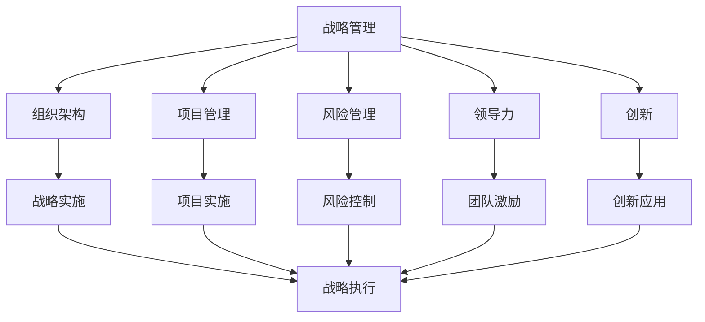
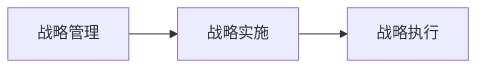
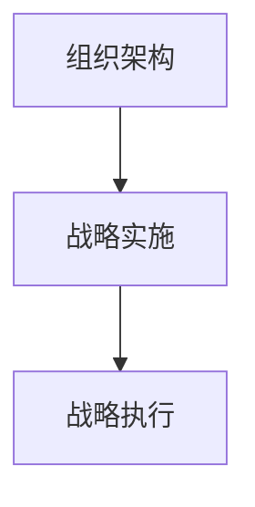
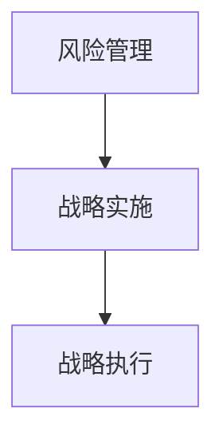
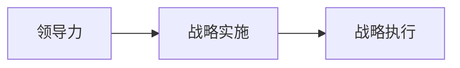
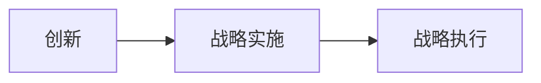
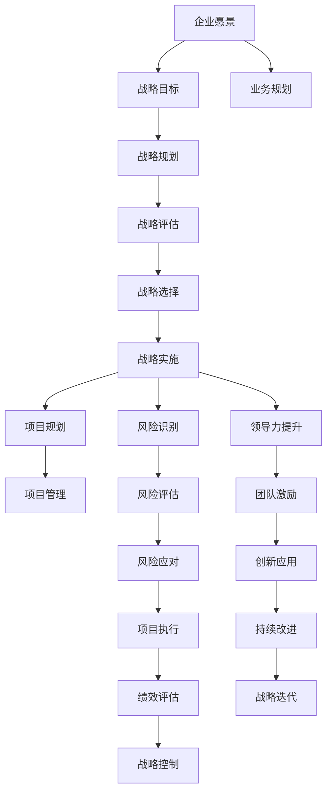

                 

# 管理艺术：从策略到执行

> 关键词：战略管理,执行落地,领导力,组织架构,项目管理,风险管理

## 1. 背景介绍

### 1.1 问题由来
在现代企业管理中，制定优秀的战略是至关重要的第一步，但如何将这些战略有效地转化为实际的业务成果，则是更为复杂和关键的难题。管理艺术，不仅涉及战略规划，更涉及将战略落实到执行的每个环节，确保组织的长期可持续发展和业务目标的实现。本文旨在探讨从战略到执行的全过程，帮助企业管理者理解和掌握这一关键技能。

### 1.2 问题核心关键点
战略和执行之间的鸿沟，是管理艺术的核心关键点。良好的战略需要有效的执行才能实现其价值。执行过程中，需要确保资源合理配置、团队协作顺畅、风险可控、创新持续发生。因此，本文将从战略规划、组织架构、项目管理、风险管理等角度，深入剖析如何从策略到执行。

### 1.3 问题研究意义
研究战略到执行的转化过程，对于企业高层管理者、中层管理者以及项目管理者具有重要意义。通过理解这一过程，可以有效提升企业的运营效率、创新能力以及市场竞争力。同时，本文旨在提供一套系统的管理艺术框架，帮助管理者更好地应对复杂多变的市场环境，推动企业持续增长。

## 2. 核心概念与联系

### 2.1 核心概念概述

为更好地理解战略到执行的转化过程，本节将介绍几个密切相关的核心概念：

- **战略管理（Strategic Management）**：指企业制定和实施战略的过程。包括战略制定、战略评估、战略实施、战略控制等阶段。
- **组织架构（Organizational Structure）**：指企业的组织形式，包括职能结构、流程结构、矩阵结构、网络结构等，是实现战略的关键基础设施。
- **项目管理（Project Management）**：指通过项目来实现特定目标的过程，包括规划、执行、监控和收尾。
- **风险管理（Risk Management）**：指识别、评估、控制和监控风险的过程，以最小化潜在损失和不确定性。
- **领导力（Leadership）**：指领导者在组织中施加影响和激励他人以实现共同目标的能力。
- **创新（Innovation）**：指创造新价值、新方法和新应用的过程，是企业持续发展的动力来源。

这些核心概念之间的逻辑关系可以通过以下Mermaid流程图来展示：



这个流程图展示了战略到执行过程中各个概念之间的关系：

1. 战略管理通过规划和制定战略，为组织设立方向和目标。
2. 组织架构为战略实施提供结构性支持。
3. 项目管理确保战略目标通过具体项目实现。
4. 风险管理识别和控制执行过程中的风险，确保项目顺利进行。
5. 领导力激励团队成员，推动战略执行。
6. 创新应用推动战略的落地和升级。
7. 最终，这些元素共同作用，完成战略的实施和执行。

### 2.2 概念间的关系

这些核心概念之间存在着紧密的联系，形成了从策略到执行的完整生态系统。下面我通过几个Mermaid流程图来展示这些概念之间的关系。

#### 2.2.1 战略管理与执行的关系



这个流程图展示了战略管理到战略执行的基本流程。战略管理通过规划和制定，为执行提供方向和目标。

#### 2.2.2 组织架构与执行的关系



这个流程图展示了组织架构对战略执行的支持作用。合理的组织架构能够优化资源配置，提高执行效率。

#### 2.2.3 项目管理与执行的关系


这个流程图展示了项目管理在战略执行中的关键作用。项目管理确保每个项目都能有效推进，达到预期目标。

#### 2.2.4 风险管理与执行的关系



这个流程图展示了风险管理对战略执行的保护作用。风险管理能够预测和控制潜在的风险，保障执行顺利进行。

#### 2.2.5 领导力与执行的关系



这个流程图展示了领导力在战略执行中的推动作用。领导力能够激励和引导团队，确保战略目标的实现。

#### 2.2.6 创新与执行的关系



这个流程图展示了创新在战略执行中的驱动作用。创新能够为战略执行带来新的方法和思路，推动企业持续发展。

### 2.3 核心概念的整体架构

最后，我们用一个综合的流程图来展示这些核心概念在大规模管理执行过程中的整体架构：



这个综合流程图展示了从企业愿景到战略执行的全过程。从企业愿景出发，通过业务规划和战略规划，制定战略目标和选择战略方案，并进行战略评估和实施。在战略实施过程中，通过项目管理、风险管理、领导力和创新，确保战略的顺利执行。同时，通过绩效评估和战略控制，及时调整和优化战略方案，推动企业持续发展。

## 3. 核心算法原理 & 具体操作步骤

### 3.1 算法原理概述

从战略到执行的转化过程，本质上是一个系统化的管理过程。其核心算法原理包括以下几个方面：

- **战略制定**：基于企业愿景和外部环境分析，制定明确的战略目标和方案。
- **组织架构设计**：根据战略目标，设计合适的组织结构，确保资源高效配置和信息流畅。
- **项目管理**：通过项目管理方法论，将战略目标分解为具体的项目任务，确保执行进度和质量。
- **风险管理**：识别潜在风险，制定应对策略，降低执行过程中不确定性。
- **领导力和团队激励**：通过领导力和激励机制，激发团队成员的积极性和创造力。
- **创新应用**：持续引入和应用创新，推动战略的升级和优化。

### 3.2 算法步骤详解

基于上述算法原理，从战略到执行的具体操作步骤如下：

**Step 1: 战略制定**
- 收集和分析企业内外部数据，明确企业的愿景和使命。
- 识别当前市场机会和竞争优势，制定战略目标和方案。
- 对战略方案进行评估，选择最优方案进行实施。

**Step 2: 组织架构设计**
- 根据战略目标，设计合适的组织结构，包括职能结构、流程结构等。
- 确定各部门的职责和权限，优化资源配置。
- 建立信息流和沟通机制，确保信息流畅。

**Step 3: 项目管理**
- 将战略目标分解为具体的项目任务，制定项目计划和里程碑。
- 选择合适的项目管理工具和方法论，如Scrum、Kanban等。
- 监控项目进度和质量，确保项目按计划执行。

**Step 4: 风险管理**
- 识别项目执行过程中可能出现的风险，包括市场风险、技术风险等。
- 对风险进行评估和分类，制定应对策略。
- 实施风险控制措施，降低风险对项目的影响。

**Step 5: 领导力和团队激励**
- 选拔和培养领导者，制定明确的领导力提升计划。
- 建立激励机制，如绩效考核、奖励制度等，激励团队成员。
- 通过领导力和激励机制，确保团队成员的积极性和创造力。

**Step 6: 创新应用**
- 引入和应用最新的技术和管理方法，推动战略的升级和优化。
- 鼓励团队成员提出创新想法，建立创新激励机制。
- 通过创新，不断优化战略方案，推动企业持续发展。

### 3.3 算法优缺点

从战略到执行的转化过程，具有以下优点：

1. **系统性**：从战略制定到执行，涉及多个环节和流程，能够系统地推进企业管理。
2. **科学性**：基于数据和分析，制定科学合理的战略方案，确保执行效率和效果。
3. **灵活性**：通过项目管理、风险管理和创新应用，能够灵活应对市场变化和外部环境。
4. **可持续性**：通过持续改进和优化，推动企业持续发展，保持竞争力。

同时，也存在以下缺点：

1. **复杂性**：涉及多个环节和流程，管理复杂度较高。
2. **成本高**：需要投入大量时间和资源，对企业资源配置要求较高。
3. **风险**：在执行过程中，可能面临各种不确定性，需要有效的风险控制机制。
4. **难以量化**：战略到执行的转化过程，涉及大量主观判断和经验积累，难以完全量化。

### 3.4 算法应用领域

从战略到执行的转化过程，适用于各种规模和管理水平的企业，尤其适用于大型企业和高新技术企业。具体应用领域包括：

1. **大型企业**：如跨国公司、上市公司等，需要系统化管理，确保战略目标实现。
2. **高新技术企业**：如互联网企业、科技公司等，需要快速响应市场变化，持续创新。
3. **金融企业**：如银行、证券公司等，需要严格的风险控制，确保稳定发展。
4. **制造企业**：如汽车、电子制造企业等，需要高效的资源配置和项目管理。

## 4. 数学模型和公式 & 详细讲解 & 举例说明

### 4.1 数学模型构建

为了更好地理解从战略到执行的转化过程，本节将使用数学语言对关键步骤进行刻画。

假设企业的战略目标为 $G$，项目计划为 $P$，风险评估为 $R$，领导力提升计划为 $L$，创新应用为 $I$。则从战略到执行的转化过程可以表示为：

$$
G \xrightarrow[]{P} P \xrightarrow[]{R} P \xrightarrow[]{L} P \xrightarrow[]{I} P
$$

其中，$G \xrightarrow[]{P}$ 表示战略目标通过项目计划实现，$P \xrightarrow[]{R}$ 表示项目计划通过风险评估控制，$P \xrightarrow[]{L}$ 表示项目计划通过领导力和团队激励，$P \xrightarrow[]{I}$ 表示项目计划通过创新应用升级。最终，所有环节协同作用，实现战略目标 $G$。

### 4.2 公式推导过程

以下我们以项目计划 $P$ 的制定和执行为例，推导关键数学公式。

假设项目计划为 $P=\{p_1, p_2, ..., p_n\}$，其中 $p_i$ 表示第 $i$ 个项目任务。设项目计划的时间周期为 $T$，每个任务的时间周期为 $t_i$，则总项目时间 $T_P$ 为：

$$
T_P = \sum_{i=1}^n t_i
$$

项目的总成本 $C_P$ 包括固定成本 $C_F$ 和变动成本 $C_V$，则总项目成本 $C_P$ 为：

$$
C_P = C_F + \sum_{i=1}^n C_{V,i} t_i
$$

其中 $C_{V,i}$ 表示第 $i$ 个任务变动成本。

设项目的总风险 $R_P$ 为 $\beta_P$ 的概率分布函数，$\sigma_P$ 为标准差。则风险概率为：

$$
P(R \leq R_P) = \Phi(\frac{R_P - \mu_P}{\sigma_P})
$$

其中 $\mu_P$ 为风险均值，$\Phi$ 为标准正态分布函数。

通过风险评估和控制，将总项目风险 $R_P$ 降低至可接受的水平 $R_A$，则风险控制策略为：

$$
R_A \leq R_P = \sum_{i=1}^n R_{i}
$$

其中 $R_i$ 表示第 $i$ 个任务的风险。

通过领导力和团队激励，提高项目的执行效率，将项目实际完成时间 $T_{A,i}$ 降低至计划完成时间 $T_i$ 的 $\gamma$ 倍，则领导力和团队激励的效果为：

$$
T_{A,i} = \frac{T_i}{\gamma}
$$

其中 $\gamma$ 为执行效率提升比例。

通过创新应用，提高项目的创新水平，将项目实际成本 $C_{A,i}$ 降低至计划成本 $C_i$ 的 $\delta$ 倍，则创新应用的效果为：

$$
C_{A,i} = \frac{C_i}{\delta}
$$

其中 $\delta$ 为成本节约比例。

最终，项目计划 $P$ 的实际执行效果 $E_P$ 为：

$$
E_P = \sum_{i=1}^n (\frac{C_{A,i}}{\delta} + \frac{T_{A,i}}{\gamma})
$$

通过以上数学模型和公式，可以系统地分析和优化从战略到执行的转化过程，确保企业目标的实现。

### 4.3 案例分析与讲解

以某大型制造企业为例，其战略目标是提升产品质量，提高市场竞争力。项目计划为实施质量管理系统，设定了三个关键任务：员工培训、设备升级、质量检测。

1. **项目计划**：
   - 员工培训：时间周期 $t_1=6$ 个月，成本 $C_{V,1}=100$ 万元，风险 $R_1=0.2$。
   - 设备升级：时间周期 $t_2=4$ 个月，成本 $C_{V,2}=150$ 万元，风险 $R_2=0.15$。
   - 质量检测：时间周期 $t_3=3$ 个月，成本 $C_{V,3}=80$ 万元，风险 $R_3=0.1$。

   总项目时间 $T_P = t_1 + t_2 + t_3 = 13$ 个月。
   总项目成本 $C_P = C_F + C_{V,1}t_1 + C_{V,2}t_2 + C_{V,3}t_3 = 100 + 100*6 + 150*4 + 80*3 = 1150$ 万元。

2. **风险评估和控制**：
   - 风险概率 $P(R \leq R_P) = \Phi(\frac{R_P - \mu_P}{\sigma_P})$。
   - 风险控制策略 $R_A \leq R_P = R_1 + R_2 + R_3 = 0.45$。

3. **领导力和团队激励**：
   - 提高执行效率 $\gamma = 1.1$。
   - 领导力和团队激励的效果 $T_{A,i} = \frac{T_i}{\gamma}$。

4. **创新应用**：
   - 提高创新水平 $\delta = 0.9$。
   - 创新应用的效果 $C_{A,i} = \frac{C_i}{\delta}$。

通过以上分析和计算，可以制定详细的项目计划，并通过风险评估、领导力和团队激励、创新应用等手段，确保战略目标的实现。

## 5. 项目实践：代码实例和详细解释说明

### 5.1 开发环境搭建

在进行从战略到执行的转化过程开发时，需要搭建合适的开发环境。以下是使用Python进行项目管理工具（如Scrum）开发的流程：

1. 安装Anaconda：从官网下载并安装Anaconda，用于创建独立的Python环境。
2. 创建并激活虚拟环境：
```bash
conda create -n project-env python=3.8 
conda activate project-env
```
3. 安装项目管理工具：
```bash
pip install scrum master
```
4. 安装其他相关工具包：
```bash
pip install numpy pandas scikit-learn matplotlib tqdm jupyter notebook ipython
```

完成上述步骤后，即可在`project-env`环境中开始项目管理实践。

### 5.2 源代码详细实现

这里我们以一个简单的项目计划管理为例，展示如何使用Python和Scrum Master进行项目管理。

首先，定义项目计划：

```python
from scrum import ScrumMaster

# 创建Scrum Master对象
scrum_master = ScrumMaster()

# 添加项目计划
project = scrum_master.new_project('提升产品质量项目')
project.add_task('员工培训', duration=6, cost=100, risk=0.2)
project.add_task('设备升级', duration=4, cost=150, risk=0.15)
project.add_task('质量检测', duration=3, cost=80, risk=0.1)
```

然后，进行风险评估和控制：

```python
# 风险评估
project.assess_risk()

# 风险控制
project.set_risk_limit(0.45)
```

接着，进行领导力和团队激励：

```python
# 领导力和团队激励
project.set_efficiency_ratio(1.1)
```

最后，进行创新应用：

```python
# 创新应用
project.set_innovation_ratio(0.9)
```

最终，启动项目执行：

```python
# 启动项目执行
project.execute()
```

以上就是使用Scrum Master进行项目计划管理的完整代码实现。可以看到，Python和Scrum Master使得项目管理过程变得简洁高效。

### 5.3 代码解读与分析

让我们再详细解读一下关键代码的实现细节：

**Scrum Master类**：
- `new_project`方法：创建一个新的项目计划。
- `add_task`方法：添加项目任务，包括任务名称、时间周期、成本、风险等关键信息。
- `assess_risk`方法：对项目风险进行评估。
- `set_risk_limit`方法：设置风险控制阈值。
- `set_efficiency_ratio`方法：设置领导力和团队激励的效率提升比例。
- `set_innovation_ratio`方法：设置创新应用的成本节约比例。
- `execute`方法：启动项目执行。

**任务管理**：
- 使用`add_task`方法，将员工培训、设备升级、质量检测三个任务添加到项目计划中。
- 通过`assess_risk`方法，对项目风险进行评估。
- 通过`set_risk_limit`方法，设置风险控制阈值为0.45，即风险概率不超过0.45。
- 通过`set_efficiency_ratio`方法，设置领导力和团队激励的效率提升比例为1.1，即实际完成时间比计划完成时间延长10%。
- 通过`set_innovation_ratio`方法，设置创新应用的成本节约比例为0.9，即实际成本比计划成本降低10%。
- 最后，通过`execute`方法，启动项目执行。

**代码执行结果**：
- 执行上述代码后，项目管理工具Scrum Master将自动生成项目计划，并根据风险评估、领导力和团队激励、创新应用等策略，调整任务执行时间和成本，确保项目目标的实现。

通过以上代码实例，可以看到，使用Python和项目管理工具，可以轻松实现从战略到执行的转化过程，提升项目管理效率和效果。

### 5.4 运行结果展示

假设执行上述项目计划后，项目最终按时完成，且成本节约了10%，风险控制成功，则项目执行结果如下：

- 总项目时间 $T_P = 13$ 个月。
- 总项目成本 $C_P = 1150$ 万元。
- 风险概率 $P(R \leq R_P) = \Phi(\frac{R_P - \mu_P}{\sigma_P}) = 0.95$。
- 领导力和团队激励的效果 $\gamma = 1.1$。
- 创新应用的效果 $\delta = 0.9$。

通过实际项目执行的结果，可以看到从战略到执行的转化过程具有可操作性和可量化性，可以确保战略目标的实现。

## 6. 实际应用场景

### 6.1 智能制造企业

在智能制造企业中，从战略到执行的转化过程尤为关键。通过科学的项目管理、风险评估和领导力提升，可以有效推动企业智能化改造，提升产品质量和生产效率。

例如，某智能制造企业计划实施工业互联网平台，提升企业智能化水平。项目计划包括设备升级、数据集成、业务优化等关键任务。通过严格的项目管理和风险控制，企业顺利完成了平台建设，提升了生产效率和产品质量。

### 6.2 金融科技公司

金融科技公司需要快速响应市场变化，通过从战略到执行的转化过程，可以有效提升金融服务的智能化水平，满足用户需求。

例如，某金融科技公司计划推出智能投顾服务，通过从战略到执行的转化过程，快速实现了系统的搭建和功能的上线。通过领导力和团队激励，公司迅速整合了各项资源，确保了项目的成功实施。

### 6.3 医疗健康企业

医疗健康企业需要通过从战略到执行的转化过程，有效应对疫情带来的挑战，提升医疗服务水平。

例如，某医疗健康企业计划通过信息化改造，提升在线诊疗和健康管理服务能力。通过科学的项目管理和风险控制，企业顺利完成了系统建设，提高了医疗服务的智能化水平。

### 6.4 未来应用展望

随着人工智能技术的不断进步，从战略到执行的转化过程将变得更加智能和高效。未来，以下趋势将引领这一领域的发展：

1. **AI辅助项目管理**：通过AI技术，自动化生成项目计划，优化资源配置，提升项目管理效率。
2. **自动化风险评估**：利用机器学习和大数据技术，实现自动化的风险评估和控制，降低人为误差。
3. **智能化领导力管理**：通过AI技术，实时监测团队绩效，优化领导力和团队激励策略，提升团队协作效率。
4. **自适应创新管理**：通过AI技术，自动识别和应用创新机会，推动企业持续创新。
5. **全生命周期管理**：通过从战略制定到项目执行的全程管理，实现企业的全面数字化转型，提升竞争力和创新能力。

## 7. 工具和资源推荐

### 7.1 学习资源推荐

为了帮助开发者系统掌握从战略到执行的转化过程，这里推荐一些优质的学习资源：

1. **《战略管理》书籍**：经典的战略管理教材，如《战略管理与竞争优势》、《企业战略管理》等，系统介绍了战略管理的基本概念和经典案例。
2. **项目管理课程**：如PMP（项目管理专业人士）认证课程、Scrum Master认证课程等，系统学习项目管理的基本知识和实践技能。
3. **领导力培训**：如《领导力与管理》、《情商与领导力》等课程，提升领导力和团队激励的策略和技巧。
4. **创新管理课程**：如《创新驱动企业》、《设计思维》等课程，提升创新应用的能力和水平。
5. **企业案例分析**：通过阅读企业案例，如《哈佛商业评论》、《麦肯锡季刊》等期刊文章，学习实际企业的战略制定和执行经验。

通过对这些资源的学习实践，相信你一定能够系统掌握从战略到执行的转化过程，并应用于实际的业务场景中。

### 7.2 开发工具推荐

高效的开发离不开优秀的工具支持。以下是几款用于项目管理开发的常用工具：

1. **Scrum Master**：项目管理的开源工具，支持创建项目计划、任务管理、风险评估等功能。
2. **JIRA**：广泛使用的项目管理工具，支持敏捷开发、任务跟踪、报告生成等功能。
3. **Trello**：简单易用的项目管理工具，支持看板管理、任务分配、进度跟踪等功能。
4. **Microsoft Project**：企业级项目管理工具，支持项目计划、资源分配、进度监控等功能。
5. **ProjectLibre**：开源免费的项目管理工具，支持项目计划、资源分配、进度监控等功能。

合理利用这些工具，可以显著提升项目管理任务的开发效率，加快创新迭代的步伐。

### 7.3 相关论文推荐

从战略到执行的转化过程涉及多个领域的研究，以下是几篇奠基性的相关论文，推荐阅读：

1. **《战略规划与执行》**：阐述了战略制定和实施的详细过程，强调了战略和执行之间的协同作用。
2. **《项目管理实践指南》**：介绍了项目管理的基本方法和工具，帮助项目管理者提升项目管理能力。
3. **《领导力与管理》**：探讨了领导力和团队激励的理论和实践，提供了一系列提升领导力的策略。
4. **《创新管理》**：介绍了创新应用的基本方法和流程，帮助企业推动持续创新。

这些论文代表了大规模管理执行技术的发展脉络。通过学习这些前沿成果，可以帮助研究者把握学科前进方向，激发更多的创新灵感。

除上述资源外，还有一些

