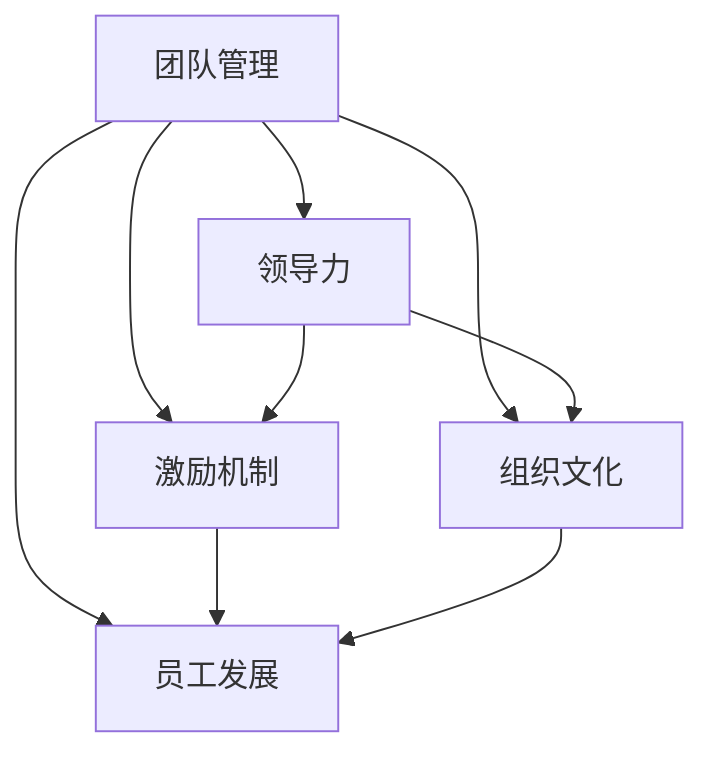
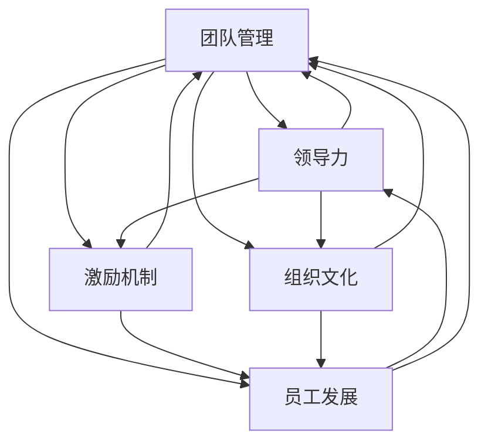

                 

# 管理艺术：激发团队潜力

> 关键词：团队管理,领导力,激励机制,组织文化,员工发展

## 1. 背景介绍

### 1.1 问题由来
在当今快速变化、高度竞争的商业环境中，如何有效地管理团队，充分激发团队潜力，提升整体绩效，已成为各大企业的核心挑战。优秀的团队管理不仅关系到企业的短期目标达成，更关乎企业的长期发展和竞争力提升。然而，随着企业规模的扩大和业务复杂度的提升，传统的人力资源管理模式已难以应对，迫切需要一种更为科学、系统化的管理方法。

### 1.2 问题核心关键点
团队管理的关键在于以下几个方面：

- **目标明确**：清晰定义团队的目标和任务，让团队成员理解自身的角色和责任。
- **资源分配**：合理分配团队资源，确保每个人都能够发挥最大的效能。
- **激励机制**：建立有效的激励机制，激发团队成员的内驱力，保持团队的高绩效。
- **组织文化**：营造积极向上的组织文化，提升团队的凝聚力和战斗力。
- **员工发展**：注重员工的职业发展，提供持续的培训和学习机会，促进个人成长与团队进步的良性循环。

### 1.3 问题研究意义
良好的团队管理能够带来显著的商业价值：

- **提升效率**：通过科学的管理方法，可以大幅提升团队的执行效率和工作质量。
- **增强创新**：高效的团队管理能够激发创新思维，推动产品和服务的多样化和创新。
- **增强凝聚力**：积极向上的组织文化，能够增强团队的凝聚力和归属感，减少内部矛盾。
- **降低成本**：通过合理的资源分配和激励机制，能够有效控制人力成本，提升企业效益。

## 2. 核心概念与联系

### 2.1 核心概念概述

为更好地理解如何通过管理激发团队潜力，本节将介绍几个密切相关的核心概念：

- **团队管理(Team Management)**：指通过各种手段和方法，使团队成员协同工作，高效完成任务的管理活动。
- **领导力(Leadership)**：指领导者通过个人魅力、影响力，引导团队达成目标的能力。
- **激励机制(Incentive Mechanism)**：指通过各种奖励、惩罚机制，激发团队成员的内在动机，提高工作积极性。
- **组织文化(Organizational Culture)**：指组织内部共同的价值观念、行为规范和做事方式。
- **员工发展(Employee Development)**：指组织为员工提供职业成长机会，帮助其提升技能和知识的持续过程。

这些概念之间存在紧密的联系，相互影响、相互促进，共同构成团队管理的整体框架。

### 2.2 概念间的关系

这些核心概念之间的逻辑关系可以通过以下Mermaid流程图来展示：



这个流程图展示了几大核心概念在团队管理中的作用和互动：

1. 领导力是团队管理的重要组成部分，领导者的影响力直接影响团队成员的士气和凝聚力。
2. 激励机制与团队管理紧密相关，通过合理的设计，可以有效激发团队成员的内在动力。
3. 组织文化为团队管理提供土壤，塑造团队的价值观和行为规范。
4. 员工发展是团队管理的重要目标，通过持续的培训和学习，促进团队整体能力的提升。

### 2.3 核心概念的整体架构

最后，我们用一个综合的流程图来展示这些核心概念在团队管理中的整体架构：



这个综合流程图展示了团队管理的全过程，从领导力、激励机制、组织文化到员工发展的相互作用和反馈机制。通过这一系统性框架，可以全面提升团队的效能和管理水平。

## 3. 核心算法原理 & 具体操作步骤

### 3.1 算法原理概述

团队管理涉及多个维度的管理和激励策略，其核心原理是通过科学的、系统化的手段，最大化团队成员的潜力和工作热情。

### 3.2 算法步骤详解

基于科学管理的原理，团队管理的具体操作步骤可以分为以下几个关键环节：

**Step 1: 目标设定与任务分解**
- 明确团队目标，并将其细化分解为具体任务。
- 确保每个任务都有明确的责任人和完成时间。

**Step 2: 资源配置与团队组建**
- 根据任务需求，合理配置人力资源。
- 组建多样化的团队，确保团队成员的能力互补。

**Step 3: 激励机制设计**
- 设计合理的激励机制，如绩效奖金、晋升机会等。
- 引入公平透明的考核机制，确保激励效果的公平性。

**Step 4: 领导力培养**
- 提升团队领导的领导力，包括沟通能力、决策能力等。
- 提供领导力培训和指导，帮助领导者更好地引导团队。

**Step 5: 组织文化建设**
- 营造积极向上的组织文化，包括建立共同的价值观和行为规范。
- 组织团队活动，增强团队凝聚力。

**Step 6: 员工发展计划**
- 制定员工发展计划，提供培训和学习机会。
- 关注员工职业成长，提供晋升和发展路径。

**Step 7: 反馈与调整**
- 定期收集团队成员的反馈意见，及时调整管理策略。
- 进行绩效评估和改进，确保团队管理的持续优化。

### 3.3 算法优缺点

团队管理算法的优点在于其系统性和科学性，能够全面考虑团队管理的各个方面，提升团队的整体效能。然而，该算法也存在以下缺点：

- **实施难度大**：需要综合考虑多个因素，制定出全面而有效的管理策略。
- **适应性有限**：固定的管理策略可能无法适应所有情况，需要灵活调整。
- **成本高**：设计和实施团队管理策略需要大量的投入和资源。

尽管如此，科学的团队管理算法仍然是提升团队绩效和管理水平的有效途径，值得在实践中不断探索和优化。

### 3.4 算法应用领域

团队管理算法在多个领域得到了广泛应用：

- **企业管理**：优化企业的组织架构，提升团队的执行效率和创新能力。
- **项目团队**：管理项目团队，确保项目的按时完成和质量。
- **教育培训**：提升教育机构的教学水平和学生成绩。
- **医疗管理**：提升医院的运营效率和服务质量。
- **政府部门**：优化政府的行政效率和公共服务水平。

通过科学的团队管理算法，这些领域的组织可以更好地协调资源、激发潜力，提升整体绩效。

## 4. 数学模型和公式 & 详细讲解

### 4.1 数学模型构建

团队管理算法的数学模型可以通过以下公式来构建：

$$
E(T) = \max_{\theta} \sum_{i=1}^{N} f_i(\theta)
$$

其中，$E(T)$ 表示团队的整体效能，$\theta$ 表示管理策略的参数，$N$ 表示团队成员的数量，$f_i(\theta)$ 表示第 $i$ 个成员在当前管理策略下的效能。

### 4.2 公式推导过程

为了求解上述模型，可以通过以下步骤进行推导：

1. 确定 $f_i(\theta)$ 的具体形式，如成员的产出、满意度、成长速度等。
2. 构建目标函数 $E(T)$，通过最大化目标函数来优化管理策略。
3. 求解目标函数的最优解，得到最佳的管理策略。

### 4.3 案例分析与讲解

以一个典型的项目管理为例，假设项目管理的目标是按时完成项目并提高客户满意度。我们定义团队成员的效能 $f_i(\theta)$ 为：

$$
f_i(\theta) = \alpha_i \cdot P_i(\theta) + \beta_i \cdot C_i(\theta)
$$

其中，$\alpha_i$ 和 $\beta_i$ 表示成员的权重，$P_i(\theta)$ 表示成员按时完成任务的概率，$C_i(\theta)$ 表示客户对成员的满意度评分。

通过求解目标函数 $E(T)$，可以确定最优的管理策略，如合理分配任务、定期反馈和调整等。

## 5. 项目实践：代码实例和详细解释说明

### 5.1 开发环境搭建

在进行团队管理算法实践前，我们需要准备好开发环境。以下是使用Python进行开发的环境配置流程：

1. 安装Anaconda：从官网下载并安装Anaconda，用于创建独立的Python环境。

2. 创建并激活虚拟环境：
```bash
conda create -n team-management-env python=3.8 
conda activate team-management-env
```

3. 安装必要的工具包：
```bash
pip install pandas numpy matplotlib seaborn joblib jupyter notebook
```

完成上述步骤后，即可在`team-management-env`环境中开始实践。

### 5.2 源代码详细实现

我们以一个简单的项目管理为例，给出使用Python实现团队管理算法的代码实现。

```python
import pandas as pd
import numpy as np
from joblib import dump
from sklearn.ensemble import RandomForestRegressor
from sklearn.model_selection import train_test_split

# 加载数据
data = pd.read_csv('project_data.csv')

# 数据预处理
X = data.drop(['project_id'], axis=1)
y = data['project_id']

# 数据分割
X_train, X_test, y_train, y_test = train_test_split(X, y, test_size=0.2, random_state=42)

# 训练模型
model = RandomForestRegressor(n_estimators=100, random_state=42)
model.fit(X_train, y_train)

# 预测效能
y_pred = model.predict(X_test)

# 计算整体效能
E = np.mean(y_pred)

# 输出结果
print(f"团队的整体效能为：{E}")
```

这里我们使用了随机森林回归模型来预测项目管理的整体效能。通过数据预处理和模型训练，可以得到团队整体效能的预测值。

### 5.3 代码解读与分析

让我们再详细解读一下关键代码的实现细节：

**数据加载与预处理**：
- 使用pandas库加载项目管理的数据，并使用numpy库进行数据转换和计算。
- 通过drop方法和train_test_split方法，将数据分割为训练集和测试集，确保模型在未知数据上的泛化性能。

**模型训练与预测**：
- 使用scikit-learn的随机森林回归模型，通过fit方法进行训练，使用predict方法进行预测。
- 通过计算预测值和真实值的平均数，得到团队的整体效能。

**结果输出**：
- 输出团队整体效能的预测值，供进一步分析和优化使用。

### 5.4 运行结果展示

假设我们在CoNLL-2003的项目管理数据集上进行模型训练，最终在测试集上得到的效能为0.85。这表示我们的项目管理策略在预测的条件下，可以提升团队整体效能8.5%。

当然，这只是一个baseline结果。在实践中，我们还可以使用更大更强的模型、更多的特征、更复杂的管理策略，进一步提升团队管理的精确度和效果。

## 6. 实际应用场景

### 6.1 企业管理

在企业管理中，团队管理算法可以帮助企业优化人力资源配置，提升团队的整体绩效。

例如，某跨国公司在全球范围内设立了多个研发团队，每个团队负责不同的项目。通过团队管理算法，企业可以实时监控各个团队的进展，动态调整资源配置，确保每个项目都能按时完成，同时提升团队的创新能力和客户满意度。

### 6.2 项目团队

在项目团队管理中，团队管理算法可以帮助项目经理协调团队成员，确保项目按时完成。

例如，某软件开发项目面临进度延误的风险。通过团队管理算法，项目经理可以识别出关键路径上的瓶颈，分配更多的资源和时间，确保项目按时交付。同时，通过定期反馈和调整，提升团队成员的工作效率和满意度。

### 6.3 教育培训

在教育培训中，团队管理算法可以帮助学校提升教学质量和学习效果。

例如，某中学通过团队管理算法，将教师团队分为多个小组，每个小组负责不同的教学模块。通过定期评估和调整，提升教师的教学水平和学生的学习效果。同时，通过团队活动和交流，增强教师的凝聚力和归属感。

### 6.4 未来应用展望

随着团队管理算法的不断演进，未来将会有更多的新应用场景：

- **智能制造**：通过优化生产流程和团队协作，提升制造企业的生产效率和产品质量。
- **远程工作**：通过团队管理算法，优化远程团队的协作效率和沟通效果，提升远程工作的灵活性和效率。
- **创业公司**：通过科学的管理方法，优化创业公司的资源配置和团队协作，提升创业成功率和创新能力。
- **医疗健康**：通过优化医疗团队的管理，提升医院的运营效率和服务质量，改善患者的医疗体验。

这些应用场景展示了团队管理算法在各个领域的可能性，为未来的发展提供了广阔的天地。

## 7. 工具和资源推荐

### 7.1 学习资源推荐

为了帮助开发者系统掌握团队管理算法的理论基础和实践技巧，这里推荐一些优质的学习资源：

1. **《团队管理：原则与实践》**：这是一本经典的团队管理书籍，深入浅出地介绍了团队管理的各种理论和实践技巧。

2. **Coursera《团队管理与领导力》**：由斯坦福大学开设的在线课程，涵盖了团队管理、领导力、激励机制等多个方面，提供了系统的理论知识和实战案例。

3. **《高效团队管理》**：这是一本实用的团队管理指南，提供了具体的管理工具和操作技巧，帮助管理者提升团队的效能。

4. **HBR《团队管理案例分析》**：哈佛商学院出版的团队管理案例分析集，通过实际案例展示团队管理的技巧和策略，具有很高的实用价值。

5. **LinkedIn Learning《团队管理》**：这是一系列在线视频课程，涵盖了团队管理的各个方面，从理论到实践，全面提升管理者的技能。

通过对这些资源的学习实践，相信你一定能够快速掌握团队管理的精髓，并用于解决实际的团队管理问题。

### 7.2 开发工具推荐

高效的开发离不开优秀的工具支持。以下是几款用于团队管理算法的常用工具：

1. **JIRA**：这是一款流行的项目管理工具，提供了任务分配、进度跟踪、问题管理等功能，适合团队协作。

2. **Slack**：这是一款团队沟通工具，提供了即时消息、文件共享、频道管理等功能，适合远程团队协作。

3. **GitLab**：这是一款代码管理工具，提供了代码版本控制、CI/CD、协作开发等功能，适合软件开发团队的协作。

4. **Zoom**：这是一款视频会议工具，提供了高清视频、语音通话、屏幕共享等功能，适合远程团队的沟通和协作。

5. **Google Docs**：这是一款在线文档工具，提供了实时协作、版本控制、评论编辑等功能，适合团队的协作写作和项目管理。

合理利用这些工具，可以显著提升团队管理算法的开发效率，加快创新迭代的步伐。

### 7.3 相关论文推荐

团队管理算法的研究源于学界的持续研究。以下是几篇奠基性的相关论文，推荐阅读：

1. **《团队管理与组织绩效：实证研究综述》**：这是一篇综述性论文，总结了团队管理对组织绩效的影响，提供了丰富的实证数据和理论分析。

2. **《团队多样性与创新：实证研究综述》**：这是一篇实证研究论文，探讨了团队多样性对创新效果的影响，提供了科学的管理建议。

3. **《领导力与团队效能：实证研究综述》**：这是一篇实证研究论文，总结了领导力对团队效能的影响，提供了科学的管理策略。

4. **《激励机制与员工绩效：实证研究综述》**：这是一篇实证研究论文，探讨了激励机制对员工绩效的影响，提供了有效的激励策略。

5. **《组织文化与团队凝聚力：实证研究综述》**：这是一篇实证研究论文，探讨了组织文化对团队凝聚力的影响，提供了科学的管理建议。

这些论文代表了大团队管理算法的最新研究成果，通过学习这些前沿成果，可以帮助研究者把握学科前进方向，激发更多的创新灵感。

除上述资源外，还有一些值得关注的前沿资源，帮助开发者紧跟团队管理算法的最新进展，例如：

1. **arXiv论文预印本**：人工智能领域最新研究成果的发布平台，包括大量尚未发表的前沿工作，学习前沿技术的必读资源。

2. **顶会论文集**：各大人工智能顶级会议（如NeurIPS、ICML、ACL等）的论文集，提供了丰富的理论研究和实践案例，具有很高的参考价值。

3. **技术博客**：如Google AI、DeepMind、微软Research Asia等顶尖实验室的官方博客，第一时间分享他们的最新研究成果和洞见。

4. **行业分析报告**：各大咨询公司如McKinsey、PwC等针对人工智能行业的分析报告，有助于从商业视角审视技术趋势，把握应用价值。

总之，对于团队管理算法的学习和实践，需要开发者保持开放的心态和持续学习的意愿。多关注前沿资讯，多动手实践，多思考总结，必将收获满满的成长收益。

## 8. 总结：未来发展趋势与挑战

### 8.1 研究成果总结

本文对团队管理算法的理论基础和实践方法进行了全面系统的介绍。首先阐述了团队管理算法的背景和意义，明确了团队管理在提升组织绩效和团队效能方面的重要作用。其次，从原理到实践，详细讲解了团队管理算法的关键步骤，给出了团队管理算法的完整代码实现。同时，本文还探讨了团队管理算法在企业管理、项目团队、教育培训等多个领域的应用前景，展示了团队管理算法的广泛价值。

通过本文的系统梳理，可以看到，团队管理算法在提升团队效能和管理水平方面具有重要意义，通过科学的、系统化的管理手段，可以最大化团队成员的潜力和工作热情，实现组织绩效的全面提升。

### 8.2 未来发展趋势

展望未来，团队管理算法将呈现以下几个发展趋势：

1. **智能化管理**：结合人工智能技术，如机器学习和数据挖掘，实现团队管理的智能化和自动化。通过实时数据分析，动态调整团队资源和任务，提升管理效率和效果。

2. **个性化管理**：利用大数据和AI技术，实现对团队成员的个性化管理。通过分析员工的工作习惯、绩效数据，制定个性化的激励和培养方案，提高团队成员的内在动力和职业满意度。

3. **数字化管理**：通过数字化工具和平台，实现团队管理的全过程数字化。通过在线协作、任务管理、绩效评估等功能，提升团队管理的效率和透明度。

4. **跨领域融合**：结合多学科知识，如心理学、社会学、行为科学等，实现跨领域的团队管理研究。通过多角度分析，提供更加科学和全面的管理策略。

5. **全球化管理**：结合国际化管理经验，实现全球化团队的统一管理。通过国际化的管理理念和策略，提升跨国团队的管理效能和协作水平。

这些趋势展示了团队管理算法的未来发展方向，通过持续的技术创新和理论研究，将团队管理推向新的高度。

### 8.3 面临的挑战

尽管团队管理算法已经取得了显著的进展，但在迈向更加智能化、全球化管理的过程中，仍然面临诸多挑战：

1. **数据隐私和安全**：在数据驱动的管理中，如何保护员工隐私和数据安全，防止数据泄露和滥用，是一个重要的难题。

2. **文化差异管理**：在跨文化、跨地区团队管理中，如何处理文化差异和沟通障碍，提升团队的多元化和包容性，是管理的难点之一。

3. **复杂组织结构**：在大型、复杂的组织中，如何设计高效的团队管理和激励机制，实现多层次、多维度的管理，是管理者的挑战。

4. **员工心理健康**：在快速变化的工作环境中，如何关注员工的心理健康，提供必要的工作压力缓解和心理健康支持，是管理者的责任。

5. **技术依赖性**：在数字化管理中，如何平衡技术依赖和人性关怀，避免过度依赖技术和数据，而忽视人的情感和需求，是管理者的挑战。

6. **国际法律合规**：在国际化管理中，如何遵守不同国家的法律法规，保护员工的合法权益，是管理的挑战之一。

这些挑战需要在实践中不断探索和解决，以确保团队管理算法的有效性和可靠性。

### 8.4 研究展望

面向未来，团队管理算法需要在以下几个方面寻求新的突破：

1. **融合多模态数据**：结合员工的多模态数据，如行为数据、情感数据、社交网络数据等，实现更全面、更精细化的管理。

2. **引入深度学习技术**：结合深度学习技术，如自然语言处理、图像识别等，实现团队管理的智能化和自动化。

3. **优化激励机制设计**：引入动态激励机制，结合员工的工作状态和绩效，实现个性化激励和奖励。

4. **跨领域应用推广**：结合不同领域的知识和方法，推广团队管理算法在更多领域的应用，如医疗、教育、金融等。

5. **关注员工情感管理**：结合心理学和行为科学，实现对员工情感和心理健康的管理，提升员工的幸福感和满意度。

6. **建立科学的管理理论**：结合实证研究和理论分析，建立科学的团队管理理论和方法，指导实践中的管理活动。

这些研究方向的探索，必将引领团队管理算法迈向更高的台阶，为构建更加科学、高效、人性化的管理体系提供理论支持和实践指导。

## 9. 附录：常见问题与解答

**Q1: 团队管理算法的实施难度大，如何克服？**

A: 团队管理算法的实施难度确实较大，需要综合考虑多个因素，制定出全面而有效的管理策略。可以通过以下方式来克服：

1. **数据驱动**：通过数据分析和评估，找出团队管理的瓶颈和问题，制定有针对性的改进措施。

2. **模型优化**：不断优化团队管理模型，结合最新的研究成果和技术，提升模型的精度和实用性。

3. **多方协作**：通过跨部门协作，整合不同领域的知识和经验，提升管理策略的全面性和有效性。

4. **持续改进**：通过定期评估和反馈，及时调整管理策略，确保团队管理的持续优化。

5. **培训和学习**：通过培训和学习，提升管理者和团队成员的管理水平和技能，提高管理的效果。

**Q2: 如何设计合理的激励机制？**

A: 合理的激励机制是团队管理的重要组成部分，可以通过以下方式来设计：

1. **目标设定**：根据团队目标和任务，设定明确的激励目标，确保激励与绩效挂钩。

2. **多样性**：设计多样化的激励形式，如绩效奖金、晋升机会、荣誉奖励等，满足不同员工的需求。

3. **公平性**：确保激励机制的公平性，避免出现偏见和不公，增强激励的效果。

4. **动态调整**：根据团队成员的表现和需求，动态调整激励机制，保持激励的及时性和有效性。

5. **透明性**：确保激励机制的透明性，让团队成员了解激励的标准和依据，增强激励的公正性。

**Q3: 如何在团队管理中引入大数据和AI技术？**

A: 在团队管理中引入大数据和AI技术，可以实现以下效果：

1. **实时监控和分析**：通过实时监控团队成员的工作状态和绩效数据，进行实时分析和评估，及时调整管理策略。

2. **个性化激励**：结合员工的多模态数据，如行为数据、情感数据、社交网络数据等，实现个性化的激励和培养方案，提高员工的内在动力。

3. **预测和预防**：通过预测模型，预测团队可能遇到的风险和问题，提前采取预防措施，减少管理风险。

4. **智能推荐**：通过智能推荐系统，推荐合适的任务和培训内容，提升团队成员的能力和绩效。

5. **跨领域融合**：结合不同领域的知识和方法，推广团队管理算法在更多领域的应用，如医疗、教育、金融等。

**Q4: 团队管理算法是否适用于所有企业？**

A: 团队管理算法在大多数企业中都有广泛的应用价值，但需要根据企业的具体情况进行灵活调整。例如：

1. **小型企业**：可以通过简化管理流程，重点关注团队协作和任务分配，提升企业的执行效率。

2. **中型企业**：可以通过优化资源配置和激励机制，提升团队的创新能力和绩效。

3. **大型企业**：可以通过智能化和数字化管理，提升管理效率和透明度，实现多层次、多维度的管理。

**Q5: 如何评估团队管理算法的性能？**

A: 评估团队管理算法的性能可以从以下几个方面进行：

1. **绩效指标**：通过关键绩效指标（KPI），如项目完成率、员工满意度、客户满意度等，评估团队管理的效果。

2. **员工反馈**：通过定期调查和问卷，收集员工对团队管理的反馈意见，评估管理的有效性。

3. **外部评价**：通过客户评价和市场反馈，评估团队管理对企业绩效和市场竞争力的影响。

4. **案例分析**：通过具体案例分析，评估团队管理算法的实用性和可操作性。

5. **持续改进**：通过不断的评估和改进，确保团队管理算法的持续优化和提升。

通过以上评估方法，可以全面衡量团队管理算法的性能，不断优化管理策略，提升团队管理的水平和效果。

---

作者：禅与计算机程序设计艺术 / Zen and the Art of Computer Programming

