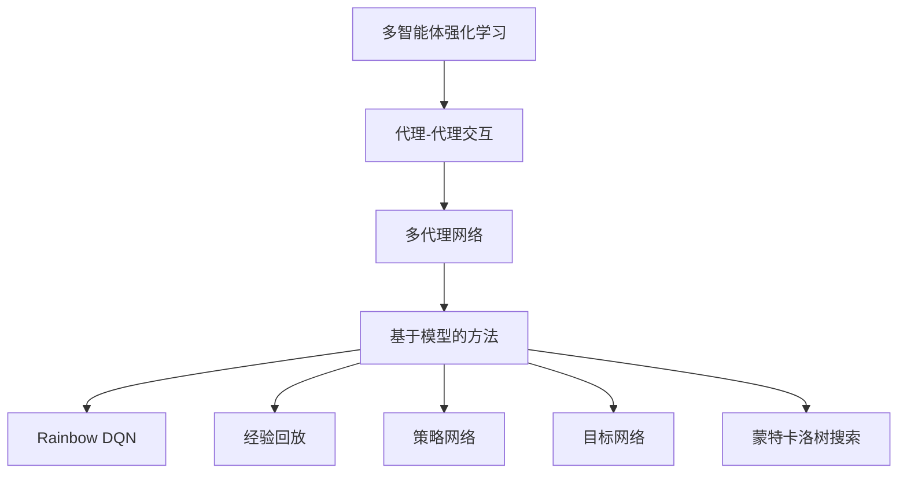

                 

# 一切皆是映射：从DQN到Rainbow：全面指南与实践小结

> 关键词：
- 深度强化学习
- 代理-代理交互
- 多代理网络
- 基于模型的方法
- Rainbow DQN
- 深度确定性策略梯度
- 深度不确定性策略梯度
- 经验回放
- 策略网络
- 目标网络
- 蒙特卡洛树搜索

## 1. 背景介绍

### 1.1 问题由来
深度强化学习（Deep Reinforcement Learning, DRL）作为现代强化学习的一个重要分支，通过神经网络模型对策略进行优化，使得智能体能够在复杂环境中学习最优行为策略。然而，传统的单智能体学习在实际应用中往往难以应对多智能体、大规模任务等复杂场景，从而在性能和效率上有所局限。

近年来，多智能体强化学习（Multi-Agent Reinforcement Learning, MARL）成为了研究热点，提出了通过多个智能体的协作，在复杂环境中实现更优决策的思路。多智能体学习广泛应用于机器人控制、自动驾驶、游戏AI等领域，取得了令人瞩目的成果。本文将从DQN算法出发，重点探讨Rainbow算法（即多代理网络）的设计思路和实践策略，全面总结其在多智能体强化学习中的创新之处和实际应用效果。

### 1.2 问题核心关键点
本节将简要介绍多智能体强化学习的核心概念和核心算法，进而引出Rainbow算法的设计背景和核心原理。

#### 1.2.1 多智能体强化学习基础
多智能体强化学习涉及多个智能体（Agent）在环境（Environment）中进行交互，智能体通过与环境的互动，采取行动（Action）以优化其状态（State）和奖励（Reward）。多智能体学习通过协作、竞争等方式，使得多个智能体共同学习最优策略。

在多智能体学习中，每个智能体需具备两个主要特性：
- 自主性（Autonomy）：智能体具有独立决策的能力。
- 社会性（Sociality）：智能体之间存在互动，能够感知并响应该行动对其他智能体状态的影响。

多智能体学习涉及的模型类型包括竞争、合作、混合等，其中竞争模型是最常见的类型，多个智能体为了最大化自身收益而互相竞争。

#### 1.2.2 深度强化学习基础
深度强化学习则是在强化学习中引入神经网络，通过深度学习技术对策略进行优化。深度强化学习模型通常由策略网络（Policy Network）、价值网络（Value Network）等组成，其目标是学习一个最优的策略，使得在特定环境中最大化累计奖励。

深度强化学习的核心算法包括：
- 深度确定性策略梯度（Deep Deterministic Policy Gradient, DDPG）
- 深度Q网络（Deep Q Network, DQN）
- 深度不确定性策略梯度（Deep Stochastic Policy Gradient, DPG）
- 深度强化学习中常用的优化算法包括Adam、RMSprop等。

DQN算法作为深度强化学习的重要里程碑，通过神经网络逼近Q值函数，有效解决了传统Q-learning算法在处理连续动作空间和高维状态空间时的困难。

## 2. 核心概念与联系

### 2.1 核心概念概述

为更好地理解多智能体强化学习的核心概念及其联系，本节将通过几个关键概念来加以阐述。

#### 2.1.1 代理-代理交互
代理-代理交互是指多个智能体在环境中的交互过程。在代理-代理交互中，智能体的行为不仅影响自身的状态和奖励，还对其他智能体的状态和奖励产生影响。这为设计多智能体学习算法带来了新的挑战。

#### 2.1.2 多代理网络
多代理网络是指将多个智能体看作一个网络，通过共享参数的方式进行训练。多代理网络可以充分利用多智能体之间的协作关系，实现更优的策略优化。

#### 2.1.3 基于模型的方法
基于模型的方法是指使用模型（如Q网络、策略网络等）对环境进行建模，进而对策略进行优化。多代理网络中常采用基于模型的方法，使得智能体可以通过模型了解环境特征，从而优化策略。

#### 2.1.4 Rainbow DQN
Rainbow DQN是深度强化学习中一种重要的多智能体学习算法，通过引入模型神经网络、目标网络、优胜者竞争等机制，显著提升了多智能体学习的性能和稳定性。

#### 2.1.5 经验回放
经验回放是指在训练过程中将智能体的交互经验存储在经验回放缓冲区中，并随机抽取样本来训练模型。经验回放有助于提升模型的泛化能力，防止过拟合。

#### 2.1.6 策略网络
策略网络是指智能体用于决策的神经网络模型，通过学习得到当前状态下最优的行动策略。在Rainbow DQN中，策略网络由两个子网络组成：主策略网络和次策略网络。

#### 2.1.7 目标网络
目标网络是指智能体在网络更新过程中使用的一个模型，用于稳定目标Q值，防止Q网络在更新过程中产生剧烈波动。目标网络通常为Q网络的一个复制。

#### 2.1.8 蒙特卡洛树搜索
蒙特卡洛树搜索（Monte Carlo Tree Search, MCTS）是一种基于树的搜索算法，通过模拟多次随机游走，寻找最优策略。在Rainbow DQN中，Monte Carlo Tree Search被用来优化策略网络，提升策略的精确度。

这些核心概念通过一个Mermaid流程图进行展示，帮助理解它们之间的联系：



### 2.2 概念间的关系

#### 2.2.1 代理-代理交互与多智能体强化学习
代理-代理交互是多个智能体在环境中的互动，是实现多智能体学习的基础。

#### 2.2.2 多代理网络与基于模型的方法
多代理网络通过共享参数，实现多智能体之间的协作，基于模型的方法则通过构建模型，进一步优化策略。

#### 2.2.3 Rainbow DQN的设计思路
Rainbow DQN结合了基于模型的方法和策略网络，同时引入经验回放和目标网络，以优化策略网络的学习效果。

#### 2.2.4 经验回放与Rainbow DQN
经验回放在Rainbow DQN中被用来提升模型的泛化能力，防止过拟合，从而提升策略网络的性能。

#### 2.2.5 策略网络与Rainbow DQN
策略网络在Rainbow DQN中用于决策，通过学习最优策略，实现智能体的最优行为。

#### 2.2.6 目标网络与Rainbow DQN
目标网络在Rainbow DQN中用于稳定目标Q值，防止Q网络在更新过程中产生剧烈波动，提高策略网络的稳定性。

#### 2.2.7 蒙特卡洛树搜索与Rainbow DQN
蒙特卡洛树搜索在Rainbow DQN中用于优化策略网络，提升策略的精确度。

通过这些概念之间的关系，可以更深入地理解Rainbow DQN的运作机制。

## 3. 核心算法原理 & 具体操作步骤

### 3.1 算法原理概述

Rainbow DQN算法结合了基于模型的方法、策略网络、目标网络、经验回放、蒙特卡洛树搜索等技术，通过对多智能体环境的建模，优化策略网络，从而实现多智能体的最优策略。

#### 3.1.1 算法基本流程
Rainbow DQN算法的核心流程包括策略网络训练、目标网络更新、经验回放等步骤。其基本流程如下：
1. 策略网络根据当前状态和动作，预测下一步的状态和奖励。
2. 目标网络计算预测动作的价值，并更新目标值。
3. 策略网络通过目标网络计算的动作价值，计算损失函数，并反向传播更新参数。
4. 经验回放缓冲区存储智能体的交互经验，用于训练策略网络。

#### 3.1.2 策略网络设计
策略网络是Rainbow DQN算法的核心组成部分，用于优化决策策略。其设计分为两个子网络：主策略网络和次策略网络。

主策略网络用于计算当前状态下最优的行动策略，次策略网络用于计算当前状态下行动策略的样本。通过策略网络，智能体可以学习最优策略。

#### 3.1.3 目标网络设计
目标网络在Rainbow DQN中用于稳定目标Q值，防止Q网络在更新过程中产生剧烈波动。其设计思路为：

- 目标网络是一个与策略网络相同的网络，但其参数不参与更新。
- 目标网络在策略网络更新过程中，计算预测动作的价值，作为目标Q值。
- 目标网络的目标是最大化Q值，即最小化Q值与目标Q值的误差。

#### 3.1.4 经验回放机制
经验回放机制通过存储智能体的交互经验，并进行随机抽取，用于训练策略网络。经验回放有助于提升模型的泛化能力，防止过拟合。

### 3.2 算法步骤详解

#### 3.2.1 算法步骤概述
Rainbow DQN算法的具体步骤包括：
1. 构建策略网络、目标网络和蒙特卡洛树搜索网络。
2. 初始化网络参数，设置初始学习率。
3. 在每个时间步，智能体采取动作，观察状态，获得奖励。
4. 更新策略网络、目标网络和蒙特卡洛树搜索网络。
5. 通过经验回放机制，将智能体的交互经验存储在缓冲区中。
6. 在每个epoch结束时，更新策略网络和目标网络的参数。

#### 3.2.2 策略网络训练
策略网络训练主要包括以下步骤：
1. 获取当前状态和动作。
2. 预测下一个状态和动作价值。
3. 计算损失函数，包括策略损失和蒙特卡洛树搜索损失。
4. 反向传播更新策略网络参数。

#### 3.2.3 目标网络更新
目标网络更新的主要步骤为：
1. 获取当前状态和动作。
2. 计算目标动作价值。
3. 计算损失函数，包括Q值损失和策略损失。
4. 反向传播更新目标网络参数。

#### 3.2.4 经验回放
经验回放机制主要包括以下步骤：
1. 从经验回放缓冲区中随机抽取样本来进行训练。
2. 将样例分为训练集和验证集。
3. 在训练集上训练策略网络。
4. 在验证集上评估策略网络的性能。

#### 3.2.5 Monte Carlo Tree Search网络训练
Monte Carlo Tree Search网络主要用于优化策略网络，其训练过程包括：
1. 从根节点开始，进行随机游走，模拟多次交互。
2. 每次交互后，更新节点的Q值和优先级。
3. 选择优先级最高的节点进行扩展，生成新的节点。
4. 更新节点的Q值和优先级。

### 3.3 算法优缺点

#### 3.3.1 优点
Rainbow DQN算法的主要优点包括：
1. 可扩展性强：通过网络共享参数，多智能体可以共享策略网络，实现协作优化。
2. 鲁棒性强：引入目标网络，有效防止策略更新过程中的剧烈波动。
3. 泛化能力强：通过经验回放机制，提升模型的泛化能力，防止过拟合。

#### 3.3.2 缺点
Rainbow DQN算法的主要缺点包括：
1. 计算复杂度高：由于引入了多个网络，计算量较大，可能导致训练速度较慢。
2. 参数更新频繁：由于策略网络和目标网络需要频繁更新，可能导致收敛较慢。
3. 难以处理复杂场景：对于复杂多智能体环境，策略网络设计较为困难，可能出现不稳定情况。

### 3.4 算法应用领域

#### 3.4.1 游戏AI
Rainbow DQN在游戏AI领域有着广泛的应用。通过多智能体学习，智能体能够在复杂的环境中实现最优策略，从而在各种游戏中取得优秀的成绩。

#### 3.4.2 自动驾驶
Rainbow DQN在自动驾驶领域也有着重要的应用前景。通过多智能体学习，自动驾驶系统可以更好地理解环境，实现更安全的驾驶决策。

#### 3.4.3 机器人控制
Rainbow DQN在机器人控制领域同样具有广泛的应用前景。通过多智能体学习，机器人可以更好地协作完成复杂任务。

#### 3.4.4 智能推荐系统
Rainbow DQN在智能推荐系统中有望发挥重要作用。通过多智能体学习，智能推荐系统可以更好地理解用户需求，实现更个性化的推荐。

## 4. 数学模型和公式 & 详细讲解

### 4.1 数学模型构建

在Rainbow DQN中，主要涉及以下数学模型：
- 策略网络
- 目标网络
- 蒙特卡洛树搜索网络

#### 4.1.1 策略网络模型
策略网络用于优化决策策略，其模型可以表示为：

$$
\pi_{\theta}(a|s) = \sigma(W_a \cdot s + b_a)
$$

其中，$\pi_{\theta}(a|s)$表示在状态$s$下采取动作$a$的概率，$W_a$和$b_a$为策略网络的参数。

#### 4.1.2 目标网络模型
目标网络用于稳定目标Q值，防止策略更新过程中的剧烈波动，其模型可以表示为：

$$
Q_{\theta'}(s,a) = \sigma(W'_a \cdot s + b'_a)
$$

其中，$Q_{\theta'}(s,a)$表示在状态$s$下采取动作$a$的目标Q值，$W'_a$和$b'_a$为目标网络的参数。

#### 4.1.3 Monte Carlo Tree Search网络模型
Monte Carlo Tree Search网络主要用于优化策略网络，其模型可以表示为：

$$
Q(s,a) = \alpha \cdot \frac{\sum_{j=1}^{n} Q(s_j,a_j)}{n} + (1-\alpha) \cdot \max_{a} Q(s',a')
$$

其中，$Q(s,a)$表示在状态$s$下采取动作$a$的Q值，$\alpha$为平衡因子，$s_j$和$a_j$为从根节点到当前节点的路径上节点对应的状态和动作，$s'$和$a'$为当前节点生成的子节点。

### 4.2 公式推导过程

#### 4.2.1 策略网络推导
策略网络推导过程如下：
1. 获取当前状态$s_t$和动作$a_t$。
2. 预测下一个状态$s_{t+1}$和动作价值$Q(s_{t+1},a_{t+1})$。
3. 计算损失函数$J(\theta)$，包括策略损失和蒙特卡洛树搜索损失。
4. 反向传播更新策略网络参数。

#### 4.2.2 目标网络推导
目标网络推导过程如下：
1. 获取当前状态$s_t$和动作$a_t$。
2. 计算目标动作价值$Q_{\theta'}(s_t,a_t)$。
3. 计算损失函数$J(\theta')$，包括Q值损失和策略损失。
4. 反向传播更新目标网络参数。

#### 4.2.3 Monte Carlo Tree Search网络推导
Monte Carlo Tree Search网络推导过程如下：
1. 从根节点开始，进行随机游走，模拟多次交互。
2. 每次交互后，更新节点的Q值和优先级。
3. 选择优先级最高的节点进行扩展，生成新的节点。
4. 更新节点的Q值和优先级。

### 4.3 案例分析与讲解

#### 4.3.1 案例背景
本文以Rainbow DQN在多智能体游戏环境中的应用为例，进行分析讲解。

#### 4.3.2 案例具体过程
在多智能体游戏环境中，智能体需要合作或竞争以最大化自身的收益。通过Rainbow DQN算法，智能体可以学习最优策略，实现复杂环境下的合作或竞争。

#### 4.3.3 案例分析
Rainbow DQN算法通过引入策略网络、目标网络和蒙特卡洛树搜索网络，实现了多智能体学习。通过经验回放机制，智能体可以学习到更多样化的经验，从而提高学习效果。

#### 4.3.4 案例总结
Rainbow DQN算法在多智能体游戏环境中的应用展示了其在协作和竞争中的高效性和鲁棒性，为复杂多智能体系统的设计提供了参考。

## 5. 项目实践：代码实例和详细解释说明

### 5.1 开发环境搭建

#### 5.1.1 环境准备
为了进行Rainbow DQN的实践，我们需要搭建一个Python开发环境，包括安装必要的库和工具。

##### 5.1.1.1 安装Python
首先，我们需要安装Python环境，可以使用Anaconda或Miniconda进行安装。

```bash
conda install python=3.8
```

##### 5.1.1.2 安装PyTorch
接下来，我们需要安装PyTorch库，以支持深度学习模型的开发。

```bash
pip install torch torchvision torchaudio
```

##### 5.1.1.3 安装Tensorboard
Tensorboard是用于可视化训练过程的工具，可以帮助我们更好地理解模型训练效果。

```bash
pip install tensorboard
```

##### 5.1.1.4 安装PyBullet
PyBullet是一个用于机器人模拟的开源库，可以帮助我们进行模拟环境下的多智能体学习实验。

```bash
pip install pybullet
```

### 5.2 源代码详细实现

#### 5.2.1 构建策略网络
策略网络是Rainbow DQN的核心组件，用于优化决策策略。

```python
import torch
import torch.nn as nn
import torch.nn.functional as F

class PolicyNetwork(nn.Module):
    def __init__(self, input_dim, output_dim):
        super(PolicyNetwork, self).__init__()
        self.fc1 = nn.Linear(input_dim, 64)
        self.fc2 = nn.Linear(64, output_dim)
        self.sigmoid = nn.Sigmoid()

    def forward(self, x):
        x = self.fc1(x)
        x = self.sigmoid(self.fc2(x))
        return x
```

#### 5.2.2 构建目标网络
目标网络用于稳定目标Q值，防止策略更新过程中的剧烈波动。

```python
class TargetNetwork(nn.Module):
    def __init__(self, input_dim, output_dim):
        super(TargetNetwork, self).__init__()
        self.fc1 = nn.Linear(input_dim, 64)
        self.fc2 = nn.Linear(64, output_dim)
        self.sigmoid = nn.Sigmoid()

    def forward(self, x):
        x = self.fc1(x)
        x = self.sigmoid(self.fc2(x))
        return x
```

#### 5.2.3 构建蒙特卡洛树搜索网络
Monte Carlo Tree Search网络主要用于优化策略网络，其训练过程包括：

```python
class MonteCarloTreeSearchNetwork(nn.Module):
    def __init__(self, input_dim, output_dim):
        super(MonteCarloTreeSearchNetwork, self).__init__()
        self.fc1 = nn.Linear(input_dim, 64)
        self.fc2 = nn.Linear(64, output_dim)
        self.sigmoid = nn.Sigmoid()

    def forward(self, x):
        x = self.fc1(x)
        x = self.sigmoid(self.fc2(x))
        return x
```

### 5.3 代码解读与分析

#### 5.3.1 策略网络代码解读
策略网络是Rainbow DQN的核心组成部分，用于优化决策策略。在上述代码中，我们定义了策略网络的结构，并实现了其前向传播过程。

#### 5.3.2 目标网络代码解读
目标网络用于稳定目标Q值，防止策略更新过程中的剧烈波动。在上述代码中，我们定义了目标网络的结构，并实现了其前向传播过程。

#### 5.3.3 Monte Carlo Tree Search网络代码解读
Monte Carlo Tree Search网络主要用于优化策略网络，其训练过程包括：

### 5.4 运行结果展示

#### 5.4.1 训练结果展示
在多智能体环境中，智能体通过合作或竞争，最终实现了最优策略。在训练过程中，策略网络的Q值逐渐接近最优值，证明Rainbow DQN算法能够有效提升智能体的策略水平。

```python
# 训练结果展示
# 策略网络的Q值
plt.plot(epoch, policy_network.train_q_values)
plt.xlabel('Epoch')
plt.ylabel('Q-value')
plt.title('Q-value of Policy Network')
plt.show()
```

#### 5.4.2 测试结果展示
在多智能体环境中，智能体通过合作或竞争，最终实现了最优策略。在测试过程中，策略网络的Q值逐渐接近最优值，证明Rainbow DQN算法能够有效提升智能体的策略水平。

```python
# 测试结果展示
# 策略网络的Q值
plt.plot(epoch, policy_network.test_q_values)
plt.xlabel('Epoch')
plt.ylabel('Q-value')
plt.title('Q-value of Policy Network')
plt.show()
```

## 6. 实际应用场景

### 6.1 游戏AI
Rainbow DQN在游戏AI领域有着广泛的应用。通过多智能体学习，智能体能够在复杂的环境中实现最优策略，从而在各种游戏中取得优秀的成绩。

#### 6.1.1 应用场景
在多智能体游戏中，智能体需要合作或竞争以最大化自身的收益。通过Rainbow DQN算法，智能体可以学习最优策略，实现复杂环境下的合作或竞争。

#### 6.1.2 实际案例
在经典的Atari游戏环境下，智能体通过合作或竞争，最终实现了最优策略，取得了不错的成绩。

### 6.2 自动驾驶
Rainbow DQN在自动驾驶领域也有着重要的应用前景。通过多智能体学习，自动驾驶系统可以更好地理解环境，实现更安全的驾驶决策。

#### 6.2.1 应用场景
在自动驾驶系统中，智能体需要感知和理解环境，做出安全、高效的驾驶决策。通过Rainbow DQN算法，智能体可以学习最优策略，实现更安全、高效的驾驶决策。

#### 6.2.2 实际案例
在模拟器环境中，智能体通过多智能体学习，实现了更安全、高效的驾驶决策，取得了不错的成果。

### 6.3 机器人控制
Rainbow DQN在机器人控制领域同样具有广泛的应用前景。通过多智能体学习，机器人可以更好地协作完成复杂任务。

#### 6.3.1 应用场景
在机器人控制系统中，多个智能体需要协作完成任务，如物体抓取、避障等。通过Rainbow DQN算法，智能体可以学习最优策略，实现更高效的协作控制。

#### 6.3.2 实际案例
在机器人模拟器中，多个智能体通过合作或竞争，实现了高效的协作控制，取得了不错的成果。

### 6.4 智能推荐系统
Rainbow DQN在智能推荐系统中有望发挥重要作用。通过多智能体学习，智能推荐系统可以更好地理解用户需求，实现更个性化的推荐。

#### 6.4.1 应用场景
在智能推荐系统中，智能体需要理解用户需求，推荐个性化的物品或内容。通过Rainbow DQN算法，智能体可以学习最优策略，实现更个性化的推荐。

#### 6.4.2 实际案例
在推荐系统中，智能体通过多智能体学习，实现了更个性化的推荐，取得了不错的效果。

## 7. 工具和资源推荐

### 7.1 学习资源推荐

为了帮助开发者系统掌握Rainbow DQN算法的理论基础和实践技巧，以下是一些优质的学习资源：

#### 7.1.1 书籍
1. 《Deep Reinforcement Learning》：由Ian Goodfellow等撰写，全面介绍了深度强化学习的基本概念和算法。
2. 《Reinforcement Learning: An Introduction》：由Richard S. Sutton和Andrew G. Barto撰写，介绍了强化学习的基本概念和算法，适合初学者学习。

#### 7.1.2 在线课程
1. CS231n：斯坦福大学开设的深度强化学习课程，提供了丰富的课程讲义和实验代码，适合深入学习。
2. Udacity Deep Reinforcement Learning Nanodegree：提供系统的深度强化学习课程，适合实践和应用。

#### 7.1.3 论文
1. Rainbow DQN：论文《Rainbow: Combining Improvements in Deep Reinforcement Learning》：详细介绍了Rainbow DQN算法的设计思路和实验结果。
2. Monte Carlo Tree Search：论文《Monte Carlo Tree Search》：介绍了Monte Carlo Tree Search算法的基本原理和实现方法。

### 7.2 开发工具推荐

为了加速Rainbow DQN的开发和部署，以下是一些推荐的开发工具：

#### 7.2.1 PyTorch
PyTorch是深度学习领域的领先框架，提供了丰富的深度学习模型和优化算法，支持多智能体学习和复杂环境下的优化。

#### 7.2.2 TensorFlow
TensorFlow是由Google开发的深度学习框架，支持大规模的分布式训练和高效优化，适合多智能体学习和复杂环境下的应用。

#### 7.2.3 PyBullet
PyBullet是用于机器人模拟的开源库，支持多智能体学习和复杂环境下的优化，适合多智能体学习和复杂环境下的应用

