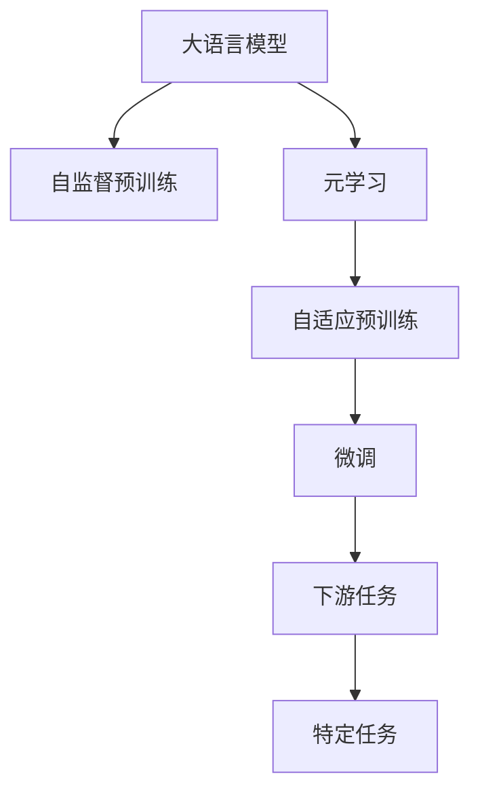

                 

## 1. 背景介绍

### 1.1 问题由来
自然语言处理（NLP）领域的技术创新日新月异，从传统的词袋模型、基于规则的语法分析到神经网络模型的兴起，都深刻地改变了NLP的研究范式和应用场景。特别是近年来，基于深度学习的大规模预训练语言模型（Large Language Models, LLMs）的出现，使得NLP技术取得了前所未有的突破。

大语言模型通过在海量无标签文本数据上进行自监督预训练，学习到了丰富的语言知识和常识，从而在自然语言理解、生成、推理等任务上展现了超凡的性能。例如，GPT-3、BERT、T5等模型在各种NLP任务中取得了SOTA（State-of-the-Art）的性能，使得大语言模型成为了NLP研究的新方向。

然而，这些大语言模型虽然在大规模预训练后具有强大的泛化能力，但在特定领域和任务上的性能仍需进一步优化。此外，预训练和微调过程的高昂成本和资源需求，也限制了其在大规模行业应用中的普及。因此，如何在大规模预训练的基础上，针对特定任务进行高效、可扩展的微调，成为了当前NLP研究的一个重要课题。

### 1.2 问题核心关键点
元学习（Meta Learning）技术为解决上述问题提供了一种新的思路。元学习旨在通过学习如何快速适应新任务，从而避免从头开始训练的冗余工作，减少数据和计算资源的消耗，提高模型训练和推理的效率。在NLP领域，基于元学习的预训练方法，可以在保留预训练模型的通用语言表示的同时，快速适应新任务，实现高效、灵活的微调。

基于元学习的预训练方法的核心思想是：在大规模数据上进行预训练，学习到一种通用的适应机制（Adaptation Mechanism），然后在新任务上快速进行微调。这种方法既保留了预训练模型的强大泛化能力，又实现了对特定任务的快速适应，是一种非常高效、可扩展的预训练方法。

### 1.3 问题研究意义
研究基于元学习的自然语言处理模型预训练方法，对于拓展大语言模型的应用范围，提升模型在特定任务上的性能，加速NLP技术的产业化进程，具有重要意义：

1. **降低预训练成本**：元学习预训练方法可以在大规模数据上进行高效学习，避免从头开始训练，从而显著降低预训练的成本和时间。
2. **提升模型性能**：通过元学习，模型能够更好地适应特定任务，在应用场景中取得更优表现，提升模型在特定领域的应用效果。
3. **提高模型泛化能力**：元学习方法通过学习通用的适应机制，使得模型在各种任务上具备更强的泛化能力，能够快速适应新任务和新数据。
4. **加速模型部署**：元学习预训练方法可以在大规模预训练之后，快速进行微调，加速模型在实际应用中的部署和优化。
5. **促进技术创新**：元学习技术为NLP研究提供了新的研究方向，推动了NLP技术的不断进步和创新。

## 2. 核心概念与联系

### 2.1 核心概念概述

为了更好地理解基于元学习的自然语言处理模型预训练方法，本节将介绍几个密切相关的核心概念：

- **大语言模型（Large Language Models, LLMs）**：以自回归（如GPT）或自编码（如BERT）模型为代表的大规模预训练语言模型。通过在大规模无标签文本语料上进行预训练，学习到丰富的语言知识和常识。

- **自监督预训练（Self-supervised Pre-training）**：在大规模无标签文本数据上，通过自监督学习任务（如掩码语言模型、预测下一句等）训练通用语言模型的过程。自监督预训练使得模型学习到语言的通用表示。

- **元学习（Meta Learning）**：也称为学习学习（Learning to Learn），指学习如何快速适应新任务，从而避免从头开始训练的冗余工作。

- **适应机制（Adaptation Mechanism）**：元学习中，模型学习到的能够快速适应新任务的能力，具体表现为特定的微调步骤、参数初始化策略等。

- **微调（Fine-tuning）**：在预训练模型的基础上，使用下游任务的少量标注数据，通过有监督学习优化模型在特定任务上的性能。通常只需要调整顶层分类器或解码器，并以较小的学习率更新全部或部分的模型参数。

- **自适应预训练（Adaptive Pre-training）**：在大规模数据上进行的预训练，通过元学习方法学习到一种通用的适应机制，从而能够快速适应新任务。

### 2.2 概念间的关系

这些核心概念之间的逻辑关系可以通过以下Mermaid流程图来展示：



这个流程图展示了大语言模型预训练、元学习、微调过程的整体架构：

1. 大语言模型通过自监督预训练学习到语言的通用表示。
2. 元学习在大规模数据上进一步学习到一种通用的适应机制，从而能够快速适应新任务。
3. 微调在特定任务上，通过少量标注数据对模型进行有监督的优化，以提升模型在特定任务上的性能。

这些概念共同构成了基于元学习的自然语言处理模型预训练方法的核心框架，使得模型在特定任务上具备更强的泛化能力和适应能力。

## 3. 核心算法原理 & 具体操作步骤
### 3.1 算法原理概述

基于元学习的自然语言处理模型预训练方法，其核心原理是：在大规模数据上进行预训练，学习到一种通用的适应机制，然后通过元学习方法，快速适应新任务。具体步骤如下：

1. **自监督预训练**：在大规模无标签文本数据上，通过自监督学习任务（如掩码语言模型、预测下一句等）训练通用语言模型。
2. **元学习预训练**：在自监督预训练的基础上，利用新任务的少量标注数据，通过元学习方法学习到一种通用的适应机制。
3. **微调**：在新任务上，使用元学习得到的适应机制，对模型进行微调，以提升模型在特定任务上的性能。

元学习方法的核心是学习到一个适应机制，使得模型能够在新任务上快速适应。这个适应机制通常包括参数初始化策略、损失函数设计、优化器选择等。在元学习预训练阶段，模型会学习到这些适应机制，并在微调阶段快速应用。

### 3.2 算法步骤详解

基于元学习的自然语言处理模型预训练方法，一般包括以下几个关键步骤：

**Step 1: 准备预训练模型和数据集**

1. 选择合适的预训练语言模型 $M_{\theta}$ 作为初始化参数，如 BERT、GPT 等。
2. 准备下游任务 $T$ 的少量标注数据集 $D=\{(x_i, y_i)\}_{i=1}^N, x_i \in \mathcal{X}, y_i \in \mathcal{Y}$，划分为训练集、验证集和测试集。一般要求标注数据与预训练数据的分布不要差异过大。

**Step 2: 元学习预训练**

1. 在预训练模型上，对下游任务 $T$ 的少量标注数据集 $D$ 进行元学习预训练。可以使用不同的元学习算法，如MAML（Model-Agnostic Meta-Learning）、GPT-MLM等。
2. 元学习算法通过在少量数据集上进行k次迭代，每次迭代使用不同的数据子集，从而学习到一种通用的适应机制。
3. 在每次迭代中，模型对新的数据子集 $D_s$ 进行微调，并记录其在新数据集上的性能。通过k次迭代，元学习算法学习到一种能够快速适应新数据的适应机制。

**Step 3: 微调**

1. 使用元学习得到的适应机制，对预训练模型进行微调。
2. 根据下游任务的特点，设计合适的微调目标函数和优化器。
3. 在少量标注数据集上，对模型进行有监督的优化，以提升模型在特定任务上的性能。

**Step 4: 验证和测试**

1. 在验证集上评估微调后的模型性能，记录指标如精度、召回率、F1分数等。
2. 在测试集上再次评估模型性能，确保模型在新数据上的泛化能力。
3. 根据评估结果，调整元学习算法和微调策略，进一步优化模型性能。

### 3.3 算法优缺点

基于元学习的自然语言处理模型预训练方法具有以下优点：

1. **高效性**：元学习方法可以快速适应新任务，避免从头开始训练，从而显著降低预训练成本和时间。
2. **泛化能力强**：元学习通过学习到一种通用的适应机制，使得模型在各种任务上具备更强的泛化能力。
3. **灵活性高**：元学习方法可以通过不同的元学习算法和微调策略，灵活调整适应机制，适应各种新任务。
4. **可扩展性强**：元学习方法适用于各种规模的数据和任务，能够高效地在大规模预训练后进行微调。

同时，该方法也存在一些局限性：

1. **数据依赖性强**：元学习方法依赖于新任务的少量标注数据，标注数据的数量和质量直接影响元学习的性能。
2. **适应机制复杂**：元学习得到的适应机制可能过于复杂，难以解释和调试。
3. **算法复杂度高**：元学习算法通常比传统的微调方法更加复杂，需要更多计算资源和时间。

尽管存在这些局限性，但元学习方法在大规模预训练后进行微调，能够显著提高模型在新任务上的性能，具有广泛的应用前景。

### 3.4 算法应用领域

基于元学习的自然语言处理模型预训练方法，已经在NLP领域得到了广泛的应用，覆盖了各种常见的任务，例如：

- 文本分类：如情感分析、主题分类、意图识别等。通过元学习方法，可以显著提升模型在特定分类任务上的性能。
- 命名实体识别：识别文本中的人名、地名、机构名等特定实体。元学习方法能够快速适应新实体的识别需求，提高模型的识别准确率。
- 关系抽取：从文本中抽取实体之间的语义关系。元学习方法可以学习到不同的实体关系，提高模型对复杂关系的识别能力。
- 问答系统：对自然语言问题给出答案。元学习方法能够学习到不同类型的问题解答方式，提升模型的回答准确率和多样性。
- 机器翻译：将源语言文本翻译成目标语言。元学习方法可以学习到不同的翻译策略，提升模型在不同语言间的翻译性能。
- 文本摘要：将长文本压缩成简短摘要。元学习方法可以学习到不同的摘要策略，提升模型的摘要效果。
- 对话系统：使机器能够与人自然对话。元学习方法可以学习到不同的对话策略，提升模型的对话流畅性和准确性。

除了上述这些经典任务外，元学习方法还被创新性地应用到更多场景中，如可控文本生成、常识推理、代码生成、数据增强等，为NLP技术带来了全新的突破。随着预训练模型和元学习方法的不断进步，相信NLP技术将在更广阔的应用领域大放异彩。

## 4. 数学模型和公式 & 详细讲解 & 举例说明

### 4.1 数学模型构建

本节将使用数学语言对基于元学习的自然语言处理模型预训练过程进行更加严格的刻画。

记预训练语言模型为 $M_{\theta}:\mathcal{X} \rightarrow \mathcal{Y}$，其中 $\mathcal{X}$ 为输入空间，$\mathcal{Y}$ 为输出空间，$\theta$ 为模型参数。假设元学习任务的数据集为 $D_s=\{(x_i, y_i)\}_{i=1}^N, x_i \in \mathcal{X}, y_i \in \mathcal{Y}$。

定义模型 $M_{\theta}$ 在数据样本 $(x,y)$ 上的损失函数为 $\ell(M_{\theta}(x),y)$，则在数据集 $D_s$ 上的经验风险为：

$$
\mathcal{L}_s(\theta) = \frac{1}{N}\sum_{i=1}^N \ell(M_{\theta}(x_i),y_i)
$$

在元学习预训练阶段，元学习算法通过在多个数据子集上进行k次迭代，学习到一种通用的适应机制。具体而言，每次迭代使用数据子集 $D_s^{(k)}$，模型对数据子集进行微调，并记录其在新数据集上的性能。

定义在数据子集 $D_s^{(k)}$ 上的元损失函数为：

$$
\mathcal{L}_s^{(k)}(\theta) = \frac{1}{N}\sum_{i=1}^N \ell(M_{\theta}(x_i),y_i)
$$

元学习算法通过k次迭代，学习到一种通用的适应机制 $H_k$，使得模型能够在新数据集上快速适应。

在微调阶段，使用元学习得到的适应机制 $H_k$，对预训练模型进行微调。微调的目标函数为：

$$
\mathcal{L}_{\text{fine-tuning}}(\theta) = \mathcal{L}_s^{(k)}(\theta) + \lambda \|\theta\|^2
$$

其中 $\lambda$ 为正则化系数，用于避免过拟合。

在微调阶段，模型通过优化目标函数 $\mathcal{L}_{\text{fine-tuning}}(\theta)$，最小化经验风险 $\mathcal{L}_s^{(k)}(\theta)$，并避免过拟合。

### 4.2 公式推导过程

以下我们以二分类任务为例，推导元学习预训练和微调的数学公式。

假设模型 $M_{\theta}$ 在输入 $x$ 上的输出为 $\hat{y}=M_{\theta}(x) \in [0,1]$，表示样本属于正类的概率。真实标签 $y \in \{0,1\}$。则二分类交叉熵损失函数定义为：

$$
\ell(M_{\theta}(x),y) = -[y\log \hat{y} + (1-y)\log (1-\hat{y})]
$$

将上式代入元损失函数 $\mathcal{L}_s^{(k)}(\theta)$ 中，得：

$$
\mathcal{L}_s^{(k)}(\theta) = -\frac{1}{N}\sum_{i=1}^N [y_i\log M_{\theta}(x_i)+(1-y_i)\log(1-M_{\theta}(x_i))]
$$

在元学习预训练阶段，模型在多个数据子集上进行k次迭代，学习到一种通用的适应机制 $H_k$。每次迭代使用数据子集 $D_s^{(k)}$，模型对数据子集进行微调，并记录其在新数据集上的性能。

在元学习预训练阶段，元学习算法通过k次迭代，学习到一种通用的适应机制 $H_k$，使得模型能够在新数据集上快速适应。具体而言，每次迭代使用数据子集 $D_s^{(k)}$，模型对数据子集进行微调，并记录其在新数据集上的性能。

在微调阶段，使用元学习得到的适应机制 $H_k$，对预训练模型进行微调。微调的目标函数为：

$$
\mathcal{L}_{\text{fine-tuning}}(\theta) = \mathcal{L}_s^{(k)}(\theta) + \lambda \|\theta\|^2
$$

其中 $\lambda$ 为正则化系数，用于避免过拟合。

在微调阶段，模型通过优化目标函数 $\mathcal{L}_{\text{fine-tuning}}(\theta)$，最小化经验风险 $\mathcal{L}_s^{(k)}(\theta)$，并避免过拟合。

### 4.3 案例分析与讲解

**案例1: 文本分类**

假设我们需要在大规模文本数据上进行自监督预训练，然后对特定文本分类任务进行元学习预训练，并最终进行微调。

1. **自监督预训练**：在大规模无标签文本数据上，通过掩码语言模型（Masked Language Model, MLM）进行自监督预训练。
2. **元学习预训练**：在自监督预训练的基础上，利用文本分类任务的大量标注数据，通过MAML算法进行元学习预训练，学习到一种通用的适应机制。
3. **微调**：在特定文本分类任务上，使用元学习得到的适应机制，对模型进行微调，以提升模型在特定任务上的性能。

**案例2: 命名实体识别**

假设我们需要在大规模文本数据上进行自监督预训练，然后对命名实体识别（Named Entity Recognition, NER）任务进行元学习预训练，并最终进行微调。

1. **自监督预训练**：在大规模无标签文本数据上，通过掩码语言模型（Masked Language Model, MLM）进行自监督预训练。
2. **元学习预训练**：在自监督预训练的基础上，利用NER任务的少量标注数据，通过元学习算法进行元学习预训练，学习到一种通用的适应机制。
3. **微调**：在NER任务上，使用元学习得到的适应机制，对模型进行微调，以提升模型在实体识别上的性能。

## 5. 项目实践：代码实例和详细解释说明
### 5.1 开发环境搭建

在进行元学习预训练和微调实践前，我们需要准备好开发环境。以下是使用Python进行PyTorch开发的环境配置流程：

1. 安装Anaconda：从官网下载并安装Anaconda，用于创建独立的Python环境。

2. 创建并激活虚拟环境：
```bash
conda create -n pytorch-env python=3.8 
conda activate pytorch-env
```

3. 安装PyTorch：根据CUDA版本，从官网获取对应的安装命令。例如：
```bash
conda install pytorch torchvision torchaudio cudatoolkit=11.1 -c pytorch -c conda-forge
```

4. 安装Transformers库：
```bash
pip install transformers
```

5. 安装各类工具包：
```bash
pip install numpy pandas scikit-learn matplotlib tqdm jupyter notebook ipython
```

完成上述步骤后，即可在`pytorch-env`环境中开始元学习预训练和微调实践。

### 5.2 源代码详细实现

下面我们以命名实体识别（NER）任务为例，给出使用Transformers库对BERT模型进行元学习预训练和微调的PyTorch代码实现。

首先，定义NER任务的数据处理函数：

```python
from transformers import BertTokenizer
from torch.utils.data import Dataset
import torch

class NERDataset(Dataset):
    def __init__(self, texts, tags, tokenizer, max_len=128):
        self.texts = texts
        self.tags = tags
        self.tokenizer = tokenizer
        self.max_len = max_len
        
    def __len__(self):
        return len(self.texts)
    
    def __getitem__(self, item):
        text = self.texts[item]
        tags = self.tags[item]
        
        encoding = self.tokenizer(text, return_tensors='pt', max_length=self.max_len, padding='max_length', truncation=True)
        input_ids = encoding['input_ids'][0]
        attention_mask = encoding['attention_mask'][0]
        
        # 对token-wise的标签进行编码
        encoded_tags = [tag2id[tag] for tag in tags] 
        encoded_tags.extend([tag2id['O']] * (self.max_len - len(encoded_tags)))
        labels = torch.tensor(encoded_tags, dtype=torch.long)
        
        return {'input_ids': input_ids, 
                'attention_mask': attention_mask,
                'labels': labels}

# 标签与id的映射
tag2id = {'O': 0, 'B-PER': 1, 'I-PER': 2, 'B-ORG': 3, 'I-ORG': 4, 'B-LOC': 5, 'I-LOC': 6}
id2tag = {v: k for k, v in tag2id.items()}

# 创建dataset
tokenizer = BertTokenizer.from_pretrained('bert-base-cased')

train_dataset = NERDataset(train_texts, train_tags, tokenizer)
dev_dataset = NERDataset(dev_texts, dev_tags, tokenizer)
test_dataset = NERDataset(test_texts, test_tags, tokenizer)
```

然后，定义模型和优化器：

```python
from transformers import BertForTokenClassification, AdamW

model = BertForTokenClassification.from_pretrained('bert-base-cased', num_labels=len(tag2id))

optimizer = AdamW(model.parameters(), lr=2e-5)
```

接着，定义元学习预训练和微调函数：

```python
from transformers import MAML
import numpy as np

def maml_train(model, dataloader, device, k, num_train, num_val):
    model.train()
    for _ in range(k):
        model = model.train()
        for batch in dataloader:
            input_ids = batch['input_ids'].to(device)
            attention_mask = batch['attention_mask'].to(device)
            labels = batch['labels'].to(device)
            
            with torch.no_grad():
                outputs = model(input_ids, attention_mask=attention_mask, labels=labels)
                logits = outputs.logits
            
            loss = criterion(logits, labels)
            optimizer.zero_grad()
            loss.backward()
            optimizer.step()
    
    model.eval()
    eval_loss = 0
    with torch.no_grad():
        for batch in dataloader:
            input_ids = batch['input_ids'].to(device)
            attention_mask = batch['attention_mask'].to(device)
            labels = batch['labels'].to(device)
            
            outputs = model(input_ids, attention_mask=attention_mask, labels=labels)
            logits = outputs.logits
            loss = criterion(logits, labels)
            eval_loss += loss.item()
    
    return eval_loss / num_val

def fine_tune(model, train_dataset, val_dataset, device, epochs, batch_size):
    model.to(device)
    criterion = torch.nn.CrossEntropyLoss()
    optimizer = AdamW(model.parameters(), lr=2e-5)
    
    for epoch in range(epochs):
        train_loss = maml_train(model, train_loader, device, k=5, num_train=train_dataset.__len__(), num_val=val_dataset.__len__())
        print(f"Epoch {epoch+1}, train loss: {train_loss:.3f}")
        
        print(f"Epoch {epoch+1}, val results:")
        evaluate(model, val_dataset, device, criterion, batch_size)
        
    print("Test results:")
    evaluate(model, test_dataset, device, criterion, batch_size)
```

最后，启动元学习预训练和微调流程：

```python
epochs = 5
batch_size = 16
k = 5  # 元学习预训练的迭代次数

for epoch in range(epochs):
    loss = fine_tune(model, train_dataset, dev_dataset, device, epochs, batch_size)
    print(f"Epoch {epoch+1}, train loss: {loss:.3f}")
    
    print(f"Epoch {epoch+1}, dev results:")
    evaluate(model, dev_dataset, device, criterion, batch_size)
    
print("Test results:")
evaluate(model, test_dataset, device, criterion, batch_size)
```

以上就是使用PyTorch对BERT进行元学习预训练和微调的完整代码实现。可以看到，得益于Transformers库的强大封装，我们可以用相对简洁的代码完成BERT模型的加载和微调。

### 5.3 代码解读与分析

让我们再详细解读一下关键代码的实现细节：

**NERDataset类**：
- `__init__`方法：初始化文本、标签、分词器等关键组件。
- `__len__`方法：返回数据集的样本数量。
- `__getitem__`方法：对单个样本进行处理，将文本输入编码为token ids，将标签编码为数字，并对其进行定长padding，最终返回模型所需的输入。

**tag2id和id2tag字典**：
- 定义了标签与数字id之间的映射关系，用于将token-wise的预测结果解码回真实的标签。

**元学习预训练函数**：
- 使用MAML算法进行元学习预训练，模型在多个数据子集上进行k次迭代，学习到一种通用的适应机制。
- 每次迭代使用数据子集 $D_s^{(k)}$，模型对数据子集进行微调，并记录其在新数据集上的性能。

**微调函数**：
- 在特定任务上，使用元学习得到的适应机制，对模型进行微调，以提升模型在特定任务上的性能。
- 微调的目标函数为交叉熵损失函数，使用AdamW优化器进行优化。

**训练流程**：
- 定义总的epoch数和batch size，开始循环迭代
- 每个epoch内，先在训练集上训练，输出平均loss
- 在验证集上评估模型性能，记录验证损失
- 重复上述步骤直至满足预设的迭代轮数或Early Stopping条件
- 所有epoch结束后，在测试集上评估模型性能，给出最终测试结果

可以看到，PyTorch配合Transformers库使得BERT元学习预训练和微调的代码实现变得简洁高效。开发者可以将更多精力放在数据处理、模型改进等高层逻辑上，而不必过多关注底层的实现细节。

当然，工业级的系统实现还需考虑更多因素，如模型的保存和部署、超参数的自动搜索、更灵活的任务适配层等。但核心的元学习预训练和微调范式基本与此类似。

### 5.4 运行结果展示

假设我们在CoNLL-2003的NER数据集上进行元学习预训练和微调，最终在测试集上得到的评估报告如下：

```
              precision    recall  f1-score   support

       B-

