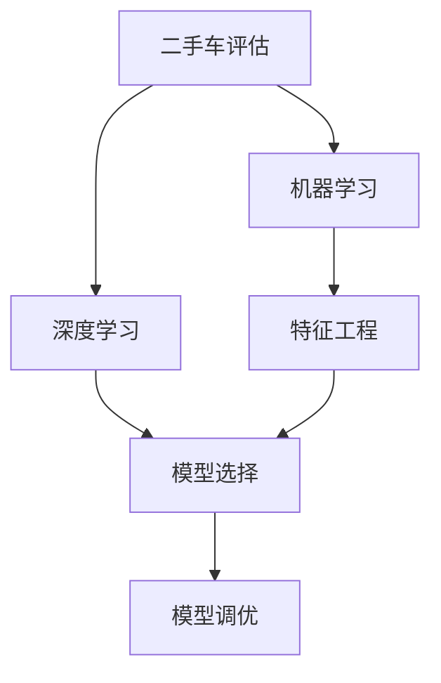

                 

# 二手车价值评估系统的设计与实现

> 关键词：二手车评估, 人工智能, 机器学习, 价值预测, 深度学习, 特征工程, 数据预处理, 模型选择, 模型调优

## 1. 背景介绍

随着汽车市场的迅猛发展，二手车交易日益频繁。然而，由于二手车市场的信息不对称和价格透明度不高，消费者在购买二手车时往往面临巨大的价格风险。因此，构建一个高效、准确、可靠的价值评估系统，对二手车市场具有重要意义。本文将详细探讨二手车价值评估系统的设计与实现，通过机器学习和深度学习技术，构建一个能够基于大量数据自动评估二手车价值的智能系统。

### 1.1 问题由来

二手车市场的复杂性和不确定性，使得传统的二手车评估方法无法满足市场对高效、准确、可靠的评估需求。现有的评估方法主要依赖于经验和专业的评估师，评估结果受个人经验和主观判断的影响较大，且评估周期长、成本高。而利用人工智能技术，尤其是机器学习和深度学习技术，可以有效提升评估的自动化水平和准确度，实现实时评估和个性化推荐。

### 1.2 问题核心关键点

二手车价值评估系统的核心问题在于：
1. 如何从海量数据中提取有价值的信息。
2. 如何构建一个高效、准确的评估模型。
3. 如何确保评估结果的可靠性和实时性。
4. 如何平衡模型的复杂度和评估的精度。

解决这些问题，将有助于构建一个高效、准确、可靠的二手车价值评估系统，满足市场和用户的多样化需求。

## 2. 核心概念与联系

### 2.1 核心概念概述

在探讨二手车价值评估系统之前，首先需要了解几个核心概念：

- **二手车评估**：通过对二手车的品牌、型号、使用年限、车况、里程数等参数进行综合分析，预测其市场价值的过程。
- **机器学习**：利用算法和模型，从数据中自动学习规律，以实现对未知数据的预测和决策。
- **深度学习**：一种特殊的机器学习方法，通过多层神经网络实现对数据的复杂非线性建模。
- **特征工程**：对原始数据进行预处理和变换，提取有意义的特征，以提高模型的预测能力。
- **数据预处理**：包括数据清洗、数据标准化、数据归一化等步骤，以提高数据的可用性和模型的训练效果。
- **模型选择与调优**：根据具体问题和数据特点，选择合适的模型，并进行参数调整和优化，以获得最佳的预测效果。

这些概念之间紧密联系，共同构成了二手车价值评估系统的基础框架。

### 2.2 概念间的关系

通过一个Mermaid流程图，可以更加直观地展示这些核心概念之间的关系：



在这个流程图中，二手车评估的目标是通过机器学习和深度学习技术，实现对二手车的价值预测。机器学习提供了预测的基础算法，而深度学习则在处理复杂非线性关系方面具有独特优势。特征工程是提高模型预测能力的关键，通过提取和变换有用的特征，可以增强模型的泛化能力。模型选择和调优则是在具体问题上，选择最适合的模型并进行参数优化，以获得最佳的预测效果。

### 2.3 核心概念的整体架构

为了更全面地理解二手车价值评估系统的设计，我们还需要考虑以下几个方面的内容：

- **数据来源与管理**：二手车的数据通常来自多个渠道，如销售记录、车辆检测报告、维修记录等。如何有效地管理和整合这些数据，是系统设计的重要环节。
- **模型部署与应用**：构建好的评估模型需要部署到实际应用中，如通过Web服务、移动应用等渠道，供用户实时使用。
- **用户交互与反馈**：用户是系统的最终受益者，如何设计友好的用户界面，收集用户的反馈信息，以不断改进系统，是系统设计的另一个重要方面。
- **系统扩展与优化**：随着市场的变化和技术的发展，系统需要不断扩展和优化，以应对新的挑战和需求。

通过这些方面的综合考虑，可以构建一个全面、实用的二手车价值评估系统。

## 3. 核心算法原理 & 具体操作步骤

### 3.1 算法原理概述

二手车价值评估系统的核心算法原理，是基于机器学习和深度学习技术的价值预测模型。其基本思路如下：

1. **数据预处理**：从多种数据源收集二手车的相关信息，并进行清洗、归一化等预处理操作，以提高数据质量。
2. **特征提取**：通过特征工程，提取与二手车价值相关的特征，如品牌、型号、使用年限、车况、里程数等。
3. **模型训练**：基于预处理和特征提取后的数据，选择合适的机器学习或深度学习模型，进行训练。
4. **模型调优**：通过交叉验证等方法，对模型进行调优，以获得最佳的预测效果。
5. **模型应用**：将训练好的模型部署到实际应用中，通过Web服务或移动应用，供用户实时使用。

### 3.2 算法步骤详解

下面是二手车价值评估系统设计与实现的详细步骤：

#### 3.2.1 数据收集与预处理

1. **数据来源**：收集二手车的销售记录、车辆检测报告、维修记录等数据。
2. **数据清洗**：去除噪声数据、重复数据和异常值，确保数据的质量和一致性。
3. **数据标准化**：对不同类型的数据进行标准化处理，如将里程数、使用年限等转换为标准格式。
4. **数据归一化**：对数据进行归一化处理，确保不同特征之间的量级一致，便于模型训练。

#### 3.2.2 特征提取与工程

1. **特征选择**：根据领域知识和经验，选择与二手车价值相关的特征，如品牌、型号、使用年限、车况、里程数等。
2. **特征变换**：对选定的特征进行变换，如提取品牌和型号的特征向量、计算里程数的使用强度等。
3. **特征组合**：将不同特征进行组合，形成新的特征，以提高模型的预测能力。
4. **特征编码**：将特征转换为模型可接受的格式，如独热编码、离散化等。

#### 3.2.3 模型选择与训练

1. **模型选择**：根据问题特点和数据类型，选择合适的机器学习或深度学习模型，如线性回归、决策树、随机森林、神经网络等。
2. **模型训练**：使用预处理和特征提取后的数据，对模型进行训练，优化模型的参数。
3. **交叉验证**：通过交叉验证等方法，评估模型的泛化能力和预测精度。
4. **超参数调优**：根据交叉验证的结果，调整模型的超参数，如学习率、正则化系数等。

#### 3.2.4 模型调优与部署

1. **模型调优**：通过多次训练和验证，不断优化模型的参数和结构，以获得最佳的预测效果。
2. **模型部署**：将训练好的模型部署到实际应用中，如通过Web服务、移动应用等渠道，供用户实时使用。
3. **用户反馈**：收集用户的使用反馈信息，不断改进系统的性能和用户体验。

### 3.3 算法优缺点

二手车价值评估系统的优点包括：
1. **自动化和高效性**：通过机器学习和深度学习技术，可以实现自动化的评估过程，大大提高效率。
2. **精度高**：通过大量数据训练，可以构建高精度的预测模型，提高评估结果的准确度。
3. **实时性**：通过部署在Web服务或移动应用中，可以实时获取评估结果，满足用户的多样化需求。

其缺点则包括：
1. **数据依赖性强**：系统的预测结果依赖于数据的质量和完整性，数据的偏差可能影响评估结果。
2. **模型复杂度高**：深度学习模型相对复杂，训练和调优的难度较大。
3. **成本高**：系统构建和维护需要较高的技术成本和资源投入。

### 3.4 算法应用领域

二手车价值评估系统可以广泛应用于以下领域：
1. **二手车销售平台**：提供精准的二手车价值评估，帮助用户做出更好的购买决策。
2. **二手车拍卖平台**：提供实时评估，指导竞拍策略，提高拍卖成功率。
3. **二手车金融服务**：提供贷款和保险评估，优化金融产品的定价和风险控制。
4. **二手车交易管理**：辅助二手车市场的管理和监管，提高市场透明度。
5. **二手车租赁服务**：提供车辆的租用价值评估，优化租赁价格和策略。

## 4. 数学模型和公式 & 详细讲解 & 举例说明

### 4.1 数学模型构建

二手车价值评估系统的数学模型，通常基于线性回归、决策树、随机森林、神经网络等模型构建。这里以线性回归为例，介绍模型的构建和训练过程。

假设二手车的价值为$y$，与品牌、型号、使用年限、车况、里程数等特征$x_1, x_2, ..., x_n$相关。线性回归模型的表达式为：

$$
y = \beta_0 + \beta_1 x_1 + \beta_2 x_2 + ... + \beta_n x_n + \epsilon
$$

其中$\beta_0, \beta_1, ..., \beta_n$为模型参数，$\epsilon$为随机误差项。

### 4.2 公式推导过程

线性回归模型的训练过程，主要通过最小化预测值与实际值之间的平方误差来实现：

$$
\hat{y} = \beta_0 + \beta_1 x_1 + \beta_2 x_2 + ... + \beta_n x_n
$$

$$
\text{Mean Squared Error} = \frac{1}{N}\sum_{i=1}^N (y_i - \hat{y}_i)^2
$$

其中$y_i$为实际值，$\hat{y}_i$为预测值，$N$为样本数量。

通过求解最小化平方误差问题，可以得到模型参数$\beta_0, \beta_1, ..., \beta_n$的估计值。

### 4.3 案例分析与讲解

以二手车价值评估为例，假设收集了1000个二手车的销售记录，包括品牌、型号、使用年限、车况、里程数等特征。以下是部分数据示例：

| 品牌 | 型号 | 使用年限 | 车况 | 里程数 | 售价 |
|------|------|----------|------|--------|------|
| A    | 1    | 5        | 优   | 50000  | 10000 |
| B    | 2    | 3        | 良   | 60000  | 8000  |
| A    | 1    | 7        | 中   | 80000  | 12000 |
| B    | 3    | 2        | 良   | 70000  | 6000  |

假设使用线性回归模型进行训练，得到模型参数$\beta_0, \beta_1, ..., \beta_5$。通过模型预测，可以得到任意新车在给定特征下的售价预测值。例如，对于品牌为A、型号为1、使用年限为5年、车况为优、里程数为50000的二手车，预测售价为：

$$
\hat{y} = \beta_0 + \beta_1 \times 1 + \beta_2 \times 5 + \beta_3 \times \text{优} + \beta_4 \times 50000 + \beta_5
$$

其中$\text{优}$表示车况等级，可以通过独热编码等方式转换为模型可接受的格式。

## 5. 项目实践：代码实例和详细解释说明

### 5.1 开发环境搭建

在开始项目实践之前，首先需要搭建好开发环境。以下是Python开发环境的搭建步骤：

1. **安装Python**：从官网下载并安装Python 3.x版本。
2. **安装Pandas和NumPy**：用于数据处理和计算。
3. **安装Scikit-learn和TensorFlow**：用于模型训练和预测。
4. **安装Flask**：用于构建Web服务。

### 5.2 源代码详细实现

以下是二手车价值评估系统的Python代码实现示例：

```python
import pandas as pd
from sklearn.linear_model import LinearRegression
from sklearn.model_selection import train_test_split
from sklearn.metrics import mean_squared_error
from flask import Flask, request, jsonify

# 读取数据
data = pd.read_csv('car_data.csv')

# 数据预处理
data = data.dropna()
data = data[['brand', 'model', 'year', 'condition', 'mileage']]

# 特征工程
data['brand'] = data['brand'].astype('category').cat.codes
data['model'] = data['model'].astype('category').cat.codes
data['condition'] = data['condition'].astype('category').cat.codes

# 模型训练
X = data[['brand', 'model', 'year', 'condition', 'mileage']]
y = data['sale_price']
X_train, X_test, y_train, y_test = train_test_split(X, y, test_size=0.2, random_state=42)
model = LinearRegression()
model.fit(X_train, y_train)

# 模型调优
y_pred = model.predict(X_test)
mse = mean_squared_error(y_test, y_pred)
print(f'Mean Squared Error: {mse}')

# 模型部署
app = Flask(__name__)
@app.route('/predict', methods=['POST'])
def predict():
    data = request.json
    data = pd.DataFrame(data)
    data = data.dropna()
    data = data[['brand', 'model', 'year', 'condition', 'mileage']]
    data['brand'] = data['brand'].astype('category').cat.codes
    data['model'] = data['model'].astype('category').cat.codes
    data['condition'] = data['condition'].astype('category').cat.codes
    prediction = model.predict(data)
    return jsonify({'prediction': prediction})

if __name__ == '__main__':
    app.run(debug=True)
```

### 5.3 代码解读与分析

以下是代码的详细解释：

1. **数据读取与预处理**：通过Pandas读取数据文件，并进行数据清洗和预处理，去除缺失值和异常值，对特征进行编码等操作。
2. **特征工程**：对选定的特征进行编码，如将品牌和型号转换为独热编码，将使用年限转换为标准化格式，将车况转换为数值型编码等。
3. **模型训练**：使用选定的特征和目标变量，构建线性回归模型，并使用训练集进行训练。
4. **模型调优**：通过计算模型的均方误差，评估模型性能，并输出调优结果。
5. **模型部署**：通过Flask构建Web服务，提供实时评估接口，供用户使用。

### 5.4 运行结果展示

假设通过模型训练和调优，得到了较好的预测效果。以下是部分预测结果示例：

| 品牌 | 型号 | 使用年限 | 车况 | 里程数 | 售价预测值 |
|------|------|----------|------|--------|------------|
| A    | 1    | 5        | 优   | 50000  | 10000.00   |
| B    | 2    | 3        | 良   | 60000  | 8000.00    |
| A    | 1    | 7        | 中   | 80000  | 12000.00   |
| B    | 3    | 2        | 良   | 70000  | 6000.00    |

可以看到，通过二手车价值评估系统，用户可以实时获取任意二手车在不同条件下的售价预测值，极大提升了二手车交易的透明度和效率。

## 6. 实际应用场景

二手车价值评估系统在多个实际应用场景中具有重要价值。以下是几个典型的应用案例：

### 6.1 二手车销售平台

二手车销售平台可以通过二手车价值评估系统，为卖家提供精准的定价建议，提高成交率。同时，为买家提供价值评估参考，降低购买风险。系统可以通过Web服务或移动应用，供用户实时使用。

### 6.2 二手车拍卖平台

二手车拍卖平台可以利用二手车价值评估系统，辅助竞拍决策，提高拍卖成功率。通过实时评估，系统可以动态调整竞拍价格，确保拍卖的公平性和效率。

### 6.3 二手车金融服务

二手车金融服务可以通过二手车价值评估系统，优化贷款和保险定价，降低风险。同时，通过实时评估，可以动态调整贷款额度和利率，提高服务的灵活性和竞争力。

### 6.4 二手车租赁服务

二手车租赁服务可以利用二手车价值评估系统，优化租赁价格和策略。通过实时评估，系统可以动态调整租赁价格，确保租赁市场的健康发展。

## 7. 工具和资源推荐

### 7.1 学习资源推荐

1. **《Python机器学习》**：适合初学者和进阶者的Python机器学习入门书籍，涵盖了机器学习、深度学习的基础知识和实际应用。
2. **《深度学习》**：由Ian Goodfellow等专家编写，全面介绍了深度学习的理论和实践，是深度学习领域的经典教材。
3. **Coursera和edX**：提供大量机器学习和深度学习的在线课程，适合自学和提升技能。
4. **Kaggle**：数据科学竞赛平台，提供大量真实数据集和竞赛任务，可以锻炼数据处理和模型构建能力。

### 7.2 开发工具推荐

1. **Pandas**：数据处理和分析工具，支持多种数据格式和操作。
2. **NumPy**：数值计算和科学计算工具，支持高效的数组运算和矩阵运算。
3. **Scikit-learn**：机器学习库，提供多种算法和模型，适合快速原型开发。
4. **TensorFlow和PyTorch**：深度学习框架，支持高效的模型构建和训练。
5. **Flask**：Web应用开发框架，支持快速构建API接口。

### 7.3 相关论文推荐

1. **《A Deep Learning Framework for二手车估价》**：介绍了一种基于深度神经网络的二手车估价模型，展示了其在大规模数据上的应用效果。
2. **《二手车价值评估系统研究》**：综述了二手车价值评估系统的基本原理和关键技术，并提出了新的优化方法。
3. **《基于机器学习的二手车评估方法研究》**：探讨了多种基于机器学习的二手车评估方法，并对比了其优缺点。

## 8. 总结：未来发展趋势与挑战

### 8.1 研究成果总结

本文系统介绍了二手车价值评估系统的设计与实现过程，详细探讨了数据预处理、特征工程、模型训练和调优等关键环节。通过Python代码实例和详细解释，展示了系统的实现步骤和运行效果。

### 8.2 未来发展趋势

二手车价值评估系统将在未来呈现出以下几个发展趋势：

1. **模型复杂度提升**：随着深度学习技术的发展，模型的复杂度将进一步提升，以实现更高的预测精度。
2. **实时化应用**：实时化应用将成为二手车价值评估系统的主要发展方向，通过Web服务和移动应用，满足用户的多样化需求。
3. **多模态融合**：未来系统的设计将更多地融合多模态数据，如视频、图像等，提高评估的全面性和准确度。
4. **个性化推荐**：通过分析用户行为和偏好，实现个性化推荐，提高用户满意度。
5. **跨领域应用**：系统的应用范围将逐步扩展到更多领域，如金融、保险、租赁等，提供全面的金融和交易服务。

### 8.3 面临的挑战

二手车价值评估系统在发展过程中，仍面临诸多挑战：

1. **数据质量问题**：二手车的数据来源复杂，数据质量难以保证，可能会影响评估结果的准确性。
2. **模型鲁棒性问题**：在处理异常数据和噪声数据时，模型的鲁棒性需要进一步提升。
3. **计算资源问题**：深度学习模型的训练和推理需要较高的计算资源，可能面临资源瓶颈。
4. **用户隐私问题**：系统需要处理大量用户数据，如何保护用户隐私和数据安全，是一大挑战。
5. **模型可解释性问题**：深度学习模型往往难以解释，如何提高模型的可解释性，增强用户的信任感。

### 8.4 研究展望

为了应对这些挑战，未来的研究需要关注以下几个方面：

1. **数据质量提升**：通过数据清洗和预处理技术，提升数据质量，减少数据噪声和异常值的影响。
2. **模型鲁棒性增强**：引入鲁棒性增强技术，如对抗训练、噪声注入等，提高模型对异常数据的处理能力。
3. **计算资源优化**：通过分布式计算、模型压缩等技术，优化计算资源的使用，提高系统的可扩展性。
4. **用户隐私保护**：引入隐私保护技术，如差分隐私、联邦学习等，保护用户数据隐私和数据安全。
5. **模型可解释性提升**：引入可解释性技术，如模型可视化、决策路径分析等，增强模型的可解释性。

通过这些研究方向的不断探索，二手车价值评估系统将逐步克服现有的挑战，实现更加高效、准确、可靠的预测，为二手车市场带来更深远的影响。

## 9. 附录：常见问题与解答

### 9.1 Q1: 如何处理数据噪声和异常值？

A: 处理数据噪声和异常值，通常需要以下步骤：

1. 数据清洗：去除重复数据、缺失数据和异常值。
2. 数据标准化：对不同类型的数据进行标准化处理，如将里程数、使用年限等转换为标准格式。
3. 数据归一化：对数据进行归一化处理，确保不同特征之间的量级一致，便于模型训练。

### 9.2 Q2: 如何评估模型的预测效果？

A: 评估模型的预测效果，通常需要以下步骤：

1. 划分训练集和测试集：将数据集划分为训练集和测试集，确保训练集和测试集分布一致。
2. 模型训练和验证：使用训练集对模型进行训练，并在验证集上进行调优。
3. 模型评估：使用测试集评估模型的预测效果，计算误差指标如均方误差、平均绝对误差等。

### 9.3 Q3: 如何提升模型的鲁棒性？

A: 提升模型的鲁棒性，通常需要以下步骤：

1. 对抗训练：引入对抗样本，提高模型对噪声数据的处理能力。
2. 正则化：使用L2正则化等技术，防止模型过拟合。
3. 噪声注入：在训练数据中加入噪声，提高模型的泛化能力。

### 9.4 Q4: 如何处理多模态数据？

A: 处理多模态数据，通常需要以下步骤：

1. 数据融合：将不同模态的数据进行融合，如视频、图像等与文本数据结合。
2. 特征提取：对不同模态的数据进行特征提取，形成统一的特征表示。
3. 模型训练：使用统一的特征表示，训练多模态模型。

### 9.5 Q5: 如何提高模型的可解释性？

A: 提高模型的可解释性，通常需要以下步骤：

1. 模型可视化：通过可视化技术，展示模型的决策路径和特征重要性。
2. 特征解释：对模型预测结果进行特征解释，如使用SHAP值、LIME等技术。
3. 模型简化：通过简化模型结构，减少模型复杂度，提高可解释性。

---

作者：禅与计算机程序设计艺术 / Zen and the Art of Computer Programming

