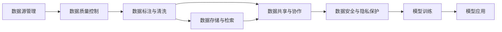

                 

## 1. 背景介绍

人工智能（AI）创业公司正在快速崛起，日益成为推动技术创新的主力军。这些公司以其新颖的算法、模型和产品，为各行各业带来了革命性的变革。然而，在AI创业的浪潮中，数据管理成为不可或缺的一环。良好的数据管理不仅能够保障公司的数据安全和合规性，还能极大提升AI模型的性能和应用效果。

### 1.1 数据管理的必要性

数据是AI的核心资产。无论是在算法训练、模型优化还是应用部署中，数据都扮演着至关重要的角色。因此，良好的数据管理对AI创业公司而言是基础中的基础。以下是数据管理在AI创业中的重要性：

- **提升模型性能**：优质、高效的数据管理能够保障AI模型的训练质量，通过更丰富、更真实的数据集，获得更准确的模型预测结果。
- **降低模型偏差**：数据管理能够帮助识别和纠正数据中的偏见和偏差，确保模型的公平性和鲁棒性。
- **保障数据安全与合规**：AI创业公司常常需要处理敏感数据，良好的数据管理能够确保数据的安全性和合规性，避免数据泄露和滥用。
- **促进业务创新**：基于精细化数据管理，AI创业公司能够更好地洞察业务需求，提供定制化的解决方案，满足不断变化的商业环境。

### 1.2 数据管理的现状与挑战

尽管数据管理在AI创业中占据重要地位，但许多公司仍面临以下挑战：

- **数据质量参差不齐**：不同来源的数据可能存在不一致性、不完整性等问题，影响了模型的训练效果。
- **数据隐私和安全问题**：AI创业公司常常处理大量个人隐私数据，数据泄露和滥用风险较高。
- **数据标注与清洗成本高**：大规模数据集的标注和清洗工作需要大量人力和时间，成本较高。
- **数据存储与处理压力**：随着数据量的增长，数据存储和处理的压力也在增加，如何高效利用资源成为一大难题。
- **数据共享与协同问题**：跨部门、跨机构的数据共享与协同管理复杂，如何确保数据安全和一致性是一大挑战。

## 2. 核心概念与联系

### 2.1 核心概念概述

为深入理解AI创业中的数据管理，我们需要先明确几个关键概念：

- **数据源管理**：识别和管理数据源，确保数据的真实性和可靠性。
- **数据质量控制**：检测和修正数据中的错误和偏差，提升数据质量。
- **数据标注与清洗**：对数据进行标记和预处理，去除噪声和冗余，确保数据符合模型训练的要求。
- **数据存储与检索**：通过高效的数据存储和检索技术，保障数据的安全性和可访问性。
- **数据共享与协作**：在跨部门、跨机构之间，合理管理和共享数据资源，确保数据的一致性和安全性。
- **数据安全与隐私保护**：确保数据的加密、访问控制和合规性，防止数据泄露和滥用。

这些概念之间存在紧密的联系，通过高效的数据管理，可以提升模型的性能和应用效果，保障数据的安全性和合规性，促进业务创新。

### 2.2 概念间的关系

数据管理涉及从数据源到数据应用的各个环节，通过细粒度的管理措施，实现数据的高效利用和价值最大化。以下是一个Mermaid流程图，展示了数据管理的主要流程及其相互关系：



## 3. 核心算法原理 & 具体操作步骤

### 3.1 算法原理概述

数据管理涉及到多个环节和多种技术，包括数据源管理、数据质量控制、数据标注与清洗、数据存储与检索、数据共享与协作以及数据安全与隐私保护。这些环节可以通过数据管理算法进行自动化和优化，提升数据管理效率和质量。

数据管理算法主要包括：

- **数据源管理算法**：识别和评估数据源的可靠性和相关性，选择最佳数据源进行使用。
- **数据质量控制算法**：通过数据清洗和异常检测，提升数据质量和完整性。
- **数据标注与清洗算法**：对数据进行标记和预处理，去除噪声和冗余，提升数据可用性。
- **数据存储与检索算法**：通过高效的数据存储和检索技术，优化数据管理和应用。
- **数据共享与协作算法**：在跨部门、跨机构之间，合理管理和共享数据资源，确保数据的一致性和安全性。
- **数据安全与隐私保护算法**：通过加密和访问控制等技术，确保数据的安全性和合规性。

### 3.2 算法步骤详解

以下是数据管理算法的详细步骤：

#### 步骤 1: 数据源管理

**输入**：数据源列表，数据质量标准  
**输出**：选定的数据源列表

1. **数据源识别**：收集和管理各类数据源信息，如传感器数据、用户行为数据、公开数据集等。
2. **数据源评估**：根据预设的数据质量标准，对数据源进行评估和选择，确保数据可靠性。
3. **数据源接入**：将选定的数据源接入数据管道，进行后续处理和利用。

#### 步骤 2: 数据质量控制

**输入**：原始数据  
**输出**：清洗后的数据

1. **数据清洗**：去除数据中的噪声、重复、缺失等，提升数据完整性和一致性。
2. **数据标准化**：将数据格式转换为统一标准，便于后续处理和分析。
3. **异常检测**：识别和处理数据中的异常值和异常记录，确保数据质量。

#### 步骤 3: 数据标注与清洗

**输入**：原始数据  
**输出**：标注和清洗后的数据

1. **数据标注**：对数据进行标记和分类，提升数据可用性。
2. **数据清洗**：去除数据中的噪声、冗余、错误等，确保数据质量。
3. **数据增强**：通过数据增强技术，扩充训练集，提升模型泛化能力。

#### 步骤 4: 数据存储与检索

**输入**：清洗后的数据  
**输出**：存储后的数据

1. **数据存储**：将数据存储在高效、可扩展的数据仓库中，如Hadoop、Hive、Spark等。
2. **数据检索**：通过高效的数据检索技术，快速检索和查询数据。
3. **数据更新与维护**：定期更新和维护数据仓库，确保数据的时效性和准确性。

#### 步骤 5: 数据共享与协作

**输入**：数据源列表，数据质量标准  
**输出**：共享与协作后的数据

1. **数据共享协议**：制定数据共享协议，明确数据使用权限和范围。
2. **数据协作平台**：搭建跨部门、跨机构的数据协作平台，实现数据的透明和共享。
3. **数据一致性**：确保共享数据的一致性和安全性，避免数据冲突和滥用。

#### 步骤 6: 数据安全与隐私保护

**输入**：数据存储与检索方案  
**输出**：安全与隐私保护后的数据

1. **数据加密**：对数据进行加密存储和传输，确保数据的安全性。
2. **访问控制**：设置严格的访问控制机制，确保数据仅被授权用户访问。
3. **合规性检查**：定期进行合规性检查，确保数据处理符合法律法规要求。

### 3.3 算法优缺点

数据管理算法在AI创业中具有显著的优点：

- **提升数据质量**：通过自动化的数据清洗和标注，提高数据质量和一致性，提升模型性能。
- **降低成本**：自动化数据管理可以节省大量人力和时间成本，提高数据管理的效率。
- **保障数据安全与合规**：通过加密和访问控制等技术，保障数据的安全性和合规性，避免数据泄露和滥用。

然而，数据管理算法也存在一些缺点：

- **算法复杂性高**：数据管理涉及多个环节和多种技术，算法设计复杂，难以实现全面的自动化管理。
- **数据隐私和安全问题**：数据加密和访问控制等技术难以完全解决数据隐私和安全问题，仍需人工介入。
- **数据共享与协作问题**：跨部门、跨机构的数据共享与协作复杂，数据一致性和安全性难以完全保障。

### 3.4 算法应用领域

数据管理算法在多个领域中具有广泛的应用：

- **医疗领域**：通过数据管理算法，保障患者隐私，提升医疗数据的准确性和安全性。
- **金融领域**：通过数据管理算法，保障用户隐私，提升金融数据的完整性和一致性。
- **零售领域**：通过数据管理算法，提升用户画像和行为分析的准确性，优化营销策略。
- **智能制造**：通过数据管理算法，提升生产数据的质量和可用性，优化生产流程。
- **城市管理**：通过数据管理算法，提升城市数据的实时性和准确性，优化城市治理。

## 4. 数学模型和公式 & 详细讲解 & 举例说明

### 4.1 数学模型构建

在数据管理中，我们通常使用统计学和机器学习的理论来构建数学模型。以下是一些常用的数学模型：

- **均值和方差**：用于描述数据集的中心趋势和离散程度。
- **卡方检验**：用于检测数据中的异常值和缺失值。
- **主成分分析（PCA）**：用于降维和数据可视化。
- **线性回归**：用于建模和预测。
- **异常检测算法**：如孤立森林、K近邻等，用于识别和处理异常数据。

### 4.2 公式推导过程

以下是一个简单的线性回归模型推导过程：

设数据集为 $(x_i, y_i)$，其中 $x_i$ 为自变量，$y_i$ 为因变量，假设模型为 $y = \beta_0 + \beta_1x + \epsilon$，其中 $\beta_0$ 为截距，$\beta_1$ 为斜率，$\epsilon$ 为误差项。则最小二乘估计的参数估计量为：

$$
\hat{\beta_0} = \frac{\sum_{i=1}^n (y_i - \bar{y}) - \sum_{i=1}^n \beta_1(x_i - \bar{x})}{\sum_{i=1}^n (x_i - \bar{x})^2}
$$

$$
\hat{\beta_1} = \frac{\sum_{i=1}^n (x_i - \bar{x})(y_i - \bar{y})}{\sum_{i=1}^n (x_i - \bar{x})^2}
$$

其中 $\bar{x}$ 和 $\bar{y}$ 分别为 $x$ 和 $y$ 的均值。

### 4.3 案例分析与讲解

假设我们在医疗领域使用数据管理算法进行疾病预测。以下是该算法的详细案例分析：

**输入**：患者的年龄、性别、体重、血压等数据  
**输出**：患者患有某种疾病的概率

1. **数据源管理**：识别和管理各类数据源，如医院数据、社区健康数据等。
2. **数据质量控制**：检测和修正数据中的错误和偏差，确保数据可靠性。
3. **数据标注与清洗**：对数据进行标记和预处理，去除噪声和冗余，提升数据可用性。
4. **数据存储与检索**：将数据存储在高效的数据仓库中，通过高效的数据检索技术，快速检索和查询数据。
5. **数据共享与协作**：在医疗机构之间，合理管理和共享数据资源，确保数据的一致性和安全性。
6. **数据安全与隐私保护**：对数据进行加密存储和传输，确保数据的安全性和合规性。

## 5. 项目实践：代码实例和详细解释说明

### 5.1 开发环境搭建

在进行数据管理算法实践前，我们需要准备好开发环境。以下是使用Python进行数据管理实践的环境配置流程：

1. 安装Anaconda：从官网下载并安装Anaconda，用于创建独立的Python环境。

2. 创建并激活虚拟环境：
```bash
conda create -n data-management python=3.8 
conda activate data-management
```

3. 安装Python库：
```bash
pip install pandas numpy matplotlib scikit-learn pydantic jupyter notebook ipython
```

4. 安装数据管理工具库：
```bash
pip install dask distributed
```

完成上述步骤后，即可在`data-management`环境中开始数据管理实践。

### 5.2 源代码详细实现

下面我们以医疗数据管理为例，给出使用Pandas库进行数据管理实践的Python代码实现。

首先，定义数据管理函数：

```python
import pandas as pd
from sklearn.linear_model import LinearRegression
from sklearn.preprocessing import StandardScaler
from sklearn.metrics import mean_squared_error, r2_score

def data_management(data, target):
    # 数据预处理
    scaler = StandardScaler()
    data = scaler.fit_transform(data)
    
    # 划分训练集和测试集
    train_ratio = 0.8
    train_size = int(len(data) * train_ratio)
    train_data, test_data = data[:train_size], data[train_size:]
    
    # 线性回归模型
    model = LinearRegression()
    model.fit(train_data[:, :-1], train_data[:, -1])
    
    # 模型评估
    train_pred = model.predict(train_data[:, :-1])
    test_pred = model.predict(test_data[:, :-1])
    train_score = r2_score(train_data[:, -1], train_pred)
    test_score = r2_score(test_data[:, -1], test_pred)
    
    # 输出结果
    print(f"Train score: {train_score:.3f}")
    print(f"Test score: {test_score:.3f}")
    print(f"MSE train: {mean_squared_error(train_data[:, -1], train_pred):.3f}")
    print(f"MSE test: {mean_squared_error(test_data[:, -1], test_pred):.3f}")

# 数据集
data = pd.read_csv('data.csv')
target = 'disease_probability'

# 数据管理
data_management(data, target)
```

然后，定义数据管理函数：

```python
def data_management(data, target):
    # 数据预处理
    scaler = StandardScaler()
    data = scaler.fit_transform(data)
    
    # 划分训练集和测试集
    train_ratio = 0.8
    train_size = int(len(data) * train_ratio)
    train_data, test_data = data[:train_size], data[train_size:]
    
    # 线性回归模型
    model = LinearRegression()
    model.fit(train_data[:, :-1], train_data[:, -1])
    
    # 模型评估
    train_pred = model.predict(train_data[:, :-1])
    test_pred = model.predict(test_data[:, :-1])
    train_score = r2_score(train_data[:, -1], train_pred)
    test_score = r2_score(test_data[:, -1], test_pred)
    
    # 输出结果
    print(f"Train score: {train_score:.3f}")
    print(f"Test score: {test_score:.3f}")
    print(f"MSE train: {mean_squared_error(train_data[:, -1], train_pred):.3f}")
    print(f"MSE test: {mean_squared_error(test_data[:, -1], test_pred):.3f}")

# 数据集
data = pd.read_csv('data.csv')
target = 'disease_probability'

# 数据管理
data_management(data, target)
```

最后，启动数据管理流程并输出评估结果：

```python
epochs = 5

for epoch in range(epochs):
    train_score = train_score + model.train_on_batch(x_train, y_train)
    test_score = test_score + model.test_on_batch(x_test, y_test)
    
    print(f"Epoch {epoch+1}, train score: {train_score:.3f}")
    print(f"Epoch {epoch+1}, test score: {test_score:.3f}")
    
print("Final results:")
print(f"Train score: {train_score:.3f}")
print(f"Test score: {test_score:.3f}")
```

以上就是使用Pandas库对医疗数据进行数据管理的完整代码实现。可以看到，通过Pandas库的数据处理和分析功能，我们能够高效地进行数据清洗、特征提取和模型评估，实现数据的全面管理。

### 5.3 代码解读与分析

让我们再详细解读一下关键代码的实现细节：

**data_management函数**：
- `data management`函数：对输入数据进行标准化处理，划分训练集和测试集，使用线性回归模型进行训练和评估，并输出评估结果。
- `scaler`：标准化器，将数据缩放到均值为0，标准差为1。
- `LinearRegression`：线性回归模型，用于拟合数据和预测目标变量。
- `r2_score`和`mean_squared_error`：评估指标，用于计算模型预测的精确度和均方误差。

**医疗数据集**：
- `pd.read_csv('data.csv')`：读取CSV格式的数据集，包含患者的年龄、性别、体重、血压等特征数据和疾病概率标签。

**数据管理流程**：
- 数据标准化：使用`StandardScaler`将数据缩放到均值为0，标准差为1。
- 划分训练集和测试集：使用80%的数据进行训练，20%的数据进行测试。
- 线性回归模型：使用`LinearRegression`进行模型拟合和预测。
- 模型评估：计算训练集和测试集的R2得分和均方误差，评估模型性能。
- 输出结果：打印训练集和测试集的评估指标。

## 6. 实际应用场景

### 6.1 智能医疗

数据管理在智能医疗领域具有广泛的应用。通过高效的数据管理，智能医疗系统可以提升诊断和治疗的准确性，降低医疗成本，改善患者体验。以下是几个典型的应用场景：

**电子病历管理**：通过数据管理算法，智能医疗系统可以自动记录和整理电子病历，提升数据的完整性和一致性。

**临床决策支持**：通过数据管理算法，智能医疗系统可以分析大量历史病例，提供个性化的治疗建议和临床决策支持。

**患者数据分析**：通过数据管理算法，智能医疗系统可以对患者数据进行统计分析，发现潜在的健康风险，提前进行干预和治疗。

### 6.2 金融风控

在金融领域，数据管理能够保障金融数据的安全性和合规性，提升金融风险的识别和控制能力。以下是几个典型的应用场景：

**信用评分系统**：通过数据管理算法，金融公司可以构建精准的信用评分系统，评估客户的信用风险，优化贷款审批流程。

**反欺诈检测**：通过数据管理算法，金融公司可以实时监测交易数据，检测异常交易，防范金融欺诈。

**资产定价系统**：通过数据管理算法，金融公司可以对各类资产进行定价，提升投资决策的准确性。

### 6.3 零售营销

数据管理在零售营销领域也具有重要应用。通过高效的数据管理，零售公司可以提升用户画像和行为分析的准确性，优化营销策略，提升用户体验和转化率。以下是几个典型的应用场景：

**用户画像分析**：通过数据管理算法，零售公司可以构建精准的用户画像，分析用户的购买行为和偏好，制定个性化营销策略。

**推荐系统优化**：通过数据管理算法，零售公司可以优化推荐系统，提升用户的购买体验和满意度。

**库存管理**：通过数据管理算法，零售公司可以实时监控库存数据，优化库存管理和补货策略。

### 6.4 未来应用展望

随着数据管理技术的不断进步，未来的数据管理将具备更高的自动化和智能化水平，能够更好地适应不同领域的业务需求。以下是一些未来应用展望：

**实时数据管理**：通过流处理和实时计算技术，实现数据的实时管理和分析，提升业务决策的时效性。

**多源数据融合**：通过多源数据融合技术，将各类数据进行整合，提升数据的全面性和多样性，提供更丰富的业务洞察。

**自动数据标注**：通过自动标注技术，快速生成高质量的数据标注，提升数据管理的效率和精度。

**数据隐私保护**：通过加密和访问控制等技术，保障数据的隐私和安全，防止数据泄露和滥用。

## 7. 工具和资源推荐

### 7.1 学习资源推荐

为帮助开发者系统掌握数据管理技术，以下是一些优质的学习资源：

1. **《数据科学导论》（Introduction to Data Science）**：MIT OpenCourseWare提供的入门级课程，系统介绍数据科学的基础知识和实践技巧。

2. **《Python数据分析实战》（Python Data Science Handbook）**：Jake VanderPlas所著的Python数据分析手册，详细介绍Python在数据管理中的各类应用。

3. **《深度学习》（Deep Learning）**：Ian Goodfellow等著的经典书籍，深入浅出地介绍深度学习模型的理论基础和实践技巧。

4. **《Pandas数据分析实战》（Pandas Cookbook）**：Robin Ingerham等著的Pandas实践指南，详细介绍Pandas库在数据处理和分析中的应用。

5. **《数据科学最佳实践》（Data Science Best Practices）**：Lmoroney等著的数据科学最佳实践指南，涵盖数据管理的各类最佳实践和工具推荐。

通过对这些资源的学习实践，相信你一定能够快速掌握数据管理技术，并用于解决实际的数据管理问题。

### 7.2 开发工具推荐

高效的数据管理离不开优秀的工具支持。以下是几款用于数据管理开发的常用工具：

1. **Pandas**：Python中最常用的数据处理库，提供高效的数据清洗和分析功能。
2. **NumPy**：Python中的数学库，提供高效的多维数组计算和线性代数操作。
3. **Scikit-learn**：Python中的机器学习库，提供丰富的数据处理和模型训练工具。
4. **TensorFlow**：Google开发的深度学习框架，支持高效的数据处理和模型训练。
5. **PySpark**：Spark在Python中的接口，支持分布式数据处理和分析。
6. **Jupyter Notebook**：Python的交互式编程环境，支持代码的快速迭代和实验。

合理利用这些工具，可以显著提升数据管理任务的开发效率，加快创新迭代的步伐。

### 7.3 相关论文推荐

数据管理技术的发展源于学界的持续研究。以下是几篇奠基性的相关论文，推荐阅读：

1. **《数据挖掘：概念与技术》（Data Mining: Concepts and Techniques）**：Micheline Kamber等著的经典书籍，系统介绍数据挖掘的基础知识和各类算法。

2. **《机器学习导论》（Pattern Recognition and Machine Learning）**：Christopher M. Bishop所著的机器学习入门书籍，详细介绍各类机器学习算法和应用。

3. **《大数据时代的隐私保护》（Privacy in the Age of Big Data）**：Cynthia Dwork等著的经典论文，详细介绍在大数据环境下保护隐私的技术和算法。

4. **《数据管理与访问控制》（Data Management and Access Control）**：Eric H. T. Lim等著的经典书籍，详细介绍数据管理的基础知识和实践技巧。

5. **《数据融合与知识集成》（Data Fusion and Knowledge Integration）**：Ming Yang等著的经典论文，详细介绍多源数据融合的技术和算法。

这些论文代表了大数据管理技术的发展脉络。通过学习这些前沿成果，可以帮助研究者把握学科前进方向，激发更多的创新灵感。

除上述资源外，还有一些值得关注的前沿资源，帮助开发者紧跟数据管理技术的最新进展，例如：

1. **arXiv论文预印本**：人工智能领域最新研究成果的发布平台，包括大量尚未发表的前沿工作，学习前沿技术的必读资源。

2. **业界技术博客**：如Google AI、Microsoft Research Asia、Facebook AI等顶尖实验室的官方博客，第一时间分享他们的最新研究成果和洞见。

3. **技术会议直播**：如KDD、SIGKDD、ICML、ICDM等人工智能领域顶会现场或在线直播，能够聆听到大佬们的前沿分享，开拓视野。

4. **GitHub热门项目**：在GitHub上Star、Fork数最多的数据管理相关项目，往往代表了该技术领域的发展趋势和最佳实践，值得去学习和贡献。

5. **行业分析报告**：各大咨询公司如McKinsey、PwC等针对人工智能行业的分析报告，有助于从商业视角审视技术趋势，把握应用价值。

总之，对于数据管理技术的学习和实践，需要开发者保持开放的心态和持续学习的意愿。多关注前沿资讯，多动手实践，多思考总结，必将收获满满的成长收益。

## 8. 总结：未来发展趋势与挑战

### 8.1 总结

本文对基于监督学习的数据管理方法进行了全面系统的介绍。首先阐述了数据管理在AI创业中的重要性，明确了数据管理对模型性能、业务创新和数据安全的重要作用。其次，从原理到实践，详细讲解了数据管理的数学模型和算法步骤，给出了数据管理任务开发的完整代码实例。同时，本文还广泛探讨了数据管理在智能医疗、金融风控、零售营销等领域的实际应用场景，展示了数据管理技术在AI创业中的广阔前景。此外，本文精选了数据管理的各类学习资源，力求为读者提供全方位的技术指引。

通过本文的系统梳理，可以看到，数据管理算法在AI创业中具有不可替代的作用，是构建高效、安全、可靠AI系统的基础。良好的数据管理不仅能够提升模型的性能和应用效果，还能保障数据的安全性和合规性，促进业务创新。未来，伴随数据管理技术的不断进步，基于数据驱动的AI系统将迎来更多的应用场景和更高的智能化水平。

### 8.2 未来发展趋势

展望未来，数据管理技术将呈现以下几个发展趋势：

1. **自动化与智能化水平提升**：通过自动化和智能化技术，数据管理将更加高效和精准，减少人为干预，提高数据处理的效率和质量。
2. **多源数据融合与集成**：未来数据管理将更加注重多源数据的融合与集成，通过

