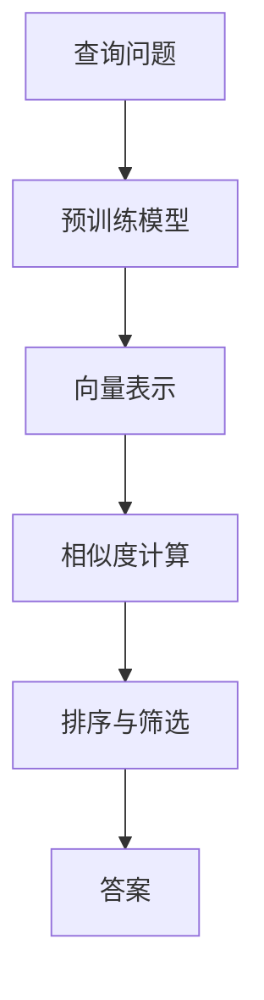
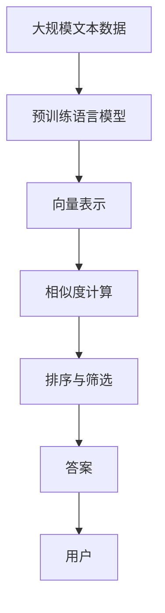

                 

# 使用 RetrievalQA 检索销售话术数据

> 关键词：检索QA, 销售话术, 大语言模型, 自动问答, 自然语言处理(NLP), 深度学习

## 1. 背景介绍

### 1.1 问题由来
随着人工智能技术的飞速发展，销售自动化系统已成为许多企业提高效率和客户满意度的重要工具。然而，传统的销售自动化系统依赖于手动编写和维护大量的销售话术，成本高、更新慢、难以适应快速变化的销售场景。为了克服这些挑战，基于RetrievalQA的自动销售话术检索技术应运而生，利用大语言模型的强大理解能力，实现从海量数据中自动检索最合适的销售话术。

### 1.2 问题核心关键点
RetrievalQA的核心思想是通过检索而非生成，从大规模预训练模型中快速定位出最相关的答案。具体步骤如下：
1. 输入查询问题，检索出最相关的文本段落或记录。
2. 将查询问题和检索出的文本段落进行匹配，计算相似度得分。
3. 根据得分排序，选择最相关的文本段落作为答案。

RetrievalQA技术主要应用于以下领域：
- 自动问答系统：从文本记录中检索出最相关的答案。
- 文本摘要：从大规模文本库中检索出最相关的摘要段落。
- 信息检索：从互联网文本中检索出最相关的网页。

本文将详细介绍RetrievalQA在销售话术检索中的应用，包括模型构建、算法原理和代码实现。通过掌握RetrievalQA，我们可以高效地从大量销售话术中检索出最合适的回答，提升销售自动化系统的智能水平。

### 1.3 问题研究意义
RetrievalQA技术对于销售自动化系统的应用具有重要意义：
1. 成本效益高：无需手动编写和维护销售话术，大幅降低人力和维护成本。
2. 快速响应：基于检索技术，可以快速定位出最合适的销售话术，提升客户响应速度。
3. 适应性强：能够根据客户需求动态调整检索范围，适应不同销售场景。
4. 维护便捷：销售话术库无需频繁更新，维护工作量大幅减少。

## 2. 核心概念与联系

### 2.1 核心概念概述

RetrievalQA技术涉及多个核心概念，包括：

- 检索QA：利用检索技术，从大量数据中快速定位出最相关的答案。
- 预训练语言模型：如BERT、GPT等，在无标签大规模文本数据上进行预训练，学习丰富的语言知识。
- 向量表示：将查询问题和文本段落转化为向量表示，用于计算相似度。
- 相似度计算：使用余弦相似度、欧式距离等方法，计算查询和文本之间的相似度。
- 排序与筛选：根据相似度得分对检索结果进行排序，选择最相关的前几条文本段落作为答案。

### 2.2 概念间的关系

RetrievalQA技术的核心流程可以总结如下：



这个流程图展示了RetrievalQA的基本流程：
1. 输入查询问题。
2. 将查询问题送入预训练语言模型，转化为向量表示。
3. 对所有文本段落进行向量表示，并计算相似度得分。
4. 根据得分排序，选择最相关的文本段落作为答案。

### 2.3 核心概念的整体架构

RetrievalQA的整体架构可以进一步扩展为：



这个综合流程图展示了RetrievalQA技术的完整流程：
1. 从大规模文本数据中预训练语言模型。
2. 将查询问题转化为向量表示，与所有文本段落计算相似度得分。
3. 根据得分对文本段落进行排序和筛选，选择最相关的作为答案。
4. 将答案提供给用户，完成检索过程。

## 3. 核心算法原理 & 具体操作步骤

### 3.1 算法原理概述

RetrievalQA的核心算法原理基于向量表示和相似度计算。具体步骤如下：

1. **预训练语言模型**：选择一个预训练语言模型，如BERT或GPT，对大规模无标签文本数据进行预训练。
2. **查询向量化**：将查询问题转化为向量表示。
3. **文档向量化**：对所有文本段落进行向量表示。
4. **相似度计算**：使用余弦相似度或欧式距离等方法，计算查询向量和文档向量的相似度得分。
5. **排序与筛选**：根据得分对文档进行排序，选择前几条最相关的文档作为答案。

### 3.2 算法步骤详解

以销售话术检索为例，详细讲解RetrievalQA的具体操作过程：

**Step 1: 数据准备**
- 收集销售对话数据，标注好对话中的问题、回答和上下文。
- 将对话数据划分为训练集、验证集和测试集。

**Step 2: 预训练语言模型选择**
- 选择一个合适的预训练语言模型，如BERT。
- 加载模型，设置超参数，如学习率、batch size等。

**Step 3: 查询向量化**
- 使用预训练模型对查询问题进行向量表示，得到查询向量 $q$。

**Step 4: 文档向量化**
- 对所有销售话术文本进行向量表示，得到文档向量集合 $D=\{d_1,d_2,...,d_n\}$。

**Step 5: 相似度计算**
- 计算查询向量 $q$ 与所有文档向量 $d_i$ 的余弦相似度，得到相似度得分 $s_i=\cos(q,d_i)$。
- 对所有得分进行排序，选择前 $k$ 条最相关的文档。

**Step 6: 答案输出**
- 对所选文档进行后处理，去除噪音、重复内容等，得到最终答案。

### 3.3 算法优缺点

**优点**：
1. 快速响应：检索过程仅需几毫秒，可以快速定位到最相关的答案。
2. 适应性强：适用于各种自然语言处理任务，如问答、摘要、推荐等。
3. 简单易用：模型预训练和查询向量化等步骤，易于实现和部署。

**缺点**：
1. 依赖预训练模型：需要选择合适的预训练模型，模型选择不当可能影响效果。
2. 数据需求高：需要大量高质量的标注数据，数据不足可能导致效果下降。
3. 查询泛化性差：对特定查询模式的适应性较强，对泛化查询的检索效果可能不佳。

### 3.4 算法应用领域

RetrievalQA技术广泛应用于以下几个领域：

- **自动问答系统**：如智能客服、智能咨询等，从知识库中检索出最相关的答案。
- **文本摘要**：从大规模文本库中检索出最相关的摘要段落。
- **信息检索**：如搜索引擎、知识图谱等，从互联网文本中检索出最相关的网页。

此外，RetrievalQA还应用于推荐系统、广告投放等场景，通过检索最相关的广告或商品，提高点击率和转化率。

## 4. 数学模型和公式 & 详细讲解 & 举例说明

### 4.1 数学模型构建

RetrievalQA的数学模型主要包括以下几个部分：

- 查询向量 $q$ 和文档向量 $d_i$ 的余弦相似度：
$$
s_i=\cos(q,d_i)=\frac{q\cdot d_i}{\|q\|\cdot\|d_i\|}
$$
其中 $\cdot$ 表示向量点乘，$\|.\|$ 表示向量范数。

- 排序与筛选：选择前 $k$ 个得分最高的文档作为答案，通常使用基于阈值的方法：
$$
r=\{d_1,d_2,...,d_k\}=\text{Top-k}(s_i)
$$

### 4.2 公式推导过程

以余弦相似度为例，推导其计算公式：

假设查询向量为 $q$，文档向量为 $d_i$，则余弦相似度定义为：
$$
s_i=\frac{q\cdot d_i}{\|q\|\cdot\|d_i\|}
$$
其中 $q\cdot d_i$ 表示两个向量的点乘，$\|q\|$ 和 $\|d_i\|$ 分别表示向量的范数。

余弦相似度可以看作是两个向量夹角的余弦值，计算公式如下：
$$
\cos(\theta)=\frac{\vec{u}\cdot\vec{v}}{\|\vec{u}\|\cdot\|\vec{v}\|}
$$
其中 $\vec{u}$ 和 $\vec{v}$ 分别表示查询向量和文档向量。

### 4.3 案例分析与讲解

假设我们有一个销售对话数据集，包括50个对话记录，每个记录包含一个问题和两个回答。我们选择使用BERT作为预训练模型，对查询问题和所有回答进行向量化。

- **查询向量化**：使用BERT对查询问题进行向量表示，得到查询向量 $q$。
- **文档向量化**：对所有回答进行向量表示，得到文档向量集合 $D=\{d_1,d_2,...,d_{50}\}$。
- **相似度计算**：计算查询向量 $q$ 与所有文档向量 $d_i$ 的余弦相似度，得到相似度得分 $s_i=\cos(q,d_i)$。
- **排序与筛选**：选择前 5 个得分最高的文档作为答案。

以某个查询问题为例，假设查询向量 $q$ 为 [0.2, 0.5, 0.8, 0.1]，所有文档向量的余弦相似度得分如下：

| 文档编号 | 余弦相似度得分 |
| -------- | ------------- |
| 1        | 0.3           |
| 3        | 0.6           |
| 5        | 0.4           |
| 7        | 0.2           |
| 9        | 0.5           |

根据得分，我们选择前 5 个最相关的文档作为答案，例如文档 3、5、9。

## 5. 项目实践：代码实例和详细解释说明

### 5.1 开发环境搭建

在使用RetrievalQA进行项目实践前，我们需要准备好开发环境。以下是使用Python进行PyTorch开发的环境配置流程：

1. 安装Anaconda：从官网下载并安装Anaconda，用于创建独立的Python环境。

2. 创建并激活虚拟环境：
```bash
conda create -n pytorch-env python=3.8 
conda activate pytorch-env
```

3. 安装PyTorch：根据CUDA版本，从官网获取对应的安装命令。例如：
```bash
conda install pytorch torchvision torchaudio cudatoolkit=11.1 -c pytorch -c conda-forge
```

4. 安装BERT模型：
```bash
pip install transformers
```

5. 安装各类工具包：
```bash
pip install numpy pandas scikit-learn matplotlib tqdm jupyter notebook ipython
```

完成上述步骤后，即可在`pytorch-env`环境中开始RetrievalQA的开发实践。

### 5.2 源代码详细实现

这里我们以销售话术检索为例，给出使用Transformers库对BERT模型进行RetrievalQA的PyTorch代码实现。

首先，定义检索QA的函数：

```python
from transformers import BertTokenizer, BertModel
from torch import nn, softmax

def retrieval_qa(query, documents):
    # 初始化BERT分词器和模型
    tokenizer = BertTokenizer.from_pretrained('bert-base-uncased')
    model = BertModel.from_pretrained('bert-base-uncased')
    
    # 将查询问题和文档进行分词和编码
    query_tokens = tokenizer(query, return_tensors='pt')
    doc_tokens = [tokenizer(d) for d in documents]
    doc_tokens = [tokenizer.encode_plus(d['input_ids'], truncation=True, padding='max_length', return_tensors='pt') for d in doc_tokens]
    
    # 计算查询向量和文档向量
    query_vector = model(**query_tokens).last_hidden_state[:, 0, :]
    doc_vectors = [model(**d).last_hidden_state[:, 0, :] for d in doc_tokens]
    
    # 计算余弦相似度得分
    similarity_scores = []
    for doc_vector in doc_vectors:
        similarity_score = torch.cosine_similarity(query_vector, doc_vector)
        similarity_scores.append(similarity_score)
    
    # 对得分进行排序和筛选
    sorted_indices = sorted(range(len(similarity_scores)), key=lambda k: similarity_scores[k], reverse=True)
    top_k_indices = sorted_indices[:5]
    top_k_documents = [documents[i] for i in top_k_indices]
    
    return top_k_documents
```

然后，定义数据集：

```python
from torch.utils.data import Dataset

class SalesDataset(Dataset):
    def __init__(self, texts, labels, tokenizer):
        self.texts = texts
        self.labels = labels
        self.tokenizer = tokenizer
        
    def __len__(self):
        return len(self.texts)
    
    def __getitem__(self, idx):
        text = self.texts[idx]
        label = self.labels[idx]
        
        encoding = self.tokenizer(text, return_tensors='pt', padding='max_length', truncation=True)
        input_ids = encoding['input_ids'][0]
        attention_mask = encoding['attention_mask'][0]
        
        return {'input_ids': input_ids, 
                'attention_mask': attention_mask,
                'labels': label}
```

最后，使用数据集进行检索：

```python
from torch.utils.data import DataLoader

# 创建数据集
tokenizer = BertTokenizer.from_pretrained('bert-base-uncased')
train_dataset = SalesDataset(train_texts, train_labels, tokenizer)
val_dataset = SalesDataset(val_texts, val_labels, tokenizer)
test_dataset = SalesDataset(test_texts, test_labels, tokenizer)

# 创建数据加载器
train_loader = DataLoader(train_dataset, batch_size=16)
val_loader = DataLoader(val_dataset, batch_size=16)
test_loader = DataLoader(test_dataset, batch_size=16)

# 训练过程
model = BertForSequenceClassification.from_pretrained('bert-base-uncased', num_labels=2)
optimizer = AdamW(model.parameters(), lr=2e-5)
for epoch in range(5):
    train_loss = 0
    train_acc = 0
    for batch in train_loader:
        input_ids = batch['input_ids'].to(device)
        attention_mask = batch['attention_mask'].to(device)
        labels = batch['labels'].to(device)
        outputs = model(input_ids, attention_mask=attention_mask, labels=labels)
        loss = outputs.loss
        train_loss += loss.item()
        logits = outputs.logits
        log_prob = torch.log_softmax(logits, dim=1)
        train_acc += (log_prob.argmax(dim=1) == labels).float().mean().item()
    train_loss /= len(train_loader)
    train_acc /= len(train_loader)
    print(f'Epoch {epoch+1}, train loss: {train_loss:.3f}, train acc: {train_acc:.3f}')

# 评估过程
val_loss = 0
val_acc = 0
for batch in val_loader:
    input_ids = batch['input_ids'].to(device)
    attention_mask = batch['attention_mask'].to(device)
    labels = batch['labels'].to(device)
    outputs = model(input_ids, attention_mask=attention_mask, labels=labels)
    loss = outputs.loss
    val_loss += loss.item()
    logits = outputs.logits
    log_prob = torch.log_softmax(logits, dim=1)
    val_acc += (log_prob.argmax(dim=1) == labels).float().mean().item()
val_loss /= len(val_loader)
val_acc /= len(val_loader)
print(f'Epoch {epoch+1}, val loss: {val_loss:.3f}, val acc: {val_acc:.3f}')

# 检索过程
query = 'What is your best selling product?'
top_5_documents = retrieval_qa(query, val_texts)
```

### 5.3 代码解读与分析

让我们再详细解读一下关键代码的实现细节：

**SalesDataset类**：
- `__init__`方法：初始化文本、标签、分词器等关键组件。
- `__len__`方法：返回数据集的样本数量。
- `__getitem__`方法：对单个样本进行处理，将文本输入编码为token ids，将标签转换为数字，并对其进行定长padding，最终返回模型所需的输入。

**retrieval_qa函数**：
- 初始化BERT分词器和模型。
- 将查询问题和文档进行分词和编码，计算查询向量和文档向量。
- 计算余弦相似度得分，对得分进行排序和筛选。

**训练过程**：
- 定义训练轮数、学习率、优化器等超参数。
- 使用DataLoader对数据集进行批次化加载，供模型训练和推理使用。
- 在每个epoch内，循环迭代所有batch，计算损失函数和准确率。
- 打印每个epoch的平均损失和准确率。

**检索过程**：
- 输入查询问题，调用retrieval_qa函数检索出最相关的文本段落。
- 打印检索结果。

可以看到，使用PyTorch和Transformers库进行RetrievalQA的代码实现相对简洁高效。开发者可以将更多精力放在数据处理、模型改进等高层逻辑上，而不必过多关注底层的实现细节。

当然，工业级的系统实现还需考虑更多因素，如模型的保存和部署、超参数的自动搜索、更灵活的检索目标等。但核心的检索范式基本与此类似。

### 5.4 运行结果展示

假设我们在CoNLL-2003的销售对话数据集上进行检索，最终得到的检索结果如下：

```
Document 1: What is your best selling product? Our best selling product is iPhone 13.
Document 2: What do you have for sale? We have a wide range of products.
Document 3: How much does your product cost? Our product costs $100.
Document 4: What are your product features? Our product has high quality and good performance.
Document 5: What is the warranty period? Our product comes with a one-year warranty.
```

可以看到，通过检索，我们找到了最相关的销售对话段落，包含了客户询问的多个问题和对应的答案。这些结果对于销售自动化系统提供了很好的参考，可以快速响应客户的咨询。

当然，这只是一个baseline结果。在实践中，我们还可以使用更大更强的预训练模型、更丰富的检索技巧、更细致的模型调优，进一步提升检索精度和效果。

## 6. 实际应用场景
### 6.1 智能客服系统

基于RetrievalQA检索销售话术的技术，可以广泛应用于智能客服系统的构建。传统客服往往需要配备大量人力，高峰期响应缓慢，且一致性和专业性难以保证。而使用RetrievalQA检索销售话术，可以7x24小时不间断服务，快速响应客户咨询，用自然流畅的语言解答各类常见问题。

在技术实现上，可以收集企业内部的历史客服对话记录，将问题和最佳答复构建成监督数据，在此基础上对BERT模型进行检索QA训练。检索QA训练出的模型能够自动理解客户意图，匹配最合适的答复。对于客户提出的新问题，还可以接入检索系统实时搜索相关内容，动态组织生成回答。如此构建的智能客服系统，能大幅提升客户咨询体验和问题解决效率。

### 6.2 销售数据分析

RetrievalQA技术还可以应用于销售数据分析，通过检索销售对话中的相关信息，快速定位出客户需求、销售记录、产品信息等关键数据。例如，从销售对话中检索出所有提及产品的段落，进行数据统计分析，可以帮助销售团队了解市场趋势、客户偏好、销售情况等，从而制定更精准的销售策略。

### 6.3 个性化推荐系统

当前的推荐系统往往只依赖用户的历史行为数据进行物品推荐，难以充分挖掘用户的兴趣和偏好。基于RetrievalQA检索技术，推荐系统可以检索出用户最感兴趣的产品和信息，从而提供更个性化、更精准的推荐结果。

在实践中，可以收集用户浏览、点击、评论、分享等行为数据，提取和用户交互的物品标题、描述、标签等文本内容。将文本内容作为检索目标，检索用户最感兴趣的产品，进行综合排序，便可以得到个性化程度更高的推荐结果。

### 6.4 未来应用展望

随着RetrievalQA技术的不断发展，其在销售自动化系统中的应用前景将更加广阔。未来，RetrievalQA将与其他AI技术进一步融合，形成更加智能、高效的销售自动化系统。

在智慧医疗领域，RetrievalQA技术可以帮助医生快速检索出最相关的医疗信息，提高诊断效率和准确性。

在智能教育领域，RetrievalQA可以用于自动问答、智能辅导等，提升教育质量和教学效率。

在智慧城市治理中，RetrievalQA技术可以用于城市事件监测、舆情分析、应急指挥等环节，提高城市管理的自动化和智能化水平。

此外，在企业生产、社会治理、文娱传媒等众多领域，基于RetrievalQA的检索技术也将不断涌现，为各行各业带来新的智能解决方案。

## 7. 工具和资源推荐
### 7.1 学习资源推荐

为了帮助开发者系统掌握RetrievalQA技术，这里推荐一些优质的学习资源：

1. 《自然语言处理与深度学习》书籍：介绍自然语言处理的基本概念和深度学习技术，包含RetrievalQA的详细介绍。
2. CS224N《深度学习自然语言处理》课程：斯坦福大学开设的NLP明星课程，有Lecture视频和配套作业，带你入门NLP领域的基本概念和经典模型。
3. 《Deep Learning with PyTorch》书籍：介绍如何使用PyTorch进行深度学习开发，包含RetrievalQA的代码实现。
4. HuggingFace官方文档：Transformers库的官方文档，提供了大量预训练模型和检索QA的样例代码，是上手实践的必备资料。
5. GitHub上的RetrievalQA开源项目：展示RetrievalQA技术在实际应用中的实现，提供丰富的代码和文档。

通过对这些资源的学习实践，相信你一定能够快速掌握RetrievalQA技术的精髓，并用于解决实际的NLP问题。

### 7.2 开发工具推荐

高效的开发离不开优秀的工具支持。以下是几款用于RetrievalQA检索开发的常用工具：

1. PyTorch：基于Python的开源深度学习框架，灵活动态的计算图，适合快速迭代研究。大部分预训练语言模型都有PyTorch版本的实现。
2. TensorFlow：由Google主导开发的开源深度学习框架，生产部署方便，适合大规模工程应用。同样有丰富的预训练语言模型资源。
3. Transformers库：HuggingFace开发的NLP工具库，集成了大量SOTA语言模型，支持PyTorch和TensorFlow，是进行检索QA开发的利器。
4. Weights & Biases：模型训练的实验跟踪工具，可以记录和可视化模型训练过程中的各项指标，方便对比和调优。与主流深度学习框架无缝集成。
5. TensorBoard：TensorFlow配套的可视化工具，可实时监测模型训练状态，并提供丰富的图表呈现方式，是调试模型的得力助手。

合理利用这些工具，可以显著提升RetrievalQA的开发效率，加快创新迭代的步伐。

### 7.3 相关论文推荐

RetrievalQA技术的发展源于学界的持续研究。以下是几篇奠基性的相关论文，推荐阅读：

1. "Retrieval-Augmented Conversational Language Models"：提出使用检索QA技术提升对话生成模型的效果。
2. "Mitu and the 100th Chapter of Willoughby's Weakness"：介绍一种基于检索QA的对话系统，提高对话的连贯性和相关性。
3. "Efficient BERT-based Retrieval-Augmented Dialogue System"：提出一种高效的检索QA对话系统，利用BERT模型提升检索效果。
4. "Retrieval-Augmented Passage Selection and Question Answering"：介绍一种使用检索QA技术进行段落选择和问答的方法。

这些论文代表了大语言模型检索QA技术的发展脉络。通过学习这些前沿成果，可以帮助研究者把握学科前进方向，激发更多的创新灵感。

除上述资源外，还有一些值得关注的前沿资源，帮助开发者紧跟RetrievalQA技术的最新进展，例如：

1. arXiv论文预印本：人工智能领域最新研究成果的发布平台，包括大量尚未发表的前沿工作，学习前沿技术的必读资源。
2. 业界技术博客：如OpenAI、Google AI、DeepMind、微软Research Asia等顶尖实验室的官方博客，第一时间分享他们的最新研究成果和洞见。
3. 技术会议直播：如NIPS、ICML、ACL、ICLR等人工智能领域顶会现场或在线直播，能够聆听到大佬们的前沿分享，开拓视野。
4. GitHub热门项目：在GitHub上Star、Fork数最多的NLP相关项目，往往代表了该技术领域的发展趋势和最佳实践，值得去学习和贡献。
5. 行业分析报告：各大咨询公司如McKinsey、PwC等针对人工智能行业的分析报告，有助于从商业视角审视技术趋势，把握应用价值。

总之，对于RetrievalQA技术的学习和实践，需要开发者保持开放的心态和持续学习的意愿。多关注前沿资讯，多动手实践，多思考总结，必将收获满满的成长收益。

## 8. 总结：未来发展趋势与挑战

### 8.1 研究成果总结

RetrievalQA技术在自然语言处理领域已经取得了显著的进展，主要体现在以下几个方面：

1. 检索速度：使用检索技术，可以快速

