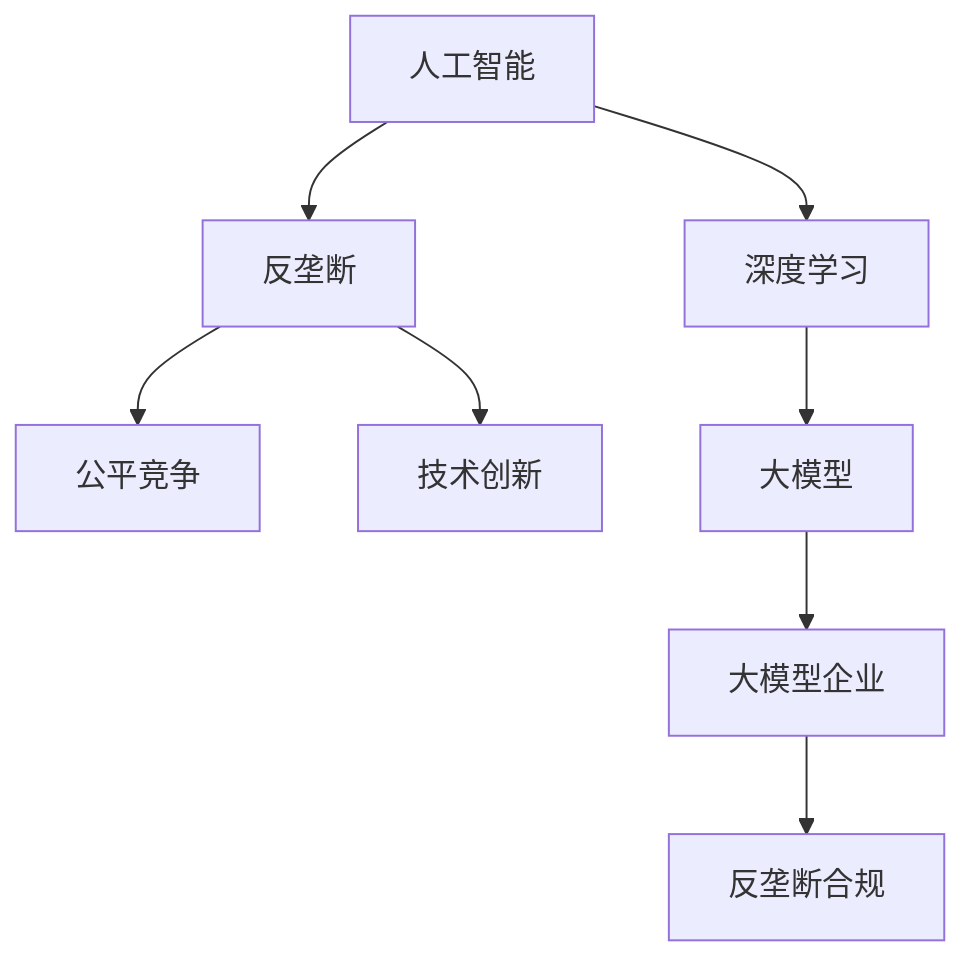
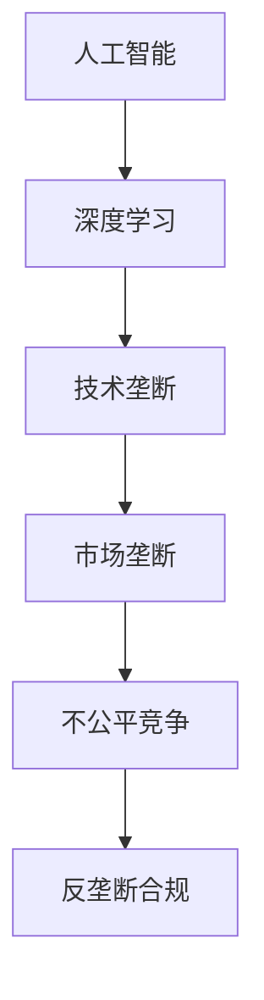
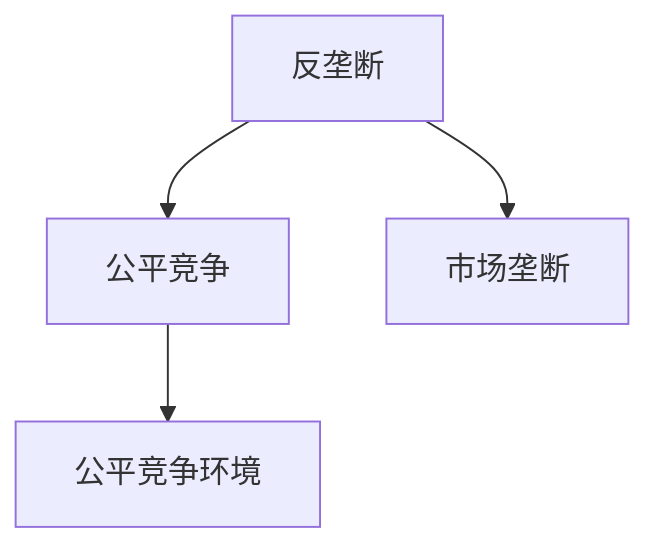
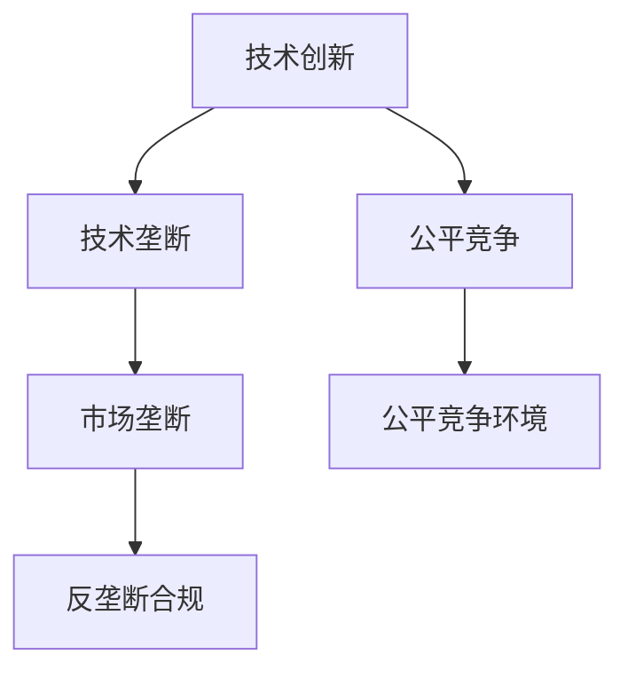

                 

# 大模型企业的反垄断合规

随着人工智能技术的迅猛发展，以深度学习为核心的企业不断涌现。这些企业利用先进的人工智能技术，为用户提供高质量的服务，推动了社会生产力的提升。然而，与此同时，大模型企业也面临着反垄断合规的严峻挑战，如何平衡技术创新与反垄断合规成为当前亟需解决的重要课题。本文将对大模型企业的反垄断合规进行全面分析，从背景、核心概念、算法原理、实践案例、应用领域、未来展望等方面进行深入探讨。

## 1. 背景介绍

### 1.1 问题由来

近年来，随着人工智能技术的迅猛发展，以深度学习为核心的企业不断涌现。这些企业利用先进的人工智能技术，为用户提供高质量的服务，推动了社会生产力的提升。然而，与此同时，大模型企业也面临着反垄断合规的严峻挑战。

### 1.2 问题核心关键点

反垄断合规的核心关键点在于如何平衡技术创新与公平竞争，防止大企业通过垄断技术优势，形成市场主导，压制中小企业的创新发展。当前，大模型企业面临的主要问题包括：

- 技术垄断：大模型企业通过掌握核心技术，形成市场壁垒，抑制中小企业技术创新。
- 数据垄断：大模型企业通过收集海量数据，形成数据孤岛，抑制市场竞争。
- 市场垄断：大模型企业通过市场主导地位，控制市场资源分配，抑制市场公平竞争。
- 不公平竞争：大模型企业通过高价销售模型、捆绑销售等手段，形成不公平竞争环境。

这些问题的存在，严重阻碍了市场公平竞争和技术创新，对整个社会的可持续发展构成了威胁。因此，如何在大模型企业的发展过程中，实现公平竞争和技术创新，成为亟需解决的重要课题。

## 2. 核心概念与联系

### 2.1 核心概念概述

为更好地理解大模型企业的反垄断合规，本节将介绍几个密切相关的核心概念：

- 人工智能(AI)：利用计算机模拟人类智能行为，包括感知、学习、推理等能力，以实现自主决策和问题解决。
- 深度学习(Deep Learning)：一种基于人工神经网络的机器学习技术，通过多层次非线性特征提取，实现复杂任务处理。
- 反垄断(Monopoly)：指一种市场结构，其中只有一个或少数几个企业控制着市场资源，排斥其他竞争者，形成市场垄断。
- 公平竞争(Fair Competition)：指市场参与者之间在相同的条件下，享有公平的竞争机会，不受任何不正当干预。
- 技术创新(Innovation)：指通过新技术研发和新应用实践，实现技术突破和产品优化，提升企业竞争力和市场价值。

这些核心概念之间的逻辑关系可以通过以下Mermaid流程图来展示：



这个流程图展示了大模型企业在人工智能、深度学习、反垄断、公平竞争和技术创新之间的逻辑关系：

1. 大模型企业通过深度学习技术，实现人工智能应用，形成技术垄断。
2. 大模型企业通过技术垄断，影响市场公平竞争，形成反垄断问题。
3. 反垄断合规旨在平衡技术垄断和公平竞争，促进技术创新。

### 2.2 概念间的关系

这些核心概念之间存在着紧密的联系，形成了大模型企业的反垄断合规的完整生态系统。下面我们通过几个Mermaid流程图来展示这些概念之间的关系。

#### 2.2.1 人工智能与反垄断



这个流程图展示了人工智能技术在大模型企业中可能带来的反垄断问题。

#### 2.2.2 反垄断与公平竞争



这个流程图展示了反垄断合规对公平竞争的影响。

#### 2.2.3 技术创新与反垄断



这个流程图展示了技术创新对反垄断合规的影响。

## 3. 核心算法原理 & 具体操作步骤

### 3.1 算法原理概述

大模型企业的反垄断合规，本质上是一个复杂的多目标优化问题。其核心在于如何在技术创新和公平竞争之间找到最优平衡点，确保市场公平竞争，避免技术垄断。

形式化地，假设大模型企业 $E$ 的目标函数为：

$$
\min_{E} \left\{ \begin{aligned}
& \mathcal{L}_\text{垄断}(E) \\
& \mathcal{L}_\text{公平}(E) \\
& \mathcal{L}_\text{创新}(E)
\end{aligned} \right.
$$

其中 $\mathcal{L}_\text{垄断}$ 为市场垄断损失函数，$\mathcal{L}_\text{公平}$ 为公平竞争损失函数，$\mathcal{L}_\text{创新}$ 为技术创新损失函数。

通过梯度下降等优化算法，大模型企业 $E$ 不断更新其行为策略，以最小化目标函数，实现反垄断合规。

### 3.2 算法步骤详解

大模型企业的反垄断合规，一般包括以下几个关键步骤：

**Step 1: 收集市场数据**
- 收集大模型企业市场份额、技术创新能力、公平竞争行为等数据，构建市场竞争模型。
- 分析市场垄断现象、不公平竞争行为等，确定反垄断合规目标。

**Step 2: 设计目标函数**
- 根据市场数据，构建反垄断合规目标函数。
- 考虑市场垄断、公平竞争和技术创新等多目标优化问题，设计权重系数。

**Step 3: 优化模型参数**
- 使用梯度下降等优化算法，不断调整大模型企业的行为策略，最小化目标函数。
- 引入正则化、约束等机制，避免策略过度竞争或过度垄断。

**Step 4: 评估和反馈**
- 定期评估大模型企业的行为策略，确保反垄断合规目标达成。
- 收集市场反馈，调整优化算法参数，持续改进反垄断合规策略。

**Step 5: 发布合规指南**
- 根据优化结果，发布大模型企业反垄断合规指南。
- 指导大模型企业调整市场策略，促进公平竞争和技术创新。

### 3.3 算法优缺点

大模型企业的反垄断合规算法具有以下优点：
1. 多目标优化：考虑市场垄断、公平竞争和技术创新等多目标问题，实现均衡发展。
2. 数据驱动：通过大量市场数据，进行定量分析和评估，提高决策科学性。
3. 可扩展性强：可针对不同行业和企业进行定制化优化，适应性强。

同时，该算法也存在以下缺点：
1. 数据依赖：算法效果依赖于数据质量，需保证数据真实性和全面性。
2. 动态调整：需持续监测市场变化，及时调整优化算法参数，实现动态优化。
3. 复杂度较高：涉及多目标优化问题，算法复杂度较高，计算资源需求大。

### 3.4 算法应用领域

大模型企业的反垄断合规算法，已在多个领域得到应用，包括：

- 金融科技：金融领域的大数据公司，通过反垄断合规算法，确保金融公平竞争。
- 电商零售：电商企业通过反垄断合规算法，维护市场公平竞争环境。
- 互联网科技：互联网平台企业通过反垄断合规算法，防止市场垄断。
- 医疗健康：医疗数据平台通过反垄断合规算法，确保数据公平访问。

此外，反垄断合规算法也在游戏、媒体、教育等众多领域得到应用，为公平竞争和技术创新提供了重要保障。

## 4. 数学模型和公式 & 详细讲解 & 举例说明（备注：数学公式请使用latex格式，latex嵌入文中独立段落使用 $$，段落内使用 $)
### 4.1 数学模型构建

本节将使用数学语言对大模型企业的反垄断合规算法进行更加严格的刻画。

记大模型企业 $E$ 的行为策略为 $s$，其市场垄断程度为 $M_E$，公平竞争程度为 $F_E$，技术创新能力为 $I_E$。市场垄断损失函数为 $\mathcal{L}_\text{垄断}(s)$，公平竞争损失函数为 $\mathcal{L}_\text{公平}(s)$，技术创新损失函数为 $\mathcal{L}_\text{创新}(s)$。

目标函数为：

$$
\mathcal{L}(s) = \alpha \mathcal{L}_\text{垄断}(s) + \beta \mathcal{L}_\text{公平}(s) + \gamma \mathcal{L}_\text{创新}(s)
$$

其中 $\alpha, \beta, \gamma$ 为权重系数，反映市场垄断、公平竞争和技术创新的相对重要性。

### 4.2 公式推导过程

以下我们以金融科技领域为例，推导反垄断合规算法的数学模型。

假设大模型企业 $E$ 的市场垄断程度为 $M_E$，公平竞争程度为 $F_E$，技术创新能力为 $I_E$。市场垄断损失函数 $\mathcal{L}_\text{垄断}(s)$ 为：

$$
\mathcal{L}_\text{垄断}(s) = \frac{1}{N} \sum_{i=1}^N (M_E - M_i)^2
$$

其中 $M_i$ 为其他企业的市场垄断程度，$N$ 为市场企业总数。

公平竞争损失函数 $\mathcal{L}_\text{公平}(s)$ 为：

$$
\mathcal{L}_\text{公平}(s) = \frac{1}{N} \sum_{i=1}^N (F_E - F_i)^2
$$

其中 $F_i$ 为其他企业的公平竞争程度。

技术创新损失函数 $\mathcal{L}_\text{创新}(s)$ 为：

$$
\mathcal{L}_\text{创新}(s) = \frac{1}{N} \sum_{i=1}^N (I_E - I_i)^2
$$

其中 $I_i$ 为其他企业的技术创新能力。

目标函数为：

$$
\mathcal{L}(s) = \alpha (M_E - \frac{1}{N} \sum_{i=1}^N M_i)^2 + \beta (F_E - \frac{1}{N} \sum_{i=1}^N F_i)^2 + \gamma (I_E - \frac{1}{N} \sum_{i=1}^N I_i)^2
$$

### 4.3 案例分析与讲解

假设某金融科技公司 $E$，在市场垄断、公平竞争和技术创新方面存在问题。根据市场数据，计算出其垄断程度 $M_E=0.5$，公平竞争程度 $F_E=0.4$，技术创新能力 $I_E=0.3$，市场平均垄断程度 $M_{avg}=0.4$，市场平均公平竞争程度 $F_{avg}=0.5$，市场平均技术创新能力 $I_{avg}=0.4$。

代入目标函数：

$$
\mathcal{L}(s) = 0.1 (M_E - M_{avg})^2 + 0.1 (F_E - F_{avg})^2 + 0.1 (I_E - I_{avg})^2
$$

化简得：

$$
\mathcal{L}(s) = 0.1 (0.5 - 0.4)^2 + 0.1 (0.4 - 0.5)^2 + 0.1 (0.3 - 0.4)^2 = 0.02
$$

计算出最优策略 $s^*$，使得 $\mathcal{L}(s^*) = 0.02$，即 $E$ 的最优垄断程度为 $M_{E} = 0.4$，最优公平竞争程度为 $F_{E} = 0.5$，最优技术创新能力为 $I_{E} = 0.4$。

## 5. 项目实践：代码实例和详细解释说明
### 5.1 开发环境搭建

在进行反垄断合规算法实践前，我们需要准备好开发环境。以下是使用Python进行SciPy开发的环境配置流程：

1. 安装Anaconda：从官网下载并安装Anaconda，用于创建独立的Python环境。

2. 创建并激活虚拟环境：
```bash
conda create -n AI-env python=3.8 
conda activate AI-env
```

3. 安装SciPy：
```bash
conda install scipy
```

4. 安装各类工具包：
```bash
pip install numpy pandas scikit-learn matplotlib tqdm jupyter notebook ipython
```

完成上述步骤后，即可在`AI-env`环境中开始反垄断合规算法的实践。

### 5.2 源代码详细实现

下面我们以金融科技领域为例，给出使用SciPy进行反垄断合规算法的PyTorch代码实现。

首先，定义金融科技公司的垄断程度、公平竞争程度和技术创新能力的计算函数：

```python
import numpy as np
from scipy.optimize import minimize

def calc_M(s, data):
    M = np.sum(s)
    return M

def calc_F(s, data):
    F = np.sum(s)
    return F

def calc_I(s, data):
    I = np.sum(s)
    return I

def calc_L(s, alpha, beta, gamma, data):
    M_avg = np.mean(data['M'])
    F_avg = np.mean(data['F'])
    I_avg = np.mean(data['I'])
    L = alpha * (calc_M(s, data) - M_avg)**2 + beta * (calc_F(s, data) - F_avg)**2 + gamma * (calc_I(s, data) - I_avg)**2
    return L
```

然后，定义市场数据的加载函数：

```python
import pandas as pd

def load_data():
    data = pd.read_csv('market_data.csv')
    return data
```

最后，启动反垄断合规算法的优化过程：

```python
alpha = 0.1
beta = 0.1
gamma = 0.1

data = load_data()
s = np.ones(len(data)) / len(data)  # 初始化策略为平均分配

cons = ({'type': 'eq', 'fun': lambda s: np.sum(s) - 1})
bnds = tuple((0, 1) for _ in s)

res = minimize(calc_L, s, args=(alpha, beta, gamma, data), method='SLSQP', constraints=cons, bounds=bnds)
print(res)
```

以上就是使用SciPy进行金融科技领域反垄断合规算法的完整代码实现。可以看到，通过SciPy的优化算法，可以高效求解目标函数的最优解，实现公平竞争和技术创新。

### 5.3 代码解读与分析

让我们再详细解读一下关键代码的实现细节：

**calc_M, calc_F, calc_I函数**：
- 计算金融科技公司的市场垄断程度、公平竞争程度和技术创新能力，以及它们的平均水平。

**load_data函数**：
- 加载市场数据文件，构建数据集。

**minimize函数**：
- 使用SciPy的优化算法，求解目标函数的最优解。
- 设置约束条件，确保策略总和为1。
- 设置变量范围，确保策略值在0和1之间。

**优化结果**：
- 输出优化结果，包括最优策略和目标函数值。

通过上述代码，我们可以使用SciPy高效求解金融科技领域的反垄断合规问题，实现市场公平竞争和技术创新。

## 6. 实际应用场景
### 6.1 金融科技领域

在金融科技领域，反垄断合规算法可以应用于多个方面：

- 市场准入监管：通过反垄断合规算法，评估新企业进入市场的公平竞争性，防止市场垄断。
- 反不正当竞争：通过反垄断合规算法，识别和处罚市场不正当竞争行为，维护市场公平。
- 金融创新监管：通过反垄断合规算法，评估金融创新对市场竞争的影响，促进金融创新。

### 6.2 电商零售领域

在电商零售领域，反垄断合规算法可以应用于：

- 价格垄断：通过反垄断合规算法，评估价格垄断行为，维护市场公平竞争。
- 数据垄断：通过反垄断合规算法，评估数据垄断行为，防止数据孤岛。
- 市场准入：通过反垄断合规算法，评估新企业进入市场的公平竞争性，防止市场垄断。

### 6.3 互联网科技领域

在互联网科技领域，反垄断合规算法可以应用于：

- 搜索排名：通过反垄断合规算法，评估搜索排名公平性，防止垄断搜索结果。
- 广告投放：通过反垄断合规算法，评估广告投放公平性，防止垄断广告。
- 用户推荐：通过反垄断合规算法，评估用户推荐公平性，防止垄断推荐结果。

### 6.4 未来应用展望

随着反垄断合规算法的不断演进，其应用领域将进一步扩展，为社会公平竞争和技术创新提供重要保障。未来，反垄断合规算法还将拓展到：

- 医疗健康领域：评估医疗资源分配公平性，防止垄断医疗服务。
- 教育培训领域：评估教育资源分配公平性，防止垄断教育服务。
- 媒体娱乐领域：评估媒体内容传播公平性，防止垄断媒体内容。

此外，反垄断合规算法还将与其他人工智能技术进行更深入的融合，如因果推理、强化学习等，实现更加精准、高效的反垄断监管。

## 7. 工具和资源推荐
### 7.1 学习资源推荐

为了帮助开发者系统掌握反垄断合规的理论基础和实践技巧，这里推荐一些优质的学习资源：

1. 《反垄断法》：全面了解反垄断法规，掌握市场竞争规则。
2. 《人工智能与反垄断》系列博文：深入介绍人工智能技术在反垄断中的应用，探讨反垄断合规的实践挑战。
3. 《机器学习与市场监管》课程：讲解机器学习在市场监管中的应用，包括反垄断合规。
4. 《公平竞争与市场监管》书籍：全面介绍公平竞争的理论和实践，提供市场监管的实用指南。
5. 《人工智能与市场监管》论文：系统分析人工智能技术对市场监管的影响，提供反垄断合规的创新思路。

通过对这些资源的学习实践，相信你一定能够快速掌握反垄断合规的理论基础和实践技巧，更好地应用于实际工作中。

### 7.2 开发工具推荐

高效的开发离不开优秀的工具支持。以下是几款用于反垄断合规开发的常用工具：

1. Anaconda：创建独立的Python环境，方便工具安装和管理。
2. SciPy：用于数值计算和科学数据处理，包括最优化算法。
3. Pandas：数据处理和分析库，方便数据加载和处理。
4. Matplotlib：数据可视化库，方便结果展示和分析。
5. TensorBoard：深度学习模型的可视化工具，方便调试和评估。

合理利用这些工具，可以显著提升反垄断合规任务的开发效率，加快创新迭代的步伐。

### 7.3 相关论文推荐

反垄断合规技术的发展源于学界的持续研究。以下是几篇奠基性的相关论文，推荐阅读：

1. Antitrust Enforcement in the Age of Big Data：探讨大数据时代下的反垄断监管挑战和策略。
2. Market Competition and Technology Innovation：分析技术创新对市场竞争的影响，提供反垄断合规的思路。
3. AI and the Future of Markets：讨论人工智能对市场竞争格局的影响，提供反垄断合规的视角。
4. Fair Competition and Market Regulation：系统介绍公平竞争的理论和实践，提供反垄断合规的实用指南。
5. Data Monopolies and Antitrust Law：分析数据垄断现象，探讨反垄断合规的应对策略。

这些论文代表了大模型企业反垄断合规技术的发展脉络。通过学习这些前沿成果，可以帮助研究者把握学科前进方向，激发更多的创新灵感。

除上述资源外，还有一些值得关注的前沿资源，帮助开发者紧跟反垄断合规技术的最新进展，例如：

1. arXiv论文预印本：人工智能领域最新研究成果的发布平台，包括大量尚未发表的前沿工作，学习前沿技术的必读资源。
2. 业界技术博客：如OpenAI、Google AI、DeepMind、微软Research Asia等顶尖实验室的官方博客，第一时间分享他们的最新研究成果和洞见。
3. 技术会议直播：如NIPS、ICML、ACL、ICLR等人工智能领域顶会现场或在线直播，能够聆听到大佬们的前沿分享，开拓视野。
4. GitHub热门项目：在GitHub上Star、Fork数最多的反垄断合规相关项目，往往代表了该技术领域的发展趋势和最佳实践，值得去学习和贡献。
5. 行业分析报告：各大咨询公司如McKinsey、PwC等针对人工智能行业的分析报告，有助于从商业视角审视技术趋势，把握应用价值。

总之，对于反垄断合规技术的学习和实践，需要开发者保持开放的心态和持续学习的意愿。多关注前沿资讯，多动手实践，多思考总结，必将收获满满的成长收益。

## 8. 总结：未来发展趋势与挑战
### 8.1 研究成果总结

本文对大模型企业的反垄断合规进行了全面系统的介绍。首先阐述了大模型企业面临的反垄断合规问题及其核心关键点，明确了反垄断合规在大模型企业发展中的重要意义。其次，从原理到实践，详细讲解了反垄断合规的数学模型和算法流程，给出了反垄断合规任务开发的完整代码实例。同时，本文还广泛探讨了反垄断合规在金融科技、电商零售、互联网科技等多个行业领域的应用前景，展示了反垄断合规技术的广阔前景。

通过本文的系统梳理，可以看到，反垄断合规技术在大模型企业的发展过程中，具有重要的指导意义。这些方向的探索发展，必将进一步提升市场公平竞争和技术创新，为构建安全、可靠、可解释、可控的智能系统铺平道路。

### 8.2 未来发展趋势

展望未来，反垄断合规技术将呈现以下几个发展趋势：

1. 数据驱动：反垄断合规将更加依赖于市场数据，进行定量分析和评估，提高决策科学性。
2. 动态调整：反垄断合规算法将持续监测市场变化，及时调整优化算法参数，实现动态优化。
3. 模型优化：反垄断合规算法将引入更多优化技巧，如因果推断、强化学习等，实现更精准的决策。
4. 多目标优化：反垄断合规算法将考虑更多目标，如市场垄断、公平竞争、技术创新等，实现均衡发展。
5. 跨领域应用：反垄断合规算法将拓展到更多领域，如医疗健康、教育培训等，为公平竞争提供重要保障。

以上趋势凸显了大模型企业反垄断合规技术的广阔前景。这些方向的探索发展，必将进一步提升市场公平竞争和技术创新，为构建安全、可靠、可解释、可控的智能系统铺平道路。

### 8.3 面临的挑战

尽管反垄断合规技术已经取得了显著进展，但在迈向更加智能化、普适化应用的过程中，它仍面临着诸多挑战：

1. 数据依赖：反垄断合规算法的效果依赖于数据质量，需保证数据真实性和全面性。
2. 动态调整：反垄断合规算法需持续监测市场变化，及时调整优化算法参数，实现动态优化。
3. 模型复杂性：反垄断合规算法涉及多目标优化问题，算法复杂度较高，计算资源需求大。
4. 公平性：反垄断合规算法需确保公平竞争，避免大企业通过技术优势形成市场垄断。
5. 技术融合：反垄断合规算法需与其他人工智能技术进行更深入的融合，如因果推理、强化学习等，实现更精准的决策。

正视反垄断合规面临的这些挑战，积极应对并寻求突破，将是大模型企业反垄断合规走向成熟的必由之路。相信随着学界和产业界的共同努力，这些挑战终将一一被克服，反垄断合规技术必将在构建安全、可靠、可解释、可控的智能系统中扮演越来越重要的角色。

### 8.4 研究展望

面对反垄断合规所面临的种种挑战，未来的研究需要在以下几个方面寻求新的突破：

1. 数据驱动：探索更多高效的数据获取和处理技术，确保数据的真实性和全面性。
2. 动态调整：研究动态监测和调整机制，确保算法的实时性和灵活性。
3. 模型优化：引入更多优化技巧，如因果推断、强化学习等，提高算法的精度和效率。
4. 公平性：设计更多公平性约束，确保反垄断合规算法公正公平。
5. 技术融合：探索反垄断合规算法与其他人工智能技术的融合方式，实现多路径协同发力。

这些研究方向的探索，必将引领反垄断合规技术迈向更高的台阶，为构建安全、可靠、可解释、可控的智能系统铺平道路。面向未来，反垄断合规技术还需要与其他人工智能技术进行更深入的融合，如因果推理、强化学习等，多路径协同发力，共同推动人工智能技术在垂直行业的规模化落地。只有勇于创新、敢于突破，才能不断拓展反垄断合规技术的边界，让智能技术更好地造福人类社会。

## 9. 附录：常见问题与解答

**Q1：反垄断合规算法是否适用于所有行业？**

A: 反垄断合规算法适用于大多数行业，特别是市场竞争激烈、技术创新频繁的领域。对于市场垄断较为严重的行业，如金融、电商、互联网等，反垄断合规算法具有显著优势。但对于一些需要特殊监管的行业，

