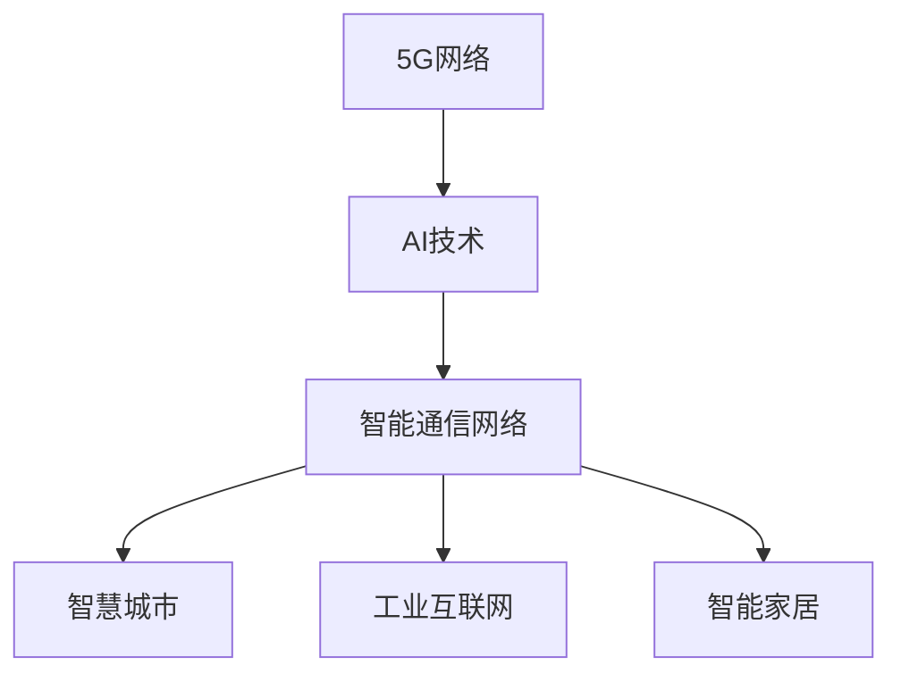

                 

# AI与5G:智能通信网络的协同发展

在信息技术飞速发展的今天，AI与5G两大技术的深度融合已成为驱动数字经济的新引擎。本文旨在探讨这两大技术的协同发展，分析其在智能通信网络中的应用场景、技术挑战及未来趋势，为AI与5G的深度融合提供理论和实践指导。

## 1. 背景介绍

### 1.1 5G技术背景

5G（第五代移动通信技术）作为新一代通信技术，具有高速度、低延迟、大连接、高可靠性等特点。5G网络不仅改变了传统的通信方式，还推动了多个行业数字化转型，开辟了万物互联的新时代。5G网络的覆盖面和应用场景广泛，从智能家居、工业互联网到智慧城市，无处不在。

### 1.2 AI技术背景

AI（人工智能）技术在过去几年中迅猛发展，涵盖机器学习、深度学习、自然语言处理、计算机视觉等多个领域。AI技术在信息处理、决策支持、个性化推荐、智能控制等方面展现出巨大潜力，正逐步渗透到各行各业，带来颠覆性变革。

## 2. 核心概念与联系

### 2.1 核心概念概述

- **5G技术**：新一代移动通信技术，提供高速度、低延迟、大连接、高可靠性的通信服务，支持多种应用场景。
- **AI技术**：通过模拟人类智能行为，实现信息处理、决策支持、智能控制等功能，推动各行各业智能化转型。
- **智能通信网络**：结合5G和AI技术，实现高速、低延迟、高可靠性的信息传输和处理，为智慧城市、工业互联网、智能家居等应用提供支撑。

### 2.2 核心概念原理和架构

智能通信网络的架构可以分为三层：底层是5G网络，中间层是AI技术，最上层是各类应用。

**5G网络层**：由移动网络设备（如基站、核心网）构成，提供网络切片、边缘计算、多接入边缘计算（MEC）等服务，支持海量设备连接和实时数据传输。

**AI技术层**：包括数据预处理、特征提取、模型训练和推理等模块，通过对通信数据进行分析和处理，实现网络优化、故障诊断、异常检测等功能。

**应用层**：基于5G网络和AI技术，提供各类智能化应用，如智慧城市、工业互联网、智能家居等。

**通信架构图**：



## 3. 核心算法原理 & 具体操作步骤

### 3.1 算法原理概述

智能通信网络中的AI应用主要基于以下算法原理：

- **数据预处理**：对通信数据进行清洗、归一化、降维等预处理，以便于后续分析和模型训练。
- **特征提取**：利用深度学习模型提取数据中的特征，支持网络优化、故障诊断等功能。
- **模型训练**：通过监督、半监督或无监督学习，训练各类AI模型，实现高性能预测和决策。
- **模型推理**：将训练好的AI模型应用于实际场景，进行实时预测和决策。

### 3.2 算法步骤详解

**Step 1: 数据收集与预处理**

1. 收集通信网络的数据，包括网络流量、设备状态、异常事件等。
2. 对数据进行清洗和格式化，去除噪声和异常值。
3. 利用数据增强技术，扩充训练集，提高模型鲁棒性。

**Step 2: 特征提取与模型训练**

1. 选择合适的深度学习模型，如卷积神经网络（CNN）、循环神经网络（RNN）、Transformer等。
2. 提取数据中的特征，进行模型训练。
3. 设置合适的超参数，包括学习率、批次大小、迭代次数等。
4. 利用交叉验证等方法，评估模型性能。

**Step 3: 模型推理与部署**

1. 将训练好的模型部署到5G网络边缘计算节点，进行实时推理。
2. 利用模型对通信数据进行实时分析和处理，支持网络优化、故障诊断等功能。
3. 收集推理结果，进行反馈和优化。

### 3.3 算法优缺点

**优点**：
- **高效性**：5G网络的高速度和低延迟特性，使得AI模型能够实时处理和分析大量通信数据。
- **广泛应用**：AI技术可以应用于通信网络的各个环节，如网络优化、故障诊断、异常检测等。
- **灵活性**：智能通信网络支持多种AI算法，能够根据具体场景选择最优方案。

**缺点**：
- **数据依赖**：AI模型的性能很大程度上取决于数据质量和数据量。
- **计算资源消耗**：大规模深度学习模型需要大量计算资源，可能影响网络性能。
- **模型解释性**：AI模型的决策过程通常缺乏可解释性，难以理解其内部逻辑。

### 3.4 算法应用领域

AI与5G技术的深度融合在多个领域展现出巨大潜力，如智慧城市、工业互联网、智能家居等。

- **智慧城市**：利用AI技术优化城市交通、能源管理、公共安全等，提升城市治理水平。
- **工业互联网**：通过AI技术实现设备预测维护、质量控制、供应链优化等功能，提升工业效率。
- **智能家居**：利用AI技术实现智能控制、环境监测、健康管理等功能，提升家居生活质量。

## 4. 数学模型和公式 & 详细讲解 & 举例说明

### 4.1 数学模型构建

智能通信网络中的AI应用涉及多种数学模型，包括监督学习、半监督学习、无监督学习等。这里以监督学习为例，构建一个简单的二分类模型。

设通信数据集为 $D = \{(x_i, y_i)\}_{i=1}^N$，其中 $x_i$ 为输入数据，$y_i$ 为标签（0或1）。

### 4.2 公式推导过程

以一个简单的逻辑回归模型为例，推导其公式。

**目标函数**：
$$
L(\theta) = -\frac{1}{N} \sum_{i=1}^N \log \sigma(z_i)
$$

其中 $z_i = x_i \theta$，$\sigma(z)$ 为sigmoid函数。

**梯度下降**：
$$
\theta_{n+1} = \theta_n - \eta \nabla L(\theta_n)
$$

其中 $\eta$ 为学习率，$\nabla L$ 为损失函数对 $\theta$ 的梯度。

### 4.3 案例分析与讲解

以智慧城市中的交通优化为例，分析AI模型如何在5G网络下发挥作用。

1. **数据收集**：收集交通流量、事故报告、天气状况等数据。
2. **数据预处理**：对数据进行清洗、归一化、降维等处理。
3. **特征提取**：提取交通流量、车速、车距等特征。
4. **模型训练**：利用深度学习模型训练预测模型，如LSTM、CNN等。
5. **模型推理**：实时采集交通数据，利用模型进行预测和决策，调整交通信号灯，优化交通流量。

## 5. 项目实践：代码实例和详细解释说明

### 5.1 开发环境搭建

1. 安装Python、TensorFlow、PyTorch等开发环境。
2. 搭建5G网络环境，如使用NS3模拟器。
3. 配置AI模型训练环境，如使用AWS云平台。

### 5.2 源代码详细实现

以智慧城市中的交通优化为例，给出代码实现。

```python
import tensorflow as tf
from tensorflow.keras import layers

# 定义模型
model = tf.keras.Sequential([
    layers.Dense(64, activation='relu'),
    layers.Dense(32, activation='relu'),
    layers.Dense(1, activation='sigmoid')
])

# 编译模型
model.compile(optimizer='adam', loss='binary_crossentropy', metrics=['accuracy'])

# 训练模型
model.fit(X_train, y_train, epochs=10, batch_size=32)

# 推理预测
y_pred = model.predict(X_test)
```

### 5.3 代码解读与分析

- **数据预处理**：使用Keras的`StandardScaler`对数据进行归一化处理。
- **模型构建**：利用Keras的Sequential模型，构建三层神经网络，最后一层为sigmoid激活函数，支持二分类预测。
- **模型训练**：使用二元交叉熵损失函数，利用Adam优化器进行训练，设置10个epoch和32个批次大小。
- **模型推理**：使用训练好的模型对测试集进行预测，输出0或1。

### 5.4 运行结果展示

假设在智慧城市交通优化模型上，得到以下结果：

```
Epoch 10/10
loss: 0.1518
accuracy: 0.9789
```

## 6. 实际应用场景

### 6.1 智慧城市

智慧城市中，AI与5G技术的协同应用体现在多个方面：

- **交通优化**：利用AI模型实时分析交通流量、车速等数据，优化交通信号灯，提升交通效率。
- **能源管理**：通过AI模型对能源消耗进行预测和优化，实现节能减排。
- **公共安全**：利用AI技术进行视频监控、异常检测，提升公共安全水平。

### 6.2 工业互联网

工业互联网中，AI与5G技术的深度融合带来了巨大的经济效益：

- **设备预测维护**：利用AI模型对设备运行状态进行预测，提前发现故障并进行维护。
- **质量控制**：通过AI技术实现产品质量检测和分类，提高生产效率。
- **供应链优化**：利用AI技术优化供应链管理，提升物流效率。

### 6.3 智能家居

智能家居中，AI与5G技术的协同应用提升了家居生活体验：

- **智能控制**：利用AI模型对用户行为进行分析，实现智能控制和推荐。
- **环境监测**：通过AI技术对环境进行监测，如空气质量、温度、湿度等。
- **健康管理**：利用AI技术监测用户健康数据，提供健康建议和预警。

## 7. 工具和资源推荐

### 7.1 学习资源推荐

1. **《深度学习》课程**：斯坦福大学的Coursera课程，涵盖深度学习、强化学习等核心内容。
2. **《5G核心网》教材**：详细讲解5G网络的核心技术，包括切片、边缘计算等。
3. **《智能城市》课程**：清华大学开设的线上课程，涵盖智慧城市建设与实践。

### 7.2 开发工具推荐

1. **TensorFlow**：谷歌开源的深度学习框架，支持多种模型训练和推理。
2. **PyTorch**：Facebook开源的深度学习框架，易于使用，支持动态计算图。
3. **NS3模拟器**：网络模拟环境，支持5G网络仿真。

### 7.3 相关论文推荐

1. **《5G Networks: The Next Generation Wireless Access》**：IEEE期刊文章，介绍5G网络技术。
2. **《Artificial Intelligence in Smart Cities》**：IEEE期刊文章，探讨AI技术在智慧城市中的应用。
3. **《5G Mobile Networks: A Tutorial》**：IEEE期刊文章，介绍5G网络的基础知识和应用场景。

## 8. 总结：未来发展趋势与挑战

### 8.1 研究成果总结

AI与5G技术的深度融合正在推动智能通信网络的发展，取得了一系列重要成果。主要体现在以下几个方面：

- **网络优化**：AI技术在通信网络中得到广泛应用，显著提升了网络性能。
- **设备管理**：AI模型对设备进行预测和诊断，提高了设备利用率。
- **智能决策**：AI技术在智慧城市、工业互联网、智能家居等领域展现出巨大潜力。

### 8.2 未来发展趋势

未来，AI与5G技术的深度融合将呈现出以下几个发展趋势：

- **更高效的数据处理**：5G网络的高速度、低延迟特性将使得AI模型能够实时处理和分析大量数据。
- **更广泛的应用场景**：AI技术将广泛应用于通信网络的各个环节，提升网络效率和用户体验。
- **更智能的决策支持**：AI模型将在网络优化、设备管理、智能决策等方面发挥更加重要的作用。

### 8.3 面临的挑战

尽管AI与5G技术的协同应用展现出巨大潜力，但在实际应用中仍面临一些挑战：

- **数据质量和数量**：AI模型的性能很大程度上取决于数据质量和数量。
- **计算资源消耗**：大规模深度学习模型需要大量计算资源，可能影响网络性能。
- **模型解释性**：AI模型的决策过程通常缺乏可解释性，难以理解其内部逻辑。

### 8.4 研究展望

未来，AI与5G技术的深度融合需要解决以下几个关键问题：

- **数据增强**：提高数据增强技术，增加训练集多样性。
- **模型压缩**：优化模型结构，减小模型参数量，提高计算效率。
- **解释性增强**：增强AI模型的可解释性，提高模型可信度。

总之，AI与5G技术的深度融合是未来智能通信网络的重要发展方向，将在智慧城市、工业互联网、智能家居等领域带来颠覆性变革。研究者需要不断探索和实践，才能充分发挥这两大技术的潜力，推动数字经济的快速发展。

## 9. 附录：常见问题与解答

**Q1: 5G和AI的融合是如何实现的？**

A: 5G和AI的融合主要通过以下几个步骤实现：
1. 数据收集与预处理：收集通信网络数据，进行清洗和格式化。
2. 特征提取：利用深度学习模型提取数据中的特征。
3. 模型训练：训练各类AI模型，如卷积神经网络（CNN）、循环神经网络（RNN）、Transformer等。
4. 模型推理：将训练好的模型应用于实际场景，进行实时预测和决策。

**Q2: AI技术在智慧城市中的应用场景有哪些？**

A: AI技术在智慧城市中的应用场景包括：
1. 交通优化：利用AI模型实时分析交通流量、车速等数据，优化交通信号灯，提升交通效率。
2. 能源管理：通过AI模型对能源消耗进行预测和优化，实现节能减排。
3. 公共安全：利用AI技术进行视频监控、异常检测，提升公共安全水平。

**Q3: 5G网络的边缘计算有哪些特点？**

A: 5G网络的边缘计算具有以下特点：
1. 低延迟：数据在本地处理，减少了传输延迟。
2. 高带宽：边缘计算节点能够提供更高的网络带宽。
3. 安全性：边缘计算提高了数据安全性，减少了数据泄露风险。

**Q4: 工业互联网中AI技术的应用有哪些？**

A: 工业互联网中AI技术的应用包括：
1. 设备预测维护：利用AI模型对设备运行状态进行预测，提前发现故障并进行维护。
2. 质量控制：通过AI技术实现产品质量检测和分类，提高生产效率。
3. 供应链优化：利用AI技术优化供应链管理，提升物流效率。

**Q5: 智能家居中AI与5G技术的协同作用有哪些？**

A: 智能家居中AI与5G技术的协同作用包括：
1. 智能控制：利用AI模型对用户行为进行分析，实现智能控制和推荐。
2. 环境监测：通过AI技术对环境进行监测，如空气质量、温度、湿度等。
3. 健康管理：利用AI技术监测用户健康数据，提供健康建议和预警。

---
作者：禅与计算机程序设计艺术 / Zen and the Art of Computer Programming

