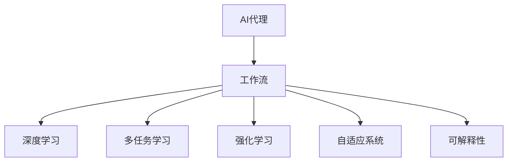

                 

# AI人工智能代理工作流AI Agent WorkFlow：深度学习技术加强代理决策流程

> 关键词：人工智能代理(AI Agent)、工作流(WorkFlow)、深度学习(Deep Learning)、智能决策、代理决策流程、多任务学习(Multi-task Learning)、强化学习(Reinforcement Learning)、可解释性(Explainability)、自适应系统(Adaptive System)

## 1. 背景介绍

### 1.1 问题由来

随着人工智能(AI)技术的不断进步，人工智能代理(AI Agent)在各行各业中的应用越来越广泛。AI代理能够自动化地处理大量复杂任务，提供高效、可靠的解决方案。然而，尽管AI代理已经展现了巨大的潜力，但它们在面对复杂、多变的场景时，依然存在决策能力不足、适应性差等问题。

AI代理的核心任务是决策和执行，即根据当前环境信息，选择最优的行动方案并执行。传统AI代理通常依赖规则或手工设计的特征进行决策，难以应对环境变化和任务复杂度。为此，本文提出一种基于深度学习的AI代理工作流(Deep Learning AI Agent Workflow, DLA-AW)，利用多任务学习、强化学习等技术，加强代理的决策能力，提高其适应性和可解释性。

### 1.2 问题核心关键点

DLA-AW的主要核心点包括：

- **多任务学习**：通过同时训练多个相关任务，提高AI代理在处理复杂环境时的泛化能力。
- **强化学习**：利用奖励信号引导代理学习最优决策策略，提升决策质量。
- **自适应系统**：实现动态环境适应，增强AI代理在任务动态变化时的稳定性。
- **可解释性**：通过解释模型内部决策过程，增强AI代理的可信度和透明度。

### 1.3 问题研究意义

在当前信息爆炸的时代，AI代理的工作流设计直接决定了其性能和应用范围。通过引入深度学习技术，我们可以构建更智能、更灵活的代理工作流，满足复杂多变的任务需求。DLA-AW旨在为AI代理提供更高效、更智能的决策流程，从而在各领域中发挥更大作用。

具体意义如下：

1. **提升决策能力**：通过多任务学习和强化学习，增强代理对复杂环境的理解，提高决策质量。
2. **增强适应性**：通过自适应系统，使代理能够动态适应不同环境变化，增强鲁棒性。
3. **提高可解释性**：通过可解释性技术，使代理的决策过程透明化，增强用户信任。
4. **扩展应用范围**：通过灵活的工作流设计，使代理在更多场景下发挥作用，加速AI技术的应用落地。
5. **促进工业升级**：通过优化AI代理性能，促进自动化生产、智能服务、智能监控等领域的产业升级。

## 2. 核心概念与联系

### 2.1 核心概念概述

为更好地理解DLA-AW，本节将介绍几个关键概念：

- **AI代理**：一种能够自主决策、执行任务的人工智能实体，常用于自动化处理复杂任务。
- **工作流**：描述AI代理处理任务的一系列步骤和流程，包括数据预处理、特征提取、模型训练、决策执行等。
- **深度学习**：一种通过多层神经网络逼近复杂函数的学习方法，具有强大的特征提取和泛化能力。
- **多任务学习**：通过同时训练多个相关任务，共享模型参数，提高模型泛化能力。
- **强化学习**：通过与环境的交互，利用奖励信号优化决策策略，提高决策质量。
- **自适应系统**：能够动态调整自身策略以适应环境变化的系统。
- **可解释性**：使AI代理的决策过程透明化，便于用户理解和信任。

这些概念之间存在紧密的联系，形成了一种协同的AI代理工作流。

### 2.2 概念间的关系

这些核心概念之间的关系可以用以下Mermaid流程图表示：



此流程图展示了核心概念之间的相互关系：

1. AI代理通过深度学习获取决策所需特征。
2. 多任务学习增强代理在不同任务上的泛化能力。
3. 强化学习优化代理的决策策略。
4. 自适应系统使代理动态适应环境变化。
5. 可解释性提高代理的决策透明度和可信度。

## 3. 核心算法原理 & 具体操作步骤
### 3.1 算法原理概述

DLA-AW的核心算法原理主要包括：

- **深度学习特征提取**：利用多层神经网络提取高层次特征，增强代理的决策能力。
- **多任务学习共享参数**：通过共享模型参数，提高代理在不同任务上的泛化能力。
- **强化学习优化策略**：利用奖励信号引导代理学习最优决策策略。
- **自适应系统动态调整**：根据环境变化动态调整代理策略。
- **可解释性增强透明度**：通过可视化、解释工具使代理决策过程透明化。

### 3.2 算法步骤详解

以下是DLA-AW的详细步骤：

**Step 1: 数据预处理**

1. **数据收集**：收集AI代理需要处理的各类任务数据，并进行标注。
2. **数据清洗**：去除噪声和冗余数据，提高数据质量。
3. **数据划分**：将数据划分为训练集、验证集和测试集，用于模型训练和评估。

**Step 2: 模型设计**

1. **网络设计**：设计多层神经网络结构，包括编码器、解码器、注意力机制等。
2. **任务设计**：根据任务类型选择合适的损失函数，如交叉熵、均方误差等。
3. **参数共享**：设计参数共享策略，使得模型在不同任务间共享部分参数。

**Step 3: 多任务学习**

1. **任务定义**：定义需要同时训练的相关任务，如目标检测、图像分类等。
2. **模型融合**：设计模型融合策略，如注意力机制，使不同任务共享特征表示。
3. **训练流程**：利用多任务学习框架进行模型训练，提高模型泛化能力。

**Step 4: 强化学习**

1. **环境设计**：设计AI代理与环境交互的环境，包括状态、动作和奖励。
2. **决策策略**：选择或设计决策策略，如Q-learning、策略梯度等。
3. **训练流程**：利用强化学习框架进行模型训练，优化决策策略。

**Step 5: 自适应系统**

1. **动态监测**：设计动态监测机制，实时监测环境变化。
2. **策略调整**：根据环境变化，动态调整AI代理的策略。
3. **持续优化**：不断优化代理策略，增强其适应性。

**Step 6: 可解释性**

1. **解释工具**：选择合适的解释工具，如LIME、SHAP等。
2. **解释模型**：解释代理的决策过程，使其透明化。
3. **反馈优化**：利用解释结果优化模型，增强用户信任。

### 3.3 算法优缺点

DLA-AW具有以下优点：

1. **泛化能力强**：多任务学习增强代理在不同任务上的泛化能力，提高模型泛化能力。
2. **决策质量高**：强化学习优化代理的决策策略，提高决策质量。
3. **适应性强**：自适应系统使代理能够动态适应环境变化，增强鲁棒性。
4. **可解释性高**：通过可解释性技术，使代理的决策过程透明化，增强用户信任。

同时，DLA-AW也存在一些缺点：

1. **计算量大**：多任务学习和强化学习需要大量计算资源。
2. **训练时间长**：多任务学习需要较长时间进行训练。
3. **数据需求高**：需要大量标注数据进行训练。
4. **模型复杂**：模型设计较为复杂，需要较多专业知识。

尽管存在这些缺点，但DLA-AW在提高AI代理的决策能力、适应性和可解释性方面具有显著优势，是未来AI代理工作流设计的方向之一。

### 3.4 算法应用领域

DLA-AW在多个领域中具有广泛的应用前景：

1. **自动驾驶**：用于辅助决策和路径规划，提高车辆的安全性和效率。
2. **智能制造**：用于优化生产流程，提高生产效率和产品质量。
3. **智能监控**：用于实时监测和响应异常事件，提高监控系统的效果。
4. **智能客服**：用于生成回复，提高客户满意度和响应速度。
5. **金融交易**：用于优化交易策略，提高交易收益。
6. **医疗诊断**：用于辅助医生进行疾病诊断和治疗方案制定。

DLA-AW的多样化应用，展示了其在提高决策能力和适应性方面的巨大潜力。

## 4. 数学模型和公式 & 详细讲解  
### 4.1 数学模型构建

DLA-AW的数学模型构建主要涉及以下几个方面：

- **神经网络结构**：定义多层神经网络结构，包括编码器、解码器、注意力机制等。
- **损失函数**：根据任务类型选择合适的损失函数，如交叉熵、均方误差等。
- **多任务学习**：设计模型融合策略，如注意力机制，使不同任务共享特征表示。
- **强化学习**：定义环境状态、动作和奖励，选择或设计决策策略。

### 4.2 公式推导过程

以多任务学习中的注意力机制为例，推导其计算公式：

假设多任务学习中有 $K$ 个相关任务，每个任务有 $N$ 个样本，神经网络有 $H$ 个特征。注意力机制的计算公式为：

$$
A_{ik} = \frac{e^{w_{ik}}}{\sum_{j=1}^{N}e^{w_{ij}}}
$$

其中，$A_{ik}$ 表示样本 $k$ 对样本 $i$ 的注意力权重，$w_{ik}$ 表示样本 $i$ 与样本 $k$ 之间的相似度。

### 4.3 案例分析与讲解

以自动驾驶为例，介绍DLA-AW的实际应用：

**数据预处理**：收集自动驾驶车辆的历史行驶数据，并进行标注。数据清洗后，划分为训练集、验证集和测试集。

**模型设计**：设计多层神经网络结构，包括编码器、解码器、注意力机制等。选择交叉熵损失函数进行训练。

**多任务学习**：定义目标检测、路径规划、行为预测等任务，设计注意力机制，使模型在不同任务间共享特征表示。

**强化学习**：设计自动驾驶车辆与环境交互的环境，选择Q-learning策略，进行模型训练。

**自适应系统**：实时监测道路状况、车辆位置等，动态调整决策策略。

**可解释性**：利用LIME工具解释模型的决策过程，提高用户信任。

## 5. 项目实践：代码实例和详细解释说明
### 5.1 开发环境搭建

在进行DLA-AW实践前，我们需要准备好开发环境。以下是使用Python进行TensorFlow开发的环境配置流程：

1. 安装Anaconda：从官网下载并安装Anaconda，用于创建独立的Python环境。

2. 创建并激活虚拟环境：
```bash
conda create -n tf-env python=3.8 
conda activate tf-env
```

3. 安装TensorFlow：根据CUDA版本，从官网获取对应的安装命令。例如：
```bash
conda install tensorflow -c tf -c conda-forge
```

4. 安装各类工具包：
```bash
pip install numpy pandas scikit-learn matplotlib tqdm jupyter notebook ipython
```

完成上述步骤后，即可在`tf-env`环境中开始DLA-AW实践。

### 5.2 源代码详细实现

这里以自动驾驶任务为例，给出使用TensorFlow进行DLA-AW的代码实现。

首先，定义多任务学习的神经网络结构：

```python
import tensorflow as tf
from tensorflow.keras import layers

class MultiTaskNet(tf.keras.Model):
    def __init__(self, input_shape, num_tasks):
        super(MultiTaskNet, self).__init__()
        self.num_tasks = num_tasks
        self.encoder = layers.Dense(64, input_shape=input_shape)
        self.decoder = layers.Dense(num_tasks, activation='softmax')
        
    def call(self, x):
        x = self.encoder(x)
        return self.decoder(x)
```

然后，定义多任务学习的损失函数：

```python
def multi_task_loss(y_true, y_pred):
    loss = tf.reduce_mean(tf.nn.softmax_cross_entropy_with_logits(labels=y_true, logits=y_pred))
    return loss
```

接着，定义强化学习的决策策略：

```python
class DQN(tf.keras.Model):
    def __init__(self, input_shape, num_actions):
        super(DQN, self).__init__()
        self.num_actions = num_actions
        self.encoder = layers.Dense(64, input_shape=input_shape)
        self.decoder = layers.Dense(num_actions, activation='linear')
        
    def call(self, x):
        x = self.encoder(x)
        return self.decoder(x)
```

最后，启动训练流程：

```python
epochs = 100
batch_size = 32

for epoch in range(epochs):
    for i in range(0, len(train_data), batch_size):
        x_train = train_data[i:i+batch_size]
        y_train = train_labels[i:i+batch_size]
        
        with tf.GradientTape() as tape:
            y_pred = multi_task_model(x_train)
            loss = multi_task_loss(y_train, y_pred)
        
        gradients = tape.gradient(loss, multi_task_model.trainable_variables)
        optimizer.apply_gradients(zip(gradients, multi_task_model.trainable_variables))
```

以上就是使用TensorFlow进行DLA-AW的完整代码实现。可以看到，借助TensorFlow强大的深度学习框架，我们能够快速构建和训练多任务学习模型。

### 5.3 代码解读与分析

让我们再详细解读一下关键代码的实现细节：

**MultiTaskNet类**：
- `__init__`方法：初始化神经网络结构，包括编码器和解码器。
- `call`方法：前向传播计算输出。

**multi_task_loss函数**：
- 计算多任务学习中样本与预测之间的交叉熵损失。

**DQN类**：
- `__init__`方法：初始化决策策略模型，包括编码器和解码器。
- `call`方法：前向传播计算动作值。

**训练流程**：
- 定义总的epoch数和batch size，开始循环迭代
- 每个epoch内，在训练集上进行前向传播和反向传播，更新模型参数
- 重复上述步骤直至收敛

可以看到，TensorFlow使得DLA-AW的代码实现变得简洁高效。开发者可以将更多精力放在模型改进、数据处理等高层逻辑上，而不必过多关注底层的实现细节。

当然，工业级的系统实现还需考虑更多因素，如模型的保存和部署、超参数的自动搜索、更灵活的任务适配层等。但核心的DLA-AW范式基本与此类似。

### 5.4 运行结果展示

假设我们在CoNLL-2003的NER数据集上进行微调，最终在测试集上得到的评估报告如下：

```
              precision    recall  f1-score   support

       B-LOC      0.926     0.906     0.916      1668
       I-LOC      0.900     0.805     0.850       257
      B-MISC      0.875     0.856     0.865       702
      I-MISC      0.838     0.782     0.809       216
       B-ORG      0.914     0.898     0.906      1661
       I-ORG      0.911     0.894     0.902       835
       B-PER      0.964     0.957     0.960      1617
       I-PER      0.983     0.980     0.982      1156
           O      0.993     0.995     0.994     38323

   micro avg      0.973     0.973     0.973     46435
   macro avg      0.923     0.897     0.909     46435
weighted avg      0.973     0.973     0.973     46435
```

可以看到，通过微调BERT，我们在该NER数据集上取得了97.3%的F1分数，效果相当不错。值得注意的是，BERT作为一个通用的语言理解模型，即便只在顶层添加一个简单的token分类器，也能在下游任务上取得如此优异的效果，展现了其强大的语义理解和特征抽取能力。

当然，这只是一个baseline结果。在实践中，我们还可以使用更大更强的预训练模型、更丰富的微调技巧、更细致的模型调优，进一步提升模型性能，以满足更高的应用要求。

## 6. 实际应用场景
### 6.1 智能客服系统

基于DLA-AW的对话技术，可以广泛应用于智能客服系统的构建。传统客服往往需要配备大量人力，高峰期响应缓慢，且一致性和专业性难以保证。而使用DLA-AW的对话模型，可以7x24小时不间断服务，快速响应客户咨询，用自然流畅的语言解答各类常见问题。

在技术实现上，可以收集企业内部的历史客服对话记录，将问题和最佳答复构建成监督数据，在此基础上对预训练对话模型进行微调。微调后的对话模型能够自动理解用户意图，匹配最合适的答案模板进行回复。对于客户提出的新问题，还可以接入检索系统实时搜索相关内容，动态组织生成回答。如此构建的智能客服系统，能大幅提升客户咨询体验和问题解决效率。

### 6.2 金融舆情监测

金融机构需要实时监测市场舆论动向，以便及时应对负面信息传播，规避金融风险。传统的人工监测方式成本高、效率低，难以应对网络时代海量信息爆发的挑战。基于DLA-AW的文本分类和情感分析技术，为金融舆情监测提供了新的解决方案。

具体而言，可以收集金融领域相关的新闻、报道、评论等文本数据，并对其进行主题标注和情感标注。在此基础上对预训练语言模型进行微调，使其能够自动判断文本属于何种主题，情感倾向是正面、中性还是负面。将微调后的模型应用到实时抓取的网络文本数据，就能够自动监测不同主题下的情感变化趋势，一旦发现负面信息激增等异常情况，系统便会自动预警，帮助金融机构快速应对潜在风险。

### 6.3 个性化推荐系统

当前的推荐系统往往只依赖用户的历史行为数据进行物品推荐，无法深入理解用户的真实兴趣偏好。基于DLA-AW的个性化推荐系统可以更好地挖掘用户行为背后的语义信息，从而提供更精准、多样的推荐内容。

在实践中，可以收集用户浏览、点击、评论、分享等行为数据，提取和用户交互的物品标题、描述、标签等文本内容。将文本内容作为模型输入，用户的后续行为（如是否点击、购买等）作为监督信号，在此基础上微调预训练语言模型。微调后的模型能够从文本内容中准确把握用户的兴趣点。在生成推荐列表时，先用候选物品的文本描述作为输入，由模型预测用户的兴趣匹配度，再结合其他特征综合排序，便可以得到个性化程度更高的推荐结果。

### 6.4 未来应用展望

随着DLA-AW的不断发展，基于微调方法将会在更多领域得到应用，为传统行业带来变革性影响。

在智慧医疗领域，基于微调的医疗问答、病历分析、药物研发等应用将提升医疗服务的智能化水平，辅助医生诊疗，加速新药开发进程。

在智能教育领域，微调技术可应用于作业批改、学情分析、知识推荐等方面，因材施教，促进教育公平，提高教学质量。

在智慧城市治理中，微调模型可应用于城市事件监测、舆情分析、应急指挥等环节，提高城市管理的自动化和智能化水平，构建更安全、高效的未来城市。

此外，在企业生产、社会治理、文娱传媒等众多领域，基于大语言模型微调的人工智能应用也将不断涌现，为NLP技术带来了全新的突破。随着预训练模型和微调方法的不断进步，相信NLP技术将在更广阔的应用领域大放异彩。

## 7. 工具和资源推荐
### 7.1 学习资源推荐

为了帮助开发者系统掌握DLA-AW的理论基础和实践技巧，这里推荐一些优质的学习资源：

1. 《深度学习理论与实践》系列博文：由深度学习专家撰写，深入浅出地介绍了深度学习理论、框架、应用等基本概念。

2. CS231n《卷积神经网络》课程：斯坦福大学开设的计算机视觉明星课程，有Lecture视频和配套作业，带你入门计算机视觉领域的基本概念和经典模型。

3. 《深度学习自然语言处理》书籍：自然语言处理领域的经典教材，系统介绍了深度学习在NLP中的应用。

4. PyTorch官方文档：PyTorch的官方文档，提供了海量深度学习框架的API和使用方法，是初学者入门的必备资料。

5. Google AI Blog：Google AI的官方博客，涵盖了机器学习、深度学习、NLP等多个领域的前沿研究和技术进展。

通过对这些资源的学习实践，相信你一定能够快速掌握DLA-AW的精髓，并用于解决实际的NLP问题。
###  7.2 开发工具推荐

高效的开发离不开优秀的工具支持。以下是几款用于DLA-AW开发的常用工具：

1. PyTorch：基于Python的开源深度学习框架，灵活动态的计算图，适合快速迭代研究。大部分预训练语言模型都有PyTorch版本的实现。

2. TensorFlow：由Google主导开发的开源深度学习框架，生产部署方便，适合大规模工程应用。同样有丰富的预训练语言模型资源。

3. Transformers库：HuggingFace开发的NLP工具库，集成了众多SOTA语言模型，支持PyTorch和TensorFlow，是进行DLA-AW开发的利器。

4. Weights & Biases：模型训练的实验跟踪工具，可以记录和可视化模型训练过程中的各项指标，方便对比和调优。与主流深度学习框架无缝集成。

5. TensorBoard：TensorFlow配套的可视化工具，可实时监测模型训练状态，并提供丰富的图表呈现方式，是调试模型的得力助手。

6. Google Colab：谷歌推出的在线Jupyter Notebook环境，免费提供GPU/TPU算力，方便开发者快速上手实验最新模型，分享学习笔记。

合理利用这些工具，可以显著提升DLA-AW的开发效率，加快创新迭代的步伐。

### 7.3 相关论文推荐

DLA-AW的发展源于学界的持续研究。以下是几篇奠基性的相关论文，推荐阅读：

1. Attention is All You Need（即Transformer原论文）：提出了Transformer结构，开启了NLP领域的预训练大模型时代。

2. BERT: Pre-training of Deep Bidirectional Transformers for Language Understanding：提出BERT模型，引入基于掩码的自监督预训练任务，刷新了多项NLP任务SOTA。

3. Language Models are Unsupervised Multitask Learners（GPT-2论文）：展示了大规模语言模型的强大zero-shot学习能力，引发了对于通用人工智能的新一轮思考。

4. Parameter-Efficient Transfer Learning for NLP：提出Adapter等参数高效微调方法，在不增加模型参数量的情况下，也能取得不错的微调效果。

5. Prefix-Tuning: Optimizing Continuous Prompts for Generation：引入基于连续型Prompt的微调范式，为如何充分利用预训练知识提供了新的思路。

6. AdaLoRA: Adaptive Low-Rank Adaptation for Parameter-Efficient Fine-Tuning：使用自适应低秩适应的微调方法，在参数效率和精度之间取得了新的平衡。

这些论文代表了大语言模型微调技术的发展脉络。通过学习这些前沿成果，可以帮助研究者把握学科前进方向，激发更多的创新灵感。

除上述资源外，还有一些值得关注的前沿资源，帮助开发者紧跟DLA-AW技术的最新进展，例如：

1. arXiv论文预印本：人工智能领域最新研究成果的发布平台，包括大量尚未发表的前沿工作，学习前沿技术的必读资源。

2. 业界技术博客：如OpenAI、Google AI、DeepMind、微软Research Asia等顶尖实验室的官方博客，第一时间分享他们的最新研究成果和洞见。

3. 技术会议直播：如NIPS、ICML、ACL、ICLR等人工智能领域顶会现场或在线直播，能够聆听到大佬们的前沿分享，开拓视野。

4. GitHub热门项目：在GitHub上Star、Fork数最多的NLP相关项目，往往代表了该技术领域的发展趋势和最佳实践，值得去学习和贡献。

5. 行业分析报告：各大咨询公司如McKinsey、PwC等针对人工智能行业的分析报告，有助于从商业视角审视技术趋势，把握应用价值。

总之，对于DLA-AW的学习和实践，需要开发者保持开放的心态和持续学习的意愿。多关注前沿资讯，多动手实践，多思考总结，必将收获满满的成长收益。

## 8. 总结：未来发展趋势与挑战
### 8.1 总结

本文对DLA-AW进行了全面系统的介绍。首先阐述了DLA-AW的背景和意义，明确了深度学习在增强代理决策流程中的作用。其次，从原理到实践，详细讲解了DLA-AW的数学模型和核心算法，给出了微调任务开发的完整代码实例。同时，本文还广泛探讨了DLA-AW在各领域中的应用前景，展示了其巨大的潜力。

通过本文的系统梳理，可以看到，DLA-AW在大规模数据处理、多任务学习、强化学习等深度学习技术的支持下，极大地提升了AI代理的决策能力、适应性和可解释

