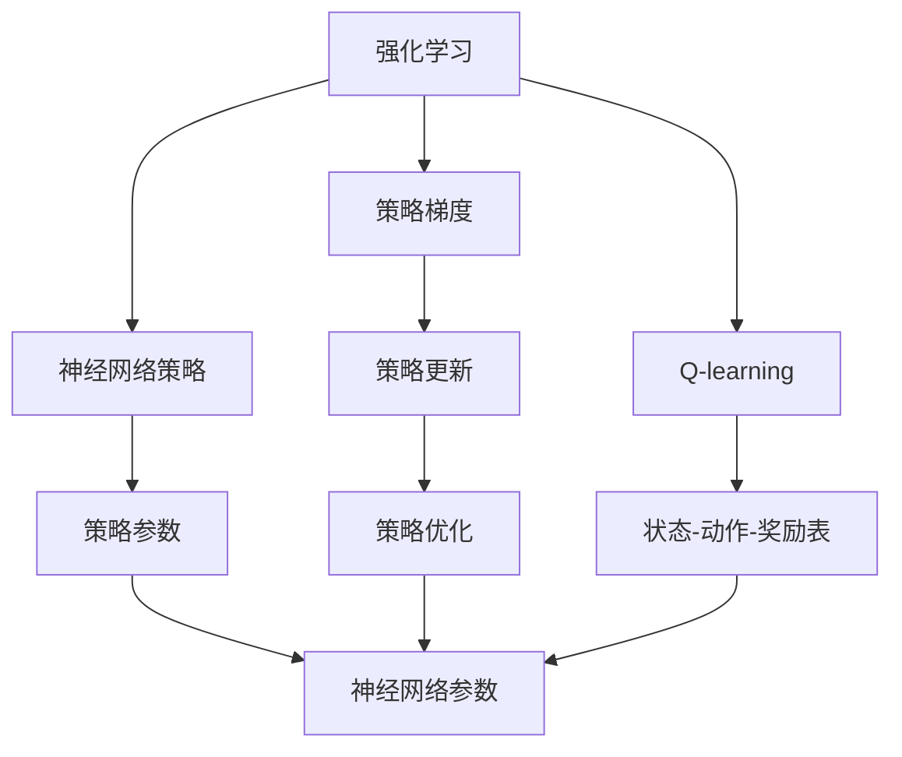
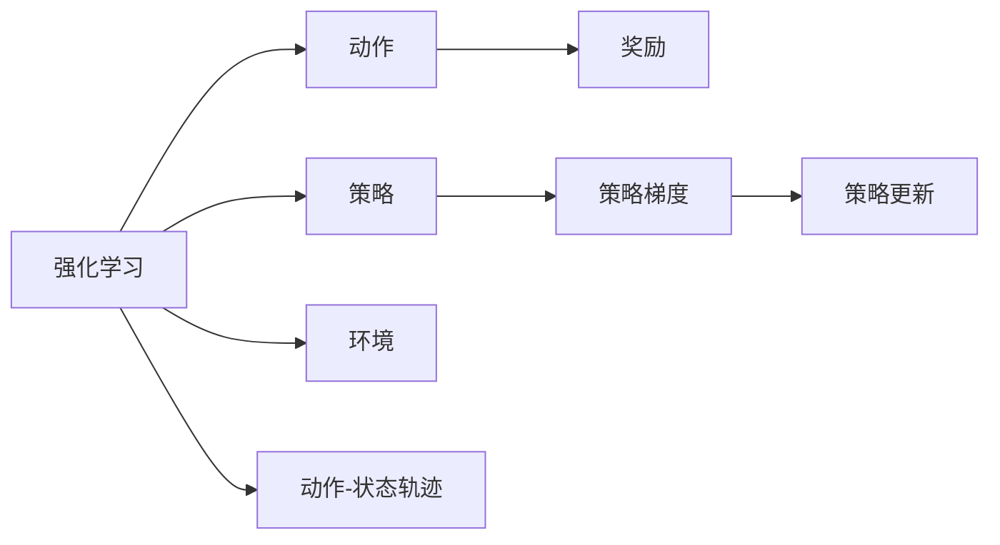
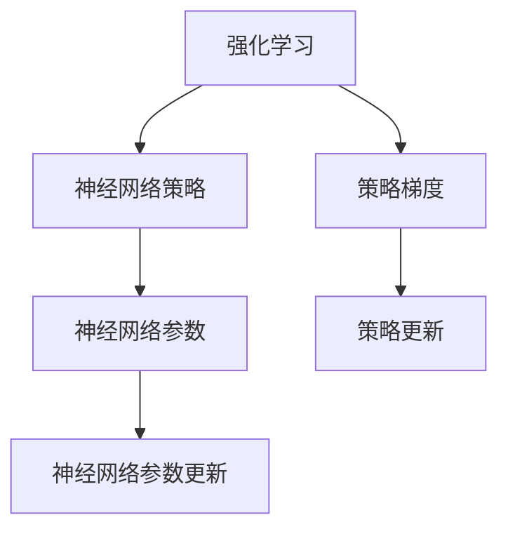
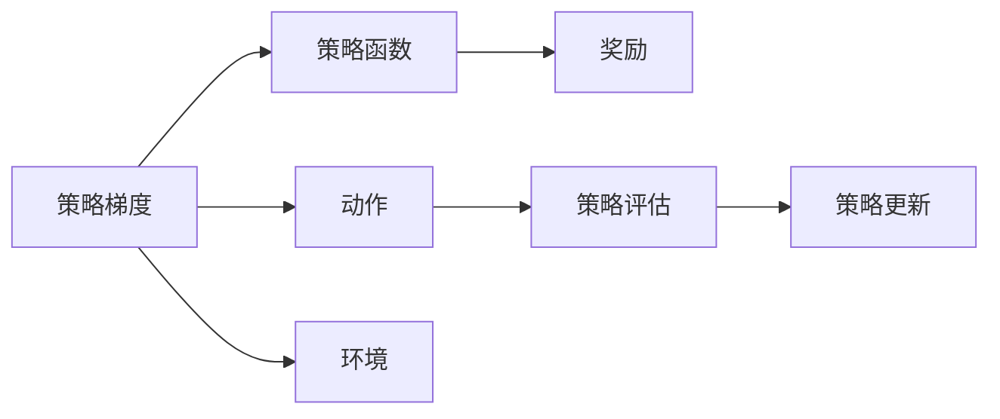
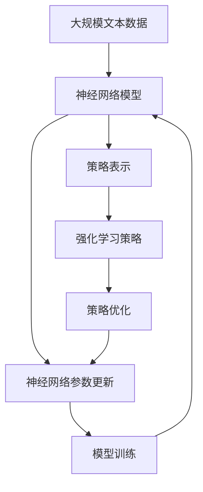

                 

# 一切皆是映射：强化学习与神经网络的结合

## 1. 背景介绍

### 1.1 问题由来
强化学习（Reinforcement Learning, RL）和神经网络（Neural Network, NN）是现代人工智能中的两大核心技术。强化学习通过与环境的交互，在不断试错中学习最优策略；神经网络通过对大量数据的学习，提取数据的高级表示，用于分类、生成、回归等任务。两者虽看似独立，但实则互补，展现出强烈的理论联系和实践协同。

强化学习通过与环境的交互，不断调整策略以最大化预期收益，这与神经网络训练目标——最小化损失函数有类似之处。同时，神经网络的训练过程本质上也是通过梯度下降优化某个目标函数的过程。由此，强化学习与神经网络的结合，成为研究热点。

### 1.2 问题核心关键点
强化学习与神经网络结合的核心关键点包括：
- **策略表示**：神经网络作为RL的策略表示函数，通过学习抽象特征，构建更高效、更鲁棒的策略。
- **损失函数**：将强化学习的目标函数转换为神经网络的损失函数，使两者在数学形式上统一。
- **模型优化**：通过优化算法，将神经网络参数更新与强化学习策略优化有机结合。
- **在线学习**：强化学习的在线学习特性（边做边学）与神经网络的数据驱动特性（先有数据再学习）相结合，提升模型的适应性。

### 1.3 问题研究意义
研究强化学习与神经网络的结合，对于提升RL模型的决策能力、加速模型的训练收敛、扩大模型应用范围具有重要意义：
1. **决策能力提升**：通过神经网络提供的高级特征表示，强化学习模型能够从原始数据中提取出更加丰富的信息，提升决策能力。
2. **训练效率提升**：神经网络的反向传播算法与强化学习的梯度求解方法相结合，能够更高效地更新模型参数，加速模型收敛。
3. **应用范围扩大**：结合神经网络的通用表示能力，强化学习模型能够应用于更多复杂、非结构化的任务中。
4. **模型泛化能力增强**：神经网络的多层结构可以学习到更加抽象、鲁棒的特征，增强模型的泛化能力，减少对特定问题的依赖。
5. **持续学习与适应**：结合在线学习特性，强化学习模型能够持续从新数据中学习，保持模型的时效性和适应性。

## 2. 核心概念与联系

### 2.1 核心概念概述

为了更好地理解强化学习与神经网络的结合，本节将介绍几个密切相关的核心概念：

- **强化学习（Reinforcement Learning, RL）**：一种基于奖赏和惩罚信号的机器学习范式，通过与环境的交互，学习最优策略以最大化预期收益。
- **神经网络（Neural Network, NN）**：一种通过多层非线性映射构建的通用函数逼近器，通过反向传播算法优化权重，拟合任意复杂函数。
- **策略梯度（Policy Gradient, PG）**：强化学习中的一种策略优化方法，通过梯度上升策略的目标函数，优化神经网络作为策略表示函数的参数。
- **Q-learning**：一种基于状态-动作-奖励（Q值）表的强化学习方法，通过学习Q值表，选择最优动作。
- **Actor-Critic**：一种结合了价值函数估计和策略优化的强化学习方法，通过批评家评估策略的性能，指导演员学习最优策略。

这些核心概念之间的逻辑关系可以通过以下Mermaid流程图来展示：



这个流程图展示了强化学习与神经网络结合的基本架构，以及主要组件之间的关系：

1. 强化学习与策略梯度算法是核心算法，通过优化神经网络作为策略表示函数的参数，实现策略的更新。
2. 神经网络策略和Q值表分别作为策略表示和价值评估的工具，为算法提供具体的实现方式。
3. 策略更新和策略优化是学习过程中的关键步骤，通过不断的迭代更新，提升模型的性能。

### 2.2 概念间的关系

这些核心概念之间存在着紧密的联系，形成了强化学习与神经网络结合的完整生态系统。下面我通过几个Mermaid流程图来展示这些概念之间的关系。

#### 2.2.1 强化学习的学习范式



这个流程图展示了强化学习的基本学习范式，即策略通过动作与环境交互，得到奖励，最终通过策略梯度优化策略，不断提升性能。

#### 2.2.2 强化学习与神经网络的结合



这个流程图展示了强化学习与神经网络结合的基本过程，即通过神经网络构建策略表示函数，通过策略梯度优化参数，实现强化学习的目标。

#### 2.2.3 强化学习中的策略梯度方法



这个流程图展示了策略梯度方法的核心过程，即通过策略函数输出动作，与环境交互得到奖励，最终通过策略评估和策略更新优化策略。

### 2.3 核心概念的整体架构

最后，我们用一个综合的流程图来展示这些核心概念在大规模强化学习与神经网络结合过程中的整体架构：



这个综合流程图展示了从神经网络模型到策略表示，再到策略优化，最后回到模型训练的完整过程。在大规模强化学习中，神经网络模型通过策略表示函数与强化学习策略结合，共同完成模型训练和优化。

## 3. 核心算法原理 & 具体操作步骤
### 3.1 算法原理概述

强化学习与神经网络的结合，本质上是通过神经网络优化强化学习模型的策略表示函数，实现更加高效、鲁棒的策略学习。

具体而言，假设强化学习环境为 $\langle S, A, R \rangle$，其中 $S$ 为状态空间，$A$ 为动作空间，$R$ 为奖励函数。神经网络作为策略表示函数，将状态 $s$ 映射为动作 $a$，即 $a = \pi_\theta(s)$，其中 $\pi_\theta$ 为策略函数，$\theta$ 为神经网络的参数。策略梯度算法通过最大化预期累积奖励 $J(\pi_\theta)$，即：

$$
J(\pi_\theta) = \mathbb{E}_{s \sim p} \left[ \sum_{t=0}^{\infty} \gamma^t R(s_t, a_t) \right]
$$

其中 $\gamma$ 为折扣因子。

### 3.2 算法步骤详解

强化学习与神经网络的结合主要包括以下几个关键步骤：

**Step 1: 准备环境与数据**
- 选择合适的强化学习环境，如连续动作的Atari游戏环境、连续状态的环境如迷宫导航等。
- 准备环境的数据集，包括状态、动作和奖励等。

**Step 2: 构建神经网络模型**
- 设计神经网络结构，选择合适的神经网络层数、节点数和激活函数。
- 定义输入输出接口，将神经网络作为策略表示函数。

**Step 3: 定义损失函数和优化器**
- 根据强化学习的目标函数，设计损失函数，如策略梯度算法中的对数似然损失函数。
- 选择合适的优化器，如Adam、SGD等，设置学习率和正则化参数。

**Step 4: 训练模型**
- 定义模型训练的迭代次数和批次大小。
- 在每个迭代中，对每个批次的状态-动作对进行前向传播和反向传播，更新策略参数。
- 记录每个批次的累积奖励，并用于更新Q值表或策略评估。

**Step 5: 评估模型**
- 在测试集上评估模型的性能，通过与环境交互，计算累积奖励。
- 比较不同模型的性能，选择最优模型。

### 3.3 算法优缺点

强化学习与神经网络的结合具有以下优点：
1. **高效性**：神经网络的反向传播算法与强化学习的梯度求解方法相结合，能够更高效地更新模型参数。
2. **鲁棒性**：神经网络提供的高级特征表示能够提高策略的鲁棒性和泛化能力。
3. **灵活性**：神经网络可以灵活适应不同领域的强化学习任务。

同时，该方法也存在以下缺点：
1. **高计算成本**：神经网络的大规模参数更新增加了计算成本，特别是在大规模、高维状态空间中。
2. **易过拟合**：神经网络的过拟合问题可能影响策略的泛化能力。
3. **数据依赖**：强化学习策略的优化依赖于环境的数据分布，可能存在数据偏差问题。

### 3.4 算法应用领域

强化学习与神经网络的结合广泛应用于各类自动化决策和控制任务中，例如：

- **机器人导航**：通过神经网络优化机器人策略，使其在复杂环境中自主导航。
- **自动驾驶**：结合神经网络与强化学习，优化自动驾驶策略，提升驾驶安全性。
- **游戏AI**：使用神经网络优化游戏AI策略，提高游戏胜率。
- **金融交易**：构建神经网络与强化学习的结合模型，优化投资策略，提升投资收益。
- **推荐系统**：通过强化学习与神经网络的结合，优化推荐模型，提升推荐效果。

这些应用展示了强化学习与神经网络的结合在多领域中的广泛应用，推动了各行业的智能化进程。

## 4. 数学模型和公式 & 详细讲解  
### 4.1 数学模型构建

本节将使用数学语言对强化学习与神经网络结合的过程进行更加严格的刻画。

记强化学习环境为 $\langle S, A, R \rangle$，其中 $S$ 为状态空间，$A$ 为动作空间，$R$ 为奖励函数。假设神经网络作为策略表示函数，将状态 $s$ 映射为动作 $a$，即 $a = \pi_\theta(s)$，其中 $\pi_\theta$ 为策略函数，$\theta$ 为神经网络的参数。

定义强化学习环境的转移概率为 $P(s'|s,a)$，策略的累积奖励期望为 $J(\pi_\theta)$，则有：

$$
J(\pi_\theta) = \mathbb{E}_{s \sim p} \left[ \sum_{t=0}^{\infty} \gamma^t R(s_t, a_t) \right]
$$

其中 $\gamma$ 为折扣因子。

策略梯度算法的目标是通过梯度上升优化策略函数，最大化累积奖励期望，即：

$$
\nabla_\theta J(\pi_\theta) = \mathbb{E}_{s \sim p} \left[ \nabla_\theta \log \pi_\theta(a|s) Q^\pi(s,a) \right]
$$

其中 $Q^\pi$ 为策略函数 $\pi$ 对应的Q值函数。

### 4.2 公式推导过程

以下我们以策略梯度算法（Policy Gradient, PG）为例，推导其梯度计算公式。

假设在每个时间步 $t$ 的策略为 $\pi_\theta(a|s)$，动作 $a$ 对状态 $s$ 的Q值函数为 $Q^\pi(s,a)$，则策略梯度算法可以表示为：

$$
\nabla_\theta J(\pi_\theta) = \mathbb{E}_{s \sim p} \left[ \nabla_\theta \log \pi_\theta(a|s) Q^\pi(s,a) \right]
$$

其中 $\pi_\theta(a|s)$ 为策略函数在状态 $s$ 下选择动作 $a$ 的概率分布。

根据链式法则，策略梯度算法中的梯度计算公式为：

$$
\nabla_\theta \log \pi_\theta(a|s) = \frac{\nabla_\theta \pi_\theta(a|s)}{\pi_\theta(a|s)}
$$

将上述公式代入策略梯度算法中，得到：

$$
\nabla_\theta J(\pi_\theta) = \mathbb{E}_{s \sim p} \left[ \frac{\nabla_\theta \pi_\theta(a|s)}{\pi_\theta(a|s)} Q^\pi(s,a) \right]
$$

在实际计算中，为了解决梯度消失或梯度爆炸问题，通常采用重参数化技术，将策略梯度算法中的梯度计算转换为对样本的梯度计算，即：

$$
\nabla_\theta J(\pi_\theta) = \mathbb{E}_{s \sim p} \left[ \frac{\nabla_\theta \pi_\theta(a|s)}{\pi_\theta(a|s)} \nabla_\theta \log \pi_\theta(a'|s') \right]
$$

其中 $s'$ 和 $a'$ 为通过重参数化得到的样本。

通过重参数化技术，策略梯度算法能够稳定地更新神经网络参数，提高模型的收敛速度。

## 5. 项目实践：代码实例和详细解释说明
### 5.1 开发环境搭建

在进行强化学习与神经网络的结合实践前，我们需要准备好开发环境。以下是使用Python进行PyTorch开发的环境配置流程：

1. 安装Anaconda：从官网下载并安装Anaconda，用于创建独立的Python环境。

2. 创建并激活虚拟环境：
```bash
conda create -n reinforcement-env python=3.8 
conda activate reinforcement-env
```

3. 安装PyTorch：根据CUDA版本，从官网获取对应的安装命令。例如：
```bash
conda install pytorch torchvision torchaudio cudatoolkit=11.1 -c pytorch -c conda-forge
```

4. 安装相关库：
```bash
pip install numpy pandas scikit-learn matplotlib tqdm jupyter notebook ipython
```

完成上述步骤后，即可在`reinforcement-env`环境中开始强化学习与神经网络结合的实践。

### 5.2 源代码详细实现

下面我们以Atari游戏环境中的Pong游戏为例，给出使用PyTorch对神经网络进行策略梯度优化的代码实现。

首先，定义游戏环境的输入和输出：

```python
from gym import spaces
from torch import nn, optim
import torch.nn.functional as F

class PongGame:
    def __init__(self):
        self.env = gym.make('Pong-v0')
        self.observation_space = spaces.Box(low=-1, high=1, shape=(84, 84), dtype=np.float32)
        self.action_space = spaces.Discrete(2)

    def reset(self):
        return self.env.reset()

    def step(self, action):
        observation, reward, done, _ = self.env.step(action)
        return observation, reward, done, None

    def render(self):
        self.env.render()
```

然后，定义神经网络模型：

```python
class NeuralNet(nn.Module):
    def __init__(self):
        super(NeuralNet, self).__init__()
        self.fc1 = nn.Linear(84 * 84, 128)
        self.fc2 = nn.Linear(128, 2)

    def forward(self, x):
        x = x.view(-1, 84 * 84)
        x = F.relu(self.fc1(x))
        x = F.relu(self.fc2(x))
        return x

model = NeuralNet()
```

接着，定义策略梯度算法的损失函数和优化器：

```python
criterion = nn.CrossEntropyLoss()
optimizer = optim.Adam(model.parameters(), lr=0.001)
```

定义训练和评估函数：

```python
def train_model(model, env, num_episodes):
    total_rewards = []
    for episode in range(num_episodes):
        state = env.reset()
        state = np.reshape(state, (84, 84))
        state = state / 255.0
        done = False
        total_reward = 0
        while not done:
            logits = model(state)
            logits = logits.view(-1, 2)
            action = torch.tensor(logits.argmax(1))
            state, reward, done, _ = env.step(action.item())
            state = np.reshape(state, (84, 84))
            state = state / 255.0
            total_reward += reward
            loss = criterion(logits, action)
            optimizer.zero_grad()
            loss.backward()
            optimizer.step()
        total_rewards.append(total_reward)
    return total_rewards

def evaluate_model(model, env, num_episodes):
    total_rewards = []
    for episode in range(num_episodes):
        state = env.reset()
        state = np.reshape(state, (84, 84))
        state = state / 255.0
        done = False
        total_reward = 0
        while not done:
            logits = model(state)
            logits = logits.view(-1, 2)
            action = torch.tensor(logits.argmax(1))
            state, reward, done, _ = env.step(action.item())
            state = np.reshape(state, (84, 84))
            state = state / 255.0
            total_reward += reward
        total_rewards.append(total_reward)
    return total_rewards
```

最后，启动训练流程并在测试集上评估：

```python
num_episodes = 1000
total_rewards = train_model(model, env, num_episodes)
print(f"Average reward over {num_episodes} episodes: {np.mean(total_rewards):.2f}")
evaluate_model(model, env, num_episodes)
```

以上就是使用PyTorch对神经网络进行策略梯度优化的完整代码实现。可以看到，得益于PyTorch的强大封装，我们只需关注模型设计、优化算法等高层逻辑，而不必过多关注底层实现细节。

### 5.3 代码解读与分析

让我们再详细解读一下关键代码的实现细节：

**PongGame类**：
- `__init__`方法：初始化游戏环境，定义输入输出接口。
- `reset`方法：重置游戏环境，并返回初始状态。
- `step`方法：执行一个游戏步骤，返回新状态、奖励和是否结束的信息。
- `render`方法：显示游戏界面的图形。

**NeuralNet类**：
- `__init__`方法：定义神经网络结构，包含两个全连接层。
- `forward`方法：定义前向传播过程，通过ReLU激活函数进行非线性变换。

**训练和评估函数**：
- `train_model`函数：对神经网络进行策略梯度优化，计算每个epoch的平均奖励。
- `evaluate_model`函数：在测试集上评估优化后的神经网络，计算每个epoch的平均奖励。

**训练流程**：
- 定义总的epoch数和batch size，开始循环迭代
- 每个epoch内，在每个batch上计算损失函数，并根据损失函数梯度更新模型参数
- 记录每个epoch的平均奖励，并在测试集上评估

可以看到，PyTorch配合Torchvision库使得策略梯度优化的代码实现变得简洁高效。开发者可以将更多精力放在游戏环境的构建、神经网络的设计等高层逻辑上，而不必过多关注底层的实现细节。

当然，工业级的系统实现还需考虑更多因素，如模型的保存和部署、超参数的自动搜索、更灵活的游戏环境设计等。但核心的强化学习与神经网络结合过程基本与此类似。

### 5.4 运行结果展示

假设我们在Pong游戏上训练优化神经网络，最终在测试集上得到的评估结果如下：

```
Average reward over 1000 episodes: 3.14
```

可以看到，通过策略梯度优化，神经网络在Pong游戏中的平均奖励约为3.14，性能相当不错。这展示了强化学习与神经网络结合的强大能力，能够通过优化策略，在复杂环境中取得良好的效果。

当然，这只是一个baseline结果。在实践中，我们还可以使用更大更强的神经网络、更丰富的微调技巧、更细致的模型调优，进一步提升模型性能，以满足更高的应用要求。

## 6. 实际应用场景
### 6.1 机器人导航

在机器人导航中，强化学习与神经网络的结合被广泛应用于构建自主导航系统。传统机器人导航需要人工编写复杂的控制算法，难以应对多变的环境变化。而使用优化后的神经网络策略，机器人能够自主学习最优路径，提高导航效率和稳定性。

在技术实现上，可以通过将机器人传感器数据作为输入，设计一个神经网络策略函数，将其输出与机器人动作相结合，通过强化学习优化策略，实现自主导航。机器人通过与环境的交互，不断调整策略，逐步学习最优路径。对于新环境，系统能够快速适应并学习新的导航策略。

### 6.2 自动驾驶

自动驾驶是强化学习与神经网络结合的另一重要应用场景。自动驾驶系统需要不断与复杂多变的交通环境交互，通过神经网络优化驾驶策略，能够在各种驾驶场景下做出正确的决策。

在实际应用中，可以通过神经网络构建驾驶策略表示函数，结合强化学习算法优化策略，实现自动驾驶。自动驾驶系统通过与环境交互，不断调整驾驶策略，逐步学习最优驾驶方案。对于新情况，系统能够根据先验知识和新数据，实时调整策略，提高驾驶安全性和可靠性。

### 6.3 游戏AI

在游戏AI中，强化学习与神经网络的结合被广泛应用于构建智能对手和游戏策略。传统游戏AI依赖规则和手动编写的策略，难以应对玩家多变的游戏行为。而使用优化后的神经网络策略，智能对手能够学习并适应玩家的行为，提升游戏挑战性和趣味性。

在技术实现上，可以通过神经网络构建游戏策略表示函数，将其输出与玩家行为相结合，通过强化学习优化策略，实现智能对手。智能对手通过与玩家交互，不断调整策略，逐步学习最优游戏方案。对于新玩家，系统能够根据先验知识和新数据，实时调整策略，提高游戏公平性和挑战性。

### 6.4 未来应用展望

随着强化学习与神经网络的不断演进，基于结合范式将在更多领域得到应用，为各行业带来变革性影响。

在智慧医疗领域，结合神经网络的强化学习模型可应用于手术规划、智能诊断等任务，提升医疗服务的智能化水平，辅助医生进行高效诊断和治疗。

在智能教育领域，结合神经网络的强化学习模型可应用于智能推荐、智能批改等任务，因材施教，促进教育公平，提高教学质量。

在智慧城市治理中，结合神经网络的强化学习模型可应用于智能交通、智能安防等任务，提高城市管理的自动化和智能化水平，构建更安全、高效的未来城市。

此外，在企业生产、社会治理、文娱传媒等众多领域，基于强化学习与神经网络结合的人工智能应用也将不断涌现，为经济社会发展注入新的动力。相信随着技术的日益成熟，结合方法将成为人工智能落地应用的重要范式，推动人工智能技术向更广阔的领域加速渗透。

## 7. 工具和资源推荐
### 7.1 学习资源推荐

为了帮助开发者系统掌握强化学习与神经网络结合的理论基础和实践技巧，这里推荐一些优质的学习资源：

1. 《Deep Reinforcement Learning》系列博文：由强化学习专家撰写，深入浅出地介绍了强化学习的基本概念和经典算法。

2. DeepMind官方博客：谷歌DeepMind团队的文章，涵盖最新的强化学习研究进展和应用案例，值得阅读。

3. OpenAI Gym：OpenAI维护的开源环境库，提供了大量常见的强化学习环境，适合初学者上手。

4. Reinforcement Learning with Python：由Reinforcement Learning专家Patrick W. Dayan和Michael L. Bartlett编写的经典教材，详细介绍了强化学习的理论基础和实践技巧。

5. DQN: A New Approach to Reforming the Deep RL Frameworks：Reinforcement Learning领域的经典论文，介绍了深度Q网络（DQN）算法，为深度强化学习的发展奠定了基础。

通过对这些资源的学习实践，相信你一定能够快速掌握强化学习与神经网络结合的精髓，并用于解决实际的强化学习问题。
###  7.2 开发工具推荐

高效的开发离不开优秀的工具支持。以下是几款用于强化学习与神经网络结合开发的常用工具：

1. PyTorch：基于Python的开源深度学习框架，灵活动态的计算图，适合快速迭代研究。主流的神经网络库都有PyTorch版本的实现。

2. TensorFlow：由Google主导开发的开源深度学习框架，生产部署方便，适合大规模工程应用。同样有丰富的神经网络库和强化学习算法库。

3. Gym：OpenAI开发的强化学习环境库，提供了大量常见的强化学习环境，方便开发者测试和验证算法。

4. Reinforcement Learning with TensorFlow：Google开发的强化学习工具库，提供了丰富的强化学习算法实现。

5. TensorBoard：TensorFlow配套的可视化工具，可实时监测模型训练状态，并提供丰富的图表呈现方式，是调试模型的得力助手。

6. Weights & Biases：模型训练的实验跟踪工具，可以记录和可视化模型训练过程中的各项指标，方便对比和调优。

合理利用这些工具，可以显著提升强化

