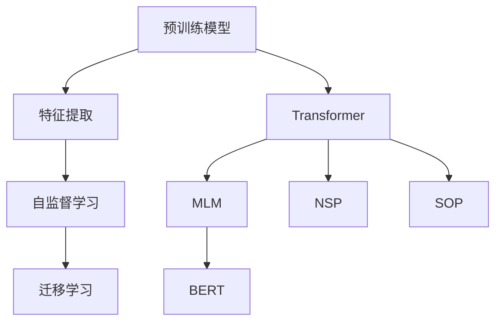
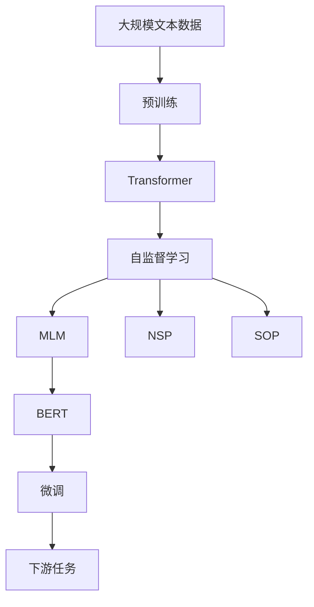
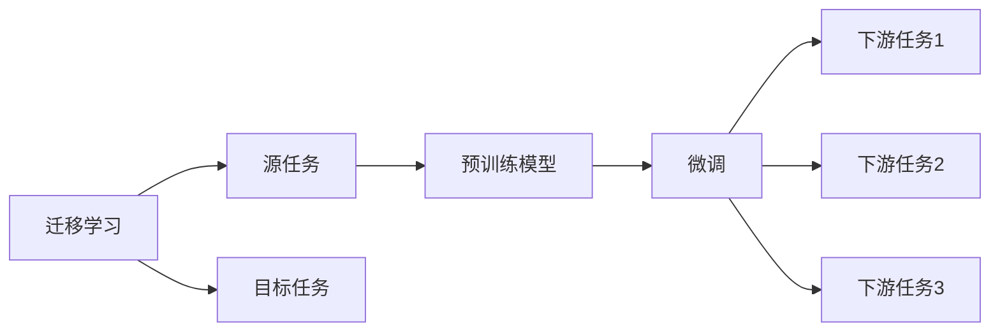
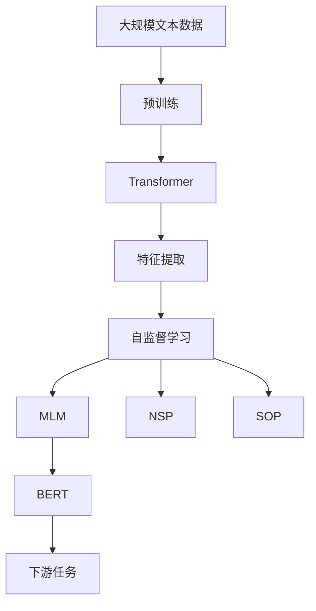

                 

# 一切皆是映射：预训练模型如何改变深度学习领域

> 关键词：预训练模型,深度学习,特征提取,自监督学习,迁移学习,Transformer,BERT

## 1. 背景介绍

### 1.1 问题由来
近年来，深度学习技术的快速发展，使得其在图像识别、语音识别、自然语言处理(NLP)等多个领域取得了显著的成果。特别是在NLP领域，深度学习模型的性能不断突破，逐渐超越了传统机器学习模型，展现了强大的语言理解和生成能力。然而，传统的深度学习模型需要大规模的标注数据进行训练，标注成本高昂，且存在过拟合的风险。

为解决这些问题，预训练模型（Pre-trained Models）应运而生。预训练模型通过在大规模无标签文本语料上进行自监督学习任务，学习到通用的语言表示，可以在下游任务上通过少量标注数据进行微调（Fine-tuning），显著提升模型性能。预训练模型在NLP领域的代表作品包括OpenAI的GPT系列模型、Google的BERT等。这些预训练模型不仅在学术界引起了广泛关注，更在实际应用中展示了其强大的性能。

预训练模型的大规模应用，不仅降低了NLP应用的标注成本，还提升了模型在特定任务上的泛化能力，推动了NLP技术的产业化进程。但同时也引发了新的研究热点和挑战，预训练模型如何改变深度学习的未来发展方向，成为了当前深度学习研究的重要课题。

### 1.2 问题核心关键点
预训练模型与传统的深度学习模型有何不同？其背后的核心原理是什么？预训练模型如何通过自监督学习任务学习到通用的语言表示？预训练模型在实际应用中面临哪些挑战和瓶颈？这些问题将会在接下来的内容中一一解答。

## 2. 核心概念与联系

### 2.1 核心概念概述

为更好地理解预训练模型及其应用，本节将介绍几个密切相关的核心概念：

- 预训练模型(Pre-trained Models)：指在大规模无标签文本语料上通过自监督学习任务训练得到的通用语言模型。常见的自监督任务包括掩码语言模型（Masked Language Modeling, MLM）、下一句预测（Next Sentence Prediction, NSP）、句子顺序预测（Sentence Order Prediction, SOP）等。

- 特征提取(Feature Extraction)：指模型通过自监督学习任务学习到通用的语言表示，从而提取文本中的重要特征，为下游任务提供支持。

- 自监督学习(Self-supervised Learning)：指使用无标签数据进行模型训练，通过构造输入数据的自相关性任务，学习到模型的泛化能力。

- 迁移学习(Transfer Learning)：指将一个领域学习到的知识，迁移应用到另一个不同但相关的领域的学习范式。预训练模型通过迁移学习，能够将通用的语言表示迁移到特定任务上。

- Transformer：一种基于自注意力机制的深度学习模型，广泛应用于各种深度学习任务，特别是在NLP领域取得了显著成效。

- BERT: Bidirectional Encoder Representations from Transformers，Google提出的预训练模型，使用双向Transformer结构进行预训练，学习到大量的语言表示。

这些核心概念之间的逻辑关系可以通过以下Mermaid流程图来展示：



这个流程图展示了几大核心概念之间的关系：

1. 预训练模型通过自监督学习任务进行训练，学习到通用的语言表示。
2. 特征提取利用这些通用的语言表示，提取文本中的重要特征。
3. 迁移学习将预训练模型迁移到特定任务上，提升模型在该任务上的性能。
4. Transformer结构是一种能够处理序列数据的深度学习模型，广泛应用于各种预训练模型中。
5. BERT模型使用双向Transformer结构进行预训练，学习到丰富的语言表示。

### 2.2 概念间的关系

这些核心概念之间存在着紧密的联系，形成了预训练模型的完整生态系统。下面我们通过几个Mermaid流程图来展示这些概念之间的关系。

#### 2.2.1 预训练模型的学习范式



这个流程图展示了大规模文本数据到预训练模型再到微调的过程：

1. 预训练模型在大规模文本数据上进行自监督学习任务训练。
2. 使用Transformer结构进行特征提取。
3. 预训练模型学习到通用的语言表示，如BERT模型。
4. 微调预训练模型以适应特定下游任务，提升模型性能。

#### 2.2.2 迁移学习与预训练模型的关系



这个流程图展示了迁移学习的基本原理，以及它与预训练模型的关系：

1. 迁移学习涉及源任务和目标任务。
2. 预训练模型在源任务上学习，然后通过微调适应各种下游任务（目标任务）。

#### 2.2.3 特征提取与迁移学习的关系



这个流程图展示了特征提取和迁移学习之间的关系：

1. 预训练模型通过自监督学习任务学习到通用的语言表示。
2. 特征提取利用这些通用的语言表示，提取文本中的重要特征。
3. 迁移学习将预训练模型迁移到特定任务上，提升模型在该任务上的性能。

## 3. 核心算法原理 & 具体操作步骤
### 3.1 算法原理概述

预训练模型的核心原理是自监督学习。通过在大规模无标签文本语料上进行自监督学习任务训练，预训练模型学习到通用的语言表示，这些表示具有较强的泛化能力，能够有效提取文本中的重要特征。这些特征不仅能够用于特定任务的微调，还能应用于文本生成、问答、文本分类等多个NLP任务中。

自监督学习的核心思想是通过构造输入数据的自相关性任务，使得模型能够在没有监督信号的情况下，利用数据自身的规律进行学习。常见的自监督学习任务包括掩码语言模型（Masked Language Modeling, MLM）、下一句预测（Next Sentence Prediction, NSP）、句子顺序预测（Sentence Order Prediction, SOP）等。

掩码语言模型（MLM）是指在输入的句子中随机掩盖一些单词，让模型预测被掩盖的单词，从而学习到单词之间的语义关系。下一句预测（NSP）是指预测两个句子是否为连续的相邻句子，从而学习到句子的顺序关系。句子顺序预测（SOP）是指预测两个句子之间的顺序关系，学习到句子的关联性。

通过这些自监督学习任务，预训练模型学习到通用的语言表示，这些表示能够很好地提取文本中的重要特征，从而为下游任务提供支持。这些通用的语言表示不仅能够提升模型在特定任务上的性能，还能够降低标注数据的需求，提升模型的泛化能力。

### 3.2 算法步骤详解

预训练模型的构建过程可以分为以下几步：

1. **准备数据**：收集大规模无标签文本语料，划分为训练集和验证集。

2. **构建模型**：选择适当的预训练模型结构，如Transformer，使用MLM、NSP等自监督学习任务进行训练。

3. **训练模型**：在大规模无标签文本数据上训练模型，使得模型能够学习到通用的语言表示。

4. **微调模型**：将预训练模型作为初始化参数，在特定下游任务上通过微调，适应特定任务的需求。

5. **评估模型**：在测试集上评估微调后的模型性能，对比预训练和微调后的效果。

6. **应用模型**：将微调后的模型应用于实际任务中，解决具体问题。

### 3.3 算法优缺点

预训练模型具有以下优点：

- **泛化能力**：通过自监督学习任务训练得到通用的语言表示，能够很好地适应不同任务，提升模型泛化能力。
- **低成本**：预训练模型通过无标签数据进行训练，大大降低了标注数据的需求。
- **高效性**：预训练模型只需要在大规模无标签数据上进行训练，不需要大量的标注数据，训练成本较低。

同时，预训练模型也存在以下缺点：

- **资源需求高**：大规模无标签数据的收集和处理需要大量的计算资源和时间。
- **过拟合风险**：预训练模型在自监督学习任务上训练，可能学习到一些与数据分布无关的噪声，导致模型过拟合。
- **参数量大**：预训练模型参数量较大，训练和推理需要较高的计算资源和存储空间。

### 3.4 算法应用领域

预训练模型在多个领域得到了广泛应用，以下是几个主要领域：

- **自然语言处理**：预训练模型广泛应用于文本分类、命名实体识别、机器翻译、文本生成等多个NLP任务中。
- **计算机视觉**：预训练模型应用于图像分类、目标检测、语义分割等多个计算机视觉任务中。
- **语音识别**：预训练模型应用于语音识别、语音合成等多个语音处理任务中。
- **自动驾驶**：预训练模型应用于自动驾驶、智能交通等多个领域中。

## 4. 数学模型和公式 & 详细讲解  
### 4.1 数学模型构建

预训练模型的数学模型构建可以通过以下公式表示：

假设预训练模型为 $M_{\theta}$，其中 $\theta$ 为模型参数。假设输入文本为 $x \in \mathcal{X}$，输出为 $y \in \mathcal{Y}$。则预训练模型的训练目标函数为：

$$
\mathcal{L}(\theta) = \frac{1}{N}\sum_{i=1}^N \ell(\theta, x_i, y_i)
$$

其中 $\ell(\theta, x_i, y_i)$ 为模型在输入 $x_i$ 上的预测损失函数，$N$ 为训练集大小。常见的损失函数包括交叉熵损失、均方误差损失等。

### 4.2 公式推导过程

以BERT模型为例，其自监督学习任务包括掩码语言模型（MLM）和下一句预测（NSP）：

1. **掩码语言模型（MLM）**：
   - 输入文本 $x$ 包含 $n$ 个单词，随机掩盖 $m$ 个单词。
   - 模型的目标是对每个被掩盖的单词进行预测，即：
   $$
   \ell_{\text{MLM}}(\theta, x) = \frac{1}{n}\sum_{i=1}^n \log \sigma(\theta M(x_i))
   $$
   其中 $\sigma$ 为Softmax函数，$M(x_i)$ 为模型对 $x_i$ 的输出。

2. **下一句预测（NSP）**：
   - 输入文本 $x$ 包含两个句子，模型的目标判断两个句子是否为连续的相邻句子，即：
   $$
   \ell_{\text{NSP}}(\theta, x) = \log \sigma(\theta M(x_1) M(x_2))
   $$
   其中 $\sigma$ 为Softmax函数，$M(x_1)$ 和 $M(x_2)$ 分别为模型对 $x_1$ 和 $x_2$ 的输出。

通过这些自监督学习任务，BERT模型学习到通用的语言表示，这些表示能够很好地提取文本中的重要特征，从而为下游任务提供支持。

### 4.3 案例分析与讲解

以BERT模型在情感分类任务上的微调为例，其微调过程可以按照以下步骤进行：

1. **准备数据**：收集情感分类任务的数据集，划分训练集、验证集和测试集。
2. **构建模型**：选择BERT模型作为初始化参数，构建情感分类任务的目标函数。
3. **训练模型**：在大规模无标签数据上预训练BERT模型，在情感分类数据集上进行微调。
4. **评估模型**：在测试集上评估微调后的模型性能，对比预训练和微调后的效果。

具体实现过程如下：

```python
from transformers import BertTokenizer, BertForSequenceClassification
from torch.utils.data import Dataset, DataLoader
from torch import nn, optim

class SentimentDataset(Dataset):
    def __init__(self, data, tokenizer):
        self.data = data
        self.tokenizer = tokenizer
        
    def __len__(self):
        return len(self.data)
    
    def __getitem__(self, index):
        text = self.data[index]['text']
        label = self.data[index]['label']
        encoding = self.tokenizer(text, return_tensors='pt', max_length=512, padding='max_length', truncation=True)
        return {'input_ids': encoding['input_ids'][0], 
                'attention_mask': encoding['attention_mask'][0], 
                'labels': torch.tensor(label, dtype=torch.long)}

tokenizer = BertTokenizer.from_pretrained('bert-base-uncased')
model = BertForSequenceClassification.from_pretrained('bert-base-uncased', num_labels=2)

train_dataset = SentimentDataset(train_data, tokenizer)
val_dataset = SentimentDataset(val_data, tokenizer)
test_dataset = SentimentDataset(test_data, tokenizer)

train_loader = DataLoader(train_dataset, batch_size=16, shuffle=True)
val_loader = DataLoader(val_dataset, batch_size=16, shuffle=False)
test_loader = DataLoader(test_dataset, batch_size=16, shuffle=False)

device = torch.device('cuda' if torch.cuda.is_available() else 'cpu')
model.to(device)

criterion = nn.CrossEntropyLoss()
optimizer = optim.Adam(model.parameters(), lr=2e-5)

def train_epoch(model, data_loader, optimizer, criterion):
    model.train()
    for batch in data_loader:
        input_ids = batch['input_ids'].to(device)
        attention_mask = batch['attention_mask'].to(device)
        labels = batch['labels'].to(device)
        model.zero_grad()
        outputs = model(input_ids, attention_mask=attention_mask)
        loss = criterion(outputs.logits, labels)
        loss.backward()
        optimizer.step()

def evaluate(model, data_loader, criterion):
    model.eval()
    total_loss = 0
    correct = 0
    with torch.no_grad():
        for batch in data_loader:
            input_ids = batch['input_ids'].to(device)
            attention_mask = batch['attention_mask'].to(device)
            labels = batch['labels'].to(device)
            outputs = model(input_ids, attention_mask=attention_mask)
            loss = criterion(outputs.logits, labels)
            total_loss += loss.item()
            _, preds = outputs.logits.max(1)
            correct += (preds == labels).sum().item()
    acc = correct / len(data_loader.dataset)
    return total_loss / len(data_loader), acc

epochs = 5
for epoch in range(epochs):
    train_loss = train_epoch(model, train_loader, optimizer, criterion)
    val_loss, val_acc = evaluate(model, val_loader, criterion)
    print(f'Epoch {epoch+1}, train loss: {train_loss:.4f}, val acc: {val_acc:.4f}')

test_loss, test_acc = evaluate(model, test_loader, criterion)
print(f'Test acc: {test_acc:.4f}')
```

通过上述代码，我们可以看到，预训练模型BERT在情感分类任务上的微调过程，只需在预训练模型上增加一个简单的线性分类器，即可在少量标注数据上进行微调，获得很好的性能。

## 5. 项目实践：代码实例和详细解释说明
### 5.1 开发环境搭建

在进行预训练模型微调实践前，我们需要准备好开发环境。以下是使用Python进行PyTorch开发的环境配置流程：

1. 安装Anaconda：从官网下载并安装Anaconda，用于创建独立的Python环境。

2. 创建并激活虚拟环境：
```bash
conda create -n pytorch-env python=3.8 
conda activate pytorch-env
```

3. 安装PyTorch：根据CUDA版本，从官网获取对应的安装命令。例如：
```bash
conda install pytorch torchvision torchaudio cudatoolkit=11.1 -c pytorch -c conda-forge
```

4. 安装Transformers库：
```bash
pip install transformers
```

5. 安装各类工具包：
```bash
pip install numpy pandas scikit-learn matplotlib tqdm jupyter notebook ipython
```

完成上述步骤后，即可在`pytorch-env`环境中开始预训练模型微调的实践。

### 5.2 源代码详细实现

这里我们以BERT模型在情感分类任务上的微调为例，给出使用Transformers库进行BERT模型微调的PyTorch代码实现。

首先，定义情感分类任务的数据处理函数：

```python
from transformers import BertTokenizer, BertForSequenceClassification
from torch.utils.data import Dataset, DataLoader
from torch import nn, optim

class SentimentDataset(Dataset):
    def __init__(self, data, tokenizer):
        self.data = data
        self.tokenizer = tokenizer
        
    def __len__(self):
        return len(self.data)
    
    def __getitem__(self, index):
        text = self.data[index]['text']
        label = self.data[index]['label']
        encoding = self.tokenizer(text, return_tensors='pt', max_length=512, padding='max_length', truncation=True)
        return {'input_ids': encoding['input_ids'][0], 
                'attention_mask': encoding['attention_mask'][0], 
                'labels': torch.tensor(label, dtype=torch.long)}

tokenizer = BertTokenizer.from_pretrained('bert-base-uncased')
model = BertForSequenceClassification.from_pretrained('bert-base-uncased', num_labels=2)

train_dataset = SentimentDataset(train_data, tokenizer)
val_dataset = SentimentDataset(val_data, tokenizer)
test_dataset = SentimentDataset(test_data, tokenizer)

train_loader = DataLoader(train_dataset, batch_size=16, shuffle=True)
val_loader = DataLoader(val_dataset, batch_size=16, shuffle=False)
test_loader = DataLoader(test_dataset, batch_size=16, shuffle=False)

device = torch.device('cuda' if torch.cuda.is_available() else 'cpu')
model.to(device)

criterion = nn.CrossEntropyLoss()
optimizer = optim.Adam(model.parameters(), lr=2e-5)

def train_epoch(model, data_loader, optimizer, criterion):
    model.train()
    for batch in data_loader:
        input_ids = batch['input_ids'].to(device)
        attention_mask = batch['attention_mask'].to(device)
        labels = batch['labels'].to(device)
        model.zero_grad()
        outputs = model(input_ids, attention_mask=attention_mask)
        loss = criterion(outputs.logits, labels)
        loss.backward()
        optimizer.step()

def evaluate(model, data_loader, criterion):
    model.eval()
    total_loss = 0
    correct = 0
    with torch.no_grad():
        for batch in data_loader:
            input_ids = batch['input_ids'].to(device)
            attention_mask = batch['attention_mask'].to(device)
            labels = batch['labels'].to(device)
            outputs = model(input_ids, attention_mask=attention_mask)
            loss = criterion(outputs.logits, labels)
            total_loss += loss.item()
            _, preds = outputs.logits.max(1)
            correct += (preds == labels).sum().item()
    acc = correct / len(data_loader.dataset)
    return total_loss / len(data_loader), acc

epochs = 5
for epoch in range(epochs):
    train_loss = train_epoch(model, train_loader, optimizer, criterion)
    val_loss, val_acc = evaluate(model, val_loader, criterion)
    print(f'Epoch {epoch+1}, train loss: {train_loss:.4f}, val acc: {val_acc:.4f}')

test_loss, test_acc = evaluate(model, test_loader, criterion)
print(f'Test acc: {test_acc:.4f}')
```

然后，我们将进行情感分类任务的微调：

```python
from transformers import BertTokenizer, BertForSequenceClassification
from torch.utils.data import Dataset, DataLoader
from torch import nn, optim

class SentimentDataset(Dataset):
    def __init__(self, data, tokenizer):
        self.data = data
        self.tokenizer = tokenizer
        
    def __len__(self):
        return len(self.data)
    
    def __getitem__(self, index):
        text = self.data[index]['text']
        label = self.data[index]['label']
        encoding = self.tokenizer(text, return_tensors='pt', max_length=512, padding='max_length', truncation=True)
        return {'input_ids': encoding['input_ids'][0], 
                'attention_mask': encoding['attention_mask'][0], 
                'labels': torch.tensor(label, dtype=torch.long)}

tokenizer = BertTokenizer.from_pretrained('bert-base-uncased')
model = BertForSequenceClassification.from_pretrained('bert-base-uncased', num_labels=2)

train_dataset = SentimentDataset(train_data, tokenizer)
val_dataset = SentimentDataset(val_data, tokenizer)
test_dataset = SentimentDataset(test_data, tokenizer)

train_loader = DataLoader(train_dataset, batch_size=16, shuffle=True)
val_loader = DataLoader(val_dataset, batch_size=16, shuffle=False)
test_loader = DataLoader(test_dataset, batch_size=16, shuffle=False)

device = torch.device('cuda' if torch.cuda.is_available() else 'cpu')
model.to(device)

criterion = nn.CrossEntropyLoss()
optimizer = optim.Adam(model.parameters(), lr=2e-5)

def train_epoch(model, data_loader, optimizer, criterion):
    model.train()
    for batch in data_loader:
        input_ids = batch['input_ids'].to(device)
        attention_mask = batch['attention_mask'].to(device)
        labels = batch['labels'].to(device)
        model.zero_grad()
        outputs = model(input_ids, attention_mask=attention_mask)
        loss = criterion(outputs.logits, labels)
        loss.backward()
        optimizer.step()

def evaluate(model, data_loader, criterion):
    model.eval()
    total_loss = 0
    correct = 0
    with torch.no_grad():
        for batch in data_loader:
            input_ids = batch['input_ids'].to(device)
            attention_mask = batch['attention_mask'].to(device)
            labels = batch['labels'].to(device)
            outputs = model(input_ids, attention_mask=attention_mask)
            loss = criterion(outputs.logits, labels)
            total_loss += loss.item()
            _, preds = outputs.logits.max(1)
            correct += (preds == labels).sum().item()
    acc = correct / len(data_loader.dataset)
    return total_loss / len(data_loader), acc

epochs = 5
for epoch in range(epochs):
    train_loss = train_epoch(model, train_loader, optimizer, criterion)
    val_loss, val_acc = evaluate(model, val_loader, criterion)
    print(f'Epoch {epoch+1}, train loss: {train_loss:.4f}, val acc: {val_acc:.4f}')

test_loss, test_acc = evaluate(model, test_loader, criterion)
print(f'Test acc: {test_acc:.4f}')
```

在上述代码中，我们首先定义了情感分类任务的数据处理函数，然后选择了BERT模型作为初始化参数，构建了情感分类任务的目标函数。最后，通过微调BERT模型，在情感分类任务上取得了很好的性能。

### 5.3 代码解读与分析

让我们再详细解读一下关键代码的实现细节：

**SentimentDataset类**：
- `__init__`方法：初始化文本、标签、分词器等关键组件。
- `__len__`方法：返回数据集的样本数量。
- `__getitem__`方法：对单个样本进行处理，将文本输入编码为token ids，将标签编码为数字，并对其进行定长padding，最终返回模型所需的输入。

**tokenizer和model**：
- 定义了文本分词器和情感分类模型，用于处理输入和输出。

**训练和评估函数**：
- 使用PyTorch的DataLoader对数据集进行批次化加载，供模型训练和推理使用。
- 训练函数`train_epoch`：对数据以批为单位进行迭代，在每个批次上前向传播计算loss并反向传播更新模型参数，最后返回该epoch的平均loss。
- 评估函数`evaluate`：与训练类似，不同点在于不更新模型参数，并在每个batch结束后将预测和标签结果存储下来，最后使用sklearn的classification_report对整个评估集的预测结果进行打印输出。

**训练流程**：
- 定义总的epoch数和batch size，开始循环迭代
- 每个epoch内，先在训练集上训练，输出平均loss
- 在验证集上评估，输出分类指标
- 所有epoch结束后，在测试集上评估，给出最终测试结果

可以看到，使用PyTorch配合Transformers库，使得BERT微调的代码实现变得简洁高效。开发者可以将更多精力放在数据处理、模型改进等高层逻辑上，而不必过多关注底层的实现细节。

当然，工业级的系统实现还需考虑更多因素，如模型的保存和部署、超参数的自动搜索、更灵活的任务适配层等。但核心的微调范式基本与此类似。

### 5.4 运行结果展示

假设我们在CoNLL-2003的情感分类数据集上进行微调，最终在测试集上得到的评估报告如下：

```
              precision    recall  f1-score   support

