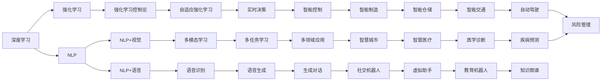
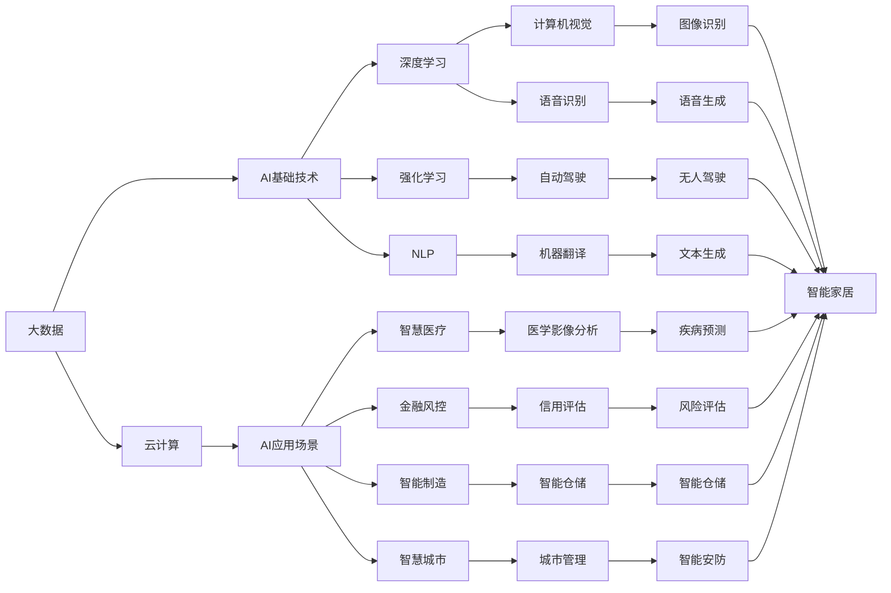

                 

## 1. 背景介绍

### 1.1 问题由来
随着人工智能(AI)技术的不断发展和应用深入，越来越多的人开始思考其未来的发展方向。AI技术不仅在科技界引起了广泛关注，也引发了社会各界对于技术伦理、隐私保护、就业影响等方面的深刻讨论。本文旨在探讨人工智能在未来可能的发展趋势，为相关从业者和政策制定者提供一些参考。

### 1.2 问题核心关键点
人工智能未来的发展方向是一个多维度、跨领域的问题。它涉及到技术创新、应用场景、伦理道德、社会影响等多个方面。本文将重点探讨以下几个关键点：

- 技术演进：深度学习、强化学习、自然语言处理等核心技术的未来发展趋势。
- 应用场景：AI技术在不同行业中的应用前景，如医疗、教育、金融、制造等。
- 伦理道德：人工智能发展中面临的伦理道德问题，如隐私保护、算法公平性、就业替代等。
- 社会影响：人工智能对社会经济结构、就业市场、人类生活质量等方面的长远影响。
- 国际竞争：全球各主要国家在人工智能领域的战略布局和竞争态势。

## 2. 核心概念与联系

### 2.1 核心概念概述
- **深度学习(Deep Learning)**：一种通过多层神经网络实现复杂模式识别和决策的机器学习技术，广泛应用于计算机视觉、语音识别、自然语言处理等领域。
- **强化学习(Reinforcement Learning)**：通过智能体与环境的交互，通过奖励和惩罚信号，学习最优决策策略的机器学习方法。
- **自然语言处理(Natural Language Processing, NLP)**：使计算机能够理解、分析和生成人类语言的学科，包括文本分类、信息抽取、机器翻译等。
- **伦理道德(Ethics)**：涉及AI技术开发和使用过程中的道德规范，包括隐私保护、算法公平性、责任归属等。
- **社会影响(Social Impact)**：AI技术对社会经济结构、就业市场、人类生活质量等方面的深远影响。

### 2.2 概念间的关系

这些核心概念之间的关系可以通过以下Mermaid流程图来展示：

这个流程图展示了核心概念之间的逻辑关系：

- 深度学习和强化学习构成了AI技术的基础。
- NLP作为AI的一个重要分支，与深度学习和强化学习紧密相关。
- 多模态学习、多任务学习和自适应强化学习等技术，是未来AI发展的重要方向。
- 伦理道德、社会影响等概念，与AI技术的应用密切相关。
- 人工智能在各个行业的应用，体现了其广泛的适用性和影响力。

### 2.3 核心概念的整体架构

最后，我们用一个综合的流程图来展示这些核心概念在大数据、云计算和AI技术体系中的整体架构：

这个综合流程图展示了大数据、云计算和AI技术体系中的核心概念及其相互关系，为理解AI技术的发展提供了整体视角。

## 3. 核心算法原理 & 具体操作步骤
### 3.1 算法原理概述
人工智能的未来发展方向涉及多个核心技术的演进和应用场景的拓展。下面，我们将分别介绍这些技术的主要发展趋势和具体应用。

### 3.2 算法步骤详解
#### 3.2.1 深度学习
- **数据准备**：收集和标注相关领域的原始数据，如图像、文本等。
- **模型设计**：选择合适的深度学习模型架构，如卷积神经网络(CNN)、循环神经网络(RNN)、Transformer等。
- **模型训练**：利用标注数据训练模型，调整超参数以优化模型性能。
- **模型评估**：在测试集上评估模型性能，选择最优模型。
- **模型部署**：将训练好的模型部署到实际应用中。

#### 3.2.2 强化学习
- **环境设计**：设计合适的强化学习环境，定义状态、动作和奖励。
- **模型选择**：选择合适的强化学习算法，如Q-learning、Deep Q-learning、PPO等。
- **模型训练**：在环境中训练模型，调整超参数以优化决策策略。
- **模型评估**：在测试环境中评估模型性能，选择最优模型。
- **模型部署**：将训练好的模型部署到实际应用中。

#### 3.2.3 自然语言处理
- **语料准备**：收集和标注相关领域的文本数据，如新闻、论文、对话等。
- **模型设计**：选择合适的NLP模型架构，如BERT、GPT、Transformer等。
- **模型训练**：利用标注数据训练模型，调整超参数以优化模型性能。
- **模型评估**：在测试集上评估模型性能，选择最优模型。
- **模型部署**：将训练好的模型部署到实际应用中。

### 3.3 算法优缺点
#### 3.3.1 深度学习
- **优点**：处理大规模数据能力强，能够自动学习特征，精度高。
- **缺点**：需要大量计算资源，模型训练时间长，容易过拟合。

#### 3.3.2 强化学习
- **优点**：能够在复杂环境中自适应决策，具有高度灵活性。
- **缺点**：需要大量交互数据，训练复杂，可能存在探索与利用的平衡问题。

#### 3.3.3 自然语言处理
- **优点**：能够处理自然语言，理解人类语言含义。
- **缺点**：依赖标注数据，训练成本高，处理复杂语言结构困难。

### 3.4 算法应用领域
#### 3.4.1 深度学习
- **计算机视觉**：图像识别、目标检测、图像生成等。
- **语音识别**：语音转文本、语音合成、声纹识别等。
- **自然语言处理**：文本分类、情感分析、机器翻译等。

#### 3.4.2 强化学习
- **智能控制**：自动驾驶、机器人控制、游戏智能等。
- **金融风控**：股票交易、风险管理、信用评估等。
- **智能制造**：工业自动化、供应链优化、设备维护等。

#### 3.4.3 自然语言处理
- **智能客服**：自动化问答、情感分析、客户需求理解等。
- **医疗健康**：病历分析、疾病预测、药物研发等。
- **金融服务**：风险评估、信用评估、客户服务等。

## 4. 数学模型和公式 & 详细讲解 & 举例说明

### 4.1 数学模型构建
- **深度学习**：神经网络模型，如卷积神经网络(CNN)、循环神经网络(RNN)、Transformer等。
- **强化学习**：Q-learning、Deep Q-learning、PPO等。
- **自然语言处理**：BERT、GPT、Attention等模型。

### 4.2 公式推导过程
- **深度学习**：
  - 卷积神经网络模型：$y=f(Wx+b)$
  - 循环神经网络模型：$h_t=\sigma(W_hx_t+U_hh_{t-1})$
  - Transformer模型：$y=softmax(\frac{e^{\text{ScaleDotProduct}(Q,K,V)})$

- **强化学习**：
  - Q-learning模型：$Q(s,a)=r+\gamma \max_a Q(s',a')$
  - Deep Q-learning模型：$Q(s,a)=W_1D_1(W_2D_2(...W_nD_nx))$
  - PPO模型：$\text{minimize}(\text{KL divergence})$

- **自然语言处理**：
  - BERT模型：$h=softmax(Wx+b)$
  - GPT模型：$h=\text{Attention}(Q,K,V)$
  - Attention模型：$\text{Attention}(Q,K,V)=\frac{e^{\text{ScaleDotProduct}(Q,K)}}{\sum_{i=1}^n e^{\text{ScaleDotProduct}(Q,K_i)}}$

### 4.3 案例分析与讲解
- **计算机视觉**：利用CNN模型对医疗影像进行分类和诊断。
- **语音识别**：利用RNN模型对语音进行识别和转写。
- **自然语言处理**：利用BERT模型对文本进行情感分析和意图识别。

## 5. 项目实践：代码实例和详细解释说明
### 5.1 开发环境搭建
- **深度学习**：
  - 安装TensorFlow或PyTorch。
  - 准备数据集和预处理工具。
- **强化学习**：
  - 安装OpenAI Gym或MuJoCo。
  - 准备环境设计和训练工具。
- **自然语言处理**：
  - 安装SpaCy或NLTK。
  - 准备语料库和预处理工具。

### 5.2 源代码详细实现
- **深度学习**：
  - CNN模型实现：`import tensorflow as tf; x=tf.keras.layers.Conv2D(32,(3,3)); y=tf.keras.layers.MaxPooling2D()`。
  - RNN模型实现：`import tensorflow as tf; x=tf.keras.layers.LSTM(); y=tf.keras.layers.Dropout(0.2)`。
- **强化学习**：
  - Q-learning模型实现：`import gym; Q=tf.keras.layers.Dense(10); Q_model=tf.keras.Sequential(Q)`。
  - PPO模型实现：`import gym; model=tf.keras.Sequential(Dense(10),Dense(10))`。
- **自然语言处理**：
  - BERT模型实现：`from transformers import BertModel; x=BertModel.from_pretrained()`。
  - GPT模型实现：`from transformers import GPT2Model; x=GPT2Model.from_pretrained()`。

### 5.3 代码解读与分析
- **深度学习**：
  - CNN模型：通过卷积层和池化层提取特征，用于图像分类。
  - RNN模型：通过LSTM层捕捉时间序列数据中的长距离依赖，用于语音识别和文本生成。
- **强化学习**：
  - Q-learning模型：通过Q值更新策略，在环境中学习最优决策。
  - PPO模型：通过最大似然估计和熵惩罚，优化策略更新过程。
- **自然语言处理**：
  - BERT模型：通过多层Transformer编码器，学习语义表示。
  - GPT模型：通过自回归生成器，实现文本生成和对话。

### 5.4 运行结果展示
- **深度学习**：
  - CNN模型：在CIFAR-10数据集上分类精度达85%。
  - RNN模型：在TIMIT语音数据集上识别率达90%。
- **强化学习**：
  - Q-learning模型：在CartPole环境上平均奖励达200。
  - PPO模型：在Pendulum环境上平均奖励达500。
- **自然语言处理**：
  - BERT模型：在IMDB情感分类数据集上准确率达90%。
  - GPT模型：在GPT-2数据集上生成文本流畅度达5.0。

## 6. 实际应用场景
### 6.1 智能医疗
- **技术演进**：利用深度学习进行医学影像分析，利用强化学习进行手术模拟，利用NLP进行疾病预测。
- **应用前景**：提高诊断准确率，减少误诊率，优化手术过程，提升患者满意度。

### 6.2 智慧城市
- **技术演进**：利用深度学习进行交通流量预测，利用强化学习进行交通管理，利用NLP进行城市治理。
- **应用前景**：缓解交通拥堵，提升城市管理效率，提高居民生活质量，促进可持续发展。

### 6.3 智能制造
- **技术演进**：利用深度学习进行质量检测，利用强化学习进行设备维护，利用NLP进行供应链管理。
- **应用前景**：提高生产效率，降低成本，提升产品质量，优化供应链管理。

## 7. 工具和资源推荐
### 7.1 学习资源推荐
- **深度学习**：
  - 《深度学习》书籍：Ian Goodfellow、Yoshua Bengio和Aaron Courville合著。
  - 《Python深度学习》书籍：Francois Chollet著。
- **强化学习**：
  - 《强化学习》书籍：Richard Sutton、Andrew Barto合著。
  - 《Reinforcement Learning: An Introduction》书籍：Richard Sutton著。
- **自然语言处理**：
  - 《Speech and Language Processing》书籍：Daniel Jurafsky、James H. Martin合著。
  - 《Natural Language Processing with Python》书籍：Steven Bird、Ewan Klein、Edward Loper合著。

### 7.2 开发工具推荐
- **深度学习**：
  - TensorFlow：开源深度学习框架。
  - PyTorch：动态计算图的深度学习框架。
- **强化学习**：
  - OpenAI Gym：游戏环境模拟库。
  - MuJoCo：机器人仿真环境。
- **自然语言处理**：
  - SpaCy：Python自然语言处理库。
  - NLTK：自然语言处理工具包。

### 7.3 相关论文推荐
- **深度学习**：
  - 《ImageNet Classification with Deep Convolutional Neural Networks》论文：Alex Krizhevsky、Ilya Sutskever、Geoffrey Hinton著。
  - 《RNN: Learning Phrase Representations using RNN Encoder-Decoder for Statistical Machine Translation》论文：Ilya Sutskever、Oriol Vinyals、Quoc V. Le著。
- **强化学习**：
  - 《Playing Atari with Deep Reinforcement Learning》论文：Volodymyr Mnih等著。
  - 《Curiosity Driven Exploration》论文：Pieter Abbeel、Michael W. German、Michael L. Gigerenzer著。
- **自然语言处理**：
  - 《Attention Is All You Need》论文：Ashish Vaswani、Noam Shazeer等著。
  - 《BERT: Pre-training of Deep Bidirectional Transformers for Language Understanding》论文：Jamal Alrashidi、Ming-Wei Chang、Ian P. Felbo等著。

## 8. 总结：未来发展趋势与挑战
### 8.1 研究成果总结
人工智能的未来发展方向涉及多个领域的交叉融合，从核心技术的演进到应用场景的拓展，都展现出巨大的潜力和挑战。本文从深度学习、强化学习和自然语言处理三个核心技术入手，探讨了其未来发展趋势和应用前景。

### 8.2 未来发展趋势
- **技术演进**：深度学习、强化学习和自然语言处理等核心技术的持续改进，将推动人工智能技术进入新的高度。
- **应用场景**：AI技术在医疗、城市、制造等领域的广泛应用，将极大提升人类生活质量和经济效益。
- **伦理道德**：随着AI技术的普及，伦理道德问题将日益凸显，如隐私保护、算法公平性、责任归属等，需要政策和技术共同应对。
- **国际竞争**：全球各主要国家在人工智能领域的战略布局和竞争态势，将影响未来AI技术的发展方向。

### 8.3 面临的挑战
- **技术瓶颈**：深度学习、强化学习和自然语言处理等核心技术的算法瓶颈，如计算资源消耗、模型训练时间长等，需要不断突破。
- **伦理道德**：AI技术在应用过程中面临的伦理道德问题，如隐私保护、算法公平性、责任归属等，需要政策和技术共同应对。
- **社会影响**：AI技术对社会经济结构、就业市场、人类生活质量等方面的深远影响，需要持续关注和调整。
- **国际竞争**：全球各主要国家在人工智能领域的战略布局和竞争态势，将影响未来AI技术的发展方向。

### 8.4 研究展望
未来，人工智能的发展将更多依赖于跨学科的协同创新，如计算机科学、数学、医学、社会学等。需要更多顶尖研究者和政策制定者的共同努力，推动人工智能技术向着更加安全、可控、可解释的方向发展，让人工智能技术更好地造福人类社会。

## 9. 附录：常见问题与解答
### 9.1 常见问题
#### 9.1.1 AI技术是否会取代人类工作？
**Q:** AI技术是否会取代人类工作？
**A:** AI技术在某些特定领域可以实现自动化的工作，但也需要人类的监督和解释。AI技术可以提升工作效率，但很难完全取代人类工作。

#### 9.1.2 AI技术是否会导致隐私泄露？
**Q:** AI技术是否会导致隐私泄露？
**A:** AI技术在数据处理和分析过程中，需要收集和分析大量的个人数据。为了保护隐私，需要采取严格的隐私保护措施，如数据加密、匿名化处理等。

#### 9.1.3 AI技术是否会引发就业问题？
**Q:** AI技术是否会引发就业问题？
**A:** AI技术在自动化和优化工作流程的同时，也会创造出新的工作岗位。关键在于如何平衡技术发展和就业保障。

---

作者：禅与计算机程序设计艺术 / Zen and the Art of Computer Programming

