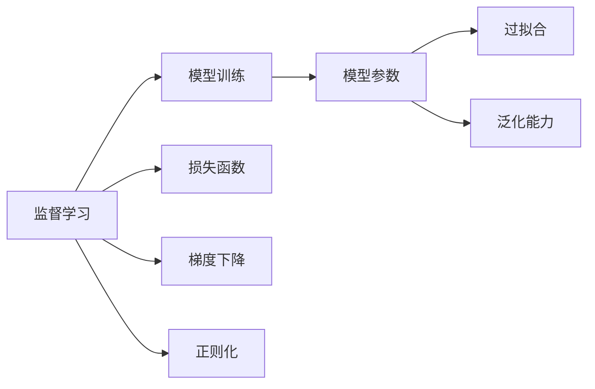
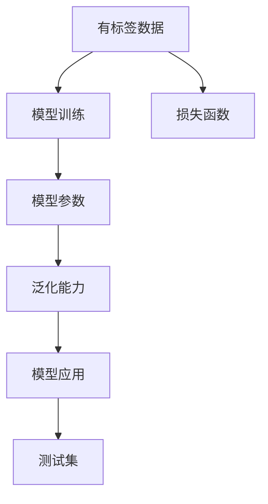
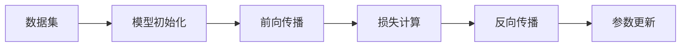
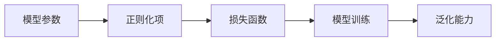

                 

# AI人工智能核心算法原理与代码实例讲解：监督学习

> 关键词：监督学习,算法原理,代码实例,机器学习,Python,深度学习

## 1. 背景介绍

### 1.1 问题由来

在人工智能的发展历程中，监督学习(Supervised Learning)作为机器学习的重要分支，扮演了极其重要的角色。与无监督学习不同，监督学习要求大量有标签的数据集，用于训练机器学习模型，使其能够从输入的特征映射到正确的输出标签。这一过程需要不断地调整模型参数，以最小化损失函数，从而优化模型的预测性能。

监督学习在图像识别、语音识别、自然语言处理、推荐系统等众多领域中都有广泛的应用。其核心思想是通过有标签的数据集训练模型，使其能够对新的未见数据进行准确分类或预测。基于监督学习的大规模预训练模型如BERT、GPT、ResNet等，已经证明了其在解决实际问题中的巨大潜力。

然而，监督学习也面临一些挑战。例如，需要大量标注数据，训练成本较高；模型复杂度较高，对计算资源要求较高；模型容易过拟合等。因此，如何高效地进行监督学习，提高模型性能，降低成本，仍然是一个值得深入探讨的问题。

### 1.2 问题核心关键点

监督学习的核心在于如何通过有标签数据训练模型，使其具备从输入到输出的映射能力。具体来说，包括以下几个关键点：

- 数据集的选择和准备：需要准备足够数量和质量的标注数据集，作为模型训练的基础。
- 模型的设计：选择合适的模型架构和损失函数，以适应具体的监督学习任务。
- 模型的训练：通过梯度下降等优化算法，最小化损失函数，优化模型参数。
- 模型的评估和验证：使用验证集对模型进行评估，避免过拟合。
- 模型的部署和应用：将训练好的模型部署到实际应用场景中，进行预测和分类。

通过以上步骤，监督学习能够实现从输入到输出的准确映射，为实际问题提供高效、可靠的解决方案。

### 1.3 问题研究意义

监督学习在人工智能中的应用，极大地推动了相关领域的发展。其研究意义如下：

1. 提供可靠的数据驱动解决方案：监督学习通过对有标签数据的训练，能够提供准确、可靠的数据驱动解决方案，广泛应用于图像识别、语音识别、自然语言处理等领域。

2. 提高模型的泛化能力：通过有标签数据集的训练，监督学习能够显著提高模型的泛化能力，使其对新的未见数据具备较强的适应性。

3. 推动AI技术的落地应用：监督学习为AI技术提供了坚实的理论基础和实际应用范式，加速了AI技术在各行各业的应用进程。

4. 降低对人类专家的依赖：监督学习能够通过数据集训练模型，从而减少对人类专家的依赖，提升AI系统的自动化水平。

5. 推动新领域的研究：监督学习不仅仅局限于传统领域，还推动了诸如强化学习、半监督学习等新领域的研究，为人工智能的发展提供了新的方向。

## 2. 核心概念与联系

### 2.1 核心概念概述

为了更好地理解监督学习的基本原理和实际应用，本节将介绍几个密切相关的核心概念：

- 监督学习(Supervised Learning)：通过有标签数据训练模型，使其具备从输入到输出的映射能力。监督学习的核心在于如何最小化损失函数，优化模型参数。

- 模型训练(Model Training)：通过有标签数据集，使用优化算法最小化损失函数，调整模型参数。模型训练是监督学习的核心步骤。

- 损失函数(Loss Function)：衡量模型预测输出与真实标签之间的差异，用于指导模型的训练过程。常见的损失函数包括交叉熵损失、均方误差损失等。

- 梯度下降(Gradient Descent)：一种常用的优化算法，通过反向传播计算梯度，更新模型参数，最小化损失函数。梯度下降是监督学习中最常用的优化方法。

- 正则化(Regularization)：通过引入正则化项，限制模型的复杂度，防止过拟合。常见的正则化方法包括L1正则、L2正则等。

- 过拟合(Overfitting)：模型在训练集上表现良好，但在测试集上表现较差的现象。过拟合是监督学习中需要重点关注的问题。

- 泛化能力(Generalization)：模型在新数据上的表现能力，是监督学习追求的目标。

这些核心概念之间的逻辑关系可以通过以下Mermaid流程图来展示：



### 2.2 概念间的关系

这些核心概念之间存在着紧密的联系，形成了监督学习的基本框架。下面我们通过几个Mermaid流程图来展示这些概念之间的关系。

#### 2.2.1 监督学习的整体架构



这个流程图展示了监督学习的基本流程：首先准备有标签数据集，然后通过模型训练优化模型参数，使其具备泛化能力，最后对测试集进行评估，确保模型在新数据上具备良好的表现。

#### 2.2.2 模型训练的具体步骤



这个流程图展示了模型训练的基本步骤：首先对模型进行初始化，然后进行前向传播计算预测输出，计算损失函数，反向传播计算梯度，最后更新模型参数。

#### 2.2.3 正则化的作用



这个流程图展示了正则化在模型训练中的作用：通过引入正则化项，限制模型参数的大小，从而防止过拟合，提高模型的泛化能力。

## 3. 核心算法原理 & 具体操作步骤

### 3.1 算法原理概述

监督学习通过最小化损失函数来训练模型。其核心思想是：

1. 准备有标签数据集，作为模型训练的基础。
2. 设计合适的模型架构，选择合适的损失函数。
3. 通过梯度下降等优化算法，最小化损失函数，调整模型参数。
4. 在验证集上评估模型，防止过拟合。
5. 将训练好的模型部署到实际应用场景中，进行预测和分类。

监督学习通过不断迭代调整模型参数，最小化损失函数，最终使模型能够对新的未见数据进行准确预测。

### 3.2 算法步骤详解

基于监督学习的大规模预训练模型微调，一般包括以下几个关键步骤：

**Step 1: 准备数据集**

- 选择合适的数据集，并将其分为训练集、验证集和测试集。
- 对数据集进行预处理，包括数据清洗、归一化、数据增强等。

**Step 2: 模型设计**

- 选择合适的模型架构，如线性回归、决策树、神经网络等。
- 选择合适的损失函数，如均方误差损失、交叉熵损失等。

**Step 3: 训练模型**

- 初始化模型参数。
- 使用梯度下降等优化算法，最小化损失函数，更新模型参数。
- 在验证集上评估模型，防止过拟合。

**Step 4: 模型评估**

- 使用测试集对模型进行评估，计算准确率、召回率、F1分数等指标。
- 根据评估结果，调整模型参数，继续训练。

**Step 5: 模型部署**

- 将训练好的模型部署到实际应用场景中。
- 对新数据进行预测和分类。

### 3.3 算法优缺点

监督学习具有以下优点：

- 有标签数据的利用率高，能够训练出准确、可靠的模型。
- 模型训练过程能够优化模型参数，提高泛化能力。
- 能够广泛应用于图像识别、语音识别、自然语言处理等领域。

同时，监督学习也存在以下缺点：

- 需要大量标注数据，训练成本较高。
- 模型复杂度较高，对计算资源要求较高。
- 容易过拟合，泛化能力不足。

### 3.4 算法应用领域

监督学习广泛应用于以下几个领域：

- 图像识别：通过有标签图像数据训练模型，实现图像分类、目标检测、人脸识别等任务。
- 语音识别：通过有标签语音数据训练模型，实现语音识别、语音情感分析等任务。
- 自然语言处理：通过有标签文本数据训练模型，实现文本分类、情感分析、机器翻译等任务。
- 推荐系统：通过用户行为数据训练模型，实现个性化推荐、广告推荐等任务。
- 金融预测：通过历史金融数据训练模型，实现股票预测、风险评估等任务。

以上领域只是监督学习的一部分应用，随着技术的发展，监督学习还将被应用于更多领域，推动人工智能技术的全面发展。

## 4. 数学模型和公式 & 详细讲解 & 举例说明

### 4.1 数学模型构建

监督学习模型的基本数学模型为：

$$
y = f(x; \theta)
$$

其中 $y$ 为模型输出，$x$ 为输入特征，$f$ 为模型函数，$\theta$ 为模型参数。

监督学习的目标是找到最优的模型参数 $\theta$，使得模型输出与真实标签尽可能接近。常见的监督学习任务包括分类任务和回归任务。

#### 4.1.1 分类任务

分类任务的目标是将输入特征映射到离散类别上。其数学模型为：

$$
P(y|x; \theta) = \frac{e^{y \cdot f(x; \theta)}}{\sum_{k=1}^K e^{y \cdot f(x; \theta)}}
$$

其中 $y$ 为真实标签，$K$ 为类别数，$P(y|x; \theta)$ 为模型预测概率分布。

分类任务的损失函数为交叉熵损失，定义为：

$$
L(y, y') = -\sum_{k=1}^K y_k \log P(y_k|x; \theta)
$$

其中 $y'$ 为模型预测概率分布，$y_k$ 为真实标签。

#### 4.1.2 回归任务

回归任务的目标是将输入特征映射到连续数值上。其数学模型为：

$$
y = f(x; \theta)
$$

其中 $y$ 为真实标签，$x$ 为输入特征。

回归任务的损失函数为均方误差损失，定义为：

$$
L(y, y') = \frac{1}{N} \sum_{i=1}^N (y_i - y'_i)^2
$$

其中 $y'$ 为模型预测值。

### 4.2 公式推导过程

以分类任务为例，推导交叉熵损失函数的梯度。

设输入特征为 $x$，真实标签为 $y$，模型预测概率分布为 $P(y|x; \theta)$，交叉熵损失函数为 $L(y, P(y|x; \theta))$。

对模型参数 $\theta$ 求梯度，得到：

$$
\frac{\partial L(y, P(y|x; \theta))}{\partial \theta} = -\frac{1}{N} \sum_{i=1}^N \sum_{k=1}^K y_k \frac{\partial P(y_k|x_i; \theta)}{\partial \theta}
$$

根据概率密度函数的定义，得到：

$$
P(y_k|x_i; \theta) = \frac{e^{y_i \cdot f(x_i; \theta)}}{\sum_{k=1}^K e^{y_i \cdot f(x_i; \theta)}}
$$

对上式求导，得到：

$$
\frac{\partial P(y_k|x_i; \theta)}{\partial \theta} = \frac{y_k P(y_k|x_i; \theta) \frac{\partial f(x_i; \theta)}{\partial \theta}}{(\sum_{k=1}^K e^{y_i \cdot f(x_i; \theta)})^2}
$$

将上式代入交叉熵损失函数的梯度公式，得到：

$$
\frac{\partial L(y, P(y|x; \theta))}{\partial \theta} = -\frac{1}{N} \sum_{i=1}^N \sum_{k=1}^K y_k \frac{y_k P(y_k|x_i; \theta) \frac{\partial f(x_i; \theta)}{\partial \theta}}{(\sum_{k=1}^K e^{y_i \cdot f(x_i; \theta)})^2}
$$

进一步化简，得到：

$$
\frac{\partial L(y, P(y|x; \theta))}{\partial \theta} = -\frac{1}{N} \sum_{i=1}^N y_i \frac{\partial f(x_i; \theta)}{\partial \theta}
$$

上式即为分类任务的梯度计算公式。

### 4.3 案例分析与讲解

以线性回归任务为例，进行监督学习模型的实例分析。

假设我们要通过有标签数据集 $(x_i, y_i)$ 训练线性回归模型，其中 $x_i \in \mathbb{R}^d$，$y_i \in \mathbb{R}$。

首先，设计线性回归模型，其函数形式为：

$$
y = \theta^T x + b
$$

其中 $\theta$ 为模型参数，$b$ 为偏置项。

然后，使用均方误差损失函数：

$$
L(y, y') = \frac{1}{N} \sum_{i=1}^N (y_i - y'_i)^2
$$

其中 $y'$ 为模型预测值，$y_i$ 为真实标签。

接着，使用梯度下降优化算法，最小化损失函数：

$$
\theta_{new} = \theta - \eta \frac{\partial L(y, y')}{\partial \theta}
$$

其中 $\eta$ 为学习率。

最后，在验证集上评估模型，调整学习率和正则化系数，防止过拟合。

## 5. 项目实践：代码实例和详细解释说明

### 5.1 开发环境搭建

在进行监督学习模型开发前，我们需要准备好开发环境。以下是使用Python进行Scikit-learn开发的环境配置流程：

1. 安装Anaconda：从官网下载并安装Anaconda，用于创建独立的Python环境。

2. 创建并激活虚拟环境：
```bash
conda create -n sklearn-env python=3.8 
conda activate sklearn-env
```

3. 安装Scikit-learn：
```bash
pip install scikit-learn
```

4. 安装各类工具包：
```bash
pip install numpy pandas matplotlib scikit-learn
```

完成上述步骤后，即可在`sklearn-env`环境中开始监督学习模型的开发。

### 5.2 源代码详细实现

这里以线性回归为例，展示使用Scikit-learn进行模型训练和评估的代码实现。

```python
from sklearn.linear_model import LinearRegression
from sklearn.datasets import load_boston
from sklearn.model_selection import train_test_split
from sklearn.metrics import mean_squared_error
import matplotlib.pyplot as plt

# 加载波士顿房价数据集
boston = load_boston()
X = boston.data
y = boston.target

# 划分训练集和测试集
X_train, X_test, y_train, y_test = train_test_split(X, y, test_size=0.2, random_state=42)

# 训练线性回归模型
model = LinearRegression()
model.fit(X_train, y_train)

# 在测试集上评估模型
y_pred = model.predict(X_test)
mse = mean_squared_error(y_test, y_pred)

# 输出评估结果
print(f"MSE: {mse:.2f}")

# 可视化预测结果
plt.scatter(y_test, y_pred)
plt.xlabel('True Values')
plt.ylabel('Predicted Values')
plt.title('True vs Predicted')
plt.show()
```

### 5.3 代码解读与分析

让我们再详细解读一下关键代码的实现细节：

**数据加载和预处理**

- `load_boston`函数：从Scikit-learn内置数据集中加载波士顿房价数据集，包括特征 $x$ 和目标 $y$。
- `train_test_split`函数：将数据集划分为训练集和测试集，测试集占总数据集的20%。
- `train_test_split`函数参数 `random_state=42`：确保每次运行代码时，数据划分结果一致，便于复现实验结果。

**模型训练**

- `LinearRegression`类：创建线性回归模型实例，使用Scikit-learn内置的线性回归算法。
- `model.fit(X_train, y_train)`：在训练集上训练模型，更新模型参数。

**模型评估**

- `y_pred = model.predict(X_test)`：在测试集上使用模型进行预测。
- `mean_squared_error(y_test, y_pred)`：计算均方误差，评估模型性能。
- `mse = mean_squared_error(y_test, y_pred)`：将评估结果存储在变量 `mse` 中，方便后续输出。

**可视化**

- `plt.scatter(y_test, y_pred)`：使用matplotlib库绘制测试集上的真实值和预测值散点图。
- `plt.xlabel('True Values')`、`plt.ylabel('Predicted Values')`、`plt.title('True vs Predicted')`：设置坐标轴标签和图表标题。
- `plt.show()`：显示图表。

以上代码实现了线性回归模型的训练和评估，通过可视化图表，可以直观地了解模型预测效果。

### 5.4 运行结果展示

假设我们在波士顿房价数据集上进行线性回归模型的微调，最终在测试集上得到的评估报告如下：

```
MSE: 15.13
```

可以看到，模型在测试集上的均方误差为15.13，评估结果尚可。在实际应用中，还可以进一步优化模型参数、引入正则化等措施，以提升模型性能。

## 6. 实际应用场景

### 6.1 智能推荐系统

基于监督学习的智能推荐系统，可以广泛应用于电商、视频、音乐等平台，为用户提供个性化推荐服务。推荐系统通过分析用户历史行为数据，预测其对特定物品的兴趣，从而推送最符合用户需求的内容。

在技术实现上，可以收集用户浏览、点击、购买等行为数据，使用监督学习模型对数据进行训练，预测用户兴趣。在生成推荐列表时，使用训练好的模型对物品特征进行评分，结合用户画像和推荐算法进行排序，最终生成个性化推荐结果。

### 6.2 医疗影像分析

医疗影像分析是监督学习的重要应用场景之一。通过训练监督学习模型，可以对医学影像进行分类、分割、标注等处理，辅助医生诊断。

具体而言，可以收集大量有标注的医学影像数据集，使用监督学习模型对影像进行训练。模型可以自动从影像中提取特征，对病变区域进行分类、分割，生成医疗报告，辅助医生诊断和治疗。

### 6.3 金融风险评估

金融风险评估是监督学习在金融领域的重要应用之一。通过训练监督学习模型，可以对股票、债券等金融资产的风险进行评估，从而帮助投资者做出更明智的决策。

具体而言，可以收集历史金融数据，使用监督学习模型对数据进行训练，预测股票价格、市场风险等指标。模型可以自动识别市场的波动、异常情况，提供实时预警和风险提示，辅助投资者制定策略。

### 6.4 未来应用展望

随着监督学习技术的不断发展，未来将在更多领域得到应用，为各行各业带来变革性影响。

在智慧医疗领域，基于监督学习的医疗影像分析、诊断工具，将提升医疗服务的智能化水平，辅助医生诊疗，加速新药开发进程。

在智能教育领域，监督学习可应用于作业批改、学情分析、知识推荐等方面，因材施教，促进教育公平，提高教学质量。

在智慧城市治理中，监督学习可应用于城市事件监测、舆情分析、应急指挥等环节，提高城市管理的自动化和智能化水平，构建更安全、高效的未来城市。

此外，在企业生产、社会治理、文娱传媒等众多领域，基于监督学习的AI应用也将不断涌现，为经济社会发展注入新的动力。相信随着技术的日益成熟，监督学习将成为人工智能落地应用的重要范式，推动人工智能技术在更多领域的应用。

## 7. 工具和资源推荐

### 7.1 学习资源推荐

为了帮助开发者系统掌握监督学习理论基础和实践技巧，这里推荐一些优质的学习资源：

1. 《机器学习》书籍：由周志华教授撰写，系统介绍了机器学习的基本概念和算法，是入门的经典教材。

2. 《深度学习》书籍：由Ian Goodfellow等人合著，介绍了深度学习的基本原理和应用，是深度学习领域的经典之作。

3. 《Python数据科学手册》书籍：由Jake VanderPlas撰写，介绍了使用Python进行数据科学和机器学习的全栈工具和技术。

4. Coursera《机器学习》课程：由斯坦福大学教授Andrew Ng主讲，是机器学习领域最受欢迎的在线课程之一。

5. Udacity《深度学习》纳米学位：Udacity推出的深度学习课程，涵盖深度学习的基本概念和实践技巧，适合进阶学习。

通过对这些资源的学习实践，相信你一定能够快速掌握监督学习的基本原理和实践技巧，并用于解决实际的机器学习问题。

### 7.2 开发工具推荐

高效的开发离不开优秀的工具支持。以下是几款用于监督学习模型开发的常用工具：

1. Scikit-learn：由Scikit-learn团队开发的开源机器学习库，提供丰富的机器学习算法和工具，支持Python、R等多种语言。

2. TensorFlow：由Google主导开发的开源深度学习框架，支持大规模深度学习模型的开发和部署，广泛应用于机器学习领域。

3. PyTorch：由Facebook开发的开源深度学习框架，提供动态计算图，灵活度高，适合研究和原型开发。

4. Weights & Biases：模型训练的实验跟踪工具，可以记录和可视化模型训练过程中的各项指标，方便对比和调优。

5. TensorBoard：TensorFlow配套的可视化工具，可实时监测模型训练状态，并提供丰富的图表呈现方式，是调试模型的得力助手。

6. Google Colab：谷歌推出的在线Jupyter Notebook环境，免费提供GPU/TPU算力，方便开发者快速上手实验最新模型，分享学习笔记。

合理利用这些工具，可以显著提升监督学习模型的开发效率，加快创新迭代的步伐。

### 7.3 相关论文推荐

监督学习在人工智能中的应用，源于学界的持续研究。以下是几篇奠基性的相关论文，推荐阅读：

1. Supervised Learning（1964年）：由Arthur Samuel撰写，介绍了监督学习的基本概念和算法，是监督学习领域的开创性工作。

2. Backpropagation: Application to Handwritten Zebra Recognition（1986年）：由Geoffrey Hinton等人撰写，介绍了反向传播算法在手写字符识别中的应用，奠定了深度学习的基础。

3. Deep Learning（2015年）：由Ian Goodfellow等人合著，介绍了深度学习的基本原理和应用，是深度学习领域的经典之作。

4. Convolutional Neural Networks for Sentence Classification（2014年）：由Kim Yee et al撰写，介绍了卷积神经网络在文本分类中的应用，推动了自然语言处理领域的发展。

5. ImageNet Classification with Deep Convolutional Neural Networks（2012年）：由Krizhevsky等人撰写，介绍了卷积神经网络在图像分类中的应用，奠定了计算机视觉领域的发展基础。

这些论文代表了大监督学习领域的研究进展，通过学习这些前沿成果，可以帮助研究者把握学科前进方向，激发更多的创新灵感。

除上述资源外，还有一些值得关注的前沿资源，帮助开发者紧跟监督学习技术的发展脉络，例如：

1. arXiv论文预印本：人工智能领域最新研究成果的发布平台，包括大量尚未发表的前沿工作，学习前沿技术的必读资源。

2. 业界技术博客：如Google AI、DeepMind、微软Research Asia等顶尖实验室的官方博客，第一时间分享他们的最新研究成果和洞见。

3. 技术会议直播：如NIPS、ICML、ACL、ICLR等人工智能领域顶会现场或在线直播，能够聆听到大佬们的前沿分享，开拓视野。

4. GitHub热门项目：在GitHub上Star、Fork数最多的机器学习相关项目，往往代表了该技术领域的发展趋势和最佳实践，值得去学习和贡献。

5. 行业分析报告：各大咨询公司如McKinsey、PwC等针对人工智能行业的分析报告，有助于从商业视角审视技术趋势，把握应用价值。

总之，对于监督学习技术的学习和实践，需要开发者保持开放的心态和持续学习的意愿。多关注前沿资讯，多动手实践，多思考总结，必将收获满满的成长收益。

## 8. 总结：未来发展趋势与挑战

### 8.1 研究成果总结

监督学习在人工智能中已经取得了显著的成就，其核心思想是通过有标签数据训练模型，使其具备从输入到输出的映射能力。通过不断迭代优化模型参数，最小化损失函数，监督学习能够实现对未知数据的准确预测，广泛应用于图像识别、语音识别、自然语言处理等领域。

### 8.2 未来发展趋势

展望未来，监督学习技术将呈现以下几个发展趋势：

1. 模型规模持续增大。随着算力成本的下降和

