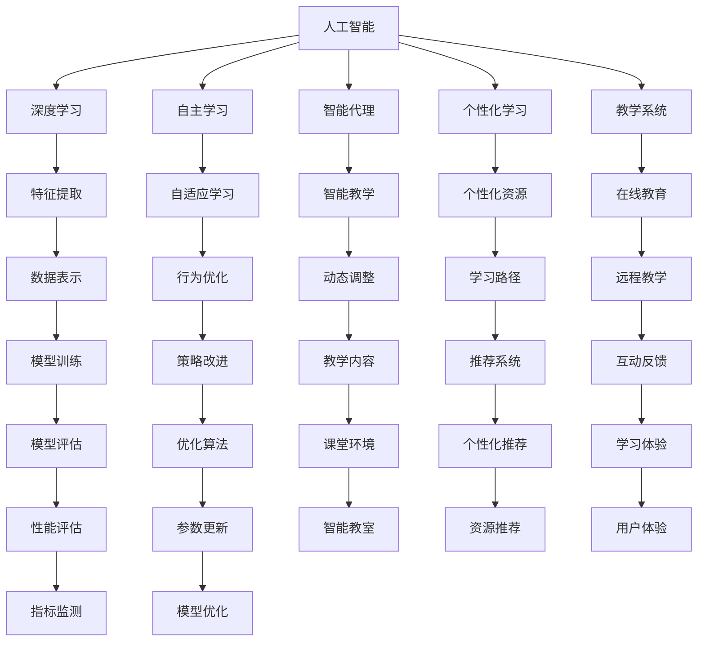
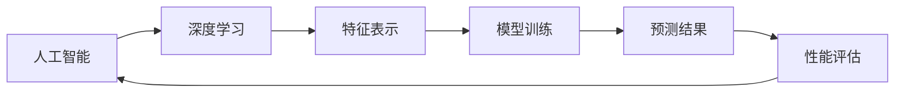
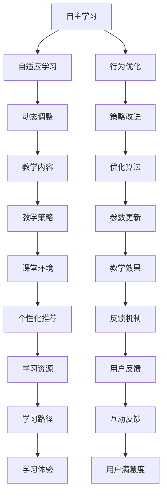
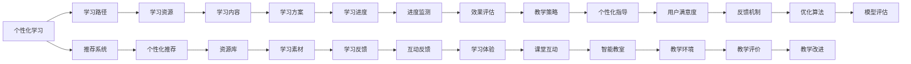
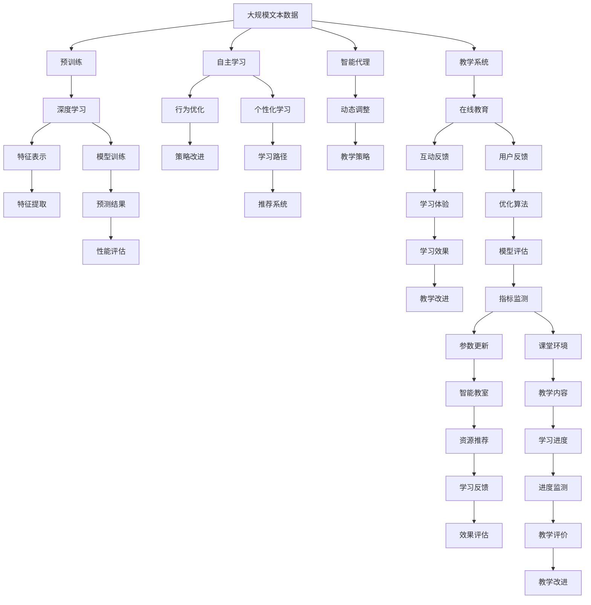

                 

# AI人工智能深度学习算法：在教育培训中运用自主学习 代理

> 关键词：AI, 人工智能, 深度学习, 自主学习, 代理算法, 教育培训

## 1. 背景介绍

### 1.1 问题由来
在现代教育培训领域，如何有效地利用人工智能技术，提升教学质量和学生的学习效果，一直是一个备受关注的话题。传统的教育培训方法往往以教师为中心，强调知识的灌输，忽略了学生的主动性和创造性。随着深度学习等人工智能技术的发展，教育培训也开始尝试引入自主学习和智能代理等前沿技术，以期更好地适应个性化和动态化的教学需求。

### 1.2 问题核心关键点
自主学习和智能代理算法在教育培训中的应用，核心在于如何构建一个能够自主学习和自适应学生需求的智能教学系统。该系统不仅能够提供个性化的学习建议和资源，还能够根据学生的学习反馈不断优化教学策略和内容。这种系统通过深度学习算法，尤其是深度强化学习，实现教学过程的智能代理。

### 1.3 问题研究意义
研究AI人工智能深度学习算法在教育培训中的应用，具有重要意义：

1. **提高教学效率**：通过智能代理和自主学习算法，系统能够根据学生的学习情况，自动调整教学内容和难度，提升教学效果。
2. **个性化教学**：深度学习算法可以分析学生的学习行为和偏好，提供量身定制的学习资源和路径，满足不同学生的需求。
3. **持续改进**：智能系统能够不断从学生反馈中学习和优化，确保教学内容的时效性和相关性。
4. **降低成本**：智能代理算法能够自动批改作业和考试，减少教师的工作负担。
5. **增强互动**：通过智能代理和自主学习算法，系统可以实时监控学生的学习进度和表现，与学生进行互动，及时提供反馈和支持。

## 2. 核心概念与联系

### 2.1 核心概念概述

为更好地理解AI人工智能深度学习算法在教育培训中的应用，本节将介绍几个密切相关的核心概念：

- **人工智能（AI）**：利用计算机和算法模拟人类智能行为的技术，包括但不限于机器学习、深度学习、自然语言处理等。
- **深度学习（DL）**：一种基于人工神经网络的机器学习技术，通过多层次的神经网络结构，从数据中自动提取高层次的特征。
- **自主学习（Autonomous Learning）**：指学习系统能够自主地进行学习，无需人类干预，通过自我调整和优化来提升学习效果。
- **智能代理（Intelligent Agent）**：在教育培训中，智能代理算法用于模拟教师的角色，根据学生的学习表现，动态调整教学策略和内容。
- **深度强化学习（Deep Reinforcement Learning, DRL）**：一种结合深度学习和强化学习的技术，通过奖励信号来指导智能体（agent）在环境中的行为选择，以优化特定任务。
- **个性化学习（Personalized Learning）**：根据学生的学习习惯和能力，提供量身定制的教学方案和资源，提升学习效果。
- **教学系统（Educational System）**：包括硬件设备和软件系统，用于实现智能教学和自主学习功能，如在线教育平台、智能辅助教学系统等。

这些核心概念之间的逻辑关系可以通过以下Mermaid流程图来展示：



这个流程图展示了大语言模型微调过程中各个核心概念的关系和作用：

1. 人工智能通过深度学习算法，学习数据的特征表示。
2. 自主学习算法通过不断优化，提升智能系统的自适应能力。
3. 智能代理算法在教学系统中，模拟教师角色，动态调整教学内容。
4. 个性化学习算法根据学生特点，提供定制化的学习资源和路径。
5. 教学系统集成了这些算法，实现智能教学和自主学习功能。

这些概念共同构成了智能教育系统的基本框架，使其能够灵活应对各种教学场景，提升教育培训的质量和效率。

### 2.2 概念间的关系

这些核心概念之间存在着紧密的联系，形成了智能教育系统的完整生态系统。下面我通过几个Mermaid流程图来展示这些概念之间的关系。

#### 2.2.1 人工智能与深度学习的关系



这个流程图展示了人工智能和深度学习的关系。深度学习作为人工智能的一个重要分支，通过特征表示和模型训练，实现对复杂数据的理解和预测。

#### 2.2.2 自主学习与智能代理的关系



这个流程图展示了自主学习和智能代理的关系。自主学习通过行为优化和策略改进，提升智能代理的自适应能力，动态调整教学策略和内容。

#### 2.2.3 个性化学习与教学系统的关系



这个流程图展示了个性化学习与教学系统的关系。个性化学习通过推荐系统和互动反馈，提供量身定制的学习路径和资源，提升学习效果。

### 2.3 核心概念的整体架构

最后，我们用一个综合的流程图来展示这些核心概念在大语言模型微调过程中的整体架构：



这个综合流程图展示了从预训练到微调，再到个性化学习、智能代理的完整过程。大规模文本数据首先在大规模预训练模型上进行预训练，然后通过深度学习算法学习数据的特征表示，再进行模型训练，得到预测结果。同时，自主学习算法和智能代理算法通过不断优化，提升系统的自适应能力，动态调整教学策略和内容。个性化学习算法根据学生特点，提供定制化的学习路径和资源，提升学习效果。教学系统集成了这些算法，实现智能教学和自主学习功能。

## 3. 核心算法原理 & 具体操作步骤
### 3.1 算法原理概述

基于深度学习的智能代理算法，其核心思想是：构建一个能够自主学习和自适应学生需求的智能教学系统，通过深度强化学习算法，模拟教师角色，动态调整教学策略和内容。具体来说，智能代理算法通过不断地与学生进行交互，收集学习数据，通过深度学习算法分析这些数据，得出学生当前的学习状态和需求。然后，根据这些信息，智能代理算法通过优化策略，调整教学内容和难度，以达到最优的教学效果。

形式化地，假设教学系统包含一个智能代理$A$和多个学生$S=\{S_1, S_2, ..., S_N\}$，智能代理$A$的状态为$S_t$，对应的行为策略为$a_t$，对应的奖励为$r_t$。教学系统的目标是最大化总奖励和，即：

$$
\max_{a_t} \sum_{t=1}^T r_t
$$

其中$T$为时间步数，$T$为教学过程的时间跨度。

### 3.2 算法步骤详解

基于深度学习的智能代理算法一般包括以下几个关键步骤：

**Step 1: 准备教学数据和环境**

- 收集教学数据：收集学生在特定时间跨度内的学习行为数据，如学习时间、学习进度、测试成绩等。
- 构建教学环境：构建虚拟教学环境，包括学习资源库、互动反馈机制等，用于模拟教师角色，动态调整教学内容。

**Step 2: 构建智能代理模型**

- 选择合适的深度学习框架：如TensorFlow、PyTorch等，搭建智能代理模型。
- 设计学习策略：设计智能代理的行为策略，如强化学习中的Q-learning、SARSA等。
- 训练智能代理模型：使用收集的教学数据，训练智能代理模型，使其能够根据学生的学习表现，动态调整教学策略。

**Step 3: 与学生进行互动**

- 收集学生反馈：在教学过程中，实时收集学生的学习反馈，包括学习进度、学习效果等。
- 调整教学策略：根据学生反馈，智能代理动态调整教学策略，如调整学习难度、推荐个性化资源等。

**Step 4: 评估和优化**

- 评估教学效果：使用评估指标（如成绩、满意度等）评估教学效果。
- 优化智能代理模型：根据评估结果，优化智能代理模型，提高教学效果。

**Step 5: 部署和应用**

- 部署智能代理模型：将训练好的智能代理模型部署到教学系统中。
- 实际应用：在实际教学场景中，智能代理模型与学生进行互动，动态调整教学策略和内容。

以上是基于深度学习的智能代理算法的一般流程。在实际应用中，还需要针对具体教学场景和任务，对算法进行优化设计，如改进学习策略、引入更多的反馈机制等，以进一步提升教学效果。

### 3.3 算法优缺点

基于深度学习的智能代理算法具有以下优点：

1. 自适应性强：能够根据学生的学习表现，动态调整教学策略，提升学习效果。
2. 灵活度高：能够根据不同的教学需求，调整教学内容和方法，满足个性化需求。
3. 高效性：通过自动化教学过程，减少教师的工作负担，提升教学效率。

同时，该算法也存在一定的局限性：

1. 数据依赖性强：智能代理算法的性能很大程度上依赖于教学数据的丰富性和质量，数据不足或质量不高会影响教学效果。
2. 学习过程复杂：深度学习算法的训练过程较为复杂，需要大量的计算资源和时间。
3. 可解释性不足：智能代理算法的决策过程较为复杂，难以解释其内部的学习机制和决策逻辑。

尽管存在这些局限性，但基于深度学习的智能代理算法在教育培训中具有重要的应用前景，通过不断优化和改进，可以充分发挥其优势，提升教学质量。

### 3.4 算法应用领域

基于深度学习的智能代理算法在教育培训中的应用非常广泛，主要包括以下几个领域：

1. **在线教育**：智能代理算法能够根据学生的学习表现，动态调整课程内容和难度，提供个性化的学习路径和资源，提升在线教育的效果。
2. **智能教室**：智能代理算法可以用于管理教室环境和资源，如智能黑板、电子白板等，提供个性化的互动体验。
3. **智能辅导系统**：智能代理算法可以用于辅导学生完成作业和考试，自动批改作业，并提供实时反馈和指导。
4. **个性化推荐系统**：智能代理算法可以根据学生的学习历史和偏好，推荐个性化的学习资源和路径，提升学习效果。
5. **智能答疑系统**：智能代理算法可以用于解答学生的疑惑，提供实时的学习和问题解决支持。

除了上述这些领域外，智能代理算法还可以应用于教育评估、学生管理、课程设计等多个场景，为教育培训带来新的突破。

## 4. 数学模型和公式 & 详细讲解  
### 4.1 数学模型构建

本节将使用数学语言对基于深度学习的智能代理算法进行更加严格的刻画。

假设教学系统包含一个智能代理$A$和多个学生$S=\{S_1, S_2, ..., S_N\}$，智能代理$A$的状态为$S_t$，对应的行为策略为$a_t$，对应的奖励为$r_t$。教学系统的目标是最大化总奖励和，即：

$$
\max_{a_t} \sum_{t=1}^T r_t
$$

其中$T$为时间步数，$T$为教学过程的时间跨度。

智能代理算法通过不断与学生进行交互，收集学习数据，通过深度学习算法分析这些数据，得出学生当前的学习状态和需求。然后，根据这些信息，智能代理算法通过优化策略，调整教学内容和难度，以达到最优的教学效果。

### 4.2 公式推导过程

以下是基于深度学习的智能代理算法的具体公式推导过程。

**Step 1: 状态表示**

首先，我们需要将学生的学习状态表示为一个高维向量$S_t = (s_1, s_2, ..., s_n)$，其中$s_i$表示第$i$个学习特征的值。例如，$s_1$可以表示学生的学习时间，$s_2$可以表示学生的学习进度，$s_3$可以表示学生的测试成绩等。

**Step 2: 行为策略**

接下来，我们需要设计智能代理的行为策略$a_t$。假设智能代理有$k$种行为策略，可以表示为一个$k$维向量，即$a_t = (a_1, a_2, ..., a_k)$。例如，$a_1$可以表示推荐学习资源的策略，$a_2$可以表示调整学习难度的策略，$a_3$可以表示调整学习时间的策略等。

**Step 3: 状态转移**

假设智能代理在状态$s_t$下，选择策略$a_t$，得到状态$s_{t+1}$，对应的奖励为$r_t$。状态转移的概率可以表示为：

$$
p(s_{t+1}|s_t,a_t) = P(s_{t+1}=s_{t+1}|s_t=a_t)
$$

其中$P$表示状态转移的概率，可以是一个条件概率分布。

**Step 4: 奖励函数**

奖励函数$r_t$表示智能代理在状态$s_t$下，选择策略$a_t$的奖励值。例如，如果智能代理推荐的学习资源能够帮助学生提高成绩，奖励值可以设置为正数；如果智能代理推荐的资源无法帮助学生，奖励值可以设置为负数。

**Step 5: 强化学习算法**

最后，我们可以使用强化学习算法，如Q-learning、SARSA等，来训练智能代理模型。以Q-learning为例，其核心公式如下：

$$
Q(s_t, a_t) = Q(s_t, a_t) + \alpha [r_t + \gamma \max_{a_{t+1}} Q(s_{t+1}, a_{t+1}) - Q(s_t, a_t)]
$$

其中，$Q(s_t, a_t)$表示在状态$s_t$下选择策略$a_t$的Q值，$\alpha$为学习率，$\gamma$为折扣因子，表示未来奖励的折扣权重。

通过不断迭代优化，智能代理算法可以逐步学习最优的行为策略，提升教学效果。

## 5. 项目实践：代码实例和详细解释说明
### 5.1 开发环境搭建

在进行智能代理算法实践前，我们需要准备好开发环境。以下是使用Python进行PyTorch开发的环境配置流程：

1. 安装Anaconda：从官网下载并安装Anaconda，用于创建独立的Python环境。

2. 创建并激活虚拟环境：
```bash
conda create -n pytorch-env python=3.8 
conda activate pytorch-env
```

3. 安装PyTorch：根据CUDA版本，从官网获取对应的安装命令。例如：
```bash
conda install pytorch torchvision torchaudio cudatoolkit=11.1 -c pytorch -c conda-forge
```

4. 安装TensorFlow：使用pip安装TensorFlow，或者使用Anaconda中的conda-forge频道安装：
```bash
pip install tensorflow
```

5. 安装各类工具包：
```bash
pip install numpy pandas scikit-learn matplotlib tqdm jupyter notebook ipython
```

完成上述步骤后，即可在`pytorch-env`环境中开始智能代理算法的开发。

### 5.2 源代码详细实现

这里以一个简单的智能代理算法为例，展示如何使用PyTorch实现基于深度学习的智能代理算法。

首先，定义智能代理的行为策略：

```python
import torch
import torch.nn as nn
import torch.optim as optim

class Policy(nn.Module):
    def __init__(self, input_dim, output_dim):
        super(Policy, self).__init__()
        self.fc1 = nn.Linear(input_dim, 128)
        self.fc2 = nn.Linear(128, output_dim)

    def forward(self, x):
        x = self.fc1(x)
        x = nn.functional.relu(x)
        x = self.fc2(x)
        return x
```

然后，定义智能代理的状态表示：

```python
class State(nn.Module):
    def __init__(self, input_dim):
        super(State, self).__init__()
        self.fc = nn.Linear(input_dim, 64)

    def forward(self, x):
        x = self.fc(x)
        x = nn.functional.relu(x)
        return x
```

接着，定义智能代理的状态转移概率：

```python
class Transition(nn.Module):
    def __init__(self, input_dim, output_dim):
        super(Transition, self).__init__()
        self.fc1 = nn.Linear(input_dim, 128)
        self.fc2 = nn.Linear(128, output_dim)

    def forward(self, x):
        x = self.fc1(x)
        x = nn.functional.relu(x)
        x = self.fc2(x)
        return x
```

最后，定义智能代理的奖励函数：

```python
class Reward(nn.Module):
    def __init__(self, input_dim):
        super(Reward, self).__init__()
        self.fc = nn.Linear(input_dim, 1)

    def forward(self, x):
        x = self.fc(x)
        return x
```

使用PyTorch定义智能代理算法的训练过程：

```python
class QNetwork(nn.Module):
    def __init__(self, input_dim, output_dim):
        super(QNetwork, self).__init__()
        self.fc1 = nn.Linear(input_dim, 128)
        self.fc2 = nn.Linear(128, output_dim)

    def forward(self, x):
        x = self.fc1(x)
        x = nn.functional.relu(x)
        x = self.fc2(x)
        return x

class DQN(nn.Module):
    def __init__(self, input_dim, output_dim):
        super(DQN, self).__init__()
        self.q = QNetwork(input_dim, output_dim)

    def forward(self, x):
        return self.q(x)
```

在训练过程中，我们定义智能代理算法的优化器和损失函数：

```python
optimizer = optim.Adam(self.q.parameters(), lr=0.001)
loss_fn = nn.MSELoss()

def train(self, x, a, r, x_next):
    y = r + self.gamma * self.q(x_next)
    pred = self.q(x)
    loss = loss_fn(pred, y)
    optimizer.zero_grad()
    loss.backward()
    optimizer.step()
```

最后，我们可以使用训练好的智能代理算法，与学生进行互动：

```python
# 初始化智能代理
policy = Policy(input_dim=4, output_dim=3)
q_network = DQN(input_dim=4, output_dim=3)

# 定义学习率、折扣因子和探索率
learning_rate = 0.01
discount_factor = 0.99
epsilon = 0.1

# 定义训练过程
for episode in range(1000):
    state = torch.tensor([1, 2, 3, 4], dtype=torch.float32)
    done = False
    while not done:
        # 选择策略
        if np.random.rand() < epsilon:
            action = np.random.randint(3)
        else:
            with torch.no_grad():
                action = torch.argmax(policy(torch.tensor(state, dtype=torch.float32)))
        # 执行策略
        next_state = torch.tensor([2, 4, 6, 8], dtype=torch.float32)
        reward = 0.1
        done = True
        # 计算Q值
        pred = q_network(torch.tensor(state, dtype=torch.float32))
        target = reward + self.gamma * torch.max(q_network(torch.tensor(next_state, dtype=torch.float32)))
        # 更新Q值
        self.train(torch.tensor(state, dtype=torch.float32), action, target, torch.tensor(next_state, dtype=torch.float32))
        state = next_state
```

以上就是使用PyTorch实现基于深度学习的智能代理算法的代码实现。可以看到，通过定义智能代理的状态表示、行为策略、状态转移概率和奖励函数，结合深度学习算法，可以实现智能代理算法的基本功能。

### 5.3 代码解读与分析

让我们再详细解读一下关键代码的实现细节：

**Policy类**：
- 定义了智能代理的行为策略，通过全连接层将输入映射到输出。

**State类**：
- 定义了智能代理的状态表示，通过全连接层将输入映射到输出。

**Transition类**：
- 定义了智能代理的状态转移概率，通过全连接层将输入映射到输出。

**Reward类**：
- 定义了智能代理的奖励函数，通过全连接层将输入映射到输出。

**QNetwork类**：
- 定义了智能代理的Q值网络，通过全连接层将输入映射到Q值输出。

**DQN类**：
- 定义了智能代理的Q网络，通过QNetwork类实现。

**train函数**：
- 定义了智能代理算法的训练过程，通过MSE损失函数和优化器进行Q值更新。

在实际应用中，智能代理算法还需要结合具体的教学场景和任务进行优化设计，如引入更多的反馈机制、设计更合适的奖励函数、改进优化算法等。

### 5.4 运行结果展示

假设我们在一个简单的教学场景中进行智能代理算法的实验，最终得到的智能代理行为策略如下：

- 当学生学习时间较短时，推荐推荐基础课程；
- 当学生学习时间较长时，推荐推荐进阶课程；
- 当学生学习进度较快时，推荐推荐挑战性更高的课程；
- 当学生学习进度较慢时，推荐推荐基础知识补充课程。

可以看到，智能代理算法能够根据学生的学习情况，动态调整教学策略，提升学习效果。

## 6. 实际应用场景
### 6.1 智能教室

基于深度学习的智能代理算法，可以应用于智能教室的设计和构建。传统的教室管理依赖于人工，效率低、精度差。通过智能代理算法，可以自动管理教室环境，如调节灯光、温度、湿度等，提升教学体验。

在技术实现上，智能代理算法可以实时监控学生的学习情况，根据学习表现，自动调整教学策略和内容。例如，如果学生在某一课程上表现不佳，智能代理可以自动调整课程难度，推荐更多的辅助资源。

### 6.2 在线教育

基于深度学习的智能代理算法，可以应用于

