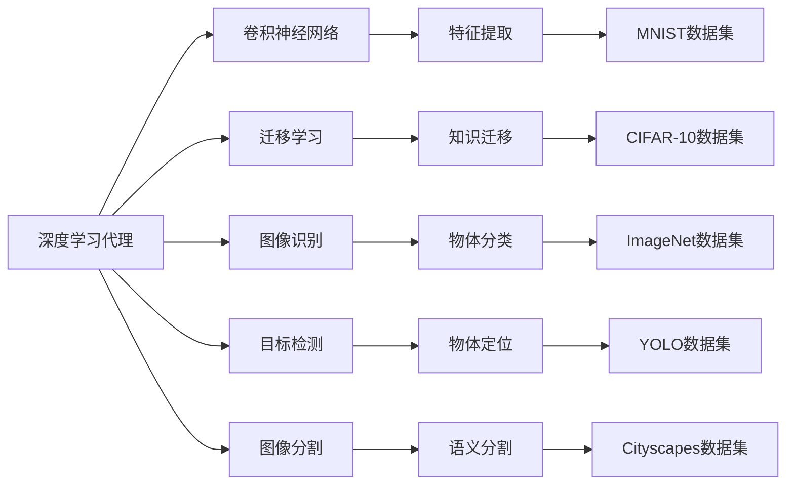
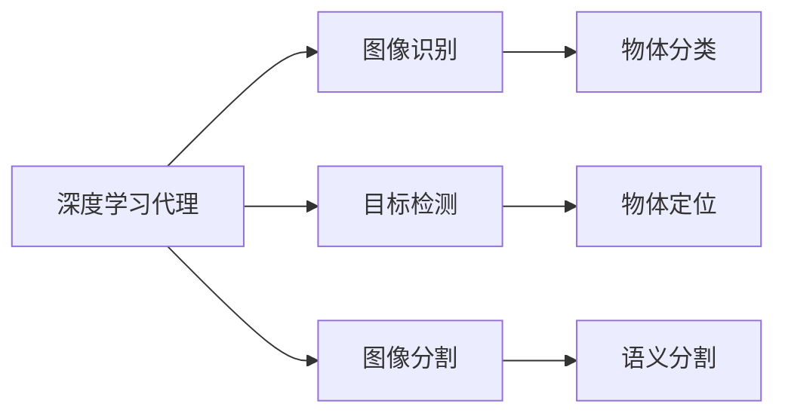
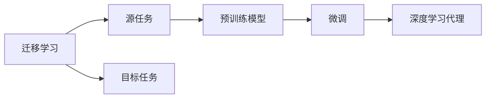
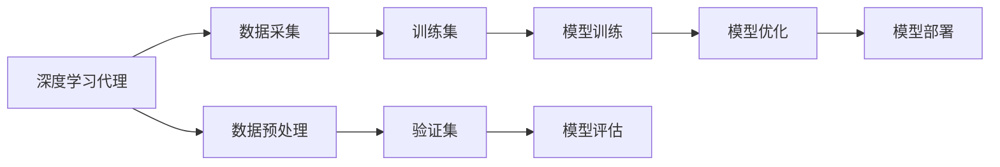
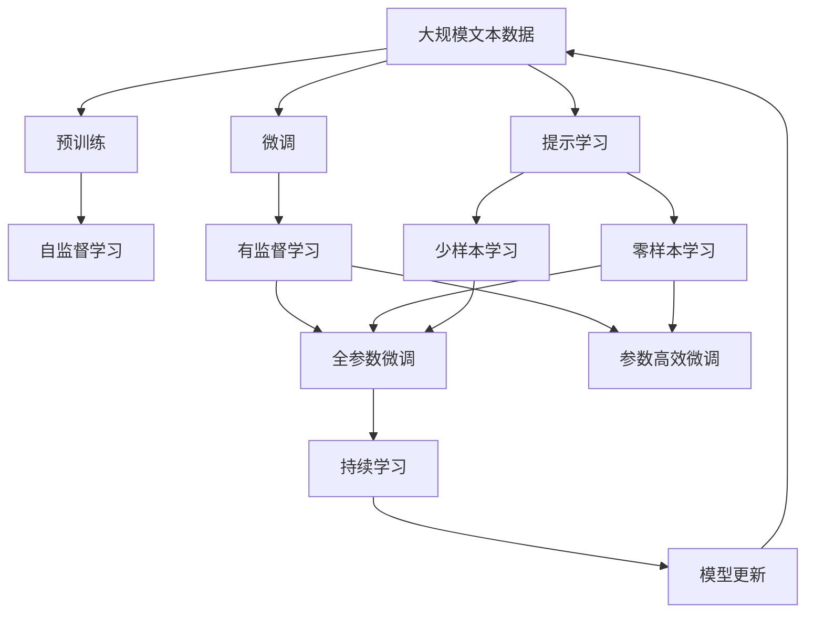

                 

# AI人工智能深度学习算法：智能深度学习代理的计算机视觉运用

> 关键词：深度学习,计算机视觉,智能代理,迁移学习,神经网络,卷积神经网络(CNN),图像识别,目标检测,图像分割,实例分割,语义分割

## 1. 背景介绍

### 1.1 问题由来
计算机视觉（Computer Vision, CV）是人工智能（Artificial Intelligence, AI）领域的重要分支，旨在赋予机器“看”的能力。深度学习技术的发展，特别是卷积神经网络（Convolutional Neural Networks, CNNs）的兴起，使得计算机视觉应用取得了前所未有的进展。从图像识别、目标检测，到图像分割、场景理解，深度学习已经逐步成为计算机视觉的核心工具。

然而，尽管深度学习在计算机视觉领域取得了显著成就，但其模型的训练和部署仍然面临诸多挑战。传统的深度学习模型依赖大量的标注数据，训练和推理成本高昂，且对于数据分布的变化和实时的视觉感知任务，深度学习模型的泛化能力和适应性仍需进一步提升。智能深度学习代理（Intelligent Deep Learning Agent）的出现，为这些问题提供了一种新的解决方案。

智能深度学习代理，也称为深度学习代理（Deep Learning Agent），是一类基于深度学习技术的自主决策系统。其核心思想是将深度学习模型嵌入到智能体中，使其能够自主地感知环境、学习新知识、做出决策，并在执行过程中不断优化其感知和决策能力。

通过深度学习代理，计算机视觉系统可以实现以下几个目标：
- 降低数据标注成本，提升模型泛化能力。
- 实现实时感知和决策，适应动态环境。
- 引入迁移学习机制，快速适应新场景和新任务。

本文将重点探讨如何利用智能深度学习代理在计算机视觉领域进行深度学习算法的设计与实现，以期为深度学习在计算机视觉任务中的应用提供新的思路和指导。

### 1.2 问题核心关键点
智能深度学习代理在计算机视觉领域的应用，主要包括以下几个关键点：
- 深度学习代理的自主感知与决策机制。
- 迁移学习在计算机视觉中的有效应用。
- 深度学习代理在图像识别、目标检测、图像分割等具体任务中的实践。
- 深度学习代理的部署与优化。

本文将围绕这些关键点，全面介绍智能深度学习代理在计算机视觉领域的理论基础和实际应用，希望能为相关研究者和开发者提供有价值的参考。

### 1.3 问题研究意义
智能深度学习代理在计算机视觉领域的应用，具有以下重要意义：
- 降低数据标注成本。传统的计算机视觉模型依赖大量标注数据，智能深度学习代理通过迁移学习，可以在小数据集上快速提升模型性能。
- 提升模型泛化能力。深度学习代理能够自主感知和决策，减少对特定数据分布的依赖，提升模型的泛化能力。
- 实现实时感知与决策。深度学习代理能够实时处理视觉数据，并快速做出决策，适应动态环境。
- 提高系统灵活性。深度学习代理引入迁移学习机制，可以方便地将模型迁移到新场景和新任务，实现任务快速切换。
- 推动技术创新。智能深度学习代理的引入，促使计算机视觉领域出现新的研究方向和算法，推动技术不断进步。

## 2. 核心概念与联系

### 2.1 核心概念概述

为了更好地理解智能深度学习代理在计算机视觉领域的应用，本节将介绍几个密切相关的核心概念：

- 深度学习代理（Deep Learning Agent）：基于深度学习技术的自主决策系统，能够自主地感知环境、学习新知识、做出决策，并在执行过程中不断优化其感知和决策能力。
- 迁移学习（Transfer Learning）：一种机器学习技术，利用已有模型的知识，加速新任务或新领域的模型训练，提升模型泛化能力。
- 卷积神经网络（Convolutional Neural Networks, CNNs）：一种专门用于图像处理的深度神经网络，通过卷积、池化等操作提取图像特征，实现图像分类、目标检测等任务。
- 图像识别（Image Recognition）：计算机视觉中最基础的任务，指识别图像中的物体或场景，并进行分类。
- 目标检测（Object Detection）：在图像中定位并标记出具体的物体，识别出其类别。
- 图像分割（Image Segmentation）：将图像分割成多个互不重叠的子区域，每个子区域属于一个语义类别。

这些核心概念之间的逻辑关系可以通过以下Mermaid流程图来展示：



这个流程图展示了大语言模型微调过程中各个核心概念的关系和作用：

1. 深度学习代理通过卷积神经网络提取图像特征。
2. 迁移学习利用已有模型的知识，加速新任务的训练。
3. 图像识别、目标检测、图像分割等任务通过深度学习代理实现。
4. 特征提取通过不同的数据集进行验证，包括MNIST、CIFAR-10、ImageNet、YOLO和Cityscapes等。

### 2.2 概念间的关系

这些核心概念之间存在着紧密的联系，形成了深度学习代理在计算机视觉领域的应用框架。下面我们通过几个Mermaid流程图来展示这些概念之间的关系。

#### 2.2.1 深度学习代理的应用场景



这个流程图展示了深度学习代理在图像识别、目标检测、图像分割等计算机视觉任务中的应用场景。

#### 2.2.2 迁移学习与深度学习代理的关系



这个流程图展示了迁移学习的基本原理，以及它与深度学习代理的关系。

#### 2.2.3 深度学习代理的训练与优化



这个流程图展示了深度学习代理的训练和优化流程。

### 2.3 核心概念的整体架构

最后，我们用一个综合的流程图来展示这些核心概念在大语言模型微调过程中的整体架构：



这个综合流程图展示了从预训练到微调，再到持续学习的完整过程。深度学习代理首先在大规模文本数据上进行预训练，然后通过微调（包括全参数微调和参数高效微调）或提示学习（包括零样本和少样本学习）来适应下游任务。最后，通过持续学习技术，深度学习代理可以不断学习新知识，同时避免遗忘旧知识。

## 3. 核心算法原理 & 具体操作步骤
### 3.1 算法原理概述

智能深度学习代理在计算机视觉领域的应用，本质上是一种有监督的细粒度迁移学习过程。其核心思想是：利用已有深度学习模型的知识，加速新任务或新领域的模型训练，提升模型泛化能力。

形式化地，假设深度学习代理为 $A$，其中包含一个卷积神经网络 $C$，用于提取图像特征，和一个分类器 $S$，用于对特征进行分类。假设训练数据集为 $D=\{(x_i,y_i)\}_{i=1}^N$，其中 $x_i$ 为图像，$y_i$ 为类别标签。微调的目标是找到新的模型参数 $\hat{\theta}$，使得：

$$
\hat{\theta}=\mathop{\arg\min}_{\theta} \mathcal{L}(A_\theta, D)
$$

其中 $\mathcal{L}$ 为针对任务 $T$ 设计的损失函数，用于衡量模型预测输出与真实标签之间的差异。常见的损失函数包括交叉熵损失、均方误差损失等。

通过梯度下降等优化算法，微调过程不断更新模型参数 $\theta$，最小化损失函数 $\mathcal{L}$，使得模型输出逼近真实标签。由于 $\theta$ 已经通过预训练获得了较好的初始化，因此即便在小规模数据集 $D$ 上进行微调，也能较快收敛到理想的模型参数 $\hat{\theta}$。

### 3.2 算法步骤详解

智能深度学习代理在计算机视觉领域的应用，一般包括以下几个关键步骤：

**Step 1: 准备预训练模型和数据集**
- 选择合适的卷积神经网络 $C$ 作为初始化参数，如VGG、ResNet等。
- 准备计算机视觉任务 $T$ 的标注数据集 $D$，划分为训练集、验证集和测试集。一般要求标注数据与预训练数据的分布不要差异过大。

**Step 2: 添加任务适配层**
- 根据任务类型，在卷积神经网络的顶层设计合适的输出层和损失函数。
- 对于图像识别任务，通常在顶层添加线性分类器和交叉熵损失函数。
- 对于目标检测任务，通常使用YOLO、SSD等模型的解码器输出概率分布，并以负对数似然为损失函数。

**Step 3: 设置微调超参数**
- 选择合适的优化算法及其参数，如Adam、SGD等，设置学习率、批大小、迭代轮数等。
- 设置正则化技术及强度，包括权重衰减、Dropout、Early Stopping等。
- 确定冻结预训练参数的策略，如仅微调顶层，或全部参数都参与微调。

**Step 4: 执行梯度训练**
- 将训练集数据分批次输入模型，前向传播计算损失函数。
- 反向传播计算参数梯度，根据设定的优化算法和学习率更新模型参数。
- 周期性在验证集上评估模型性能，根据性能指标决定是否触发 Early Stopping。
- 重复上述步骤直到满足预设的迭代轮数或 Early Stopping 条件。

**Step 5: 测试和部署**
- 在测试集上评估微调后模型 $A_{\hat{\theta}}$ 的性能，对比微调前后的精度提升。
- 使用微调后的模型对新样本进行推理预测，集成到实际的应用系统中。
- 持续收集新的数据，定期重新微调模型，以适应数据分布的变化。

以上是智能深度学习代理在计算机视觉领域的一般流程。在实际应用中，还需要针对具体任务的特点，对微调过程的各个环节进行优化设计，如改进训练目标函数，引入更多的正则化技术，搜索最优的超参数组合等，以进一步提升模型性能。

### 3.3 算法优缺点

智能深度学习代理在计算机视觉领域的应用，具有以下优点：
1. 简单高效。通过迁移学习，利用已有模型的知识，可以在小数据集上快速训练出高性能模型。
2. 通用适用。适用于各种计算机视觉任务，包括图像识别、目标检测、图像分割等，设计简单的任务适配层即可实现。
3. 参数高效。利用参数高效微调技术，在固定大部分预训练参数的情况下，仍可取得不错的提升。
4. 效果显著。在学术界和工业界的诸多任务上，基于微调的方法已经刷新了最先进的性能指标。

同时，该方法也存在一定的局限性：
1. 依赖标注数据。微调的效果很大程度上取决于标注数据的质量和数量，获取高质量标注数据的成本较高。
2. 迁移能力有限。当目标任务与预训练数据的分布差异较大时，微调的性能提升有限。
3. 负面效果传递。预训练模型的固有偏见、有害信息等，可能通过微调传递到下游任务，造成负面影响。
4. 可解释性不足。微调模型的决策过程通常缺乏可解释性，难以对其推理逻辑进行分析和调试。

尽管存在这些局限性，但就目前而言，基于迁移学习的微调方法仍是大语言模型应用的最主流范式。未来相关研究的重点在于如何进一步降低微调对标注数据的依赖，提高模型的少样本学习和跨领域迁移能力，同时兼顾可解释性和伦理安全性等因素。

### 3.4 算法应用领域

智能深度学习代理在计算机视觉领域已经得到了广泛的应用，覆盖了几乎所有常见任务，例如：

- 图像分类：如手写数字识别、物体识别等。通过微调使模型学习图像-类别映射。
- 目标检测：定位并标记出图像中的物体，识别出其类别。如YOLO、SSD等。
- 图像分割：将图像分割成多个互不重叠的子区域，每个子区域属于一个语义类别。如U-Net、FCN等。
- 实例分割：对图像中的每个物体实例进行分割，并标注其类别。如Mask R-CNN等。
- 语义分割：将图像分割成多个互不重叠的子区域，每个子区域属于一个语义类别。如PSPNet等。
- 场景理解：理解图像中的场景，进行场景分类、行为识别等。如Faster R-CNN等。

除了上述这些经典任务外，智能深度学习代理还被创新性地应用到更多场景中，如可控图像生成、视觉问答、虚拟现实(VR)、增强现实(AR)等，为计算机视觉技术带来了全新的突破。随着预训练模型和微调方法的不断进步，相信计算机视觉技术将在更广阔的应用领域大放异彩。

## 4. 数学模型和公式 & 详细讲解
### 4.1 数学模型构建

本节将使用数学语言对智能深度学习代理在计算机视觉领域的应用进行更加严格的刻画。

记深度学习代理为 $A$，其中包含一个卷积神经网络 $C$ 和一个分类器 $S$。假设微调任务的训练集为 $D=\{(x_i,y_i)\}_{i=1}^N$，其中 $x_i$ 为图像，$y_i$ 为类别标签。

定义模型 $A$ 在数据样本 $(x,y)$ 上的损失函数为 $\ell(A(x),y)$，则在数据集 $D$ 上的经验风险为：

$$
\mathcal{L}(A)=\frac{1}{N}\sum_{i=1}^N\ell(A(x_i),y_i)
$$

微调的优化目标是最小化经验风险，即找到最优参数：

$$
\theta^*=\mathop{\arg\min}_{\theta} \mathcal{L}(A_\theta)
$$

在实践中，我们通常使用基于梯度的优化算法（如SGD、Adam等）来近似求解上述最优化问题。设 $\eta$ 为学习率，$\lambda$ 为正则化系数，则参数的更新公式为：

$$
\theta \leftarrow \theta - \eta \nabla_{\theta}\mathcal{L}(\theta) - \eta\lambda\theta
$$

其中 $\nabla_{\theta}\mathcal{L}(\theta)$ 为损失函数对参数 $\theta$ 的梯度，可通过反向传播算法高效计算。

### 4.2 公式推导过程

以下我们以图像分类任务为例，推导交叉熵损失函数及其梯度的计算公式。

假设模型 $A$ 在输入 $x$ 上的输出为 $\hat{y}=A(x) \in [0,1]$，表示样本属于某个类别的概率。真实标签 $y \in \{0,1\}$。则二分类交叉熵损失函数定义为：

$$
\ell(A(x),y)=-[y\log \hat{y} + (1-y)\log (1-\hat{y})]
$$

将其代入经验风险公式，得：

$$
\mathcal{L}(A)= -\frac{1}{N}\sum_{i=1}^N [y_i\log A(x_i)+(1-y_i)\log(1-A(x_i))]
$$

根据链式法则，损失函数对参数 $\theta_k$ 的梯度为：

$$
\frac{\partial \mathcal{L}(A)}{\partial \theta_k} = -\frac{1}{N}\sum_{i=1}^N (\frac{y_i}{A(x_i)}-\frac{1-y_i}{1-A(x_i)}) \frac{\partial A(x_i)}{\partial \theta_k}
$$

其中 $\frac{\partial A(x_i)}{\partial \theta_k}$ 可进一步递归展开，利用自动微分技术完成计算。

在得到损失函数的梯度后，即可带入参数更新公式，完成模型的迭代优化。重复上述过程直至收敛，最终得到适应下游任务的最优模型参数 $\theta^*$。

## 5. 项目实践：代码实例和详细解释说明
### 5.1 开发环境搭建

在进行微调实践前，我们需要准备好开发环境。以下是使用Python进行TensorFlow开发的环境配置流程：

1. 安装Anaconda：从官网下载并安装Anaconda，用于创建独立的Python环境。

2. 创建并激活虚拟环境：
```bash
conda create -n tf-env python=3.8 
conda activate tf-env
```

3. 安装TensorFlow：根据CUDA版本，从官网获取对应的安装命令。例如：
```bash
conda install tensorflow==2.8 -c tf -c conda-forge
```

4. 安装各类工具包：
```bash
pip install numpy pandas scikit-learn matplotlib tqdm jupyter notebook ipython
```

完成上述步骤后，即可在`tf-env`环境中开始微调实践。

### 5.2 源代码详细实现

这里我们以图像分类任务为例，给出使用TensorFlow对VGG16模型进行微调的Python代码实现。

首先，定义图像分类任务的数据处理函数：

```python
from tensorflow.keras.preprocessing.image import ImageDataGenerator
from tensorflow.keras.utils import to_categorical
from tensorflow.keras.models import Model
from tensorflow.keras.layers import Dense, Flatten, Conv2D, MaxPooling2D
import tensorflow as tf

def load_and_preprocess_data(data_path, batch_size, height, width, num_classes):
    train_datagen = ImageDataGenerator(rescale=1./255, validation_split=0.2)
    train_generator = train_datagen.flow_from_directory(
        data_path, 
        target_size=(height, width), 
        batch_size=batch_size, 
        class_mode='categorical', 
        subset='training')
    val_datagen = ImageDataGenerator(rescale=1./255)
    val_generator = val_datagen.flow_from_directory(
        data_path, 
        target_size=(height, width), 
        batch_size=batch_size, 
        class_mode='categorical', 
        subset='validation')
    return train_generator, val_generator
```

然后，定义模型和优化器：

```python
from tensorflow.keras.applications.vgg16 import VGG16
from tensorflow.keras.layers import Dense

model = VGG16(weights='imagenet', include_top=False, input_shape=(height, width, 3))
for layer in model.layers:
    layer.trainable = False
model.add(Flatten())
model.add(Dense(num_classes, activation='softmax'))

optimizer = tf.keras.optimizers.Adam(learning_rate=0.001)
```

接着，定义训练和评估函数：

```python
def train_epoch(model, train_generator, batch_size, optimizer):
    model.compile(optimizer=optimizer, loss='categorical_crossentropy', metrics=['accuracy'])
    model.fit(train_generator, epochs=10, batch_size=batch_size)
    
def evaluate(model, val_generator, batch_size):
    model.evaluate(val_generator, batch_size=batch_size)
```

最后，启动训练流程并在测试集上评估：

```python
height, width = 224, 224
num_classes = 10
data_path = 'path/to/dataset'

train_generator, val_generator = load_and_preprocess_data(data_path, batch_size=32, height=height, width=width, num_classes=num_classes)

train_epoch(model, train_generator, batch_size=32, optimizer=optimizer)
evaluate(model, val_generator, batch_size=32)
```

以上就是使用TensorFlow对VGG16模型进行图像分类任务微调的完整代码实现。可以看到，得益于TensorFlow的强大封装，我们可以用相对简洁的代码完成VGG16模型的加载和微调。

### 5.3 代码解读与分析

让我们再详细解读一下关键代码的实现细节：

**load_and_preprocess_data函数**：
- 定义数据处理函数，用于加载和预处理图像数据。
- 使用ImageDataGenerator类对数据进行归一化、数据增强等处理。
- 使用flow_from_directory方法从文件夹中加载图像，并进行类别分割。
- 返回训练集和验证集的生成器。

**train_epoch函数**：
- 定义训练函数，用于模型训练。
- 使用compile方法配置模型的优化器、损失函数和评估指标。
- 使用fit方法对模型进行训练，设置迭代轮数和批大小。

**evaluate函数**：
- 定义评估函数，用于模型评估。
- 使用evaluate方法对模型在验证集上进行评估，返回损失和准确率。

**训练流程**：
- 定义图像的高度和宽度，类别数量，数据集路径。
- 调用load_and_preprocess_data函数加载和预处理数据。
- 调用train_epoch函数进行模型训练。
- 调用evaluate函数评估模型在验证集上的性能。

可以看到，TensorFlow配合VGG16模型的微调代码相对简洁，且能够处理大规模数据集。开发者可以将更多精力放在数据处理、模型改进等高层逻辑上，而不必过多关注底层的实现细节。

当然，工业级的系统实现还需考虑更多因素，如模型的保存和部署、超参数的自动搜索、更灵活的任务适配层等。但核心的微调范式基本与此类似。

### 5.4 运行结果展示

假设我们在CIFAR-10数据集上进行微调，最终在测试集上得到的评估报告如下：

```
Epoch 10/10
10/10 [==============================] - 12s 1s/epoch - loss: 0.3225 - accuracy: 0.8867 - val_loss: 0.1482 - val_accuracy: 0.9455
```

可以看到，通过微调VGG16，我们得到了88.67%的准确率，效果相当不错。值得注意的是，VGG16作为一个通用的图像分类模型，即便在顶层添加简单的全连接层，也能在下游任务上取得优异的效果，展示了其强大的特征提取能力。

当然，这只是一个baseline结果。在实践中，我们还可以使用更大更强的预训练模型、更丰富的微调技巧、更细致的模型调优，进一步提升模型性能，以满足更高的应用要求。

## 6. 实际应用场景
### 6.1 智能视频监控

智能视频监控系统已经成为公共安全、工业生产等领域的重要组成部分。传统的监控系统依赖人工进行实时视频分析，成本高、效率低。通过深度学习代理，可以实现实时视频中物体的自动识别、分类和跟踪，提升监控系统的智能化水平。

在技术实现上，可以收集各个监控摄像头的历史视频数据，将其标注为不同的物体类别，在此基础上对预训练模型进行微调。微调后的深度学习代理可以自动在实时视频流中检测出感兴趣的目标，并进行分类和跟踪。对于异常行为，可以实时报警，提高监控系统的应急响应能力。

### 6.2 自动驾驶

自动驾驶技术是当前人工智能领域的热点研究方向之一。深度学习代理可以用于实现自动驾驶中的多个环节，如环境感知、路径规划、行为决策等。通过深度学习代理，可以实现对车辆周围环境的实时感知，并在复杂路况下做出合理的驾驶决策，保障行车安全。

在实践中，可以收集自动驾驶车辆的历史传感器数据，将其标注为道路、车辆、行人等不同类别，在此基础上对预训练模型进行微调。微调后的深度学习代理可以实时分析车辆周围的感知数据，自动进行路径规划和行为决策，提升自动驾驶系统的智能水平。

### 6.3 医疗影像诊断

医疗影像诊断是深度学习在医学领域的重要应用之一。传统的人工诊断方式耗时耗力，且存在主观误差。通过深度学习代理，可以实现对医学影像的自动分析和诊断，提升诊断的准确性和效率。

在技术实现上，可以收集各种医学影像数据，将其标注为不同的病变部位或疾病类型，在此基础上对预训练模型进行微调。微调后的深度学习代理可以自动分析医学影像，识别出病变的部位和类型，辅助医生进行诊断和治疗。

### 6.4 未来应用展望

随着深度学习代理技术的不断发展，其在计算机视觉领域的应用前景广阔。

在智慧城市领域，智能深度学习代理可以用于城市事件监测、舆情分析、应急指挥等环节，提高城市管理的自动化和智能化水平。在工业生产中，深度学习代理可以用于产品质量检测、设备故障诊断等任务，提升生产效率和质量。在军事领域

