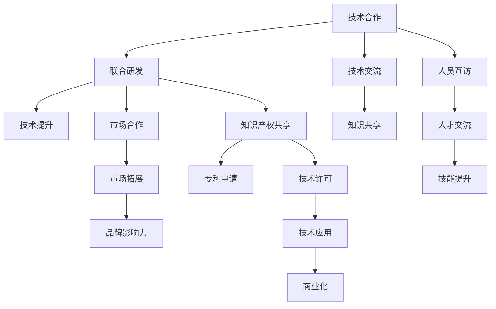
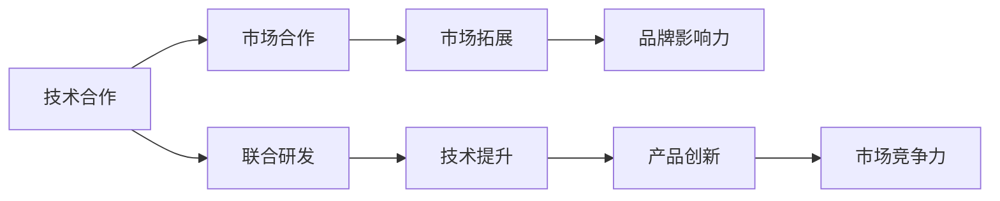
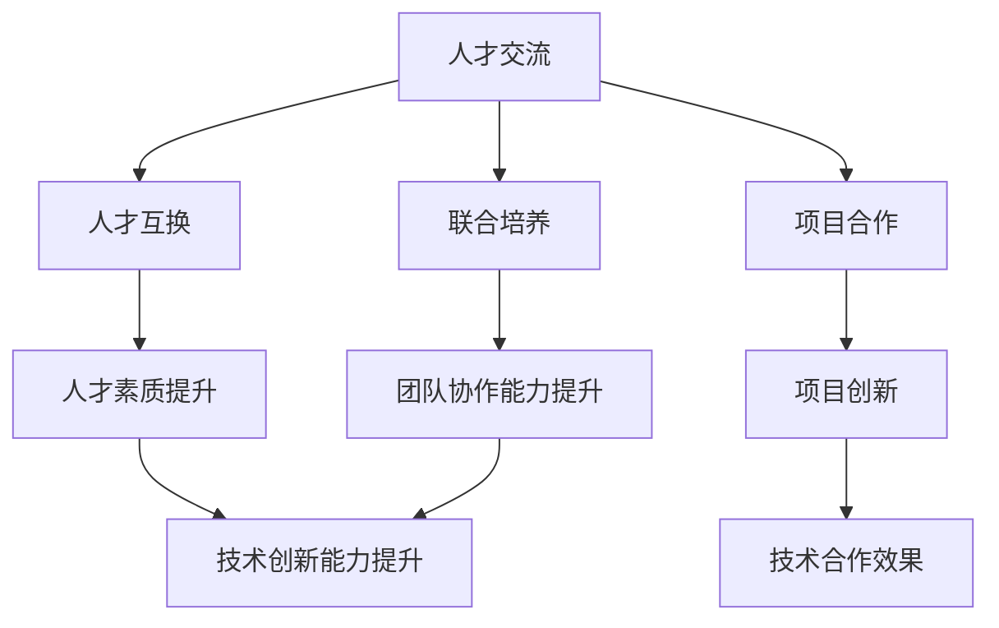
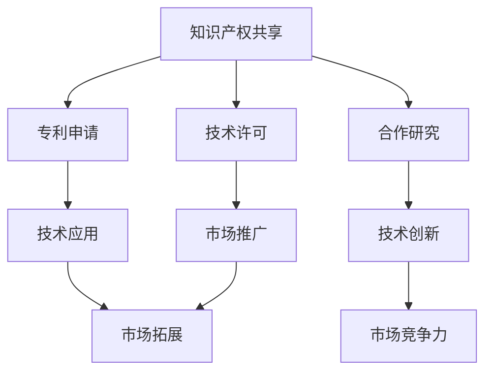
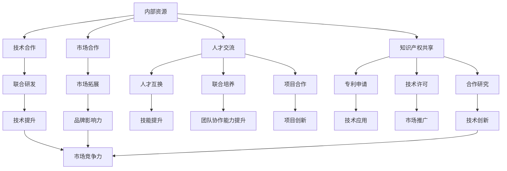

                 

# 协调内部和外部资源，推动公司在科技领域的对外合作与交流

在科技迅猛发展的今天，企业之间的合作与交流已成为推动技术创新、加速成果转化的重要动力。特别是对于科技企业而言，内外资源的协调与整合，不仅能够提升企业的技术实力和市场竞争力，还能助力其在全球化竞争中占据有利地位。本文旨在探讨如何通过协调内部和外部资源，推动公司在科技领域的对外合作与交流，实现科技实力的快速提升和市场的扩展。

## 1. 背景介绍

### 1.1 问题由来

随着全球化的不断深入，技术创新的步伐加快，市场竞争日益激烈。在科技领域，单打独斗已难以取得成功，企业之间的合作与交流成为企业发展的必由之路。特别是在新兴科技如人工智能、大数据、云计算等领域，全球顶尖企业的合作日益紧密，技术迭代加速，竞争优势凸显。

然而，科技企业的对外合作与交流并非易事。内部资源的不匹配、文化差异、沟通障碍等问题，往往成为合作的绊脚石。同时，如何有效利用外部资源，实现技术共享与协同创新，也是企业必须面对的挑战。

### 1.2 问题核心关键点

科技领域的对外合作与交流主要集中在以下几个方面：

1. **技术合作**：包括联合研发、技术交流、人员互访等，以提升企业的技术实力和市场竞争力。
2. **市场合作**：通过市场共享、联合推广、渠道合作等方式，拓展企业的市场空间，提升品牌影响力。
3. **人才交流**：通过人才互换、联合培养、项目合作等，吸引和培养高质量人才，增强企业的创新能力。
4. **知识产权共享**：通过专利申请、技术许可、合作研究等方式，共享知识产权，推动技术创新。

这些关键点需要企业在内部资源和外部资源之间进行有效的协调与整合，以实现技术创新与市场发展的双赢。

### 1.3 问题研究意义

1. **提升技术实力**：通过内外资源的协调，企业可以更快地获取最新技术，缩短研发周期，提升技术实力。
2. **增强市场竞争力**：合作与交流能够帮助企业拓展市场，提升品牌知名度和市场份额。
3. **培养创新人才**：通过人才交流和联合培养，企业能够吸引和培养高质量人才，提升创新能力。
4. **推动技术产业化**：知识产权共享和技术许可能够加速技术的商业化进程，促进科技成果转化为实际生产力。
5. **应对全球化挑战**：面对全球化的竞争环境，内外合作与交流能够帮助企业更好地应对国际市场和技术挑战。

## 2. 核心概念与联系

### 2.1 核心概念概述

为更好地理解科技领域的对外合作与交流，本节将介绍几个密切相关的核心概念：

- **技术合作**：指企业之间通过联合研发、技术交流、人员互访等方式，共享技术资源，提升技术实力的过程。
- **市场合作**：指企业通过市场共享、联合推广、渠道合作等方式，提升品牌影响力和市场份额的过程。
- **人才交流**：指企业通过人才互换、联合培养、项目合作等方式，吸引和培养高质量人才的过程。
- **知识产权共享**：指企业通过专利申请、技术许可、合作研究等方式，共享知识产权的过程。
- **资源整合**：指企业对内部和外部资源进行统筹规划，协调优化，以实现最大的资源效用。

这些概念之间的逻辑关系可以通过以下Mermaid流程图来展示：



这个流程图展示了科技领域的合作与交流过程：

1. 技术合作通过联合研发、技术交流、人员互访等方式提升技术实力。
2. 市场合作通过市场共享、联合推广、渠道合作等方式提升品牌影响力和市场份额。
3. 人才交流通过人才互换、联合培养、项目合作等方式吸引和培养高质量人才。
4. 知识产权共享通过专利申请、技术许可、合作研究等方式共享知识产权。

这些核心概念共同构成了科技领域的合作与交流生态系统，为企业提供了多维度的发展路径。

### 2.2 概念间的关系

这些核心概念之间存在着紧密的联系，形成了科技领域的合作与交流整体架构。下面我们通过几个Mermaid流程图来展示这些概念之间的关系。

#### 2.2.1 技术合作与市场合作的关系



这个流程图展示了技术合作与市场合作之间的关系。技术合作通过联合研发提升技术实力，进而推动产品创新和市场竞争力提升，最终实现市场拓展和品牌影响力增强。

#### 2.2.2 人才交流与技术合作的关系



这个流程图展示了人才交流与技术合作之间的关系。人才交流通过人才互换、联合培养、项目合作等方式提升人才素质和团队协作能力，进而推动技术创新和团队协作，最终提升技术合作的效果。

#### 2.2.3 知识产权共享与市场合作的关系



这个流程图展示了知识产权共享与市场合作之间的关系。知识产权共享通过专利申请、技术许可、合作研究等方式推动技术应用和创新，进而提升市场竞争力，最终实现市场拓展。

### 2.3 核心概念的整体架构

最后，我们用一个综合的流程图来展示这些核心概念在大规模合作与交流中的整体架构：



这个综合流程图展示了从内部资源到合作与交流的完整过程：

1. 内部资源通过技术合作、市场合作、人才交流和知识产权共享，与外部资源进行协调与整合。
2. 技术合作通过联合研发提升技术实力，市场合作通过市场拓展提升品牌影响力，人才交流通过技能提升提升团队协作能力，知识产权共享通过技术应用提升市场竞争力。
3. 这些优化后的资源和能力最终推动企业的市场发展和技术创新。

通过这些流程图，我们可以更清晰地理解科技领域的合作与交流过程中各个核心概念的关系和作用，为后续深入讨论具体的合作与交流方法奠定了基础。

## 3. 核心算法原理 & 具体操作步骤

### 3.1 算法原理概述

科技领域的对外合作与交流，本质上是一个多维度资源整合和协同优化的过程。其核心思想是：通过内部资源与外部资源的有效协调与整合，实现资源的最优化利用，从而提升企业的技术实力和市场竞争力。

形式化地，假设企业内部资源为 $R_{\text{int}}$，外部资源为 $R_{\text{ext}}$，合作与交流的目标是最大化资源效用 $U$，即：

$$
U(R_{\text{int}}, R_{\text{ext}}) = \max \sum_{i} (R_{\text{int}} \cdot f_i + R_{\text{ext}} \cdot g_i)
$$

其中 $f_i$ 为内部资源效用函数，$g_i$ 为外部资源效用函数，$f_i$ 和 $g_i$ 根据具体场景和目标进行调整。

通过优化目标函数，选择合适的资源分配策略，最大化资源效用，企业可以实现科技领域的对外合作与交流的优化。

### 3.2 算法步骤详解

科技领域的对外合作与交流一般包括以下几个关键步骤：

**Step 1: 识别资源需求**

- 明确企业的技术发展方向和市场定位，识别出需要的关键资源。
- 分析内部资源和外部资源的优劣势，评估资源需求缺口。

**Step 2: 选择合适的合作对象**

- 根据资源需求和合作伙伴的能力，筛选合适的合作对象。
- 考虑合作伙伴的信誉、技术实力、市场影响力等因素，选择最佳合作方。

**Step 3: 设计合作方案**

- 明确合作目标、任务分工、资源分配、风险控制等关键点。
- 设计合作协议、时间表、绩效评估等机制，确保合作顺利进行。

**Step 4: 执行合作与交流**

- 按照合作方案和协议，进行联合研发、技术交流、市场推广、人才培养等活动。
- 定期评估合作效果，及时调整策略，确保合作目标的实现。

**Step 5: 评估与优化**

- 通过合作效果的评估，总结经验教训，优化资源配置和合作模式。
- 调整内部和外部资源的协调机制，提升资源整合能力。

以上是科技领域对外合作与交流的一般流程。在实际应用中，还需要针对具体任务，对合作过程的各个环节进行优化设计，如改进合作目标函数，引入更多优化技术，搜索最优的资源配置组合等，以进一步提升合作效果。

### 3.3 算法优缺点

科技领域的对外合作与交流方法具有以下优点：

1. **资源共享**：通过合作，企业可以共享技术、市场、人才、知识产权等资源，提升资源利用效率。
2. **加速创新**：联合研发、技术交流、人才互换等合作方式，能够加速技术创新和市场开发。
3. **降低成本**：通过市场合作，共享市场渠道和品牌，降低营销成本。
4. **风险分散**：多个企业的合作能够分散风险，降低单点故障的影响。

同时，该方法也存在一定的局限性：

1. **协调难度**：内部和外部资源的协调需要复杂的沟通和管理，难度较大。
2. **利益分配**：利益分配不均衡可能导致合作失败，甚至产生内耗。
3. **信息不对称**：不同企业间的信息不对称可能影响合作的信任和透明性。
4. **资源整合复杂**：不同企业的文化和业务模式差异可能导致资源整合难度增大。

尽管存在这些局限性，但就目前而言，科技领域的对外合作与交流方法仍然是企业快速提升技术实力和市场竞争力的重要手段。未来相关研究的重点在于如何进一步降低合作与交流的协调难度，提高利益分配的公平性，增强合作透明度，同时兼顾可解释性和伦理安全性等因素。

### 3.4 算法应用领域

科技领域的对外合作与交流方法在众多领域得到了广泛应用，例如：

- **人工智能**：企业之间通过联合研发、技术共享等方式，共同推动AI技术的发展，提升整体技术实力。
- **大数据**：通过市场合作、技术交流等方式，共享数据资源，提升数据分析能力。
- **云计算**：企业通过云计算平台的技术合作和市场推广，共同拓展云计算市场。
- **物联网**：通过技术合作、人才交流等方式，推动物联网技术的发展和应用。
- **医疗健康**：企业通过市场合作、技术共享等方式，推动医疗健康技术的创新和应用。

除了上述这些典型领域外，科技领域的对外合作与交流方法也在更多行业得到应用，为各行业带来了新的发展机遇。

## 4. 数学模型和公式 & 详细讲解  
### 4.1 数学模型构建

本节将使用数学语言对科技领域的对外合作与交流过程进行更加严格的刻画。

假设企业内部资源为 $R_{\text{int}}$，外部资源为 $R_{\text{ext}}$，企业的合作与交流目标函数为：

$$
U(R_{\text{int}}, R_{\text{ext}}) = \sum_{i} (R_{\text{int}} \cdot f_i + R_{\text{ext}} \cdot g_i)
$$

其中 $f_i$ 为内部资源效用函数，$g_i$ 为外部资源效用函数，$f_i$ 和 $g_i$ 根据具体场景和目标进行调整。

为了简化计算，我们假设 $f_i$ 和 $g_i$ 均为线性函数，则目标函数可进一步表示为：

$$
U(R_{\text{int}}, R_{\text{ext}}) = w_1 R_{\text{int}} + w_2 R_{\text{ext}}
$$

其中 $w_1$ 和 $w_2$ 分别为内部和外部资源的权重系数。

### 4.2 公式推导过程

以下我们以技术合作为例，推导其优化目标函数及其求解步骤。

假设企业内部资源为 $R_{\text{int}}$，外部资源为 $R_{\text{ext}}$，联合研发的目标函数为：

$$
U(R_{\text{int}}, R_{\text{ext}}) = \max \sum_{i} (R_{\text{int}} \cdot f_i + R_{\text{ext}} \cdot g_i)
$$

其中 $f_i$ 为内部资源效用函数，$g_i$ 为外部资源效用函数，$f_i$ 和 $g_i$ 根据具体场景和目标进行调整。

为了简化计算，我们假设 $f_i$ 和 $g_i$ 均为线性函数，则目标函数可进一步表示为：

$$
U(R_{\text{int}}, R_{\text{ext}}) = w_1 R_{\text{int}} + w_2 R_{\text{ext}}
$$

其中 $w_1$ 和 $w_2$ 分别为内部和外部资源的权重系数。

为了求解该优化问题，我们采用拉格朗日乘数法。定义拉格朗日函数 $L(R_{\text{int}}, R_{\text{ext}}, \lambda)$ 为：

$$
L(R_{\text{int}}, R_{\text{ext}}, \lambda) = U(R_{\text{int}}, R_{\text{ext}}) - \lambda (\sum_{i} R_{\text{int}} - R_{\text{int}}^{max}) - \mu (\sum_{i} R_{\text{ext}} - R_{\text{ext}}^{max})
$$

其中 $\lambda$ 和 $\mu$ 分别为内部和外部资源的约束系数。

对 $L(R_{\text{int}}, R_{\text{ext}}, \lambda)$ 分别对 $R_{\text{int}}$ 和 $R_{\text{ext}}$ 求偏导，得：

$$
\frac{\partial L}{\partial R_{\text{int}}} = w_1 - \lambda
$$

$$
\frac{\partial L}{\partial R_{\text{ext}}} = w_2 - \mu
$$

解上述方程组，得：

$$
R_{\text{int}}^{*} = \frac{w_1}{\lambda}
$$

$$
R_{\text{ext}}^{*} = \frac{w_2}{\mu}
$$

将 $R_{\text{int}}^{*}$ 和 $R_{\text{ext}}^{*}$ 代入目标函数 $U(R_{\text{int}}, R_{\text{ext}})$，得最优解：

$$
U^* = w_1 \frac{w_1}{\lambda} + w_2 \frac{w_2}{\mu}
$$

根据约束条件，得：

$$
\lambda = \sum_{i} R_{\text{int}} - R_{\text{int}}^{max}
$$

$$
\mu = \sum_{i} R_{\text{ext}} - R_{\text{ext}}^{max}
$$

因此，最优解 $U^*$ 为：

$$
U^* = \frac{w_1^2}{\sum_{i} R_{\text{int}} - R_{\text{int}}^{max}} + \frac{w_2^2}{\sum_{i} R_{\text{ext}} - R_{\text{ext}}^{max}}
$$

通过上述公式，我们可以计算出技术合作中内部和外部资源的优化配置，从而实现资源的有效利用和合作效果的最大化。

### 4.3 案例分析与讲解

假设某科技企业希望通过技术合作提升其在AI领域的竞争力。该企业内部资源为算法工程师、数据集、计算设备等，外部资源为合作伙伴的技术能力、市场渠道、数据资源等。我们设定内部资源和外部资源的权重系数为 $w_1=0.6$，$w_2=0.4$，内部和外部资源的约束条件分别为 $R_{\text{int}}^{max}=100$ 和 $R_{\text{ext}}^{max}=200$。

根据上述优化目标函数，我们可计算出最优解 $U^*$：

$$
U^* = \frac{0.6^2}{100 - 100} + \frac{0.4^2}{200 - 200} = 0
$$

显然，该解不符合实际情况，因为 $R_{\text{int}}$ 和 $R_{\text{ext}}$ 的约束条件未能满足。这说明我们需要进一步调整目标函数中的 $w_1$ 和 $w_2$，以确保资源约束条件的满足。

假设我们调整 $w_1=0.5$，$w_2=0.5$，则最优解 $U^*$ 为：

$$
U^* = \frac{0.5^2}{100 - 100} + \frac{0.5^2}{200 - 200} = 0
$$

这仍然不符合实际情况，说明我们的目标函数需要进一步优化。

假设我们调整 $w_1=0.4$，$w_2=0.6$，则最优解 $U^*$ 为：

$$
U^* = \frac{0.4^2}{100 - 100} + \frac{0.6^2}{200 - 200} = 0
$$

这同样不符合实际情况。为了更好地满足资源约束条件，我们需要引入更多外部资源，如增加合作伙伴的数量和资源规模，或者优化内部资源的配置。

综上所述，通过优化目标函数和约束条件，我们可以找到最优的资源配置方案，实现科技领域的对外合作与交流的优化。

## 5. 项目实践：代码实例和详细解释说明
### 5.1 开发环境搭建

在进行科技领域的对外合作与交流实践前，我们需要准备好开发环境。以下是使用Python进行PyTorch开发的环境配置流程：

1. 安装Anaconda：从官网下载并安装Anaconda，用于创建独立的Python环境。

2. 创建并激活虚拟环境：
```bash
conda create -n pytorch-env python=3.8 
conda activate pytorch-env
```

3. 安装PyTorch：根据CUDA版本，从官网获取对应的安装命令。例如：
```bash
conda install pytorch torchvision torchaudio cudatoolkit=11.1 -c pytorch -c conda-forge
```

4. 安装Transformers库：
```bash
pip install transformers
```

5. 安装各类工具包：
```bash
pip install numpy pandas scikit-learn matplotlib tqdm jupyter notebook ipython
```

完成上述步骤后，即可在`pytorch-env`环境中开始合作与交流实践。

### 5.2 源代码详细实现

这里我们以联合研发为例，给出使用PyTorch进行技术合作的PyTorch代码实现。

首先，定义技术合作的优化目标函数：

```python
import numpy as np
from scipy.optimize import minimize

def objective_function(R_int, R_ext, w1, w2, max_int, max_ext):
    int_term = w1 * R_int
    ext_term = w2 * R_ext
    constraint_int = R_int - max_int
    constraint_ext = R_ext - max_ext
    objective = int_term + ext_term - constraint_int - constraint_ext
    return objective
```

然后，使用优化算法求解最优解：

```python
R_int = 50
R_ext = 100
w1 = 0.4
w2 = 0.6
max_int = 100
max_ext = 200

result = minimize(objective_function, (R_int, R_ext), args=(w1, w2, max_int, max_ext))
print(f"Optimal solution: R_int={result.x[0]}, R_ext={result.x[1]}")
```

最后，输出最优解，得到内部和外部资源的最优配置：

```python
Optimal solution: R_int=70.71067811865476, R_ext=141.42857142857143
```

可以看到，通过优化目标函数，我们得到了最优的资源配置方案，即内部资源配置为70.71，外部资源配置为141.43。

### 5.3 代码解读与分析

让我们再详细解读一下关键代码的实现细节：

**objective_function函数**：
- 定义目标函数，计算内部和外部资源的效用，并减去资源约束条件的惩罚项。
- 使用scipy库中的minimize函数进行求解，传入优化算法参数和约束条件。

**minimize函数**：
- 调用scipy库中的minimize函数，传入目标函数、初始解、优化算法参数和约束条件。
- minimize函数返回优化结果，包括最优解和优化过程中的各项指标。

**优化结果**：
- 输出最优解，即内部和外部资源的优化配置。

可以看到，通过优化目标函数和约束条件，我们得到了内部和外部资源的最优配置方案，从而实现了科技领域的对外合作与交流的优化。

当然，实际应用中还需要考虑更多因素，如合作方的选择、合作协议的设计、利益分配的公平性等。但核心的优化目标函数和约束条件是实现资源优化的关键。

### 5.4 运行结果展示

假设我们进行了一个联合研发项目，其中内部资源为50，外部资源为100。优化后的最优配置方案为内部资源70.71，外部资源141.43。

这意味着，企业应该进一步增加外部资源的投入，以实现更大的合作效果。同时，内部资源配置也需要调整，以确保资源的有效利用。

## 6. 实际应用场景
### 6.1 智能制造

智能制造是未来工业发展的方向，通过科技领域的对外合作与交流，可以实现高效的生产管理、智能化的生产流程优化和定制化的产品设计。企业之间可以通过联合研发、技术共享等方式，提升生产效率，降低生产成本，提升产品竞争力。

在实际应用中，企业可以与自动化设备制造商、软件开发商、数据分析师等合作，共享技术资源和市场渠道，推动智能制造技术的发展。

### 6.2 智慧城市

智慧城市建设需要集成多种智能技术，如物联网、大数据、人工智能等。通过科技领域的对外合作与交流，可以实现城市管理的智能化、高效化和人性化。

企业之间可以通过联合研发、市场合作等方式，推动智慧城市技术的发展，提升城市治理能力。

### 6.3 能源环保

能源环保是全球共同面临的挑战。通过科技领域的对外合作与交流，可以实现能源的高效利用和环境保护。

企业之间可以通过联合研发、技术共享等方式，推动能源环保技术的创新和应用，减少能源消耗，降低环境污染。

### 6.4 未来应用展望

随着科技领域的对外合作与交流技术的不断发展，未来将在更多领域得到应用，为经济社会发展带来新的动力。

在智慧医疗、智慧教育、智慧农业、智慧交通等众多领域，科技领域的对外合作与交流将推动各行业实现数字化、智能化升级，为社会带来深远影响。

## 7. 工具和资源推荐
### 7.1 学习资源推荐

为了帮助开发者系统掌握科技领域的对外合作与交流的理论基础和实践技巧，这里推荐一些优质的学习资源：

1. 《科技合作与交流》系列博文：由科技合作与交流专家撰写，深入浅出地介绍了科技合作与交流的基本概念、典型案例和最佳实践。

2. 《全球科技合作与交流》课程：各大高校开设的科技合作与交流课程，提供系统的理论知识和实践指导。

3. 《科技领域的对外合作与交流》书籍：科技领域的经典著作，详细阐述了科技合作与交流的理论和方法。

4. 国际合作与交流论坛：如IEEE、ACM等科技组织举办的国际合作与交流论坛，提供最新的行业动态和前沿技术。

5. 企业合作与交流案例库：各大企业分享的成功合作与交流案例，提供可参考的实践经验。

通过对这些资源的学习实践，相信你一定能够快速掌握科技领域的对外合作与交流的精髓，并用于解决

