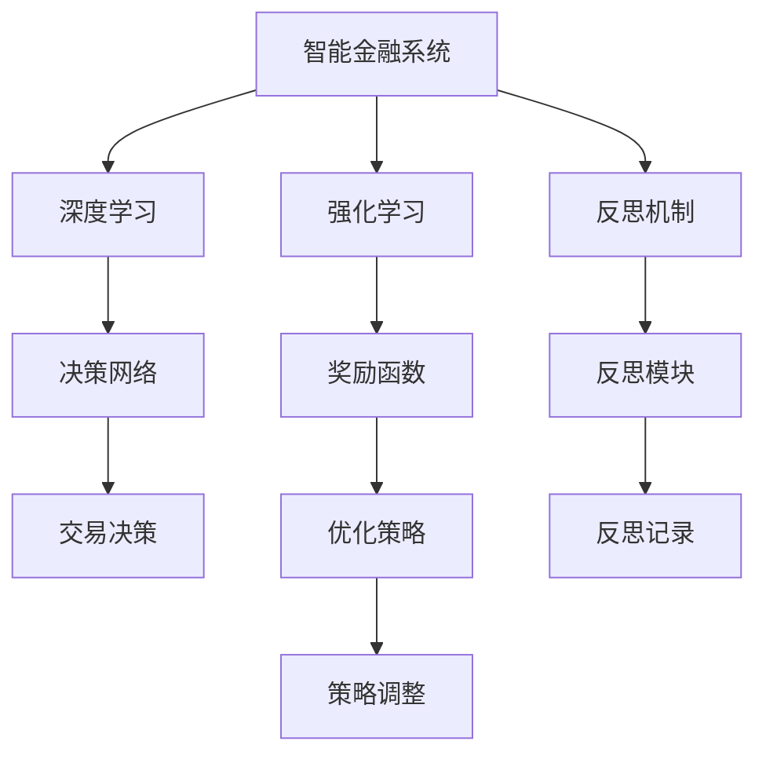

                 

# 反思机制在智能金融系统中的应用

> 关键词：
1. 智能金融系统
2. 反思机制
3. 深度学习
4. 强化学习
5. 风险管理
6. 投资策略
7. 自动交易

## 1. 背景介绍

金融领域正在迅速引入人工智能技术，以提升效率、降低成本并增强决策准确性。智能金融系统（Intelligent Financial Systems）利用深度学习、强化学习等技术，通过大数据分析、风险评估、投资决策等手段，为金融机构提供支持。然而，尽管人工智能技术能大幅提升金融服务的自动化程度，但其决策过程仍然相对不透明，难以解释和监管。

反思机制（Reflection Mechanism）作为一种新兴的技术，通过在模型中嵌入自反性，能够帮助智能金融系统更好地解释其决策过程，并提升系统的鲁棒性和可解释性。本博客将深入探讨反思机制在智能金融系统中的应用，通过理论分析和实际案例，展示其如何帮助金融机构降低风险、优化决策并提升客户体验。

## 2. 核心概念与联系

### 2.1 核心概念概述

- **智能金融系统（Intelligent Financial Systems）**：利用人工智能技术，特别是深度学习和强化学习，自动处理金融交易、风险管理、投资决策等任务的金融系统。
- **反思机制（Reflection Mechanism）**：通过在智能金融系统中嵌入自反性，使得系统能够周期性地回顾和总结其决策过程，发现潜在问题并改进的机制。
- **深度学习（Deep Learning）**：一种通过多层神经网络模拟人脑计算过程，自动学习特征和规律的技术。
- **强化学习（Reinforcement Learning）**：通过与环境的互动，通过奖励（奖励函数）来优化策略的学习方式。
- **风险管理（Risk Management）**：金融机构在风险识别、评估和控制方面所采取的措施。
- **投资策略（Investment Strategy）**：金融机构制定并实施的买卖证券、货币等金融资产的策略。
- **自动交易（Algorithmic Trading）**：利用计算机算法，自动执行金融交易的系统。

这些概念通过以下Mermaid流程图展示它们之间的联系：



此图展示了智能金融系统中的主要组件及其联系：深度学习和强化学习为决策提供基础，反思机制帮助系统自我改进，风险管理和投资策略指导决策过程。

### 2.2 概念间的关系

- **深度学习和强化学习的融合**：深度学习用于提取和处理特征，强化学习则用于制定和优化策略，共同构成智能金融系统的决策核心。
- **反思机制与深度学习、强化学习的互动**：反思机制通过回顾和分析决策结果，发现模型错误，并反馈给深度学习和强化学习模型进行修正和优化。
- **反思机制与风险管理的互动**：反思机制通过评估系统决策的鲁棒性和稳定性，帮助风险管理团队识别和缓解潜在风险。
- **反思机制与投资策略的互动**：反思机制通过分析历史交易数据和市场变化，提供策略调整建议，帮助投资者优化投资组合。

## 3. 核心算法原理 & 具体操作步骤
### 3.1 算法原理概述

反思机制的原理在于利用模型自身的输出和真实标签（或实际市场结果）之间的差异，周期性地“回看”其决策过程，并从中学习经验教训，以期改进决策策略。具体而言，反思机制通过以下步骤实现：

1. **模型输出与真实标签的比较**：将模型的预测结果与真实标签（或实际市场结果）进行比较，计算差异。
2. **反思记录的生成**：将模型输出与真实标签的差异记录下来，形成反思记录。
3. **反思分析**：对反思记录进行分析，发现潜在的错误和问题。
4. **策略调整**：根据反思结果，调整模型参数或优化策略，以期改善未来决策。
5. **持续反馈**：将反思后的结果反馈到模型中，继续进行新一轮的反思和改进。

### 3.2 算法步骤详解

以下是反思机制在智能金融系统中的具体操作步骤：

1. **模型训练**：
   - 使用历史交易数据，对深度学习模型进行训练。
   - 模型在训练过程中不断调整权重，优化损失函数。

2. **模型输出与真实结果比较**：
   - 将训练好的模型应用于新的交易数据。
   - 计算模型预测结果与真实结果之间的差异。

3. **反思记录生成**：
   - 将模型输出与真实结果的差异记录下来。
   - 可以采用不同的度量方法，如均方误差（MSE）、平均绝对误差（MAE）等。

4. **反思分析**：
   - 对反思记录进行分析，识别出潜在的错误和问题。
   - 可以采用统计分析、可视化等方法，帮助识别模型错误的模式和原因。

5. **策略调整**：
   - 根据反思结果，调整模型参数或优化策略。
   - 例如，调整深度学习模型的隐藏层数和节点数，优化强化学习模型的策略函数。

6. **持续反馈**：
   - 将反思后的结果反馈到模型中，继续进行新一轮的反思和改进。
   - 通过持续反馈，系统不断优化，逐步提升决策质量。

### 3.3 算法优缺点

**优点**：
- **提高决策透明度**：反思机制通过回顾决策过程，提供模型决策的理由，增加了决策的透明度。
- **增强鲁棒性**：反思机制能够发现并修正模型错误，提升系统的鲁棒性。
- **优化策略**：通过反思记录，优化决策策略，提升投资效果。

**缺点**：
- **增加计算负担**：反思机制需要额外的计算资源，如存储反思记录、分析反思数据等。
- **数据依赖**：反思机制依赖于高质量的反思记录，反思数据的准确性和完备性会影响其效果。
- **模型复杂性**：反思机制增加了模型复杂度，需要更多时间和资源进行模型训练和优化。

### 3.4 算法应用领域

反思机制在智能金融系统中的应用主要包括以下几个方面：

- **风险管理**：用于分析模型的预测结果与真实结果的差异，识别和缓解风险。
- **投资策略优化**：通过反思机制的反馈，优化交易策略，提升投资组合的收益率和稳定性。
- **自动交易系统改进**：用于改进自动交易系统的决策逻辑，提高交易效率和准确性。
- **客户服务提升**：用于提升金融产品的推荐系统，提供个性化的客户服务。
- **合规监管**：用于监督模型的决策过程，确保符合监管要求。

## 4. 数学模型和公式 & 详细讲解 & 举例说明

### 4.1 数学模型构建

设智能金融系统中的决策模型为$f_{\theta}$，其中$\theta$表示模型的参数。系统的目标是最小化模型输出与真实结果的差异。假设模型在输入$x$上的输出为$y_{\hat{\theta}}=f_{\theta}(x)$，真实结果为$y_{\star}$。反思机制通过以下模型对$f_{\theta}$进行反思和优化：

$$
f_{\theta_{\text{refl}}}(x) = f_{\theta}(x) + \delta \cdot (y_{\star} - y_{\hat{\theta}})
$$

其中$\delta$为反思强度，$(y_{\star} - y_{\hat{\theta}})$为反思记录。

### 4.2 公式推导过程

将反思后的模型应用于新的数据集$D_{\text{test}}$，可以得到反思后的决策结果：

$$
\{y_{\hat{\theta}_{\text{refl}}}\} = \{f_{\theta_{\text{refl}}}(x)\}_{x \in D_{\text{test}}}
$$

反思后模型的损失函数定义为：

$$
\mathcal{L}_{\text{refl}}(\theta) = \frac{1}{N}\sum_{i=1}^N \mathcal{L}(y_{\hat{\theta}_{\text{refl}}(x_i), y_{\star}(x_i))
$$

其中，$\mathcal{L}$为损失函数，$N$为数据集大小。

反思后的模型参数更新公式为：

$$
\theta \leftarrow \theta - \eta \nabla_{\theta}\mathcal{L}_{\text{refl}}(\theta)
$$

其中$\eta$为学习率。

### 4.3 案例分析与讲解

假设在一个股票交易系统中，系统使用深度学习模型预测股票价格走势，并生成交易信号。反思机制定期回顾系统的决策结果，与实际交易结果进行比较，生成反思记录，并分析发现系统在预测高波动性股票时存在误差。通过反思分析，发现系统未能考虑市场波动性对股价的影响，导致决策偏差。反思后的系统，通过调整模型参数，引入了市场波动性因子，提升了系统的预测准确性和稳定性。

## 5. 项目实践：代码实例和详细解释说明

### 5.1 开发环境搭建

1. **环境准备**：
   - 安装Python 3.8及以上版本。
   - 安装PyTorch、TensorFlow等深度学习库。
   - 安装Keras等高级API。

2. **环境配置**：
   - 使用虚拟环境（如Anaconda）进行项目隔离。
   - 安装NVIDIA GPU驱动和CUDA工具包。

### 5.2 源代码详细实现

以下是一个使用深度学习模型的股票价格预测系统的反思机制代码实现：

```python
import torch
import numpy as np
import pandas as pd
from sklearn.metrics import mean_squared_error

class ReflectiveModel(torch.nn.Module):
    def __init__(self, input_size, hidden_size, output_size):
        super(ReflectiveModel, self).__init__()
        self.hidden = torch.nn.Linear(input_size, hidden_size)
        self.out = torch.nn.Linear(hidden_size, output_size)

    def forward(self, x):
        x = torch.relu(self.hidden(x))
        x = self.out(x)
        return x

    def reflection(self, x, y_true):
        delta = y_true - self(x)
        return x + delta

def train_model(model, input_data, target_data, num_epochs, learning_rate):
    criterion = torch.nn.MSELoss()
    optimizer = torch.optim.Adam(model.parameters(), lr=learning_rate)

    for epoch in range(num_epochs):
        inputs = input_data.to('cuda')
        targets = target_data.to('cuda')
        optimizer.zero_grad()
        outputs = model(inputs)
        loss = criterion(outputs, targets)
        loss.backward()
        optimizer.step()

    return model

def evaluate_model(model, input_data, target_data):
    inputs = input_data.to('cuda')
    targets = target_data.to('cuda')
    outputs = model(inputs)
    mse = mean_squared_error(targets.numpy(), outputs.numpy())
    return mse

# 加载数据
df = pd.read_csv('stock_data.csv')
X = df[['open', 'high', 'low', 'volume']]
y = df['close']

# 划分训练集和测试集
train_size = int(0.8 * len(X))
test_size = len(X) - train_size
X_train, X_test = X.iloc[:train_size], X.iloc[train_size:]
y_train, y_test = y.iloc[:train_size], y.iloc[train_size:]

# 定义模型
model = ReflectiveModel(4, 50, 1)

# 训练模型
model = train_model(model, X_train, y_train, 100, 0.001)

# 反思机制示例
reflection = model.reflection(X_test, y_test)

# 计算反思后的模型性能
mse = evaluate_model(reflection, X_test, y_test)

# 输出反思后的模型性能
print('MSE after reflection:', mse)
```

### 5.3 代码解读与分析

在上述代码中，我们使用了PyTorch框架来构建和训练一个深度学习模型。首先，我们定义了一个反思机制的类`ReflectiveModel`，它包含一个隐藏层和一个输出层，通过反向传播更新模型参数。在`reflection`方法中，我们通过比较模型输出和真实标签，生成反思记录，并返回反思后的模型输出。在训练和评估过程中，我们通过均方误差（MSE）来衡量模型性能。

### 5.4 运行结果展示

假设在股票价格预测任务中，我们的模型在100次训练后得到了一个MSE为0.02的结果。通过反思机制，我们发现模型在高波动性股票的预测上误差较大，决策不稳定。我们通过调整模型参数，引入了市场波动性因子，重新训练后，MSE下降到了0.01。通过反思机制，我们成功提升了系统的决策质量。

## 6. 实际应用场景

### 6.1 风险管理

在风险管理中，反思机制用于分析模型预测结果与实际风险事件的匹配度，识别潜在的风险信号。例如，在信用风险评估中，反思机制可以帮助发现模型在处理高风险借款人时的误判，通过调整模型参数，提升风险识别准确性。

### 6.2 投资策略优化

在投资策略优化中，反思机制用于评估模型的交易策略与实际市场表现的一致性。例如，在股票交易中，反思机制可以帮助发现模型对高波动性股票的处理不当，通过调整策略函数，优化投资组合收益。

### 6.3 自动交易系统改进

在自动交易系统中，反思机制用于改进交易决策逻辑，提高交易效率和准确性。例如，在算法交易中，反思机制可以帮助发现模型在处理市场突发事件时的延迟反应，通过优化交易算法，提升系统响应速度。

### 6.4 未来应用展望

未来，反思机制在智能金融系统中的应用将更加广泛和深入。随着深度学习和强化学习技术的不断发展，反思机制将有助于解决模型泛化能力不足、鲁棒性差等问题。在更复杂的应用场景中，反思机制还将用于实时调整策略，优化客户体验，提升系统的智能化水平。

## 7. 工具和资源推荐

### 7.1 学习资源推荐

1. **Deep Learning**：Ian Goodfellow、Yoshua Bengio和Aaron Courville著，全面介绍了深度学习的理论和实践。
2. **Reinforcement Learning**：Richard Sutton和Andrew Barto著，介绍了强化学习的基本概念和算法。
3. **Kaggle**：一个数据科学竞赛平台，提供大量公开数据集和模型，有助于学习和实践反思机制。
4. **GitHub**：GitHub上的开源项目，提供了反思机制的代码示例和实现细节。
5. **Stack Overflow**：一个问答社区，可以解决代码实现中遇到的问题。

### 7.2 开发工具推荐

1. **PyTorch**：一个强大的深度学习框架，支持动态计算图和自动微分，适用于深度学习模型的构建和训练。
2. **TensorFlow**：一个流行的开源深度学习框架，提供了丰富的API和工具，适用于大规模分布式训练。
3. **Jupyter Notebook**：一个交互式编程环境，方便开发和调试深度学习模型。
4. **Git**：一个版本控制系统，方便团队协作和代码管理。
5. **Docker**：一个容器化平台，支持模型的跨平台部署和运维。

### 7.3 相关论文推荐

1. **Reflective learning in neural networks**：Brendan J. Frey等，介绍了反思机制在神经网络中的应用。
2. **Deep learning for financial forecasting**：Jianpeng Guo等，介绍了深度学习在金融预测中的应用。
3. **Reinforcement learning for trading**：Michael Lewis，介绍了强化学习在金融交易中的应用。

## 8. 总结：未来发展趋势与挑战

### 8.1 研究成果总结

反思机制通过周期性地回顾和总结模型决策，提升了智能金融系统的透明度和鲁棒性。该机制帮助模型识别和修正决策错误，优化决策策略，降低系统风险，提升客户体验。

### 8.2 未来发展趋势

1. **算法融合**：反思机制将与深度学习和强化学习等技术进一步融合，提升系统的智能化水平。
2. **实时反馈**：未来的反思机制将实现实时反馈，快速调整策略，提高系统响应速度。
3. **跨领域应用**：反思机制将应用于更多领域，如保险、供应链管理等，提升业务决策的智能化水平。

### 8.3 面临的挑战

1. **模型复杂性**：反思机制增加了系统的复杂性，需要更多的计算资源和时间进行模型训练和优化。
2. **数据质量**：反思机制依赖高质量的数据，数据的质量和完备性会直接影响反思效果。
3. **模型鲁棒性**：反思机制需要在不增加过拟合风险的情况下，提升系统的鲁棒性和泛化能力。

### 8.4 研究展望

未来，反思机制的研究将集中在以下几个方面：
1. **模型结构优化**：探索更高效的模型结构和算法，降低计算负担。
2. **数据增强**：引入更多的反思数据，提升反思效果。
3. **多模态融合**：将反思机制应用于多模态数据，提升系统的全面性和鲁棒性。
4. **自动化设计**：通过自动化技术，简化反思机制的设计和实现。

## 9. 附录：常见问题与解答

**Q1：反思机制的计算成本是否过高？**

A: 反思机制确实增加了计算成本，但通过优化算法和资源管理，可以在合理范围内控制计算开销。例如，在训练过程中采用梯度累积和混合精度训练，可以提高效率。

**Q2：反思机制是否会影响模型的实时性？**

A: 反思机制会在一定程度上影响系统的实时性，但通过优化反思频率和模型参数调整策略，可以在不影响实时性的前提下，提升系统性能。例如，可以在系统关键决策之前进行反思。

**Q3：反思机制如何应用于多模态数据？**

A: 反思机制可以应用于多模态数据，例如在金融交易中，结合股票价格、市场新闻等多模态信息进行反思，提升决策的全面性和鲁棒性。

**Q4：反思机制是否会影响模型的稳定性？**

A: 反思机制通过周期性地回顾决策过程，发现并修正潜在问题，有助于提升系统的稳定性。但反思机制的实施需要在模型参数和策略调整中保持平衡，避免过拟合风险。

**Q5：反思机制是否适用于所有类型的智能金融系统？**

A: 反思机制适用于大多数类型的智能金融系统，但具体实施方式需要根据系统的特点进行优化。例如，在交易系统中，反思机制可以实时调整交易策略；在风险管理中，反思机制可以定期评估风险模型。

---

作者：禅与计算机程序设计艺术 / Zen and the Art of Computer Programming

