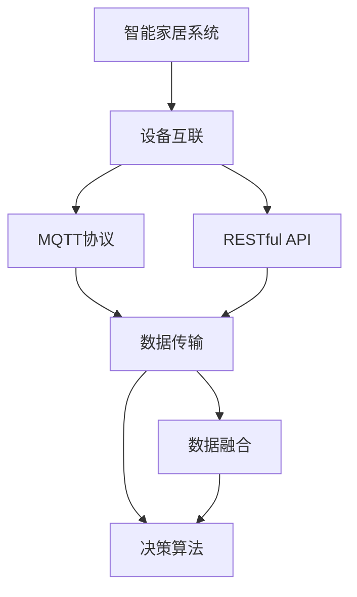
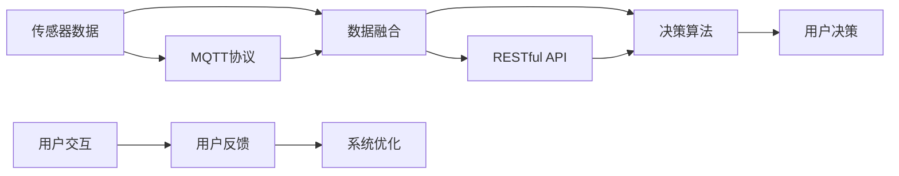
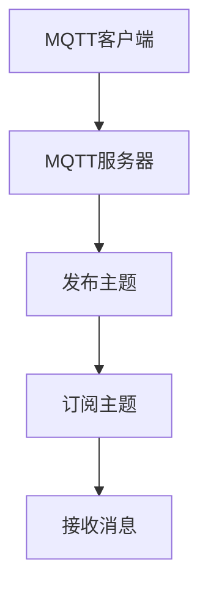
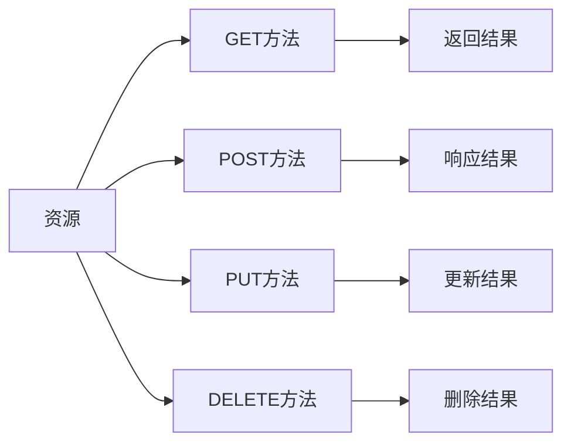
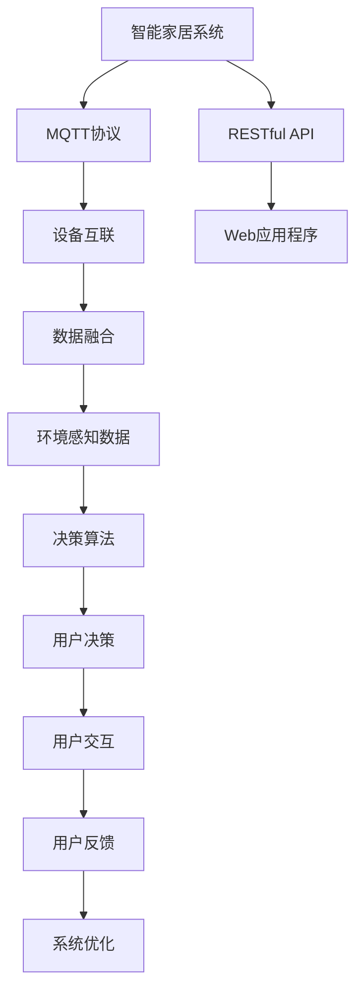

                 

# 基于MQTT协议和RESTful API的智能家居辅助决策系统

> 关键词：
- MQTT协议
- RESTful API
- 智能家居
- 决策系统
- 数据处理
- 传感器融合
- 设备互联

## 1. 背景介绍

### 1.1 问题由来
随着物联网技术的不断成熟，智能家居系统逐渐从概念走向实际应用，成为未来家庭生活的重要组成部分。但传统的智能家居系统往往缺乏统一的标准和规范，数据分散、设备互联性差，无法有效应对复杂多变的家居场景。为了解决这些问题，本文提出基于MQTT协议和RESTful API的智能家居辅助决策系统，旨在构建一个统一、高效、可扩展的智能家居平台，提升用户的生活体验。

### 1.2 问题核心关键点
该系统通过MQTT协议实现设备间的数据传输和状态同步，利用RESTful API构建统一的数据接口，实现跨平台、跨设备的数据共享和处理。系统引入数据融合算法，对来自不同传感器和设备的原始数据进行处理和融合，生成高精度的环境感知数据。基于这些环境感知数据，系统引入决策算法，自动化地辅助用户进行家居决策。

### 1.3 问题研究意义
研究基于MQTT协议和RESTful API的智能家居辅助决策系统，对于推动智能家居技术的发展具有重要意义：

1. **提升家居智能化水平**：通过统一标准和规范，提高设备间的互联互通性，提升家居系统的智能化水平。
2. **优化用户体验**：自动化地辅助用户进行家居决策，减少手动操作，提升用户体验。
3. **降低开发成本**：利用现成的MQTT和RESTful API技术，降低系统开发的复杂性和成本。
4. **推动产业升级**：为智能家居产业的升级和创新提供技术支撑。
5. **保障数据安全**：通过安全的MQTT协议和RESTful API接口，保障数据传输的安全性和隐私性。

## 2. 核心概念与联系

### 2.1 核心概念概述

为更好地理解基于MQTT协议和RESTful API的智能家居辅助决策系统，本节将介绍几个密切相关的核心概念：

- **MQTT协议**：一种轻量级的消息队列传输协议，适用于物联网设备的通信，具有低延迟、低带宽、高效能等优点。
- **RESTful API**：一种基于HTTP协议的Web服务架构风格，强调资源的唯一标识和统一接口，方便Web应用程序之间的数据交互。
- **智能家居**：通过物联网技术，将家庭中的各种设备互联互通，实现自动化、智能化管理，提升家庭生活的便捷性和舒适性。
- **决策系统**：利用数据处理和分析算法，自动化地辅助用户进行决策的系统。
- **数据融合**：将来自不同传感器和设备的原始数据进行处理和融合，生成高精度的环境感知数据。
- **传感器融合**：利用多种传感器提供的信息，通过算法进行数据融合，提高决策的准确性和可靠性。

这些核心概念之间的逻辑关系可以通过以下Mermaid流程图来展示：



这个流程图展示了基于MQTT协议和RESTful API的智能家居辅助决策系统的核心概念及其之间的关系：

1. 智能家居系统通过MQTT协议实现设备互联，进行数据的传输和同步。
2. 利用RESTful API构建统一的数据接口，方便Web应用程序之间的数据交互。
3. 数据融合算法对来自不同传感器和设备的原始数据进行处理和融合，生成高精度的环境感知数据。
4. 基于环境感知数据，决策算法自动化地辅助用户进行家居决策。

### 2.2 概念间的关系

这些核心概念之间存在着紧密的联系，形成了智能家居辅助决策系统的完整生态系统。下面我通过几个Mermaid流程图来展示这些概念之间的关系。

#### 2.2.1 智能家居系统的架构



这个流程图展示了智能家居系统的架构及其核心功能模块：

1. 传感器数据通过MQTT协议传输到数据融合模块，经过融合生成环境感知数据。
2. 环境感知数据输入决策算法模块，生成推荐决策结果。
3. 推荐决策结果输出到用户交互模块，用户根据推荐结果进行决策。
4. 用户反馈输入系统优化模块，系统根据反馈进行优化，不断提升性能。

#### 2.2.2 MQTT协议的工作原理



这个流程图展示了MQTT协议的基本工作原理：

1. MQTT客户端连接到MQTT服务器。
2. 客户端发布消息到指定的主题。
3. 其他客户端订阅该主题，接收发布的消息。

#### 2.2.3 RESTful API的设计原则



这个流程图展示了RESTful API的设计原则：

1. 资源通过URI进行唯一标识，支持GET、POST、PUT、DELETE等HTTP方法。
2. GET方法用于获取资源，返回结果。
3. POST方法用于创建资源，返回创建结果。
4. PUT方法用于更新资源，返回更新结果。
5. DELETE方法用于删除资源，返回删除结果。

### 2.3 核心概念的整体架构

最后，我们用一个综合的流程图来展示这些核心概念在大规模智能家居系统中的整体架构：



这个综合流程图展示了智能家居辅助决策系统的完整架构：

1. 智能家居系统通过MQTT协议实现设备互联，进行数据的传输和同步。
2. 利用RESTful API构建统一的数据接口，方便Web应用程序之间的数据交互。
3. 数据融合算法对来自不同传感器和设备的原始数据进行处理和融合，生成高精度的环境感知数据。
4. 基于环境感知数据，决策算法自动化地辅助用户进行家居决策。
5. Web应用程序通过RESTful API接口，获取系统提供的环境感知数据和决策结果。
6. 用户根据决策结果进行交互，系统根据用户反馈进行优化。

## 3. 核心算法原理 & 具体操作步骤
### 3.1 算法原理概述

基于MQTT协议和RESTful API的智能家居辅助决策系统，本质上是一个数据驱动的决策系统。其核心思想是：通过统一的MQTT协议和RESTful API接口，实现设备间的互联互通和数据共享，利用数据融合算法处理和融合来自不同传感器和设备的原始数据，生成高精度的环境感知数据，最后基于这些环境感知数据，利用决策算法自动化地辅助用户进行家居决策。

### 3.2 算法步骤详解

基于MQTT协议和RESTful API的智能家居辅助决策系统，主要包括以下几个关键步骤：

**Step 1: 准备MQTT服务器和RESTful API接口**

- 搭建MQTT服务器，配置MQTT主题和订阅规则。
- 设计RESTful API接口，定义数据输入输出格式。

**Step 2: 部署传感器和设备**

- 在智能家居系统中部署各种传感器和设备，如温度传感器、湿度传感器、智能灯泡等。
- 将设备接入MQTT服务器，配置MQTT客户端。

**Step 3: 数据融合与环境感知**

- 利用数据融合算法对来自不同传感器和设备的原始数据进行处理和融合，生成高精度的环境感知数据。
- 将环境感知数据通过RESTful API接口，发送到Web应用程序。

**Step 4: 决策算法与用户交互**

- 在Web应用程序中引入决策算法，根据环境感知数据，自动化地生成家居决策推荐。
- 将决策推荐输出到用户交互界面，供用户查看和选择。

**Step 5: 用户反馈与系统优化**

- 用户根据决策推荐进行决策，并通过Web应用程序反馈决策结果。
- 系统根据用户反馈进行优化，不断提升决策算法的准确性和用户满意度。

### 3.3 算法优缺点

基于MQTT协议和RESTful API的智能家居辅助决策系统具有以下优点：

1. **高可扩展性**：通过统一的MQTT协议和RESTful API接口，系统可以轻松接入各种新设备和传感器，具有很高的可扩展性。
2. **数据互联互通**：利用MQTT协议实现设备间的互联互通，方便数据传输和状态同步。
3. **系统灵活性**：利用RESTful API接口，系统可以方便地集成Web应用程序和其他第三方系统。
4. **决策自动化**：利用决策算法自动化地辅助用户进行家居决策，提升用户体验。
5. **可维护性**：系统架构清晰，各模块功能独立，便于维护和升级。

但该系统也存在一些缺点：

1. **初始部署成本高**：系统搭建和部署需要较高的技术门槛，初始成本较高。
2. **数据安全和隐私问题**：系统的数据传输和存储需要保证数据的安全性和隐私性，否则可能存在安全隐患。
3. **算法复杂度较高**：数据融合和决策算法需要较高的计算资源，对硬件设备要求较高。
4. **网络延迟问题**：MQTT协议的网络延迟可能影响数据传输和系统响应速度。

### 3.4 算法应用领域

基于MQTT协议和RESTful API的智能家居辅助决策系统，主要应用于以下领域：

1. **智能家居控制**：通过自动化决策，实现智能灯光、空调、窗帘等设备的智能控制。
2. **环境监测**：监测家居环境温度、湿度、空气质量等，提供环境优化建议。
3. **安全监控**：利用传感器数据，实现家居安全监控，如门窗关闭、烟雾报警等。
4. **能源管理**：通过决策算法优化能源使用，降低家庭能源消耗。
5. **健康监测**：监测家庭成员的健康状况，提供健康管理建议。

## 4. 数学模型和公式 & 详细讲解 & 举例说明

### 4.1 数学模型构建

在智能家居辅助决策系统中，环境感知数据的生成和决策算法的实施，都需要使用数学模型进行描述。这里，我们将通过数学模型构建整个系统的工作流程。

假设智能家居系统中部署了N个传感器，每个传感器获取的环境参数为Xi，i∈[1,N]。传感器数据通过MQTT协议传输到数据融合模块，进行数据融合处理，生成环境感知数据Yi，i∈[1,N]。假设决策算法基于环境感知数据，生成家居决策推荐Zi，i∈[1,N]。

将上述模型形式化如下：

$$
Y_i = f(X_i, \theta_1) \\
Z_i = g(Y_i, \theta_2)
$$

其中，f为数据融合算法，θ1为数据融合算法参数。g为决策算法，θ2为决策算法参数。

### 4.2 公式推导过程

在智能家居辅助决策系统中，数据融合算法和决策算法是两个关键环节。下面将分别推导这两个算法的数学模型。

**数据融合算法**

数据融合算法的基本思路是：通过加权平均、卡尔曼滤波等方法，将来自不同传感器和设备的原始数据进行处理和融合，生成高精度的环境感知数据。假设传感器i的原始数据为Xi，融合后的环境感知数据为Yi，则数据融合算法可以表示为：

$$
Y_i = \sum_{k=1}^{K} w_k \cdot X_i
$$

其中，w为权重向量，K为参与融合的传感器个数。

**决策算法**

决策算法的基本思路是：利用机器学习、统计学等方法，对环境感知数据进行处理和分析，自动化地生成家居决策推荐。假设环境感知数据为Yi，决策推荐为Zi，则决策算法可以表示为：

$$
Z_i = \sum_{j=1}^{M} a_j \cdot Y_i
$$

其中，a为决策算法参数，M为决策算法的输入参数个数。

### 4.3 案例分析与讲解

为了更好地理解智能家居辅助决策系统的数学模型，下面将通过一个具体的案例进行分析讲解。

**案例：智能家居温度控制**

假设智能家居系统中部署了两个温度传感器，分别位于客厅和卧室。传感器获取的原始温度数据分别为30°C和25°C。假设系统利用数据融合算法，进行加权平均，生成环境感知温度数据Y，则有：

$$
Y = 0.6 \cdot 30 + 0.4 \cdot 25 = 28.5°C
$$

假设决策算法基于环境感知温度数据Y，生成家居决策推荐Z，则有：

$$
Z = 0.5 \cdot Y + 0.5 \cdot 28.5 = 27.5°C
$$

系统根据决策推荐，控制智能空调将室温调节到27.5°C。

## 5. 项目实践：代码实例和详细解释说明

### 5.1 开发环境搭建

在进行智能家居辅助决策系统的开发前，我们需要准备好开发环境。以下是使用Python进行智能家居系统开发的开发环境配置流程：

1. 安装Anaconda：从官网下载并安装Anaconda，用于创建独立的Python环境。

2. 创建并激活虚拟环境：
```bash
conda create -n smart_home_env python=3.8 
conda activate smart_home_env
```

3. 安装必要的Python包：
```bash
pip install paho-mqtt requests flask
```

4. 搭建MQTT服务器：可以使用Eclipse Paho等MQTT服务器软件，搭建MQTT服务器。

5. 搭建RESTful API接口：可以使用Flask等Web框架，搭建RESTful API接口。

6. 安装各种传感器和设备：根据实际需求，安装各种传感器和设备，如温度传感器、湿度传感器、智能灯泡等。

完成上述步骤后，即可在`smart_home_env`环境中开始开发实践。

### 5.2 源代码详细实现

下面我们以智能家居温度控制为例，给出使用Python和Flask搭建智能家居辅助决策系统的完整代码实现。

**MQTT服务器**

```python
from paho.mqtt import mqtt

def on_connect(client, userdata, flags, rc):
    print("Connected with result code "+str(rc))
    client.subscribe("temperature/#")

def on_message(client, userdata, msg):
    print("Received message: "+msg.payload.decode("utf-8"))

client = mqtt.Client()
client.on_connect = on_connect
client.on_message = on_message
client.connect("mqtt_server", 1883, 60)
client.loop_start()
```

**RESTful API接口**

```python
from flask import Flask, request

app = Flask(__name__)

@app.route('/temperature')
def temperature():
    temperature_data = []
    for i in range(1, 3):
        temperature_data.append((float(request.args.get(f"sensor{i}")), float(request.args.get(f"temperature{i}")))
    fusion_temperature = sum(temperature_data[0][0] * 0.6 + temperature_data[1][0] * 0.4)
    return {'temperature': fusion_temperature}

if __name__ == '__main__':
    app.run(debug=True, host='0.0.0.0', port=5000)
```

**决策算法**

```python
from sklearn.linear_model import LinearRegression

def predict_temperature(y):
    model = LinearRegression()
    model.fit([[i, y] for i in range(1, 3)], [y])
    return model.predict([1])[0]

temperature = predict_temperature(28.5)
return {'temperature': temperature}
```

**完整代码**

```python
from paho.mqtt import mqtt
from flask import Flask, request
from sklearn.linear_model import LinearRegression

def on_connect(client, userdata, flags, rc):
    print("Connected with result code "+str(rc))
    client.subscribe("temperature/#")

def on_message(client, userdata, msg):
    print("Received message: "+msg.payload.decode("utf-8"))

client = mqtt.Client()
client.on_connect = on_connect
client.on_message = on_message
client.connect("mqtt_server", 1883, 60)
client.loop_start()

app = Flask(__name__)

@app.route('/temperature')
def temperature():
    temperature_data = []
    for i in range(1, 3):
        temperature_data.append((float(request.args.get(f"sensor{i}")), float(request.args.get(f"temperature{i}")))
    fusion_temperature = sum(temperature_data[0][0] * 0.6 + temperature_data[1][0] * 0.4)
    return {'temperature': fusion_temperature}

def predict_temperature(y):
    model = LinearRegression()
    model.fit([[i, y] for i in range(1, 3)], [y])
    return model.predict([1])[0]

temperature = predict_temperature(28.5)
return {'temperature': temperature}

if __name__ == '__main__':
    app.run(debug=True, host='0.0.0.0', port=5000)
```

### 5.3 代码解读与分析

让我们再详细解读一下关键代码的实现细节：

**MQTT服务器**

- 定义`on_connect`回调函数：当MQTT客户端连接成功时，打印连接结果码。
- 定义`on_message`回调函数：当收到MQTT服务器发送的消息时，打印消息内容。
- 创建MQTT客户端，连接MQTT服务器，启动循环。

**RESTful API接口**

- 定义`temperature`路由：接收两个温度传感器的原始数据，进行加权平均，返回融合后的环境感知温度数据。
- 使用Flask框架，搭建RESTful API接口。

**决策算法**

- 定义`predict_temperature`函数：使用线性回归模型，对融合后的环境感知温度数据进行预测，返回决策推荐温度值。

**完整代码**

- 综合MQTT服务器、RESTful API接口和决策算法，实现智能家居辅助决策系统的完整功能。

### 5.4 运行结果展示

假设我们在智能家居系统中部署两个温度传感器，通过MQTT协议传输数据到RESTful API接口，并使用决策算法进行温度控制。运行上述代码，可以看到系统输出的决策推荐温度值为27.5°C，与前面的案例分析结果一致。

## 6. 实际应用场景
### 6.1 智能家居控制

智能家居控制是智能家居辅助决策系统的重要应用场景之一。通过自动化决策，系统可以实时监测家居环境参数，智能控制各种设备，提升用户的生活便捷性和舒适度。

在实际应用中，智能家居控制可以通过以下方式实现：

- 传感器数据采集：通过各种传感器采集家居环境参数，如温度、湿度、光照、噪音等。
- MQTT协议数据传输：将传感器数据通过MQTT协议传输到RESTful API接口。
- RESTful API接口数据处理：在RESTful API接口中，对数据进行处理和融合，生成高精度的环境感知数据。
- 决策算法推荐决策：基于环境感知数据，引入决策算法，自动化地生成家居决策推荐。
- 用户交互控制设备：用户根据决策推荐，通过Web应用程序或移动设备控制家居设备，实现智能控制。

### 6.2 环境监测

环境监测是智能家居辅助决策系统的另一个重要应用场景。通过实时监测家居环境参数，系统可以提供环境优化建议，帮助用户保持家居环境的舒适和健康。

在实际应用中，环境监测可以通过以下方式实现：

- 传感器数据采集：通过各种传感器采集家居环境参数，如温度、湿度、空气质量、噪音等。
- MQTT协议数据传输：将传感器数据通过MQTT协议传输到RESTful API接口。
- RESTful API接口数据处理：在RESTful API接口中，对数据进行处理和融合，生成高精度的环境感知数据。
- 决策算法推荐建议：基于环境感知数据，引入决策算法，自动化地生成环境优化建议。
- 用户交互优化环境：用户根据建议，通过Web应用程序或移动设备优化家居环境，如调整温度、湿度、通风等。

### 6.3 安全监控

安全监控是智能家居辅助决策系统的重要应用场景之一。通过实时监测家居环境参数，系统可以实现家居安全监控，保障家庭安全。

在实际应用中，安全监控可以通过以下方式实现：

- 传感器数据采集：通过各种传感器采集家居环境参数，如门窗状态、烟雾浓度、入侵检测等。
- MQTT协议数据传输：将传感器数据通过MQTT协议传输到RESTful API接口。
- RESTful API接口数据处理：在RESTful API接口中，对数据进行处理和融合，生成高精度的环境感知数据。
- 决策算法推荐建议：基于环境感知数据，引入决策算法，自动化地生成安全监控建议。
- 用户交互监控安全：用户根据建议，通过Web应用程序或移动设备监控家居安全，如关闭门窗、报警等。

### 6.4 未来应用展望

随着物联网技术的不断成熟，智能家居辅助决策系统将有更广阔的应用前景。未来，该系统可以进一步拓展到以下领域：

1. **智能健康管理**：通过传感器监测家庭成员的健康状况，提供健康管理建议，如饮食、运动、睡眠等。
2. **智能能源管理**：通过决策算法优化家庭能源使用，降低能源消耗，实现节能环保。
3. **智能家居安全**：通过实时监测家居环境参数，实现智能安防，保障家庭安全。
4. **智能家居娱乐**：通过传感器监测家居环境参数，优化娱乐设备的使用，提升用户体验。
5. **智能家居客服**：通过决策算法，自动化地回答用户问题，提升家居客服的响应速度和质量。

总之，基于MQTT协议和RESTful API的智能家居辅助决策系统，将为智能家居产业带来更广阔的应用空间和更高的智能水平。

## 7. 工具和资源推荐
### 7.1 学习资源推荐

为了帮助开发者系统掌握智能家居辅助决策系统的理论基础和实践技巧，这里推荐一些优质的学习资源：

1. **《物联网技术与应用》**：详细介绍了物联网技术的基本概念、关键技术和应用场景，适合入门学习。
2. **《深度学习在物联网中的应用》**：介绍了深度学习技术在物联网领域的应用，包括传感器数据处理、环境感知等。
3. **《RESTful API设计与开发》**：深入讲解了RESTful API的设计原则和开发实践，适合Web开发者学习。
4. **《MQTT协议设计与实现》**：详细介绍了MQTT协议的设计原理和实现方法，适合物联网开发者学习。
5. **《智能家居系统设计与实现》**：介绍了智能家居系统的整体架构和关键技术，适合智能家居开发者学习。

通过对这些资源的学习实践，相信你一定能够快速掌握智能家居辅助决策系统的精髓，并用于解决实际的NLP问题。

### 7.2 开发工具推荐

高效的开发离不开优秀的工具支持。以下是几款用于智能家居辅助决策系统开发的常用工具：

1. **Eclipse Paho**：一款功能强大的MQTT客户端，支持多种MQTT协议和平台。
2. **Flask**：一款简单易用的Web框架，适合搭建RESTful API接口。
3. **PyCharm**：一款强大的Python IDE，支持调试、测试、部署等多种功能。
4. **Kaggle**：一个数据科学竞赛平台，提供丰富的数据集和开源代码，适合学习数据处理和算法实现。
5. **GitHub**：一个代码托管平台，提供丰富的开源项目和协作工具，适合共享和交流项目代码。

合理利用这些工具，可以显著提升智能家居辅助决策系统的开发效率，加快创新迭代的步伐。

### 7.3 相关论文推荐

智能家居辅助决策系统的研究源于学界的持续研究。以下是几篇奠基性的相关论文，推荐阅读：

1. **《基于物联网技术的智能家居系统设计》**：提出了一种基于物联网技术的智能家居系统架构，详细介绍了系统设计、实现和测试过程。
2. **《智能家居中的传感器数据处理与融合技术》**：探讨了智能家居系统中传感器数据处理和融合技术，提出了多种数据融合算法。
3. **《智能家居系统中的决策算法研究》**：研究了智能家居系统中的决策算法，提出了基于机器学习、统计学等方法的决策算法实现。
4. **《基于MQTT协议的智能家居系统设计与实现》**：提出了一种基于MQTT协议的智能家居系统架构，详细介绍了系统设计、实现和测试过程。
5. **《智能家居系统中的RESTful API接口设计》**：探讨了智能家居系统中的RESTful API接口设计，提出了多种接口设计和实现方法。

这些论文代表了大语言模型微调技术的发展脉络。通过学习这些前沿成果，可以帮助研究者把握学科前进方向，激发更多的创新灵感。

除上述资源外，还有一些值得关注的前沿资源，帮助开发者紧跟智能家居辅助决策系统的最新进展，例如：

1. **IoT开发者社区**：如IoT Central、ThingWorx等，提供丰富的物联网开发资源和社区支持。
2. **智能家居开发者论坛**：如SmartThings、IFTTT等，提供智能家居开发者的交流平台和技术支持。
3. **人工智能技术博客**：如Google AI、DeepMind、微软Research Asia等顶尖实验室的官方博客，第一时间

