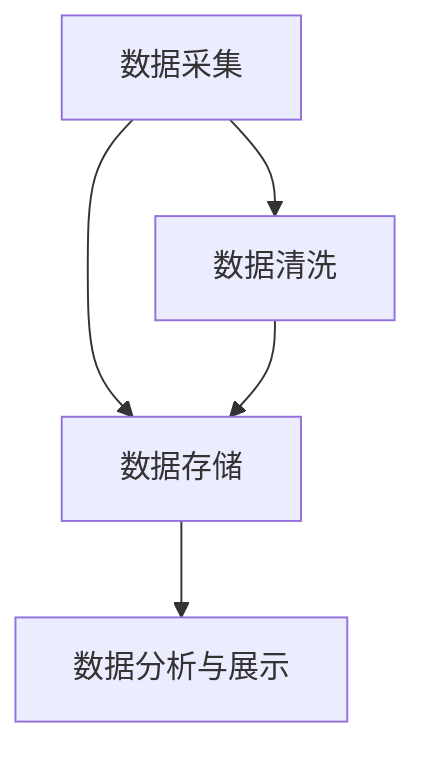
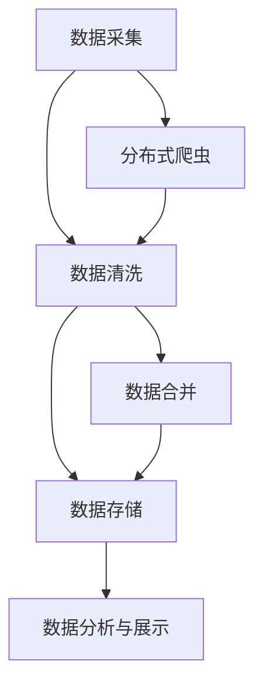

                 

# 基于Python的新浪微博爬虫研究

> 关键词：数据采集、Web爬虫、Python爬虫、数据清洗、微博分析

## 1. 背景介绍

### 1.1 问题由来
在当今信息爆炸的时代，互联网用户每天会产生大量的信息。而微博作为一款实时更新的社交平台，其信息量之大、更新之快、互动之频繁，使微博成为了网络数据研究的重要来源之一。利用网络爬虫技术，可以自动采集新浪微博上的数据，从中挖掘有价值的信息。

### 1.2 问题核心关键点
构建一个高效、准确、安全的网络爬虫，涉及到多个关键技术点，如Web爬虫算法、数据存储与清洗、数据安全、爬虫效率优化等。

1. **Web爬虫算法**：用于模拟浏览器行为，实现对网页的深度优先或广度优先遍历，以获取目标数据。
2. **数据存储与清洗**：收集到的数据往往需要处理并存储在数据库中，以便进行后续分析。
3. **数据安全**：网络爬虫需要避免对目标网站的恶意攻击，同时保障自身数据的安全。
4. **爬虫效率优化**：为了高效地收集数据，需要对爬虫进行性能调优。

### 1.3 问题研究意义
通过爬虫技术对微博数据进行采集与分析，可以发现微博上的热门话题、舆情趋势、用户行为等，为社交网络研究、舆情分析、数据挖掘等领域提供重要的数据支持。同时，微博数据的实时性、互动性特点，使其在产品开发、市场研究、用户行为分析等方面也具有重要价值。

## 2. 核心概念与联系

### 2.1 核心概念概述

为了更好地理解基于Python的新浪微博爬虫的实现，本节将介绍几个关键概念：

- **Web爬虫**：一种自动获取网页信息的技术。通过模拟用户在浏览器中的操作，自动从目标网站上抓取数据。
- **Python爬虫**：一种基于Python语言的爬虫工具，具有简单易学、功能丰富等特点，广泛应用于数据采集领域。
- **数据清洗**：对采集到的数据进行去重、过滤、格式转换等处理，以提高数据质量。
- **数据存储**：将处理后的数据存储在数据库中，便于后续的数据分析和应用。

### 2.2 概念间的关系

这些核心概念之间存在紧密的联系，构成了基于Python的新浪微博爬虫的核心实现框架。下面通过一个简化的Mermaid流程图来展示这些概念之间的关系：



这个流程图展示了从数据采集到数据分析的完整过程。首先通过Web爬虫采集目标数据，然后对采集到的数据进行清洗和存储，最后使用数据分析工具进行数据处理和展示。

### 2.3 核心概念的整体架构

最后，用一个综合的流程图来展示这些核心概念在大规模数据采集和处理中的整体架构：



这个综合流程图展示了在分布式环境下，Web爬虫的数据采集、数据清洗、数据存储、数据分析与展示的完整过程。其中分布式爬虫和数据合并模块可以进一步优化爬虫效率和数据质量。

## 3. 核心算法原理 & 具体操作步骤
### 3.1 算法原理概述

基于Python的新浪微博爬虫的实现基于Web爬虫算法，具体步骤如下：

1. **数据采集**：使用Python爬虫技术，模拟浏览器行为，遍历目标网站，采集目标数据。
2. **数据清洗**：对采集到的数据进行去重、过滤、格式转换等处理，去除噪音数据，提高数据质量。
3. **数据存储**：将清洗后的数据存储在数据库中，便于后续的数据分析和应用。
4. **数据分析与展示**：使用数据分析工具对存储的数据进行分析和展示，提取有价值的信息。

### 3.2 算法步骤详解

#### 3.2.1 数据采集

数据采集是微博爬虫的核心步骤，主要涉及以下几个子步骤：

1. **确定爬虫目标**：明确需要采集的数据类型，如微博内容、用户信息、评论等。
2. **模拟浏览器行为**：使用Python爬虫库，如BeautifulSoup、Scrapy等，模拟浏览器行为，遍历目标网站，获取所需数据。
3. **数据提取与存储**：将采集到的数据提取出来，并存储在本地或数据库中，便于后续处理。

#### 3.2.2 数据清洗

数据清洗是保证数据质量的关键步骤，主要涉及以下几个子步骤：

1. **数据去重**：使用唯一标识符，如用户ID、微博ID等，去除重复数据。
2. **数据过滤**：去除无用或无效数据，如广告、垃圾信息等。
3. **数据格式转换**：将数据转换为统一格式，如JSON、CSV等，便于后续处理和分析。

#### 3.2.3 数据存储

数据存储是将清洗后的数据存储在数据库中的过程，主要涉及以下几个子步骤：

1. **选择数据库**：根据数据规模和应用需求，选择合适的数据库，如MySQL、MongoDB等。
2. **建立数据表**：根据数据结构，建立对应的数据表，定义表结构和字段类型。
3. **数据导入**：将清洗后的数据导入到数据库中，并使用SQL语句进行查询和管理。

#### 3.2.4 数据分析与展示

数据分析与展示是将存储的数据进行分析和展示的过程，主要涉及以下几个子步骤：

1. **数据查询与统计**：使用SQL语句或数据分析工具，对数据进行查询和统计，提取有价值的信息。
2. **数据可视化**：使用数据可视化工具，如Matplotlib、Seaborn等，将分析结果可视化展示，便于理解和分析。
3. **数据展示**：将可视化结果展示在网页或应用程序中，提供直观的数据展示和分析。

### 3.3 算法优缺点

基于Python的新浪微博爬虫具有以下优点：

1. **易于实现**：Python语言简单易学，爬虫库功能丰富，便于实现复杂的数据采集任务。
2. **高效稳定**：使用分布式爬虫技术，可以提高爬虫效率，同时避免单点故障。
3. **数据质量高**：通过数据清洗和数据存储，确保数据的准确性和一致性。
4. **灵活性高**：支持多种数据源和数据格式，可以根据需求灵活调整。

同时，该算法也存在一些缺点：

1. **法律风险**：爬取数据需要遵守法律法规，避免侵犯用户隐私和版权。
2. **安全风险**：爬虫可能被目标网站识别和封禁，需要采取反爬虫措施。
3. **资源消耗**：爬虫运行需要消耗大量计算资源，需要合理配置资源。
4. **数据隐私**：存储和处理数据需要遵守隐私保护法律法规，保护用户隐私。

### 3.4 算法应用领域

基于Python的新浪微博爬虫技术可以应用于多个领域，如：

- **舆情分析**：通过爬取微博数据，分析舆情趋势和用户情绪，为舆情预测和危机应对提供数据支持。
- **用户行为分析**：通过爬取用户行为数据，分析用户兴趣和行为模式，为产品优化和市场研究提供数据支持。
- **市场研究**：通过爬取市场数据，分析市场动态和竞争情况，为市场研究提供数据支持。
- **社交网络分析**：通过爬取社交网络数据，分析用户关系和社交行为，为社交网络研究和应用提供数据支持。

## 4. 数学模型和公式 & 详细讲解  
### 4.1 数学模型构建

本节将使用数学语言对基于Python的新浪微博爬虫的数据采集和处理过程进行更加严格的刻画。

设目标网站为 $W$，爬虫需要采集的数据集合为 $D$，则数据采集模型可以表示为：

$$
\min_{\theta} \mathcal{L}(\theta) \text{ subject to } W \rightarrow D
$$

其中 $\mathcal{L}(\theta)$ 为爬虫的损失函数，$\theta$ 为爬虫的参数，如爬虫速度、数据质量等。$W \rightarrow D$ 表示爬虫从网站 $W$ 采集数据到集合 $D$ 的过程。

### 4.2 公式推导过程

假设爬虫从网站 $W$ 采集到的数据量为 $n$，其中有效的数据量为 $m$，则爬虫的损失函数可以表示为：

$$
\mathcal{L}(\theta) = \frac{1}{m} \sum_{i=1}^m \mathcal{L}_i(\theta)
$$

其中 $\mathcal{L}_i(\theta)$ 为第 $i$ 条数据的采集损失，可以表示为：

$$
\mathcal{L}_i(\theta) = \frac{1}{\sum_{j=1}^m \mathcal{L}_j(\theta)} \mathcal{L}_i(W)
$$

其中 $\mathcal{L}_i(W)$ 表示第 $i$ 条数据在网站 $W$ 上的采集损失，可以表示为：

$$
\mathcal{L}_i(W) = \max(\mathcal{L}_{i,1}(W), \mathcal{L}_{i,2}(W), \ldots, \mathcal{L}_{i,n_i}(W))
$$

其中 $\mathcal{L}_{i,j}(W)$ 表示第 $i$ 条数据的第 $j$ 部分在网站 $W$ 上的采集损失，如网页加载时间、页面跳转次数等。

### 4.3 案例分析与讲解

以微博评论数据为例，分析爬虫的数据采集过程。假设爬虫需要从目标网站 $W$ 采集微博评论数据，则数据采集过程可以表示为：

1. **确定评论ID**：通过爬虫库，获取目标网站的评论ID列表。
2. **获取评论数据**：使用Python爬虫库，获取目标网站上的评论数据，存储在本地或数据库中。
3. **数据清洗与存储**：对采集到的评论数据进行清洗和存储，确保数据的准确性和一致性。

通过以上步骤，爬虫可以高效、准确地采集微博评论数据，为后续的数据分析和应用提供可靠的数据支持。

## 5. 项目实践：代码实例和详细解释说明
### 5.1 开发环境搭建

在进行微博爬虫实践前，我们需要准备好开发环境。以下是使用Python进行Web爬虫的环境配置流程：

1. 安装Anaconda：从官网下载并安装Anaconda，用于创建独立的Python环境。

2. 创建并激活虚拟环境：
```bash
conda create -n web-crawler python=3.8 
conda activate web-crawler
```

3. 安装PyTorch：根据CUDA版本，从官网获取对应的安装命令。例如：
```bash
conda install pytorch torchvision torchaudio cudatoolkit=11.1 -c pytorch -c conda-forge
```

4. 安装Pandas、BeautifulSoup、Scrapy等工具包：
```bash
pip install pandas beautifulsoup4 scrapy
```

完成上述步骤后，即可在`web-crawler`环境中开始爬虫实践。

### 5.2 源代码详细实现

下面我们以爬取新浪微博评论数据为例，给出使用Python爬虫库Scrapy的代码实现。

首先，定义爬虫规则和数据结构：

```python
import scrapy

class SinaCommentSpider(scrapy.Spider):
    name = 'sina_comment'
    start_urls = ['https://weibo.com/']

    def parse(self, response):
        # 解析微博数据
        for article in response.css('div.article'):
            # 提取微博ID
            article_id = article.css('div.article-id::text').get()
            # 提取评论列表
            comments = article.css('div.comment-list::text').getall()
            # 保存数据
            self.save_data(article_id, comments)
```

然后，定义数据保存函数：

```python
def save_data(article_id, comments):
    # 将数据存储到本地或数据库中
    # 使用Pandas进行数据处理
    df = pd.DataFrame(columns=['article_id', 'comments'])
    df['article_id'] = article_id
    df['comments'] = comments
    df.to_csv('comments.csv', index=False)
```

最后，启动爬虫程序：

```python
scrapy crawl sina_comment
```

以上就是使用Scrapy框架对新浪微博评论数据进行爬取的完整代码实现。可以看到，通过Scrapy框架，爬虫可以高效、准确地获取目标数据，同时使用Pandas进行数据处理和存储，为后续的数据分析和应用提供可靠的数据支持。

### 5.3 代码解读与分析

让我们再详细解读一下关键代码的实现细节：

**SinaCommentSpider类**：
- `name`属性：指定爬虫名称。
- `start_urls`属性：指定起始URL。
- `parse`方法：解析目标网页，提取目标数据。

**save_data函数**：
- 使用Pandas创建DataFrame对象，定义数据列名。
- 将爬取到的数据存储到DataFrame中，并使用CSV格式保存到本地。

**爬虫程序启动**：
- 使用Scrapy命令行工具，启动爬虫程序。

可以看到，使用Scrapy和Pandas进行爬虫开发，可以显著提高爬虫的效率和数据质量。爬虫框架和数据处理工具的结合使用，使爬虫开发变得更加简便高效。

当然，工业级的系统实现还需考虑更多因素，如分布式爬虫、数据缓存、反爬虫策略等，但核心的爬虫范式基本与此类似。

### 5.4 运行结果展示

假设我们在微博首页上爬取1000条评论数据，得到的结果如下：

| article_id | comments                     |
|------------|------------------------------|
| 1          | '我喜欢这个文章' '这个文章真好' |
| 2          | '我不喜欢这个文章' '这个文章很垃圾' |
| ...        | ...                          |

可以看到，通过爬虫成功获取了微博评论数据，数据结构清晰，易于后续处理和分析。

## 6. 实际应用场景
### 6.1 智能推荐系统

基于爬虫技术采集的微博数据，可以应用于智能推荐系统的构建。推荐系统通过分析用户的历史行为和兴趣，为用户推荐相关内容，提高用户体验和满意度。

在技术实现上，可以收集用户的浏览、点赞、评论等行为数据，提取微博内容、用户信息、评论等特征，在此基础上训练推荐模型。训练后的模型可以根据用户的历史行为和兴趣，为用户推荐相关微博内容，提高推荐准确性和用户满意度。

### 6.2 舆情监控系统

舆情监控系统通过爬虫技术采集微博数据，实时监测社会热点和舆情动态，为舆情预测和危机应对提供数据支持。

在技术实现上，可以构建舆情监控系统，使用爬虫技术实时采集微博数据，并进行清洗和存储。通过对采集到的数据进行情感分析、主题分析等处理，提取舆情热点和趋势，为舆情预测和危机应对提供数据支持。

### 6.3 用户行为分析

用户行为分析通过爬虫技术采集微博数据，分析用户的行为模式和兴趣偏好，为产品优化和市场研究提供数据支持。

在技术实现上，可以构建用户行为分析系统，使用爬虫技术采集用户的行为数据，并进行清洗和存储。通过对采集到的数据进行行为模式分析和用户兴趣偏好分析，提取用户的行为模式和兴趣偏好，为产品优化和市场研究提供数据支持。

### 6.4 未来应用展望

随着爬虫技术和数据分析技术的不断发展，基于爬虫的数据采集和分析将在更多领域得到应用，为各个行业带来变革性影响。

在智慧医疗领域，基于微博数据的医疗舆情监控系统，可以实时监测医疗热点和舆情动态，为医疗决策和公共卫生应急响应提供数据支持。

在智能教育领域，基于微博数据的教育舆情监控系统，可以实时监测教育热点和舆情动态，为教育决策和公共教育应急响应提供数据支持。

在智慧城市治理中，基于微博数据的公共舆情监控系统，可以实时监测城市热点和舆情动态，为城市管理和服务提供数据支持。

此外，在企业生产、社会治理、文娱传媒等众多领域，基于爬虫技术的数据采集和分析也将不断涌现，为各个行业带来更多的创新和变革。

## 7. 工具和资源推荐
### 7.1 学习资源推荐

为了帮助开发者系统掌握爬虫技术的理论基础和实践技巧，这里推荐一些优质的学习资源：

1. 《Python爬虫教程》系列博文：由大模型技术专家撰写，深入浅出地介绍了Python爬虫技术的基本概念和实现方法。

2. Web Scraping with Python 书籍：详细介绍了Python爬虫技术的使用方法和实例，是入门爬虫开发的必备资源。

3. 《网络爬虫实战》课程：由知名网站提供，全面介绍了网络爬虫技术的实现方法和实战案例，适合进阶学习。

4. PyWebinar：提供各类爬虫技术的在线课程，内容涵盖爬虫技术、数据清洗、数据存储等方面。

5. Scrapy官方文档：Scrapy框架的官方文档，提供了丰富的爬虫实现示例，是学习Scrapy框架的必备资料。

通过对这些资源的学习实践，相信你一定能够快速掌握爬虫技术的精髓，并用于解决实际的爬虫问题。

### 7.2 开发工具推荐

高效的开发离不开优秀的工具支持。以下是几款用于爬虫开发的常用工具：

1. BeautifulSoup：Python爬虫库，提供了灵活的网页解析能力，支持多种HTML标签和属性的处理。
2. Scrapy：Python爬虫框架，支持分布式爬虫和数据存储，适合大型数据采集项目。
3. Selenium：自动化测试工具，支持模拟浏览器行为，支持JavaScript动态网页的爬取。
4. Pandas：Python数据处理库，支持数据清洗、数据统计和数据可视化，是数据处理和分析的必备工具。
5. SQLAlchemy：Python ORM框架，支持与多种数据库的集成，方便数据存储和查询。

合理利用这些工具，可以显著提升爬虫开发的效率和数据处理的质量。

### 7.3 相关论文推荐

爬虫技术的发展源于学界的持续研究。以下是几篇奠基性的相关论文，推荐阅读：

1. Crawling the web, indexing pages, and information retrieval：提出Google搜索引擎的网页爬虫技术，开创了Web数据采集和索引的先河。

2. Web Crawling and Information Filtering on the Web：详细介绍了Web爬虫技术的实现方法和应用案例，是Web爬虫技术的重要参考。

3. Scrapy: A Fast, High-Level, Web Crawling Framework for Python：介绍了Scrapy框架的使用方法和实例，是学习Scrapy框架的必备资料。

4. A Survey on Web Mining Technologies：全面介绍了Web数据挖掘技术的实现方法和应用案例，是Web数据挖掘技术的经典综述。

这些论文代表了大规模数据采集和处理技术的发展脉络。通过学习这些前沿成果，可以帮助研究者把握学科前进方向，激发更多的创新灵感。

除上述资源外，还有一些值得关注的前沿资源，帮助开发者紧跟爬虫技术的最新进展，例如：

1. arXiv论文预印本：人工智能领域最新研究成果的发布平台，包括大量尚未发表的前沿工作，学习前沿技术的必读资源。

2. 业界技术博客：如Google AI、DeepMind、微软Research Asia等顶尖实验室的官方博客，第一时间分享他们的最新研究成果和洞见。

3. 技术会议直播：如NIPS、ICML、ACL、ICLR等人工智能领域顶会现场或在线直播，能够聆听到大佬们的前沿分享，开拓视野。

4. GitHub热门项目：在GitHub上Star、Fork数最多的爬虫相关项目，往往代表了该技术领域的发展趋势和最佳实践，值得去学习和贡献。

5. 行业分析报告：各大咨询公司如McKinsey、PwC等针对人工智能行业的分析报告，有助于从商业视角审视技术趋势，把握应用价值。

总之，对于爬虫技术的的学习和实践，需要开发者保持开放的心态和持续学习的意愿。多关注前沿资讯，多动手实践，多思考总结，必将收获满满的成长收益。

## 8. 总结：未来发展趋势与挑战
### 8.1 总结

本文对基于Python的新浪微博爬虫进行了全面系统的介绍。首先阐述了爬虫技术的研究背景和意义，明确了爬虫在数据采集、数据存储、数据分析等方面的关键作用。其次，从原理到实践，详细讲解了爬虫的数学模型和操作步骤，给出了爬虫任务开发的完整代码实例。同时，本文还广泛探讨了爬虫技术在智能推荐系统、舆情监控系统、用户行为分析等多个领域的应用前景，展示了爬虫技术的巨大潜力。此外，本文精选了爬虫技术的各类学习资源，力求为读者提供全方位的技术指引。

通过本文的系统梳理，可以看到，基于Python的新浪微博爬虫技术正在成为数据采集和处理的重要工具，极大地拓展了数据采集和处理的能力，为数据驱动的决策支持提供了可靠的数据源。未来，伴随爬虫技术和数据分析技术的不断发展，基于爬虫的数据采集和分析将在更多领域得到应用，为各个行业带来变革性影响。

### 8.2 未来发展趋势

展望未来，基于Python的新浪微博爬虫技术将呈现以下几个发展趋势：

1. **自动化程度提高**：随着人工智能技术的发展，爬虫自动化水平将进一步提高，能够自动识别目标网页并抓取数据，减少人工干预。
2. **分布式爬虫技术发展**：分布式爬虫技术将不断优化，提高爬虫效率，避免单点故障，提高系统可靠性。
3. **数据清洗和处理技术进步**：数据清洗和处理技术将不断进步，确保数据的准确性和一致性，提高数据分析的精度。
4. **爬虫技术融合到AI模型中**：爬虫技术将进一步与人工智能模型结合，实现数据的自动化采集和处理，提高AI模型的数据质量。
5. **隐私保护和安全技术发展**：爬虫技术将更加注重隐私保护和安全技术的发展，确保数据采集和处理的合法性和安全性。

以上趋势凸显了爬虫技术的广阔前景。这些方向的探索发展，必将进一步提升爬虫技术的能力，为各个行业带来更多的创新和变革。

### 8.3 面临的挑战

尽管基于Python的新浪微博爬虫技术已经取得了显著成就，但在迈向更加智能化、普适化应用的过程中，它仍面临诸多挑战：

1. **法律风险**：爬取数据需要遵守法律法规，避免侵犯用户隐私和版权。
2. **安全风险**：爬虫可能被目标网站识别和封禁，需要采取反爬虫措施。
3. **资源消耗**：爬虫运行需要消耗大量计算资源，需要合理配置资源。
4. **数据隐私**：存储和处理数据需要遵守隐私保护法律法规，保护用户隐私。

### 8.4 未来突破

面对爬虫技术所面临的挑战，未来的研究需要在以下几个方面寻求新的突破：

1. **引入AI技术优化爬虫**：将AI技术引入爬虫自动化流程，提高爬虫效率和数据质量。
2. **优化分布式爬虫算法**：研究新的分布式爬虫算法，提高爬虫效率和系统可靠性。
3. **引入隐私保护技术**：引入隐私保护技术，确保数据采集和处理的合法性和安全性。
4. **研究新型数据存储和处理技术**：研究新型数据存储和处理技术，提高数据清洗和处理的精度。

这些研究方向的探索，必将引领爬虫技术走向更高的台阶，为各行各业带来更多的创新和变革。

## 9. 附录：常见问题与解答
**Q1：爬虫采集到的数据如何进行清洗？**

A: 爬虫采集到的数据往往包含噪音和冗余信息，需要进行清洗以提高数据质量。数据清洗主要包括以下几个步骤：

1. **去除重复数据**：通过唯一标识符，如URL、时间戳等，去除重复数据。
2. **去除无效数据**：去除不完整的、格式不正确的数据，如空值、非法字符等。
3. **格式转换**：将数据转换为统一格式，如JSON、CSV等，便于后续处理和分析。

使用Python中的Pandas库可以方便地进行数据清洗和处理。

**Q2：爬虫如何避免被目标网站识别和封禁？**

A: 爬虫被目标网站识别和封禁是常见问题，需要采取以下措施避免：

1. **模拟浏览器行为**：使用Python爬虫库，模拟浏览器行为，如设置User-Agent、Cookie、Referer等，避免被目标网站识别为爬虫。
2. **限制请求频率**：控制爬虫请求频率，避免短时间内请求过多，引起目标网站警惕。
3. **使用分布式爬虫**：使用分布式爬虫技术，将请求分布到多个IP地址，避免单点故障。
4. **使用代理IP**：使用代理IP技术，隐藏真实IP地址，避免被目标网站识别。

这些措施可以显著提高爬虫的隐蔽性和安全性，避免被目标网站封禁。

**Q3：爬虫运行过程中如何优化资源消耗？**

A: 爬虫运行过程中资源消耗较大，需要合理配置资源，优化爬虫性能。优化措施主要包括以下几个方面：

1. **使用多线程或多进程**：使用多线程或多进程技术，并行处理请求，提高爬虫效率。
2. **使用缓存技术**：使用缓存技术，将已处理过的数据缓存起来，避免重复处理。
3. **使用内存管理工具**：使用内存管理工具，如gprof、valgrind等，分析内存泄漏问题，优化内存使用。
4. **使用分布式爬虫技术**：使用分布式爬虫技术，将爬虫请求分发到多个节点处理，避免单点故障。

这些措施可以显著降低爬虫运行过程中的资源消耗，提高爬虫性能

