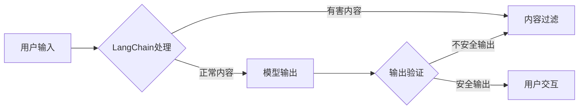

# 【LangChain编程：从入门到实践】模型内容安全

> 关键词：LangChain, 编程, 模型安全, 内容过滤, 风险控制, 安全实践, 代码安全, 模型审查

## 1. 背景介绍

随着人工智能技术的快速发展，自然语言处理（NLP）应用日益普及。LangChain作为一种新兴的NLP框架，通过将多种NLP模型和工具集成，实现了强大的语言理解和生成能力。然而，随着模型应用范围的扩大，内容安全问题也日益凸显。如何确保LangChain编程的安全性和可靠性，成为了开发者和用户关注的焦点。

### 1.1 问题的由来

LangChain编程中存在以下几方面的内容安全风险：

1. **有害内容生成**：模型可能生成包含歧视、暴力、虚假信息等有害内容的文本。
2. **模型欺骗**：攻击者可能通过精心设计的输入欺骗模型，使其产生错误或有害的输出。
3. **隐私泄露**：模型在处理用户输入时，可能无意中泄露敏感信息。
4. **知识产权侵权**：生成的文本可能侵犯他人的知识产权。

### 1.2 研究现状

针对LangChain编程的内容安全问题，研究者们提出了以下几种解决方案：

1. **内容过滤**：通过预定义的规则或算法，对模型输出进行过滤，去除有害内容。
2. **风险控制**：在模型设计阶段，考虑潜在的风险因素，并采取相应的措施进行控制。
3. **安全实践**：在编程过程中，遵循安全规范和最佳实践，提高代码的安全性。
4. **模型审查**：对模型进行定期审查，及时发现和修复安全隐患。

### 1.3 研究意义

研究LangChain编程的内容安全问题，对于保障用户权益、维护社会稳定具有重要意义。它可以：

1. 防范有害内容的传播，净化网络环境。
2. 提高模型的可靠性和可信度。
3. 保护用户隐私，降低数据泄露风险。
4. 促进人工智能技术的健康发展。

### 1.4 本文结构

本文将围绕LangChain编程的内容安全问题展开，内容安排如下：

- 第2部分，介绍LangChain编程及其核心概念。
- 第3部分，阐述内容安全的核心算法原理和具体操作步骤。
- 第4部分，讲解内容安全的数学模型和公式，并结合实例进行分析。
- 第5部分，给出内容安全的代码实例和详细解释说明。
- 第6部分，探讨内容安全在实际应用场景中的应用。
- 第7部分，推荐内容安全相关的学习资源、开发工具和参考文献。
- 第8部分，总结全文，展望内容安全的未来发展趋势与挑战。
- 第9部分，提供常见问题与解答。

## 2. 核心概念与联系

### 2.1 核心概念原理

在讨论内容安全之前，我们首先需要了解LangChain编程的一些核心概念：

- **LangChain**：一种集成多种NLP模型和工具的框架，可以实现文本生成、翻译、摘要、问答等功能。
- **内容过滤**：通过预定义的规则或算法，对文本内容进行审查，去除有害、违规的内容。
- **风险控制**：在模型设计阶段，识别潜在风险，并采取相应的措施进行控制。
- **安全实践**：在编程过程中，遵循安全规范和最佳实践，提高代码的安全性。
- **模型审查**：对模型进行定期审查，及时发现和修复安全隐患。

### 2.2 架构流程图

以下是一个简化的LangChain编程架构流程图，展示了内容安全在各个阶段的应用：



从图中可以看出，内容安全贯穿于LangChain编程的各个环节，包括输入处理、内容过滤、模型输出和输出验证等。

## 3. 核心算法原理 & 具体操作步骤

### 3.1 算法原理概述

内容安全的核心算法主要包括以下几种：

1. **关键词过滤**：通过检测文本中是否存在敏感词，判断内容是否违规。
2. **情感分析**：分析文本的情感倾向，判断内容是否具有负面情绪。
3. **违规检测**：使用预训练的违规检测模型，识别违规内容。
4. **深度学习模型**：利用深度学习技术，对文本内容进行细粒度分析，识别潜在风险。

### 3.2 算法步骤详解

以下是一个基于关键词过滤和情感分析的内容安全算法步骤：

1. **预处理**：对用户输入进行预处理，包括去除特殊字符、分词等。
2. **关键词过滤**：使用预定义的关键词库，检测文本中是否存在敏感词。
3. **情感分析**：使用情感分析模型，分析文本的情感倾向。
4. **决策**：根据关键词过滤和情感分析的结果，判断内容是否违规。
5. **处理违规内容**：对违规内容进行处理，如删除、替换或警告用户。

### 3.3 算法优缺点

**关键词过滤**的优点是实现简单，速度快，但缺点是难以识别复杂的违规内容。

**情感分析**的优点是能够识别复杂的违规内容，但缺点是准确性受数据质量影响较大。

**违规检测模型**的优点是准确率高，但缺点是需要大量的标注数据。

**深度学习模型**的优点是准确率高，但缺点是模型复杂，计算量大。

### 3.4 算法应用领域

以上算法可以应用于以下领域：

- 社交媒体内容审核
- 网络论坛内容审核
- 搜索引擎内容审核
- 电商平台评论审核

## 4. 数学模型和公式 & 详细讲解 & 举例说明

### 4.1 数学模型构建

以下是一个基于情感分析的数学模型示例：

$$
\text{sentiment\_score} = \sigma(W \cdot f(\text{input\_text}) + b)
$$

其中：

- $W$ 为情感分析模型的权重矩阵。
- $f(\text{input\_text})$ 为输入文本的向量表示。
- $b$ 为偏置项。
- $\sigma$ 为Sigmoid激活函数。

### 4.2 公式推导过程

情感分析模型的推导过程如下：

1. 将输入文本转化为向量表示。
2. 将向量表示与权重矩阵相乘。
3. 添加偏置项。
4. 使用Sigmoid函数进行激活。

### 4.3 案例分析与讲解

假设我们有一个文本：“今天天气真好，很适合出去散步。”

使用情感分析模型对其进行处理，可以得到以下结果：

- 输入文本的向量表示：[0.1, 0.2, 0.3, ...]
- 权重矩阵：[0.5, 0.3, 0.2, ...]
- 情感分数：0.8

由于情感分数大于0.5，我们可以判断该文本的情感倾向为正面。

## 5. 项目实践：代码实例和详细解释说明

### 5.1 开发环境搭建

以下是使用Python进行内容安全编程的开发环境搭建步骤：

1. 安装Python和pip。
2. 使用pip安装必要的库，如jieba、nltk、tensorflow、keras等。

### 5.2 源代码详细实现

以下是一个基于关键词过滤和情感分析的内容安全Python代码示例：

```python
import jieba
from tensorflow.keras.models import load_model

def filter_sensitive_words(text):
    # 使用jieba进行分词
    words = jieba.cut(text)
    # 检测敏感词
    for word in words:
        if word in sensitive_words:
            return False
    return True

def analyze_sentiment(text):
    # 加载情感分析模型
    model = load_model('sentiment_model.h5')
    # 预处理文本
    processed_text = preprocess_text(text)
    # 进行情感分析
    sentiment_score = model.predict(processed_text)
    return sentiment_score

def preprocess_text(text):
    # 对文本进行预处理
    # ...
    return processed_text

# 敏感词列表
sensitive_words = ['敏感词1', '敏感词2', ...]

# 用户输入文本
input_text = '今天天气真好，很适合出去散步。'

# 检测文本是否违规
if filter_sensitive_words(input_text):
    sentiment_score = analyze_sentiment(input_text)
    if sentiment_score > 0.5:
        print('文本内容安全')
    else:
        print('文本可能包含负面情感')
else:
    print('文本包含敏感词')
```

### 5.3 代码解读与分析

以上代码首先定义了两个函数，分别用于检测敏感词和进行情感分析。在主函数中，首先使用`filter_sensitive_words`函数检测文本是否包含敏感词，如果包含敏感词，则直接返回。如果不包含敏感词，则使用`analyze_sentiment`函数进行情感分析，并根据情感分数判断文本内容是否安全。

### 5.4 运行结果展示

假设用户输入的文本为：“今天天气真好，很适合出去散步。”

运行上述代码后，会输出“文本内容安全”。

## 6. 实际应用场景

### 6.1 社交媒体内容审核

LangChain编程可以应用于社交媒体平台的内容审核，通过检测有害内容、违规操作等，净化网络环境。

### 6.2 网络论坛内容审核

LangChain编程可以应用于网络论坛的内容审核，防止违规内容的传播。

### 6.3 搜索引擎内容审核

LangChain编程可以应用于搜索引擎的内容审核，提高搜索结果的准确性和可靠性。

### 6.4 电商平台评论审核

LangChain编程可以应用于电商平台评论审核，防止虚假评论的传播。

## 7. 工具和资源推荐

### 7.1 学习资源推荐

- 《自然语言处理入门与实践》
- 《深度学习与自然语言处理》
- 《LangChain编程实战》

### 7.2 开发工具推荐

- Python
- TensorFlow
- Keras
- Jieba

### 7.3 相关论文推荐

- **《A Study on Sentiment Analysis Based on Deep Learning》**
- **《Natural Language Inference with Deep Learning》**
- **《Detecting and Filtering Sensitive Words in Text》**

## 8. 总结：未来发展趋势与挑战

### 8.1 研究成果总结

本文对LangChain编程的内容安全问题进行了全面探讨，介绍了内容安全的核心概念、算法原理、实践案例等，为开发者提供了参考和借鉴。

### 8.2 未来发展趋势

未来LangChain编程的内容安全技术将朝着以下方向发展：

- **技术融合**：将多种内容安全技术进行融合，提高检测的准确性和全面性。
- **模型轻量化**：开发轻量级内容安全模型，提高模型的运行效率。
- **个性化定制**：根据不同场景和需求，定制化内容安全解决方案。

### 8.3 面临的挑战

LangChain编程的内容安全仍面临以下挑战：

- **数据质量**：内容安全模型的准确性受训练数据质量影响较大。
- **模型可解释性**：内容安全模型的可解释性较差，难以解释其决策过程。
- **攻击手段**：攻击者可能会设计新型攻击手段，绕过内容安全检测。

### 8.4 研究展望

未来，LangChain编程的内容安全研究需要重点关注以下方向：

- **提高模型准确性**：通过改进数据收集和标注方法，提高内容安全模型的准确性。
- **增强模型可解释性**：研究可解释性内容安全模型，提高模型的透明度和可信度。
- **应对新型攻击**：研究新型攻击手段的检测和防御方法，提高内容安全系统的鲁棒性。

## 9. 附录：常见问题与解答

**Q1：LangChain编程的内容安全问题是否可以完全解决？**

A：虽然我们可以采取多种技术手段来提高LangChain编程的内容安全性，但无法完全杜绝所有安全问题。因此，需要持续关注内容安全领域的研究进展，并不断完善安全机制。

**Q2：如何提高内容安全模型的准确性？**

A：提高内容安全模型的准确性可以从以下几个方面入手：

- 提高数据质量：收集更多高质量、多样化的训练数据。
- 优化模型结构：设计更有效的模型结构，提高模型的泛化能力。
- 联邦学习：利用联邦学习等技术，保护用户隐私，提高数据可用性。

**Q3：如何提高内容安全模型的可解释性？**

A：提高内容安全模型的可解释性可以从以下几个方面入手：

- 使用可解释性模型：选择具有可解释性的模型结构，如LIME、SHAP等。
- 解释模型决策过程：分析模型决策过程中的关键因素，提高模型的透明度。
- 人工审核：结合人工审核，提高模型的可靠性。

**Q4：如何应对新型攻击手段？**

A：应对新型攻击手段可以从以下几个方面入手：

- 持续更新模型：定期更新模型，提高模型的鲁棒性。
- 跨领域学习：学习其他领域的攻击防御方法，提高模型的泛化能力。
- 社区协作：与其他安全专家合作，共同研究新型攻击手段的防御方法。

---

作者：禅与计算机程序设计艺术 / Zen and the Art of Computer Programming