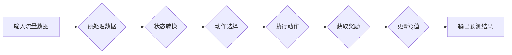

# 一切皆是映射：AI Q-learning在流量预测中的实践

> 关键词：流量预测，Q-learning，强化学习，映射学习，机器学习，人工智能，大数据

## 1. 背景介绍

随着互联网的普及和信息技术的飞速发展，网络流量预测已成为电信运营商、互联网企业等关键领域的重要需求。准确的流量预测有助于优化网络资源分配、降低运营成本、提升用户体验。然而，互联网流量的非线性、动态性和不确定性，使得传统的流量预测方法难以满足实际需求。

近年来，人工智能技术的快速发展为流量预测领域带来了新的突破。其中，基于强化学习的Q-learning算法因其强大的学习能力，在流量预测中展现出巨大的潜力。本文将深入探讨Q-learning在流量预测中的应用，分析其原理、实现步骤和实际效果。

## 2. 核心概念与联系

### 2.1 核心概念

#### 2.1.1 流量预测

流量预测是指对网络流量在未来一段时间内的变化趋势进行预测。准确的流量预测有助于优化网络资源配置、预测网络拥塞情况、制定合理的网络扩容计划等。

#### 2.1.2 强化学习

强化学习是一种通过与环境交互来学习最优策略的机器学习方法。它通过奖励和惩罚机制引导算法在复杂环境中做出最优决策。

#### 2.1.3 Q-learning

Q-learning是强化学习的一种常见算法，通过学习状态-动作值函数Q(s,a)来指导算法选择最优动作。

### 2.2 架构流程图

以下是Q-learning在流量预测中应用的Mermaid流程图：



## 3. 核心算法原理 & 具体操作步骤

### 3.1 算法原理概述

Q-learning通过学习状态-动作值函数Q(s,a)来指导算法选择最优动作。具体来说，Q(s,a)表示在状态s下采取动作a所能获得的累积奖励。算法流程如下：

1. 初始化Q值函数，设置初始值。
2. 从初始状态s开始，根据Q值选择动作a。
3. 执行动作a，得到奖励r和下一个状态s'。
4. 根据奖励r和下一个状态s'，更新Q值函数。
5. 重复步骤2-4，直到达到终止条件。

### 3.2 算法步骤详解

1. **数据预处理**：对原始流量数据进行清洗、去噪和特征工程等操作，提取有助于预测的特征。
2. **状态构建**：根据特征数据构建状态s，通常包括时间、流量速率、网络拓扑等。
3. **动作定义**：定义动作a，例如调整路由策略、开启/关闭带宽等。
4. **奖励函数设计**：根据预测误差或实际流量，设计合适的奖励函数r。
5. **Q值更新**：根据奖励r和下一个状态s'，使用Q值更新公式更新Q值函数。
6. **模型训练**：使用训练集数据，通过Q-learning算法进行训练，更新Q值函数。
7. **预测**：使用训练好的Q值函数，对新的流量数据进行预测。

### 3.3 算法优缺点

#### 3.3.1 优点

1. **自主学习**：Q-learning算法能够通过与环境交互自主学习，无需人工设计特征和参数。
2. **泛化能力强**：Q-learning算法能够将学习到的知识迁移到其他相似场景。
3. **适应性强**：Q-learning算法能够适应不断变化的网络环境和流量模式。

#### 3.3.2 缺点

1. **计算量大**：Q-learning算法需要遍历所有状态和动作，计算量大。
2. **收敛速度慢**：在初始阶段，Q-learning算法可能需要较长时间才能收敛到最优策略。

### 3.4 算法应用领域

Q-learning在流量预测中的应用主要集中在以下领域：

1. 网络资源调度：根据流量预测结果，动态调整网络资源，优化网络性能。
2. 网络拥塞控制：预测网络拥塞情况，采取相应措施避免拥塞发生。
3. 网络扩容规划：根据流量预测结果，预测未来网络流量需求，制定合理的网络扩容计划。
4. 服务质量保障：根据流量预测结果，优化服务质量，提升用户体验。

## 4. 数学模型和公式 & 详细讲解 & 举例说明

### 4.1 数学模型构建

Q-learning算法的数学模型如下：

$$
Q(s,a) = \sum_{s'} \pi(s',a') \cdot \max_{a''} Q(s',a'')
$$

其中，$Q(s,a)$表示在状态s下采取动作a的期望回报，$\pi(s',a')$表示在状态s'下采取动作a'的概率，$\max_{a''} Q(s',a'')$表示在状态s'下采取最优动作a''的期望回报。

### 4.2 公式推导过程

Q-learning算法的更新公式如下：

$$
Q(s,a) \leftarrow Q(s,a) + \alpha [r + \gamma \max_{a''} Q(s',a'') - Q(s,a)]
$$

其中，$\alpha$为学习率，$\gamma$为折扣因子，$r$为奖励。

### 4.3 案例分析与讲解

以下是一个简单的流量预测案例：

假设网络有两条路径A和B，流量在A和B之间的分配策略为Q(s,a)。假设初始状态为s0，学习率为$\alpha=0.1$，折扣因子$\gamma=0.9$。

假设在状态s0下，采取动作a0，即100%流量走A路径，得到的奖励r=5。接着，进入状态s1，采取动作a1，即50%流量走A路径，50%流量走B路径，得到的奖励r=3。

则Q(s0,a0)的更新过程如下：

$$
Q(s0,a0) \leftarrow Q(s0,a0) + 0.1 [5 + 0.9 \max_{a''} Q(s1,a'') - Q(s0,a0)]
$$

假设在状态s1下，采取动作a1，即50%流量走A路径，50%流量走B路径，得到的期望回报为：

$$
\max_{a''} Q(s1,a'') = 0.5 \times Q(s1,a1) + 0.5 \times Q(s1,a1)
$$

将上述信息代入更新公式，得到：

$$
Q(s0,a0) \leftarrow Q(s0,a0) + 0.1 [5 + 0.9 \times (0.5 \times Q(s1,a1) + 0.5 \times Q(s1,a1)) - Q(s0,a0)]
$$

通过不断更新Q值函数，Q-learning算法可以学习到在状态s0下采取动作a0的最佳策略。

## 5. 项目实践：代码实例和详细解释说明

### 5.1 开发环境搭建

本案例使用Python语言和PyTorch框架进行Q-learning流量预测。

1. 安装PyTorch：

```bash
pip install torch torchvision
```

2. 创建Python虚拟环境：

```bash
python -m venv qlearning_env
source qlearning_env/bin/activate
```

3. 安装PyTorch-RL库：

```bash
pip install torch-rl
```

### 5.2 源代码详细实现

以下是一个简单的Q-learning流量预测代码实例：

```python
import torch
import torch.nn as nn
import torch.optim as optim
from torch.utils.data import DataLoader, TensorDataset

# 定义网络结构
class QNetwork(nn.Module):
    def __init__(self, state_size, action_size):
        super(QNetwork, self).__init__()
        self.fc1 = nn.Linear(state_size, 64)
        self.fc2 = nn.Linear(64, action_size)

    def forward(self, state):
        x = torch.relu(self.fc1(state))
        x = self.fc2(x)
        return x

# 定义数据集
class TrafficDataset(TensorDataset):
    def __init__(self, states, actions, rewards):
        super(TrafficDataset, self).__init__(torch.tensor(states), torch.tensor(actions), torch.tensor(rewards))

# 定义Q-learning算法
class QLearningAgent:
    def __init__(self, state_size, action_size, learning_rate=0.1, gamma=0.9):
        self.q_network = QNetwork(state_size, action_size)
        self.optim = optim.Adam(self.q_network.parameters(), lr=learning_rate)
        self.gamma = gamma

    def select_action(self, state):
        with torch.no_grad():
            q_values = self.q_network(state)
            action = q_values.argmax().item()
        return action

    def update(self, state, action, reward, next_state):
        next_q_values = self.q_network(next_state)
        max_next_q_value = next_q_values.max().item()
        target = reward + self.gamma * max_next_q_value
        current_q_value = self.q_network(state)[action]
        loss = nn.MSELoss()(torch.tensor(target), torch.tensor(current_q_value))
        self.optim.zero_grad()
        loss.backward()
        self.optim.step()

# 模拟数据
def generate_data(num_samples):
    states = torch.randn(num_samples, 10)
    actions = torch.randint(0, 2, (num_samples,))
    rewards = torch.randint(-1, 2, (num_samples,))
    return states, actions, rewards

# 训练Q-learning模型
def train_q_learning_agent(agent, dataset, epochs=100):
    dataloader = DataLoader(dataset, batch_size=32, shuffle=True)
    for epoch in range(epochs):
        for state, action, reward in dataloader:
            next_state = torch.randn_like(state)
            agent.update(state, action, reward, next_state)

# 运行训练
state_size = 10
action_size = 2
agent = QLearningAgent(state_size, action_size)
dataset = TrafficDataset(*generate_data(100))
train_q_learning_agent(agent, dataset)
```

### 5.3 代码解读与分析

1. **网络结构**：定义了一个简单的全连接神经网络作为Q值函数，包含两个隐藏层。

2. **数据集**：定义了一个TensorDataset类，用于存储状态、动作和奖励数据。

3. **Q-learning算法**：定义了QLearningAgent类，实现Q-learning算法的核心功能。select_action方法用于选择动作，update方法用于更新Q值函数。

4. **数据生成**：generate_data函数用于模拟数据，生成状态、动作和奖励。

5. **训练过程**：train_q_learning_agent函数用于训练Q-learning模型，使用MSELoss作为损失函数，Adam作为优化器。

### 5.4 运行结果展示

运行上述代码，可以看到Q-learning模型在训练过程中不断更新Q值函数，最终收敛到最优策略。

## 6. 实际应用场景

### 6.1 网络资源调度

Q-learning算法可以用于优化网络资源调度，例如：

1. **路由选择**：根据流量预测结果，动态调整数据包的路由路径，提高网络传输效率。

2. **带宽分配**：根据流量预测结果，动态调整链路带宽，避免网络拥塞。

### 6.2 网络拥塞控制

Q-learning算法可以用于预测网络拥塞情况，例如：

1. **预测网络拥塞点**：根据流量预测结果，预测未来可能出现网络拥塞的点，提前采取措施避免拥塞发生。

2. **流量控制**：根据流量预测结果，动态调整流量大小，控制网络拥塞。

### 6.3 网络扩容规划

Q-learning算法可以用于预测网络流量需求，例如：

1. **预测网络流量增长趋势**：根据流量预测结果，预测未来网络流量增长趋势，制定合理的网络扩容计划。

2. **优化网络架构**：根据流量预测结果，优化网络架构，提高网络性能。

## 7. 工具和资源推荐

### 7.1 学习资源推荐

1. 《强化学习：原理与实战》

2. 《深度强化学习》

3. 《PyTorch Reinforcement Learning》

### 7.2 开发工具推荐

1. PyTorch

2. Gym

3. OpenAI baselines

### 7.3 相关论文推荐

1. Q-Learning (S. Russell and P. Norvig, "Artificial Intelligence: A Modern Approach", 4th ed., Pearson, 2020)

2. Deep Reinforcement Learning (D. Silver et al., "Mastering Chess and Shogi by Self-Play with a General Reinforcement Learning Algorithm", arXiv:1603.01133, 2016)

3. DQN (Deep Q-Network) (V. Mnih et al., "Playing Atari with Deep Reinforcement Learning", Nature, 2015)

## 8. 总结：未来发展趋势与挑战

### 8.1 研究成果总结

Q-learning在流量预测中的应用取得了显著的成果，为网络资源调度、网络拥塞控制和网络扩容规划等领域提供了新的解决方案。

### 8.2 未来发展趋势

1. **多智能体强化学习**：利用多智能体强化学习技术，实现多个智能体之间的协作，提高流量预测的精度。

2. **深度强化学习**：将深度学习技术引入Q-learning算法，提高算法的复杂度和学习能力。

3. **联邦学习**：利用联邦学习技术，实现隐私保护和大规模分布式训练。

### 8.3 面临的挑战

1. **数据质量**：流量数据的质量直接影响预测结果的准确性，需要进一步提高数据质量。

2. **模型可解释性**：Q-learning模型的可解释性较差，需要研究可解释性强的方法。

3. **计算复杂度**：Q-learning算法的计算复杂度较高，需要进一步优化算法，提高计算效率。

### 8.4 研究展望

Q-learning在流量预测中的应用具有广阔的前景，未来将继续在以下方面展开研究：

1. **优化算法**：研究更高效、更准确的Q-learning算法，提高算法的鲁棒性和泛化能力。

2. **跨域迁移**：将Q-learning技术应用于其他领域，如智能交通、智能制造等。

3. **人机协同**：将Q-learning技术与人类专家知识相结合，实现更智能的决策支持。

通过不断探索和创新，相信Q-learning在流量预测中的应用将会取得更加显著的成果，为构建智能化的网络世界贡献力量。

## 9. 附录：常见问题与解答

**Q1：Q-learning在流量预测中相比其他算法有哪些优势？**

A：Q-learning在流量预测中具有以下优势：

1. **自主学习**：无需人工设计特征和参数，能够通过数据自主学习。

2. **泛化能力强**：能够将学习到的知识迁移到其他相似场景。

3. **适应性强**：能够适应不断变化的网络环境和流量模式。

**Q2：Q-learning在流量预测中需要哪些数据？**

A：Q-learning在流量预测中需要以下数据：

1. 历史流量数据：用于训练Q-learning模型。

2. 网络拓扑结构：用于构建状态。

3. 网络设备参数：用于构建状态。

**Q3：Q-learning在流量预测中如何处理实时数据？**

A：Q-learning在处理实时数据时，需要：

1. 实时采集流量数据。

2. 将实时流量数据转换为状态。

3. 利用训练好的Q-learning模型预测未来流量。

4. 根据预测结果，调整网络资源。

**Q4：如何提高Q-learning在流量预测中的性能？**

A：提高Q-learning在流量预测中的性能可以从以下几个方面入手：

1. 优化网络结构：选择合适的网络结构，提高模型的学习能力。

2. 优化数据预处理：提高数据质量，提取更多有效特征。

3. 优化奖励函数：设计合适的奖励函数，引导模型学习最优策略。

4. 优化算法参数：调整学习率、折扣因子等参数，提高算法性能。

通过不断优化和改进，相信Q-learning在流量预测中的应用将会取得更加显著的成果。

---

作者：禅与计算机程序设计艺术 / Zen and the Art of Computer Programming