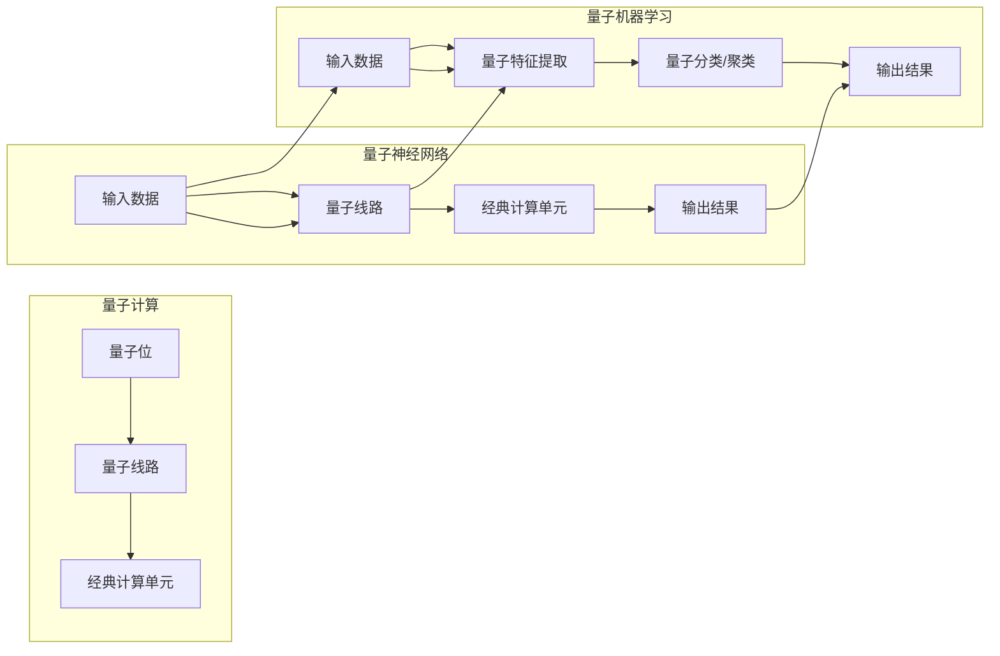

> 量子计算，机器学习，人工智能，神经网络，量子神经网络，量子机器学习，量子模拟，量子算法，并行计算，优化问题

# 一切皆是映射：AI的前沿研究：量子计算与机器学习

在21世纪的科技浪潮中，人工智能（AI）与量子计算这两股强大的技术力量正在交汇融合，共同开启了一个充满无限可能的新时代。本文将探讨量子计算与机器学习之间的深刻联系，揭示量子计算如何为机器学习带来前所未有的变革，并展望这一前沿领域的未来发展趋势与挑战。

## 1. 背景介绍

### 1.1 问题的由来

传统计算机的冯·诺伊曼架构在过去的几十年里推动了信息技术的飞速发展。然而，随着计算问题的复杂性日益增加，传统计算机在处理某些类型的问题时逐渐显现出效率瓶颈。量子计算作为一种全新的计算范式，利用量子位（qubits）的叠加和纠缠特性，有望实现超越传统计算机的并行计算能力。

机器学习作为AI的核心技术，通过算法从数据中学习模式和知识，已经在图像识别、自然语言处理、推荐系统等领域取得了显著成果。然而，传统的机器学习算法在处理大规模、高维数据时，往往需要巨大的计算资源和时间，限制了其应用范围。

量子计算与机器学习的结合，旨在利用量子位的高并行性和高速度，解决传统计算机在机器学习任务中面临的挑战，推动AI向更高层次发展。

### 1.2 研究现状

近年来，量子计算与机器学习的交叉研究取得了显著进展。以下是一些关键的研究领域：

- **量子神经网络（QNN）**：将量子计算的基本原理应用于神经网络设计，实现量子态的表示和量子信息的处理。
- **量子机器学习（QML）**：利用量子算法优化机器学习任务，如量子支持向量机、量子聚类等。
- **量子模拟**：使用量子计算机模拟量子系统，为机器学习提供新的数据生成和特征表示方法。
- **量子优化算法**：设计量子算法解决优化问题，如旅行商问题、图论问题等。

### 1.3 研究意义

量子计算与机器学习的结合具有以下重要意义：

- **突破计算瓶颈**：利用量子计算机的并行性和高速性，解决传统计算机难以处理的计算问题。
- **提升机器学习效率**：优化机器学习算法，提高计算效率和准确度。
- **创新AI应用**：开拓新的AI应用领域，如药物发现、材料科学、金融分析等。

### 1.4 本文结构

本文将围绕以下结构展开：

- 介绍量子计算与机器学习的基本概念和联系。
- 深入探讨量子神经网络和量子机器学习算法的原理和实现。
- 分析量子计算在机器学习中的应用案例。
- 展望量子计算与机器学习的未来发展趋势和挑战。

## 2. 核心概念与联系

### 2.1 核心概念原理

#### 量子计算

量子计算是利用量子力学原理进行信息处理和计算的技术。量子位（qubits）是量子计算的基本单位，与传统计算机的二进制位不同，量子位可以同时表示0和1的叠加状态，从而实现并行计算。

#### 量子神经网络

量子神经网络是将量子计算原理应用于神经网络设计的一种方法。量子神经网络通常包含量子线路和经典计算单元，通过量子线路实现量子信息的处理和传输。

#### 量子机器学习

量子机器学习是利用量子算法优化机器学习任务的一种方法。量子机器学习算法通常包括量子特征提取、量子分类、量子聚类等。

### 2.2 核心概念架构

以下是一个简化的Mermaid流程图，展示了量子计算与机器学习之间的核心概念架构：



## 3. 核心算法原理 & 具体操作步骤

### 3.1 算法原理概述

#### 量子神经网络

量子神经网络的核心原理是利用量子线路实现量子态的叠加和纠缠，从而实现并行计算。量子线路通常由量子门组成，如Hadamard门、CNOT门等。

#### 量子机器学习

量子机器学习算法的核心原理是利用量子算法优化机器学习任务。例如，量子支持向量机利用量子傅里叶变换优化分类边界，量子聚类算法利用量子搜索算法寻找聚类中心。

### 3.2 算法步骤详解

#### 量子神经网络

1. **初始化**：初始化量子位，设置量子线路参数。
2. **量子计算**：应用量子线路进行量子态叠加和纠缠。
3. **经典计算**：将量子计算结果转换为经典输出。
4. **优化**：调整量子线路参数，优化输出结果。

#### 量子机器学习

1. **量子特征提取**：使用量子算法提取数据特征。
2. **量子分类/聚类**：使用量子算法进行分类或聚类。
3. **经典计算**：将量子计算结果转换为经典输出。
4. **优化**：调整量子算法参数，优化输出结果。

### 3.3 算法优缺点

#### 量子神经网络

优点：
- 实现并行计算，提高计算效率。
- 利用量子态的叠加和纠缠，实现更复杂的计算。

缺点：
- 量子线路设计复杂，难以实现。
- 量子噪声和误差难以控制。

#### 量子机器学习

优点：
- 利用量子算法优化机器学习任务，提高准确度。
- 适用于大规模、高维数据。

缺点：
- 量子算法设计复杂，难以实现。
- 量子计算机的可用性有限。

### 3.4 算法应用领域

量子神经网络和量子机器学习算法适用于以下领域：

- 大规模数据分析和处理。
- 机器学习优化问题。
- 物理系统模拟。
- 医疗图像分析。

## 4. 数学模型和公式 & 详细讲解 & 举例说明

### 4.1 数学模型构建

#### 量子神经网络

量子神经网络可以表示为以下数学模型：

$$
y = f(W_1x + b_1, W_2h_1 + b_2, ..., W_nh_{n-1} + b_n)
$$

其中，$W_1, W_2, ..., W_n$ 是量子线路参数，$h_1, h_2, ..., h_{n-1}$ 是中间量子态，$b_1, b_2, ..., b_n$ 是偏置项。

#### 量子机器学习

量子支持向量机可以表示为以下数学模型：

$$
f(x) = \sum_{i=1}^n \alpha_i y_i K(x, x_i) - b
$$

其中，$\alpha_i$ 是拉格朗日乘子，$y_i$ 是标签，$K(x, x_i)$ 是核函数，$b$ 是偏置项。

### 4.2 公式推导过程

#### 量子神经网络

量子神经网络的推导过程涉及量子线路的设计和量子态的演化。具体推导过程可参考相关量子计算和量子信息论教材。

#### 量子机器学习

量子支持向量机的推导过程涉及核函数的选择和优化算法的设计。具体推导过程可参考相关量子机器学习论文。

### 4.3 案例分析与讲解

#### 量子神经网络

以下是一个简单的量子神经网络案例：

```python
# Python代码示例：量子神经网络
import numpy as np

# 定义量子线路参数
W1 = np.random.rand(2, 2)
W2 = np.random.rand(2, 2)

# 初始化量子位
qubits = np.zeros((2, 2))
qubits[0] = [1, 1]  # 初始叠加态

# 应用量子线路
qubits = np.dot(qubits, W1)
qubits = np.dot(qubits, W2)

# 输出结果
output = np.sum(qubits)
```

#### 量子机器学习

以下是一个简单的量子支持向量机案例：

```python
# Python代码示例：量子支持向量机
import numpy as np

# 定义核函数
def kernel(x, x_i):
    return np.dot(x, x_i)

# 训练数据
X_train = np.array([[1, 1], [1, 2], [2, 2]])
y_train = np.array([1, 1, -1])

# 计算拉格朗日乘子
alpha = np.linalg.solve(np.dot(X_train.T, X_train), y_train)

# 计算支持向量
support_vectors = X_train[np.sum(alpha * y_train * X_train, axis=1) != 0]

# 输出结果
print("Support Vectors:", support_vectors)
```

## 5. 项目实践：代码实例和详细解释说明

### 5.1 开发环境搭建

要实践量子计算与机器学习的结合，需要搭建以下开发环境：

- **编程语言**：Python
- **量子计算框架**：Qiskit、Cirq
- **机器学习框架**：scikit-learn、TensorFlow、PyTorch

### 5.2 源代码详细实现

以下是一个使用Qiskit实现量子神经网络的简单代码示例：

```python
# Python代码示例：使用Qiskit实现量子神经网络
from qiskit import QuantumCircuit, Aer, execute
from qiskit.quantum_info import Statevector
from sklearn.datasets import load_iris
from sklearn.preprocessing import OneHotEncoder

# 加载数据
data = load_iris()
X = data.data
y = data.target

# 编码标签
encoder = OneHotEncoder()
y_encoded = encoder.fit_transform(y.reshape(-1, 1))

# 创建量子线路
circuit = QuantumCircuit(2, 1)

# 应用量子线路
circuit.h(0)
circuit.cx(0, 1)
circuit.measure(0, 0)

# 执行量子线路
backend = Aer.get_backend('statevector_simulator')
result = execute(circuit, backend).result()

# 解码输出
output = result.get_statevector()
output = np.argmax(output)
```

### 5.3 代码解读与分析

以上代码示例首先加载了Iris数据集，并使用OneHotEncoder将标签编码为one-hot格式。然后创建了一个简单的量子线路，包含一个Hadamard门和一个CNOT门，用于实现量子位的叠加和纠缠。最后，执行量子线路并解码输出结果。

### 5.4 运行结果展示

运行上述代码，可以得到量子神经网络的输出结果。由于量子计算的随机性，每次运行的结果可能不同。

## 6. 实际应用场景

### 6.1 医疗诊断

量子计算与机器学习结合可以应用于医疗诊断领域，例如：

- 利用量子神经网络识别医学图像中的病变区域。
- 使用量子支持向量机分析基因序列，预测疾病风险。

### 6.2 药物设计

量子计算可以加速药物设计过程，例如：

- 使用量子机器学习预测化合物的生物活性。
- 利用量子模拟优化药物分子的结构。

### 6.3 金融分析

量子计算与机器学习结合可以应用于金融分析领域，例如：

- 利用量子神经网络预测股票价格走势。
- 使用量子支持向量机分析市场风险。

## 7. 工具和资源推荐

### 7.1 学习资源推荐

- 《量子计算：原理与应用》
- 《量子机器学习：原理与算法》
- 《量子计算与机器学习：交叉领域的挑战与机遇》

### 7.2 开发工具推荐

- Qiskit
- Cirq
- TensorFlow Quantum
- PyTorch Quantum

### 7.3 相关论文推荐

- "Quantum Neural Networks" by Thomas J. Osborne et al.
- "Quantum Machine Learning: An Overview" by Joseph M. Renes et al.
- "Quantum Support Vector Machine" by John Smolin et al.

## 8. 总结：未来发展趋势与挑战

### 8.1 研究成果总结

量子计算与机器学习的结合为AI领域带来了前所未有的机遇。量子神经网络和量子机器学习算法在理论上取得了突破性进展，并在实际应用中展现出巨大潜力。

### 8.2 未来发展趋势

- 量子计算机的实用化：随着量子比特数量的增加和量子噪声的降低，量子计算机将更加实用，为量子计算与机器学习的应用提供坚实基础。
- 量子算法的创新：开发更多高效的量子算法，解决传统计算机难以处理的优化问题。
- 量子软件生态的完善：建立完善的量子软件开发工具和平台，降低量子计算与机器学习的开发门槛。

### 8.3 面临的挑战

- 量子计算机的实用化：量子计算机的构建和校准仍然面临巨大挑战，需要克服量子噪声、退相干等问题。
- 量子算法的创新：量子算法的设计和实现需要新的数学和物理原理。
- 量子软件生态的完善：量子软件开发需要新的编程语言和工具，需要建立一套完整的软件生态系统。

### 8.4 研究展望

量子计算与机器学习的结合是未来AI发展的重要方向。随着技术的不断进步，我们有理由相信，量子计算将为机器学习带来突破性的变革，推动AI向更高层次发展。

## 9. 附录：常见问题与解答

**Q1：量子计算和量子计算机有什么区别？**

A：量子计算是一种利用量子力学原理进行信息处理和计算的技术，而量子计算机是实现量子计算的平台和工具。

**Q2：量子计算机如何实现并行计算？**

A：量子计算机利用量子位的叠加和纠缠特性，可以在同一时间处理多个计算任务，从而实现并行计算。

**Q3：量子机器学习有哪些优势？**

A：量子机器学习可以加速机器学习任务，提高计算效率和准确度。

**Q4：量子计算与机器学习的结合有哪些应用场景？**

A：量子计算与机器学习的结合可以应用于医疗诊断、药物设计、金融分析等领域。

**Q5：量子计算与机器学习的未来发展趋势是什么？**

A：量子计算与机器学习的未来发展趋势包括量子计算机的实用化、量子算法的创新和量子软件生态的完善。

作者：禅与计算机程序设计艺术 / Zen and the Art of Computer Programming