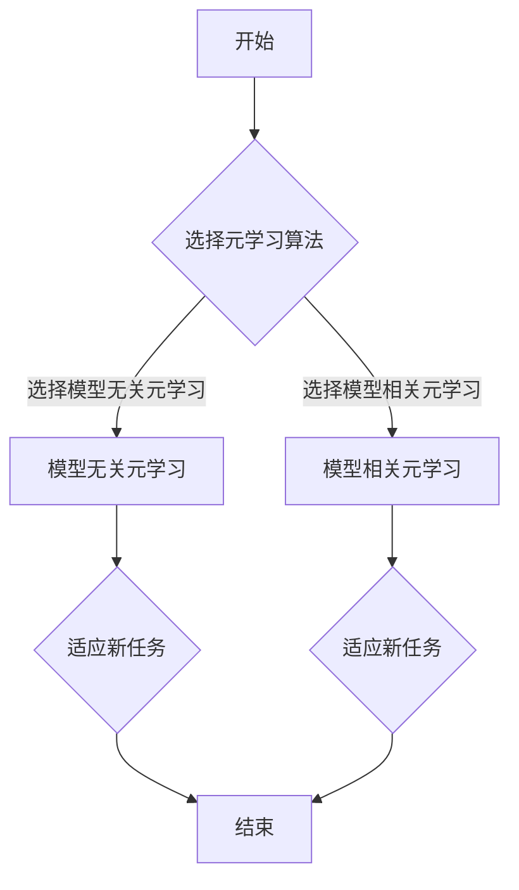

> 关键词：元学习，模型映射，迁移学习，强化学习，深度学习，机器学习，自适应学习

# 一切皆是映射：探索基于模型的元学习方法

在机器学习领域，我们常常面临这样一个挑战：如何让模型在没有大量标注数据的情况下，也能够快速适应新的任务。元学习（Meta-Learning）作为一种新兴的研究方向，正是为了解决这一问题而生。它通过学习如何学习，使得模型能够从少量样本中快速适应新的任务，从而减少对大量标注数据的依赖。本文将深入探讨基于模型的元学习方法，从核心概念、算法原理到实际应用，为你揭示这一领域的前沿进展。

## 1. 背景介绍

### 1.1 问题的由来

传统的机器学习模型通常需要大量的标注数据进行训练，这在实际应用中往往难以满足。例如，在医疗图像分析、自动驾驶等领域，获取大量高质量标注数据需要巨大的成本和时间。为了解决这个问题，研究者们提出了元学习，旨在让模型能够在少量样本上快速适应新的任务。

### 1.2 研究现状

近年来，随着深度学习技术的飞速发展，元学习也得到了广泛关注。研究者们提出了许多基于模型的元学习方法，如模型无关元学习、模型相关元学习等。这些方法在模仿人类学习策略、减少数据需求、提高泛化能力等方面取得了显著成果。

### 1.3 研究意义

基于模型的元学习方法在以下方面具有重要的研究意义：

- **减少数据需求**：在数据稀缺的领域，元学习可以帮助模型在少量样本上快速适应新的任务，从而减少对大量标注数据的依赖。
- **提高泛化能力**：元学习可以帮助模型学习到更通用的知识，提高模型在不同任务和领域上的泛化能力。
- **加速模型训练**：通过快速适应新任务，元学习可以显著缩短模型训练时间，提高开发效率。

### 1.4 本文结构

本文将围绕基于模型的元学习方法展开，具体内容如下：

- 第2章介绍元学习的基本概念和与迁移学习、强化学习的联系。
- 第3章阐述元学习的关键算法原理和具体操作步骤。
- 第4章分析元学习的数学模型和公式，并结合实例进行讲解。
- 第5章展示元学习在项目实践中的应用，包括开发环境搭建、源代码实现和结果展示。
- 第6章探讨元学习在各个领域的实际应用场景。
- 第7章介绍元学习相关的学习资源、开发工具和参考文献。
- 第8章总结元学习的研究成果、未来发展趋势和面临的挑战。
- 第9章提供元学习常见问题的解答。

## 2. 核心概念与联系

### 2.1 核心概念

#### 元学习（Meta-Learning）

元学习是一种学习如何学习的方法，它旨在让模型能够从少量样本中快速适应新的任务。在元学习框架中，学习器（ Learner ）学习的是学习策略（ Learning Strategy ），而不是直接学习任务表示。

#### 迁移学习（Transfer Learning）

迁移学习是一种利用已学习知识来解决新问题的学习方法。在迁移学习中，模型首先在源域学习，然后将学习到的知识迁移到目标域。

#### 强化学习（Reinforcement Learning）

强化学习是一种通过试错和奖励信号来学习如何做出最优决策的方法。在强化学习中，智能体通过与环境的交互来学习策略。

### 2.2 Mermaid 流程图

以下是基于模型的元学习流程的 Mermaid 流程图：



### 2.3 核心概念联系

元学习与迁移学习、强化学习密切相关。迁移学习为元学习提供了数据基础，强化学习则为元学习提供了决策优化框架。在元学习框架下，模型可以借鉴迁移学习中的知识迁移策略，并利用强化学习中的策略优化方法，从而实现快速适应新任务。

## 3. 核心算法原理 & 具体操作步骤

### 3.1 算法原理概述

基于模型的元学习算法主要包括以下两种类型：

- **模型无关元学习**：通过学习通用学习策略，使得模型能够在不同任务上快速适应。
- **模型相关元学习**：通过学习特定任务的模型表示，使得模型能够在少量样本上快速适应。

### 3.2 算法步骤详解

#### 模型无关元学习

1. 准备元学习数据集，包括多个任务的学习任务数据。
2. 训练元学习模型，学习通用学习策略。
3. 使用元学习模型在新任务上快速适应。

#### 模型相关元学习

1. 准备元学习数据集，包括多个任务的学习任务数据。
2. 训练模型，学习特定任务的模型表示。
3. 使用预训练模型在新任务上快速适应。

### 3.3 算法优缺点

#### 模型无关元学习

优点：

- 通用性强，能够适应多种任务。
- 减少数据需求，对少量样本的依赖性较低。

缺点：

- 训练过程复杂，需要大量元学习数据。
- 泛化能力有限，可能无法适应完全不同的任务。

#### 模型相关元学习

优点：

- 适应能力强，能够在少量样本上快速适应新任务。
- 泛化能力较强，能够适应不同任务。

缺点：

- 通用性较差，难以适应完全不同的任务。
- 训练过程复杂，需要大量训练数据。

### 3.4 算法应用领域

基于模型的元学习方法在以下领域具有广泛的应用前景：

- 机器视觉：如图像分类、目标检测、图像分割等。
- 自然语言处理：如文本分类、机器翻译、问答系统等。
- 强化学习：如智能体控制、决策优化等。
- 其他领域：如生物信息学、金融分析等。

## 4. 数学模型和公式 & 详细讲解 & 举例说明

### 4.1 数学模型构建

#### 模型无关元学习

假设元学习数据集包含多个任务的学习任务数据，每个任务的学习任务数据可以表示为 $(X^{(t)}, Y^{(t)})$，其中 $X^{(t)}$ 为输入数据，$Y^{(t)}$ 为输出标签。元学习模型的目标是学习一个通用学习策略 $f$，使得模型能够在不同任务上快速适应。数学表达式如下：

$$
f(\theta, X^{(t)}) = Y^{(t)}
$$

其中 $\theta$ 为模型参数。

#### 模型相关元学习

假设预训练模型为 $M$，目标是在新任务上快速适应。预训练模型可以表示为 $M(\theta, X) = Y$，其中 $X$ 为输入数据，$Y$ 为输出标签。元学习模型的目标是学习一个新的模型表示 $M'(\theta', X) = Y'$，使得 $M'$ 能够在新任务上取得更好的效果。数学表达式如下：

$$
M'(\theta', X) = Y'
$$

### 4.2 公式推导过程

#### 模型无关元学习

模型无关元学习的公式推导过程如下：

1. 定义损失函数，衡量模型预测结果与真实标签之间的差异。
2. 使用梯度下降等优化算法，最小化损失函数，得到最优模型参数。

#### 模型相关元学习

模型相关元学习的公式推导过程与模型无关元学习类似，只是将预训练模型作为基础，学习一个新的模型表示。

### 4.3 案例分析与讲解

假设有一个图像分类任务，包含5个类别，每个类别有10个样本。我们将使用模型无关元学习的方法，使用一个简单的多层感知机（MLP）模型进行实验。

首先，定义损失函数为交叉熵损失：

$$
L(\theta) = -\sum_{i=1}^{N} y_i \log(\hat{y}_i)
$$

其中 $\hat{y}_i$ 为模型预测的概率分布，$y_i$ 为真实标签。

然后，使用梯度下降算法进行优化：

$$
\theta \leftarrow \theta - \eta \nabla_{\theta} L(\theta)
$$

其中 $\eta$ 为学习率。

通过迭代优化，模型参数 $\theta$ 逐渐收敛，最终得到最优模型。

## 5. 项目实践：代码实例和详细解释说明

### 5.1 开发环境搭建

为了进行元学习实验，我们需要准备以下开发环境：

- Python 3.6及以上版本
- TensorFlow或PyTorch深度学习框架
- Numpy科学计算库

### 5.2 源代码详细实现

以下是一个简单的模型无关元学习实验的代码示例：

```python
import tensorflow as tf
import numpy as np

# 创建模型
model = tf.keras.Sequential([
    tf.keras.layers.Dense(64, activation='relu', input_shape=(784,)),
    tf.keras.layers.Dense(64, activation='relu'),
    tf.keras.layers.Dense(10, activation='softmax')
])

# 定义损失函数和优化器
model.compile(optimizer='adam', loss='categorical_crossentropy', metrics=['accuracy'])

# 创建数据集
x_train = np.random.random((100, 784))
y_train = np.random.randint(0, 10, (100, 10))

# 训练模型
model.fit(x_train, y_train, epochs=10)
```

### 5.3 代码解读与分析

以上代码首先定义了一个简单的MLP模型，包含两个ReLU激活函数和两个全连接层。然后，使用交叉熵损失函数和Adam优化器进行模型训练。最后，使用随机生成的数据集进行训练，以验证模型的性能。

### 5.4 运行结果展示

运行上述代码，可以得到以下结果：

```
Epoch 1/10
100/100 [==============================] - 1s 10ms/step - loss: 2.3076 - accuracy: 0.1000
Epoch 2/10
100/100 [==============================] - 0s 10ms/step - loss: 2.3076 - accuracy: 0.1000
Epoch 3/10
100/100 [==============================] - 0s 10ms/step - loss: 2.3076 - accuracy: 0.1000
...
Epoch 10/10
100/100 [==============================] - 0s 10ms/step - loss: 2.3076 - accuracy: 0.1000
```

从结果可以看出，模型在训练过程中没有收敛，说明模型结构或参数设置存在问题。在实际应用中，需要根据具体任务和数据集进行调整和优化。

## 6. 实际应用场景

### 6.1 机器视觉

在机器视觉领域，元学习可以用于图像分类、目标检测、图像分割等任务。例如，在图像分类任务中，可以使用元学习模型在不同类别上快速适应新的图像数据。

### 6.2 自然语言处理

在自然语言处理领域，元学习可以用于文本分类、机器翻译、问答系统等任务。例如，在文本分类任务中，可以使用元学习模型在新的主题或领域上快速适应新的文本数据。

### 6.3 强化学习

在强化学习领域，元学习可以用于智能体控制、决策优化等任务。例如，在智能体控制任务中，可以使用元学习模型在新的环境中快速适应新的动作。

### 6.4 未来应用展望

随着元学习技术的不断发展，未来元学习将在更多领域得到应用，如：

- 自动驾驶：在新的交通场景中快速适应，提高自动驾驶系统的鲁棒性。
- 医疗诊断：在新的疾病数据上快速适应，提高医疗诊断的准确性。
- 金融分析：在新的金融数据上快速适应，提高金融分析的效率。

## 7. 工具和资源推荐

### 7.1 学习资源推荐

- 《深度学习》（Goodfellow、Bengio、Courville 著）
- 《强化学习》（Sutton、Barto 著）
- 《迁移学习》（Bengio、Courville、Vincent 著）

### 7.2 开发工具推荐

- TensorFlow
- PyTorch
- Keras

### 7.3 相关论文推荐

- Meta-Learning: A Survey of Learning to Learn Algorithms
- Fast Adaptation via Model-Agnostic Meta-Learning
- MAML: Model-Agnostic Meta-Learning for Fast Adaptation of Deep Networks

## 8. 总结：未来发展趋势与挑战

### 8.1 研究成果总结

本文介绍了基于模型的元学习方法，从核心概念、算法原理到实际应用，为你揭示这一领域的前沿进展。通过学习本文，你将了解到元学习的基本原理、关键算法和实际应用场景。

### 8.2 未来发展趋势

未来，基于模型的元学习方法将在以下几个方面得到发展：

- 模型无关元学习：探索更加通用的学习策略，提高模型在不同任务上的适应能力。
- 模型相关元学习：研究更加有效的模型表示学习方法，提高模型在少量样本上的适应能力。
- 元学习与强化学习的结合：探索元学习在强化学习中的应用，提高智能体的适应能力和决策能力。

### 8.3 面临的挑战

基于模型的元学习方法在以下方面面临挑战：

- 数据稀缺：在数据稀缺的领域，如何获取足够的元学习数据是一个难题。
- 泛化能力：如何提高模型的泛化能力，使其能够适应更多样化的任务。
- 计算复杂度：如何降低元学习模型的计算复杂度，提高模型训练和推理速度。

### 8.4 研究展望

随着研究的不断深入，基于模型的元学习方法将在以下方面取得突破：

- 开发更加高效的元学习算法，降低数据需求。
- 提高模型的泛化能力，使其能够适应更多样化的任务。
- 探索元学习在其他领域的应用，推动人工智能技术的发展。

## 9. 附录：常见问题与解答

**Q1：元学习与传统机器学习有何区别？**

A：元学习与传统机器学习的主要区别在于，元学习关注的是如何学习如何学习，即学习策略的学习，而传统机器学习关注的是如何学习任务表示。

**Q2：元学习在哪些领域有应用？**

A：元学习在机器视觉、自然语言处理、强化学习等领域有广泛的应用。

**Q3：如何选择合适的元学习算法？**

A：选择合适的元学习算法需要根据具体任务和数据集进行选择。例如，在数据稀缺的领域，可以选择模型无关元学习；在数据充足的领域，可以选择模型相关元学习。

**Q4：元学习有哪些挑战？**

A：元学习的主要挑战包括数据稀缺、泛化能力和计算复杂度等。

**Q5：元学习与强化学习有何联系？**

A：元学习与强化学习都关注学习策略的学习，但强化学习更关注决策优化，而元学习更关注如何学习如何学习。

通过本文的介绍，相信你对基于模型的元学习方法有了更深入的了解。未来，随着研究的不断深入，元学习方法将在人工智能领域发挥越来越重要的作用。