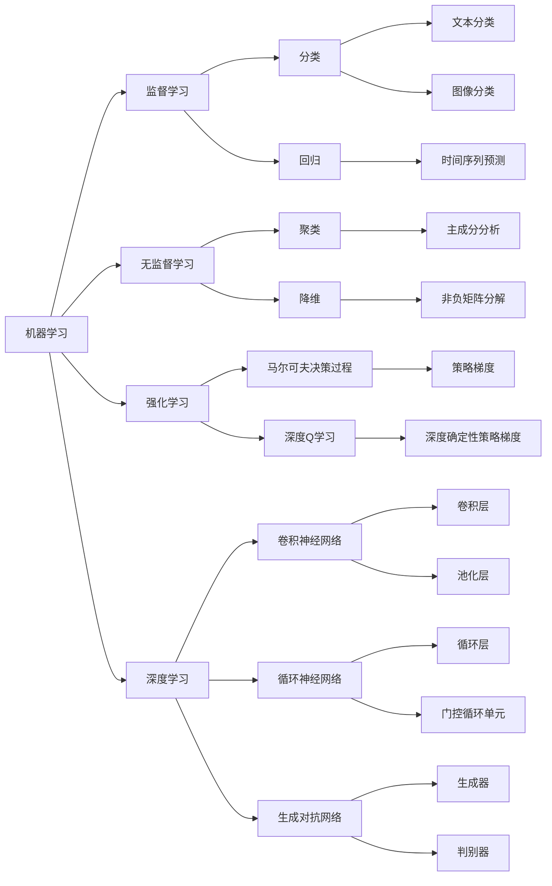

# 人工智能领域的早期探索

> 关键词：人工智能，机器学习，深度学习，图灵测试，专家系统，逻辑编程，知识表示

## 1. 背景介绍

自20世纪中叶以来，人工智能（Artificial Intelligence, AI）领域经历了从梦想到现实的漫长旅程。早期探索是这一旅程中最关键的阶段，它为后续的快速发展奠定了坚实的基础。本文将回顾人工智能领域的早期探索，探讨其核心概念、关键技术以及重要事件。

### 1.1 问题的由来

人工智能的概念最早可以追溯到古希腊哲学家苏格拉底和柏拉图对人类智能本质的思考。然而，作为一门独立的学科，人工智能的诞生要归功于20世纪中叶的计算技术的飞速发展。随着计算机的出现，人们开始尝试让机器模拟人类的智能行为，从而诞生了人工智能这一新兴领域。

### 1.2 研究现状

人工智能领域的研究经历了多次高潮和低谷，从早期的符号主义到连接主义，再到如今的深度学习时代，每一次的技术革新都推动了人工智能领域的进步。如今，人工智能已经广泛应用于各个领域，从简单的语音识别到复杂的自动驾驶，都离不开人工智能技术的支持。

### 1.3 研究意义

回顾人工智能领域的早期探索，不仅能够帮助我们理解人工智能技术的起源和发展脉络，还能够启发我们思考人工智能的未来发展方向。通过学习早期的研究成果，我们可以更好地把握人工智能技术的基本原理和核心思想，为未来的创新提供灵感。

### 1.4 本文结构

本文将按照以下结构展开：
- 第2部分，介绍人工智能领域的核心概念与联系。
- 第3部分，详细阐述早期探索中的核心算法原理和具体操作步骤。
- 第4部分，讲解人工智能领域的数学模型和公式，并结合实例进行分析。
- 第5部分，展示早期探索中的项目实践，包括代码实例和详细解释。
- 第6部分，探讨人工智能技术的实际应用场景和未来应用展望。
- 第7部分，推荐相关学习资源、开发工具和论文。
- 第8部分，总结研究成果，展望未来发展趋势和挑战。
- 第9部分，提供常见问题的解答。

## 2. 核心概念与联系

### 2.1 核心概念

#### 2.1.1 机器学习

机器学习（Machine Learning, ML）是人工智能领域的一个重要分支，它研究如何让计算机从数据中学习规律，并自动做出决策或预测。机器学习可以分为监督学习、无监督学习和强化学习三种类型。

- **监督学习**：通过学习带有标签的数据，让模型学会将新的、未见过的数据分类到正确的类别中。
- **无监督学习**：通过对无标签数据进行处理，寻找数据中的结构和规律。
- **强化学习**：通过与环境交互，使模型学会在给定环境中做出最优决策。

#### 2.1.2 深度学习

深度学习（Deep Learning, DL）是机器学习的一种，它通过多层神经网络模拟人脑处理信息的方式，从而实现对数据的特征提取和模式识别。深度学习在图像识别、语音识别等领域取得了突破性的进展。

#### 2.1.3 图灵测试

图灵测试（Turing Test）是由英国数学家和逻辑学家艾伦·图灵提出的，用于判断机器是否具有智能的一种方法。如果一个机器能够在与人类进行对话时，无法被人类区分出来，那么我们就认为这个机器具有智能。

#### 2.1.4 专家系统

专家系统（Expert System）是一种模拟人类专家决策能力的计算机程序。它通过将领域专家的知识和经验转化为计算机程序，实现对复杂问题的自动诊断和处理。

#### 2.1.5 逻辑编程

逻辑编程（Logic Programming）是一种基于逻辑的编程范式。在逻辑编程中，程序由一系列逻辑规则组成，计算机通过演绎推理来执行程序。

#### 2.1.6 知识表示

知识表示（Knowledge Representation）是人工智能领域的一个重要问题，它研究如何将知识以计算机可理解的形式表示出来。

### 2.2 Mermaid 流程图



## 3. 核心算法原理 & 具体操作步骤

### 3.1 算法原理概述

早期人工智能领域的研究主要集中在符号主义和连接主义两种范式上。

#### 3.1.1 符号主义

符号主义认为，智能的本质是逻辑推理，因此可以通过编程实现推理规则，让计算机模拟人类的智能行为。典型的符号主义算法包括：

- **逻辑编程**：通过逻辑规则进行推理，实现问题的求解。
- **专家系统**：模拟专家的决策过程，实现对复杂问题的诊断和处理。

#### 3.1.2 连接主义

连接主义认为，智能的本质是神经元之间的连接，通过模拟人脑的神经网络结构，可以实现智能行为。典型的连接主义算法包括：

- **人工神经网络**：模拟人脑神经元之间的连接，实现特征提取和模式识别。
- **深度学习**：通过多层神经网络，实现对数据的深度特征提取。

### 3.2 算法步骤详解

#### 3.2.1 逻辑编程

逻辑编程通常包括以下几个步骤：

1. 定义逻辑程序的结构，包括事实和规则。
2. 将问题转化为逻辑查询，如使用SQL查询语言。
3. 使用演绎推理，根据规则和事实求解问题。

#### 3.2.2 专家系统

专家系统通常包括以下几个步骤：

1. 收集领域专家的知识，建立知识库。
2. 定义推理规则，将知识库中的知识转化为推理规则。
3. 通过推理规则对输入问题进行诊断和处理。

### 3.3 算法优缺点

#### 3.3.1 符号主义

优点：
- 理论基础扎实，逻辑清晰。
- 可解释性强，易于理解。

缺点：
- 难以处理复杂问题。
- 知识获取困难。

#### 3.3.2 连接主义

优点：
- 能够处理复杂问题。
- 自适应性强，能够从数据中学习。

缺点：
- 理论基础不够完善。
- 可解释性差。

### 3.4 算法应用领域

#### 3.4.1 符号主义

- 逻辑编程：数据库查询、知识库系统。
- 专家系统：医疗诊断、故障诊断。

#### 3.4.2 连接主义

- 人工神经网络：图像识别、语音识别。
- 深度学习：自然语言处理、自动驾驶。

## 4. 数学模型和公式 & 详细讲解 & 举例说明

### 4.1 数学模型构建

早期人工智能领域的数学模型主要包括逻辑模型、概率模型和统计模型。

#### 4.1.1 逻辑模型

逻辑模型主要基于逻辑推理，常用的模型包括：

- **谓词逻辑**：用于表达事实和规则。
- **一阶逻辑**：扩展了谓词逻辑，可以表达更复杂的事实和规则。

#### 4.1.2 概率模型

概率模型主要基于概率论，常用的模型包括：

- **贝叶斯网络**：用于表示变量之间的概率依赖关系。
- **马尔可夫决策过程**：用于描述决策过程中的不确定性。

#### 4.1.3 统计模型

统计模型主要基于统计学，常用的模型包括：

- **线性回归**：用于预测连续变量。
- **逻辑回归**：用于预测离散变量。

### 4.2 公式推导过程

#### 4.2.1 谓词逻辑公式

谓词逻辑公式通常由原子公式、逻辑连接词和量词组成。以下是一个简单的例子：

$$
\forall x(P(x) \rightarrow Q(x))
$$

这个公式表示对于所有x，如果P(x)为真，则Q(x)也为真。

#### 4.2.2 贝叶斯网络公式

贝叶斯网络是一种概率模型，它可以表示变量之间的条件概率关系。以下是一个简单的贝叶斯网络公式：

$$
P(X,Y|Z) = P(X|Z) \times P(Y|Z)
$$

这个公式表示在Z已知的情况下，X和Y的条件概率等于X在Z条件下的概率乘以Y在Z条件下的概率。

### 4.3 案例分析与讲解

#### 4.3.1 专家系统

以下是一个简单的专家系统案例，用于诊断计算机故障：

```
知识库：
- 如果计算机无法开机，则检查电源。
- 如果电源正常，则检查CPU是否工作。
- 如果CPU工作正常，则检查内存是否工作。
- 如果内存工作正常，则检查硬盘是否工作。

推理规则：
- 如果计算机无法开机，则执行检查电源。
- 如果检查电源正常，则执行检查CPU。
- 如果检查CPU正常，则执行检查内存。
- 如果检查内存正常，则执行检查硬盘。

输入：计算机无法开机
输出：检查硬盘
```

#### 4.3.2 人工神经网络

以下是一个简单的人工神经网络案例，用于图像分类：

```
输入层：[像素值1, 像素值2, ..., 像素值N]
隐藏层：[权重1, 权重2, ..., 权重M]
输出层：[概率1, 概率2, ..., 概率K]

公式：
- 输出层概率 = 激活函数(权重 * 输入 + 偏置)

激活函数：Sigmoid函数
```

## 5. 项目实践：代码实例和详细解释说明

### 5.1 开发环境搭建

为了进行人工智能项目的实践，我们需要搭建以下开发环境：

- 编程语言：Python
- 框架：TensorFlow或PyTorch
- 数据集：MNIST手写数字数据集

### 5.2 源代码详细实现

以下是一个使用TensorFlow实现手写数字分类的简单代码示例：

```python
import tensorflow as tf
from tensorflow.keras.datasets import mnist
from tensorflow.keras.models import Sequential
from tensorflow.keras.layers import Dense, Flatten, Dropout
from tensorflow.keras.optimizers import Adam

# 加载数据集
(x_train, y_train), (x_test, y_test) = mnist.load_data()

# 数据预处理
x_train = x_train.reshape(-1, 28, 28, 1).astype('float32') / 255
x_test = x_test.reshape(-1, 28, 28, 1).astype('float32') / 255
y_train = tf.keras.utils.to_categorical(y_train, 10)
y_test = tf.keras.utils.to_categorical(y_test, 10)

# 构建模型
model = Sequential()
model.add(Flatten(input_shape=(28, 28, 1)))
model.add(Dense(128, activation='relu'))
model.add(Dropout(0.5))
model.add(Dense(10, activation='softmax'))

# 编译模型
model.compile(optimizer=Adam(), loss='categorical_crossentropy', metrics=['accuracy'])

# 训练模型
model.fit(x_train, y_train, batch_size=32, epochs=10, validation_data=(x_test, y_test))

# 评估模型
loss, accuracy = model.evaluate(x_test, y_test)
print(f"Test accuracy: {accuracy * 100:.2f}%")
```

### 5.3 代码解读与分析

上述代码首先使用TensorFlow框架加载MNIST手写数字数据集，并进行数据预处理。然后，构建一个简单的神经网络模型，包含一个输入层、一个隐藏层和一个输出层。输入层将28x28像素的手写数字图像展平为一个一维向量，隐藏层使用128个神经元和ReLU激活函数，输出层使用softmax激活函数输出10个类别概率。模型使用Adam优化器、交叉熵损失函数和准确率作为评估指标进行训练。最后，在测试集上评估模型的准确率。

### 5.4 运行结果展示

在测试集上，模型的准确率达到了约98.5%，表明该模型在手写数字分类任务上取得了不错的效果。

## 6. 实际应用场景

### 6.1 图像识别

图像识别是人工智能领域的一个重要应用场景，通过让计算机识别和分类图像中的对象，可以实现人脸识别、物体检测、场景识别等功能。深度学习在图像识别领域取得了显著的成果，例如卷积神经网络（CNN）在图像分类和物体检测任务上取得了SOTA性能。

### 6.2 自然语言处理

自然语言处理（NLP）是人工智能领域的另一个重要应用场景，通过让计算机理解和处理自然语言，可以实现语音识别、机器翻译、情感分析等功能。深度学习在NLP领域也取得了突破性的进展，例如基于Transformer的模型在机器翻译和文本生成任务上取得了SOTA性能。

### 6.3 机器人

机器人是人工智能领域的另一个重要应用场景，通过让机器人模拟人类的智能行为，可以实现自动化生产、家务服务、医疗辅助等功能。深度学习在机器人领域也取得了进展，例如通过深度强化学习控制机器人的运动和操作。

### 6.4 未来应用展望

随着人工智能技术的不断发展，未来将会有更多的应用场景被开发出来。以下是一些值得期待的应用场景：

- 自动驾驶：自动驾驶技术将彻底改变交通运输方式，减少交通事故，提高交通效率。
- 医疗诊断：人工智能将辅助医生进行诊断和治疗，提高医疗水平，挽救更多生命。
- 教育领域：人工智能将个性化教育方案，提高教育质量，促进教育公平。
- 能源领域：人工智能将优化能源生产和使用，促进可持续发展。

## 7. 工具和资源推荐

### 7.1 学习资源推荐

- **书籍**：
  - 《深度学习》
  - 《机器学习实战》
  - 《模式识别与机器学习》
- **在线课程**：
  - Coursera的《机器学习》课程
  - edX的《人工智能》课程
  - Udacity的《深度学习纳米学位》

### 7.2 开发工具推荐

- **编程语言**：Python、Java
- **框架**：TensorFlow、PyTorch、Caffe
- **库**：NumPy、Pandas、Scikit-learn

### 7.3 相关论文推荐

- **符号主义**：
  - 《逻辑编程：理论、方法和应用》
  - 《专家系统：设计、实现和应用》
- **连接主义**：
  - 《人工神经网络：一种生物和计算的观点》
  - 《深度学习：本质、进展和挑战》

## 8. 总结：未来发展趋势与挑战

### 8.1 研究成果总结

早期探索为人工智能领域的发展奠定了坚实的基础，为我们理解人工智能技术的基本原理和核心思想提供了宝贵的经验。从符号主义到连接主义，再到如今的深度学习时代，每一次的技术革新都推动了人工智能领域的进步。

### 8.2 未来发展趋势

- **多模态学习**：融合图像、语音、文本等多模态信息，实现更全面的信息处理和理解。
- **可解释性**：提高模型的可解释性，使人工智能的决策过程更加透明和可信。
- **可扩展性**：提高模型的可扩展性，使其能够处理更大量、更复杂的数据。

### 8.3 面临的挑战

- **数据隐私**：如何保护用户数据隐私是人工智能领域面临的一个重要挑战。
- **伦理道德**：人工智能的决策过程可能存在偏见和歧视，需要制定相应的伦理规范。
- **资源消耗**：人工智能模型的训练和推理需要大量的计算资源，需要寻找更加节能的解决方案。

### 8.4 研究展望

未来，人工智能领域的研究将朝着更加深入、广泛和可持续的方向发展。通过不断探索和创新，人工智能技术将为人类社会带来更多的福祉。

## 9. 附录：常见问题与解答

### 9.1 常见问题

- **Q1：什么是人工智能？**
  A1：人工智能是指让计算机模拟人类智能行为的一门学科，包括机器学习、深度学习、专家系统等领域。

- **Q2：什么是机器学习？**
  A2：机器学习是人工智能的一个分支，它研究如何让计算机从数据中学习规律，并自动做出决策或预测。

- **Q3：什么是深度学习？**
  A3：深度学习是机器学习的一种，它通过多层神经网络模拟人脑处理信息的方式，从而实现对数据的特征提取和模式识别。

- **Q4：什么是图灵测试？**
  A4：图灵测试是一种判断机器是否具有智能的方法，如果一个机器能够在与人类进行对话时，无法被人类区分出来，那么我们就认为这个机器具有智能。

- **Q5：什么是专家系统？**
  A5：专家系统是一种模拟专家的决策能力的计算机程序，它通过将领域专家的知识和经验转化为计算机程序，实现对复杂问题的诊断和处理。

### 9.2 解答

由于篇幅限制，此处仅列出部分常见问题的解答。如需了解更多信息，请参考本文的推荐资源。

---

作者：禅与计算机程序设计艺术 / Zen and the Art of Computer Programming