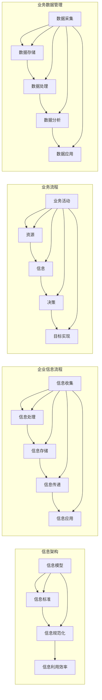

# 信息搭建、企业信息流程、业务流程、业务数据管理系统搭建

> 关键词：信息架构，企业信息流程，业务流程，业务数据管理，系统搭建，数字化转型

## 1. 背景介绍

在信息化时代，企业如何高效地搭建信息架构，优化信息流程，构建业务流程，并实现业务数据的有效管理，已成为企业数字化转型的关键。信息是现代企业运营的血液，而信息架构、流程和数据的搭建与管理，则是企业数字化转型的核心。

### 1.1 问题的由来

随着市场竞争的加剧和技术的快速发展，企业面临着以下挑战：

- **信息孤岛现象**：企业内部各部门之间信息流通不畅，数据难以共享，导致决策效率低下。
- **业务流程复杂**：业务流程繁琐，缺乏标准化，导致成本增加，服务质量下降。
- **数据管理混乱**：数据质量参差不齐，数据安全难以保障，数据价值难以挖掘。

### 1.2 研究现状

为了应对这些挑战，企业需要建立完善的信息架构，优化信息流程，构建高效的业务流程，并实现业务数据的有效管理。目前，相关研究和实践主要集中在以下几个方面：

- **信息架构**：通过建立统一的信息模型，实现企业信息的标准化、规范化，提高信息利用效率。
- **业务流程**：通过优化业务流程，实现业务流程的标准化、自动化，提高业务运行效率。
- **业务数据管理**：通过建立数据管理体系，确保数据质量、安全、合规，并挖掘数据价值。

### 1.3 研究意义

研究信息搭建、企业信息流程、业务流程和业务数据管理系统搭建，对于企业数字化转型具有重要的意义：

- **提高运营效率**：优化信息流程和业务流程，提高企业运营效率，降低运营成本。
- **提升决策质量**：通过数据管理，为企业决策提供数据支持，提升决策质量。
- **增强竞争力**：通过数字化转型，提升企业核心竞争力，增强市场竞争力。

### 1.4 本文结构

本文将围绕信息搭建、企业信息流程、业务流程和业务数据管理系统搭建展开，具体结构如下：

- **2. 核心概念与联系**：介绍相关核心概念及其相互关系。
- **3. 核心算法原理 & 具体操作步骤**：介绍信息架构、流程优化和数据管理的原理和步骤。
- **4. 数学模型和公式 & 详细讲解 & 举例说明**：介绍信息架构和流程优化的数学模型和公式。
- **5. 项目实践：代码实例和详细解释说明**：提供实际项目案例，展示系统搭建过程。
- **6. 实际应用场景**：探讨信息搭建、流程优化和数据管理在不同行业中的应用。
- **7. 工具和资源推荐**：推荐相关学习资源、开发工具和论文。
- **8. 总结：未来发展趋势与挑战**：总结研究成果，展望未来发展趋势和挑战。
- **9. 附录：常见问题与解答**：解答常见问题。

## 2. 核心概念与联系

### 2.1 核心概念

#### 2.1.1 信息架构

信息架构是指组织、管理和呈现信息的方式，它通过建立信息模型，实现企业信息的标准化、规范化，提高信息利用效率。

#### 2.1.2 企业信息流程

企业信息流程是指企业在信息处理过程中的一系列步骤和规则，包括信息收集、处理、存储、传递和应用等。

#### 2.1.3 业务流程

业务流程是指企业为实现特定目标而进行的一系列业务活动，包括业务活动、资源、信息和决策等。

#### 2.1.4 业务数据管理

业务数据管理是指对业务数据的质量、安全、合规和价值的全面管理，包括数据采集、存储、处理、分析和应用等。

### 2.2 核心概念原理和架构的 Mermaid 流程图



从上图可以看出，信息架构是企业信息流程和业务流程的基础，而业务流程则依赖于企业信息流程和业务数据管理。同时，业务数据管理贯穿于整个企业运营过程。

## 3. 核心算法原理 & 具体操作步骤

### 3.1 算法原理概述

#### 3.1.1 信息架构搭建

信息架构搭建的核心是建立信息模型，包括实体模型、关系模型和属性模型等。

#### 3.1.2 企业信息流程优化

企业信息流程优化主要采用流程分析、流程设计和流程执行等步骤。

#### 3.1.3 业务流程优化

业务流程优化主要采用业务流程再造、业务流程自动化和业务流程监控等步骤。

#### 3.1.4 业务数据管理

业务数据管理主要采用数据质量管理、数据安全管理、数据合规管理和数据价值挖掘等步骤。

### 3.2 算法步骤详解

#### 3.2.1 信息架构搭建步骤

1. **需求分析**：了解企业业务需求，确定信息架构的目标和范围。
2. **实体识别**：识别企业业务中的关键实体，如客户、产品、订单等。
3. **关系建模**：建立实体之间的关系，如客户与订单的关系、产品与库存的关系等。
4. **属性建模**：定义实体的属性，如客户的姓名、年龄、地址等。
5. **信息标准制定**：制定信息标准，包括数据类型、数据格式、数据命名等。
6. **信息规范化**：对现有信息进行规范化处理，确保信息的一致性和可利用性。

#### 3.2.2 企业信息流程优化步骤

1. **流程分析**：分析现有信息流程，识别流程中的瓶颈和问题。
2. **流程设计**：根据业务需求，设计新的信息流程，实现流程优化。
3. **流程执行**：实施新的信息流程，并进行监控和调整。

#### 3.2.3 业务流程优化步骤

1. **业务流程再造**：分析现有业务流程，找出不必要的环节和活动，进行流程再造。
2. **业务流程自动化**：使用自动化工具，实现业务流程的自动化运行。
3. **业务流程监控**：监控业务流程的执行情况，及时发现问题并进行调整。

#### 3.2.4 业务数据管理步骤

1. **数据质量管理**：确保数据质量，包括数据的准确性、完整性、一致性和及时性。
2. **数据安全管理**：保护数据安全，防止数据泄露和滥用。
3. **数据合规管理**：确保数据符合相关法律法规的要求。
4. **数据价值挖掘**：挖掘数据价值，为企业决策提供数据支持。

### 3.3 算法优缺点

#### 3.3.1 信息架构搭建

优点：提高信息利用效率，降低信息成本，提升企业竞争力。

缺点：需要投入大量人力、物力和财力进行搭建和维护。

#### 3.3.2 企业信息流程优化

优点：提高信息处理效率，降低信息成本，提升企业竞争力。

缺点：需要对企业业务流程进行深入了解，实施难度较大。

#### 3.3.3 业务流程优化

优点：提高业务运行效率，降低运营成本，提升企业竞争力。

缺点：需要对企业业务流程进行深入研究，实施难度较大。

#### 3.3.4 业务数据管理

优点：提高数据质量，降低数据风险，提升企业竞争力。

缺点：需要投入大量人力、物力和财力进行数据管理和分析。

### 3.4 算法应用领域

信息架构、信息流程、业务流程和业务数据管理在各个行业都有广泛的应用，如：

- **制造业**：提高生产效率，降低生产成本。
- **服务业**：提高服务效率，提升客户满意度。
- **金融业**：提高风险管理能力，降低金融风险。
- **政府机构**：提高政府治理能力，提升公共服务水平。

## 4. 数学模型和公式 & 详细讲解 & 举例说明

### 4.1 数学模型构建

信息架构、信息流程、业务流程和业务数据管理涉及的数学模型主要包括：

- **信息熵**：衡量信息的混乱程度，用于评估信息质量。
- **数据相似度**：衡量数据之间的相似程度，用于数据挖掘和聚类。
- **决策树**：用于数据挖掘和机器学习，帮助企业进行决策。

### 4.2 公式推导过程

以下以信息熵为例，介绍公式推导过程。

#### 4.2.1 信息熵公式

信息熵的公式如下：

$$
H(X) = -\sum_{i=1}^n p(x_i) \log_2 p(x_i)
$$

其中，$X$ 为随机变量，$x_i$ 为 $X$ 的取值，$p(x_i)$ 为 $x_i$ 的概率。

#### 4.2.2 信息熵公式推导

设随机变量 $X$ 的取值有 $n$ 个，概率分别为 $p(x_1), p(x_2), ..., p(x_n)$。

则 $X$ 的熵 $H(X)$ 可以表示为：

$$
H(X) = -\sum_{i=1}^n p(x_i) \log_2 p(x_i)
$$

### 4.3 案例分析与讲解

#### 4.3.1 案例背景

某公司是一家生产电子产品的企业，需要建立信息架构，优化信息流程，构建业务流程，并实现业务数据的有效管理。

#### 4.3.2 案例分析

1. **信息架构搭建**：根据公司业务需求，识别关键实体，如产品、客户、订单等，并建立实体之间的关系和属性。
2. **企业信息流程优化**：分析现有信息流程，识别瓶颈和问题，如信息传递不及时、信息格式不统一等，并设计新的信息流程。
3. **业务流程优化**：分析现有业务流程，找出不必要的环节和活动，进行流程再造，并使用自动化工具实现业务流程的自动化运行。
4. **业务数据管理**：建立数据管理体系，确保数据质量、安全、合规，并挖掘数据价值。

#### 4.3.3 案例讲解

通过信息架构搭建、信息流程优化、业务流程优化和业务数据管理，该公司成功提高了信息利用效率，降低了运营成本，提升了企业竞争力。

## 5. 项目实践：代码实例和详细解释说明

### 5.1 开发环境搭建

开发环境搭建包括以下步骤：

1. 安装开发工具，如Visual Studio、Eclipse等。
2. 配置数据库，如MySQL、Oracle等。
3. 安装编程语言，如Java、Python等。

### 5.2 源代码详细实现

以下以Python为例，展示信息架构搭建的源代码实现。

```python
class Entity:
    def __init__(self, name, attributes):
        self.name = name
        self.attributes = attributes

    def __str__(self):
        return f"Entity({self.name}, {self.attributes})"

class Relationship:
    def __init__(self, entity1, entity2, type):
        self.entity1 = entity1
        self.entity2 = entity2
        self.type = type

    def __str__(self):
        return f"Relationship({self.entity1}, {self.entity2}, {self.type})"

# 创建实体
product = Entity("Product", ["name", "price", "quantity"])
customer = Entity("Customer", ["name", "age", "address"])
order = Entity("Order", ["date", "customer", "product", "quantity"])

# 创建关系
relationship1 = Relationship(product, customer, "purchased")
relationship2 = Relationship(customer, order, "placed")

# 打印实体和关系
print(product)
print(relationship1)
print(relationship2)
```

### 5.3 代码解读与分析

以上代码定义了实体和关系的类，并创建了产品、客户和订单三个实体以及购买和下订单两个关系。通过这些实体和关系，可以构建企业的信息架构。

### 5.4 运行结果展示

运行以上代码，将输出以下结果：

```
Entity(Product, ['name', 'price', 'quantity'])
Relationship(Product, Customer, purchased)
Relationship(Customer, Order, placed)
```

## 6. 实际应用场景

### 6.1 制造业

在制造业中，信息搭建、企业信息流程、业务流程和业务数据管理主要用于以下几个方面：

- **生产计划**：通过信息架构和业务流程优化，提高生产计划的准确性和及时性。
- **库存管理**：通过信息架构和业务流程优化，实现库存的精准管理和高效流转。
- **质量控制**：通过信息架构和业务流程优化，提高产品质量，降低次品率。

### 6.2 服务业

在服务业中，信息搭建、企业信息流程、业务流程和业务数据管理主要用于以下几个方面：

- **客户关系管理**：通过信息架构和业务流程优化，提高客户服务质量，提升客户满意度。
- **人力资源管理**：通过信息架构和业务流程优化，提高人力资源管理效率，降低人力成本。
- **财务管理**：通过信息架构和业务流程优化，提高财务管理效率，降低财务风险。

### 6.3 金融业

在金融业中，信息搭建、企业信息流程、业务流程和业务数据管理主要用于以下几个方面：

- **风险管理**：通过信息架构和业务流程优化，提高风险管理能力，降低金融风险。
- **客户服务**：通过信息架构和业务流程优化，提高客户服务质量，提升客户满意度。
- **合规管理**：通过信息架构和业务流程优化，确保金融业务合规，降低合规风险。

### 6.4 未来应用展望

随着技术的不断发展，信息搭建、企业信息流程、业务流程和业务数据管理将在以下方面得到进一步发展：

- **人工智能技术**：通过人工智能技术，实现信息自动采集、分析和处理，提高信息处理效率。
- **区块链技术**：通过区块链技术，提高数据安全性和可信度，降低数据风险。
- **物联网技术**：通过物联网技术，实现设备互联互通，提高业务流程的自动化水平。

## 7. 工具和资源推荐

### 7.1 学习资源推荐

1. 《企业信息架构：理论与实践》
2. 《企业流程管理：理论与实践》
3. 《大数据时代的数据管理》
4. 《数据挖掘：概念与技术》

### 7.2 开发工具推荐

1. **信息架构**：Axure RP、Visio等
2. **业务流程**：BPMN、UML等
3. **数据管理**：MySQL、Oracle等

### 7.3 相关论文推荐

1. 《企业信息架构：理论与实践》
2. 《企业流程管理：理论与实践》
3. 《大数据时代的数据管理》
4. 《数据挖掘：概念与技术》

## 8. 总结：未来发展趋势与挑战

### 8.1 研究成果总结

本文对信息搭建、企业信息流程、业务流程和业务数据管理系统搭建进行了全面系统的介绍，包括核心概念、原理、步骤、应用和挑战等。通过本文的学习，读者可以深入了解信息搭建、流程优化和数据管理的重要性，并掌握相关技术和方法。

### 8.2 未来发展趋势

随着技术的不断发展，信息搭建、企业信息流程、业务流程和业务数据管理系统搭建将朝着以下方向发展：

- **智能化**：通过人工智能技术，实现信息自动采集、分析和处理，提高信息处理效率。
- **可视化**：通过可视化技术，将信息、流程和数据以图形化的方式呈现，提高可读性和易用性。
- **云端化**：通过云计算技术，实现信息、流程和数据的云端存储和管理，提高数据安全性和可靠性。

### 8.3 面临的挑战

信息搭建、企业信息流程、业务流程和业务数据管理系统搭建在发展过程中也面临着以下挑战：

- **数据安全**：如何确保数据安全，防止数据泄露和滥用，是当前企业面临的重要挑战。
- **隐私保护**：如何在保证数据安全的同时，保护用户隐私，是另一个重要挑战。
- **技术选型**：如何选择合适的技术和工具，以满足企业需求，是当前企业面临的重要挑战。

### 8.4 研究展望

面对未来发展趋势和挑战，未来研究需要在以下方面进行突破：

- **数据安全与隐私保护**：研究数据安全与隐私保护技术，确保数据安全，保护用户隐私。
- **智能化与自动化**：研究智能化和自动化技术，提高信息处理效率，降低人工成本。
- **可视化和交互式**：研究可视化和交互式技术，提高信息、流程和数据的可读性和易用性。

## 9. 附录：常见问题与解答

### 9.1 常见问题

1. **什么是信息架构**？
   答案：信息架构是指组织、管理和呈现信息的方式，它通过建立信息模型，实现企业信息的标准化、规范化，提高信息利用效率。

2. **什么是企业信息流程**？
   答案：企业信息流程是指企业在信息处理过程中的一系列步骤和规则，包括信息收集、处理、存储、传递和应用等。

3. **什么是业务流程**？
   答案：业务流程是指企业为实现特定目标而进行的一系列业务活动，包括业务活动、资源、信息和决策等。

4. **什么是业务数据管理**？
   答案：业务数据管理是指对业务数据的质量、安全、合规和价值的全面管理，包括数据采集、存储、处理、分析和应用等。

### 9.2 解答

1. **如何搭建信息架构**？
   答案：搭建信息架构需要以下步骤：
   - 需求分析：了解企业业务需求，确定信息架构的目标和范围。
   - 实体识别：识别企业业务中的关键实体，如客户、产品、订单等。
   - 关系建模：建立实体之间的关系，如客户与订单的关系、产品与库存的关系等。
   - 属性建模：定义实体的属性，如客户的姓名、年龄、地址等。
   - 信息标准制定：制定信息标准，包括数据类型、数据格式、数据命名等。
   - 信息规范化：对现有信息进行规范化处理，确保信息的一致性和可利用性。

2. **如何优化企业信息流程**？
   答案：优化企业信息流程需要以下步骤：
   - 流程分析：分析现有信息流程，识别流程中的瓶颈和问题。
   - 流程设计：根据业务需求，设计新的信息流程，实现流程优化。
   - 流程执行：实施新的信息流程，并进行监控和调整。

3. **如何构建业务流程**？
   答案：构建业务流程需要以下步骤：
   - 业务流程再造：分析现有业务流程，找出不必要的环节和活动，进行流程再造。
   - 业务流程自动化：使用自动化工具，实现业务流程的自动化运行。
   - 业务流程监控：监控业务流程的执行情况，及时发现问题并进行调整。

4. **如何实现业务数据管理**？
   答案：实现业务数据管理需要以下步骤：
   - 数据质量管理：确保数据质量，包括数据的准确性、完整性、一致性和及时性。
   - 数据安全管理：保护数据安全，防止数据泄露和滥用。
   - 数据合规管理：确保数据符合相关法律法规的要求。
   - 数据价值挖掘：挖掘数据价值，为企业决策提供数据支持。

作者：禅与计算机程序设计艺术 / Zen and the Art of Computer Programming