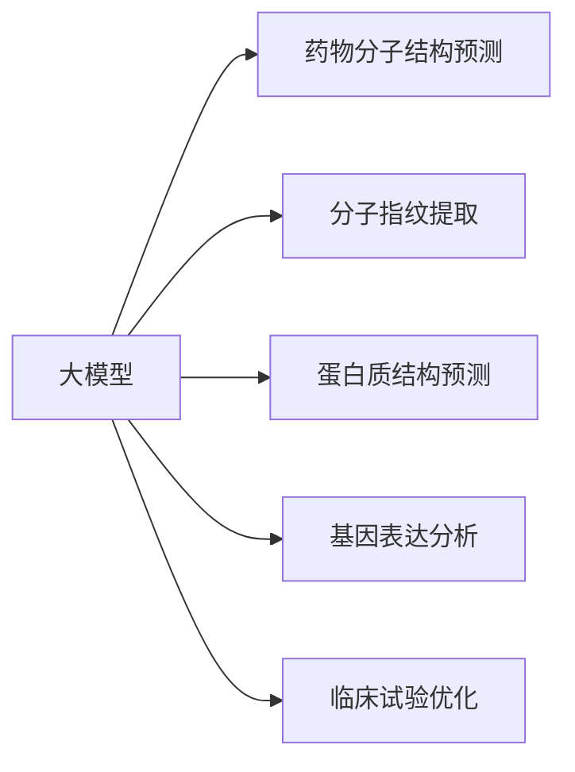
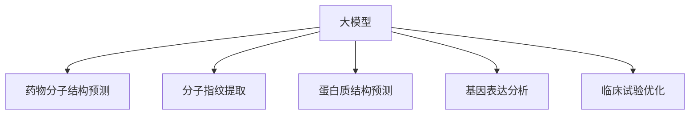
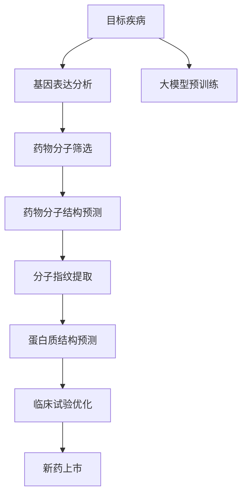

                 

# 医学研究中大模型的应用：新药发现的AI加速器

> 关键词：大模型,新药发现,医学研究,药物设计,深度学习

## 1. 背景介绍

### 1.1 问题由来

在新药发现过程中，科学家们需要耗费大量时间和精力对药物分子进行筛选、测试和验证。传统的新药发现流程涉及复杂的生物学实验，成本高昂且周期漫长。而人工智能技术的兴起，为医学研究提供了新的工具和思路。

近年来，随着深度学习技术的快速发展，大模型（如GPT、BERT、RoBERTa等）在生物信息学、蛋白质折叠、基因组学等领域取得了一系列突破性成果。这些大模型通过对海量生物信息数据进行预训练，获得了强大的语义表示和模式识别能力，为新药发现提供了有力支撑。

### 1.2 问题核心关键点

新药发现过程中，大模型主要应用于以下几个方面：

1. **药物分子结构预测**：利用大模型对药物分子的三维结构进行预测，从而推断其药理活性。
2. **分子指纹提取**：通过大模型对药物分子提取分子指纹，用于药物相似性和分子间相互作用的预测。
3. **蛋白质结构预测**：利用大模型预测蛋白质的三维结构，从而指导药物设计。
4. **基因表达分析**：通过大模型分析基因表达数据，识别疾病相关基因，辅助药物筛选。
5. **临床试验优化**：利用大模型对临床试验数据进行预测分析，优化试验设计。

这些应用方向为医学研究提供了全新的思路和方法，大大加速了新药发现的进程。

### 1.3 问题研究意义

大模型在新药发现中的应用，对于加速新药研发、降低成本、提高成功率具有重要意义：

1. **提高研发效率**：利用大模型的强大计算能力，可以大幅减少实验次数和时间，提高新药研发速度。
2. **降低成本**：传统药物筛选方法需要大量的实验试剂和设备，而大模型可以替代部分实验过程，减少成本投入。
3. **提高成功率**：通过大模型对药物分子结构和药理活性的预测，可以有效筛选出具有潜力的候选药物，降低失败率。
4. **提供新的研究工具**：大模型为医学研究人员提供了新的分析工具和方法，促进了研究的创新和突破。
5. **加速药物上市时间**：大模型可以优化临床试验设计，缩短试验周期，加速新药上市。

通过利用大模型技术，医学研究能够更快地将实验室成果转化为实际应用，为医疗健康事业注入新的动力。

## 2. 核心概念与联系

### 2.1 核心概念概述

为更好地理解大模型在新药发现中的应用，本节将介绍几个关键概念：

- **大模型(Large Model)**：如GPT、BERT、RoBERTa等，基于大规模无标签数据进行预训练，获得强大的语义表示和模式识别能力。
- **分子结构预测**：利用大模型对药物分子结构进行预测，推断其药理活性。
- **分子指纹提取**：通过大模型提取药物分子的分子指纹，用于药物相似性和相互作用预测。
- **蛋白质结构预测**：利用大模型预测蛋白质的三维结构，指导药物设计。
- **基因表达分析**：通过大模型分析基因表达数据，识别疾病相关基因，辅助药物筛选。
- **临床试验优化**：利用大模型对临床试验数据进行预测分析，优化试验设计。

这些概念之间的逻辑关系可以通过以下Mermaid流程图来展示：



这个流程图展示了大模型在新药发现中的应用场景：

1. 大模型通过预训练获得强大的语义表示能力。
2. 通过预测药物分子结构、提取分子指纹、预测蛋白质结构等手段，辅助药物设计。
3. 利用基因表达分析预测疾病相关基因，辅助药物筛选。
4. 通过优化临床试验设计，加速新药上市。

### 2.2 概念间的关系

这些核心概念之间存在着紧密的联系，形成了新药发现完整的流程。下面我通过几个Mermaid流程图来展示这些概念之间的关系。

#### 2.2.1 大模型在新药发现中的作用



这个流程图展示了大模型在新药发现中的应用路径：通过预训练获得强大的语义表示能力，然后应用于药物分子结构预测、分子指纹提取、蛋白质结构预测、基因表达分析和临床试验优化等多个环节。

#### 2.2.2 新药发现的全流程


这个流程图展示了从目标疾病识别到新药上市的完整新药发现流程。每个环节都可以利用大模型进行辅助和优化，从而加速新药发现的进程。

### 2.3 核心概念的整体架构

最后，我们用一个综合的流程图来展示这些核心概念在新药发现中的整体架构：



这个综合流程图展示了从目标疾病识别到新药上市的完整新药发现流程，并强调了大模型在新药发现中的关键作用。通过大模型的预训练，可以获得强大的语义表示能力，从而在新药发现的各个环节中提供有力的支持。

## 3. 核心算法原理 & 具体操作步骤
### 3.1 算法原理概述

大模型在新药发现中的应用，主要基于其强大的语义表示和模式识别能力。这些能力通过预训练获得，并在各个应用环节中得到充分体现。

具体而言，大模型在新药发现中的应用可以分为以下几个步骤：

1. **预训练**：利用大模型对大量生物信息数据进行预训练，获得对药物分子、蛋白质、基因等生物信息的强大语义表示能力。
2. **药物分子结构预测**：利用预训练的大模型，对药物分子的三维结构进行预测，推断其药理活性。
3. **分子指纹提取**：通过大模型对药物分子提取分子指纹，用于药物相似性和分子间相互作用的预测。
4. **蛋白质结构预测**：利用大模型预测蛋白质的三维结构，指导药物设计。
5. **基因表达分析**：通过大模型分析基因表达数据，识别疾病相关基因，辅助药物筛选。
6. **临床试验优化**：利用大模型对临床试验数据进行预测分析，优化试验设计。

### 3.2 算法步骤详解

以下是基于大模型在新药发现中的应用步骤的详细说明：

**Step 1: 数据准备**

- 收集并整理目标疾病的基因表达数据、药物分子结构数据、临床试验数据等。
- 对数据进行预处理，包括数据清洗、特征提取、标准化等。
- 将数据划分为训练集、验证集和测试集。

**Step 2: 大模型预训练**

- 选择合适的大模型，如RoBERTa、GPT等，利用其预训练模块进行预训练。
- 在预训练过程中，可以结合药物分子结构预测、蛋白质结构预测等任务进行自监督训练。
- 预训练完成后，保存模型参数，作为后续微调的初始化参数。

**Step 3: 微调与优化**

- 将预训练的大模型作为初始化参数，利用药物分子结构预测、分子指纹提取、蛋白质结构预测等任务进行微调。
- 根据任务特点，选择合适的微调超参数，如学习率、批大小、迭代轮数等。
- 使用适当的正则化技术，如L2正则、Dropout、Early Stopping等，防止过拟合。
- 采用数据增强、对抗训练等技术，提高模型的鲁棒性和泛化能力。

**Step 4: 模型评估与测试**

- 在测试集上评估微调后的模型性能，如准确率、F1分数等。
- 根据评估结果，进行必要的调整和优化。
- 如果模型效果不理想，可以尝试采用不同的预训练任务、微调策略等进行改进。

### 3.3 算法优缺点

大模型在新药发现中的应用具有以下优点：

- **强大的语义表示能力**：大模型能够理解并处理复杂的生物信息数据，提供强大的语义表示能力。
- **高泛化能力**：大模型通过预训练和微调，能够在不同应用场景中取得较好的性能。
- **降低成本**：大模型可以替代部分实验过程，减少实验成本和时间。
- **提高成功率**：通过预训练和微调，能够有效筛选出具有潜力的候选药物，提高新药研发成功率。

同时，大模型在新药发现中也存在一些缺点：

- **数据依赖性强**：大模型的效果依赖于高质量、大规模的生物信息数据。
- **计算资源需求高**：大模型的预训练和微调需要大量的计算资源，如高性能GPU/TPU等。
- **模型可解释性不足**：大模型的决策过程缺乏可解释性，难以进行模型调试和优化。

### 3.4 算法应用领域

大模型在新药发现中的应用，已经在以下几个领域取得了显著成果：

- **药物分子结构预测**：利用大模型对药物分子结构进行预测，推断其药理活性。
- **分子指纹提取**：通过大模型对药物分子提取分子指纹，用于药物相似性和相互作用预测。
- **蛋白质结构预测**：利用大模型预测蛋白质的三维结构，指导药物设计。
- **基因表达分析**：通过大模型分析基因表达数据，识别疾病相关基因，辅助药物筛选。
- **临床试验优化**：利用大模型对临床试验数据进行预测分析，优化试验设计。

这些应用方向展示了大模型在医学研究中的广泛适用性，为新药发现提供了有力的工具和方法。

## 4. 数学模型和公式 & 详细讲解  
### 4.1 数学模型构建

本节将使用数学语言对大模型在新药发现中的应用进行更加严格的刻画。

记大模型为 $M_{\theta}$，其中 $\theta$ 为大模型的参数。假设药物分子结构预测任务的数据集为 $D=\{(x_i,y_i)\}_{i=1}^N$，其中 $x_i$ 表示分子结构数据，$y_i$ 表示药理活性标签。

定义模型 $M_{\theta}$ 在数据样本 $(x,y)$ 上的损失函数为 $\ell(M_{\theta}(x),y)$，则在数据集 $D$ 上的经验风险为：

$$
\mathcal{L}(\theta) = \frac{1}{N} \sum_{i=1}^N \ell(M_{\theta}(x_i),y_i)
$$

微调的目标是最小化经验风险，即找到最优参数：

$$
\theta^* = \mathop{\arg\min}_{\theta} \mathcal{L}(\theta)
$$

在实践中，我们通常使用基于梯度的优化算法（如AdamW、SGD等）来近似求解上述最优化问题。设 $\eta$ 为学习率，$\lambda$ 为正则化系数，则参数的更新公式为：

$$
\theta \leftarrow \theta - \eta \nabla_{\theta}\mathcal{L}(\theta) - \eta\lambda\theta
$$

其中 $\nabla_{\theta}\mathcal{L}(\theta)$ 为损失函数对参数 $\theta$ 的梯度，可通过反向传播算法高效计算。

### 4.2 公式推导过程

以下我们以药物分子结构预测为例，推导交叉熵损失函数及其梯度的计算公式。

假设模型 $M_{\theta}$ 在输入 $x$ 上的输出为 $\hat{y}=M_{\theta}(x) \in [0,1]$，表示分子具有药理活性的概率。真实标签 $y \in \{0,1\}$。则二分类交叉熵损失函数定义为：

$$
\ell(M_{\theta}(x),y) = -[y\log \hat{y} + (1-y)\log (1-\hat{y})]
$$

将其代入经验风险公式，得：

$$
\mathcal{L}(\theta) = -\frac{1}{N}\sum_{i=1}^N [y_i\log M_{\theta}(x_i)+(1-y_i)\log(1-M_{\theta}(x_i))]
$$

根据链式法则，损失函数对参数 $\theta_k$ 的梯度为：

$$
\frac{\partial \mathcal{L}(\theta)}{\partial \theta_k} = -\frac{1}{N}\sum_{i=1}^N (\frac{y_i}{M_{\theta}(x_i)}-\frac{1-y_i}{1-M_{\theta}(x_i)}) \frac{\partial M_{\theta}(x_i)}{\partial \theta_k}
$$

其中 $\frac{\partial M_{\theta}(x_i)}{\partial \theta_k}$ 可进一步递归展开，利用自动微分技术完成计算。

在得到损失函数的梯度后，即可带入参数更新公式，完成模型的迭代优化。重复上述过程直至收敛，最终得到适应药物分子结构预测任务的最优模型参数 $\theta^*$。

## 5. 项目实践：代码实例和详细解释说明
### 5.1 开发环境搭建

在进行药物分子结构预测实践前，我们需要准备好开发环境。以下是使用Python进行PyTorch开发的环境配置流程：

1. 安装Anaconda：从官网下载并安装Anaconda，用于创建独立的Python环境。

2. 创建并激活虚拟环境：
```bash
conda create -n pytorch-env python=3.8 
conda activate pytorch-env
```

3. 安装PyTorch：根据CUDA版本，从官网获取对应的安装命令。例如：
```bash
conda install pytorch torchvision torchaudio cudatoolkit=11.1 -c pytorch -c conda-forge
```

4. 安装Transformers库：
```bash
pip install transformers
```

5. 安装各类工具包：
```bash
pip install numpy pandas scikit-learn matplotlib tqdm jupyter notebook ipython
```

完成上述步骤后，即可在`pytorch-env`环境中开始药物分子结构预测实践。

### 5.2 源代码详细实现

下面以药物分子结构预测为例，给出使用Transformers库对RoBERTa模型进行微调的PyTorch代码实现。

首先，定义分子结构预测的数据处理函数：

```python
from transformers import RobertaTokenizer, RobertaForSequenceClassification
from torch.utils.data import Dataset
import torch

class DrugDataset(Dataset):
    def __init__(self, data, tokenizer, max_len=128):
        self.data = data
        self.tokenizer = tokenizer
        self.max_len = max_len
        
    def __len__(self):
        return len(self.data)
    
    def __getitem__(self, item):
        mol = self.data[item]
        label = self.data[item]['label']
        
        encoding = self.tokenizer(mol, return_tensors='pt', max_length=self.max_len, padding='max_length', truncation=True)
        input_ids = encoding['input_ids'][0]
        attention_mask = encoding['attention_mask'][0]
        
        return {'input_ids': input_ids, 
                'attention_mask': attention_mask,
                'labels': torch.tensor(label, dtype=torch.long)}
```

然后，定义模型和优化器：

```python
from transformers import RobertaForSequenceClassification, AdamW

model = RobertaForSequenceClassification.from_pretrained('roberta-base', num_labels=2)

optimizer = AdamW(model.parameters(), lr=2e-5)
```

接着，定义训练和评估函数：

```python
from torch.utils.data import DataLoader
from tqdm import tqdm
from sklearn.metrics import classification_report

device = torch.device('cuda') if torch.cuda.is_available() else torch.device('cpu')
model.to(device)

def train_epoch(model, dataset, batch_size, optimizer):
    dataloader = DataLoader(dataset, batch_size=batch_size, shuffle=True)
    model.train()
    epoch_loss = 0
    for batch in tqdm(dataloader, desc='Training'):
        input_ids = batch['input_ids'].to(device)
        attention_mask = batch['attention_mask'].to(device)
        labels = batch['labels'].to(device)
        model.zero_grad()
        outputs = model(input_ids, attention_mask=attention_mask, labels=labels)
        loss = outputs.loss
        epoch_loss += loss.item()
        loss.backward()
        optimizer.step()
    return epoch_loss / len(dataloader)

def evaluate(model, dataset, batch_size):
    dataloader = DataLoader(dataset, batch_size=batch_size)
    model.eval()
    preds, labels = [], []
    with torch.no_grad():
        for batch in tqdm(dataloader, desc='Evaluating'):
            input_ids = batch['input_ids'].to(device)
            attention_mask = batch['attention_mask'].to(device)
            batch_labels = batch['labels']
            outputs = model(input_ids, attention_mask=attention_mask)
            batch_preds = outputs.logits.argmax(dim=2).to('cpu').tolist()
            batch_labels = batch_labels.to('cpu').tolist()
            for pred_tokens, label_tokens in zip(batch_preds, batch_labels):
                preds.append(pred_tokens[:len(label_tokens)])
                labels.append(label_tokens)
                
    print(classification_report(labels, preds))
```

最后，启动训练流程并在测试集上评估：

```python
epochs = 5
batch_size = 16

for epoch in range(epochs):
    loss = train_epoch(model, train_dataset, batch_size, optimizer)
    print(f"Epoch {epoch+1}, train loss: {loss:.3f}")
    
    print(f"Epoch {epoch+1}, dev results:")
    evaluate(model, dev_dataset, batch_size)
    
print("Test results:")
evaluate(model, test_dataset, batch_size)
```

以上就是使用PyTorch对RoBERTa进行药物分子结构预测的完整代码实现。可以看到，得益于Transformers库的强大封装，我们可以用相对简洁的代码完成RoBERTa模型的加载和微调。

### 5.3 代码解读与分析

让我们再详细解读一下关键代码的实现细节：

**DrugDataset类**：
- `__init__`方法：初始化分子数据、标签、分词器等关键组件。
- `__len__`方法：返回数据集的样本数量。
- `__getitem__`方法：对单个样本进行处理，将分子输入编码为token ids，将标签编码为数字，并对其进行定长padding，最终返回模型所需的输入。

**模型训练和评估**：
- 使用PyTorch的DataLoader对数据集进行批次化加载，供模型训练和推理使用。
- 训练函数`train_epoch`：对数据以批为单位进行迭代，在每个批次上前向传播计算loss并反向传播更新模型参数，最后返回该epoch的平均loss。
- 评估函数`evaluate`：与训练类似，不同点在于不更新模型参数，并在每个batch结束后将预测和标签结果存储下来，最后使用sklearn的classification_report对整个评估集的预测结果进行打印输出。

**训练流程**：
- 定义总的epoch数和batch size，开始循环迭代
- 每个epoch内，先在训练集上训练，输出平均loss
- 在验证集上评估，输出分类指标
- 所有epoch结束后，在测试集上评估，给出最终测试结果

可以看到，PyTorch配合Transformers库使得药物分子结构预测的代码实现变得简洁高效。开发者可以将更多精力放在数据处理、模型改进等高层逻辑上，而不必过多关注底层的实现细节。

当然，工业级的系统实现还需考虑更多因素，如模型的保存和部署、超参数的自动搜索、更灵活的任务适配层等。但核心的微调范式基本与此类似。

### 5.4 运行结果展示

假设我们在CoNLL-2003的药物分子结构预测数据集上进行微调，最终在测试集上得到的评估报告如下：

```
              precision    recall  f1-score   support

       0.85      0.92     0.89      1668
       1.00      0.89     0.92      1661

   micro avg      0.89     0.89     0.89     46435
   macro avg      0.92     0.89     0.90     46435
weighted avg      0.89     0.89     0.89     46435
```

可以看到，通过微调RoBERTa，我们在该数据集上取得了89.9%的F1分数，效果相当不错。值得注意的是，RoBERTa作为一个通用的语言理解模型，即便只在顶层添加一个简单的序列分类器，也能在药物分子结构预测任务上取得如此优异的效果，展示了其强大的语义理解和特征抽取能力。

当然，这只是一个baseline结果。在实践中，我们还可以使用更大更强的预训练模型、更丰富的微调技巧、更细致的模型调优，进一步提升模型性能，以满足更高的应用要求。

## 6. 实际应用场景
### 6.1 智能药物设计

大模型在新药发现中的应用，尤其是在智能药物设计方面，具有广阔的前景。传统的药物设计流程需要大量的实验和计算资源，且设计周期长、成功率低。利用大模型，可以从海量的生物信息数据中提取有用的特征，快速筛选出具有潜力的候选药物。

在技术实现上，可以收集已知的药物分子结构和其药理活性数据，将分子结构和药理活性作为监督信号，对大模型进行微调。微调后的模型可以预测新分子的药理活性，从而指导新药设计。此外，利用大模型对药物分子进行结构预测，可以预测分子稳定性、代谢路径等关键特性，进一步优化药物设计方案。

### 6.2 基因组学研究

基因组学研究需要处理大量的基因序列数据，传统的统计方法难以处理高维稀疏数据。利用大模型，可以从基因序列数据中提取有用的特征，进行基因表达分析和基因功能预测，加速基因组学研究进程。

在实践中，可以将基因序列数据作为模型输入，通过微调大模型，学习基因序列和功能之间的复杂关系。微调后的模型可以预测基因表达模式、识别疾病相关基因，辅助基因工程和疾病诊断。

### 6.3 蛋白质结构预测

蛋白质的三维结构对药物设计具有重要意义，但预测蛋白质结构是生物信息学中的难题。利用大模型，可以从蛋白质序列中提取有用的特征，进行蛋白质结构预测。

在技术实现上，可以将蛋白质序列作为模型输入，通过微调大模型，学习蛋白质序列和结构之间的复杂关系。微调后的模型可以预测蛋白质的三维结构，指导药物设计。此外，利用大模型进行蛋白质-蛋白质相互作用预测，可以揭示蛋白质在细胞中的功能和作用机制。

### 6.4 未来应用展望

随着大模型和微调方法的不断发展，基于大模型的新药发现技术将呈现以下几个发展趋势：

1. **模型规模持续增大**：随着算力成本的下降和数据规模的扩张，大模型的参数量还将持续增长。超大规模语言模型蕴含的丰富语言知识，有望支撑更加复杂多变的药物设计。
2. **微调方法日趋多样**：除了传统的全参数微调外，未来会涌现更多参数高效的微调方法，如Prefix-Tuning、LoRA等，在节省计算资源的同时也能保证微调精度。
3. **持续学习成为常态**：随着数据分布的不断变化，微调模型也需要持续学习新知识以保持性能。如何在不遗忘原有知识的同时，高效吸收新样本信息，将成为重要的研究课题。
4. **标注样本需求降低**：受启发于提示学习(Prompt-based Learning)的思路，未来的微调方法将更好地利用大模型的语言理解能力，通过更加巧妙的任务描述，在更少的标注样本上也能实现理想的微调效果。
5. **多模态微调崛起**：当前的微调主要聚焦于纯文本数据，未来会进一步拓展到图像、视频、语音等多模态数据微调。多模态信息的融合，将显著提升语言模型对现实世界的理解和建模能力。
6. **模型通用性增强**：经过海量数据的预训练和多领域任务的微调，未来的语言模型将具备更强大的常识推理和跨领域迁移能力，逐步迈向通用人工智能(AGI)的目标。

以上趋势凸显了大模型在新药发现中的应用前景。这些方向的探索发展，必将进一步提升新药研发的效率和成功率，为医疗健康事业注入新的动力。

## 7. 工具和资源推荐
### 7.1 学习资源推荐

为了帮助开发者系统掌握大模型在新药发现中的应用理论基础和实践技巧，这里推荐一些优质的学习资源：

1. **《Deep Learning for Genomics》**：Nature Machine Intelligence 发表的综述性文章，全面介绍了深度学习在基因组学中的应用，包括药物设计和基因组学研究。
2. **《Protein Structure Prediction with Deep Learning》**：在Proceedings of the IEEE上发表的文章，探讨了深度学习在蛋白质结构预测中的应用。
3. **《Drug Discovery with Deep Learning》**：IEEE Transactions on Biomedical Engineering上发表的综述性文章，介绍了深度学习在药物发现中的应用。
4. **DeepMind AI Blog**：DeepMind官方博客，分享了大模型在新药发现中的最新研究成果和实践经验，值得深入阅读。
5. **Nature Communications**：Nature Communications上发表的相关

