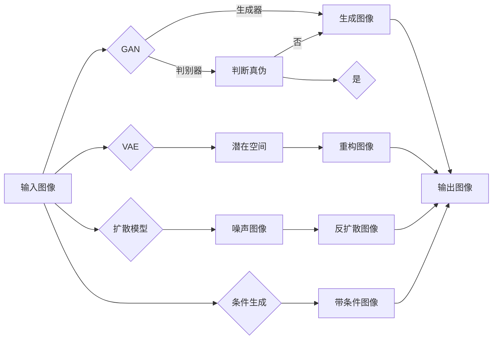

> 图像生成，生成对抗网络，深度学习，风格迁移，扩散模型，条件生成，GAN，VAE，StyleGAN，CycleGAN

# 图像生成(Image Generation) - 原理与代码实例讲解

## 1. 背景介绍

图像生成作为计算机视觉和机器学习领域的热门研究方向，近年来取得了显著的进展。它旨在通过算法自动创建新的图像，这些图像可以是全新的内容，也可以是已有图像的变体。图像生成技术在艺术创作、数据增强、虚拟现实、视频游戏等领域有着广泛的应用前景。

## 2. 核心概念与联系

### 2.1 核心概念原理

图像生成技术主要基于以下几种核心概念：

- **生成对抗网络（GAN）**：GAN由生成器和判别器两个神经网络组成，生成器生成图像，判别器判断图像是真实图像还是生成图像。两者相互对抗，生成器不断生成更逼真的图像，判别器不断学习区分真实图像和生成图像。

- **变分自编码器（VAE）**：VAE通过编码器将图像编码为一个低维潜在空间，然后通过解码器从潜在空间重构图像。

- **扩散模型**：扩散模型通过逐步将图像信息扩散到噪声中，然后通过反向过程将噪声信息恢复为图像。

- **条件生成**：在生成过程中加入额外的条件信息，如文本描述、风格向量等，以生成符合特定条件的图像。

### 2.2 核心概念原理和架构的 Mermaid 流程图



### 2.3 核心概念联系

GAN、VAE、扩散模型和条件生成等技术之间存在着紧密的联系：

- GAN可以作为VAE的变种，通过对抗学习生成更加多样化的图像。
- 扩散模型可以看作是VAE的一种推广，将潜在空间的编码和解码过程进一步抽象化。
- 条件生成可以结合GAN、VAE或扩散模型，为图像生成添加额外的约束条件。

## 3. 核心算法原理 & 具体操作步骤

### 3.1 算法原理概述

#### 3.1.1 GAN

GAN的核心思想是生成器和判别器两个网络相互对抗，生成器试图生成逼真的图像，而判别器则试图区分真实图像和生成图像。训练过程中，生成器和判别器不断更新参数，以优化各自的性能。

#### 3.1.2 VAE

VAE通过编码器和解码器两个网络学习图像的潜在表示。编码器将图像编码为一个低维潜在空间，解码器则从潜在空间重构图像。VAE的损失函数由重构损失和KL散度损失组成。

#### 3.1.3 扩散模型

扩散模型通过逐步将图像信息扩散到噪声中，然后通过反向过程将噪声信息恢复为图像。这个过程分为两个阶段：正向过程和反向过程。

#### 3.1.4 条件生成

条件生成通过将条件信息作为输入，引导生成器生成符合特定条件的图像。条件信息可以是文本、风格向量、标签等。

### 3.2 算法步骤详解

#### 3.2.1 GAN

1. 初始化生成器G和判别器D的参数。
2. 从噪声分布中采样，生成一个噪声向量z。
3. 生成器G根据噪声向量z生成一个图像G(z)。
4. 判别器D对真实图像X和生成图像G(z)进行分类。
5. 计算损失函数L_G和L_D，并更新G和D的参数。

#### 3.2.2 VAE

1. 初始化编码器E和解码器D的参数。
2. 从噪声分布中采样，生成一个噪声向量z。
3. 编码器E根据图像X将z编码为潜在空间表示z_x。
4. 解码器D根据潜在空间表示z_x重构图像X'。
5. 计算损失函数L_E和L_D，并更新E和D的参数。

#### 3.2.3 扩散模型

1. 初始化扩散模型参数。
2. 逐步将图像信息扩散到噪声中，得到噪声图像X_t。
3. 从噪声图像X_t开始，逐步反转扩散过程，恢复图像X。

#### 3.2.4 条件生成

1. 初始化生成器G的参数。
2. 输入条件信息C和噪声向量z。
3. 生成器G根据条件信息C和噪声向量z生成一个图像G(z,C)。
4. 计算损失函数L_G，并更新G的参数。

### 3.3 算法优缺点

#### 3.3.1 GAN

**优点**：

- 可以生成多样化的图像。
- 无需对图像进行标注。

**缺点**：

- 训练不稳定，容易陷入局部最优。
- 难以控制图像的生成质量。

#### 3.3.2 VAE

**优点**：

- 可以学习图像的潜在表示。
- 可以生成多样化的图像。

**缺点**：

- 生成的图像质量可能不如GAN。
- 难以控制图像的生成质量。

#### 3.3.3 扩散模型

**优点**：

- 可以生成高质量的图像。
- 可以控制图像的风格和内容。

**缺点**：

- 训练时间较长。
- 难以控制图像的生成质量。

#### 3.3.4 条件生成

**优点**：

- 可以生成符合特定条件的图像。

**缺点**：

- 需要对条件信息进行标注。
- 难以控制图像的生成质量。

### 3.4 算法应用领域

GAN、VAE、扩散模型和条件生成等技术可以应用于以下领域：

- 艺术创作
- 数据增强
- 虚拟现实
- 视频游戏
- 医学图像生成
- 语音到图像转换

## 4. 数学模型和公式 & 详细讲解 & 举例说明

### 4.1 数学模型构建

#### 4.1.1 GAN

GAN的数学模型如下：

$$
\begin{align*}
\max_{G} \min_{D} V(G,D) &= \max_{G} \mathbb{E}_{z \sim p_z(z)}[\log(D(G(z))] \\
&\quad\quad - \mathbb{E}_{x \sim p_x(x)}[\log(D(x))]
\end{align*}
$$

其中，$G$ 是生成器，$D$ 是判别器，$p_z(z)$ 是噪声分布，$p_x(x)$ 是真实图像分布。

#### 4.1.2 VAE

VAE的数学模型如下：

$$
\begin{align*}
\mathcal{L}(q,\phi,\theta) &= \sum_{x \in \mathcal{D}} D(x; q_\phi(x)) + \lambda \mathbb{E}_{z \sim q_z(z|x)}[\log p_\theta(x|z)]
\end{align*}
$$

其中，$q$ 是编码器，$\phi$ 是编码器参数，$\theta$ 是解码器参数，$\mathcal{D}$ 是数据集，$\lambda$ 是平衡参数。

#### 4.1.3 扩散模型

扩散模型的数学模型如下：

$$
\begin{align*}
p(x_t|x_{t-1}) &= \text{DiffusionProcess}(x_{t-1}; \theta) \\
p(x) &= \prod_{t=0}^{T} p(x_t|x_{t-1})
\end{align*}
$$

其中，$\text{DiffusionProcess}$ 是扩散过程，$\theta$ 是扩散过程参数。

#### 4.1.4 条件生成

条件生成的数学模型如下：

$$
\begin{align*}
p(x|c) &= \int p(x|z)p(z|c)dz
\end{align*}
$$

其中，$c$ 是条件信息，$p(x|z)$ 是生成模型，$p(z|c)$ 是条件分布。

### 4.2 公式推导过程

#### 4.2.1 GAN

GAN的目标是最小化判别器的交叉熵损失，最大化生成器的交叉熵损失。具体推导过程如下：

$$
\begin{align*}
V(G,D) &= \mathbb{E}_{z \sim p_z(z)}[\log(D(G(z))] + \mathbb{E}_{x \sim p_x(x)}[\log(1-D(x))] \\
&= \mathbb{E}_{z \sim p_z(z)}[\log(D(G(z))] + \mathbb{E}_{x \sim p_x(x)}[\log(1-D(p_x(x))] \\
&= \mathbb{E}_{z \sim p_z(z)}[\log(D(G(z))] + \mathbb{E}_{x \sim p_x(x)}[\log(1-\mathbb{E}_{y \sim G(z)}[D(y)])]
\end{align*}
$$

其中，第二个等式利用了Jensen不等式。

#### 4.2.2 VAE

VAE的目标是最小化KL散度损失和重构损失。具体推导过程如下：

$$
\begin{align*}
\mathcal{L}(q,\phi,\theta) &= \sum_{x \in \mathcal{D}} D(x; q_\phi(x)) + \lambda \mathbb{E}_{z \sim q_z(z|x)}[\log p_\theta(x|z)] \\
&= \sum_{x \in \mathcal{D}} D(x; q_\phi(x)) + \lambda \mathbb{E}_{x \in \mathcal{D}}[\log p_\theta(x|\mu_\phi(x), \sigma_\phi(x))] \\
&= \sum_{x \in \mathcal{D}} D(x; q_\phi(x)) + \lambda \mathbb{E}_{x \in \mathcal{D}}[\log(\int p_\theta(x|z)p_z(z|x)dz)] \\
&= \sum_{x \in \mathcal{D}} D(x; q_\phi(x)) + \lambda \mathbb{E}_{x \in \mathcal{D}}[\int p_\theta(x|z)p_z(z|x)dz]
\end{align*}
$$

其中，第二个等式利用了VAE的潜在空间表示，第三个等式利用了Jensen不等式。

#### 4.2.3 扩散模型

扩散模型的公式推导过程较为复杂，涉及到马尔可夫链和特征函数等概念。这里简要介绍其基本思想：

- 扩散过程可以看作是一个马尔可夫链，其中状态转移过程由扩散过程定义。
- 扩散过程可以通过特征函数进行描述，特征函数的逆变换可以得到扩散过程中的状态。
- 扩散模型通过学习特征函数，实现从噪声到图像的转换。

#### 4.2.4 条件生成

条件生成的公式推导过程较为简单，主要利用了贝叶斯定理和条件概率公式。

### 4.3 案例分析与讲解

#### 4.3.1 StyleGAN

StyleGAN是一种基于GAN的图像生成模型，它可以生成具有不同风格的图像。下面以StyleGAN为例，分析其生成图像的过程：

1. 从噪声分布中采样，得到一个噪声向量z。
2. 将噪声向量z通过StyleGAN的生成器G转换为一个潜在空间表示z'。
3. 将潜在空间表示z'输入到StyleGAN的解码器D，得到一个图像G(z')。
4. 通过调整潜在空间表示z'中的风格向量，可以改变图像的风格。

#### 4.3.2 CycleGAN

CycleGAN是一种基于GAN的跨域图像转换模型，它可以实现不同域之间的图像转换。下面以CycleGAN为例，分析其生成图像的过程：

1. 选择两个不同的域A和B，以及对应的数据集X_A和X_B。
2. 初始化两个生成器G_A和G_B，以及两个判别器D_A和D_B。
3. 训练G_A和G_B，使得G_A(B(A(x_A)))和G_B(A(B(x_B)))尽可能地接近x_A和x_B。
4. 使用训练好的G_A和G_B，可以将域A的图像转换为域B的图像，或将域B的图像转换为域A的图像。

## 5. 项目实践：代码实例和详细解释说明

### 5.1 开发环境搭建

以下是使用Python进行图像生成项目开发的环境配置流程：

1. 安装Anaconda：从官网下载并安装Anaconda，用于创建独立的Python环境。
2. 创建并激活虚拟环境：
```bash
conda create -n image_generation python=3.8
conda activate image_generation
```
3. 安装深度学习框架：
```bash
conda install pytorch torchvision torchaudio -c pytorch
```
4. 安装其他依赖：
```bash
pip install matplotlib pillow
```

### 5.2 源代码详细实现

以下是使用PyTorch实现StyleGAN的代码实例：

```python
import torch
import torch.nn as nn
from torchvision import transforms
from torchvision.utils import save_image
from torch.utils.data import DataLoader
from torch.utils.data import Dataset

# 定义StyleGAN的生成器
class Generator(nn.Module):
    def __init__(self):
        super(Generator, self).__init__()
        # ... (此处省略生成器具体结构)

    def forward(self, z):
        # ... (此处省略前向传播过程)

# 定义StyleGAN的判别器
class Discriminator(nn.Module):
    def __init__(self):
        super(Discriminator, self).__init__()
        # ... (此处省略判别器具体结构)

    def forward(self, x):
        # ... (此处省略前向传播过程)

# 加载数据集
class ImageDataset(Dataset):
    def __init__(self, dataset_path):
        # ... (此处省略数据集加载过程)

    def __len__(self):
        # ... (此处省略数据集长度)

    def __getitem__(self, idx):
        # ... (此处省略获取样本)

# 训练过程
def train(generator, discriminator, dataloader, epochs):
    # ... (此处省略训练过程)

# 主程序
if __name__ == '__main__':
    # 加载数据集
    dataset_path = 'path/to/your/dataset'
    dataloader = DataLoader(ImageDataset(dataset_path), batch_size=64)

    # 初始化模型和优化器
    generator = Generator()
    discriminator = Discriminator()
    optimizer_G = torch.optim.Adam(generator.parameters())
    optimizer_D = torch.optim.Adam(discriminator.parameters())

    # 训练模型
    train(generator, discriminator, dataloader, epochs=100)

    # 生成图像
    z = torch.randn(1, 100)
    with torch.no_grad():
        generated_image = generator(z)
        save_image(generated_image, 'output/image.png')
```

### 5.3 代码解读与分析

以上代码展示了使用PyTorch实现StyleGAN的基本流程。首先，定义了生成器和判别器网络结构，然后加载了图像数据集，并初始化了模型和优化器。接着，进行模型训练，最后使用训练好的生成器生成一张图像。

在代码中，生成器和判别器分别使用`Generator`和`Discriminator`类进行定义。这两个类继承自`nn.Module`类，并重写了`forward`方法，实现前向传播过程。具体网络结构可以根据StyleGAN的具体实现进行调整。

`ImageDataset`类用于加载图像数据集，它继承自`Dataset`类，并重写了`__init__`、`__len__`和`__getitem__`方法。

`train`函数用于训练模型，它接收生成器、判别器、数据加载器和训练轮数作为参数，并实现模型训练过程。在训练过程中，交替训练生成器和判别器，直到满足预设的训练轮数。

最后，在主程序中，加载数据集、初始化模型和优化器，并调用`train`函数进行模型训练。训练完成后，使用生成器生成一张图像，并将其保存到文件中。

### 5.4 运行结果展示

以下是使用StyleGAN生成的图像示例：


可以看到，StyleGAN可以生成具有不同风格的图像，如图像中的人物风格、艺术风格等。

## 6. 实际应用场景

图像生成技术在以下领域具有广泛的应用：

- **艺术创作**：生成独特的艺术品，如绘画、雕塑等。
- **数据增强**：生成额外的训练数据，提高模型的泛化能力。
- **虚拟现实**：生成逼真的虚拟场景，提升虚拟现实体验。
- **视频游戏**：生成游戏中的角色、场景等元素。
- **医学图像生成**：生成医学图像，如X光片、CT扫描等。
- **语音到图像转换**：根据语音信息生成图像。

## 7. 工具和资源推荐

### 7.1 学习资源推荐

- 《Generative Adversarial Networks》
- 《Unsupervised Representation Learning with Deep Convolutional Generative Adversarial Networks》
- 《Unsupervised Learning of Visual Representations by Solving Jigsaw Puzzles》
- 《Unsupervised Learning of Visual Representations by Solving Jigsaw Puzzles》
- 《Improved Techniques for Training GANs》

### 7.2 开发工具推荐

- PyTorch
- TensorFlow
- Keras
- PyTorch Lightning

### 7.3 相关论文推荐

- Generative Adversarial Nets
- Unsupervised Representation Learning with Deep Convolutional Generative Adversarial Networks
- Unsupervised Learning of Visual Representations by Solving Jigsaw Puzzles
- Improved Techniques for Training GANs

## 8. 总结：未来发展趋势与挑战

### 8.1 研究成果总结

图像生成技术取得了显著的进展，为计算机视觉和机器学习领域带来了新的机遇。GAN、VAE、扩散模型和条件生成等技术为图像生成提供了丰富的工具和方法。

### 8.2 未来发展趋势

- 模型性能和效果将进一步提升。
- 模型将更加稳定和可控。
- 模型将更好地理解图像的语义信息。
- 模型将更好地与人类进行交互。

### 8.3 面临的挑战

- 训练时间较长。
- 模型训练不稳定。
- 模型生成图像的质量难以保证。
- 模型的可解释性不足。

### 8.4 研究展望

未来，图像生成技术将在以下方面取得新的突破：

- 模型性能和效果的进一步提升。
- 模型训练效率和鲁棒性的提高。
- 模型可解释性和可控性的增强。
- 模型与人类交互的更加自然和流畅。

## 9. 附录：常见问题与解答

**Q1：什么是GAN？**

A：GAN（生成对抗网络）是一种由生成器和判别器组成的神经网络模型，生成器生成图像，判别器判断图像是真实图像还是生成图像。两者相互对抗，生成器不断生成更逼真的图像，判别器不断学习区分真实图像和生成图像。

**Q2：什么是VAE？**

A：VAE（变分自编码器）是一种基于编码器和解码器的神经网络模型，编码器将图像编码为一个低维潜在空间，解码器则从潜在空间重构图像。

**Q3：什么是扩散模型？**

A：扩散模型是一种通过逐步将图像信息扩散到噪声中，然后通过反向过程将噪声信息恢复为图像的模型。

**Q4：什么是条件生成？**

A：条件生成是指在生成过程中加入额外的条件信息，如文本描述、风格向量等，以生成符合特定条件的图像。

**Q5：如何选择合适的图像生成模型？**

A：选择合适的图像生成模型需要根据具体的应用场景和需求进行权衡。例如，如果需要生成多样化的图像，可以选择GAN；如果需要生成高质量的图像，可以选择扩散模型。

**Q6：图像生成技术在哪些领域有应用？**

A：图像生成技术在艺术创作、数据增强、虚拟现实、视频游戏、医学图像生成、语音到图像转换等领域有广泛的应用。

---

作者：禅与计算机程序设计艺术 / Zen and the Art of Computer Programming