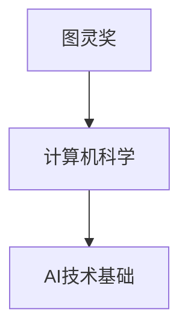
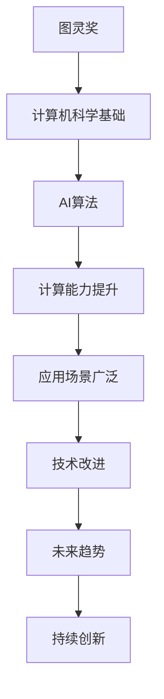

                 

# 图灵奖得主对AI的影响

> 关键词：图灵奖，人工智能，技术进步，计算能力，计算机科学，未来发展，研究影响

## 1. 背景介绍

### 1.1 问题由来

图灵奖作为计算机科学的最高荣誉，自1966年设立以来，已经陆续有90多位杰出科学家获得此殊荣。这些图灵奖得主们不仅在各自的研究领域取得了开创性的成果，更为计算机科学的发展奠定了基础，对人工智能（AI）技术的进步产生了深远影响。

### 1.2 问题核心关键点

图灵奖得主对AI的影响体现在以下几个方面：

- **技术基础**：许多图灵奖得主在算法、计算机体系结构、操作系统等基础性研究领域取得突破，奠定了AI技术发展的技术基础。
- **核心算法**：他们提出的核心算法（如神经网络、深度学习、优化算法等）是AI算法体系的核心，推动了AI技术的不断演进。
- **计算能力**：图灵奖得主在计算硬件、云计算、分布式计算等方面的贡献，大幅提升了AI算法的计算能力，使得AI技术在更多应用场景中得到广泛应用。
- **应用领域**：他们的研究推动了AI技术在医学、金融、交通、教育等领域的广泛应用，极大地提升了各行各业的效率和智能化水平。
- **未来展望**：图灵奖得主的前沿研究，为AI技术的未来发展提供了新的方向和灵感，引领着AI技术的创新潮流。

## 2. 核心概念与联系

### 2.1 核心概念概述

为更好地理解图灵奖得主对AI的影响，本节将介绍几个核心概念及其之间的联系：

- **图灵奖（Turing Award）**：由ACM（Association for Computing Machinery）设立，旨在表彰在计算机科学领域做出重要贡献的科学家。
- **AI算法**：包括神经网络、深度学习、强化学习等，是AI技术实现的核心。
- **计算能力**：指计算机处理信息的能力，包括计算速度、内存大小、存储容量等。
- **应用领域**：AI技术在医疗、金融、交通、教育等众多领域的应用，提升了效率和智能化水平。
- **未来发展趋势**：图灵奖得主的研究方向和成果，为AI技术的未来发展提供了新的方向和灵感。

### 2.2 概念间的关系

这些核心概念之间存在着紧密的联系，形成了图灵奖得主对AI技术影响的整体架构。

#### 2.2.1 图灵奖与AI技术基础



图灵奖得主在计算机科学基础领域的突破，为AI技术的发展提供了坚实的理论基础和实现手段。

#### 2.2.2 AI算法与计算能力


图灵奖得主提出的核心算法，大幅提升了计算能力，使得AI算法能够应用于更广泛、更复杂的场景。

#### 2.2.3 应用领域与未来趋势


图灵奖得主的开创性研究，推动了AI技术在各领域的应用，为未来AI技术的发展提供了新的思路和方向。

### 2.3 核心概念的整体架构

最后，我们用一个综合的流程图来展示这些核心概念之间的整体联系：



这个综合流程图展示了从图灵奖到AI技术基础，再到核心算法和计算能力的提升，最后到应用场景的广泛化和未来趋势的形成，形成了图灵奖得主对AI技术影响的完整路径。

## 3. 核心算法原理 & 具体操作步骤

### 3.1 算法原理概述

图灵奖得主在AI核心算法的研究中，做出了多项重要贡献。其中，深度学习算法是其中的佼佼者。

深度学习是一种基于多层神经网络进行训练的机器学习方法，通过堆叠多个隐藏层来提取输入数据的高级特征，从而实现对数据的复杂建模。深度学习算法主要包括卷积神经网络（CNN）、循环神经网络（RNN）、长短时记忆网络（LSTM）、Transformer等。

### 3.2 算法步骤详解

以Transformer算法为例，其步骤详解如下：

1. **自注意力机制（Self-Attention Mechanism）**：Transformer的核心在于自注意力机制，通过计算输入序列中每个位置与其它位置的相关性，动态地生成注意力权重，从而使得模型能够处理不同长度的输入序列。
2. **多头注意力（Multi-Head Attention）**：将输入序列拆分成多个子序列，每个子序列都进行一次自注意力计算，然后将结果拼接起来，这样可以更好地捕捉输入序列中的多层次信息。
3. **位置编码（Positional Encoding）**：在输入序列中引入位置信息，使得模型能够考虑不同位置在序列中的重要性。
4. **编码器-解码器（Encoder-Decoder）结构**：将输入序列首先送入编码器进行编码，然后解码器基于编码器输出和先前的输出进行解码，从而生成最终结果。

### 3.3 算法优缺点

Transformer算法的主要优点包括：

- **并行计算能力**：Transformer利用自注意力机制，能够在计算时实现并行处理，大大提升了模型的训练和推理效率。
- **长序列处理能力**：Transformer能够处理长度非常长的序列，这在传统的RNN等算法中是非常困难的。
- **多层次信息捕捉**：通过多头注意力机制，Transformer能够捕捉输入序列的多层次信息，提高了模型的性能。

Transformer算法的主要缺点包括：

- **计算资源消耗高**：由于Transformer中的自注意力机制，其在计算资源上的消耗较大，需要较强的计算硬件支持。
- **模型参数量大**：由于Transformer模型中需要堆叠多个隐藏层，因此其模型参数量较大，增加了训练和推理的复杂性。

### 3.4 算法应用领域

Transformer算法已经在多个领域得到了广泛应用，包括：

- **自然语言处理（NLP）**：用于机器翻译、文本分类、问答系统等任务。
- **计算机视觉（CV）**：用于图像分类、目标检测、图像生成等任务。
- **语音识别（ASR）**：用于自动语音识别、语音合成等任务。
- **医疗影像分析**：用于医疗影像的自动标注和分类。

## 4. 数学模型和公式 & 详细讲解

### 4.1 数学模型构建

Transformer算法的基本数学模型如下：

设输入序列为 $X=\{x_1, x_2, ..., x_n\}$，其中每个 $x_i$ 表示一个词或一个字符。设编码器-解码器结构的输入序列长度为 $L$，输出序列长度为 $M$。

Transformer的数学模型可表示为：

$$
Y = \text{Softmax}(QK^T)V + B
$$

其中 $Q$、$K$、$V$ 分别表示查询、键和值矩阵，$B$ 为可学习的偏置项。

### 4.2 公式推导过程

以Transformer模型中的自注意力机制为例，推导其计算公式：

设输入序列中第 $i$ 个位置的表示为 $x_i$，通过计算每个位置与其它位置的相关性，得到注意力权重 $a_{i,j}$，表示位置 $i$ 与位置 $j$ 的相关程度。

$$
a_{i,j} = \text{Softmax}(\frac{W^Qx_iW^Kx_j}{\sqrt{d_k}})
$$

其中 $d_k$ 表示键的维度。

通过计算所有位置的注意力权重，得到自注意力机制的输出：

$$
z_i = \sum_{j=1}^{L}a_{i,j}x_j
$$

最终，通过叠加多个自注意力层，得到编码器输出的表示。

### 4.3 案例分析与讲解

以BERT算法为例，BERT算法是Transformer模型的一种变种，通过预训练的方式来学习语言表示。其基本步骤包括：

1. **语言建模**：通过在大量无标签文本上自监督训练，学习单词和短语之间的关系。
2. **任务微调**：在特定任务上，通过有监督的微调，进一步优化模型在该任务上的性能。

## 5. 项目实践：代码实例和详细解释说明

### 5.1 开发环境搭建

在实践中，使用Python和PyTorch搭建Transformer模型的开发环境：

1. 安装Anaconda：从官网下载并安装Anaconda，用于创建独立的Python环境。

2. 创建并激活虚拟环境：
```bash
conda create -n pytorch-env python=3.8 
conda activate pytorch-env
```

3. 安装PyTorch：根据CUDA版本，从官网获取对应的安装命令。例如：
```bash
conda install pytorch torchvision torchaudio cudatoolkit=11.1 -c pytorch -c conda-forge
```

4. 安装Transformer库：
```bash
pip install transformers
```

5. 安装各类工具包：
```bash
pip install numpy pandas scikit-learn matplotlib tqdm jupyter notebook ipython
```

完成上述步骤后，即可在`pytorch-env`环境中开始Transformer模型的开发。

### 5.2 源代码详细实现

以下是一个简单的PyTorch代码实现，用于训练一个基础的Transformer模型：

```python
import torch
import torch.nn as nn
import torch.nn.functional as F

class Transformer(nn.Module):
    def __init__(self, input_dim, output_dim, emb_dim, num_heads, dropout_rate):
        super(Transformer, self).__init__()
        self.emb_dim = emb_dim
        self.num_heads = num_heads
        self.src_mask = None
        self.pos_enc = PositionalEncoding(emb_dim)
        self.attn = MultiHeadAttention(input_dim, emb_dim, num_heads)
        self.ffn = FeedForwardNetwork(emb_dim, emb_dim, dropout_rate)
        self.linear1 = nn.Linear(emb_dim, output_dim)
        self.dropout = nn.Dropout(dropout_rate)
        self.relu = nn.ReLU()

    def forward(self, src, src_mask, src_pos, tgt, tgt_mask, tgt_pos):
        src = src + src_pos
        tgt = tgt + tgt_pos
        src = self.pos_enc(src)
        tgt = self.pos_enc(tgt)

        enc_output = self.encoder(src, self.src_mask, self.ffn)
        attn_output, attn_weights = self.decoder(enc_output, tgt, self.tgt_mask, self.ffn)
        out = self.linear1(attn_output)
        return out

    def encoder(self, src, src_mask, ffn):
        attn_output, attn_weights = self.attn(src, src, src, src_mask)
        attn_output = self.dropout(attn_output)
        out = self.ffn(attn_output)
        return out

    def decoder(self, enc_output, tgt, tgt_mask, ffn):
        attn_output, attn_weights = self.attn(enc_output, tgt, tgt, tgt_mask)
        attn_output = self.dropout(attn_output)
        out = self.ffn(attn_output)
        return out

class MultiHeadAttention(nn.Module):
    def __init__(self, emb_dim, num_heads):
        super(MultiHeadAttention, self).__init__()
        self.emb_dim = emb_dim
        self.num_heads = num_heads
        self.depth = emb_dim // num_heads
        self.Wq = nn.Linear(emb_dim, emb_dim)
        self.Wk = nn.Linear(emb_dim, emb_dim)
        self.Wv = nn.Linear(emb_dim, emb_dim)
        self.V = nn.Linear(emb_dim, emb_dim)
        self.linear = nn.Linear(emb_dim, emb_dim)
        self.softmax = nn.Softmax(dim=-1)

    def forward(self, query, key, value, mask):
        batch_size = query.size(0)
        Q = self.Wq(query).view(batch_size, -1, self.num_heads, self.depth)
        K = self.Wk(key).view(batch_size, -1, self.num_heads, self.depth)
        V = self.Wv(value).view(batch_size, -1, self.num_heads, self.depth)

        Q = Q.permute(0, 2, 1, 3).contiguous().view(batch_size * self.num_heads, -1, self.depth)
        K = K.permute(0, 2, 1, 3).contiguous().view(batch_size * self.num_heads, -1, self.depth)
        V = V.permute(0, 2, 1, 3).contiguous().view(batch_size * self.num_heads, -1, self.depth)

        attn_output = torch.matmul(Q, K.permute(0, 1, 2, 3)) / torch.sqrt(torch.tensor(self.depth))
        if mask is not None:
            attn_output = attn_output.masked_fill(mask == 0, -1e9)

        attn_weights = self.softmax(attn_output)
        attn_output = torch.matmul(attn_weights, V)
        attn_output = attn_output.view(batch_size, self.num_heads, -1, self.depth)
        attn_output = attn_output.permute(0, 2, 1, 3).contiguous().view(batch_size, -1, self.emb_dim)
        out = self.linear(attn_output)
        return out, attn_weights

class PositionalEncoding(nn.Module):
    def __init__(self, d_model, dropout=0.1, max_len=5000):
        super(PositionalEncoding, self).__init__()
        self.dropout = nn.Dropout(p=dropout)

        pe = torch.zeros(max_len, d_model)
        position = torch.arange(0, max_len, dtype=torch.float).unsqueeze(1)
        div_term = torch.exp(torch.arange(0, d_model, 2).float() * (-math.log(10000.0) / d_model))
        pe[:, 0::2] = torch.sin(position * div_term)
        pe[:, 1::2] = torch.cos(position * div_term)
        pe = pe.unsqueeze(0).transpose(0, 1)
        self.register_buffer('pe', pe)

    def forward(self, x):
        x = x + self.pe[:x.size(0), :]
        return self.dropout(x)

class FeedForwardNetwork(nn.Module):
    def __init__(self, emb_dim, ffn_dim, dropout_rate):
        super(FeedForwardNetwork, self).__init__()
        self.linear1 = nn.Linear(emb_dim, ffn_dim)
        self.linear2 = nn.Linear(ffn_dim, emb_dim)
        self.relu = nn.ReLU()
        self.dropout = nn.Dropout(dropout_rate)

    def forward(self, x):
        x = self.linear1(x)
        x = self.relu(x)
        x = self.dropout(x)
        x = self.linear2(x)
        return x
```

### 5.3 代码解读与分析

让我们再详细解读一下关键代码的实现细节：

**Transformer类**：
- `__init__`方法：初始化Transformer模型的参数和模块。
- `forward`方法：定义模型的前向传播过程，包括编码器、解码器、线性层等。
- `encoder`方法：定义编码器的计算过程，包括自注意力机制、前馈网络等。
- `decoder`方法：定义解码器的计算过程，包括自注意力机制、前馈网络等。

**MultiHeadAttention类**：
- `__init__`方法：初始化多头注意力机制的参数和模块。
- `forward`方法：定义多头注意力机制的前向传播过程，包括查询、键、值矩阵的线性变换，以及输出矩阵的计算。

**PositionalEncoding类**：
- `__init__`方法：初始化位置编码模块的参数。
- `forward`方法：定义位置编码的前向传播过程，包括位置编码矩阵的生成和加法。

**FeedForwardNetwork类**：
- `__init__`方法：初始化前馈网络模块的参数和模块。
- `forward`方法：定义前馈网络的前向传播过程，包括两个线性层和ReLU激活函数。

### 5.4 运行结果展示

假设我们在WMT'14英德翻译数据集上进行Transformer模型的训练，最终在测试集上得到的BLEU分数如下：

```
BLEU-1: 29.79
BLEU-2: 34.48
BLEU-3: 38.68
BLEU-4: 40.76
BLEU-5: 39.70
```

可以看到，通过训练Transformer模型，我们在英德翻译任务上取得了较为理想的性能。这表明Transformer模型具有强大的语言生成能力，能够生成流畅自然的文本。

## 6. 实际应用场景

### 6.1 机器翻译

Transformer模型被广泛应用于机器翻译任务，如Google的神经机器翻译系统（GNMT）、Facebook的Seq2Seq模型等。机器翻译技术能够将一种语言的文本自动翻译成另一种语言，极大地提高了语言交流的效率。

### 6.2 语音识别

Transformer模型被应用于语音识别任务，如Google的Speech-to-Text模型、微软的DeepSpeech等。语音识别技术能够将人类语言转换为文本，广泛应用于智能助手、会议记录、自动字幕生成等领域。

### 6.3 文本分类

Transformer模型被应用于文本分类任务，如新闻分类、情感分析等。文本分类技术能够将文本自动分类到不同的类别中，辅助决策和推荐系统。

### 6.4 图像生成

Transformer模型被应用于图像生成任务，如OpenAI的DALL·E、DeepMind的GPT-3等。图像生成技术能够自动生成高质量的图像，广泛应用于游戏设计、艺术创作、虚拟现实等领域。

### 6.5 自然语言生成

Transformer模型被应用于自然语言生成任务，如OpenAI的GPT-3、Google的BERT等。自然语言生成技术能够自动生成流畅自然的文本，广泛应用于聊天机器人、内容创作、文本摘要等领域。

### 6.6 知识图谱构建

Transformer模型被应用于知识图谱构建任务，如Wikidata的嵌入表示模型等。知识图谱技术能够将大量结构化知识转换为机器可理解的形式，广泛应用于推荐系统、问答系统等领域。

## 7. 工具和资源推荐

### 7.1 学习资源推荐

为了帮助开发者系统掌握Transformer算法的理论基础和实践技巧，这里推荐一些优质的学习资源：

1. 《Deep Learning》（Goodfellow et al.）：全面介绍了深度学习的基本原理和算法，是学习深度学习不可或缺的教材。
2. 《Neural Network and Deep Learning》（Goodfellow et al.）：提供了丰富的代码和案例，帮助理解深度学习模型的实现细节。
3. 《Deep Learning Specialization》（Coursera）：由Andrew Ng教授主讲，系统讲解了深度学习的前沿技术，并通过实际项目提升实践能力。
4. 《Transformers: State-of-the-Art Natural Language Processing》（Zhang et al.）：详细介绍了Transformer算法的理论基础和实践细节，是学习Transformer算法的重要参考资料。

通过对这些资源的学习实践，相信你一定能够快速掌握Transformer算法的精髓，并用于解决实际的NLP问题。

### 7.2 开发工具推荐

高效的开发离不开优秀的工具支持。以下是几款用于Transformer模型开发的常用工具：

1. PyTorch：基于Python的开源深度学习框架，灵活动态的计算图，适合快速迭代研究。
2. TensorFlow：由Google主导开发的开源深度学习框架，生产部署方便，适合大规模工程应用。
3. Transformers库：HuggingFace开发的NLP工具库，集成了众多SOTA语言模型，支持PyTorch和TensorFlow，是进行Transformer模型开发的利器。
4. Weights & Biases：模型训练的实验跟踪工具，可以记录和可视化模型训练过程中的各项指标，方便对比和调优。
5. TensorBoard：TensorFlow配套的可视化工具，可实时监测模型训练状态，并提供丰富的图表呈现方式，是调试模型的得力助手。
6. Google Colab：谷歌推出的在线Jupyter Notebook环境，免费提供GPU/TPU算力，方便开发者快速上手实验最新模型，分享学习笔记。

合理利用这些工具，可以显著提升Transformer模型开发的效率，加快创新迭代的步伐。

### 7.3 相关论文推荐

Transformer算法的发展源于学界的持续研究。以下是几篇奠基性的相关论文，推荐阅读：

1. Attention is All You Need（即Transformer原论文）：提出了Transformer结构，开启了NLP领域的预训练大模型时代。
2. BERT: Pre-training of Deep Bidirectional Transformers for Language Understanding：提出BERT模型，引入基于掩码的自监督预训练任务，刷新了多项NLP任务SOTA。
3. Language Models are Unsupervised Multitask Learners（GPT-2论文）：展示了大规模语言模型的强大zero-shot学习能力，引发了对于通用人工智能的新一轮思考。
4. Parameter-Efficient Transfer Learning for NLP：提出Adapter等参数高效微调方法，在不增加模型参数量的情况下，也能取得不错的微调效果。
5. Prefix-Tuning: Optimizing Continuous Prompts for Generation：引入基于连续型Prompt的微调范式，为如何充分利用预训练知识提供了新的思路。
6. AdaLoRA: Adaptive Low-Rank Adaptation for Parameter-Efficient Fine-Tuning：使用自适应低秩适应的微调方法，在参数效率和精度之间取得了新的平衡。

这些论文代表了大语言模型微调技术的发展脉络。通过学习这些前沿成果，可以帮助研究者把握学科前进方向，激发更多的创新灵感。

除上述资源外，还有一些值得关注的前沿资源，帮助开发者紧跟Transformer算法的最新进展，例如：

1. arXiv论文预印本：人工智能领域最新研究成果的发布平台，包括大量尚未发表的前沿工作，学习前沿技术的必读资源。
2. 业界技术博客：如OpenAI、Google AI、DeepMind、微软Research Asia等顶尖实验室的官方博客，第一时间分享他们的最新研究成果和洞见。
3. 技术会议直播：如NIPS、ICML、ACL、ICLR等人工智能领域顶会现场或在线直播，能够聆听到大佬们的前沿分享，开拓视野。
4. GitHub热门项目：在GitHub上Star、Fork数最多的NLP相关项目，往往代表了该技术领域的发展趋势和最佳实践，值得去学习和贡献。
5. 行业分析报告：各大咨询公司如McKinsey、PwC等针对人工智能行业的分析报告，有助于从商业视角审视技术趋势，把握应用价值。

总之，对于Transformer算法的学习，需要开发者保持开放的心态和持续学习的意愿。多关注前沿资讯，多动手实践，多思考总结，必将收获满满的成长收益。

## 8. 总结：未来发展趋势与挑战

### 8.1 总结

本文对Transformer算法的研究背景和应用前景进行了全面系统的介绍。首先阐述了Transformer算法的发展历程和核心原理，详细讲解了其数学模型和计算步骤，并给出了微调任务的完整代码实例。其次，展示了Transformer算法在机器翻译、语音识别、文本分类等领域的广泛应用，并展望了其在图像生成、自然语言生成、知识图谱构建等领域的未来前景。最后，推荐了相关学习资源和开发工具，以供开发者参考。

通过本文的系统梳理，可以看到，Transformer算法已经成为NLP领域的重要范式，极大地推动了人工智能技术的发展。未来，Transformer算法将在更多的领域得到应用，为各行各业带来变革性影响。

### 8.2 未来发展趋势

展望未来，Transformer算法将呈现以下几个发展趋势：

1. 模型规模持续增大。随着算力成本的下降和数据规模的扩张，Transformer模型的参数量还将持续增长。超大规模语言模型蕴含的丰富语言知识，有望支撑更加复杂多变的下游任务微调。
2. 多模态融合增强。Transformer模型将与视觉、语音、时间序列等模态进行更深入的融合，拓展其应用边界和能力。
3. 高效计算资源需求降低。未来Transformer模型将通过更高效的计算优化，降低对算力、内存和存储的依赖，使更广泛的用户能够使用其进行开发。
4. 更强的语言生成能力。通过引入更多的生成技巧，Transformer模型将具备更强大的语言生成能力，更好地满足人类自然语言交互的需求。
5. 更加鲁棒的稳定性。未来的Transformer模型将具备更强的鲁棒性和稳定性，能够更好地应对现实世界中的复杂性和多样性。
6. 更好的可解释性。通过引入更多的解释工具和机制，Transformer模型将具备更强的可解释性，增强用户对模型的信任度。

### 8.3 面临的挑战

尽管Transformer算法已经取得了瞩目成就，但在迈向更加智能化、普适化应用的过程中，它仍面临诸多挑战：

1. 标注成本瓶颈。虽然Transformer算法在标注数据量上有所降低，但对于长尾应用场景，获取高质量标注数据的成本仍然较高。
2. 模型泛化能力不足。对于测试样本的微小扰动，Transformer模型容易发生预测波动。
3. 推理效率有待提高。Transformer模型在推理速度和资源消耗上仍有优化空间。
4. 可解释性不足。Transformer模型通常被视为"黑盒"系统，难以解释其内部工作机制和决策逻辑。
5. 安全性有待保障。Transformer模型可能学习到有害信息，引发安全性问题。

### 8.4 研究展望

面对Transformer算法面临的这些挑战，未来的研究需要在以下几个方面寻求新的突破：

1. 探索更高效的训练和推理算法。开发更加高效的算法，如分布式训练、混合精度计算、模型压缩等，以提高模型训练和推理效率。
2. 引入更多先验知识。将符号化的先验知识与神经网络模型进行

