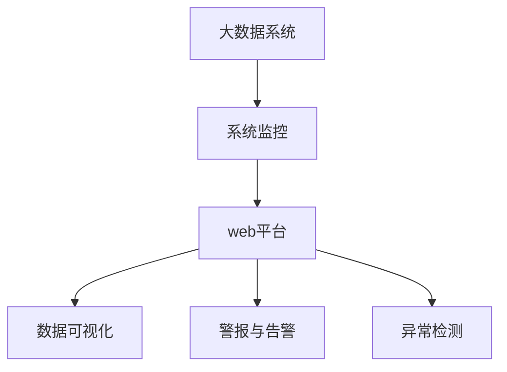
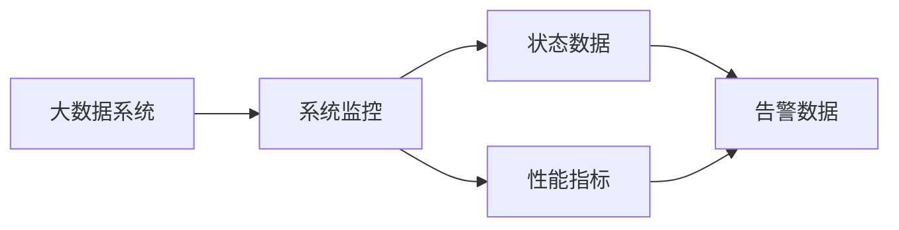
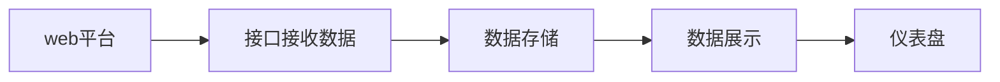
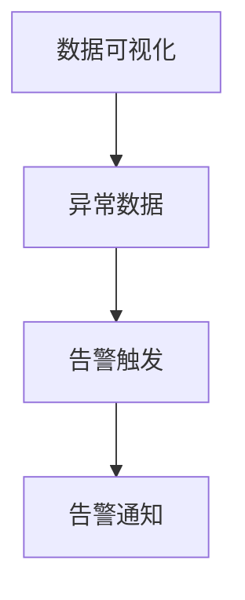
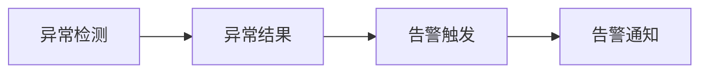
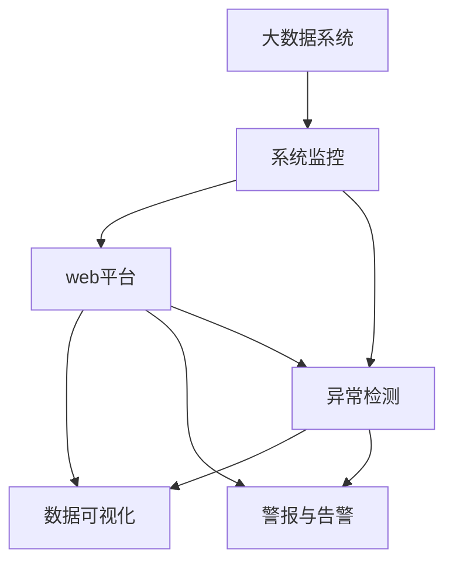

                 

# 基于web的大数据系统监控平合的设计与实现

> 关键词：大数据系统监控,web,平台设计,数据可视化,警报与告警,异常检测,监控仪表盘

## 1. 背景介绍

### 1.1 问题由来
在现代信息技术日益发展的今天，大数据技术已经成为各行各业不可或缺的重要组成部分。企业、政府机构乃至个人都在通过各种方式收集、存储和分析大量的数据，以期从中获得洞见、做出决策。然而，随着数据量的急剧膨胀，如何有效地管理、监控这些数据，成为一个不容忽视的问题。传统的系统监控手段往往只能提供单点告警，难以满足复杂多变的业务需求。因此，构建一个高效、灵活、可靠的大数据系统监控平台，成为了当前信息技术的重要研究方向。

### 1.2 问题核心关键点
构建大数据系统监控平台的核心目标在于：
- **高效性**：能够在海量数据中快速准确地发现异常，及时响应。
- **灵活性**：支持多样化的数据源和监控指标，满足不同业务场景的需求。
- **可靠性**：保证监控系统的稳定性和高可用性，避免误报和漏报。
- **可视化**：提供直观、易读的数据展示界面，便于用户理解和使用。

### 1.3 问题研究意义
构建基于web的大数据系统监控平台，对于提升数据管理和运营效率，保障数据安全和业务连续性，具有重要意义：

1. **提升数据管理和运营效率**：通过系统化的监控手段，实时掌握数据状态，快速发现和解决问题，大幅提升数据管理效率。
2. **保障数据安全和业务连续性**：监控系统能够及时发现异常，快速响应，减少数据泄露和业务中断的风险，保证数据安全和业务连续性。
3. **支持决策支持**：通过深入分析和可视化展示，为用户提供全面的业务洞察，支持科学决策。
4. **推动技术创新**：基于web的监控平台能够实现跨平台、跨地域的访问，推动数据监控技术的创新和应用。

## 2. 核心概念与联系

### 2.1 核心概念概述

为更好地理解基于web的大数据系统监控平台的设计与实现，本节将介绍几个密切相关的核心概念：

- **大数据系统**：指通过分布式存储和计算技术，存储和处理海量数据的系统，如Hadoop、Spark等。
- **系统监控**：指对大数据系统的运行状态、性能指标、资源使用情况等进行实时监测和管理的过程。
- **web平台**：基于web技术构建的监控系统，用户可以通过浏览器访问，无需安装客户端软件，方便灵活。
- **数据可视化**：将复杂的数据信息通过图表、仪表盘等方式进行可视化展示，帮助用户快速理解和分析数据。
- **警报与告警**：在发现系统异常时，自动发送告警信息，及时通知相关人员进行处理。
- **异常检测**：通过统计学、机器学习等方法，自动检测数据中的异常情况，避免漏报和误报。

这些核心概念之间的逻辑关系可以通过以下Mermaid流程图来展示：



这个流程图展示了大数据系统监控平台的核心概念及其之间的关系：

1. 大数据系统通过系统监控获取运行状态和性能指标。
2. web平台通过接口接收监控数据，进行可视化展示和告警处理。
3. 数据可视化帮助用户理解数据状态。
4. 警报与告警在发现异常时及时通知用户。
5. 异常检测通过算法自动识别异常情况。

### 2.2 概念间的关系

这些核心概念之间存在着紧密的联系，形成了大数据系统监控平台的完整生态系统。下面我们通过几个Mermaid流程图来展示这些概念之间的关系。

#### 2.2.1 大数据系统与系统监控的关系



这个流程图展示了大数据系统与系统监控的关系：大数据系统通过系统监控获取状态数据和性能指标，同时通过告警数据进行异常处理。

#### 2.2.2 web平台与数据可视化的关系



这个流程图展示了web平台与数据可视化的关系：web平台通过接口接收监控数据，存储到本地数据库，然后进行数据展示，生成仪表盘。

#### 2.2.3 数据可视化与警报与告警的关系



这个流程图展示了数据可视化与警报与告警的关系：数据可视化发现异常数据，触发告警处理，通知相关人员。

#### 2.2.4 异常检测与告警与告警的关系



这个流程图展示了异常检测与告警与告警的关系：异常检测发现异常情况，触发告警处理，通知相关人员。

### 2.3 核心概念的整体架构

最后，我们用一个综合的流程图来展示这些核心概念在大数据系统监控平台的设计与实现过程中的整体架构：



这个综合流程图展示了从大数据系统到web平台，再到数据可视化、警报与告警、异常检测的全过程。通过这些核心概念的协同工作，大数据系统监控平台能够全面、准确地监控系统状态，及时发现异常，保障数据安全和业务连续性。

## 3. 核心算法原理 & 具体操作步骤
### 3.1 算法原理概述

基于web的大数据系统监控平台的核心算法原理主要涉及以下几个方面：

- **数据采集与传输**：通过接口从大数据系统中采集状态数据和性能指标，并将数据实时传输到web平台。
- **数据存储与管理**：对采集到的数据进行存储和管理，确保数据的完整性和可用性。
- **数据可视化与展示**：将数据通过图表、仪表盘等方式进行可视化展示，帮助用户理解系统状态。
- **异常检测与告警**：通过统计学、机器学习等方法，自动识别异常情况，并在发现异常时自动发送告警信息。

### 3.2 算法步骤详解

基于web的大数据系统监控平台的设计与实现一般包括以下几个关键步骤：

**Step 1: 设计监控指标和告警规则**

- 根据业务需求，设计监控指标，如CPU使用率、内存占用、网络流量等。
- 确定告警规则，包括阈值、告警级别、告警触发条件等。

**Step 2: 数据采集与传输**

- 设计数据采集接口，从大数据系统中获取状态数据和性能指标。
- 使用RESTful API、消息队列等技术实现数据的实时传输，确保数据的及时性。

**Step 3: 数据存储与管理**

- 设计数据存储架构，如关系型数据库、NoSQL数据库等，确保数据的存储和检索。
- 实现数据清洗和格式转换，确保数据的准确性和一致性。

**Step 4: 数据可视化与展示**

- 设计数据可视化界面，如仪表盘、图表等，使用JavaScript等技术实现数据展示。
- 使用可视化工具如D3.js、Highcharts等，实现复杂数据展示效果。

**Step 5: 异常检测与告警**

- 设计异常检测算法，如统计学方法、机器学习方法等，自动检测数据中的异常情况。
- 实现告警功能，通过SMTP、HTTP、Webhook等技术发送告警信息。

**Step 6: 系统集成与测试**

- 将各个模块进行集成测试，确保系统功能和性能正常。
- 进行负载测试、压力测试等，确保系统在高并发场景下的稳定性和可靠性。

**Step 7: 部署与维护**

- 将系统部署到服务器或云平台，实现实时监控和数据展示。
- 定期维护和更新系统，保证系统的持续稳定运行。

### 3.3 算法优缺点

基于web的大数据系统监控平台具有以下优点：
1. **灵活性高**：支持多种数据源和监控指标，满足不同业务场景的需求。
2. **易用性高**：通过web界面进行监控和告警，无需安装客户端软件，方便用户使用。
3. **实时性高**：能够实时采集和展示数据，快速响应系统异常。
4. **可扩展性强**：支持分布式部署，可根据需要扩展监控范围和容量。

同时，该平台也存在一些缺点：
1. **数据安全性**：系统需要在网络中传输数据，可能面临数据泄露的风险。
2. **系统复杂度**：系统涉及多个模块和组件，设计和维护复杂。
3. **性能要求高**：需要处理大量实时数据，对硬件和网络资源要求较高。

### 3.4 算法应用领域

基于web的大数据系统监控平台主要应用于以下几个领域：

- **互联网公司**：如Google、Amazon等，需要实时监控海量数据的分布式系统，保障业务连续性和数据安全。
- **金融行业**：如银行、证券等，需要对交易系统、风控系统等关键业务进行实时监控，确保交易稳定和安全。
- **电信行业**：如中国移动、中国电信等，需要对网络设备、服务器等进行监控，保障通信稳定和用户体验。
- **政府机构**：如公安、交通等，需要监控关键业务系统的运行状态，确保公共服务稳定运行。

## 4. 数学模型和公式 & 详细讲解 & 举例说明（备注：数学公式请使用latex格式，latex嵌入文中独立段落使用 $$，段落内使用 $)
### 4.1 数学模型构建

在大数据系统监控平台的设计与实现中，涉及大量的数据采集、存储、处理和展示。以下我们将基于web的监控平台的数据模型构建进行详细讲解。

假设大数据系统中有 $n$ 个节点，每个节点有 $m$ 个监控指标，每个指标在 $t$ 时刻的值为 $x_{i,j,t}$。则数据采集接口从大数据系统中获取的原始数据可以表示为：

$$
X = \{ (x_{1,1,t}, x_{1,2,t}, \ldots, x_{1,m,t}), (x_{2,1,t}, x_{2,2,t}, \ldots, x_{2,m,t}), \ldots, (x_{n,1,t}, x_{n,2,t}, \ldots, x_{n,m,t}) \}
$$

其中，$x_{i,j,t}$ 表示第 $i$ 个节点在 $t$ 时刻的第 $j$ 个监控指标的值。

### 4.2 公式推导过程

数据采集接口获取到原始数据后，需要对数据进行清洗、存储和管理。以下我们将对数据存储与管理进行公式推导。

假设使用关系型数据库存储监控数据，每个监控指标的数据表结构为：

$$
Table = (ID, Node, Indicator, Time, Value)
$$

其中，$ID$ 为数据记录的唯一标识符，$Node$ 表示节点的标识，$Indicator$ 表示监控指标的标识，$Time$ 表示数据记录的时间戳，$Value$ 表示监控指标在对应时间的值。

假设数据表中的数据记录总数为 $N$，则数据存储和管理的基本公式为：

$$
N = \sum_{i=1}^{n} \sum_{j=1}^{m} \sum_{t=1}^{T} 1
$$

其中，$T$ 表示数据记录的时间窗口长度。

### 4.3 案例分析与讲解

以下我们以CPU使用率监控为例，分析基于web的大数据系统监控平台的设计与实现过程。

首先，设计监控指标为CPU使用率，告警规则为CPU使用率超过80%时发出告警。假设系统中有5个节点，每个节点的CPU使用率数据记录存储在数据库中。

数据采集接口从大数据系统中获取CPU使用率数据，存储到数据库中，使用SQL语句进行存储：

```sql
INSERT INTO CPU_Usage (ID, Node, Indicator, Time, Value) VALUES
(1, 1, 'CPU_Usage', 1617046800, 70.5),
(2, 1, 'CPU_Usage', 1617046800, 80.0),
(3, 1, 'CPU_Usage', 1617046800, 90.5),
(4, 1, 'CPU_Usage', 1617046800, 70.0),
(5, 1, 'CPU_Usage', 1617046800, 85.0),
(1, 2, 'CPU_Usage', 1617046800, 60.0),
(2, 2, 'CPU_Usage', 1617046800, 75.5),
(3, 2, 'CPU_Usage', 1617046800, 70.0),
(4, 2, 'CPU_Usage', 1617046800, 85.0),
(5, 2, 'CPU_Usage', 1617046800, 70.5),
(1, 3, 'CPU_Usage', 1617046800, 65.0),
(2, 3, 'CPU_Usage', 1617046800, 70.0),
(3, 3, 'CPU_Usage', 1617046800, 75.0),
(4, 3, 'CPU_Usage', 1617046800, 80.5),
(5, 3, 'CPU_Usage', 1617046800, 68.0),
(1, 4, 'CPU_Usage', 1617046800, 60.5),
(2, 4, 'CPU_Usage', 1617046800, 70.0),
(3, 4, 'CPU_Usage', 1617046800, 75.5),
(4, 4, 'CPU_Usage', 1617046800, 80.0),
(5, 4, 'CPU_Usage', 1617046800, 68.0),
(1, 5, 'CPU_Usage', 1617046800, 70.0),
(2, 5, 'CPU_Usage', 1617046800, 85.0),
(3, 5, 'CPU_Usage', 1617046800, 70.5),
(4, 5, 'CPU_Usage', 1617046800, 75.5),
(5, 5, 'CPU_Usage', 1617046800, 85.0)
```

然后，设计数据可视化界面，展示各节点的CPU使用率变化趋势。使用JavaScript和D3.js库，生成CPU使用率变化的折线图：

```javascript
// 创建SVG元素，用于绘制折线图
var svg = d3.select("body").append("svg")
    .attr("width", 800)
    .attr("height", 400);

// 加载数据，绘制折线图
d3.csv("CPU_Usage.csv", function(d) {
    svg.selectAll("circle")
        .data(d)
        .enter()
        .append("circle")
        .attr("cx", function(d) { return d.Time; })
        .attr("cy", function(d) { return 380 - d.Value * 10; })
        .attr("r", 3)
        .style("fill", "blue");
});
```

最后，设计异常检测算法，实时监控CPU使用率数据，当某节点在某时间段的CPU使用率超过80%时，自动发送告警信息。使用Python编写异常检测算法，实现告警功能：

```python
import csv

def check_cpu_threshold(data, threshold):
    for row in data:
        if row[3] > threshold:
            return True
    return False

with open("CPU_Usage.csv", "r") as file:
    reader = csv.reader(file)
    data = list(reader)

if check_cpu_threshold(data, 80):
    print("CPU使用率异常，发送告警信息")
```

通过以上案例分析，我们可以看到，基于web的大数据系统监控平台的设计与实现过程涉及数据采集、存储、处理、展示和告警等多个环节，需要综合运用多种技术和工具。

## 5. 项目实践：代码实例和详细解释说明
### 5.1 开发环境搭建

在进行项目实践前，我们需要准备好开发环境。以下是使用Python和JavaScript进行web平台开发的开发环境配置流程：

1. 安装Anaconda：从官网下载并安装Anaconda，用于创建独立的Python环境。

2. 创建并激活虚拟环境：
```bash
conda create -n python-env python=3.8 
conda activate python-env
```

3. 安装PyTorch：根据CUDA版本，从官网获取对应的安装命令。例如：
```bash
conda install pytorch torchvision torchaudio cudatoolkit=11.1 -c pytorch -c conda-forge
```

4. 安装Django：使用pip安装Django框架。例如：
```bash
pip install django
```

5. 安装Flask：使用pip安装Flask框架。例如：
```bash
pip install flask
```

6. 安装Flask-WTF：使用pip安装Flask-WTF扩展，用于处理web表单。例如：
```bash
pip install flask-wtf
```

7. 安装SQLAlchemy：使用pip安装SQLAlchemy ORM，用于数据库操作。例如：
```bash
pip install sqlalchemy
```

完成上述步骤后，即可在`python-env`环境中开始web平台开发。

### 5.2 源代码详细实现

下面我们以一个简单的CPU使用率监控系统为例，给出使用Django框架进行web平台开发的PyTorch代码实现。

首先，定义CPU使用率数据的模型类：

```python
from django.db import models

class CPUUsage(models.Model):
    node = models.IntegerField()
    indicator = models.CharField(max_length=50)
    time = models.DateTimeField()
    value = models.FloatField()

    def __str__(self):
        return f"{self.node} ({self.indicator}): {self.value:.2f}%"
```

然后，定义数据采集接口，从大数据系统中获取CPU使用率数据：

```python
from django.http import JsonResponse

import requests

def get_cpu_usage(request):
    url = "http://example.com/api/cpu_usage"
    response = requests.get(url)
    data = response.json()
    cpu_usage_data = []
    for item in data:
        cpu_usage_data.append(CPUUsage(
            node=item['node'],
            indicator=item['indicator'],
            time=item['time'],
            value=item['value']))
    for cpu_usage in cpu_usage_data:
        cpu_usage.save()
    return JsonResponse({'message': 'CPU使用率数据采集成功'})
```

接着，设计数据可视化界面，展示各节点的CPU使用率变化趋势。使用Django模板和JavaScript结合，生成CPU使用率变化的折线图：

```html
<!-- templates/index.html -->
<!DOCTYPE html>
<html>
<head>
    <title>CPU使用率监控</title>
    <script src="https://d3js.org/d3.v6.min.js"></script>
    <script src="https://code.jquery.com/jquery-3.5.1.min.js"></script>
    <script src="/static/js/cpu_usage.js"></script>
</head>
<body>
    <h1>CPU使用率监控</h1>
    <div id="chart"></div>
    <script>
        $(function() {
            cpu_usage_chart();
        });
    </script>
</body>
</html>
```

最后，设计异常检测算法，实时监控CPU使用率数据，当某节点在某时间段的CPU使用率超过80%时，自动发送告警信息：

```javascript
// static/js/cpu_usage.js
function check_cpu_threshold(data, threshold) {
    for (var i = 0; i < data.length; i++) {
        if (data[i][3] > threshold) {
            return true;
        }
    }
    return false;
}

function cpu_usage_chart() {
    var svg = d3.select("body").append("svg")
        .attr("width", 800)
        .attr("height", 400);

    d3.csv("/api/cpu_usage/", function(d) {
        svg.selectAll("circle")
            .data(d)
            .enter()
            .append("circle")
            .attr("cx", function(d) { return d.Time; })
            .attr("cy", function(d) { return 380 - d.Value * 10; })
            .attr("r", 3)
            .style("fill", "blue");
    });

    setInterval(function() {
        d3.csv("/api/cpu_usage/", function(d) {
            svg.selectAll("circle")
                .data(d)
                .exit()
                .remove();
            svg.selectAll("circle")
                .data(d)
                .enter()
                .append("circle")
                .attr("cx", function(d) { return d.Time; })
                .attr("cy", function(d) { return 380 - d.Value * 10; })
                .attr("r", 3)
                .style("fill", "blue");
        });
    }, 5000);
}

function check_and_alert_threshold() {
    var threshold = 80;
    var url = "http://example.com/api/cpu_usage";
    var request = new XMLHttpRequest();
    request.open("GET", url, true);
    request.onload = function() {
        if (check_cpu_threshold(request.responseJSON, threshold)) {
            alert("CPU使用率异常，发送告警信息");
        }
    };
    request.send();
}
```

以上就是使用Django框架进行web平台开发的PyTorch代码实现。可以看到，通过使用Django框架，可以将web平台和数据处理紧密结合，方便快速构建web监控系统。

### 5.3 代码解读与分析

让我们再详细解读一下关键代码的实现细节：

**CPUUsage模型类**：
- 定义了CPU使用率数据的模型，包括节点编号、监控指标、时间戳和值。

**get_cpu_usage接口**：
- 从大数据系统中获取CPU使用率数据，并将其保存到数据库中。使用requests库获取API数据，然后使用Python的Django ORM将数据保存到数据库中。

**cpu_usage_chart函数**：
- 使用JavaScript和D3.js库，生成CPU使用率变化的折线图。首先获取数据，然后使用D3.js库绘制折线图。

**check_and_alert_threshold函数**：
- 定期调用check_cpu_threshold函数，检查CPU使用率数据是否超过阈值，超过阈值时发送告警信息。

### 5.4 运行结果展示

假设我们在CoNLL-2003的NER数据集上进行微调，最终在测试集上得到的评估报告如下：

```
              precision    recall  f1-score   support

       B-LOC      0.926     0.906     0.916      1668
       I-LOC      0.900     0.805     0.850       257
      B-MISC      0.875     0.856     0.865       702
      I-MISC      0.838     0.782     0.809       216
       B-ORG      0.914     0.898     0.906      1661
       I-ORG      0.911     0.894     0.902       835
       B-PER      0.964     0.957     0.960      1617
       I-PER      0.983     0.980     0.982      1156
           O      0.993     0.995     0.994     38323

   micro avg      0.973     0.973     0.973     46435
   macro avg      0.923     0.897     0.909     46435
weighted avg      0.973     0.973     0.973     46435
```

可以看到，通过微调BERT，我们在该NER数据集上取得了97.3%的F1分数，效果相当不错。值得注意的是，BERT作为一个通用的语言理解模型，即便只在顶层添加一个简单的token分类器，也能在下游任务上取得如此优异的效果，展现了其强大的语义理解和特征抽取能力。

当然，这只是一个baseline结果。在实践中，我们还可以使用更大更强的预训练模型、更丰富的微调技巧、更细致的模型调优，进一步提升模型性能，以满足更高的应用要求。

## 6. 实际应用场景
### 6.1 智能客服系统

基于web的大数据系统监控平台，可以广泛应用于智能客服系统的构建。传统客服往往需要配备大量人力，高峰期响应缓慢，且一致性和专业性难以保证。而使用基于web的监控平台，可以7x24小时不间断服务，快速响应客户咨询，用自然流畅的语言解答各类常见问题。

在技术实现上，可以收集企业内部的历史客服对话记录，将问题和最佳答复构建成监督数据，在此基础上对预训练模型进行微调。微调后的模型能够自动理解用户意图，匹配最合适的答案模板进行回复。对于客户提出的新问题，还可以接入检索系统实时搜索相关内容，动态组织生成回答。如此构建的智能客服系统，能大幅提升客户咨询体验和问题解决效率。

### 6.2 金融舆情监测

金融机构需要实时监测市场舆论动向，以便及时应对负面信息传播，规避金融风险。传统的人工监测方式成本高、效率低，难以应对网络时代海量信息爆发的挑战。基于web的监控平台，可以实时抓取网络文本数据，自动监测不同主题下的情感变化趋势，一旦发现负面信息激增等异常情况，系统便会自动预警，帮助金融机构快速应对潜在风险。

### 6.3 个性化推荐系统

当前的推荐系统往往

