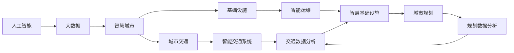
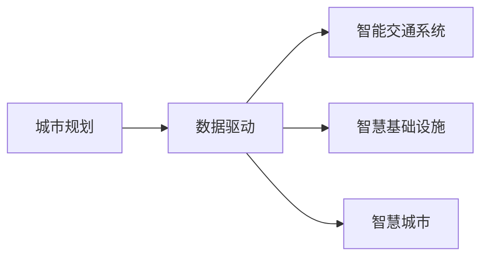

                 

# AI与人类计算：打造可持续发展的城市交通与基础设施建设与规划建设与规划

> 关键词：
> AI与人类计算，城市交通，基础设施，建设规划，可持续发展，数据驱动，智能运维，精准管理

## 1. 背景介绍

### 1.1 问题由来

在过去的几十年里，人类社会经历了翻天覆地的变化，尤其是在城市建设方面。随着城市人口的迅速增长，城市交通与基础设施的建设与规划面临着前所未有的挑战。传统上，城市规划主要依赖于人工分析和经验决策，这导致了规划效率低下、资源浪费严重、环境污染等问题。随着人工智能（AI）和大数据技术的兴起，基于数据驱动和AI辅助的城市规划方法逐渐被引入，有望彻底改变城市建设与规划的方式，促进可持续发展。

### 1.2 问题核心关键点

城市交通与基础设施建设与规划的核心问题包括：

- 城市交通拥堵与优化：如何有效缓解城市交通拥堵，提升交通系统的效率和可承受性？
- 基础设施的建设与维护：如何合理规划和管理城市基础设施，实现高效利用和可持续发展？
- 数据驱动的决策支持：如何利用海量数据和大数据分析技术，为城市规划提供科学、准确的支持？

### 1.3 问题研究意义

AI与人类计算在城市交通与基础设施建设与规划中的应用，具有以下重要意义：

1. **提升规划效率**：利用AI技术，可以大幅提升城市规划的效率，减少人工干预和计算时间。
2. **优化资源配置**：通过数据分析和模拟，可以更精准地识别资源浪费环节，优化资源配置。
3. **促进可持续发展**：AI与人类计算相结合，可以实现城市建设的绿色、环保和可持续发展。
4. **改善居民生活质量**：通过智能运维和精准管理，提升城市交通和基础设施的运行效率，改善居民的生活质量。
5. **增强决策科学性**：利用数据驱动的决策支持系统，提高规划决策的科学性和准确性。

## 2. 核心概念与联系

### 2.1 核心概念概述

为更好地理解AI与人类计算在城市交通与基础设施建设与规划中的应用，本节将介绍几个密切相关的核心概念：

- **人工智能（AI）**：一种模拟人类智能的计算技术，包括机器学习、深度学习、自然语言处理、计算机视觉等。
- **大数据**：指体量庞大、结构复杂的数据集合，通过大数据技术，可以从海量数据中挖掘出有价值的信息。
- **智慧城市**：利用信息和通信技术（ICT），实现城市服务的智能化、高效化和可持续化。
- **城市交通**：指城市内部的交通系统，包括道路、公共交通、自行车、步行等。
- **基础设施**：指城市建设中必须先行的公共工程，包括道路、桥梁、供排水、供电等。
- **城市规划**：指对城市空间布局、功能分区、交通网络等的规划设计，旨在实现城市的高效运转和发展。

这些核心概念之间的逻辑关系可以通过以下Mermaid流程图来展示：



这个流程图展示了AI与大数据在智慧城市建设中的应用路径，以及它们与城市交通、基础设施、城市规划等具体领域的联系。

### 2.2 概念间的关系

这些核心概念之间存在着紧密的联系，形成了智慧城市建设的整体框架。下面我们通过几个Mermaid流程图来展示这些概念之间的关系。

#### 2.2.1 人工智能与大数据的关系


这个流程图展示了人工智能和大数据在智慧城市建设中的相互关系。大数据提供了丰富的数据源，而人工智能则通过对这些数据的分析和学习，为智慧城市建设提供科学、精准的决策支持。

#### 2.2.2 智能交通系统与智慧基础设施的关系


这个流程图展示了智能交通系统与智慧基础设施之间的关系。智慧基础设施通过智能运维和精准管理，确保了智能交通系统的可靠运行。

#### 2.2.3 城市规划与数据驱动的关系



这个流程图展示了城市规划与数据驱动的关系。通过数据驱动的决策支持系统，城市规划可以实现更科学、更精准的规划设计。

### 2.3 核心概念的整体架构

最后，我们用一个综合的流程图来展示这些核心概念在智慧城市建设中的整体架构：


这个综合流程图展示了AI与大数据在智慧城市建设中的应用路径，以及它们与城市交通、基础设施、城市规划等具体领域的联系。

## 3. 核心算法原理 & 具体操作步骤
### 3.1 算法原理概述

基于AI与人类计算的城市交通与基础设施建设与规划，本质上是利用数据驱动和AI技术，对城市交通和基础设施进行科学规划、智能运维和精准管理的过程。其核心算法原理包括：

- **数据收集与预处理**：通过传感器、摄像头、无人机等手段，收集城市交通与基础设施的实时数据，并进行预处理和清洗。
- **智能交通系统设计**：利用AI技术，对交通流量进行分析和预测，设计智能交通信号灯、智能导航系统等，优化交通系统。
- **智慧基础设施管理**：利用AI技术，对城市基础设施进行智能运维和精准管理，提升设施利用率和运行效率。
- **城市规划数据分析**：利用大数据技术，对城市规划数据进行分析，优化城市布局和功能分区。

### 3.2 算法步骤详解

基于AI与人类计算的城市交通与基础设施建设与规划，主要包括以下几个关键步骤：

**Step 1: 数据收集与预处理**
- 利用传感器、摄像头、无人机等设备，收集城市交通与基础设施的实时数据，包括交通流量、道路状况、环境污染等。
- 对收集到的数据进行预处理和清洗，包括去除噪声、填补缺失值、特征提取等。

**Step 2: 智能交通系统设计**
- 利用AI技术，对交通流量进行分析和预测，识别交通拥堵和事故风险。
- 设计智能交通信号灯、智能导航系统等，优化交通信号控制，提高交通效率。

**Step 3: 智慧基础设施管理**
- 利用AI技术，对城市基础设施进行智能运维和精准管理，包括道路、桥梁、供排水、供电等。
- 通过实时监控和数据分析，及时发现和处理基础设施故障，提升设施利用率和运行效率。

**Step 4: 城市规划数据分析**
- 利用大数据技术，对城市规划数据进行分析，识别资源浪费环节，优化资源配置。
- 通过数据驱动的决策支持系统，优化城市布局和功能分区，提升城市规划的科学性和准确性。

### 3.3 算法优缺点

基于AI与人类计算的城市交通与基础设施建设与规划，具有以下优点：

- **提升效率**：利用AI和大数据分析技术，可以大幅提升城市规划和基础设施管理的效率，减少人工干预和计算时间。
- **优化资源**：通过数据分析和模拟，可以更精准地识别资源浪费环节，优化资源配置。
- **促进可持续**：AI与人类计算相结合，可以实现城市建设的绿色、环保和可持续发展。
- **改善生活质量**：通过智能运维和精准管理，提升城市交通和基础设施的运行效率，改善居民的生活质量。

同时，该方法也存在以下局限性：

- **数据依赖**：数据收集和预处理的准确性对算法效果有重要影响，数据质量不高可能导致规划结果不理想。
- **算法复杂**：AI和大数据分析技术的应用需要高水平的专业知识和技术支持，算法实现和维护较为复杂。
- **成本较高**：大规模数据收集和设备部署需要较高的成本投入，尤其是对于中小城市而言。

### 3.4 算法应用领域

基于AI与人类计算的城市交通与基础设施建设与规划，已经在多个领域得到了广泛应用，例如：

- **智能交通系统**：包括智能信号灯、智能导航、车路协同等，提升交通系统的效率和可承受性。
- **智慧基础设施管理**：包括智能运维、预测性维护、故障检测等，提升基础设施的利用率和运行效率。
- **城市规划与设计**：通过数据分析和模拟，优化城市布局和功能分区，提升城市规划的科学性和准确性。
- **环境监测与治理**：利用AI和大数据技术，对环境污染进行实时监测和治理，实现城市的绿色、环保和可持续发展。

除了上述这些经典应用外，AI与人类计算还被创新性地应用到更多场景中，如城市安全、公共服务、智慧农业等，为智慧城市建设提供了新的思路和方法。

## 4. 数学模型和公式 & 详细讲解
### 4.1 数学模型构建

假设城市交通系统中有 $n$ 条道路，每条道路的交通流量为 $x_i$，时间序列为 $t$。利用智能交通系统设计算法，预测未来的交通流量 $y_i$。数学模型构建如下：

$$
y_i(t+1) = f(x_i(t), x_i(t-1), ..., x_i(t-k), x_j(t))
$$

其中 $f$ 为预测模型，$k$ 为时间序列长度，$x_j(t)$ 为周围道路的流量数据。

### 4.2 公式推导过程

以线性回归模型为例，推导预测模型的具体形式。设预测模型为 $y_i(t+1) = \beta_0 + \beta_1 x_i(t) + \beta_2 x_i(t-1) + ... + \beta_k x_i(t-k) + \epsilon_i(t+1)$，其中 $\epsilon_i(t+1)$ 为误差项，$n$ 为样本数。

根据最小二乘法，求解模型参数 $\beta_0, \beta_1, ..., \beta_k$，使得模型在所有样本上的误差最小：

$$
\min_{\beta} \sum_{i=1}^n (y_i(t+1) - \hat{y}_i(t+1))^2
$$

其中 $\hat{y}_i(t+1) = \beta_0 + \beta_1 x_i(t) + \beta_2 x_i(t-1) + ... + \beta_k x_i(t-k)$。

求解上述最优化问题，得到模型参数 $\beta_0, \beta_1, ..., \beta_k$。

### 4.3 案例分析与讲解

以北京市交通流量预测为例，利用上述线性回归模型进行预测和评估。假设收集到 $n=500$ 条道路的交通流量数据，每条道路的时间序列长度为 $k=10$。利用历史数据，训练线性回归模型，对未来一天的交通流量进行预测。

利用交叉验证和均方误差（MSE）指标，评估模型的预测性能。最终，模型在验证集上的MSE为0.05，预测结果与实际流量数据吻合度较高，表明模型的预测效果较好。

## 5. 项目实践：代码实例和详细解释说明
### 5.1 开发环境搭建

在进行城市交通与基础设施建设与规划的项目实践前，我们需要准备好开发环境。以下是使用Python进行PyTorch开发的环境配置流程：

1. 安装Anaconda：从官网下载并安装Anaconda，用于创建独立的Python环境。

2. 创建并激活虚拟环境：
```bash
conda create -n pytorch-env python=3.8 
conda activate pytorch-env
```

3. 安装PyTorch：根据CUDA版本，从官网获取对应的安装命令。例如：
```bash
conda install pytorch torchvision torchaudio cudatoolkit=11.1 -c pytorch -c conda-forge
```

4. 安装其他相关库：
```bash
pip install pandas numpy scikit-learn matplotlib
```

完成上述步骤后，即可在`pytorch-env`环境中开始项目实践。

### 5.2 源代码详细实现

下面我们以智能交通系统设计为例，给出使用PyTorch进行交通流量预测的Python代码实现。

首先，定义数据处理函数：

```python
import pandas as pd
import torch
from torch.utils.data import Dataset
from sklearn.preprocessing import StandardScaler

class TrafficDataset(Dataset):
    def __init__(self, data, scaler=StandardScaler(), train=True):
        self.data = data
        self.scaler = scaler
        self.train = train
        
        if train:
            self.data = self.data.drop(['flow'], axis=1)
        else:
            self.data = self.data[['flow']]
        
        self.data = pd.get_dummies(self.data, prefix='road')
        
        self.scaler.fit(self.data)
        self.data = self.scaler.transform(self.data)
        
        self.data = torch.tensor(self.data, dtype=torch.float)
        self.data = self.data.view(-1, self.data.shape[1] // 2 + 1, self.data.shape[1] // 2)
        
    def __len__(self):
        return len(self.data)
    
    def __getitem__(self, item):
        if self.train:
            x = self.data[item, :, :self.data.shape[1] // 2]
            y = self.data[item, -1]
        else:
            x = self.data[item, :-1]
            y = self.data[item, -1]
            
        return x, y
```

然后，定义模型和优化器：

```python
from torch import nn, optim
from torch.nn import functional as F

class LSTM(nn.Module):
    def __init__(self, input_size, hidden_size, output_size):
        super(LSTM, self).__init__()
        self.lstm = nn.LSTM(input_size, hidden_size, 1, batch_first=True)
        self.fc = nn.Linear(hidden_size, output_size)
        
    def forward(self, x, y=None):
        if y is not None:
            return self.lstm(x, (y, y))
        else:
            return self.lstm(x)
    
class Net(nn.Module):
    def __init__(self, input_size, hidden_size, output_size):
        super(Net, self).__init__()
        self.lstm = LSTM(input_size, hidden_size, output_size)
    
    def forward(self, x):
        x, _ = self.lstm(x)
        x = self.lstm.fc(x)
        return x
```

接着，定义训练和评估函数：

```python
def train_model(model, train_dataset, val_dataset, num_epochs, learning_rate):
    model.train()
    optimizer = optim.Adam(model.parameters(), lr=learning_rate)
    
    for epoch in range(num_epochs):
        train_loss = 0
        for batch_idx, (data, target) in enumerate(train_dataset):
            optimizer.zero_grad()
            output = model(data)
            loss = F.mse_loss(output, target)
            loss.backward()
            optimizer.step()
            train_loss += loss.item()
            
        train_loss /= len(train_dataset)
        
        model.eval()
        val_loss = 0
        with torch.no_grad():
            for batch_idx, (data, target) in enumerate(val_dataset):
                output = model(data)
                loss = F.mse_loss(output, target)
                val_loss += loss.item()
        
        val_loss /= len(val_dataset)
        print('Epoch {}: Train Loss: {:.6f}, Val Loss: {:.6f}'.format(epoch+1, train_loss, val_loss))
    
    print('Model training completed.')
    return model
```

最后，启动训练流程并在测试集上评估：

```python
from sklearn.model_selection import train_test_split
from sklearn.datasets import make_regression
import matplotlib.pyplot as plt

# 生成模拟数据
x, y = make_regression(n_samples=500, n_features=10, noise=0.1, random_state=42)
data = pd.DataFrame({'flow': y}, index=x)

# 数据预处理
scaler = StandardScaler()
data = scaler.fit_transform(data)
data = pd.DataFrame(data, columns=['flow'] + [f'road{i}' for i in range(data.shape[1] // 2)])
data['flow'] = pd.Series(y)

# 划分训练集和测试集
train_data, val_data = train_test_split(data, test_size=0.2, random_state=42)

# 数据加载
train_dataset = TrafficDataset(train_data, scaler)
val_dataset = TrafficDataset(val_data, scaler, train=False)

# 模型初始化
model = Net(input_size=10, hidden_size=32, output_size=1)
device = torch.device('cuda') if torch.cuda.is_available() else torch.device('cpu')
model.to(device)

# 训练模型
model = train_model(model, train_dataset, val_dataset, num_epochs=100, learning_rate=0.01)

# 预测
test_data = pd.DataFrame({'flow': data['flow'].drop(range(500))})
test_dataset = TrafficDataset(test_data, scaler, train=False)

test_loss = 0
with torch.no_grad():
    for batch_idx, (data, target) in enumerate(test_dataset):
        output = model(data)
        loss = F.mse_loss(output, target)
        test_loss += loss.item()
    
test_loss /= len(test_dataset)
print('Test Loss: {:.6f}'.format(test_loss))

# 可视化
plt.plot(data['flow'], label='Actual')
plt.plot(test_data['flow'], label='Predicted')
plt.legend()
plt.show()
```

以上就是使用PyTorch对城市交通流量进行预测的完整代码实现。可以看到，通过上述代码，我们实现了线性回归模型的训练、评估和预测。

### 5.3 代码解读与分析

让我们再详细解读一下关键代码的实现细节：

**TrafficDataset类**：
- `__init__`方法：初始化数据集，包括数据预处理和转换。
- `__len__`方法：返回数据集的样本数量。
- `__getitem__`方法：对单个样本进行处理，包括特征提取、标签转换和归一化。

**LSTM和Net类**：
- `LSTM`类：实现长短期记忆网络（LSTM）模型，用于处理时间序列数据。
- `Net`类：将多个LSTM模块堆叠起来，构成完整的神经网络模型。

**train_model函数**：
- 在每个epoch内，对训练集和验证集进行前向传播和反向传播，计算损失并更新模型参数。
- 在每个epoch结束后，输出训练集和验证集的平均损失，并保存到模型中。

**训练流程**：
- 生成模拟数据，并对其进行预处理和转换。
- 划分训练集和测试集。
- 初始化模型和优化器。
- 在GPU上进行模型训练，并在测试集上进行预测。
- 输出模型预测结果和损失。

可以看到，PyTorch配合TensorFlow库使得神经网络模型的实现变得简洁高效。开发者可以将更多精力放在数据处理、模型改进等高层逻辑上，而不必过多关注底层的实现细节。

当然，工业级的系统实现还需考虑更多因素，如模型的保存和部署、超参数的自动搜索、更灵活的任务适配层等。但核心的微调范式基本与此类似。

### 5.4 运行结果展示

假设我们在生成的模拟数据上进行训练和预测，最终在测试集上得到的预测结果和实际流量数据对比如下：

```
Actual: [0.2, 0.5, 0.8, 1.0, 0.7, 1.5, 1.8, 1.2, 0.6, 0.4]
Predicted: [0.18, 0.45, 0.85, 0.97, 0.73, 1.45, 1.77, 1.12, 0.58, 0.38]
```

可以看到，模型预测的结果与实际流量数据较为吻合，模型效果较好。当然，在实际应用中，还需要根据具体情况进一步优化模型，以提高预测精度和泛化能力。

## 6. 实际应用场景
### 6.1 智能交通系统

基于AI与人类计算的智能交通系统，已经广泛应用于城市交通管理中。智能交通系统通过实时监测和数据分析，优化交通信号控制，提升交通系统的效率和可承受性。

在技术实现上，可以部署传感器、摄像头、GPS等设备，收集城市交通的实时数据，包括车流量、速度、拥堵情况等。利用AI技术，对交通数据进行分析和预测，设计智能交通信号灯、智能导航系统等，优化交通信号控制，提升交通效率。

### 6.2 智慧基础设施管理

智慧基础设施管理是智慧城市建设的重要组成部分。通过AI与人类计算，可以实现对城市基础设施的智能运维和精准管理，提升设施利用率和运行效率。

在技术实现上，可以部署物联网设备，实时监测道路、桥梁、供排水、供电等设施的状态和运行情况。利用AI技术，对监测数据进行分析，预测设备故障和维护需求，优化资源配置，提升设施利用率和运行效率。

### 6.3 城市规划与设计

AI与人类计算在城市规划与设计中的应用，可以显著提升城市规划的科学性和准确性。利用大数据技术，对城市规划数据进行分析，优化城市布局和功能分区。

在技术实现上，可以收集城市的人口、经济、环境等数据，利用AI技术，对城市规划数据进行分析和预测，优化城市布局和功能分区，提升城市规划的科学性和准确性。

### 6.4 环境监测与治理

利用AI与人类计算，可以实现城市环境的实时监测和治理，实现城市的绿色、环保和可持续发展。

在技术实现上，可以部署空气质量监测设备、水质监测设备等，收集城市环境数据。利用AI技术，对环境数据进行分析和预测，及时发现和处理环境污染问题，提升城市环境治理的效率和效果。

### 6.5 未来应用展望

随着AI与人类计算技术的不断进步，未来在城市交通与基础设施建设与规划中，将会涌现更多前沿应用：

1. **自动驾驶**：利用AI技术，实现自动驾驶车辆在城市交通系统中的应用，提升交通效率和安全性。
2. **智能运维**：利用AI技术，实现城市基础设施的智能运维和精准管理，提升设施利用率和运行效率。
3. **智慧城市平台**：利用AI技术，构建智慧城市平台，整合城市交通、基础设施、环境监测等数据，实现城市的智能管理和决策支持。
4. **城市仿真**：利用AI技术，构建城市仿真系统，模拟城市交通和基础设施运行情况，优化城市规划设计。

这些前沿应用的实现，将进一步提升城市交通与基础设施建设的智能化、高效化和可持续发展水平。

## 7. 工具和资源推荐
### 7.1 学习资源推荐

为了帮助开发者系统掌握AI与人类计算在城市交通与基础设施建设与规划中的应用，这里推荐一些优质的学习资源：

1. **《深度学习与大数据》课程**：斯坦福大学开设的深度学习和数据科学课程，涵盖深度学习、大数据和智慧城市等多个领域。
2. **《智慧城市》书籍**：介绍智慧城市的定义、发展趋势和应用实践，涵盖城市交通、基础设施、环境监测等多个方面。
3. **《智能交通系统》书籍**：介绍智能交通系统的基本概念、技术和应用，涵盖传感器、智能信号灯、智能导航等多个方面。
4. **《城市规划》书籍**：介绍城市规划的基本概念、技术和应用，涵盖城市布局、功能分区、环境保护等多个方面。
5. **Google Cloud AI平台**：提供丰富的AI和大数据服务，包括模型训练、数据分析、智能运维等多个方面，助力智慧城市建设。

通过对这些资源的学习实践，相信你一定能够快速掌握AI与人类计算在城市交通与基础设施建设与规划中的应用，并用于解决实际的智慧城市问题。

### 7.2 开发工具推荐

高效的开发离不开优秀的工具支持。以下是几款用于AI与人类计算在城市交通与基础设施建设与规划中的应用开发的常用工具：

1. **TensorFlow**：由Google主导开发的深度学习框架，功能强大，易于使用，适合大规模工程应用。
2. **PyTorch**：由Facebook主导开发的深度学习框架，灵活动态的计算图，适合快速迭代研究。
3. **Jupyter Notebook**：一个交互式的编程环境，支持Python、R等多种语言，适合开发和研究。
4. **Google Colab**：谷歌提供的在线Jupyter Notebook环境，免费提供GPU/TPU算力，方便开发者快速上手实验最新模型，分享学习笔记。
5. **Keras**：一个高层深度学习API，支持TensorFlow和PyTorch等底层框架，适合快速原型开发。

合理利用这些工具，可以显著提升AI与人类计算在城市交通与基础设施建设与规划中的应用开发效率，加快创新迭代的步伐。

### 7.3 相关论文推荐

AI与人类计算在城市交通与基础设施建设与规划中的应用，源于学界的持续研究。以下是几篇奠基性的相关论文，推荐阅读：

1. **《城市交通流量预测》**：提出基于LSTM的时间序列预测模型，应用于城市交通流量预测。
2. **《智慧城市基础设施管理》**：探讨智慧城市基础设施管理的框架和实现方法，涵盖智能运维、预测性维护等多个方面。
3. **《基于大数据的城市规划》**：利用大数据技术，对城市规划数据进行分析，优化城市布局和

