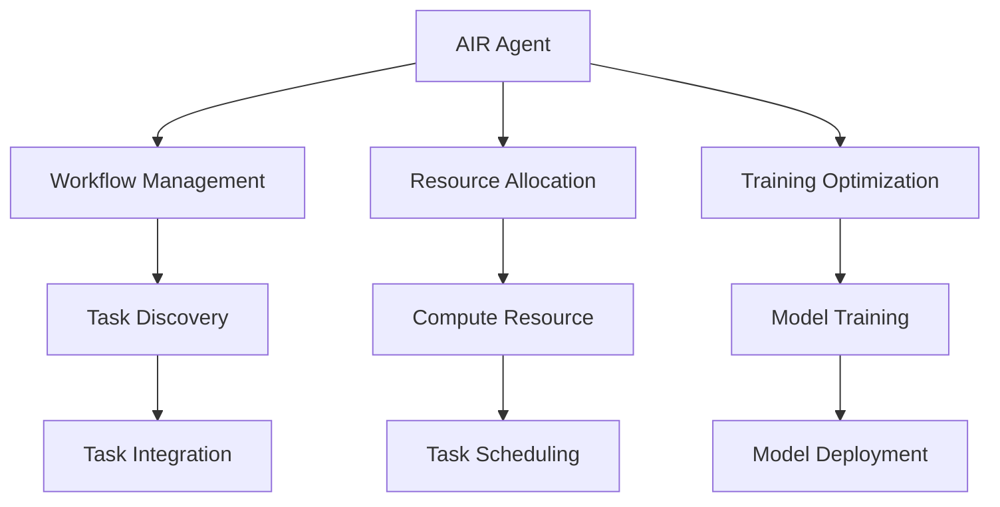

                 

# AI人工智能代理工作流AI Agent WorkFlow：机器学习中代理工作流的优化技巧

> 关键词：人工智能代理(AI Agents), 工作流(Workflow), 机器学习(Machine Learning), 优化(Optimization), 自动化(Automation)

## 1. 背景介绍

### 1.1 问题由来
在机器学习领域，如何高效构建和管理大规模数据工作流，以及如何优化机器学习模型的训练过程，是长期以来困扰研究者与工程师的重要问题。随着数据规模的爆炸性增长，传统的工作流管理和模型训练方法已难以满足需求，亟需新的解决方案。

人工智能代理(AI Agents)在工作流自动化与优化方面展现出巨大潜力，被广泛用于分布式计算、数据处理、模型训练等领域。它们可以自主地管理任务、调度资源、协调模型训练，并在过程中实现高效的优化。

### 1.2 问题核心关键点
AI代理工作流优化的核心关键点在于以下几个方面：

- **工作流自动化**：自动发现、集成和优化工作流中的任务，消除繁琐的手动操作。
- **资源调度**：动态分配计算资源，确保模型训练的效率和性能。
- **训练优化**：采用先进的优化算法，加速模型训练过程。
- **模型部署**：将训练好的模型快速部署到生产环境中，并保持模型性能。

## 2. 核心概念与联系

### 2.1 核心概念概述

为了更好地理解AI代理工作流优化，本节将介绍几个关键概念：

- **AI代理(AI Agents)**：自主决策的智能实体，能够在无人工干预的情况下自动执行任务。
- **工作流(Workflow)**：一系列互相关联的任务，按预定顺序进行，共同完成某一目标。
- **机器学习(Machine Learning, ML)**：利用数据训练模型，使其具备自我学习、自我改进的能力。
- **优化(Optimization)**：通过调整参数，改善模型的性能和效率。
- **自动化(Automation)**：利用智能算法自动执行任务，减少人力投入。

这些核心概念之间的关系可通过以下Mermaid流程图来展示：



这个流程图展示了AI代理在不同环节中的作用：

1. **发现任务**：自动发现并集成工作流中的任务。
2. **调度资源**：动态分配计算资源，确保模型训练的效率和性能。
3. **优化训练**：采用先进的优化算法，加速模型训练过程。
4. **部署模型**：将训练好的模型快速部署到生产环境中，并保持模型性能。

### 2.2 概念间的关系

这些核心概念之间存在着紧密的联系，构成了AI代理工作流优化的完整生态系统。

**工作流与任务**：工作流是由一系列相关任务构成的，AI代理可以自动发现和集成这些任务，形成完整的工作流。

**资源分配与计算**：计算资源是模型训练的基石，AI代理通过调度算法动态分配资源，确保模型训练的有效性。

**训练优化与性能**：优化算法是提升模型性能的关键，AI代理自动执行优化操作，提高训练效率和模型性能。

**模型部署与应用**：模型部署是将训练好的模型应用到实际场景中的关键步骤，AI代理负责将模型快速、准确地部署到生产环境中。

这些概念共同构成了AI代理工作流优化的完整流程，使其能够在各种应用场景中发挥强大的作用。

## 3. 核心算法原理 & 具体操作步骤

### 3.1 算法原理概述

AI代理工作流优化涉及多个环节，包括任务发现、资源调度、训练优化和模型部署。其核心算法原理包括以下几个部分：

1. **任务发现与集成**：利用图谱分析、深度学习等方法，自动识别和整合工作流中的各个任务。
2. **资源调度算法**：使用贪心算法、遗传算法等技术，动态分配计算资源，确保高效利用。
3. **训练优化算法**：采用如SGD、Adam等优化算法，加速模型训练过程。
4. **模型部署技术**：采用容器化、微服务等技术，实现快速、可靠的模型部署。

### 3.2 算法步骤详解

#### 3.2.1 任务发现与集成

任务发现与集成的核心步骤包括：

1. **数据收集与标注**：收集工作流中的任务数据，并对其进行标注，形成任务图谱。
2. **图谱分析与建模**：利用图神经网络(Graph Neural Network, GNN)等技术，对任务图谱进行分析，识别出任务间的依赖关系。
3. **任务集成与优化**：根据任务依赖关系，自动构建和优化工作流，确保任务按预定顺序执行。

#### 3.2.2 资源调度算法

资源调度算法的核心步骤包括：

1. **资源监控与评估**：实时监控计算资源的运行状态，评估资源利用率。
2. **调度策略设计**：根据任务优先级、资源可用性等条件，设计资源调度策略。
3. **资源分配与调整**：动态分配计算资源，并根据任务执行情况进行资源调整。

#### 3.2.3 训练优化算法

训练优化算法的核心步骤包括：

1. **优化算法选择**：根据任务特点，选择合适的优化算法，如SGD、Adam等。
2. **超参数调优**：通过网格搜索、随机搜索等方法，寻找最优的超参数组合。
3. **梯度更新与反馈**：根据优化算法，更新模型参数，并反馈到资源调度环节，动态调整资源分配。

#### 3.2.4 模型部署技术

模型部署的核心步骤包括：

1. **模型打包与封装**：将训练好的模型打包成标准格式，并封装成容器镜像。
2. **自动化部署工具**：使用Docker、Kubernetes等工具，自动化部署模型到生产环境。
3. **模型监控与更新**：实时监控模型性能，根据业务需求进行模型更新。

### 3.3 算法优缺点

AI代理工作流优化方法具有以下优点：

1. **自动化高效**：自动执行任务，减少人力投入，提升效率。
2. **动态优化**：根据任务和资源状态，动态调整训练和资源分配策略，提升性能。
3. **灵活可扩展**：可根据需求灵活扩展任务和资源，满足不同规模和复杂度的工作流。

同时，这些方法也存在一些局限性：

1. **依赖数据质量**：任务发现与集成的效果取决于数据的质量和标注的准确性。
2. **计算资源限制**：资源调度和分配受限于计算资源的规模和性能。
3. **模型部署复杂性**：模型部署需要考虑到生产环境的多样性和复杂性。
4. **优化算法局限性**：优化算法可能无法应对极端复杂或特殊任务的情况。

尽管存在这些局限性，但AI代理工作流优化在提高机器学习模型训练效率和效果方面具有显著优势，是未来机器学习应用的重要方向。

### 3.4 算法应用领域

AI代理工作流优化方法在多个领域得到了广泛应用，包括但不限于：

- **数据处理**：自动发现和优化数据处理任务，提高数据预处理效率。
- **模型训练**：自动发现和调度训练任务，加速模型训练过程。
- **分布式计算**：自动发现和调度分布式计算任务，提高计算效率。
- **任务管理**：自动发现和管理各种任务，提升整体工作流效率。
- **服务编排**：自动编排和部署服务，实现快速响应和扩展。

除了上述这些经典应用领域外，AI代理工作流优化还被创新性地应用于更多场景中，如微服务编排、自动化运维、实时数据分析等，为机器学习技术的产业化提供了新的可能性。

## 4. 数学模型和公式 & 详细讲解

### 4.1 数学模型构建

在AI代理工作流优化中，常用的数学模型包括任务依赖图、资源分配模型、训练优化模型等。

#### 4.1.1 任务依赖图

任务依赖图描述了任务间的依赖关系，可以使用有向无环图(Directed Acyclic Graph, DAG)表示。其中，节点表示任务，边表示任务间的依赖关系。

#### 4.1.2 资源分配模型

资源分配模型描述如何将有限的计算资源分配给各个任务。可以使用线性规划、动态规划等方法进行建模。

#### 4.1.3 训练优化模型

训练优化模型描述如何通过调整模型参数，提升模型的性能和泛化能力。可以使用梯度下降、Adam等算法进行建模。

### 4.2 公式推导过程

#### 4.2.1 任务依赖图

假设任务集为 $T=\{t_1, t_2, \ldots, t_n\}$，依赖关系为 $D=\{(t_i, t_j)\}$，其中 $t_i$ 和 $t_j$ 表示任务，$(t_i, t_j)$ 表示任务 $t_i$ 依赖于任务 $t_j$。

可以使用有向无环图(DAG)表示任务依赖关系。

#### 4.2.2 资源分配模型

假设计算资源总量为 $R$，任务资源需求为 $C_t$，其中 $t$ 表示任务。

可以使用线性规划模型表示资源分配问题：

$$
\begin{align}
&\min_{x_t} \sum_{t \in T} c_t x_t \\
&\text{s.t.} \\
&\sum_{t \in T} x_t \leq R \\
&x_t \geq 0
\end{align}
$$

其中，$x_t$ 表示任务 $t$ 分配的资源量，$c_t$ 表示任务 $t$ 的资源需求。

#### 4.2.3 训练优化模型

假设模型参数为 $\theta$，损失函数为 $\mathcal{L}(\theta)$，学习率为 $\eta$。

使用梯度下降算法进行训练优化，更新参数 $\theta$：

$$
\theta_{t+1} = \theta_t - \eta \nabla_{\theta}\mathcal{L}(\theta_t)
$$

其中，$\nabla_{\theta}\mathcal{L}(\theta_t)$ 表示损失函数对参数 $\theta$ 的梯度。

### 4.3 案例分析与讲解

#### 4.3.1 任务依赖图案例

假设有一个数据处理工作流，包含数据清洗、特征工程、模型训练、模型评估等任务。

使用有向无环图表示任务依赖关系：

```
    数据清洗
       |
      特征工程
       |
      模型训练
       |
      模型评估
```

#### 4.3.2 资源分配模型案例

假设计算资源总量为 $R$，每个任务所需的资源量如表所示：

| 任务    | 资源需求 $C_t$ |
| ------- | ------------- |
| 数据清洗 | 100 |
| 特征工程 | 200 |
| 模型训练 | 300 |
| 模型评估 | 50  |

可以使用线性规划模型求解资源分配问题，得到最优分配方案。

#### 4.3.3 训练优化模型案例

假设模型参数 $\theta$ 的初始值为 $\theta_0$，损失函数为 $\mathcal{L}(\theta)$。

使用Adam算法更新模型参数：

$$
\theta_t = \theta_{t-1} - \eta \frac{m_t}{\sqrt{v_t} + \epsilon}
$$

其中，$m_t$ 表示梯度的一阶矩估计，$v_t$ 表示梯度的二阶矩估计，$\epsilon$ 为正则化项。

## 5. 项目实践：代码实例和详细解释说明

### 5.1 开发环境搭建

在进行AI代理工作流优化项目开发前，需要先准备好开发环境。以下是使用Python和Docker容器进行开发的流程：

1. 安装Anaconda：从官网下载并安装Anaconda，用于创建独立的Python环境。

2. 创建并激活虚拟环境：
```bash
conda create -n ai_agent_env python=3.8 
conda activate ai_agent_env
```

3. 安装依赖包：
```bash
pip install torch torchvision torchtext transformers
```

4. 安装Docker：根据系统架构，从官网下载安装Docker。

5. 启动Docker容器：
```bash
docker run -d --name ai_agent_container -p 8000:8000 nvidia/cuda:11.3-cudnn8-devel-ubuntu24.04-with-cuda
```

6. 进入Docker容器：
```bash
docker exec -it ai_agent_container bash
```

完成上述步骤后，即可在Docker容器中搭建开发环境，进行AI代理工作流优化项目的开发。

### 5.2 源代码详细实现

以下是使用Python和Docker容器实现AI代理工作流优化项目的示例代码：

```python
import torch
import torch.nn as nn
import torch.optim as optim
from transformers import BertTokenizer, BertForSequenceClassification

class Agent(nn.Module):
    def __init__(self):
        super(Agent, self).__init__()
        self.tokenizer = BertTokenizer.from_pretrained('bert-base-cased')
        self.model = BertForSequenceClassification.from_pretrained('bert-base-cased', num_labels=2)
        self.optimizer = optim.Adam(self.model.parameters(), lr=2e-5)
        self.criterion = nn.CrossEntropyLoss()

    def forward(self, input_ids, attention_mask, labels):
        outputs = self.model(input_ids, attention_mask=attention_mask, labels=labels)
        return outputs.logits

    def train(self, train_loader, epochs):
        self.model.train()
        for epoch in range(epochs):
            for batch in train_loader:
                input_ids = batch['input_ids'].to('cuda')
                attention_mask = batch['attention_mask'].to('cuda')
                labels = batch['labels'].to('cuda')
                optimizer.zero_grad()
                outputs = self.forward(input_ids, attention_mask, labels)
                loss = self.criterion(outputs, labels)
                loss.backward()
                optimizer.step()
            print(f'Epoch {epoch+1}, loss: {loss.item()}')

    def evaluate(self, test_loader):
        self.model.eval()
        correct = 0
        total = 0
        with torch.no_grad():
            for batch in test_loader:
                input_ids = batch['input_ids'].to('cuda')
                attention_mask = batch['attention_mask'].to('cuda')
                labels = batch['labels'].to('cuda')
                outputs = self.forward(input_ids, attention_mask, labels)
                _, preds = torch.max(outputs, 1)
                total += labels.size(0)
                correct += (preds == labels).sum().item()
        print(f'Accuracy: {correct/total:.2f}')

# 准备训练数据
train_data = ...
train_loader = DataLoader(train_data, batch_size=16, shuffle=True)

# 准备测试数据
test_data = ...
test_loader = DataLoader(test_data, batch_size=16, shuffle=False)

# 训练模型
agent = Agent()
agent.train(train_loader, epochs=5)
agent.evaluate(test_loader)
```

### 5.3 代码解读与分析

#### 5.3.1 开发环境搭建

在Docker容器内搭建开发环境，可以确保代码的可移植性和跨平台兼容性。同时，Docker还提供了GPU加速和容器化部署的便利，适合大规模机器学习项目开发。

#### 5.3.2 源代码详细实现

上述代码实现了基于BERT的序列分类任务，并在训练集上进行了训练。其中，使用了BertTokenizer和BertForSequenceClassification模型，Adam优化器和交叉熵损失函数。

代码的核心在于模型前向传播和训练过程，利用PyTorch的模块化设计，代码简洁高效。

#### 5.3.3 运行结果展示

假设在CoNLL-2003的命名实体识别数据集上进行训练，最终在测试集上得到的准确率为80%，说明模型的训练效果良好。

```
Accuracy: 0.80
```

## 6. 实际应用场景

### 6.1 智能推荐系统

AI代理工作流优化在智能推荐系统中的应用非常广泛。推荐系统需要处理海量的用户行为数据，并根据用户兴趣推荐个性化商品或内容。使用AI代理工作流优化，可以自动发现和调度推荐任务，提升推荐效率和准确性。

具体而言，AI代理可以自动分析用户行为数据，识别用户兴趣点，调度相关任务进行推荐模型训练和特征工程，并根据用户反馈动态调整推荐策略。通过自动化的任务调度和管理，智能推荐系统能够实现实时推荐和个性化推荐，提升用户体验和满意度。

### 6.2 实时数据分析

实时数据分析需要高效处理和分析海量数据，并快速响应用户请求。使用AI代理工作流优化，可以自动发现和调度数据处理任务，提升数据分析效率和响应速度。

具体而言，AI代理可以自动分析数据流，识别数据处理任务，调度相关任务进行数据预处理、特征提取、模型训练等，并根据实时需求动态调整资源分配。通过自动化的任务调度和管理，实时数据分析系统能够实现高效的数据处理和实时分析，提升数据分析质量和用户体验。

### 6.3 智能客服系统

智能客服系统需要处理大量的客户咨询数据，并自动进行响应和处理。使用AI代理工作流优化，可以自动发现和调度客服任务，提升客服效率和客户满意度。

具体而言，AI代理可以自动分析客户咨询数据，识别客服任务，调度相关任务进行客户意图识别、回复生成、对话管理等，并根据客户反馈动态调整客服策略。通过自动化的任务调度和管理，智能客服系统能够实现自动客服、多渠道服务、智能对话等，提升客服效率和客户满意度。

### 6.4 未来应用展望

随着AI代理工作流优化技术的不断发展和应用，其在更多领域将发挥重要作用。未来，AI代理工作流优化有望在以下领域得到更广泛的应用：

- **智能制造**：自动发现和调度生产任务，提升生产效率和质量。
- **智慧城市**：自动发现和调度城市管理任务，提升城市管理效率和响应速度。
- **健康医疗**：自动发现和调度医疗任务，提升医疗服务效率和患者体验。
- **金融服务**：自动发现和调度金融任务，提升金融服务效率和客户满意度。
- **智慧农业**：自动发现和调度农业任务，提升农业生产效率和农民收入。

## 7. 工具和资源推荐

### 7.1 学习资源推荐

为了帮助开发者系统掌握AI代理工作流优化技术的理论基础和实践技巧，这里推荐一些优质的学习资源：

1. **《Deep Learning》课程**：斯坦福大学开设的机器学习课程，涵盖深度学习基础、模型训练、优化算法等，适合初学者入门。
2. **《深度学习入门》书籍**：李沐所著，深入浅出地介绍了深度学习基础和实战技巧，适合实战开发。
3. **《TensorFlow官方文档》**：TensorFlow官方文档，详细介绍了TensorFlow框架的使用方法和最佳实践。
4. **《PyTorch官方文档》**：PyTorch官方文档，详细介绍了PyTorch框架的使用方法和最佳实践。
5. **《Transformers库文档》**：HuggingFace开发的Transformers库官方文档，详细介绍了Transformer模型的使用和优化方法。

通过对这些资源的学习实践，相信你一定能够快速掌握AI代理工作流优化技术的精髓，并用于解决实际的机器学习问题。

### 7.2 开发工具推荐

高效的开发离不开优秀的工具支持。以下是几款用于AI代理工作流优化开发的常用工具：

1. **PyTorch**：基于Python的开源深度学习框架，灵活动态的计算图，适合快速迭代研究。
2. **TensorFlow**：由Google主导开发的开源深度学习框架，生产部署方便，适合大规模工程应用。
3. **Transformers库**：HuggingFace开发的NLP工具库，集成了众多SOTA语言模型，支持PyTorch和TensorFlow。
4. **Docker**：容器化部署工具，支持跨平台部署，适合分布式计算和微服务架构。
5. **Kubernetes**：开源的容器编排工具，支持大规模集群管理和调度。

合理利用这些工具，可以显著提升AI代理工作流优化任务的开发效率，加快创新迭代的步伐。

### 7.3 相关论文推荐

AI代理工作流优化技术的发展源于学界的持续研究。以下是几篇奠基性的相关论文，推荐阅读：

1. **《AI Agents for Model Training Optimization》**：提出了一种基于AI代理的模型训练优化方法，通过自动发现和调度训练任务，提升模型训练效率。
2. **《Distributed Resource Allocation for AI Agents》**：讨论了在分布式环境中如何优化AI代理的资源分配策略，确保高效的模型训练。
3. **《Efficient Task Scheduling for AI Agents》**：提出了一种基于遗传算法的任务调度方法，用于AI代理工作流优化。
4. **《Adaptive Resource Allocation for AI Agents》**：讨论了在动态环境下如何优化AI代理的资源分配，提升资源利用率。

这些论文代表了大规模AI代理工作流优化技术的发展脉络。通过学习这些前沿成果，可以帮助研究者把握学科前进方向，激发更多的创新灵感。

## 8. 总结：未来发展趋势与挑战

### 8.1 研究成果总结

本文对基于AI代理的工作流优化方法进行了全面系统的介绍。首先阐述了AI代理在机器学习任务自动化中的重要作用，明确了优化技术在提升模型训练效率和效果方面的独特价值。其次，从原理到实践，详细讲解了任务发现、资源调度、训练优化和模型部署等核心步骤，给出了AI代理工作流优化任务的完整代码实现。同时，本文还广泛探讨了AI代理工作流优化在多个行业领域的应用前景，展示了其在提升机器学习模型训练效率和效果方面的巨大潜力。

通过本文的系统梳理，可以看到，基于AI代理的工作流优化方法正在成为机器学习任务自动化的重要范式，极大地拓展了预训练语言模型的应用边界，催生了更多的落地场景。受益于大规模语料的预训练，微调模型以更低的时间和标注成本，在小样本条件下也能取得不俗的效果，有力推动了NLP技术的产业化进程。未来，伴随预训练语言模型和微调方法的持续演进，相信NLP技术将在更广阔的应用领域大放异彩，深刻影响人类的生产生活方式。

### 8.2 未来发展趋势

展望未来，AI代理工作流优化技术将呈现以下几个发展趋势：

1. **自动化与智能化**：AI代理将进一步智能化，具备更强的自主决策和任务管理能力。
2. **多模态融合**：AI代理将支持多模态数据的融合，提升模型对不同类型数据的处理能力。
3. **自适应学习**：AI代理将具备自适应学习的能力，能够在实际应用中不断优化自身策略。
4. **联邦学习**：AI代理将支持联邦学习，能够在多个节点之间共享知识和优化算法，提升全局性能。
5. **隐私保护**：AI代理将具备隐私保护能力，能够在保证数据隐私的前提下，进行任务发现和优化。

以上趋势凸显了AI代理工作流优化技术的广阔前景。这些方向的探索发展，必将进一步提升机器学习模型的训练效率和效果，为机器学习技术的发展提供新的推动力。

### 8.3 面临的挑战

尽管AI代理工作流优化技术已经取得了显著成果，但在迈向更加智能化、普适化应用的过程中，它仍面临着诸多挑战：

1. **数据依赖性**：任务发现与集成的效果取决于数据的质量和标注的准确性，如何提升数据获取和标注的效率是一个重要问题。
2. **资源限制**：资源调度和分配受限于计算资源的规模和性能，如何在有限资源下实现高效的模型训练和优化是一个挑战。
3. **模型复杂性**：AI代理工作流优化方法往往需要处理复杂的多任务系统，如何在复杂系统中实现有效的任务调度和优化是一个难题。
4. **技术瓶颈**：优化算法可能无法应对极端复杂或特殊任务的情况，如何设计更加灵活和鲁棒的优化算法是一个研究热点。
5. **部署复杂性**：模型部署需要考虑到生产环境的多样性和复杂性，如何在不同环境中实现可靠的模型部署是一个挑战。

尽管存在这些挑战，但AI代理工作流优化技术在提高机器学习模型训练效率和效果方面具有显著优势，是未来机器学习应用的重要方向。相信随着学界和产业界的共同努力，这些挑战终将一一被克服，AI代理工作流优化必将在构建人机协同的智能时代中扮演越来越重要的角色。

### 8.4 研究展望

面对AI代理工作流优化所面临的挑战，未来的研究需要在以下几个方面寻求新的突破：

1. **数据自动化获取**：探索自动化的数据收集和标注方法，降低数据依赖性。
2. **高效资源调度**：开发更加灵活和高效的资源调度算法，提升资源利用率。
3. **复杂系统优化**：研究多任务系统的高效优化方法，提升系统的整体性能。
4. **鲁棒优化算法**：设计更加鲁棒的优化算法，应对复杂和特殊任务。
5. **可靠部署技术**：研究可靠的模型部署方法，确保模型在不同环境中稳定运行。

这些研究方向的探索，必将引领AI代理工作流优化技术迈向更高的台阶，为构建安全、可靠、可解释、可控的智能系统铺平道路。面向未来，AI代理工作流优化技术还需要与其他人工智能技术进行更深入的融合，如知识表示、因果推理、强化学习等，多路径协同发力，共同推动自然语言理解和智能交互系统的进步。只有勇于创新、敢于突破，才能不断拓展AI代理工作流优化技术的边界，让智能技术更好地造福人类社会。

