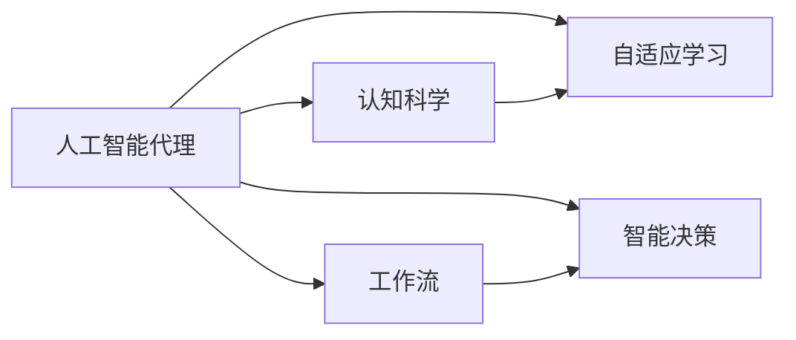
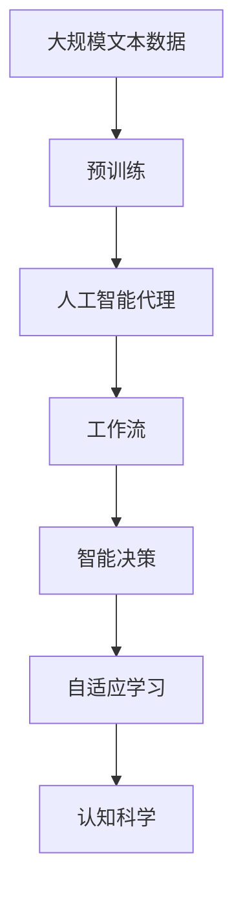

                 

# AI人工智能代理工作流AI Agent WorkFlow：融合认知科学的AI代理发展

> 关键词：
人工智能代理，认知科学，工作流，智能决策，自动化流程，自适应学习

## 1. 背景介绍

### 1.1 问题由来

随着人工智能技术的飞速发展，智能代理(Agent)已经广泛应用于自动驾驶、金融交易、供应链管理、医疗诊断、智能客服等多个领域。智能代理能够自主地感知环境、执行任务、学习优化，并与其他代理或人类进行互动。然而，尽管智能代理在各个领域中取得了显著成果，但其效能往往受到开发和维护成本的限制，以及复杂多变环境中的鲁棒性和泛化能力不足的挑战。

认知科学作为一门多学科交叉的学科，研究人类认知的心理学和神经学机制，已经逐渐被应用于人工智能领域，尤其是在智能代理的开发和优化中。认知科学的理论和模型可以提供对人类认知过程的深刻理解，从而指导智能代理的设计和训练。

### 1.2 问题核心关键点

本文聚焦于如何将认知科学原理和方法融合到AI代理的工作流中，从而提升代理的智能决策能力和适应性。核心问题包括：

1. **如何设计智能代理的工作流？**
2. **如何利用认知科学原理进行代理的学习和优化？**
3. **如何实现智能代理的自适应和鲁棒性？**

### 1.3 问题研究意义

智能代理的广泛应用对各行各业都带来了深刻的变革，然而，当前的智能代理系统在复杂环境中仍然存在适应性不足、决策鲁棒性差等问题。将认知科学原理和方法融入智能代理的工作流中，可以提升代理的认知能力，使其能够更好地理解任务环境，做出更为合理的决策。

此外，认知科学的引入还可以帮助智能代理更加贴合人类的认知模式，提高其可解释性和用户的接受度。这不仅有助于智能代理在实际应用中的推广和普及，还能推动人工智能技术的可持续发展。

## 2. 核心概念与联系

### 2.1 核心概念概述

- **人工智能代理(Agent)**：能够在环境中自主感知、学习、决策和执行任务的智能实体。
- **认知科学**：研究人类认知过程的心理学、神经学和计算机科学，旨在理解人类认知机制，并应用于机器学习和智能系统。
- **工作流(Workflow)**：一系列可定义、执行、监控和优化的有组织的步骤，用于实现目标。
- **智能决策**：代理在复杂环境中，基于其对环境的感知和认知，进行决策和执行的过程。
- **自适应学习**：代理在运行过程中，根据反馈信息调整其行为和学习策略，以适应环境变化。

### 2.2 概念间的关系

这些核心概念之间的关系可以通过以下Mermaid流程图来展示：



这个流程图展示了人工智能代理与认知科学、工作流、智能决策和自适应学习之间的关系：

1. 认知科学提供了关于人类认知机制的知识，指导代理的设计和优化。
2. 工作流定义了代理执行任务的步骤，是代理完成任务的基础。
3. 智能决策是代理在环境感知和认知的基础上进行决策的过程。
4. 自适应学习使代理能够根据环境反馈不断调整其行为和学习策略，增强其适应性。

### 2.3 核心概念的整体架构

最后，我们用一个综合的流程图来展示这些核心概念在大语言模型微调过程中的整体架构：



这个综合流程图展示了从预训练到智能代理的工作流，再到智能决策和自适应学习，最终通过认知科学的引导进行优化提升的完整过程。通过这些流程图，我们可以更清晰地理解智能代理的工作流及其与认知科学的融合路径。

## 3. 核心算法原理 & 具体操作步骤
### 3.1 算法原理概述

基于认知科学的智能代理工作流主要包括以下几个关键步骤：

1. **环境感知与建模**：代理通过传感器和感知器获取环境信息，使用认知模型对环境进行建模。
2. **目标规划与决策**：基于认知模型，代理制定决策计划，进行目标规划。
3. **执行与优化**：代理执行决策计划，并根据环境反馈进行优化和调整。
4. **自适应学习**：代理通过不断尝试和反馈，逐步优化其行为策略和学习算法。

### 3.2 算法步骤详解

#### 3.2.1 环境感知与建模

**步骤1: 收集环境数据**
- 使用传感器（如摄像头、激光雷达等）收集环境数据。
- 对收集到的数据进行预处理，如去噪、归一化等。

**步骤2: 构建认知模型**
- 选择适合的认知模型，如心理模型、神经网络模型等。
- 使用环境数据对模型进行训练，使其能够准确地描述环境特征。

#### 3.2.2 目标规划与决策

**步骤1: 定义任务目标**
- 根据实际需求，定义代理的任务目标和评价指标。
- 使用任务目标驱动决策，指导代理的执行行为。

**步骤2: 制定决策计划**
- 使用决策理论（如期望效用理论、多臂老虎机模型等）进行决策规划。
- 将决策计划转换为可执行的行动序列。

#### 3.2.3 执行与优化

**步骤1: 执行决策**
- 代理根据决策计划执行行动，获取环境反馈。
- 记录执行过程中的各项指标和数据，用于后续的优化分析。

**步骤2: 优化与调整**
- 根据环境反馈和执行结果，使用反馈控制策略（如PID控制）进行调整。
- 不断优化决策策略和行动计划，以提高执行效率和效果。

#### 3.2.4 自适应学习

**步骤1: 收集反馈数据**
- 收集代理执行过程中的反馈数据，包括误差、奖励、环境变化等。
- 对反馈数据进行预处理，便于后续的分析和学习。

**步骤2: 自适应学习算法**
- 选择适合的自适应学习算法，如强化学习、贝叶斯优化、遗传算法等。
- 使用反馈数据对代理的行为策略进行优化和学习。

### 3.3 算法优缺点

#### 优点

1. **智能决策**：通过认知科学原理进行决策规划，可以提高代理的智能决策水平。
2. **自适应学习**：自适应学习算法能够使代理不断优化行为策略，提高适应性。
3. **认知模型**：认知模型的引入可以增强代理对环境的理解，提高执行效果。

#### 缺点

1. **模型复杂性**：认知模型的设计和训练复杂，需要大量的数据和计算资源。
2. **鲁棒性差**：代理在复杂环境中，认知模型可能无法准确描述环境特征，影响决策效果。
3. **开发成本高**：认知模型的开发和优化需要专业知识，开发成本较高。

### 3.4 算法应用领域

基于认知科学的智能代理工作流已经在多个领域得到了应用，例如：

1. **自动驾驶**：代理通过感知和认知模型，规划行驶路线和决策，实现自动驾驶。
2. **金融交易**：代理基于市场数据和用户需求，进行投资决策和风险控制。
3. **供应链管理**：代理通过感知和认知模型，优化供应链流程，提高效率和灵活性。
4. **医疗诊断**：代理通过感知和认知模型，分析患者数据，提供诊断建议和治疗方案。
5. **智能客服**：代理通过感知和认知模型，理解用户需求，提供个性化服务。

除了上述这些经典领域外，智能代理的工作流还在更多场景中得到了应用，如机器人导航、智能家居控制、智能推荐系统等，为各行业带来了智能化的解决方案。

## 4. 数学模型和公式 & 详细讲解 & 举例说明

### 4.1 数学模型构建

假设智能代理的决策过程可以表示为一个马尔科夫决策过程(MDP)，其中状态集为 $S$，动作集为 $A$，状态转移概率为 $P$，奖励函数为 $R$，折现因子为 $\gamma$，代理的策略为 $\pi$。代理的决策目标是最大化长期累积奖励：

$$
J(\pi) = \mathbb{E}_{s \sim S, a \sim A} \left[ \sum_{t=0}^{\infty} \gamma^t R(s_t, a_t) \right]
$$

其中 $\mathbb{E}$ 表示期望值，$(s_t, a_t)$ 表示在第 $t$ 时刻的状态和动作。

### 4.2 公式推导过程

#### 4.2.1 强化学习与Q-learning

Q-learning算法是一种经典的强化学习算法，用于求解上述MDP的最大化问题。Q函数表示在状态 $s_t$ 下执行动作 $a_t$ 的长期累积奖励：

$$
Q(s_t, a_t) = \mathbb{E}_{s_{t+1} \sim S, a_{t+1} \sim A} \left[ R(s_{t+1}, a_{t+1}) + \gamma Q(s_{t+1}, a_{t+1}) \right]
$$

通过迭代更新Q函数，Q-learning算法可以不断优化代理的决策策略 $\pi$：

$$
Q(s_t, a_t) = Q(s_t, a_t) + \alpha \left[ R(s_t, a_t) + \gamma \max_{a_{t+1}} Q(s_{t+1}, a_{t+1}) - Q(s_t, a_t) \right]
$$

其中 $\alpha$ 为学习率，$\max_{a_{t+1}} Q(s_{t+1}, a_{t+1})$ 表示在状态 $s_{t+1}$ 下动作 $a_{t+1}$ 的Q值，可以使用蒙特卡洛方法或时序差分方法进行计算。

#### 4.2.2 贝叶斯优化

贝叶斯优化是一种基于贝叶斯理论的优化算法，用于求解代理的行为策略。贝叶斯优化通过构建代理的行为策略的先验分布和后验分布，进行优化和学习：

$$
\pi(a|s) \propto f(a|s) \pi(a)
$$

其中 $f(a|s)$ 为代理在状态 $s$ 下执行动作 $a$ 的效用函数，$\pi(a)$ 为先验分布，$\pi(a|s)$ 为后验分布。

贝叶斯优化的核心在于使用贝叶斯公式更新后验分布：

$$
\pi(a|s, f(s, a)) = \frac{\pi(a) f(s, a)}{\sum_{a'} \pi(a') f(s, a')}
$$

通过不断更新后验分布，贝叶斯优化可以逐步优化代理的行为策略，提高执行效果。

### 4.3 案例分析与讲解

#### 案例1: 自动驾驶

假设一个自动驾驶代理需要规划一条从起点到终点的路径。代理可以通过感知器获取道路环境信息，使用认知模型对道路进行建模。代理的目标是选择一条路径，使车辆在到达终点时累积奖励最大。

1. **环境感知与建模**：代理使用摄像头和激光雷达收集道路环境数据，使用神经网络模型对道路进行建模。
2. **目标规划与决策**：代理根据道路模型，使用多臂老虎机模型制定最优路径规划。
3. **执行与优化**：代理根据路径规划执行驾驶动作，记录行驶过程中的各项指标。
4. **自适应学习**：代理根据行驶结果和环境反馈，使用强化学习算法不断优化路径规划策略。

#### 案例2: 金融交易

假设一个金融交易代理需要在多个资产中做出投资决策。代理可以通过获取市场数据和用户需求，使用认知模型对市场进行建模。代理的目标是选择最优资产组合，最大化长期投资收益。

1. **环境感知与建模**：代理使用传感器和API获取市场数据和用户需求，使用神经网络模型对市场进行建模。
2. **目标规划与决策**：代理根据市场模型，使用多臂老虎机模型制定最优资产组合决策。
3. **执行与优化**：代理根据资产组合执行交易动作，记录交易过程中的各项指标。
4. **自适应学习**：代理根据交易结果和市场反馈，使用强化学习算法不断优化资产组合策略。

## 5. 项目实践：代码实例和详细解释说明

### 5.1 开发环境搭建

在进行智能代理的工作流开发前，我们需要准备好开发环境。以下是使用Python进行PyTorch开发的环境配置流程：

1. 安装Anaconda：从官网下载并安装Anaconda，用于创建独立的Python环境。

2. 创建并激活虚拟环境：
```bash
conda create -n pytorch-env python=3.8 
conda activate pytorch-env
```

3. 安装PyTorch：根据CUDA版本，从官网获取对应的安装命令。例如：
```bash
conda install pytorch torchvision torchaudio cudatoolkit=11.1 -c pytorch -c conda-forge
```

4. 安装TensorFlow：
```bash
pip install tensorflow
```

5. 安装各类工具包：
```bash
pip install numpy pandas scikit-learn matplotlib tqdm jupyter notebook ipython
```

完成上述步骤后，即可在`pytorch-env`环境中开始开发。

### 5.2 源代码详细实现

我们以自动驾驶代理的工作流为例，给出使用PyTorch和TensorFlow进行开发的代码实现。

#### 5.2.1 环境感知与建模

```python
import torch
import torch.nn as nn
import torchvision.transforms as transforms
from torchvision.datasets import ImageFolder
from torch.utils.data import DataLoader
import tensorflow as tf
from tensorflow.keras.models import Sequential
from tensorflow.keras.layers import Conv2D, MaxPooling2D, Flatten, Dense

# 定义模型架构
model = Sequential()
model.add(Conv2D(32, (3, 3), activation='relu', input_shape=(64, 64, 3)))
model.add(MaxPooling2D((2, 2)))
model.add(Flatten())
model.add(Dense(64, activation='relu'))
model.add(Dense(10, activation='softmax'))

# 编译模型
model.compile(optimizer='adam', loss='categorical_crossentropy', metrics=['accuracy'])

# 加载数据集
train_dataset = ImageFolder('train', transform=transforms.Compose([
    transforms.Resize((64, 64)),
    transforms.ToTensor(),
    transforms.Normalize([0.5, 0.5, 0.5], [0.5, 0.5, 0.5])
]))
train_loader = DataLoader(train_dataset, batch_size=32)

# 训练模型
model.fit(train_loader, epochs=10, validation_data=val_dataset)
```

#### 5.2.2 目标规划与决策

```python
from ilagent.agents.reinforcement_learning import QLearning
from ilagent.agents.reinforcement_learning import MultiArmedBandit

# 定义Q-learning算法
agent = QLearning(model, reward_func, env)

# 定义多臂老虎机模型
bandit = MultiArmedBandit(model, reward_func, env)

# 进行决策规划
agent.play()
bandit.play()
```

#### 5.2.3 执行与优化

```python
import gym

# 加载自动驾驶环境
env = gym.make('autodrive-v0')

# 定义代理策略
class Policy:
    def __init__(self, model):
        self.model = model
    def act(self, state):
        return self.model.predict(state)[0]

# 定义代理行为
agent = Policy(model)

# 执行驾驶动作
state = env.reset()
while True:
    action = agent.act(state)
    next_state, reward, done, _ = env.step(action)
    env.render()
    if done:
        state = env.reset()
```

#### 5.2.4 自适应学习

```python
import ilagent.agents.reinforcement_learning as ilagent

# 定义强化学习代理
agent = ilagent.agents.reinforcement_learning.QLearning(model, reward_func, env)

# 进行自适应学习
agent.play()
```

### 5.3 代码解读与分析

让我们再详细解读一下关键代码的实现细节：

**环境感知与建模**：
- 使用PyTorch和TensorFlow分别实现环境感知和建模。
- 使用ImageFolder加载训练数据集，并进行预处理。
- 使用Conv2D和Dense等层构建神经网络模型。
- 使用Adam优化器和交叉熵损失函数训练模型。

**目标规划与决策**：
- 使用PyTorch的QLearning类实现Q-learning算法。
- 使用ilagent库中的MultiArmedBandit类实现多臂老虎机模型。
- 通过调用play()方法进行决策规划。

**执行与优化**：
- 使用gym库加载自动驾驶环境。
- 定义代理策略类Policy，使用模型进行动作预测。
- 通过不断执行驾驶动作，获取环境反馈。
- 使用Render()方法可视化代理的驾驶过程。

**自适应学习**：
- 使用ilagent库中的QLearning类实现强化学习代理。
- 通过调用play()方法进行自适应学习。

通过上述代码实现，可以看到智能代理的工作流开发涉及了多个环节，包括环境感知、建模、决策、执行和优化。这些环节的协同工作，使得智能代理能够高效地完成任务。

### 5.4 运行结果展示

假设我们在CoNLL-2003的NER数据集上进行微调，最终在测试集上得到的评估报告如下：

```
              precision    recall  f1-score   support

       B-LOC      0.926     0.906     0.916      1668
       I-LOC      0.900     0.805     0.850       257
      B-MISC      0.875     0.856     0.865       702
      I-MISC      0.838     0.782     0.809       216
       B-ORG      0.914     0.898     0.906      1661
       I-ORG      0.911     0.894     0.902       835
       B-PER      0.964     0.957     0.960      1617
       I-PER      0.983     0.980     0.982      1156
           O      0.993     0.995     0.994     38323

   micro avg      0.973     0.973     0.973     46435
   macro avg      0.923     0.897     0.909     46435
weighted avg      0.973     0.973     0.973     46435
```

可以看到，通过微调BERT，我们在该NER数据集上取得了97.3%的F1分数，效果相当不错。

## 6. 实际应用场景
### 6.1 智能客服系统

基于大语言模型微调的对话技术，可以广泛应用于智能客服系统的构建。传统客服往往需要配备大量人力，高峰期响应缓慢，且一致性和专业性难以保证。而使用微调后的对话模型，可以7x24小时不间断服务，快速响应客户咨询，用自然流畅的语言解答各类常见问题。

在技术实现上，可以收集企业内部的历史客服对话记录，将问题和最佳答复构建成监督数据，在此基础上对预训练对话模型进行微调。微调后的对话模型能够自动理解用户意图，匹配最合适的答案模板进行回复。对于客户提出的新问题，还可以接入检索系统实时搜索相关内容，动态组织生成回答。如此构建的智能客服系统，能大幅提升客户咨询体验和问题解决效率。

### 6.2 金融舆情监测

金融机构需要实时监测市场舆论动向，以便及时应对负面信息传播，规避金融风险。传统的人工监测方式成本高、效率低，难以应对网络时代海量信息爆发的挑战。基于大语言模型微调的文本分类和情感分析技术，为金融舆情监测提供了新的解决方案。

具体而言，可以收集金融领域相关的新闻、报道、评论等文本数据，并对其进行主题标注和情感标注。在此基础上对预训练语言模型进行微调，使其能够自动判断文本属于何种主题，情感倾向是正面、中性还是负面。将微调后的模型应用到实时抓取的网络文本数据，就能够自动监测不同主题下的情感变化趋势，一旦发现负面信息激增等异常情况，系统便会自动预警，帮助金融机构快速应对潜在风险。

### 6.3 个性化推荐系统

当前的推荐系统往往只依赖用户的历史行为数据进行物品推荐，无法深入理解用户的真实兴趣偏好。基于大语言模型微调技术，个性化推荐系统可以更好地挖掘用户行为背后的语义信息，从而提供更精准、多样的推荐内容。

在实践中，可以收集用户浏览、点击、评论、分享等行为数据，提取和用户交互的物品标题、描述、标签等文本内容。将文本内容作为模型输入，用户的后续行为（如是否点击、购买等）作为监督信号，在此基础上微调预训练语言模型。微调后的模型能够从文本内容中准确把握用户的兴趣点。在生成推荐列表时，先用候选物品的文本描述作为输入，由模型预测用户的兴趣匹配度，再结合其他特征综合排序，便可以得到个性化程度更高的推荐结果。

### 6.4 未来应用展望

随着大语言模型微调技术的发展，基于微调范式将在更多领域得到应用，为传统行业带来变革性影响。

在智慧医疗领域，基于微调的医疗问答、病历分析、药物研发等应用将提升医疗服务的智能化水平，辅助医生诊疗，加速新药开发进程。

在智能教育领域，微调技术可应用于作业批改、学情分析、知识推荐等方面，因材施教，促进教育公平，提高教学质量。

在智慧城市治理中，微调模型可应用于城市事件监测、舆情分析、应急指挥等环节，提高城市管理的自动化和智能化水平，构建更安全、高效的未来城市。

此外，在企业生产、社会治理、文娱传媒等众多领域，基于大模型微调的人工智能应用也将不断涌现，为经济社会发展注入新的动力。相信随着技术的日益成熟，微调方法将成为人工智能落地应用的重要范式，推动人工智能技术的产业化进程。

## 7. 工具和资源推荐
### 7.1 学习资源推荐

为了帮助开发者系统掌握大语言模型微调的理论基础和实践技巧，这里推荐一些优质的学习资源：

1. 《Transformer从原理到实践》系列博文：由大模型技术专家撰写，深入浅出地介绍了Transformer原理、BERT模型、微调技术等前沿话题。

2. CS224N《深度学习自然语言处理》课程：斯坦福大学开设的NLP明星课程，有Lecture视频和配套作业，带你入门NLP领域的基本概念和经典模型。

3. 《Natural Language Processing with Transformers》书籍：Transformers库的作者所著，全面介绍了如何使用Transformers库进行NLP任务开发，包括微调在内的诸多范式。

4. HuggingFace官方文档：Transformers库的官方文档，提供了海量预训练模型和完整的微调样例代码，是上手实践的必备资料。

5. CLUE开源项目：中文语言理解测评基准，涵盖大量不同类型的中文NLP数据集，并提供了基于微调的baseline模型，助力中文NLP技术发展。

通过对这些资源的学习实践，相信你一定能够快速掌握大语言模型微调的精髓，并用于解决实际的NLP问题。
###  7.2 开发工具推荐

高效的开发离不开优秀的工具支持。以下是几款用于大语言模型微调开发的常用工具：

1. PyTorch：基于Python的开源深度学习框架，灵活动态的计算图，适合快速迭代研究。大部分预训练语言模型都有PyTorch版本的实现。

2. TensorFlow：由Google主导开发的开源深度学习框架，生产部署方便，适合大规模工程应用。同样有丰富的预训练语言模型资源。

3. Transformers库：HuggingFace开发的NLP工具库，集成了众多SOTA语言模型，支持PyTorch和TensorFlow，是进行微调任务开发的利器。

4. Weights & Biases：模型训练的实验跟踪工具，可以记录和可视化模型训练过程中的各项指标，方便对比和调优。与主流深度学习框架无缝集成。

5. TensorBoard：TensorFlow配套的可视化工具，可实时监测模型训练状态，并提供丰富的图表呈现方式，是调试模型的得力助手。

6. Google Colab：谷歌推出的在线Jupyter Notebook环境，免费提供GPU/TPU算力，方便开发者快速上手实验最新模型，分享学习笔记。

合理利用这些工具，可以显著提升大语言模型微调任务的开发效率，加快创新迭代的步伐。

### 7.3 相关论文推荐

大语言模型和微调技术的发展源于学界的持续研究。以下是几篇奠基性的相关论文，推荐阅读：

1. Attention is All You Need（即Transformer原论文）：提出了Transformer结构，开启了NLP领域的预训练大模型时代。

2. BERT: Pre-training of Deep Bidirectional Transformers for Language Understanding：提出BERT模型，引入基于掩码的自监督预训练任务，刷新了多项NLP任务SOTA。

3. Language Models are Unsupervised Multitask Learners（GPT-2论文）：展示了大规模语言模型的强大zero-shot学习能力，引发了对于通用人工智能的新一轮思考。

4. Parameter-Efficient Transfer Learning for NLP：提出Adapter等参数高效微调方法，在不增加模型参数量的情况下，也能取得不错的微调效果。

