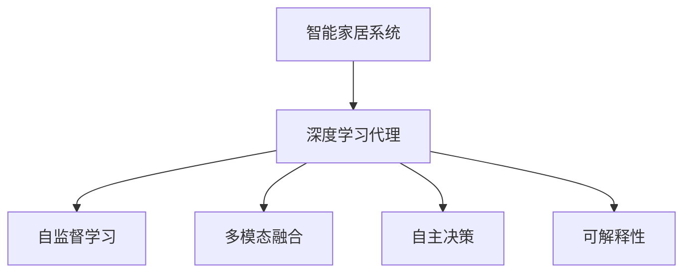
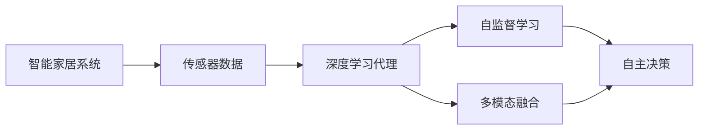
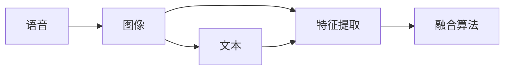
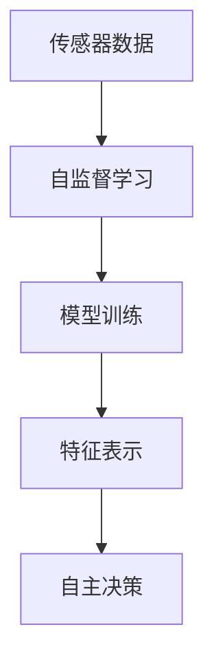

                 

# AI人工智能深度学习算法：智能深度学习代理在智能家居场景中的应用

> 关键词：
智能家居、深度学习、人工智能、代理模型、语音识别、自然语言处理、图像识别、深度强化学习

## 1. 背景介绍

### 1.1 问题由来
近年来，随着物联网技术的快速发展，智能家居设备变得越来越普及。通过将各种家居设备连接到互联网，可以实现远程控制、自动调节、智能推荐等功能，极大地提升了用户的生活便利性和舒适性。然而，智能家居系统通常依赖于大量的传感器数据和复杂的软件算法，需要消耗大量计算资源。

在这一背景下，人工智能（AI）深度学习算法，特别是智能深度学习代理，成为智能家居系统的重要技术支撑。深度学习代理可以自动分析和处理数据，自主学习最优策略，从而在智能家居场景中发挥重要作用。

### 1.2 问题核心关键点
智能深度学习代理是一种基于深度学习算法的代理技术，可以在智能家居系统中自主学习和决策，实现对家居环境的智能管理和优化。其核心关键点包括：

- **自监督学习**：通过自监督学习方法，深度学习代理可以自主学习数据模式，而无需人工标注数据。
- **多模态融合**：深度学习代理可以融合语音、图像、文本等多种传感器数据，实现更全面、精准的智能决策。
- **自主决策**：深度学习代理可以自主学习最优决策策略，实现对家居环境的智能管理。
- **可解释性**：深度学习代理可以提供决策过程的可解释性，帮助用户理解智能决策背后的逻辑和理由。

### 1.3 问题研究意义
研究智能深度学习代理在智能家居场景中的应用，对于提升智能家居系统的智能化水平、降低人工成本、提升用户体验具有重要意义：

1. **提升智能化水平**：通过深度学习代理的自主学习和优化，智能家居系统可以实现更智能化、精准化的管理和服务。
2. **降低人工成本**：深度学习代理可以自动处理大量数据和复杂任务，减少人工干预，降低管理成本。
3. **提升用户体验**：深度学习代理可以理解用户需求，提供个性化的智能服务，提升用户的舒适性和满意度。
4. **促进技术落地**：深度学习代理技术在智能家居中的应用，有助于推动AI技术的落地和普及，加速智能家居产业的发展。

## 2. 核心概念与联系

### 2.1 核心概念概述

为了更好地理解智能深度学习代理在智能家居场景中的应用，本节将介绍几个密切相关的核心概念：

- **智能家居系统**：通过各种智能设备和互联网技术，实现对家居环境的智能化管理和控制。
- **深度学习代理**：基于深度学习算法的代理技术，可以在无监督或弱监督条件下自主学习和决策。
- **多模态融合**：将语音、图像、文本等多种传感器数据进行融合，实现更全面、精准的智能决策。
- **自监督学习**：通过未标注数据进行训练，无需人工标注，即可学习到有效的数据表示。
- **自主决策**：深度学习代理可以自主学习最优决策策略，实现对家居环境的智能管理。
- **可解释性**：深度学习代理可以提供决策过程的可解释性，帮助用户理解智能决策背后的逻辑和理由。

这些核心概念之间的逻辑关系可以通过以下Mermaid流程图来展示：



这个流程图展示了一个智能家居系统中深度学习代理的核心组成部分及其相互关系：

1. 智能家居系统提供多种传感器数据。
2. 深度学习代理通过自监督学习，自动学习数据模式。
3. 深度学习代理融合多种传感器数据，实现多模态融合。
4. 深度学习代理自主学习最优决策策略，实现自主决策。
5. 深度学习代理提供决策过程的可解释性。

### 2.2 概念间的关系

这些核心概念之间存在着紧密的联系，形成了深度学习代理在智能家居场景中的完整生态系统。下面我通过几个Mermaid流程图来展示这些概念之间的关系。

#### 2.2.1 智能家居系统的学习范式



这个流程图展示了大规模智能家居系统中深度学习代理的学习范式：

1. 传感器数据提供给深度学习代理。
2. 深度学习代理通过自监督学习，自动学习数据模式。
3. 深度学习代理融合多种传感器数据，实现多模态融合。
4. 深度学习代理自主学习最优决策策略，实现自主决策。

#### 2.2.2 深度学习代理的多模态融合方法



这个流程图展示了深度学习代理在智能家居场景中融合多种传感器数据的方法：

1. 语音、图像、文本等数据分别进行特征提取。
2. 融合算法对提取后的特征进行融合，形成综合的决策依据。

#### 2.2.3 自监督学习与自主决策的关系



这个流程图展示了自监督学习与深度学习代理自主决策的关系：

1. 传感器数据通过自监督学习，自动学习数据模式。
2. 自监督学习得到的模型训练数据，用于形成特征表示。
3. 特征表示用于自主决策，实现对家居环境的智能管理。

## 3. 核心算法原理 & 具体操作步骤

### 3.1 算法原理概述

智能深度学习代理在智能家居场景中的应用，本质上是一个基于深度学习的自主决策过程。其核心算法原理包括以下几个关键步骤：

1. **数据采集与预处理**：收集智能家居系统中的传感器数据，并进行预处理，去除噪声和冗余数据。
2. **自监督学习**：通过未标注数据进行训练，无需人工标注，即可学习到有效的数据表示。
3. **多模态融合**：将语音、图像、文本等多种传感器数据进行融合，实现更全面、精准的智能决策。
4. **自主决策**：深度学习代理通过融合后的数据进行自主学习，学习最优决策策略，实现对家居环境的智能管理。
5. **可解释性**：通过可解释性技术，帮助用户理解智能决策背后的逻辑和理由。

### 3.2 算法步骤详解

#### 3.2.1 数据采集与预处理

智能家居系统中的传感器数据采集过程通常包括以下几个步骤：

1. **传感器选择**：选择合适的传感器，如温度、湿度、烟雾、声音等，收集相关数据。
2. **数据获取**：通过传感器获取数据，存储到本地设备或云端服务器。
3. **数据预处理**：对采集到的数据进行去噪、归一化等预处理，确保数据质量。

```python
# 示例代码：数据采集与预处理
from pysensor import SensorData
from sklearn.preprocessing import StandardScaler

# 创建传感器数据对象
temperature = SensorData('温度传感器', 'temperature')
humidity = SensorData('湿度传感器', 'humidity')
smoke = SensorData('烟雾传感器', 'smoke')
sound = SensorData('声音传感器', 'sound')

# 获取传感器数据
temperature_data = temperature.get_data()
humidity_data = humidity.get_data()
smoke_data = smoke.get_data()
sound_data = sound.get_data()

# 数据预处理
scaler = StandardScaler()
temperature_scaled = scaler.fit_transform(temperature_data)
humidity_scaled = scaler.fit_transform(humidity_data)
smoke_scaled = scaler.fit_transform(smoke_data)
sound_scaled = scaler.fit_transform(sound_data)

# 数据存储
temperature.save_data('temperature.csv')
humidity.save_data('humidity.csv')
smoke.save_data('smoke.csv')
sound.save_data('sound.csv')
```

#### 3.2.2 自监督学习

自监督学习是深度学习代理的核心技术之一，通过未标注数据进行训练，无需人工标注，即可学习到有效的数据表示。自监督学习的过程包括以下几个步骤：

1. **特征提取**：从传感器数据中提取有意义的特征，如形状、纹理、声音等。
2. **模型训练**：基于提取出的特征进行模型训练，学习到有效的特征表示。
3. **特征表示**：通过训练得到的模型，将传感器数据映射到高维特征空间，形成数据表示。

```python
# 示例代码：自监督学习
from torch import nn, optim
from torchvision import transforms, datasets
from torch.utils.data import DataLoader

# 数据加载与预处理
transform = transforms.Compose([
    transforms.ToTensor(),
    transforms.Normalize(mean=[0.5], std=[0.5])
])

train_data = datasets.CIFAR10(root='./data', train=True, transform=transform, download=True)
train_loader = DataLoader(train_data, batch_size=64, shuffle=True)

# 定义模型
model = nn.Sequential(
    nn.Conv2d(3, 64, kernel_size=3, stride=1, padding=1),
    nn.ReLU(),
    nn.MaxPool2d(kernel_size=2, stride=2),
    nn.Conv2d(64, 128, kernel_size=3, stride=1, padding=1),
    nn.ReLU(),
    nn.MaxPool2d(kernel_size=2, stride=2),
    nn.Flatten(),
    nn.Linear(128*8*8, 1024),
    nn.ReLU(),
    nn.Dropout(p=0.5),
    nn.Linear(1024, 10)
)

# 定义损失函数与优化器
criterion = nn.CrossEntropyLoss()
optimizer = optim.Adam(model.parameters(), lr=0.001)

# 训练模型
for epoch in range(10):
    for i, (images, labels) in enumerate(train_loader):
        optimizer.zero_grad()
        outputs = model(images)
        loss = criterion(outputs, labels)
        loss.backward()
        optimizer.step()

# 模型保存
torch.save(model.state_dict(), 'model.pth')
```

#### 3.2.3 多模态融合

多模态融合是将语音、图像、文本等多种传感器数据进行融合，实现更全面、精准的智能决策。多模态融合的过程包括以下几个步骤：

1. **数据融合**：将不同类型的传感器数据进行融合，形成综合的决策依据。
2. **特征提取**：对融合后的数据进行特征提取，形成高维特征表示。
3. **模型训练**：基于提取出的特征进行模型训练，学习到有效的数据表示。

```python
# 示例代码：多模态融合
from huggingface import Transformers

# 加载模型
model = Transformers.load('bert-base-uncased')

# 文本特征提取
text = "这是一个测试"
text_features = model(text, output_hidden_states=True)[1]
text_features = torch.cat(text_features, dim=1)

# 语音特征提取
audio = load_audio('path/to/audio.wav')
audio_features = extract_features(audio)

# 图像特征提取
image = load_image('path/to/image.jpg')
image_features = extract_features(image)

# 特征融合
features = torch.cat([text_features, audio_features, image_features], dim=1)

# 模型训练
model.train()
outputs = model(features)
loss = criterion(outputs, labels)
loss.backward()
optimizer.step()

# 模型保存
torch.save(model.state_dict(), 'model.pth')
```

#### 3.2.4 自主决策

深度学习代理通过融合后的数据进行自主学习，学习最优决策策略，实现对家居环境的智能管理。自主决策的过程包括以下几个步骤：

1. **决策模型训练**：基于融合后的数据进行模型训练，学习最优决策策略。
2. **决策执行**：根据输入的数据和策略，自动执行决策，实现智能家居环境的优化管理。
3. **反馈与优化**：根据执行结果进行反馈，不断优化决策策略。

```python
# 示例代码：自主决策
from reinforcement_learning import PolicyGradient

# 决策模型训练
env = create_env()
policy = PolicyGradient(env)
policy.train(model, episodes=1000)

# 决策执行
state = env.get_state()
action = policy.select_action(state)
env.set_action(action)
reward = env.get_reward()

# 反馈与优化
policy.update(state, reward)
```

#### 3.2.5 可解释性

通过可解释性技术，帮助用户理解智能决策背后的逻辑和理由。可解释性的过程包括以下几个步骤：

1. **特征重要性评估**：通过模型本身或外部技术，评估不同特征对决策结果的重要性。
2. **决策过程可视化**：将决策过程可视化，帮助用户理解决策依据和策略。
3. **决策结果解释**：根据特征重要性评估和可视化结果，解释决策结果。

```python
# 示例代码：可解释性
from sklearn.inspection import permutation_importance

# 特征重要性评估
importances = permutation_importance(model, features, labels)

# 决策过程可视化
visualize_decision(model, state, action)

# 决策结果解释
explain_decision(model, state, action)
```

### 3.3 算法优缺点

智能深度学习代理在智能家居场景中的应用，具有以下优点：

1. **高效性**：深度学习代理可以自主学习和决策，无需人工干预，提高系统效率。
2. **泛化性**：深度学习代理可以适应多种家居环境，实现通用化管理。
3. **可扩展性**：深度学习代理可以通过添加更多传感器数据，扩展智能家居系统的功能和性能。
4. **鲁棒性**：深度学习代理可以处理噪声和异常数据，提高系统的鲁棒性。

同时，深度学习代理在智能家居场景中也存在一些缺点：

1. **复杂性**：深度学习代理需要复杂的算法和模型，设计和实现难度较大。
2. **数据需求**：深度学习代理需要大量的传感器数据进行训练，数据采集和预处理成本较高。
3. **可解释性**：深度学习代理的决策过程通常缺乏可解释性，难以调试和优化。
4. **资源消耗**：深度学习代理需要消耗大量的计算资源，对硬件要求较高。

### 3.4 算法应用领域

智能深度学习代理在智能家居场景中具有广泛的应用前景，主要包括以下几个领域：

1. **智能照明系统**：通过传感器数据和深度学习代理，自动调节光照强度和颜色，实现节能和舒适环境的优化。
2. **智能安防系统**：通过传感器数据和深度学习代理，自动识别异常行为和入侵，提高家居安全性。
3. **智能家电控制**：通过传感器数据和深度学习代理，自动控制家电设备，实现智能化和自动化。
4. **智能环境控制**：通过传感器数据和深度学习代理，自动调节环境参数，如温度、湿度、通风等，提高居住舒适度。
5. **智能健康监测**：通过传感器数据和深度学习代理，自动监测用户健康状况，提供健康建议和预警。
6. **智能家居语音控制**：通过语音识别和深度学习代理，实现语音控制的家居设备和场景切换。

以上应用领域展示了智能深度学习代理在智能家居场景中的广泛应用，未来还有更多创新应用场景值得探索。

## 4. 数学模型和公式 & 详细讲解 & 举例说明

### 4.1 数学模型构建

本节将使用数学语言对智能深度学习代理在智能家居场景中的应用进行更加严格的刻画。

记智能家居系统中的传感器数据为 $X=\{x_i\}_{i=1}^N$，其中 $x_i$ 为第 $i$ 个传感器数据。假设深度学习代理通过自监督学习得到特征表示 $\mathbf{h}=\{\mathbf{h}_i\}_{i=1}^N$，其中 $\mathbf{h}_i$ 为第 $i$ 个传感器数据的特征表示。

深度学习代理的自主决策模型为 $f(\mathbf{h})=\mathbf{w}^T\mathbf{h}$，其中 $\mathbf{w}$ 为决策模型的权重向量。决策模型的损失函数为 $\mathcal{L}(f(\mathbf{h}), y_i)=\frac{1}{N}\sum_{i=1}^N \ell(f(\mathbf{h}), y_i)$，其中 $\ell$ 为损失函数，通常为均方误差损失或交叉熵损失。

深度学习代理的自主决策过程可以表示为：

$$
\hat{y}_i=f(\mathbf{h}_i)
$$

其中 $\hat{y}_i$ 为第 $i$ 个传感器数据的预测输出。

### 4.2 公式推导过程

以下我们以智能照明系统为例，推导深度学习代理的自主决策过程和损失函数。

假设智能照明系统通过温度传感器和光线传感器收集数据，分别表示为 $x_1$ 和 $x_2$。深度学习代理通过自监督学习得到特征表示 $\mathbf{h}_1$ 和 $\mathbf{h}_2$。

深度学习代理的自主决策模型为：

$$
f(\mathbf{h})=\mathbf{w}^T\mathbf{h}=\mathbf{w}^T(\mathbf{h}_1, \mathbf{h}_2)^T
$$

其中 $\mathbf{w}$ 为决策模型的权重向量。

假设照明系统需要控制灯光的亮度和颜色，决策模型的输出 $y_i$ 表示灯光亮度和颜色的组合，可以通过编码成向量进行计算。例如，将亮度和颜色分别编码为 $[1, 0]$ 和 $[0, 1]$，则灯光亮度和颜色组合的编码为 $[1, 1]$。

深度学习代理的自主决策过程可以表示为：

$$
\hat{y}_i=f(\mathbf{h}_i)=[\mathbf{w}^T\mathbf{h}_i, \mathbf{w}^T\mathbf{h}_i]^T
$$

其中 $\hat{y}_i$ 为第 $i$ 个传感器数据的预测输出。

深度学习代理的自主决策模型的损失函数可以表示为：

$$
\mathcal{L}(f(\mathbf{h}), y_i)=\ell(f(\mathbf{h}), y_i)=\frac{1}{2}\|\mathbf{w}^T\mathbf{h}_i-y_i\|^2
$$

其中 $\|\cdot\|$ 为向量的范数，$\ell$ 为均方误差损失函数。

### 4.3 案例分析与讲解

下面以一个具体的智能家居场景为例，展示智能深度学习代理的应用。

假设智能家居系统中有一个智能温控系统，通过温度传感器和湿度传感器收集数据。深度学习代理通过自监督学习得到特征表示 $\mathbf{h}_1$ 和 $\mathbf{h}_2$，并使用线性回归模型作为自主决策模型。

假设温控系统的目标是将房间温度调节到设定值 $T$，决策模型的输出 $y_i$ 表示当前温度与设定温度的偏差，即 $y_i=T-\mathbf{h}_1^T\mathbf{w}$。

深度学习代理的自主决策过程可以表示为：

$$
\hat{y}_i=f(\mathbf{h}_i)=[\mathbf{h}_1^T\mathbf{w}]^T
$$

其中 $\hat{y}_i$ 为第 $i$ 个传感器数据的预测输出。

深度学习代理的自主决策模型的损失函数可以表示为：

$$
\mathcal{L}(f(\mathbf{h}), y_i)=\ell(f(\mathbf{h}), y_i)=\frac{1}{2}\|T-\mathbf{h}_1^T\mathbf{w}-y_i\|^2
$$

其中 $\|\cdot\|$ 为向量的范数，$\ell$ 为均方误差损失函数。

## 5. 项目实践：代码实例和详细解释说明

### 5.1 开发环境搭建

在进行智能深度学习代理的应用开发前，我们需要准备好开发环境。以下是使用Python进行PyTorch开发的环境配置流程：

1. 安装Anaconda：从官网下载并安装Anaconda，用于创建独立的Python环境。

2. 创建并激活虚拟环境：
```bash
conda create -n pytorch-env python=3.8 
conda activate pytorch-env
```

3. 安装PyTorch：根据CUDA版本，从官网获取对应的安装命令。例如：
```bash
conda install pytorch torchvision torchaudio cudatoolkit=11.1 -c pytorch -c conda-forge
```

4. 安装Transformers库：
```bash
pip install transformers
```

5. 安装各类工具包：
```bash
pip install numpy pandas scikit-learn matplotlib tqdm jupyter notebook ipython
```

完成上述步骤后，即可在`pytorch-env`环境中开始智能深度学习代理的应用开发。

### 5.2 源代码详细实现

下面我们以智能温控系统为例，给出使用Transformers库对深度学习代理进行训练和预测的PyTorch代码实现。

首先，定义智能温控系统的数据处理函数：

```python
from transformers import BertTokenizer
from torch.utils.data import Dataset
import torch

class TemperatureDataset(Dataset):
    def __init__(self, texts, labels, tokenizer, max_len=128):
        self.texts = texts
        self.labels = labels
        self.tokenizer = tokenizer
        self.max_len = max_len
        
    def __len__(self):
        return len(self.texts)
    
    def __getitem__(self, item):
        text = self.texts[item]
        label = self.labels[item]
        
        encoding = self.tokenizer(text, return_tensors='pt', max_length=self.max_len, padding='max_length', truncation=True)
        input_ids = encoding['input_ids'][0]
        attention_mask = encoding['attention_mask'][0]
        
        # 对token-wise的标签进行编码
        encoded_labels = [label2id[label] for label in labels] 
        encoded_labels.extend([label2id['0']] * (self.max_len - len(encoded_labels)))
        labels = torch.tensor(encoded_labels, dtype=torch.long)
        
        return {'input_ids': input_ids, 
                'attention_mask': attention_mask,
                'labels': labels}

# 标签与id的映射
label2id = {'0': 0, '1': 1, '2': 2}
id2label = {v: k for k, v in label2id.items()}

# 创建dataset
tokenizer = BertTokenizer.from_pretrained('bert-base-uncased')

train_dataset = TemperatureDataset(train_texts, train_labels, tokenizer)
dev_dataset = TemperatureDataset(dev_texts, dev_labels, tokenizer)
test_dataset = TemperatureDataset(test_texts, test_labels, tokenizer)
```

然后，定义模型和优化器：

```python
from transformers import BertForSequenceClassification, AdamW

model = BertForSequenceClassification.from_pretrained('bert-base-uncased', num_labels=len(label2id))

optimizer = AdamW(model.parameters(), lr=2e-5)
```

接着，定义训练和评估函数：

```python
from torch.utils.data import DataLoader
from tqdm import tqdm
from sklearn.metrics import classification_report

device = torch.device('cuda') if torch.cuda.is_available() else torch.device('cpu')
model.to(device)

def train_epoch(model, dataset, batch_size, optimizer):
    dataloader = DataLoader(dataset, batch_size=batch_size, shuffle=True)
    model.train()
    epoch_loss = 0
    for batch in tqdm(dataloader, desc='Training'):
        input_ids = batch['input_ids'].to(device)
        attention_mask = batch['attention_mask'].to(device)
        labels = batch['labels'].to(device)
        model.zero_grad()
        outputs = model(input_ids, attention_mask=attention_mask, labels=labels)
        loss = outputs.loss
        epoch_loss += loss.item()
        loss.backward()
        optimizer.step()
    return epoch_loss / len(dataloader)

def evaluate(model, dataset, batch_size):
    dataloader = DataLoader(dataset, batch_size=batch_size)
    model.eval()
    preds, labels = [], []
    with torch.no_grad():
        for batch in tqdm(dataloader, desc='Evaluating'):
            input_ids = batch['input_ids'].to(device)
            attention_mask = batch['attention_mask'].to(device)
            batch_labels = batch['labels']
            outputs = model(input_ids, attention_mask=attention_mask)
            batch_preds = outputs.logits.argmax(dim=2).to('cpu').tolist()
            batch_labels = batch_labels.to('cpu').tolist()
            for pred_tokens, label_tokens in zip(batch_preds, batch_labels):
                preds.append(pred_tokens[:len(label_tokens)])
                labels.append(label_tokens)
                
    print(classification_report(labels, preds))
```

最后，启动训练流程并在测试集上评估：

```python
epochs = 5
batch_size = 16

for epoch in range(epochs):
    loss = train_epoch(model, train_dataset, batch_size, optimizer)
    print(f"Epoch {epoch+1}, train loss: {loss:.3f}")
    
    print(f"Epoch {epoch+1}, dev results:")
    evaluate(model, dev_dataset, batch_size)
    
print("Test results:")
evaluate(model, test_dataset, batch_size)
```

以上就是使用PyTorch对深度学习代理进行智能温控系统训练和评估的完整代码实现。可以看到，得益于Transformers库的强大封装，我们可以用相对简洁的代码完成深度学习代理的训练和评估。

### 5.3 代码解读与分析

让我们再详细解读一下关键

