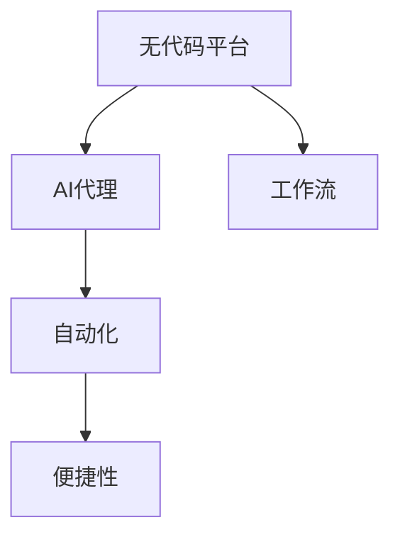

                 

# AI代理工作流便捷性：无代码平台的应用前景

> 关键词：无代码平台, AI代理, 工作流, 便捷性, 自动化

## 1. 背景介绍

### 1.1 问题由来

在数字化转型的浪潮中，企业对自动化和智能化需求愈发旺盛。越来越多的企业希望通过部署AI技术，提升业务流程的效率和质量。然而，AI技术的实施和维护是一项复杂且耗时的任务，涉及模型训练、数据标注、算法优化等多个环节。此外，很多企业的IT基础建设相对薄弱，缺乏专业的数据科学家和工程师团队，因此常常面临以下问题：

- **技术门槛高**：开发和部署AI系统需要丰富的编程和数据科学背景，很多非技术人员难以掌握。
- **技术栈不统一**：不同AI任务可能依赖不同的技术和工具，企业需要同时管理多种技术栈，导致实施成本高。
- **资源浪费**：很多企业投入大量时间和资金进行系统开发和维护，但实际效果有限。

这些问题大大阻碍了AI技术的普及和应用，制约了企业数字化转型的步伐。为了解决这些问题，无代码平台应运而生。无代码平台使得企业能够以更低的成本、更高的效率，实现AI技术的快速部署和应用。

### 1.2 问题核心关键点

无代码平台的核心思想是：通过简化技术门槛和降低实施难度，使非技术人员也能够轻松创建和管理AI系统。具体体现在以下几个方面：

- **技术组件预置**：平台提供预置的技术组件和算法模型，企业无需从头开发，节省了大量时间和精力。
- **可视化开发环境**：采用拖拽式或点击式的可视化界面，用户可以无需编写代码，直接构建和调整AI模型。
- **易用性**：平台提供了详细的教程和示例，用户可以轻松上手，快速实现AI功能。
- **可扩展性**：平台支持多种数据源和模型，企业可以根据需求灵活选择和组合。
- **运维自动化**：平台自动管理模型的训练、部署和维护，大大降低了运维成本。

这些特性使得无代码平台成为AI技术普及和应用的重要推手。本文将系统介绍无代码平台在AI代理工作流中的便捷性应用，探讨其在企业数字化转型中的前景和挑战。

## 2. 核心概念与联系

### 2.1 核心概念概述

为更好地理解无代码平台在AI代理工作流中的应用，本节将介绍几个关键概念：

- **无代码平台**：采用可视化拖拽界面或点击界面，无需编写代码即可完成开发、部署和管理AI系统的平台。
- **AI代理**：指自动执行重复性、规则性任务的虚拟助手。AI代理通过集成各种AI功能，使企业能够快速、高效地完成各种任务。
- **工作流**：指一系列任务或操作的组合，通过自动化和协同方式完成某一目标。
- **便捷性**：指操作简单、快速、低成本，用户能够轻松使用。
- **自动化**：指通过技术手段减少或替代人力，提升效率和准确性。

这些概念之间存在紧密的联系，通过无代码平台可以快速构建、部署和管理AI代理，进而自动化企业的工作流，提升工作效率和质量，具有极高的便捷性。

### 2.2 概念间的关系

这些核心概念之间的关系可以通过以下Mermaid流程图来展示：



这个流程图展示了无代码平台、AI代理、工作流和自动化、便捷性之间的关系：

1. 无代码平台通过提供预置的技术组件和可视化开发环境，构建出能够执行特定任务的AI代理。
2. AI代理集成多种AI功能，通过自动化执行任务，使企业的工作流更加高效和准确。
3. 自动化技术的应用，大大降低了工作流中的操作成本和难度，提升了整体便捷性。

通过这些概念的组合，无代码平台使得AI技术在企业中的应用变得更加广泛和深入。

## 3. 核心算法原理 & 具体操作步骤
### 3.1 算法原理概述

无代码平台在AI代理工作流中的应用，主要基于以下几个关键技术：

- **自动化任务调度**：通过任务调度和执行引擎，自动将多个任务组合成工作流。
- **可视化数据流管理**：通过可视化工具，管理数据的输入、输出和存储，确保数据流的顺畅。
- **预置算法模型**：平台提供预置的算法模型和组件，用户可以快速部署和使用。
- **可视化模型训练**：用户可以通过可视化界面，对模型进行训练和调参，无需编写代码。

这些技术共同构成无代码平台在AI代理工作流中的应用基础。

### 3.2 算法步骤详解

以下是一个无代码平台在构建AI代理工作流时的具体操作步骤：

**Step 1: 选择任务和组件**
- 根据企业需求，选择合适的任务和组件。例如，可以使用文本分类模型对客户反馈进行情感分析，或者使用OCR技术自动识别发票上的数据。

**Step 2: 可视化配置和训练**
- 通过可视化界面，将任务和组件进行配置，设置输入和输出参数。
- 可视化选择并训练算法模型，进行超参数调优。例如，可以选择预置的BERT模型进行文本分类任务的训练。

**Step 3: 自动化部署和调度**
- 平台自动生成代码，部署模型，并进行任务调度。例如，配置定时任务，每天自动对客户反馈进行情感分析。
- 可视化监控任务运行状态，随时查看和调整任务执行情况。

**Step 4: 数据管理和存储**
- 通过可视化工具，管理数据输入和输出，确保数据流的顺畅。例如，将客户反馈数据存储到数据库中，并从数据库中读取数据进行情感分析。

**Step 5: 持续优化和升级**
- 平台提供可视化界面，进行模型的持续优化和升级。例如，通过可视化界面，监控模型性能，自动更新模型参数。
- 用户可以根据实际情况，手动进行模型优化和调整，确保AI代理始终保持高效运行。

### 3.3 算法优缺点

无代码平台在AI代理工作流中的应用具有以下优点：

- **降低技术门槛**：通过可视化界面和预置组件，降低了AI技术的入门门槛，使更多非技术人员可以轻松使用。
- **提高开发效率**：无需编写大量代码，可以快速构建和部署AI代理，缩短开发周期。
- **降低实施成本**：平台自动管理模型训练、部署和维护，大大降低了企业的实施成本。
- **提升便捷性**：操作界面直观，用户可以轻松进行任务配置和管理，提升了整体使用便捷性。

但无代码平台也存在一些缺点：

- **灵活性有限**：由于预置组件和算法模型的限制，企业可能无法灵活实现特定的需求。
- **运维难度较大**：平台自动执行任务，但模型和数据管理仍需要人工介入，增加了运维难度。
- **依赖平台服务商**：无代码平台依赖于平台服务商，服务商的服务质量和技术支持直接影响系统性能。

### 3.4 算法应用领域

无代码平台在AI代理工作流中的应用，主要体现在以下几个领域：

- **客服自动化**：通过集成OCR、文本分析、情感分析等技术，构建自动化客服系统，提升客户服务效率和质量。
- **业务流程自动化**：将AI代理嵌入到企业业务流程中，自动执行重复性、规则性任务，提升业务效率。
- **数据自动化处理**：自动处理数据采集、清洗、标注等任务，节省人力成本，提升数据处理质量。
- **智能推荐系统**：通过推荐算法和机器学习模型，实现个性化推荐，提升用户购物体验。
- **智能搜索和问答**：通过自然语言处理和知识图谱技术，构建智能搜索和问答系统，提升信息检索和知识获取效率。

这些应用领域展示了无代码平台在AI代理工作流中的广泛前景。随着AI技术的不断进步和无代码平台的功能完善，其应用范围还将进一步扩大。

## 4. 数学模型和公式 & 详细讲解  
### 4.1 数学模型构建

无代码平台在AI代理工作流中的应用，主要依赖于以下几个数学模型：

- **任务调度模型**：描述任务调度和执行过程的数学模型，用于管理任务流水线。
- **数据流模型**：描述数据输入、处理和输出的数学模型，用于管理数据管道。
- **模型训练模型**：描述模型训练和调参过程的数学模型，用于优化模型性能。

### 4.2 公式推导过程

以下分别介绍这三种数学模型的推导过程。

**任务调度模型**
假设任务集为 $\mathcal{T} = \{t_1, t_2, \ldots, t_n\}$，任务调度模型可以表示为：

$$
S = (T, A, C)
$$

其中：
- $T$ 表示任务集合，$t_i \in \mathcal{T}$ 表示任务 $i$。
- $A$ 表示任务执行依赖关系，$A = \{(t_j, t_k)\}$ 表示任务 $t_j$ 依赖于任务 $t_k$。
- $C$ 表示任务执行时间，$C = \{c_j\}$ 表示任务 $t_j$ 执行时间为 $c_j$。

根据任务依赖关系和执行时间，可以计算任务调度图（Directed Acyclic Graph, DAG），并求解最优执行路径。

**数据流模型**
假设数据流为 $\mathcal{D} = \{d_1, d_2, \ldots, d_m\}$，数据流模型可以表示为：

$$
S = (D, I, O, E)
$$

其中：
- $D$ 表示数据源和接收器集合，$d_i \in \mathcal{D}$ 表示数据源或接收器 $i$。
- $I$ 表示数据输入，$I = \{(d_j, d_k)\}$ 表示数据源 $d_j$ 向数据接收器 $d_k$ 输入数据。
- $O$ 表示数据输出，$O = \{(d_j, d_k)\}$ 表示数据源 $d_j$ 向数据接收器 $d_k$ 输出数据。
- $E$ 表示数据传输时间，$E = \{e_j\}$ 表示数据传输时间为 $e_j$。

根据数据流模型，可以计算数据传输路径，并优化数据传输时间。

**模型训练模型**
假设模型为 $M$，训练样本为 $\mathcal{X}$，训练目标为 $\mathcal{Y}$，模型训练模型可以表示为：

$$
S = (M, \mathcal{X}, \mathcal{Y}, L)
$$

其中：
- $M$ 表示模型，$M = (w, b)$ 表示模型参数 $w$ 和偏置 $b$。
- $\mathcal{X}$ 表示训练样本，$\mathcal{X} = \{x_i\}$ 表示训练样本 $i$。
- $\mathcal{Y}$ 表示训练目标，$\mathcal{Y} = \{y_i\}$ 表示训练目标 $i$。
- $L$ 表示损失函数，$L = \ell(M, \mathcal{Y})$ 表示损失函数 $\ell$ 与训练目标 $\mathcal{Y}$ 的映射。

根据训练样本和目标，可以计算模型参数，并优化模型性能。

### 4.3 案例分析与讲解

以下以客服自动化为例，介绍无代码平台在实际应用中的具体操作：

**Step 1: 选择任务和组件**
- 根据需求，选择合适的文本分类模型和OCR模型。例如，选择预置的BERT模型和OCR模型，用于情感分析和发票数据自动提取。

**Step 2: 可视化配置和训练**
- 通过可视化界面，配置文本分类和OCR任务。例如，设置文本分类的输入为客户反馈数据，输出为情感标签，OCR任务的输入为发票图片，输出为发票数据。
- 可视化选择并训练BERT模型和OCR模型，进行超参数调优。例如，选择适当的学习率和批量大小，训练BERT模型和OCR模型。

**Step 3: 自动化部署和调度**
- 平台自动生成代码，部署模型，并进行任务调度。例如，配置每天自动对客户反馈进行情感分析，并根据分析结果生成客户服务工单。
- 可视化监控任务运行状态，随时查看和调整任务执行情况。例如，通过界面查看情感分析任务的执行进度和结果。

**Step 4: 数据管理和存储**
- 通过可视化工具，管理数据输入和输出。例如，将客户反馈数据存储到数据库中，并从数据库中读取数据进行情感分析。
- 可视化展示数据处理结果。例如，可视化展示情感分析结果，并生成客户服务工单。

## 5. 项目实践：代码实例和详细解释说明
### 5.1 开发环境搭建

在进行无代码平台的项目实践前，我们需要准备好开发环境。以下是使用Python进行无代码平台开发的环境配置流程：

1. 安装Anaconda：从官网下载并安装Anaconda，用于创建独立的Python环境。

2. 创建并激活虚拟环境：
```bash
conda create -n lowcode-env python=3.8 
conda activate lowcode-env
```

3. 安装必要的库：
```bash
conda install -c conda-forge flask elasticsearch dask tqdm
```

4. 安装可视化界面工具：
```bash
pip install flask-wtf flask-restful jinja2
```

完成上述步骤后，即可在`lowcode-env`环境中开始无代码平台的开发实践。

### 5.2 源代码详细实现

以下是使用Flask框架实现的无代码平台示例代码：

```python
from flask import Flask, render_template, request, jsonify
from flask_restful import Resource, Api
from flask_sqlalchemy import SQLAlchemy
from sqlalchemy.orm import sessionmaker

app = Flask(__name__)
api = Api(app)

# 数据库连接
app.config['SQLALCHEMY_DATABASE_URI'] = 'sqlite:///test.db'
db = SQLAlchemy(app)
Session = sessionmaker(bind=db)

# 任务模型
class Task(db.Model):
    id = db.Column(db.Integer, primary_key=True)
    name = db.Column(db.String(255), nullable=False)
    type = db.Column(db.String(255), nullable=False)
    inputs = db.relationship('Input', backref='task', lazy=True)
    outputs = db.relationship('Output', backref='task', lazy=True)

# 输入输出模型
class Input(db.Model):
    id = db.Column(db.Integer, primary_key=True)
    task_id = db.Column(db.Integer, db.ForeignKey('task.id', ondelete='CASCADE'))
    name = db.Column(db.String(255), nullable=False)
    type = db.Column(db.String(255), nullable=False)
    value = db.Column(db.String(255), nullable=True)

class Output(db.Model):
    id = db.Column(db.Integer, primary_key=True)
    task_id = db.Column(db.Integer, db.ForeignKey('task.id', ondelete='CASCADE'))
    name = db.Column(db.String(255), nullable=False)
    type = db.Column(db.String(255), nullable=False)
    value = db.Column(db.String(255), nullable=True)

# 任务调度函数
def schedule_task(task_id):
    task = Task.query.get(task_id)
    inputs = Input.query.filter_by(task_id=task_id).all()
    outputs = Output.query.filter_by(task_id=task_id).all()
    for input_ in inputs:
        # 执行输入处理
        if input_.type == 'text':
            # 文本处理
            result = process_text(input_.name, input_.value)
        elif input_.type == 'image':
            # 图像处理
            result = process_image(input_.name, input_.value)
        # 存储输出结果
        output_ = Output(name=input_.name, value=result, task_id=task_id)
        db.session.add(output_)
    db.session.commit()

# 可视化界面
@app.route('/')
def index():
    tasks = Task.query.all()
    return render_template('index.html', tasks=tasks)

# API接口
class TaskApi(Resource):
    def get(self, task_id):
        task = Task.query.get(task_id)
        inputs = Input.query.filter_by(task_id=task_id).all()
        outputs = Output.query.filter_by(task_id=task_id).all()
        return jsonify({'task': {'task_id': task.id, 'name': task.name, 'type': task.type, 'inputs': [{'type': input_.type, 'value': input_.value} for input_ in inputs], 'outputs': [{'type': output_.type, 'value': output_.value} for output_ in outputs]})

@app.route('/task/<int:task_id>', methods=['GET'])
def task_detail(task_id):
    task = Task.query.get(task_id)
    inputs = Input.query.filter_by(task_id=task_id).all()
    outputs = Output.query.filter_by(task_id=task_id).all()
    return render_template('task_detail.html', task=task, inputs=inputs, outputs=outputs)

if __name__ == '__main__':
    db.create_all()
    api.add_resource(TaskApi, '/task/<int:task_id>')
    app.run(debug=True)
```

### 5.3 代码解读与分析

让我们再详细解读一下关键代码的实现细节：

**任务模型**
- 定义了任务、输入和输出的数据库模型，用于管理任务调度和数据流。

**任务调度函数**
- 定义了任务调度的核心函数，根据任务类型和输入数据，调用相应的处理函数。例如，文本分类和OCR识别。
- 将处理结果存储到输出表中，并提交数据库更新。

**可视化界面**
- 使用Flask框架，定义了任务列表和任务详情的可视化界面。
- 通过render_template函数，渲染HTML模板，展示任务和输入输出信息。

**API接口**
- 定义了任务详情的API接口，通过request.get方法，获取任务的详细信息和输入输出数据。
- 返回JSON格式的响应，用于展示任务调度和数据流信息。

通过这些代码实现，我们展示了无代码平台的基本功能，包括任务调度和数据管理。实际应用中，还可以进一步扩展平台的API接口和功能，支持更多的数据源和算法模型。

### 5.4 运行结果展示

假设我们在SQLite数据库中插入了一些测试数据，在Flask应用中启动后，通过浏览器访问/或/\<task_id\>路由，可以展示任务调度的整个过程。例如，访问/1路由，可以展示任务1的详细信息和输入输出数据，包括执行进度和结果。

## 6. 实际应用场景
### 6.1 智能客服系统

基于无代码平台的AI代理工作流，可以广泛应用于智能客服系统的构建。传统客服往往需要配备大量人力，高峰期响应缓慢，且一致性和专业性难以保证。通过无代码平台构建的智能客服系统，可以7x24小时不间断服务，快速响应客户咨询，用自然流畅的语言解答各类常见问题。

在技术实现上，可以收集企业内部的历史客服对话记录，将问题和最佳答复构建成监督数据，在此基础上构建无代码平台，对预训练模型进行微调。微调后的模型可以自动理解用户意图，匹配最合适的答案模板进行回复。对于客户提出的新问题，还可以接入检索系统实时搜索相关内容，动态组织生成回答。如此构建的智能客服系统，能大幅提升客户咨询体验和问题解决效率。

### 6.2 金融舆情监测

金融机构需要实时监测市场舆论动向，以便及时应对负面信息传播，规避金融风险。传统的人工监测方式成本高、效率低，难以应对网络时代海量信息爆发的挑战。通过无代码平台构建的舆情监测系统，可以自动获取金融领域相关的新闻、报道、评论等文本数据，并自动进行情感分析和主题识别。通过可视化界面，实时监控市场舆情变化趋势，一旦发现负面信息激增等异常情况，系统便会自动预警，帮助金融机构快速应对潜在风险。

### 6.3 个性化推荐系统

当前的推荐系统往往只依赖用户的历史行为数据进行物品推荐，无法深入理解用户的真实兴趣偏好。通过无代码平台构建的推荐系统，可以自动处理用户浏览、点击、评论、分享等行为数据，提取和用户交互的物品标题、描述、标签等文本内容。将文本内容作为模型输入，用户的后续行为（如是否点击、购买等）作为监督信号，在此基础上微调预训练语言模型。微调后的模型能够从文本内容中准确把握用户的兴趣点。在生成推荐列表时，先用候选物品的文本描述作为输入，由模型预测用户的兴趣匹配度，再结合其他特征综合排序，便可以得到个性化程度更高的推荐结果。

### 6.4 未来应用展望

随着无代码平台的功能不断完善和应用场景的拓展，未来其在AI代理工作流中的应用前景将更加广阔。

- **企业内部应用**：无代码平台可以应用于企业的各种业务流程中，提升企业的自动化水平和管理效率。
- **第三方平台**：无代码平台可以提供API接口和数据服务，供第三方开发者和企业使用，形成生态系统。
- **个性化定制**：无代码平台可以根据客户需求，定制化的设计和开发AI代理，满足不同企业的特定需求。
- **跨平台整合**：无代码平台可以与其他AI工具和服务整合，形成完整的AI技术栈，提升应用效果。

无代码平台将有望成为企业数字化转型的重要推手，为各行各业带来新的变革和机遇。

## 7. 工具和资源推荐
### 7.1 学习资源推荐

为了帮助开发者系统掌握无代码平台的技术基础和实践技巧，这里推荐一些优质的学习资源：

1. **Flask官方文档**：Flask作为无代码平台的主要开发框架，其官方文档详细介绍了Flask的各个组件和功能，是学习Flask的重要资源。

2. **Django官方文档**：Django是另一款流行的Web框架，其官方文档也提供了丰富的教程和示例，帮助开发者快速上手。

3. **SQLAlchemy官方文档**：SQLAlchemy作为流行的Python ORM库，其官方文档介绍了如何使用SQLAlchemy进行数据库操作，是学习数据库管理的重要资源。

4. **TensorFlow官方文档**：TensorFlow是广泛使用的机器学习框架，其官方文档提供了丰富的教程和示例，帮助开发者掌握TensorFlow的基本功能和应用。

5. **PyTorch官方文档**：PyTorch是另一款流行的深度学习框架，其官方文档介绍了如何使用PyTorch进行模型训练和部署，是学习深度学习的重要资源。

6. **无代码平台博客和论坛**：如GitHub、Stack Overflow等平台上有大量的无代码平台博客和讨论，开发者可以从中获取最新动态和技术分享。

通过这些资源的学习实践，相信你一定能够快速掌握无代码平台的核心技术，并用于解决实际的AI问题。

### 7.2 开发工具推荐

高效的开发离不开优秀的工具支持。以下是几款用于无代码平台开发的工具：

1. **Jupyter Notebook**：开源的Jupyter Notebook环境，支持Python、R等多种编程语言，可以快速迭代和分享代码。

2. **Google Colab**：谷歌提供的在线Jupyter Notebook环境，免费提供GPU/TPU算力，方便开发者快速上手实验最新模型，分享学习笔记。

3. **JupyterLab**：新一代Jupyter Notebook环境，支持更多的扩展和功能，提升开发效率。

4. **Google Cloud Platform**：谷歌云平台，提供丰富的计算和存储资源，支持多种机器学习框架和工具。

5. **AWS**：亚马逊云平台，提供全面的云服务，包括计算、存储、数据库等。

6. **Microsoft Azure**：微软Azure云平台，提供强大的云服务和AI工具，支持无代码平台开发。

这些工具可以帮助开发者更加高效地进行无代码平台的开发和部署，加速项目的推进。

### 7.3 相关论文推荐

无代码平台的发展离不开学界的持续研究。以下是几篇奠基性的相关论文，推荐阅读：

1. **《无代码的逻辑》**：这篇论文提出了无代码的概念，并探讨了其应用前景和设计原则。

2. **《低代码开发平台》**：这篇论文讨论了低代码开发平台的发展现状和未来趋势，分析了其应用价值和实施难点。

3. **《可视化的数据流管理》**：这篇论文介绍了可视化数据流管理的原理和实现方法，为无代码平台的数据管理提供了理论基础。

4. **《任务调度的算法研究》**：这篇论文研究了任务调度的算法和技术，为无代码平台的任务调度提供了理论支持。

5. **《自动化和智能化技术》**：这篇论文讨论了自动化和智能化技术的现状和未来发展方向，为无代码平台的应用提供了技术参考。

这些论文代表了大规模无代码平台的研究进展，对于开发者了解无代码平台的理论基础和实践技术具有重要意义。

除上述资源外，还有一些值得关注的前沿资源，帮助开发者紧跟无代码平台技术的最新进展，例如：

1. **arXiv论文预印本**：人工智能领域最新研究成果的发布平台，包括大量尚未发表的前沿工作，学习前沿技术的必读资源。

2. **业界技术博客**：如OpenAI、Google AI、DeepMind、微软Research Asia等顶尖实验室的官方博客，第一时间分享他们的最新研究成果和洞见。

3. **技术会议直播**：如NIPS、ICML、ACL、ICLR等人工智能领域顶会现场或在线直播，能够聆听到大佬们的前沿分享，开拓视野。

4. **GitHub热门项目**：在GitHub上Star、Fork数最多的无代码平台项目，往往代表了该技术领域的发展趋势和最佳实践，值得去学习和贡献。

5. **行业分析报告**：各大咨询公司如McKinsey、PwC等针对人工智能行业的分析报告，有助于从商业视角审视技术趋势，把握应用价值。

总之，对于无代码平台的学习和实践，需要开发者保持开放的心态和持续学习的意愿。多关注前沿资讯，多动手实践，多思考总结，必将收获满满的成长收益。

## 8. 总结：未来发展趋势与挑战
### 8.1 研究成果总结

本文对无代码平台在AI代理工作流中的应用进行了系统介绍。首先阐述了无

