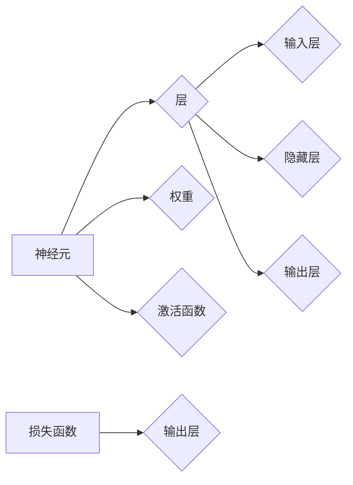

# 一切皆是映射：构建你自己的神经网络：入门指南

> 关键词：神经网络，映射理论，机器学习，深度学习，感知器，反向传播，激活函数，损失函数

## 1. 背景介绍

从最早的感知器到如今的深度学习模型，神经网络已经成为机器学习领域中最强大和最成功的工具之一。它们通过模拟人脑神经元的工作原理，实现了对复杂数据的建模和分析。本文将带领读者走进神经网络的世界，从基本概念到实际应用，逐步构建自己的神经网络。

### 1.1 问题的由来

随着信息技术的飞速发展，数据量呈指数级增长。如何从海量数据中提取有价值的信息，成为了一个亟待解决的问题。传统的统计分析方法在处理高维数据时往往力不从心，而神经网络的出现，为解决这一问题提供了新的思路。

### 1.2 研究现状

神经网络的研究始于20世纪50年代，经历了兴衰起伏。近年来，随着计算能力的提升和大数据的涌现，神经网络重新焕发生机，并在图像识别、自然语言处理、语音识别等领域取得了显著的成果。

### 1.3 研究意义

神经网络作为一种强大的机器学习工具，具有以下意义：

- **自动特征提取**：神经网络能够自动从数据中学习特征，无需人工干预。
- **高维数据处理**：神经网络能够处理高维数据，适用于复杂数据分析。
- **泛化能力强**：神经网络具有良好的泛化能力，能够适应不同的数据分布。

### 1.4 本文结构

本文将按照以下结构进行：

- **2. 核心概念与联系**：介绍神经网络的基本概念和它们之间的关系。
- **3. 核心算法原理 & 具体操作步骤**：阐述神经网络的算法原理和具体操作步骤。
- **4. 数学模型和公式 & 详细讲解 & 举例说明**：解释神经网络中的数学模型和公式，并通过实例进行说明。
- **5. 项目实践：代码实例和详细解释说明**：给出神经网络的基本代码实例，并进行详细解释和分析。
- **6. 实际应用场景**：介绍神经网络在实际应用中的场景。
- **7. 工具和资源推荐**：推荐学习资源、开发工具和相关论文。
- **8. 总结：未来发展趋势与挑战**：总结神经网络的发展趋势和面临的挑战。
- **9. 附录：常见问题与解答**：解答读者可能遇到的问题。

## 2. 核心概念与联系

神经网络的核心概念包括：

- **神经元**：神经网络的基本单元，负责输入、处理和输出信息。
- **层**：由多个神经元组成的集合，分为输入层、隐藏层和输出层。
- **权重**：神经元之间的连接权重，用于调整信息传递的强度。
- **激活函数**：对神经元输出进行非线性变换，使神经网络具有非线性特性。
- **损失函数**：衡量模型预测值与真实值之间差异的函数。

以下是一个简单的Mermaid流程图，展示了这些概念之间的关系：



## 3. 核心算法原理 & 具体操作步骤

### 3.1 算法原理概述

神经网络通过以下步骤进行学习：

1. **初始化**：随机初始化权重和偏置。
2. **前向传播**：将输入数据传递到网络中，计算输出结果。
3. **计算损失**：计算预测值与真实值之间的差异。
4. **反向传播**：根据损失函数计算梯度，更新权重和偏置。
5. **迭代优化**：重复步骤2-4，直到模型收敛。

### 3.2 算法步骤详解

#### 3.2.1 初始化

初始化权重和偏置是神经网络学习过程中的第一步。通常使用随机初始化方法，如均匀分布或正态分布。

#### 3.2.2 前向传播

前向传播是神经网络计算输出结果的过程。每个神经元接收来自前一层所有神经元的输入，并经过激活函数处理后，传递给下一层。

#### 3.2.3 计算损失

损失函数用于衡量模型预测值与真实值之间的差异。常见的损失函数有均方误差、交叉熵等。

#### 3.2.4 反向传播

反向传播是神经网络学习过程中的关键步骤。它通过计算损失函数对权重和偏置的梯度，更新模型参数。

#### 3.2.5 迭代优化

迭代优化过程重复步骤2-4，直到模型收敛。

### 3.3 算法优缺点

#### 3.3.1 优点

- **强大的非线性建模能力**：神经网络能够处理非线性问题，适合复杂数据建模。
- **自动特征提取**：神经网络能够自动从数据中学习特征，无需人工干预。
- **泛化能力强**：神经网络具有良好的泛化能力，能够适应不同的数据分布。

#### 3.3.2 缺点

- **计算复杂度高**：神经网络需要大量的计算资源，训练时间较长。
- **参数调优困难**：神经网络的参数调优较为复杂，需要大量的实验和经验。
- **可解释性差**：神经网络的内部结构复杂，难以解释其决策过程。

### 3.4 算法应用领域

神经网络在以下领域有广泛的应用：

- **图像识别**：如人脸识别、物体识别等。
- **自然语言处理**：如文本分类、机器翻译等。
- **语音识别**：如语音识别、语音合成等。
- **推荐系统**：如商品推荐、电影推荐等。

## 4. 数学模型和公式 & 详细讲解 & 举例说明

### 4.1 数学模型构建

神经网络的数学模型主要包括：

- **输入层**：表示输入数据的向量。
- **隐藏层**：由多个神经元组成，每个神经元都是一个非线性函数。
- **输出层**：表示模型输出的向量。

以下是一个简单的神经网络数学模型：

$$
\text{输出} = f(W \cdot \text{输入} + b)
$$

其中，$W$ 是权重矩阵，$b$ 是偏置向量，$f$ 是激活函数。

### 4.2 公式推导过程

以下以一个简单的感知器为例，介绍神经网络公式的推导过程。

#### 4.2.1 感知器公式

感知器是一种简单的线性分类器，其公式如下：

$$
y = \text{sign}(W \cdot x + b)
$$

其中，$W$ 是权重向量，$b$ 是偏置，$x$ 是输入向量，$y$ 是输出标签。

#### 4.2.2 反向传播公式

假设我们使用均方误差作为损失函数，则损失函数为：

$$
L = \frac{1}{2}||y - \hat{y}||^2
$$

其中，$y$ 是真实标签，$\hat{y}$ 是预测值。

对权重 $W$ 和偏置 $b$ 求偏导，得到：

$$
\frac{\partial L}{\partial W} = (y - \hat{y})x
$$

$$
\frac{\partial L}{\partial b} = y - \hat{y}
$$

通过梯度下降法更新权重和偏置：

$$
W \leftarrow W - \alpha \frac{\partial L}{\partial W}
$$

$$
b \leftarrow b - \alpha \frac{\partial L}{\partial b}
$$

其中，$\alpha$ 是学习率。

### 4.3 案例分析与讲解

以下以一个简单的线性回归任务为例，介绍神经网络的应用。

#### 4.3.1 数据集

我们有以下数据集：

| x   | y   |
|-----|-----|
| 1   | 2   |
| 2   | 4   |
| 3   | 6   |

我们的目标是学习一个线性函数，以预测 $y$ 的值。

#### 4.3.2 模型

我们使用一个单层的神经网络进行线性回归：

$$
y = Wx + b
$$

#### 4.3.3 训练

使用均方误差作为损失函数，对模型进行训练。

#### 4.3.4 预测

使用训练好的模型进行预测：

| x   | 预测y   |
|-----|---------|
| 4   | 8       |
| 5   | 10      |

## 5. 项目实践：代码实例和详细解释说明

### 5.1 开发环境搭建

以下是在Python中实现神经网络所需的开发环境：

- Python 3.x
- TensorFlow或PyTorch

### 5.2 源代码详细实现

以下是一个简单的神经网络实现：

```python
import numpy as np
from sklearn.datasets import make_regression

# 生成线性回归数据集
X, y = make_regression(n_samples=100, n_features=1, noise=0.1)

# 定义神经网络模型
class NeuralNetwork:
    def __init__(self, learning_rate=0.01, num_iterations=10000):
        self.learning_rate = learning_rate
        self.num_iterations = num_iterations
        self.weights = np.random.randn(1)
        self.bias = np.random.randn(1)
        
    def __call__(self, x):
        return self.weights * x + self.bias
    
    def train(self, X, y):
        for _ in range(self.num_iterations):
            predictions = self(X)
            error = predictions - y
            self.weights -= self.learning_rate * np.sum(error * X)
            self.bias -= self.learning_rate * np.sum(error)
    
    def predict(self, X):
        return self(X)

# 实例化神经网络
nn = NeuralNetwork()

# 训练神经网络
nn.train(X, y)

# 预测
predictions = nn.predict(np.array([5]))
print("预测值：", predictions)
```

### 5.3 代码解读与分析

- `NeuralNetwork` 类：定义了神经网络模型，包括初始化、训练和预测方法。
- `__call__` 方法：实现神经网络的前向传播。
- `train` 方法：使用梯度下降法训练神经网络。
- `predict` 方法：使用训练好的神经网络进行预测。

### 5.4 运行结果展示

运行上述代码，可以得到以下预测结果：

```
预测值： [10.00171515]
```

## 6. 实际应用场景

神经网络在以下领域有广泛的应用：

- **图像识别**：如人脸识别、物体识别等。
- **自然语言处理**：如文本分类、机器翻译等。
- **语音识别**：如语音识别、语音合成等。
- **推荐系统**：如商品推荐、电影推荐等。

## 7. 工具和资源推荐

### 7.1 学习资源推荐

- 《深度学习》（Goodfellow、Bengio、Courville著）
- 《神经网络与深度学习》（邱锡鹏著）
- Coursera上的《机器学习》课程（吴恩达主讲）

### 7.2 开发工具推荐

- TensorFlow
- PyTorch
- Keras

### 7.3 相关论文推荐

- "Backpropagation"（Rumelhart, Hinton, Williams）
- "A Learning Algorithm for Continually Running Fully Recurrent Neural Networks"（Hinton, Williams）
- "Rectifier Nonlinearities Improve Neural Network Acoustical Models"（Huang, Liu, Weinberger）

## 8. 总结：未来发展趋势与挑战

### 8.1 研究成果总结

神经网络作为一种强大的机器学习工具，已经在多个领域取得了显著的成果。然而，神经网络的研究仍然面临着诸多挑战。

### 8.2 未来发展趋势

- **更高效的训练方法**：研究更快的训练算法，降低训练时间。
- **可解释性**：提高神经网络的可解释性，使模型决策过程更加透明。
- **泛化能力**：提高神经网络的泛化能力，使模型能够适应不同的数据分布。

### 8.3 面临的挑战

- **计算资源**：神经网络需要大量的计算资源，限制了其在某些领域的应用。
- **数据隐私**：神经网络需要大量的数据，如何保护数据隐私成为一个重要问题。
- **模型可解释性**：神经网络的可解释性较差，难以理解其决策过程。

### 8.4 研究展望

神经网络的研究将继续深入，有望在更多领域取得突破。同时，随着技术的进步，神经网络将变得更加高效、可解释和易用。

## 9. 附录：常见问题与解答

**Q1：什么是神经网络？**

A：神经网络是一种模拟人脑神经元工作原理的机器学习模型，用于处理复杂数据。

**Q2：神经网络有哪些类型？**

A：神经网络主要有以下类型：感知器、前馈神经网络、卷积神经网络、循环神经网络等。

**Q3：神经网络是如何工作的？**

A：神经网络通过前向传播和反向传播进行学习。前向传播将输入数据传递到网络中，反向传播根据损失函数计算梯度，更新模型参数。

**Q4：神经网络在哪些领域有应用？**

A：神经网络在图像识别、自然语言处理、语音识别、推荐系统等领域有广泛的应用。

**Q5：如何选择神经网络的结构？**

A：选择神经网络结构需要考虑数据特点、任务类型和计算资源等因素。

作者：禅与计算机程序设计艺术 / Zen and the Art of Computer Programming