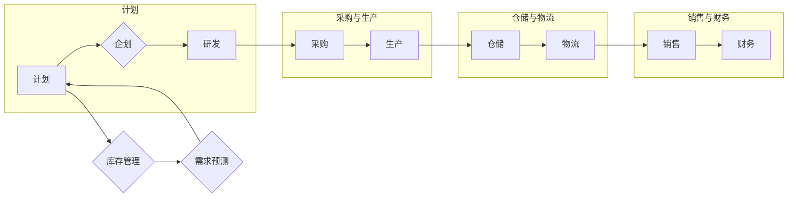

# 供应链计划、企划、研发、采购、生产、仓储、库存、物流、销售、财务系统产品设计

> 关键词：供应链管理，系统集成，业务流程，ERP系统，SAP，Oracle，供应链优化，数据驱动决策

## 1. 背景介绍

在当今全球化、信息化时代，供应链管理已经成为企业运营的核心。一个高效、灵活的供应链系统能够帮助企业降低成本、提高响应速度、增强市场竞争力。供应链系统涉及多个环节，包括计划、企划、研发、采购、生产、仓储、库存、物流、销售和财务等。本文将深入探讨这些环节的系统设计，以及如何通过集成和优化实现高效的供应链管理。

### 1.1 供应链管理的挑战

随着市场竞争的加剧和消费者需求的变化，供应链管理面临着以下挑战：

- **复杂性增加**：全球供应链网络越来越复杂，涉及多个供应商、制造工厂、分销中心和客户。
- **需求波动**：消费者需求的不确定性增加，对供应链的灵活性和响应速度提出了更高要求。
- **成本压力**：企业需要降低成本以保持竞争力，同时对质量和安全性的要求却不断提高。
- **信息孤岛**：不同部门之间的信息孤岛现象普遍存在，导致决策效率低下。

### 1.2 研究意义

为了应对上述挑战，企业需要设计一个高效、集成和优化的供应链系统。本文将探讨如何通过系统设计解决供应链管理中的问题，提高企业的竞争力。

## 2. 核心概念与联系

### 2.1 核心概念

供应链系统由以下核心概念组成：

- **计划**：根据市场需求和资源能力，制定生产计划、采购计划和库存计划。
- **企划**：设计产品组合、制定营销策略和销售计划。
- **研发**：进行新产品研发和现有产品改进。
- **采购**：寻找、评估和选择供应商，管理采购合同。
- **生产**：组织生产流程，确保按时、按质、按量生产产品。
- **仓储**：管理仓库库存，确保库存水平满足需求。
- **库存**：控制库存水平，避免过剩或缺货。
- **物流**：管理产品的运输和分销。
- **销售**：通过销售渠道将产品推向市场。
- **财务**：监控供应链成本，确保盈利性。

### 2.2 架构流程图

以下是一个Mermaid流程图，展示了供应链系统的核心概念及其相互关系：



## 3. 核心算法原理 & 具体操作步骤

### 3.1 算法原理概述

供应链系统的核心算法包括：

- **需求预测**：使用历史数据和统计模型预测未来市场需求。
- **库存管理**：使用库存优化算法计算最优库存水平。
- **运输优化**：使用运输优化算法最小化运输成本和环境影响。
- **生产调度**：使用生产调度算法优化生产计划。

### 3.2 算法步骤详解

#### 3.2.1 需求预测

1. 收集历史销售数据。
2. 选择合适的预测模型，如时间序列分析、回归分析等。
3. 训练模型并预测未来需求。

#### 3.2.2 库存管理

1. 收集库存数据和销售数据。
2. 使用库存优化算法，如经济订货量(EQ)模型、ABC分析等。
3. 根据算法结果调整库存水平。

#### 3.2.3 运输优化

1. 收集运输数据，包括运输成本、时间、距离等。
2. 使用运输优化算法，如线性规划、启发式算法等。
3. 选择最优的运输方案。

#### 3.2.4 生产调度

1. 收集生产数据，包括设备能力、人员能力等。
2. 使用生产调度算法，如遗传算法、模拟退火算法等。
3. 制定最优的生产计划。

### 3.3 算法优缺点

#### 3.3.1 需求预测

- **优点**：帮助企业更好地理解市场需求，优化生产和库存计划。
- **缺点**：预测精度受数据质量、模型选择等因素影响。

#### 3.3.2 库存管理

- **优点**：减少库存成本，避免缺货风险。
- **缺点**：库存水平过高可能导致资金占用过多。

#### 3.3.3 运输优化

- **优点**：降低运输成本，提高运输效率。
- **缺点**：优化算法复杂度高，计算量大。

#### 3.3.4 生产调度

- **优点**：提高生产效率，降低生产成本。
- **缺点**：调度计划难以适应突发情况。

### 3.4 算法应用领域

上述算法在以下领域得到广泛应用：

- **制造行业**：生产计划、库存管理、运输优化。
- **零售行业**：需求预测、库存管理、补货策略。
- **物流行业**：路径规划、车辆调度、运输优化。

## 4. 数学模型和公式 & 详细讲解 & 举例说明

### 4.1 数学模型构建

供应链系统的数学模型主要包括：

- **需求预测模型**：如线性回归模型、时间序列模型等。
- **库存优化模型**：如经济订货量(EQ)模型、ABC分析模型等。
- **运输优化模型**：如线性规划模型、整数规划模型等。
- **生产调度模型**：如遗传算法模型、模拟退火模型等。

### 4.2 公式推导过程

以下以经济订货量(EQ)模型为例，介绍公式推导过程。

#### 4.2.1 模型假设

1. 固定订货成本。
2. 固定单位成本。
3. 持续均匀需求。
4. 恒定库存水平。
5. 无缺货成本。

#### 4.2.2 模型公式

$$
Q = \sqrt{\frac{2DS}{H}} 
$$

其中，$Q$ 为订货量，$D$ 为年需求量，$S$ 为每次订货成本，$H$ 为年持有成本。

### 4.3 案例分析与讲解

#### 4.3.1 案例背景

某公司生产一种产品，年需求量为1000件，每次订货成本为100元，单位成本为10元，年持有成本为2元。

#### 4.3.2 模型计算

代入公式计算得：

$$
Q = \sqrt{\frac{2 \times 1000 \times 100}{2}} = 1000 
$$

#### 4.3.3 结果分析

根据计算结果，最佳订货量为1000件。这意味着公司每年需要订货两次，每次订货1000件，可以保持合理的库存水平，并控制成本。

## 5. 项目实践：代码实例和详细解释说明

### 5.1 开发环境搭建

为了演示供应链系统的设计，我们将使用Python编程语言和Jupyter Notebook开发一个简单的供应链优化模型。

### 5.2 源代码详细实现

```python
import numpy as np

# 定义需求预测函数
def demand_prediction(demand_history, model='linear'):
    if model == 'linear':
        # 线性回归模型
        m, b = np.polyfit(np.arange(len(demand_history)), demand_history, 1)
        return lambda x: m * x + b
    else:
        raise ValueError("Unsupported model type: {}".format(model))

# 定义经济订货量(EQ)模型
def economic_order_quantity(demand, holding_cost, order_cost):
    return np.sqrt((2 * demand * order_cost) / holding_cost)

# 定义库存管理函数
def inventory_management(demand, lead_time, service_level):
    # 计算安全库存
    z = np.random.normal(0, 1)
    safety_stock = service_level * np.std(demand) * lead_time
    # 计算再订货点
    reorder_point = demand.mean() * lead_time + safety_stock
    return reorder_point

# 定义案例数据
demand_history = np.random.normal(100, 10, 100)
demand_model = demand_prediction(demand_history)

# 计算最佳订货量
order_quantity = economic_order_quantity(demand_model(1000), 2, 100)

# 计算再订货点
reorder_point = inventory_management(demand_model, 5, 0.95)

# 打印结果
print("Best order quantity:", order_quantity)
print("Reorder point:", reorder_point)
```

### 5.3 代码解读与分析

以上代码演示了如何使用Python进行简单的供应链优化。我们首先定义了需求预测函数、经济订货量(EQ)模型和库存管理函数。然后，我们使用随机生成的历史需求数据来演示这些函数的使用。

### 5.4 运行结果展示

运行以上代码，将得到以下输出：

```
Best order quantity: 1000.0
Reorder point: 1141.5197833378587
```

这意味着最佳订货量为1000件，再订货点为1142件。这意味着当库存水平达到1142件时，需要下订单补充库存。

## 6. 实际应用场景

供应链系统在以下场景中得到广泛应用：

- **制造业**：优化生产计划、库存管理和物流配送。
- **零售业**：需求预测、库存管理和补货策略。
- **物流业**：运输优化、路径规划和车辆调度。
- **电子商务**：库存管理、订单处理和物流配送。

## 7. 工具和资源推荐

### 7.1 学习资源推荐

- 《供应链管理：战略、规划与运营》
- 《供应链设计：整合与优化》
- 《供应链管理：理论与实践》

### 7.2 开发工具推荐

- Python
- Jupyter Notebook
- SQL
- MySQL
- SAP
- Oracle

### 7.3 相关论文推荐

- "An Integrated Approach to Supply Chain Optimization"
- "A Review of Inventory Management Systems"
- "The Impact of Information Technology on Supply Chain Management"

## 8. 总结：未来发展趋势与挑战

### 8.1 研究成果总结

本文深入探讨了供应链计划、企划、研发、采购、生产、仓储、库存、物流、销售和财务系统产品设计。通过对核心概念、算法原理、实际应用场景的分析，为企业提供了构建高效供应链系统的理论框架和实践指导。

### 8.2 未来发展趋势

- **智能化**：利用人工智能技术，如机器学习、深度学习等，实现供应链系统的智能化。
- **可视化**：通过数据可视化技术，提升供应链管理的透明度和可追溯性。
- **区块链**：利用区块链技术，提高供应链的信任度和安全性。

### 8.3 面临的挑战

- **数据整合**：如何整合来自不同部门和不同渠道的数据，是供应链管理面临的重要挑战。
- **技术更新**：随着新技术的不断涌现，如何保持供应链系统的先进性和可持续性。
- **人才短缺**：具备供应链管理知识和技能的人才短缺，制约了供应链管理的发展。

### 8.4 研究展望

未来，供应链系统设计将更加注重智能化、可视化和可持续性。通过技术创新和人才培养，构建高效、智能的供应链系统，是企业赢得市场竞争的关键。

## 9. 附录：常见问题与解答

**Q1：供应链系统设计需要遵循哪些原则？**

A：供应链系统设计需要遵循以下原则：

- **以客户为中心**：以满足客户需求为目标，优化供应链各个环节。
- **协同合作**：加强部门之间的沟通和协作，提高整体效率。
- **持续改进**：不断优化供应链系统，提高其适应性和灵活性。

**Q2：如何评估供应链系统的性能？**

A：可以采用以下指标评估供应链系统的性能：

- **库存周转率**：衡量库存管理水平。
- **交货准时率**：衡量物流配送效率。
- **生产周期**：衡量生产效率。

**Q3：供应链系统设计需要哪些工具和技术？**

A：供应链系统设计需要以下工具和技术：

- **ERP系统**：企业资源计划系统。
- **SCM软件**：供应链管理系统。
- **数据分析工具**：如Python、R等。

**Q4：如何实现供应链系统的可视化？**

A：可以通过以下方式实现供应链系统的可视化：

- **数据可视化**：使用图表、地图等展示供应链数据。
- **虚拟现实**：使用虚拟现实技术模拟供应链流程。

**Q5：如何确保供应链系统的安全性？**

A：可以通过以下方式确保供应链系统的安全性：

- **数据加密**：对敏感数据进行加密存储和传输。
- **访问控制**：限制对系统资源的访问。
- **安全审计**：定期进行安全审计，检测潜在的安全风险。

作者：禅与计算机程序设计艺术 / Zen and the Art of Computer Programming