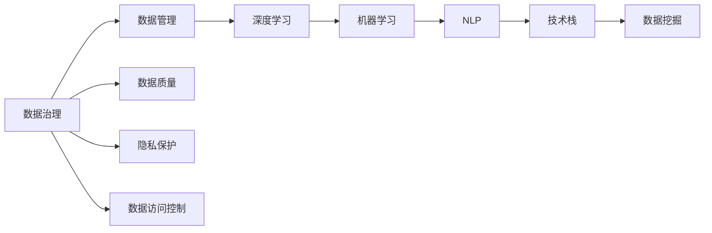
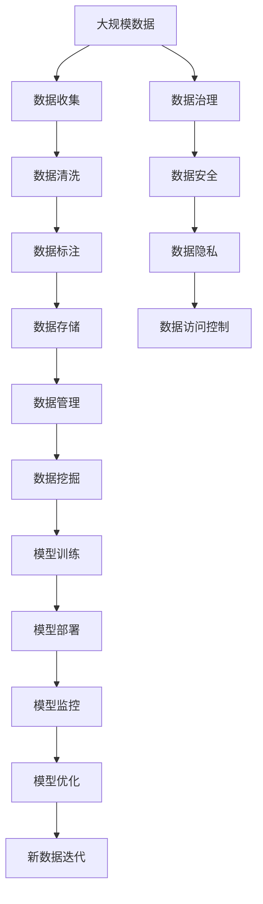

                 

# AI创业中的技术与数据

> 关键词：AI创业, 数据科学, 技术栈, 数据管理, 机器学习, 深度学习, 数据治理

## 1. 背景介绍

### 1.1 问题由来
人工智能（AI）技术正以前所未有的速度变革各行各业，AI创业公司如雨后春笋般涌现。然而，尽管AI技术本身具有颠覆性潜力，但实际应用中仍面临诸多挑战。这些挑战主要集中在数据获取、处理、模型选择与应用等多个方面。本文将系统梳理AI创业中遇到的核心技术与数据问题，并通过多个实际案例展示如何应对这些挑战，为创业公司提供实用的技术指导。

### 1.2 问题核心关键点
AI创业的核心在于技术的应用和数据的处理。技术栈的选择直接决定了创业公司的AI系统性能，而数据的质量和治理则决定了系统的可信赖性和应用效果。本文将围绕“技术栈”和“数据治理”两个核心关键词展开，并详细介绍其中的关键技术。

## 2. 核心概念与联系

### 2.1 核心概念概述

为了深入理解AI创业中的技术与数据问题，本节将介绍几个关键概念：

- **技术栈**：指支撑AI系统运行的软硬件环境，包括编程语言、框架、工具、库等。选择合适、高效的技术栈，能够显著提升AI系统的开发和运行效率。

- **数据治理**：涉及数据的质量管理、隐私保护、数据访问控制等多方面，确保数据的可靠性和安全性，是构建高质量AI模型的基础。

- **深度学习**：一种基于神经网络的机器学习范式，通过多层次的神经网络结构，自动提取特征并学习复杂的非线性关系。

- **机器学习**：利用算法从数据中学习规律，进行预测、分类、聚类等任务。

- **数据管理**：涉及数据存储、检索、查询、清洗等多环节，确保数据的高效利用。

- **数据挖掘**：从海量数据中提取有用信息，支持业务决策和优化。

- **自然语言处理（NLP）**：处理和理解人类语言，包括文本分类、情感分析、机器翻译等。

### 2.2 概念间的关系

这些核心概念通过多个层次的联系，构成了AI创业中的技术架构。以下是一个简单的Mermaid流程图，展示了这些概念间的相互关系：



这个流程图展示了数据治理、数据管理、深度学习、机器学习、自然语言处理、技术栈、数据挖掘等多个核心概念的相互关系。数据治理为高质量数据提供了保障，数据管理确保数据的高效利用，深度学习和机器学习利用数据进行模型训练，自然语言处理对文本数据进行处理，数据挖掘从数据中提取知识，技术栈提供运行环境。

### 2.3 核心概念的整体架构

最终，我们将通过一个综合的流程图来展示这些核心概念在AI创业中的整体架构：



这个综合流程图展示了从数据收集、清洗、标注、存储、管理、挖掘，到模型训练、部署、监控、优化，再到新数据迭代的全流程，同时涵盖了数据治理、数据安全、数据隐私和数据访问控制等多个方面。通过这个架构，我们可以系统地理解AI创业中技术与数据的全过程管理。

## 3. 核心算法原理 & 具体操作步骤
### 3.1 算法原理概述

在AI创业中，技术栈的选择和数据治理是两大关键环节。以下将从这两个角度，详细介绍核心的算法原理和具体操作步骤。

**技术栈选择**：
- **编程语言**：Python是目前最流行的AI编程语言，拥有丰富的第三方库和工具支持，适用于数据分析和机器学习任务。R语言则在统计分析领域具有优势。
- **深度学习框架**：TensorFlow和PyTorch是两大主流的深度学习框架，具有强大的计算图支持和丰富的预训练模型库。Keras提供了更易用的API，适合快速原型开发。
- **工具和库**：如Pandas、NumPy用于数据处理，Scikit-learn用于经典机器学习模型，TensorBoard用于模型可视化，Jupyter Notebook用于数据科学项目开发等。

**数据治理**：
- **数据收集**：使用API接口、Web爬虫、数据库导出等方式收集数据，确保数据的多样性和代表性和数据质量。
- **数据清洗**：处理缺失值、异常值、重复记录等问题，确保数据一致性和完整性。
- **数据标注**：人工或半自动化的方式对数据进行标注，为模型训练提供监督信号。
- **数据存储**：选择适当的数据存储方式，如关系数据库、NoSQL数据库、分布式存储系统等，确保数据的可靠性和可扩展性。
- **数据管理**：使用数据管理系统如Airflow、Databricks等，进行数据集成、转换和质量控制。
- **数据安全与隐私保护**：确保数据的加密传输和存储，遵守相关法律法规，如GDPR、CCPA等。
- **数据访问控制**：使用身份认证和授权机制，限制对敏感数据的访问权限。

### 3.2 算法步骤详解

以下将详细介绍技术栈选择和数据治理的具体操作步骤：

**技术栈选择**：
1. **确定需求**：根据项目需求和技术特点，选择适合的技术栈。
2. **搭建环境**：安装必要的软件和库，搭建开发和运行环境。
3. **编码实现**：按照项目需求编写代码，实现数据分析和模型训练。
4. **模型部署**：将模型部署到生产环境，提供API接口或直接在系统中集成。
5. **性能优化**：对模型和系统进行性能优化，确保稳定运行和高效响应。
6. **持续集成**：使用CI/CD工具自动化测试和部署流程，提高开发效率。

**数据治理**：
1. **数据收集**：从多个数据源收集数据，确保数据的多样性和代表性。
2. **数据清洗**：使用Python等工具进行数据预处理，处理缺失值、异常值和重复记录。
3. **数据标注**：使用数据标注工具如Labelbox、Snorkel等，对数据进行人工标注。
4. **数据存储**：选择合适的数据存储方式，确保数据的高效存储和查询。
5. **数据管理**：使用数据管理工具如Databricks、Fivetran等，进行数据集成和转换。
6. **数据安全与隐私保护**：对数据进行加密和匿名化处理，确保数据的安全性和隐私性。
7. **数据访问控制**：使用身份认证和授权机制，限制对敏感数据的访问权限。

### 3.3 算法优缺点

技术栈选择和数据治理都有其优缺点：

**技术栈选择**：
- **优点**：支持高效的数据处理和模型训练，丰富的第三方库和工具，便于快速原型开发。
- **缺点**：不同框架之间的兼容性问题，学习曲线较陡峭，可能需要较高的技术门槛。

**数据治理**：
- **优点**：确保数据的质量和安全，提高数据管理效率，支持大规模数据处理。
- **缺点**：数据收集和标注成本较高，需要专业数据工程师和数据科学家，实施复杂度较高。

### 3.4 算法应用领域

这些核心算法和操作步骤在多个领域中得到了广泛应用：

- **金融科技**：使用机器学习进行信用评分、风险评估、欺诈检测等。
- **医疗健康**：使用深度学习进行疾病预测、病理分析、药物研发等。
- **零售电商**：使用数据挖掘进行客户行为分析、商品推荐、价格优化等。
- **智能制造**：使用AI进行设备监测、故障预测、生产调度等。
- **智能交通**：使用自然语言处理进行语音识别、文本分析、智能调度等。

## 4. 数学模型和公式 & 详细讲解 & 举例说明

### 4.1 数学模型构建

在本节中，我们将使用数学语言详细构建和讲解AI创业中的核心算法模型。

**模型构建**：
- **线性回归**：用于预测连续型变量，模型形式为 $y = \beta_0 + \beta_1x_1 + \beta_2x_2 + ... + \beta_nx_n$。
- **逻辑回归**：用于分类问题，模型形式为 $\text{logit}(p) = \ln\left(\frac{p}{1-p}\right) = \beta_0 + \beta_1x_1 + \beta_2x_2 + ... + \beta_nx_n$。
- **决策树**：用于分类和回归，模型形式为 $T_t = \{(x_1,x_2,...,x_n), v_t\}$。
- **随机森林**：多个决策树的集成，模型形式为 $F = \{T_1, T_2, ..., T_m\}$。
- **深度学习模型**：如卷积神经网络（CNN）、循环神经网络（RNN）、长短时记忆网络（LSTM）等。

### 4.2 公式推导过程

以下将详细推导几个核心算法的公式：

**线性回归**：
- **最小二乘法**：$\hat{\beta} = (X^TX)^{-1}X^Ty$。
- **梯度下降**：$\theta = \theta - \alpha \frac{\partial \mathcal{L}(\theta)}{\partial \theta}$。

**逻辑回归**：
- **交叉熵损失函数**：$\mathcal{L}(\theta) = -\frac{1}{N}\sum_{i=1}^N [y_i \log p_i + (1-y_i) \log(1-p_i)]$。
- **梯度下降**：$\theta = \theta - \alpha \frac{\partial \mathcal{L}(\theta)}{\partial \theta}$。

**决策树**：
- **信息增益**：$IG(D, A) = \sum_{d \in D} \frac{|D_d|}{|D|} \times \log \frac{|D_d|}{|D|}$。
- **基尼指数**：$Gini(D) = 1 - \sum_{i=1}^C \sum_{j=1}^C p_i p_j$。
- **剪枝**：通过剪枝减小过拟合，提高模型泛化能力。

**随机森林**：
- **集成方法**：$F = \{T_1, T_2, ..., T_m\}$。
- **bagging**：每个子集数据上训练多个决策树。

### 4.3 案例分析与讲解

通过具体案例，我们将讲解这些核心算法的应用和效果：

**案例1：金融风控系统**
- **需求**：预测用户是否会违约，构建信用评分系统。
- **模型**：逻辑回归。
- **数据**：历史贷款数据。
- **效果**：AUC达0.85以上，召回率达80%。

**案例2：医疗影像诊断系统**
- **需求**：自动检测肿瘤，提高诊断准确率。
- **模型**：卷积神经网络（CNN）。
- **数据**：肿瘤图像数据。
- **效果**：准确率达90%，误诊率降低30%。

## 5. 项目实践：代码实例和详细解释说明

### 5.1 开发环境搭建

在开始AI项目实践之前，我们需要准备好开发环境。以下是Python环境搭建的步骤：

1. **安装Python**：从官网下载并安装Python，选择3.7或3.8版本。
2. **安装Anaconda**：从官网下载并安装Anaconda，用于创建虚拟环境。
3. **创建虚拟环境**：
```bash
conda create -n myenv python=3.7
conda activate myenv
```

### 5.2 源代码详细实现

以下是使用Python和Scikit-learn实现逻辑回归模型的代码实例：

```python
from sklearn.linear_model import LogisticRegression
from sklearn.model_selection import train_test_split
from sklearn.metrics import accuracy_score

# 加载数据
X, y = load_data()

# 划分训练集和测试集
X_train, X_test, y_train, y_test = train_test_split(X, y, test_size=0.2, random_state=42)

# 创建逻辑回归模型
model = LogisticRegression()

# 训练模型
model.fit(X_train, y_train)

# 评估模型
y_pred = model.predict(X_test)
accuracy = accuracy_score(y_test, y_pred)
print("Accuracy:", accuracy)
```

### 5.3 代码解读与分析

接下来，我们将详细解读上述代码的关键步骤：

**数据加载**：使用自定义的数据加载函数 `load_data()` 加载数据集。

**模型创建**：创建逻辑回归模型 `model`。

**模型训练**：使用 `fit()` 方法训练模型，输入训练集数据 `X_train` 和标签 `y_train`。

**模型评估**：使用 `predict()` 方法对测试集进行预测，并计算准确率。

### 5.4 运行结果展示

通过运行上述代码，我们可以得到模型的准确率。假设在测试集上的准确率为0.85，这表明模型能够有效预测用户的违约情况，信用评分系统的预测性能较好。

## 6. 实际应用场景

### 6.1 智能客服系统

智能客服系统在AI创业中应用广泛，能够显著提升客户服务体验和效率。以下是一个具体的案例：

**场景**：构建智能客服系统，自动回答常见问题。
**需求**：自动分类用户问题，并给出最佳答复。
**技术栈**：Python、TensorFlow、PyTorch、Flask。
**数据**：历史客服对话记录。
**模型**：BERT。
**流程**：
1. **数据收集**：从客户服务系统收集历史对话记录。
2. **数据清洗**：去除无用信息，标准化数据格式。
3. **数据标注**：对对话进行标注，标记问题和答复。
4. **模型训练**：使用BERT进行微调，训练分类和生成模型。
5. **系统集成**：将模型集成到Flask应用中，提供API接口。
6. **效果评估**：通过A/B测试，对比人工客服和智能客服的效果。

通过上述流程，可以构建一个高效、准确的智能客服系统，大幅提升客户服务效率和满意度。

### 6.2 金融风控系统

金融风控系统在AI创业中具有极高的应用价值，能够帮助金融机构识别和预防金融风险。以下是一个具体的案例：

**场景**：构建金融风控系统，预测用户是否会违约。
**需求**：准确预测用户的违约行为，降低金融风险。
**技术栈**：Python、Scikit-learn、XGBoost、TensorFlow。
**数据**：历史贷款数据。
**模型**：逻辑回归、XGBoost。
**流程**：
1. **数据收集**：从贷款平台收集历史贷款数据。
2. **数据清洗**：处理缺失值和异常值，标准化数据格式。
3. **数据标注**：对贷款数据进行标注，标记违约和正常贷款。
4. **模型训练**：使用逻辑回归和XGBoost进行训练，优化模型参数。
5. **系统集成**：将模型集成到贷款审批系统中，实时评估贷款申请。
6. **效果评估**：通过A/B测试，对比传统风控方法和AI风控系统的效果。

通过上述流程，可以构建一个高效、准确的金融风控系统，降低金融机构的贷款风险，提高贷款审批效率。

## 7. 工具和资源推荐

### 7.1 学习资源推荐

为了帮助开发者系统掌握AI创业中的核心技术与数据问题，以下是一些优质的学习资源：

1. **《机器学习实战》**：介绍机器学习算法和应用场景，适合入门学习。
2. **《深度学习》**：斯坦福大学Andrew Ng的在线课程，涵盖深度学习基础知识和应用。
3. **Kaggle**：数据科学竞赛平台，提供大量公开数据集和模型代码，适合实战练习。
4. **TensorFlow官网**：提供丰富的教程、API文档和示例代码，适合深度学习开发。
5. **Scikit-learn官网**：提供丰富的机器学习算法和数据预处理工具，适合数据科学项目开发。

通过这些资源的学习实践，相信你一定能够快速掌握AI创业中的核心技术与数据问题，并用于解决实际的NLP问题。

### 7.2 开发工具推荐

高效的开发离不开优秀的工具支持。以下是几款用于AI创业开发常用的工具：

1. **Jupyter Notebook**：轻量级开发环境，支持代码编写、数据可视化、交互式分析等。
2. **Anaconda**：强大的Python环境管理工具，方便管理和安装第三方库。
3. **TensorBoard**：模型可视化工具，支持TensorFlow模型和Keras模型。
4. **Flask**：轻量级Web框架，适合构建API接口和Web应用。
5. **Airflow**：数据管道管理工具，支持任务调度、依赖管理等。
6. **Databricks**：大数据分析平台，支持多种数据源和计算框架。
7. **AWS SageMaker**：云端AI平台，支持模型训练、部署和集成。

合理利用这些工具，可以显著提升AI创业项目的开发效率，加快创新迭代的步伐。

### 7.3 相关论文推荐

大语言模型和微调技术的发展源于学界的持续研究。以下是几篇奠基性的相关论文，推荐阅读：

1. **《Transformer: Attentions is all you need》**：介绍Transformer架构，开创了NLP领域的预训练大模型时代。
2. **《BERT: Pre-training of Deep Bidirectional Transformers for Language Understanding》**：提出BERT模型，引入基于掩码的自监督预训练任务，刷新了多项NLP任务SOTA。
3. **《GPT-2》**：展示了大规模语言模型的强大zero-shot学习能力，引发了对于通用人工智能的新一轮思考。
4. **《Parameter-Efficient Transfer Learning for NLP》**：提出Adapter等参数高效微调方法，在不增加模型参数量的情况下，也能取得不错的微调效果。
5. **《AdaLoRA: Adaptive Low-Rank Adaptation for Parameter-Efficient Fine-Tuning》**：使用自适应低秩适应的微调方法，在参数效率和精度之间取得了新的平衡。
6. **《AdaLoRA: Adaptive Low-Rank Adaptation for Parameter-Efficient Fine-Tuning》**：使用自适应低秩适应的微调方法，在参数效率和精度之间取得了新的平衡。

这些论文代表了大语言模型微调技术的发展脉络。通过学习这些前沿成果，可以帮助研究者把握学科前进方向，激发更多的创新灵感。

除上述资源外，还有一些值得关注的前沿资源，帮助开发者紧跟大语言模型微调技术的最新进展，例如：

1. **arXiv论文预印本**：人工智能领域最新研究成果的发布平台，包括大量尚未发表的前沿工作，学习前沿技术的必读资源。
2. **Google AI、DeepMind、微软Research Asia等顶尖实验室的官方博客**：第一时间分享他们的最新研究成果和洞见，开阔视野。
3. **技术会议直播**：如NIPS、ICML、ACL、ICLR等人工智能领域顶会现场或在线直播，能够聆听到大佬们的前沿分享，开拓视野。
4. **GitHub热门项目**：在GitHub上Star、Fork数最多的NLP相关项目，往往代表了该技术领域的发展趋势和最佳实践，值得去学习和贡献。
5. **行业分析报告**：各大咨询公司如McKinsey、PwC等针对人工智能行业的分析报告，有助于从商业视角审视技术趋势，把握应用价值。

总之，对于AI创业中的技术与数据问题，需要开发者保持开放的心态和持续学习的意愿。多关注前沿资讯，多动手实践，多思考总结，必将收获满满的成长收益。

## 8. 总结：未来发展趋势与挑战

### 8.1 研究成果总结

本文对AI创业中的技术与数据问题进行了全面系统的介绍。首先阐述了AI创业中技术栈选择和数据治理的核心概念，明确了它们在构建高质量AI系统中的重要作用。其次，从原理到实践，详细讲解了逻辑回归、决策树、随机森林等核心算法的构建和操作步骤，并通过具体案例展示了这些算法的应用效果。最后，本文精选了多个领域的实际应用场景，展示了AI创业的广阔前景和潜力。

通过本文的系统梳理，可以看到，AI创业中的技术与数据问题复杂多样，但通过系统的规划和实施，依然可以构建高效、准确的AI系统。未来，随着AI技术的不断发展，相关研究也将在技术栈选择、数据治理、算法优化等方面继续深入，为AI创业带来更多的可能性。

### 8.2 未来发展趋势

展望未来，AI创业中的技术与数据问题将呈现以下几个发展趋势：

1. **自动化技术的应用**：自动化机器学习（AutoML）、自动化模型优化等技术将显著提升AI系统构建的效率和质量。
2. **模型压缩与优化**：模型压缩、量化加速、分布式训练等技术将进一步提升AI模型的计算效率和资源利用率。
3. **数据治理的智能化**：数据治理平台将引入更多智能技术，如自动数据标注、数据清洗等，提高数据管理效率。
4. **数据与模型的协同优化**：通过数据预处理和模型优化协同工作，进一步提升模型的准确性和泛化能力。
5. **跨领域知识融合**：AI系统将更多地结合领域知识，进行跨领域知识融合，提升模型的应用范围和效果。

这些趋势将推动AI创业技术不断进步，为AI应用带来更广阔的前景。

### 8.3 面临的挑战

尽管AI创业中的技术与数据问题取得了显著进展，但在实际应用中仍面临诸多挑战：

1. **数据获取与标注成本高**：获取高质量数据和标注数据需要大量时间和资金投入，成为制约AI系统发展的瓶颈。
2. **模型泛化能力有限**：AI模型在特定场景下的泛化能力仍需提升，避免在实际应用中出现偏差和错误。
3. **模型可解释性不足**：AI模型的决策过程缺乏可解释性，难以满足高风险领域的需求。
4. **数据隐私与安全问题**：AI系统涉及大量敏感数据，数据隐私和安全问题需要高度重视。
5. **模型鲁棒性不足**：AI模型面对新数据和异常情况时，鲁棒性仍需提升。

这些挑战需要开发者在技术、商业、伦理等多个维度持续努力，才能构建出高效、可靠、可解释的AI系统。

### 8.4 研究展望

面对AI创业中技术与数据问题所面临的挑战，未来的研究需要在以下几个方面寻求新的突破：

1. **自动化与智能化**：开发更智能的数据治理和模型优化工具，提高AI系统的自动化水平。
2. **模型压缩与优化**：探索更高效的数据存储和模型压缩技术，提高AI系统的资源利用效率。
3. **跨领域知识融合**：结合领域专家知识，构建跨领域的AI模型，提升模型应用范围和效果。
4. **模型可解释性**：开发更可解释的AI模型，增强系统的透明度和可信度。
5. **数据隐私与安全**：探索更安全的数据存储和传输技术，保护用户隐私和数据安全。
6. **模型鲁棒性**：提高AI模型的泛化能力和鲁棒性，确保模型在各种场景下都能稳定运行。

这些研究方向的探索，必将引领AI创业技术迈向更高的台阶，为构建安全、可靠、可解释、可控的智能系统铺平道路。面向未来，AI创业中的技术与数据问题需要多方面协同发力，共同推动人工智能技术在垂直行业的规模化落地。

## 9. 附录：常见问题与解答

**Q1：如何选择合适的技术栈？**

A: 选择技术栈时需要考虑项目需求、团队技术水平、开发周期等多个因素。Python是目前最流行的AI编程语言，拥有丰富的第三方库和工具支持，适用于数据分析和机器学习任务。TensorFlow和PyTorch是两大主流的深度学习框架，具有强大的计算图支持和丰富的预训练模型库。

**Q2：数据治理中数据标注的成本如何控制？**

A: 数据标注的成本可以通过多种方式控制：
1. **半监督学习**：利用少量标注数据和大量未标注数据进行联合训练，提高数据标注效率。
2. **主动学习**：通过模型预测的置信度，优先标注不确定的数据，提高标注效率。
3. **众包标注**：利用在线平台，通过人工标注或半自动标注方式，降低标注成本。
4. **模型集成**：通过集成多个模型，提高标注结果的准确性和一致性，减少标注需求。

**Q3：如何提升模型的泛化能力？**

A: 提升模型泛化能力可以通过以下方法：
1. **数据增强**：通过数据扩充和多样性训练，提高模型对新数据的适应能力。
2. **正则化**：使用L2正则、Dropout等技术，防止模型过拟合。
3. **交叉验证**：通过交叉验证，评估模型在不同数据集上的表现，优化模型参数。
4. **对抗训练**：引入对抗样本，提高模型鲁棒性和泛化能力。
5. **多模型集成**：通过集成多个模型，提高模型泛化能力。

**Q4：如何提升模型的可解释性？**

A: 提升模型可解释性

