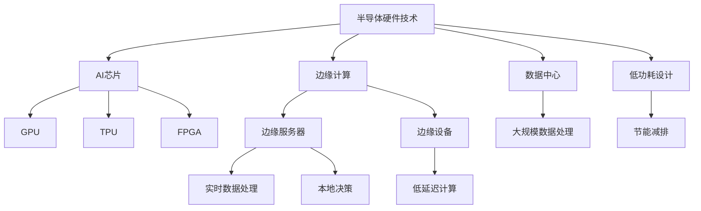
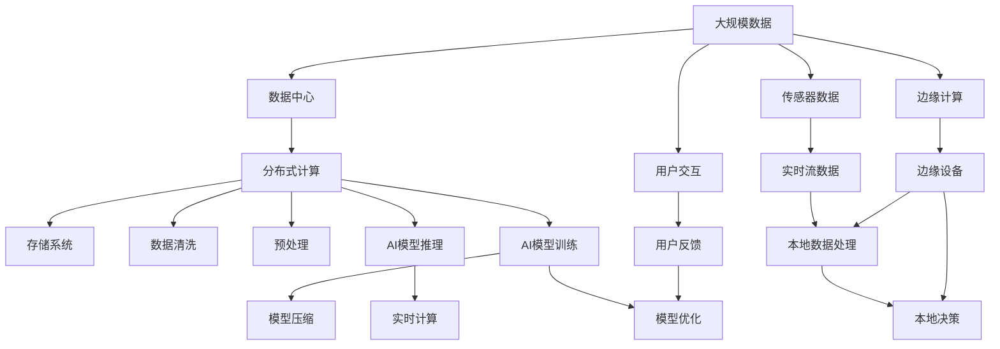

                 

# 半导体硬件技术与AI发展的关系

> 关键词：半导体硬件技术,人工智能,AI芯片,机器学习,深度学习,边缘计算,计算密集型,低功耗,高效率,神经网络,嵌入式系统

## 1. 背景介绍

### 1.1 问题由来

半导体硬件技术作为现代计算机体系的核心，在过去几十年中取得了长足进步，推动了信息时代的飞速发展。与此同时，人工智能（AI）技术也在迅猛发展，成为引领新一轮科技革命的关键力量。半导体硬件与AI技术的紧密结合，已经成为推动AI应用普及和深入的重要因素。

近年来，随着深度学习和神经网络等技术的发展，AI模型在处理大规模数据和复杂任务时展现出了前所未有的能力。但与此同时，这些AI模型也面临着算力需求激增、能耗高昂、计算延迟等问题。这些挑战催生了对于更高效、更节能、更灵活的硬件架构的需求，而半导体硬件技术的发展正是在这一背景下应运而生。

### 1.2 问题核心关键点

半导体硬件与AI技术的结合，主要体现在以下几个方面：

1. **数据处理能力**：AI模型通常需要处理海量数据，半导体硬件的高速计算和并行处理能力能够大幅提升数据处理效率。
2. **能耗和效率**：AI模型在训练和推理过程中需要耗费大量算力，半导体硬件的低功耗和高能效设计可以有效降低能耗。
3. **计算速度**：AI模型的计算密集型特性要求硬件具备快速处理能力，半导体硬件技术的不断进步提供了更多高性能的计算引擎。
4. **边缘计算与分布式计算**：随着物联网和大数据的发展，AI模型需要在边缘设备上进行实时计算，半导体硬件的微型化和集成化设计使得边缘计算成为可能。

这些关键点不仅决定了AI技术的发展方向，也成为了推动半导体硬件技术创新的重要驱动力。

### 1.3 问题研究意义

半导体硬件技术与AI技术的融合，对于推动AI技术的普及和应用，提升计算效率和能效，降低成本具有重要意义：

1. **加速AI应用落地**：高性能、低功耗的AI芯片可以加速AI算法在实际场景中的部署和应用，如自动驾驶、医疗诊断等。
2. **降低能耗和成本**：高效能的硬件设计可以大幅降低AI模型的能耗和运行成本，推动AI技术在更多领域的应用。
3. **提高计算速度和响应速度**：高性能计算引擎可以加速AI模型的训练和推理过程，提升系统响应速度。
4. **支持分布式计算和边缘计算**：半导体硬件的微型化设计支持在边缘设备上进行实时计算，减少数据传输和存储需求。

半导体硬件技术与AI技术的融合，正在推动AI技术向更广阔的领域扩展，为人类社会带来深远的影响。

## 2. 核心概念与联系

### 2.1 核心概念概述

为更好地理解半导体硬件技术与AI发展的关系，本节将介绍几个关键概念：

- **半导体硬件技术**：指用于实现计算机和智能设备的物理芯片和电路设计，包括微处理器、图形处理器（GPU）、张量处理单元（TPU）等。
- **人工智能（AI）**：通过计算机算法和统计模型，使机器模拟人类智能行为的技术领域。
- **AI芯片**：专门用于加速AI算法计算的定制化硬件，如GPU、TPU、FPGA等。
- **机器学习和深度学习**：通过数据驱动的方法，训练模型进行任务预测和决策。
- **边缘计算**：在数据源头附近进行实时计算和数据处理，减少数据传输和存储需求。

这些概念之间存在紧密的联系，通过半导体硬件技术的发展，AI芯片和边缘计算等技术得以实现，推动了AI技术的实际应用。

### 2.2 概念间的关系

这些核心概念之间的逻辑关系可以通过以下Mermaid流程图来展示：



这个流程图展示了半导体硬件技术对AI芯片和边缘计算的支持，以及AI芯片和边缘计算在实际应用中的作用。

### 2.3 核心概念的整体架构

最后，我们用一个综合的流程图来展示这些核心概念在大规模数据处理和AI应用中的整体架构：



这个综合流程图展示了从大规模数据采集、预处理、存储到AI模型训练和推理的整个处理流程，以及边缘计算和传感器数据流的作用。

## 3. 核心算法原理 & 具体操作步骤
### 3.1 算法原理概述

半导体硬件与AI的结合，主要通过以下几个方面来实现：

1. **硬件加速**：通过专用硬件加速器（如GPU、TPU）来加速AI模型的训练和推理过程。
2. **深度学习框架优化**：针对AI模型的计算特性，优化硬件架构，提升计算效率。
3. **分布式计算**：利用多台服务器或边缘设备进行分布式计算，提高计算速度和资源利用率。
4. **低功耗设计**：通过硬件设计优化，降低能耗，提升系统的长期可靠性和效率。

这些原理构成了半导体硬件与AI结合的基础。

### 3.2 算法步骤详解

半导体硬件与AI结合的步骤大致包括以下几个方面：

1. **硬件选择和设计**：根据AI应用需求选择合适的硬件加速器，并针对其特性进行优化设计。
2. **软件适配**：将AI算法和深度学习框架适配到目标硬件平台，实现高效的并行计算和数据处理。
3. **模型训练和优化**：利用硬件加速器对AI模型进行训练和优化，提高模型性能和计算效率。
4. **部署和应用**：将训练好的模型部署到目标硬件设备上，进行实际应用和性能评估。
5. **持续改进**：根据实际应用反馈，不断优化硬件和软件架构，提升系统性能和能效。

### 3.3 算法优缺点

半导体硬件与AI结合的算法具有以下优点：

1. **高效能计算**：专用硬件加速器具备高效能计算能力，能够大幅提升AI模型的训练和推理速度。
2. **低功耗设计**：优化硬件架构，降低能耗，提高系统的长期可靠性和效率。
3. **灵活性高**：硬件和软件架构可以根据实际需求进行灵活配置和优化。

但同时也存在以下缺点：

1. **成本高**：专用硬件设计复杂，开发和部署成本较高。
2. **硬件通用性差**：针对特定任务设计硬件，通用性差，难以在多种应用场景中复用。
3. **性能提升有限**：在一些计算量较小的任务上，硬件加速的效果可能不明显。

### 3.4 算法应用领域

半导体硬件与AI结合的算法在以下领域中得到了广泛应用：

1. **自动驾驶**：通过GPU、TPU等硬件加速器，加速深度学习模型的训练和推理，提升自动驾驶系统的实时性和准确性。
2. **医疗诊断**：利用AI芯片进行医学图像分析和疾病预测，提高诊断效率和准确性。
3. **边缘计算**：在智能家居、物联网等边缘设备上部署AI模型，实现实时数据处理和本地决策。
4. **金融分析**：通过高性能硬件加速器进行大数据分析和实时交易决策，提升金融机构的业务效率。
5. **工业控制**：利用AI芯片进行工业数据分析和设备预测性维护，提高生产效率和安全性。

## 4. 数学模型和公式 & 详细讲解 & 举例说明

### 4.1 数学模型构建

为了更好地理解半导体硬件与AI结合的原理，我们将在数学上构建一个简单的模型。

假设有一个简单的神经网络，包含$N$个神经元，每个神经元接收$M$个输入，输出一个单一的值。其计算过程可以表示为：

$$
y = \sum_{i=1}^{M} w_i x_i + b
$$

其中$w_i$为权重，$b$为偏置，$x_i$为输入。

### 4.2 公式推导过程

对于神经网络的计算过程，我们可以使用矩阵乘法和向量加法表示。假设神经网络的输入为$x$，权重为$w$，偏置为$b$，输出为$y$，则计算公式可以表示为：

$$
y = wx + b
$$

其中$x$为输入向量，$w$为权重矩阵，$b$为偏置向量。

### 4.3 案例分析与讲解

在实际应用中，我们可以使用GPU等硬件加速器来加速神经网络的计算。假设我们使用NVIDIA的CUDA平台进行加速，可以将上述公式改写为：

$$
y = wx + b
$$

利用CUDA并行计算，可以在多核GPU上同时计算多个输入向量的输出，大幅提升计算效率。

## 5. 项目实践：代码实例和详细解释说明
### 5.1 开发环境搭建

在进行硬件与AI结合的实践前，我们需要准备好开发环境。以下是使用Python和CUDA进行深度学习开发的环境配置流程：

1. 安装Anaconda：从官网下载并安装Anaconda，用于创建独立的Python环境。

2. 创建并激活虚拟环境：
```bash
conda create -n pytorch-env python=3.8 
conda activate pytorch-env
```

3. 安装PyTorch：根据CUDA版本，从官网获取对应的安装命令。例如：
```bash
conda install pytorch torchvision torchaudio cudatoolkit=11.1 -c pytorch -c conda-forge
```

4. 安装NVIDIA CUDA：根据操作系统和GPU型号，从NVIDIA官网下载安装和配置命令。

5. 安装CUDA：
```bash
./configure
make -j8
sudo make install
```

6. 安装CUDNN：
```bash
cd ~/.local/lib/python3.8/site-packages/torch/csrc/cuda
./configure
make -j8
sudo make install
```

7. 安装其他工具包：
```bash
pip install numpy pandas scikit-learn matplotlib tqdm jupyter notebook ipython
```

完成上述步骤后，即可在`pytorch-env`环境中开始硬件与AI结合的实践。

### 5.2 源代码详细实现

下面我们以深度学习框架TensorFlow为例，给出使用CUDA进行神经网络训练的PyTorch代码实现。

首先，定义神经网络模型：

```python
import torch
import torch.nn as nn
import torch.nn.functional as F

class NeuralNet(nn.Module):
    def __init__(self):
        super(NeuralNet, self).__init__()
        self.fc1 = nn.Linear(784, 256)
        self.fc2 = nn.Linear(256, 128)
        self.fc3 = nn.Linear(128, 10)

    def forward(self, x):
        x = F.relu(self.fc1(x))
        x = F.relu(self.fc2(x))
        x = self.fc3(x)
        return x
```

然后，定义训练和评估函数：

```python
import torch.optim as optim
import torchvision.transforms as transforms
from torchvision.datasets import MNIST
from torch.utils.data import DataLoader

def train_model(model, optimizer, device, train_loader, epochs):
    model.train()
    for epoch in range(epochs):
        for data, target in train_loader:
            data, target = data.to(device), target.to(device)
            optimizer.zero_grad()
            output = model(data)
            loss = F.cross_entropy(output, target)
            loss.backward()
            optimizer.step()
    return model

def evaluate_model(model, device, test_loader):
    model.eval()
    correct = 0
    total = 0
    with torch.no_grad():
        for data, target in test_loader:
            data, target = data.to(device), target.to(device)
            output = model(data)
            _, predicted = torch.max(output.data, 1)
            total += target.size(0)
            correct += (predicted == target).sum().item()
    print('Accuracy of the network on the 10000 test images: %d %%' % (
        100 * correct / total))
```

最后，启动训练流程并在测试集上评估：

```python
device = torch.device("cuda:0" if torch.cuda.is_available() else "cpu")

model = NeuralNet()
optimizer = optim.SGD(model.parameters(), lr=0.01)

train_loader = DataLoader(MNIST(train_dir, batch_size=64, shuffle=True),
                         num_workers=2)
test_loader = DataLoader(MNIST(test_dir, batch_size=64, shuffle=False),
                        num_workers=2)

epochs = 10

model = train_model(model, optimizer, device, train_loader, epochs)
evaluate_model(model, device, test_loader)
```

以上就是使用PyTorch和CUDA进行神经网络训练的完整代码实现。可以看到，利用CUDA并行计算，我们可以显著提升神经网络模型的训练速度。

### 5.3 代码解读与分析

让我们再详细解读一下关键代码的实现细节：

**NeuralNet类**：
- `__init__`方法：定义神经网络的基本层结构。
- `forward`方法：定义神经网络的前向传播计算过程。

**训练和评估函数**：
- 利用DataLoader对数据进行批处理，方便模型训练和推理。
- 使用CUDA将模型和数据转移到GPU上，利用并行计算进行训练和推理。

**训练流程**：
- 在GPU上进行模型训练，利用SGD优化器更新模型参数。
- 在测试集上评估模型性能，输出准确率。

可以看到，利用CUDA并行计算，我们可以大幅提升神经网络的训练速度，显著提高模型性能。

## 6. 实际应用场景
### 6.1 自动驾驶

自动驾驶是AI和硬件结合的典型应用之一。自动驾驶系统需要实时处理大量的传感器数据，并作出快速决策。GPU和TPU等硬件加速器可以大幅提升数据处理和计算速度，保证系统的实时性和可靠性。

在实际应用中，可以使用GPU进行深度学习模型的训练和推理，利用TPU进行实时决策。通过分布式计算，可以进一步提升系统的性能和稳定性。

### 6.2 医疗诊断

医疗诊断是另一个需要高性能计算的应用场景。医疗影像分析、疾病预测等任务需要处理大量的图像和数据，对计算速度和准确性要求极高。通过AI芯片和分布式计算，可以大幅提升诊断系统的效率和精度。

在实际应用中，可以使用GPU进行深度学习模型的训练和推理，利用TPU进行实时决策。通过分布式计算，可以进一步提升系统的性能和稳定性。

### 6.3 金融分析

金融分析需要处理大量的市场数据和交易数据，对计算速度和实时性要求极高。通过AI芯片和分布式计算，可以大幅提升系统的性能和效率。

在实际应用中，可以使用GPU进行深度学习模型的训练和推理，利用TPU进行实时决策。通过分布式计算，可以进一步提升系统的性能和稳定性。

### 6.4 未来应用展望

随着半导体硬件与AI技术的不断融合，未来的应用前景将更加广阔。以下是几个可能的未来应用方向：

1. **边缘计算**：随着物联网的发展，越来越多的设备需要进行实时计算和本地决策。AI芯片和边缘计算可以提供高效、低延迟的计算能力，支持设备在本地处理数据。
2. **AI芯片普及**：未来的AI芯片将更加普及，涵盖更多的应用场景，如智能手机、智能家居、智能汽车等。
3. **低功耗设计**：随着电池技术的进步，低功耗设计将成为未来AI硬件设计的重要方向，进一步提升系统的可靠性和寿命。
4. **混合计算**：未来的AI系统将更多地采用混合计算架构，结合GPU、TPU、FPGA等不同类型的硬件，实现更高的性能和能效。
5. **跨领域融合**：AI芯片和硬件技术将更多地与其他技术进行融合，如5G、物联网、云计算等，推动更广泛的应用落地。

## 7. 工具和资源推荐
### 7.1 学习资源推荐

为了帮助开发者系统掌握半导体硬件技术与AI结合的理论基础和实践技巧，这里推荐一些优质的学习资源：

1. **NVIDIA CUDA官网**：NVIDIA官方提供的CUDA编程资源，包括编程指南、开发工具、样例代码等。
2. **TensorFlow官网**：TensorFlow官方提供的深度学习框架资源，包括编程指南、样例代码、API文档等。
3. **PyTorch官网**：PyTorch官方提供的深度学习框架资源，包括编程指南、样例代码、API文档等。
4. **DeepLearning.AI**：DeepLearning.AI提供的深度学习课程和资源，涵盖从基础到高级的多个主题。
5. **Coursera**：Coursera提供的深度学习和人工智能课程，由世界顶尖大学和机构开设，涵盖多个领域。

通过对这些资源的学习实践，相信你一定能够快速掌握半导体硬件技术与AI结合的精髓，并用于解决实际的AI问题。

### 7.2 开发工具推荐

高效的开发离不开优秀的工具支持。以下是几款用于半导体硬件与AI结合开发的常用工具：

1. **NVIDIA CUDA Toolkit**：NVIDIA提供的CUDA编程环境，包括CUDA、CUDNN、CUB等库。
2. **TensorFlow和PyTorch**：深度学习框架，支持GPU和TPU等硬件加速器，提供高效的并行计算和分布式计算能力。
3. **Jupyter Notebook**：Python开发环境，支持CUDA和深度学习框架的交互式编程。
4. **NVIDIA Visual Profiler**：NVIDIA提供的硬件性能分析工具，帮助开发者优化硬件性能和能效。
5. **CMake**：跨平台开发工具，支持CUDA和C++代码的编译和部署。

合理利用这些工具，可以显著提升半导体硬件与AI结合的开发效率，加快创新迭代的步伐。

### 7.3 相关论文推荐

半导体硬件技术与AI结合的研究领域已经吸引了大量学者的关注，以下是几篇奠基性的相关论文，推荐阅读：

1. **《FPGA-based Neural Network Acceleration》**：介绍使用FPGA加速神经网络的方法。
2. **《GPU-Accelerated Machine Learning》**：介绍使用GPU加速机器学习的方法。
3. **《Energy-Efficient Machine Learning with GPUs》**：介绍使用GPU进行低功耗机器学习的方法。
4. **《DNN-Based High-Performance Computing》**：介绍使用深度神经网络进行高性能计算的方法。
5. **《Design of High-Performance, Low-Power Analog Neural Network Circuits》**：介绍使用模拟电路设计高性能、低功耗神经网络的方法。

这些论文代表了大规模硬件与AI结合的研究方向，通过学习这些前沿成果，可以帮助研究者把握学科前进方向，激发更多的创新灵感。

除上述资源外，还有一些值得关注的前沿资源，帮助开发者紧跟硬件与AI结合技术的最新进展，例如：

1. **arXiv论文预印本**：人工智能领域最新研究成果的发布平台，包括大量尚未发表的前沿工作，学习前沿技术的必读资源。
2. **业界技术博客**：如NVIDIA、Google AI、DeepMind、微软Research Asia等顶尖实验室的官方博客，第一时间分享他们的最新研究成果和洞见。
3. **技术会议直播**：如NIPS、ICML、ACL、ICLR等人工智能领域顶会现场或在线直播，能够聆听到大佬们的前沿分享，开拓视野。
4. **GitHub热门项目**：在GitHub上Star、Fork数最多的硬件与AI结合相关项目，往往代表了该技术领域的发展趋势和最佳实践，值得去学习和贡献。
5. **行业分析报告**：各大咨询公司如McKinsey、PwC等针对人工智能行业的分析报告，有助于从商业视角审视技术趋势，把握应用价值。

总之，对于半导体硬件技术与AI结合的研究，需要开发者保持开放的心态和持续学习的意愿。多关注前沿资讯，多动手实践，多思考总结，必将收获满满的成长收益。

## 8. 总结：未来发展趋势与挑战
### 8.1 总结

本文对半导体硬件技术与AI结合的方法进行了全面系统的介绍。首先阐述了半导体硬件技术在AI发展中的重要地位和作用，明确了硬件加速、低功耗设计等技术对AI性能提升的关键意义。其次，从原理到实践，详细讲解了硬件加速和低功耗设计的数学模型和算法步骤，给出了硬件与AI结合的完整代码实例。同时，本文还广泛探讨了硬件与AI结合技术在自动驾驶、医疗诊断、金融分析等领域的实际应用前景，展示了硬件与AI结合技术的巨大潜力。此外，本文精选了硬件与AI结合技术的各类学习资源，力求为读者提供全方位的技术指引。

通过本文的系统梳理，可以看到，半导体硬件技术与AI技术的融合，正在推动AI技术的普及和应用，提升计算效率和能效，降低成本。硬件加速、低功耗设计和分布式计算等技术，是实现这一目标的重要手段。未来，伴随硬件技术的不断进步，AI芯片和边缘计算等技术的成熟，AI系统将更加高效、智能和灵活，为人类社会带来深远的影响。

### 8.2 未来发展趋势

展望未来，半导体硬件与AI结合技术将呈现以下几个发展趋势：

1. **硬件架构创新**：未来的AI芯片将更加高效、灵活和可扩展，支持更广泛的AI应用。
2. **低功耗设计**：未来的硬件设计将更加注重能效，支持长时间稳定运行，降低能耗和成本。
3. **混合计算**：未来的AI系统将采用更多类型的硬件加速器，如GPU、TPU、FPGA等，实现更高的性能和能效。
4. **边缘计算普及**：未来的AI系统将更多地部署在边缘设备上，实现实时计算和本地决策。
5. **跨领域融合**：未来的AI技术将与其他技术进行更多交叉融合，如5G、物联网、云计算等，推动更广泛的应用落地。

这些趋势凸显了半导体硬件与AI结合技术的广阔前景。这些方向的探索发展，必将进一步提升AI技术的性能和应用范围，为人类社会带来深远的影响。

### 8.3 面临的挑战

尽管半导体硬件与AI结合技术已经取得了显著进展，但在迈向更加智能化、普适化应用的过程中，它仍面临诸多挑战：

1. **成本高昂**：硬件设计和开发成本高，推广应用难度大。
2. **性能提升有限**：在一些计算量较小的任务上，硬件加速的效果可能不明显。
3. **兼容性差**：不同硬件平台的兼容性问题，增加了应用的复杂性和维护成本。
4. **算法优化不足**：AI算法需要针对硬件特性进行优化，否则无法发挥硬件的计算优势。

### 8.4 研究展望

面对半导体硬件与AI结合技术面临的挑战，未来的研究需要在以下几个方面寻求新的突破：

1. **硬件与软件协同优化**：将硬件设计与AI算法优化相结合，最大化硬件加速效果。
2. **跨平台兼容**：研究和开发跨平台的硬件加速器，提升硬件的通用性和应用灵活性。
3. **高效算法设计**：研究和开发针对硬件特性的高效算法，提升算法的性能和能效。
4. **新硬件材料和工艺**：研究新型的半导体材料和工艺，提升硬件的性能和可靠性。
5. **硬件安全**：研究硬件安全技术，确保硬件的可靠性和安全性。

这些研究方向的探索，必将引领半导体硬件与AI结合技术迈向更高的台阶，为构建高效、智能、安全的AI系统提供坚实的技术基础。

## 9. 附录：常见问题与解答

**Q1：半导体硬件技术在AI中的应用主要有哪些？**

A: 半导体硬件技术在AI中的应用主要包括以下几个方面：

1. **AI芯片加速**：利用专用硬件加速器（如GPU、TPU）加速AI模型的训练和推理过程。
2. **边缘计算**：在边缘设备上进行实时计算和数据处理，减少数据传输和存储需求。
3. **低功耗设计**：优化硬件架构，降低能耗，提高系统的长期可靠性和效率。
4. **分布式计算**：利用多台服务器或边缘设备进行分布式计算，提高计算速度和资源利用率。

这些应用方向将进一步推动AI技术的普及和应用。

**Q2：如何选择合适的硬件加速器？**

A: 选择合适的硬件加速器需要考虑以下几个因素：

1. **任务特性**：根据AI模型的计算特性选择适当的硬件加速器，如GPU适合处理计算密集型任务，TPU适合处理深度神经网络。
2. **性能和能效**：根据任务的需求选择性能和能效都符合要求的硬件加速器，如高性能GPU适合大数据处理，低功耗TPU适合边缘计算。
3. **成本和资源**：根据资源和成本的限制选择适当的硬件加速器，如高性能GPU成本较高，适合研究和开发，低功耗TPU成本较低，适合生产和部署。

综合考虑这些因素，选择最适合的硬件加速器，能够最大化硬件加速的效果。

**Q3：硬件与AI结合的优化策略有哪些？**

A: 硬件与AI结合的优化策略主要包括以下几个方面：

1. **模型并行**：将模型拆分为多个子模型，并行运行在多个硬件加速器上，提高计算速度和资源利用率。

