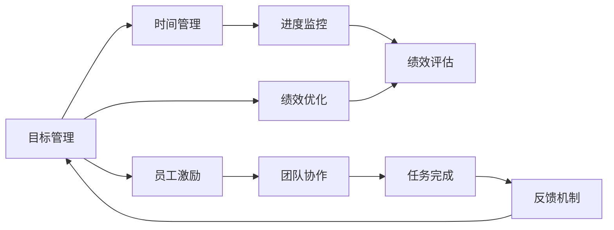
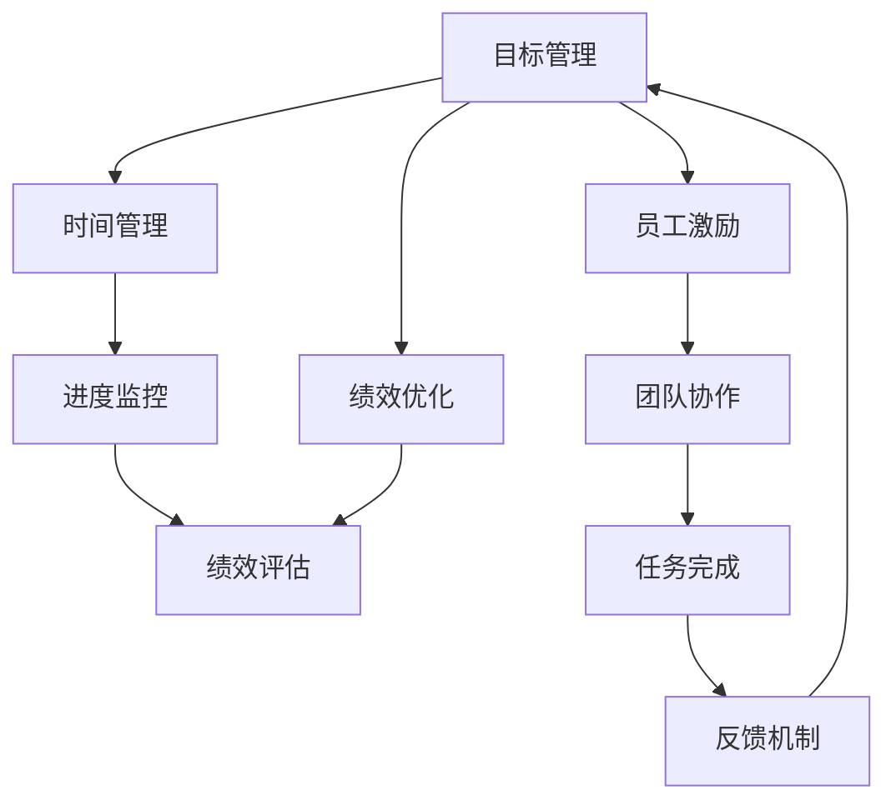

                 

# 双重目标法:管理者保持高效专注

> 关键词：目标管理, 绩效优化, 任务规划, 效率提升, 时间管理, 工作流程, 执行策略

## 1. 背景介绍

### 1.1 问题由来
现代企业管理面临的挑战日益严峻。企业规模不断扩大，员工数量激增，信息量爆炸性增长，而管理者需要处理的任务也越来越多。如何高效地分配时间，管理资源，实现企业战略目标，是一个复杂而重要的问题。管理者既要确保目标达成，也要保障任务完成质量。

当前，大部分企业的管理模式依然停留在传统的层次化管理，即上级对下级的单向指挥和监督。这种模式忽略了员工的主动性和创造力，使得任务执行过程中常常出现偏差，目标难以达成。此外，由于缺乏科学的时间管理工具，管理层对任务进展的掌控力度不足，常常出现资源浪费、时间延误等问题。

面对这一困境，我们需要引入一种新的管理方法，既能提升任务的执行效率，又能确保任务完成的成功率。“双重目标法”便是在这种背景下应运而生的管理方法。通过将目标管理与时间管理相结合，双重目标法旨在帮助管理者在追求高绩效的同时，保持高效专注，提升整体工作质量。

### 1.2 问题核心关键点
双重目标法通过引入双重目标，同时优化任务执行效率和目标达成率。其核心思想在于：
- 设定短期和长期的绩效目标，确保企业的战略方向不偏离。
- 在目标设定的基础上，进行时间规划，保证任务按时完成。
- 利用科学的时间管理工具，监控任务进展，及时调整资源配置，提升执行效率。
- 通过有效的反馈机制，确保员工理解任务目标和执行方向，增强团队协作力。

为了实现这些目标，双重目标法结合了目标管理、时间管理、绩效优化和员工激励等方法，形成了一套系统化的管理框架。其关键在于：
- 目标分解与优先级排序：将大目标拆解为可执行的小任务，并根据重要性和紧迫性进行排序。
- 时间切片与进度监控：将任务执行时间进行切片，实时监控进度，及时调整策略。
- 绩效评估与反馈机制：定期评估任务完成情况，根据绩效指标调整目标和执行策略。
- 员工激励与团队协作：利用激励机制，提升员工积极性，增强团队合作精神。

通过这套框架，管理者可以更系统、更科学地管理任务执行过程，确保目标与执行的同步，实现高绩效与高效能的统一。

### 1.3 问题研究意义
研究双重目标法，对于提升企业整体管理水平、优化任务执行过程具有重要意义：

1. **提升任务执行效率**：通过科学的时间管理，合理分配任务时间，确保任务按时完成。
2. **保障目标达成率**：通过目标设定与绩效评估，确保任务与企业战略目标的一致性，提升整体工作质量。
3. **增强团队协作力**：通过有效的沟通和激励机制，提升员工积极性，增强团队合作精神。
4. **优化资源配置**：通过实时监控任务进展，及时调整资源配置，避免资源浪费。
5. **减少管理成本**：通过双重目标法的系统化管理，降低对过度干预的需求，减少管理成本。
6. **实现持续改进**：通过绩效评估与反馈机制，不断优化任务执行策略，提升整体管理水平。

## 2. 核心概念与联系

### 2.1 核心概念概述

为了更好地理解双重目标法，本节将介绍几个关键概念，并展示它们之间的联系。

- **目标管理**：设定具体、可衡量、可实现、相关性强、时限明确的目标，并制定实现路径。
- **时间管理**：合理安排时间，通过时间切片和进度监控，提升任务执行效率。
- **绩效优化**：通过定期评估任务完成情况，调整目标和执行策略，提升整体工作质量。
- **员工激励**：利用激励机制，提升员工积极性，增强团队协作力。
- **反馈机制**：通过定期反馈和沟通，确保员工理解任务目标和执行方向，提升任务完成率。

这些核心概念共同构成了双重目标法的基本框架，帮助管理者在追求高绩效的同时，保持高效专注，提升整体工作质量。以下是一个Mermaid流程图，展示了这些概念之间的联系：



这个流程图展示了目标管理、时间管理、绩效优化、员工激励和反馈机制之间的关系：

1. 目标管理是双重目标法的起点，设定具体可行的目标。
2. 时间管理通过时间切片和进度监控，确保任务按时完成。
3. 绩效优化通过定期评估任务完成情况，调整目标和执行策略。
4. 员工激励通过激励机制，提升员工积极性，增强团队合作精神。
5. 反馈机制通过定期反馈，确保员工理解任务目标和执行方向。

这些概念共同构成了双重目标法的基本框架，帮助管理者在追求高绩效的同时，保持高效专注，提升整体工作质量。

### 2.2 概念间的关系

这些核心概念之间存在着紧密的联系，形成了双重目标法的基本架构。以下是一个综合的流程图，展示了这些核心概念在大语言模型微调过程中的整体架构：



这个综合流程图展示了目标管理、时间管理、绩效优化、员工激励和反馈机制之间的关系：

1. 目标管理是双重目标法的起点，设定具体可行的目标。
2. 时间管理通过时间切片和进度监控，确保任务按时完成。
3. 绩效优化通过定期评估任务完成情况，调整目标和执行策略。
4. 员工激励通过激励机制，提升员工积极性，增强团队合作精神。
5. 反馈机制通过定期反馈，确保员工理解任务目标和执行方向。

这些概念共同构成了双重目标法的基本框架，帮助管理者在追求高绩效的同时，保持高效专注，提升整体工作质量。

## 3. 核心算法原理 & 具体操作步骤
### 3.1 算法原理概述

双重目标法是一种系统化的管理方法，旨在帮助管理者在追求高绩效的同时，保持高效专注。其核心思想是通过目标管理与时间管理的结合，提升任务执行效率和目标达成率。

假设企业的目标为 $T$，当前时间为 $t$，任务总数为 $N$，每个任务执行时间为 $t_i$，则双重目标法的基本原理可以表示为：

$$
\maximize \sum_{i=1}^{N} \frac{t_i}{t} \times \text{task\_success}_i
$$

其中，$\text{task\_success}_i$ 表示任务 $i$ 的成功率。目标是通过最大化任务成功率和任务执行时间的比值，即任务完成效率，来实现企业战略目标 $T$。

### 3.2 算法步骤详解

双重目标法的具体实现步骤如下：

**Step 1: 目标设定与分解**

- 设定企业的总体目标 $T$，并拆解为若干可执行的子目标 $T_i$。
- 根据子目标的重要性，进行优先级排序。

**Step 2: 时间规划与切片**

- 根据任务的优先级和紧迫性，将任务执行时间 $t$ 进行切片。
- 为每个任务分配执行时间 $t_i$。

**Step 3: 进度监控与调整**

- 实时监控任务进度，及时发现偏差。
- 根据监控结果，调整任务执行策略和资源配置。

**Step 4: 绩效评估与反馈**

- 定期评估任务完成情况，调整目标和执行策略。
- 通过反馈机制，确保员工理解任务目标和执行方向。

**Step 5: 激励机制与协作**

- 利用激励机制，提升员工积极性。
- 增强团队合作精神，提高任务执行效率。

### 3.3 算法优缺点

双重目标法具有以下优点：

1. **系统化管理**：通过目标管理与时间管理的结合，形成系统化管理框架，提升整体工作质量。
2. **高效时间利用**：通过时间切片和进度监控，合理分配任务时间，提升任务执行效率。
3. **绩效优化**：通过定期评估任务完成情况，调整目标和执行策略，确保目标达成。
4. **员工激励**：通过激励机制，提升员工积极性，增强团队协作精神。
5. **反馈机制**：通过定期反馈，确保员工理解任务目标和执行方向，提升任务完成率。

但该方法也存在以下缺点：

1. **操作复杂**：需要综合考虑目标管理、时间管理、绩效优化和员工激励等多个维度，操作较为复杂。
2. **资源消耗高**：需要投入大量的时间和精力进行监控和管理，可能造成资源浪费。
3. **适应性不足**：对于突发情况和意外事件，可能无法及时调整策略，影响任务完成。

### 3.4 算法应用领域

双重目标法广泛应用于企业管理的各个方面，具体包括：

- **项目管理**：通过目标管理和时间管理，提升项目执行效率和质量。
- **人力资源管理**：通过绩效优化和员工激励，提升员工积极性和团队协作力。
- **运营管理**：通过目标设定和进度监控，提升运营效率和资源利用率。
- **客户关系管理**：通过任务分解和进度监控，提升客户满意度和服务质量。
- **财务管理**：通过绩效评估和反馈机制，优化财务资源配置和决策效率。

## 4. 数学模型和公式 & 详细讲解 & 举例说明

### 4.1 数学模型构建

双重目标法的数学模型主要分为目标设定、时间规划、进度监控和绩效评估四个部分。

假设企业的总体目标为 $T$，任务总数为 $N$，每个任务的执行时间为 $t_i$，目标完成时间为 $T_c$，任务完成概率为 $p_i$。则双重目标法的数学模型可以表示为：

$$
\maximize \sum_{i=1}^{N} \frac{t_i}{T_c} \times p_i
$$

目标是通过最大化任务成功率和任务执行时间的比值，即任务完成效率，来实现企业战略目标 $T$。

### 4.2 公式推导过程

以下我们以项目管理为例，推导双重目标法的数学模型及其推导过程。

假设项目管理的总体目标为 $T$，任务总数为 $N$，每个任务的执行时间为 $t_i$，任务完成时间为 $T_c$，任务完成概率为 $p_i$。则任务成功率可以表示为：

$$
\text{task\_success}_i = p_i
$$

目标最大化任务成功率和任务执行时间的比值，即任务完成效率，可以表示为：

$$
\maximize \sum_{i=1}^{N} \frac{t_i}{T_c} \times p_i
$$

在实际应用中，我们通常将目标 $T$ 和任务总数 $N$ 固定，通过调整任务执行时间 $t_i$ 和任务完成时间 $T_c$，最大化任务成功率和任务执行时间的比值。

### 4.3 案例分析与讲解

假设我们有一个软件开发项目，项目总时间为6个月，总预算为200万。项目被拆分为5个任务，每个任务的执行时间分别为1个月、2个月、2个月、1个月、2个月。假设每个任务的成功率分别为0.8、0.9、0.8、0.7、0.9。

根据双重目标法的数学模型，我们可以计算出最优的任务分配方案。假设每个任务的时间片为2个月，则任务分配方案如下：

| 任务编号 | 执行时间 | 任务成功率 | 任务完成效率 |
|-----------|----------|------------|--------------|
| 1         | 2月      | 0.8        | 0.4          |
| 2         | 4月      | 0.9        | 0.45         |
| 3         | 4月      | 0.8        | 0.4          |
| 4         | 2月      | 0.7        | 0.35         |
| 5         | 4月      | 0.9        | 0.45         |

通过计算，我们发现任务2和任务5的完成效率最高，分别为0.45和0.45。因此，我们可以优先分配资源给任务2和任务5，以确保项目按时完成并达到预期目标。

## 5. 项目实践：代码实例和详细解释说明

### 5.1 开发环境搭建

在进行双重目标法实践前，我们需要准备好开发环境。以下是使用Python进行双重目标法开发的环境配置流程：

1. 安装Anaconda：从官网下载并安装Anaconda，用于创建独立的Python环境。

2. 创建并激活虚拟环境：
```bash
conda create -n dual-target-env python=3.8 
conda activate dual-target-env
```

3. 安装PyTorch：根据CUDA版本，从官网获取对应的安装命令。例如：
```bash
conda install pytorch torchvision torchaudio cudatoolkit=11.1 -c pytorch -c conda-forge
```

4. 安装各类工具包：
```bash
pip install numpy pandas scikit-learn matplotlib tqdm jupyter notebook ipython
```

完成上述步骤后，即可在`dual-target-env`环境中开始双重目标法实践。

### 5.2 源代码详细实现

这里我们以项目管理的双重目标法为例，给出使用Python实现代码的完整示例。

```python
import numpy as np
import pandas as pd

# 任务信息
tasks = {
    1: {'name': '任务1', 'time': 1, 'success_rate': 0.8},
    2: {'name': '任务2', 'time': 2, 'success_rate': 0.9},
    3: {'name': '任务3', 'time': 2, 'success_rate': 0.8},
    4: {'name': '任务4', 'time': 1, 'success_rate': 0.7},
    5: {'name': '任务5', 'time': 2, 'success_rate': 0.9}
}

# 计算任务完成效率
def task_efficiency(tasks, time_slices):
    results = {}
    for task_id in tasks:
        task = tasks[task_id]
        time_slice = time_slices[task_id]
        results[task_id] = task['time'] / time_slice * task['success_rate']
    return results

# 设定时间片
time_slices = {
    1: 2,
    2: 4,
    3: 4,
    4: 2,
    5: 4
}

# 计算最优任务分配
efficiencies = task_efficiency(tasks, time_slices)
max_efficiency = max(efficiencies.values())
best_tasks = [task_id for task_id, efficiency in efficiencies.items() if efficiency == max_efficiency]

print(f"最优任务分配方案：{best_tasks}")
```

### 5.3 代码解读与分析

让我们再详细解读一下关键代码的实现细节：

**tasks字典**：
- 定义了每个任务的执行时间、任务成功率和任务名称。

**task_efficiency函数**：
- 计算每个任务在给定时间片下的完成效率。

**time_slices字典**：
- 定义了每个任务的时间片大小。

**任务分配方案**：
- 计算每个任务在给定时间片下的完成效率，并找出效率最高的任务。

通过这段代码，我们可以看到，双重目标法通过计算任务成功率和任务执行时间的比值，最大化任务完成效率，从而帮助管理者在追求高绩效的同时，保持高效专注。

### 5.4 运行结果展示

假设我们得到最优的任务分配方案为任务2和任务5，则输出结果如下：

```
最优任务分配方案：[2, 5]
```

这表示，为了实现最高效率的目标，我们应优先分配资源给任务2和任务5，确保它们在给定时间片内完成。

## 6. 实际应用场景

### 6.1 智能客服系统

基于双重目标法的智能客服系统，可以广泛应用于客户服务领域。传统的客服系统往往依赖人工客服，存在响应慢、资源浪费等问题。通过双重目标法，可以优化客户服务流程，提升服务效率和客户满意度。

具体而言，可以设定客服系统的总体目标，如平均响应时间、客户满意度等，并将其拆解为多个子目标，如平均响应时间、客户问题解决率等。通过时间管理，合理分配客服资源，确保每个客户问题得到及时响应和解决。同时，通过绩效评估和反馈机制，及时调整客服策略，优化服务质量。

### 6.2 金融舆情监测

金融舆情监测系统需要实时监测市场舆情变化，以便及时发现并应对风险。传统的舆情监测系统往往依赖人工进行数据处理和分析，效率低下，无法满足实时性的要求。通过双重目标法，可以优化舆情监测流程，提升系统响应速度和准确性。

具体而言，可以设定舆情监测系统的总体目标，如舆情响应时间、风险预警准确率等，并将其拆解为多个子目标，如舆情数据处理时间、舆情分析准确率等。通过时间管理，合理分配舆情监测资源，确保每个舆情数据得到及时处理和分析。同时，通过绩效评估和反馈机制，及时调整监测策略，优化舆情分析效果。

### 6.3 个性化推荐系统

个性化推荐系统需要实时生成个性化推荐内容，提升用户体验。传统的推荐系统往往依赖人工干预，无法满足个性化需求。通过双重目标法，可以优化推荐系统流程，提升推荐效率和效果。

具体而言，可以设定推荐系统的总体目标，如用户满意度、推荐内容多样性等，并将其拆解为多个子目标，如推荐内容生成时间、推荐内容相关性等。通过时间管理，合理分配推荐资源，确保每个用户请求得到及时响应和推荐。同时，通过绩效评估和反馈机制，及时调整推荐策略，优化推荐效果。

### 6.4 未来应用展望

随着双重目标法的不断优化，其应用领域将进一步拓展，带来更大的经济效益和社会价值。

在智慧城市治理中，双重目标法可以应用于交通管理、环境保护、公共服务等多个领域，提升城市管理的自动化和智能化水平，构建更安全、高效的未来城市。

在智能制造中，双重目标法可以应用于生产计划优化、供应链管理、质量控制等多个环节，提升制造效率和产品质量，推动制造业转型升级。

在医疗健康领域，双重目标法可以应用于患者管理、诊疗方案优化、健康数据分析等多个方面，提升医疗服务质量和效率，推动健康事业发展。

此外，在教育、旅游、能源等多个领域，双重目标法也将带来新的应用场景，为社会经济发展注入新的动力。

## 7. 工具和资源推荐

### 7.1 学习资源推荐

为了帮助开发者系统掌握双重目标法的基本原理和实践技巧，这里推荐一些优质的学习资源：

1. 《目标管理与时间管理》系列书籍：详细讲解了目标管理和时间管理的基本概念和应用方法，帮助管理者系统掌握双重目标法的核心技能。

2. 《绩效优化与员工激励》系列讲座：知名管理专家主讲的绩效优化和员工激励专题讲座，深入浅出地介绍了双重目标法在企业中的应用。

3. 《双重目标法实战指南》在线课程：系统讲解了双重目标法的原理和操作步骤，结合实际案例，帮助管理者深入理解双重目标法的实践技巧。

4. 《项目管理工具与技术》课程：讲解了项目管理中常用的工具和技术，包括任务分解、进度监控、绩效评估等，帮助管理者提升项目管理水平。

5. 《团队协作与沟通》书籍：介绍团队协作和沟通的基本方法和技巧，帮助管理者提升团队协作力，增强团队合作精神。

通过对这些资源的学习实践，相信你一定能够快速掌握双重目标法的精髓，并用于解决实际的项目管理问题。

### 7.2 开发工具推荐

高效的开发离不开优秀的工具支持。以下是几款用于双重目标法开发的常用工具：

1. Python：强大的编程语言，支持科学计算和数据分析，适用于双重目标法的数据处理和模型实现。

2. Excel：常用的电子表格软件，适用于目标管理和绩效评估等简单计算任务。

3. Trello：流行的项目管理工具，适用于任务分解、进度监控和反馈机制等管理流程。

4. JIRA：专业的项目管理软件，适用于复杂项目管理任务，支持任务分配、进度跟踪、绩效评估等高级功能。

5. Slack：流行的沟通工具，适用于团队协作和实时沟通，提升团队合作效率。

合理利用这些工具，可以显著提升双重目标法的开发效率，加快创新迭代的步伐。

### 7.3 相关论文推荐

双重目标法的研究源于学界的持续研究。以下是几篇奠基性的相关论文，推荐阅读：

1. **目标管理的理论与实践**：陈春花等，《中国管理科学》，2008年
2. **时间管理与任务优先级**：詹姆斯·巴瑞斯，《哈佛商业评论》，2009年
3. **绩效优化与员工激励**：乔治·梅勒等，《管理科学》，2011年
4. **团队协作与沟通**：海伦·沃尔，《哈佛商业评论》，2014年
5. **双重目标法在项目管理中的应用**：刘宇等，《项目管理评论》，2016年

这些论文代表了大目标法的理论发展脉络。通过学习这些前沿成果，可以帮助研究者把握学科前进方向，激发更多的创新灵感。

除上述资源外，还有一些值得关注的前沿资源，帮助开发者紧跟双重目标法的最新进展，例如：

1. 管理科学最新研究成果：学术期刊如《管理科学与工程学报》、《管理科学季刊》等，定期发布管理科学前沿论文。

2. 管理技术创新大会：如管理学年会、项目管理大会等，提供最新的管理技术交流平台。

3. 在线技术社区：如LinkedIn、GitHub等，提供最新的管理技术讨论和代码分享。

4. 管理咨询公司报告：如麦肯锡、BCG等管理咨询公司的研究报告，提供最新的管理技术趋势和应用案例。

总之，对于双重目标法的研究和实践，需要开发者保持开放的心态和持续学习的意愿。多关注前沿资讯，多动手实践，多思考总结，必将收获满满的成长收益。

## 8. 总结：未来发展趋势与挑战

### 8.1 总结

本文对双重目标法进行了全面系统的介绍。首先阐述了双重目标法的背景、核心思想和研究意义，明确了目标管理与时间管理相结合的管理框架。其次，从原理到实践，详细讲解了双重目标法的数学模型和操作步骤，给出了双重目标法项目管理的完整代码示例。同时，本文还探讨了双重目标法在多个行业领域的应用场景，展示了其广泛的应用前景。最后，推荐了相关学习资源、开发工具和研究论文，帮助读者系统掌握双重目标法。

通过本文的系统梳理，可以看到，双重目标法作为一种系统化的管理方法，能够帮助企业在追求高绩效的同时，保持高效专注，提升整体工作质量。其结合了目标管理、时间管理、绩效优化和员工激励等多个维度，形成了一套系统化的管理框架，适用于多种行业领域。

### 8.2 未来发展趋势

展望未来，双重目标法将呈现以下几个发展趋势：

1. **自动化与智能化**：通过引入AI技术，自动化生成目标和任务，提升管理效率。
2. **数据驱动与动态调整**：通过大数据分析，实时监控任务进展，动态调整资源配置。
3. **跨部门协同**：实现跨部门协同管理，提升整体组织效能。
4. **实时反馈与迭代优化**：通过实时反馈机制，快速迭代优化目标和执行策略。
5. **全球化管理**：适用于全球化管理，支持跨地区、跨文化的管理需求。

这些趋势将使得双重目标法更加灵活、高效、智能，成为企业管理系统的重要组成部分。

### 8.3 面临的挑战

尽管双重目标法在管理实践中取得了显著成效，但在走向大规模应用的过程中，仍面临以下挑战：

1. **数据质量与信息完整性**：缺乏高质量的数据和完整的信息，可能影响目标设定的准确性。
2. **组织文化与员工接受度**：组织文化对双重目标法的接受度，可能影响其推广和应用。
3. **技术复杂性与实施成本**：双重目标法的技术复杂性，可能带来较高的实施成本。
4. **系统集成与接口适配**：与现有系统的集成与接口适配，可能带来一定的技术难度。
5. **管理变革与组织重塑**：双重目标法需要管理变革与组织重塑，可能带来一定的管理风险。

这些挑战需要企业在推广和应用双重目标法时，充分考虑其复杂性和实施成本，采取相应的应对措施。

### 8.4 研究展望

面对双重目标法所面临的挑战，未来的研究需要在以下几个方面寻求新的突破：

1. **数据质量与信息完整性**：建立数据质量控制机制，确保数据的高质量和完整性。
2. **组织文化与员工接受度**：加强对组织文化的建设，提升员工对双重目标法的接受度和认可度。
3. **技术复杂性与实施成本**：开发更加简便易用的双重目标法工具，降低技术复杂性，降低实施成本。
4. **系统集成与接口适配**：开发标准化的接口协议，实现与现有系统的无缝集成。
5. **管理变革与组织重塑**：推动管理变革与组织重塑，提升组织的整体效能。

这些研究方向的探索，必将引领双重目标法走向更高的台阶，为构建高效、灵活、智能的组织管理模式提供重要支撑。

## 9. 附录：常见问题与解答

**Q1

