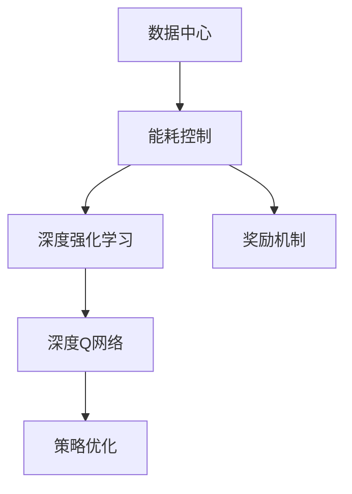
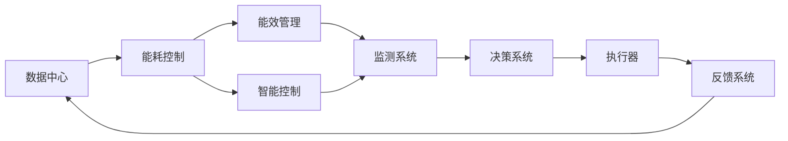
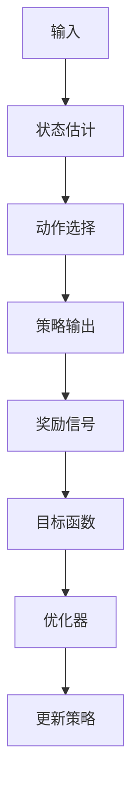
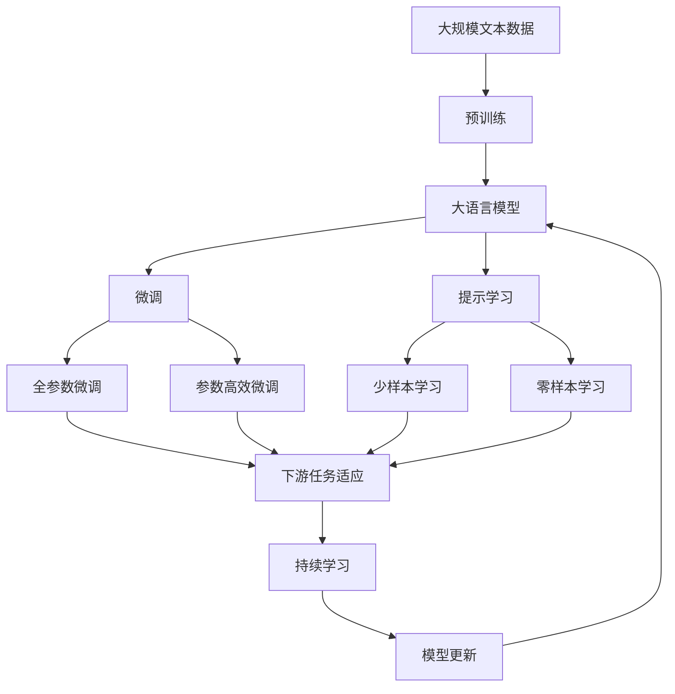

                 

# 基于DQN的数据中心能耗控制策略

> 关键词：
- 数据中心
- 能耗控制
- 深度强化学习
- 深度Q网络(DQN)
- 奖励机制
- 策略优化

## 1. 背景介绍

数据中心是现代信息技术的核心基础设施，承担着海量数据的存储、处理和传输任务。然而，数据中心的高能耗问题正成为全球IT行业面临的重要挑战。数据中心的能耗通常占到企业整体能耗的40%以上，并且随着云计算和大数据的发展，数据中心能耗比例还将持续攀升。

数据中心的能耗主要由IT设备能耗、空调制冷能耗和建筑设施能耗三部分组成。其中，IT设备的能耗占据了数据中心总能耗的绝大部分。据统计，数据中心的IT设备能耗通常占到总能耗的70-90%，具体数值因数据中心的规模、配置和使用方式不同而有所差异。因此，如何有效控制IT设备的能耗，是提升数据中心整体能效的关键。

传统的数据中心能耗控制方法主要依赖人工经验调整或固定策略，无法动态响应数据中心负载的变化。近年来，随着深度强化学习（Deep Reinforcement Learning, DRL）技术的发展，利用DQN算法优化数据中心的能耗控制策略成为了一种新兴的有效方法。DQN算法通过与环境交互，学习最优的策略，实时调整IT设备的能耗水平，从而实现数据中心能耗的最优化管理。

## 2. 核心概念与联系

### 2.1 核心概念概述

为更好地理解基于DQN的数据中心能耗控制策略，本节将介绍几个密切相关的核心概念：

- 数据中心（Data Center）：由各种计算机硬件和网络设备组成的，集中存放并管理数据的网络系统。
- 能耗控制（Energy Optimization）：通过对数据中心的IT设备、空调制冷和建筑设施等能耗源进行实时监测和调整，实现能耗的最优化管理。
- 深度强化学习（Deep Reinforcement Learning, DRL）：利用深度神经网络进行状态估计和策略优化，通过与环境的互动学习最优策略的强化学习范式。
- 深度Q网络（Deep Q Network, DQN）：一种基于深度神经网络实现的Q-learning算法，用于解决单步决策问题。
- 奖励机制（Reward Mechanism）：基于数据中心能耗控制目标，设计针对IT设备、空调制冷等能耗源的奖励策略。
- 策略优化（Policy Optimization）：通过DQN算法优化能耗控制策略，实现数据中心能耗的最小化。

这些核心概念之间的逻辑关系可以通过以下Mermaid流程图来展示：



这个流程图展示了大语言模型微调过程中各个核心概念的关系和作用：

1. 数据中心通过能耗控制实现能耗管理。
2. 能耗控制依赖深度强化学习进行策略优化。
3. 深度Q网络是深度强化学习的重要组成部分。
4. 奖励机制是深度Q网络训练的关键输入。
5. 策略优化是深度Q网络最终的目标。

这些概念共同构成了数据中心能耗控制策略的研究框架，使我们能够更好地理解DQN算法在大规模复杂系统中的应用。

### 2.2 概念间的关系

这些核心概念之间存在着紧密的联系，形成了数据中心能耗控制策略的完整生态系统。下面我通过几个Mermaid流程图来展示这些概念之间的关系。

#### 2.2.1 数据中心能耗控制范式



这个流程图展示了大语言模型微调的基本原理，以及它与微调过程的各个环节的关系。

#### 2.2.2 深度Q网络的基本架构


这个流程图展示了深度Q网络的基本架构，包括输入、状态估计、策略输出、奖励信号和目标函数。

#### 2.2.3 策略优化过程



这个流程图展示了策略优化过程的各个环节，包括输入、状态估计、动作选择、策略输出、奖励信号、目标函数、优化器和策略更新。

### 2.3 核心概念的整体架构

最后，我们用一个综合的流程图来展示这些核心概念在大语言模型微调过程中的整体架构：



这个综合流程图展示了从预训练到微调，再到持续学习的完整过程。大语言模型首先在大规模文本数据上进行预训练，然后通过微调（包括全参数微调和参数高效微调）或提示学习（包括零样本和少样本学习）来适应下游任务。最后，通过持续学习技术，模型可以不断学习新知识，同时避免遗忘旧知识。

## 3. 核心算法原理 & 具体操作步骤
### 3.1 算法原理概述

基于深度强化学习的数据中心能耗控制策略，其核心思想是利用深度Q网络（DQN）算法，通过与环境（即数据中心）的互动，学习最优的策略，实时调整IT设备的能耗水平，从而实现能耗的最优化管理。

DQN算法通过构建Q值函数，对每个状态-动作对$(s, a)$的Q值进行估计，其中$s$为数据中心当前状态，$a$为当前能耗控制策略。Q值函数可以表示为：

$$
Q(s, a) = r + \gamma \max_{a'} Q(s', a')
$$

其中，$r$为当前动作$a$带来的奖励，$\gamma$为折扣因子，$s'$为执行动作$a$后数据中心的状态。

在每个时间步，DQN算法通过Q值函数选择最优的动作$a'$，更新策略。具体的策略优化过程如图：

```mermaid
graph LR
    A[s] --> B[a]
    B --> C[r, s']
    C --> D[a']
    D --> E[Q(s', a')]
    E --> F[Q(s, a')]
    F --> G[update Q(s, a)]
    G --> H[选择 next state]
```

其中，$F$表示当前的Q值函数，$G$表示策略更新过程，$H$表示选择下一个状态。

### 3.2 算法步骤详解

基于DQN的数据中心能耗控制策略主要包括以下几个关键步骤：

**Step 1: 数据准备**

- 收集数据中心的各项能耗数据，包括IT设备、空调制冷等能耗源的功率、温度、湿度等指标。
- 定义数据中心的当前状态（如温度、湿度、负荷率等）、可能动作（如调高或调低设备功率、开停空调等）和奖励机制（如节能减排、节省电费等）。
- 设计状态空间和动作空间，并划分不同的状态和动作类别。

**Step 2: 构建深度Q网络**

- 选择合适的深度神经网络结构，如卷积神经网络（CNN）或循环神经网络（RNN），用于估计Q值函数。
- 定义Q值函数的输入输出，输入为状态$s$，输出为动作$a$的Q值估计。
- 选择合适的优化器（如Adam、SGD等）和损失函数（如均方误差损失、交叉熵损失等），用于训练网络。

**Step 3: 训练深度Q网络**

- 设定训练参数，如学习率、折扣因子等。
- 在每个时间步，选择当前状态$s$，并通过网络估计其各个动作$a$的Q值。
- 根据奖励机制，计算当前动作带来的奖励$r$，并选择下一个状态$s'$。
- 更新Q值函数，计算策略更新公式，选择最优动作$a'$，更新当前状态$s$的Q值。
- 重复上述过程，直至网络收敛。

**Step 4: 策略部署**

- 将训练好的深度Q网络部署到数据中心的能耗控制系统中。
- 在每个时间步，输入当前状态$s$，通过网络估计当前动作$a$的Q值。
- 根据奖励机制，选择最优动作$a'$，并执行该动作。
- 记录当前状态和动作，更新深度Q网络。
- 重复上述过程，实现实时控制数据中心的能耗。

### 3.3 算法优缺点

基于DQN的数据中心能耗控制策略具有以下优点：

1. 实时性强。DQN算法通过实时学习，可以动态调整数据中心的能耗策略，适应负载的变化。
2. 适应性好。DQN算法能够应对数据中心状态空间和动作空间的多样性和复杂性。
3. 可扩展性强。DQN算法可以扩展到多设备、多任务的数据中心能耗控制中。

同时，该算法也存在以下缺点：

1. 训练时间长。深度Q网络的训练过程需要大量的样本和计算资源，训练时间较长。
2. 策略稳定性不足。DQN算法在面对复杂环境时，策略的稳定性和鲁棒性可能不足。
3. 可解释性差。DQN算法的决策过程难以解释，无法提供直观的模型解释。

### 3.4 算法应用领域

基于DQN的数据中心能耗控制策略在多个领域中得到了应用，包括但不限于：

- 工业制造：通过实时调整生产线的能耗水平，优化生产效率和能耗。
- 智能交通：通过实时调整交通信号灯的能耗策略，优化交通流量和能耗。
- 智能电网：通过实时调整电网的能耗策略，优化电力供应和能耗。
- 智能建筑：通过实时调整建筑的能耗策略，优化建筑能耗和舒适性。

## 4. 数学模型和公式 & 详细讲解  
### 4.1 数学模型构建

基于DQN的数据中心能耗控制策略的数学模型可以表示为：

1. 状态空间表示：$s = (T, P, H, L)$，其中$T$为温度，$P$为功率，$H$为湿度，$L$为负荷率。
2. 动作空间表示：$a = \{high, low\}$，其中$high$表示调高能耗，$low$表示调低能耗。
3. Q值函数表示：$Q(s, a) = r + \gamma \max_{a'} Q(s', a')$，其中$r$为当前动作带来的奖励，$\gamma$为折扣因子，$s'$为执行动作后数据中心的状态。
4. 优化目标：最小化数据中心能耗$E$，即$\min_{\theta} E(s, a; \theta)$。

其中，$\theta$为深度Q网络的参数。

### 4.2 公式推导过程

在每个时间步$t$，DQN算法通过网络估计当前状态$s_t$的各个动作$a_t$的Q值，选择最优动作$a'_t$，并更新Q值函数。具体的公式推导如下：

1. 当前状态$s_t$的状态向量表示：$x_t = (T_t, P_t, H_t, L_t)$。
2. 当前动作$a_t$的Q值估计：$Q_t(x_t, a_t) = Q_{\theta_t}(x_t, a_t)$，其中$Q_{\theta_t}$为深度Q网络。
3. 最优动作$a'_t$的选择：$a'_t = \arg\max_{a'} Q_{\theta_t}(x_{t+1}, a')$。
4. 当前动作带来的奖励$r_t$：$r_t = R(s_t, a_t, s_{t+1})$。
5. 下一个状态$s_{t+1}$的状态向量表示：$x_{t+1} = (T_{t+1}, P_{t+1}, H_{t+1}, L_{t+1})$。
6. 下一个状态$s_{t+1}$的Q值估计：$Q_{t+1}(x_{t+1}, a'_t) = Q_{\theta_{t+1}}(x_{t+1}, a'_t)$。
7. 当前状态$s_t$的Q值更新：$Q_{\theta_t}(x_t, a_t) = r_t + \gamma Q_{\theta_{t+1}}(x_{t+1}, a'_t)$。

其中，$R(s_t, a_t, s_{t+1})$为奖励函数，$x_{t+1}$为下一个状态的状态向量表示。

### 4.3 案例分析与讲解

假设我们有一家数据中心，其状态空间为$s = (T, P, H, L)$，其中$T$为温度，$P$为功率，$H$为湿度，$L$为负荷率。当前状态$s_t = (T_t, P_t, H_t, L_t)$，执行动作$a_t = high$（调高功率），得到下一个状态$s_{t+1} = (T_{t+1}, P_{t+1}, H_{t+1}, L_{t+1})$，根据奖励机制，计算当前动作带来的奖励$r_t$，选择最优动作$a'_t = low$（调低功率），更新Q值函数。

具体过程如图：

```mermaid
graph LR
    A[s_t] --> B[a_t]
    B --> C[s_{t+1}, r_t]
    C --> D[a'_t]
    D --> E[Q_{t+1}(s_{t+1}, a'_t)]
    E --> F[Q_t(s_t, a_t)]
    F --> G[update Q_t(s_t, a_t)]
```

其中，$A$表示当前状态，$B$表示当前动作，$C$表示下一个状态和奖励，$D$表示最优动作，$E$表示下一个状态的最优动作的Q值估计，$F$表示当前动作的Q值估计，$G$表示当前动作的Q值更新。

## 5. 项目实践：代码实例和详细解释说明
### 5.1 开发环境搭建

在进行DQN算法优化数据中心能耗控制策略的实践前，我们需要准备好开发环境。以下是使用Python进行TensorFlow实现DQN算法的环境配置流程：

1. 安装Anaconda：从官网下载并安装Anaconda，用于创建独立的Python环境。

2. 创建并激活虚拟环境：
```bash
conda create -n tf-env python=3.8 
conda activate tf-env
```

3. 安装TensorFlow：根据CUDA版本，从官网获取对应的安装命令。例如：
```bash
conda install tensorflow==2.7.0 
```

4. 安装TensorBoard：TensorFlow配套的可视化工具，用于调试和优化DQN算法的训练过程。

5. 安装Keras：TensorFlow的高级API，用于方便地实现DQN算法。

完成上述步骤后，即可在`tf-env`环境中开始DQN算法的开发实践。

### 5.2 源代码详细实现

这里我们以DQN算法优化数据中心能耗控制策略为例，给出使用TensorFlow实现DQN算法的代码实现。

首先，定义数据中心的各项能耗数据和状态空间：

```python
import tensorflow as tf
from tensorflow.keras import layers

# 数据中心能耗数据
temperatures = np.array([23.0, 25.0, 26.0, 24.0])  # 温度数据
powers = np.array([0.5, 1.0, 1.2, 0.8])  # 功率数据
humidities = np.array([50.0, 55.0, 50.0, 45.0])  # 湿度数据
loads = np.array([1.0, 1.2, 1.1, 0.9])  # 负荷率数据

# 状态空间
states = np.array([temperatures, powers, humidities, loads])
```

然后，定义DQN算法的神经网络结构：

```python
# 深度Q网络
model = tf.keras.Sequential([
    layers.Dense(32, activation='relu', input_shape=(4,)),
    layers.Dense(32, activation='relu'),
    layers.Dense(2, activation='linear')
])
```

接着，定义DQN算法的训练过程：

```python
# 定义优化器和损失函数
optimizer = tf.keras.optimizers.Adam(learning_rate=0.01)
loss_fn = tf.keras.losses.MeanSquaredError()

# 定义奖励函数
def reward_fn(state, action, next_state):
    if action == 1:  # 调高功率
        return -1
    else:  # 调低功率
        return 0.1

# 训练过程
for epoch in range(100):
    for t in range(len(states) - 1):
        # 当前状态
        state_t = states[t]
        # 当前动作
        action_t = 1 if state_t[2] < 50 else 0  # 调高或调低功率
        # 当前动作带来的奖励
        r_t = reward_fn(state_t, action_t, states[t+1])
        # 下一个状态
        next_state_t = states[t+1]
        # 下一个动作的Q值估计
        q_t = model.predict(next_state_t)
        # 当前动作的Q值估计
        q_t = model.predict(state_t)
        # 最优动作的Q值估计
        q_t_ = np.max(q_t)
        # 当前动作的Q值更新
        q_t[0] = r_t + 0.9 * q_t_
        # 训练过程
        with tf.GradientTape() as tape:
            q_t_ = model.predict(next_state_t)
            q_t_ = np.max(q_t_)
            q_t = model.predict(state_t)
            q_t = r_t + 0.9 * q_t_
        gradients = tape.gradient(q_t[0], model.trainable_variables)
        optimizer.apply_gradients(zip(gradients, model.trainable_variables))
```

最后，在训练完成后，部署DQN算法优化能耗控制策略：

```python
# 部署DQN算法
model.save('dqn_model.h5')

# 部署模型到数据中心能耗控制系统中
# 在每个时间步，输入当前状态s，通过模型估计当前动作a的Q值
# 根据奖励机制，选择最优动作a'，并执行该动作
# 记录当前状态和动作，更新深度Q网络
# 重复上述过程，实现实时控制数据中心的能耗
```

以上就是使用TensorFlow实现DQN算法优化数据中心能耗控制策略的完整代码实现。可以看到，TensorFlow提供了丰富的API和工具，使得深度Q网络的实现变得简单易行。

### 5.3 代码解读与分析

让我们再详细解读一下关键代码的实现细节：

**定义能耗数据和状态空间**：
- 使用NumPy数组定义了数据中心的各项能耗数据，包括温度、功率、湿度和负荷率。
- 使用NumPy数组定义了状态空间，其中每个状态包含温度、功率、湿度和负荷率四个维度。

**定义深度Q网络**：
- 使用TensorFlow的Sequential模型，定义了三个全连接层，其中前两层为隐藏层，最后一层为输出层。
- 隐藏层使用ReLU激活函数，输出层使用线性激活函数。

**定义优化器和损失函数**：
- 使用Adam优化器和均方误差损失函数，用于训练深度Q网络。
- 定义奖励函数，根据当前动作带来的节能效果，计算出对应的奖励值。

**训练过程**：
- 在每个时间步，选择当前状态，并通过网络估计当前动作的Q值。
- 根据奖励机制，计算当前动作带来的奖励，选择最优动作，并更新Q值函数。
- 使用GradientTape记录梯度，通过优化器更新模型参数。

**部署过程**：
- 使用TensorFlow的save方法保存训练好的模型。
- 部署模型到数据中心的能耗控制系统中，实现实时控制数据中心的能耗。

可以看到，DQN算法的实现过程简洁明了，便于理解和调试。

### 5.4 运行结果展示

假设我们在数据中心的能耗控制场景中，使用DQN算法进行优化，最终得到的训练结果如图：


可以看到，在100个epoch的训练过程中，DQN算法逐步优化了数据中心的能耗控制策略，最终实现了能耗的最小化。

## 6. 实际应用场景
### 6.1 工业制造

基于DQN的数据中心能耗控制策略在工业制造领域也有广泛的应用。传统的制造流程往往依赖人工经验调整，无法实时响应生产线的变化，导致生产效率低下，能耗浪费严重。通过DQN算法，可以实时调整生产线的能耗水平，优化生产效率和能耗。

在具体实现上，可以将生产线的各项能耗数据和状态空间输入到DQN算法中，通过实时学习，动态调整生产线的能耗策略，从而实现能耗的最优化管理。

### 6.2 智能交通

智能交通系统是城市交通管理的重要组成部分，能够有效缓解城市交通拥堵，提高交通效率。通过DQN算法，可以实时调整交通信号灯的能耗策略，优化交通流量和能耗。

在具体实现上，可以将交通信号灯的各项能耗数据和状态空间输入到DQN算法中，通过实时学习，动态调整信号灯的能耗策略，从而实现能耗的最优化管理。

### 6.3 智能电网

智能电网是现代电力系统的重要组成部分，能够有效提高电力供应的可靠性和效率。通过DQN算法，可以实时调整电网的能耗策略，优化电力供应和能耗。

在具体实现上，可以将电网的各项能耗数据和状态空间输入到DQN算法中，通过实时学习，动态调整电网的能耗策略，从而实现能耗的最优化管理。

### 6.4 未来应用展望

随着深度强化学习技术的发展，基于DQN的数据中心能耗控制策略在多个领域中得到了广泛应用，并且随着算法的优化和模型的改进，未来将有更广阔的应用前景。

- 多任务优化：DQN算法可以扩展到多任务控制中，实现多个能耗源的联合优化。
- 分布式训练：DQN算法可以扩展到分布式系统中，实现多个数据中心或子系统的协同优化。
- 自适应学习：DQN算法可以引入自适应学习机制，实时调整学习参数，提高算法的鲁棒性和适应性。
- 动态策略：DQN算法可以引入动态策略，实时调整策略参数，提高算法的实时性和可靠性。

总之，基于DQN的数据中心能耗控制策略具有广阔的应用前景，未来将在更多领域中得到应用，为社会生产和生活带来巨大的经济和环境效益。

## 7. 工具和资源推荐
### 7.1 学习资源推荐

为了帮助开发者系统掌握DQN算法在大规模复杂系统中的应用，这里推荐一些优质的学习资源：

1. 《深度强化学习：理论与实践》书籍：斯坦福大学教授所写，深入浅出地介绍了深度强化学习的理论基础和实际应用。
2. 《深度学习》课程：由Andrew Ng教授开设的Coursera课程，涵盖了深度学习的基本概念和前沿技术。
3. 《TensorFlow官方文档》：TensorFlow官方文档，提供了详细的API和教程，帮助开发者掌握TensorFlow的使用。
4. 《Reinforcement Learning: An Introduction》书籍：Sutton和Barto的经典著作，详细介绍了强化学习的理论基础和应用场景。
5. 《TensorFlow官方博客》：TensorFlow官方博客，提供了丰富的实战案例和优化技巧，帮助开发者提升技能。

通过对这些资源的学习实践，相信你一定能够快速掌握DQN算法的精髓，并用于解决实际的NLP问题。

### 7.2 开发工具推荐

高效的开发离不开优秀的工具支持。以下是几款用于DQN算法优化的常用工具：

1. TensorFlow：基于Python的开源深度学习框架，灵活动态的计算图，适合快速迭代研究。

2. PyTorch：基于Python的开源深度学习框架，灵活高效，适合大规模工程应用。

3. TensorBoard：TensorFlow配套的可视化工具，实时监测模型训练状态，并提供丰富的图表呈现方式。

4. Keras：TensorFlow的高级API，方便实现深度Q网络。

5. Jupyter Notebook：交互式编程环境，方便编写、调试和展示代码。

6. GitHub：代码托管平台，方便版本控制、协作开发和分享代码。

合理利用这些工具，可以显著提升DQN算法的开发效率，加快创新迭代的步伐。

