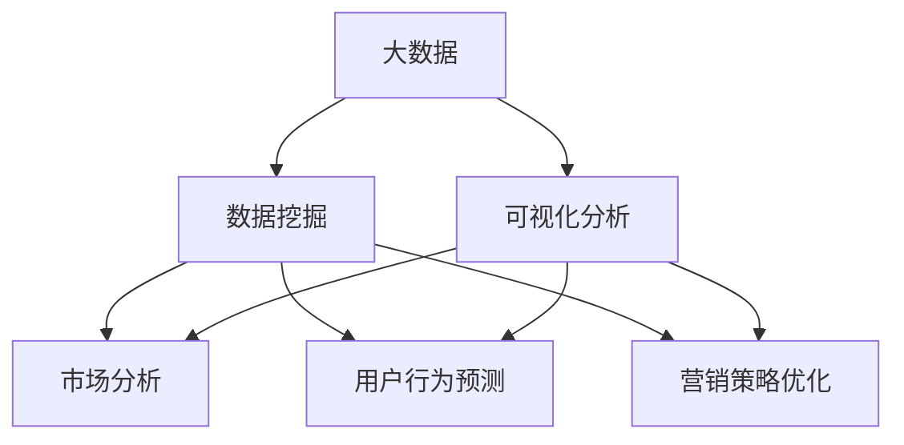
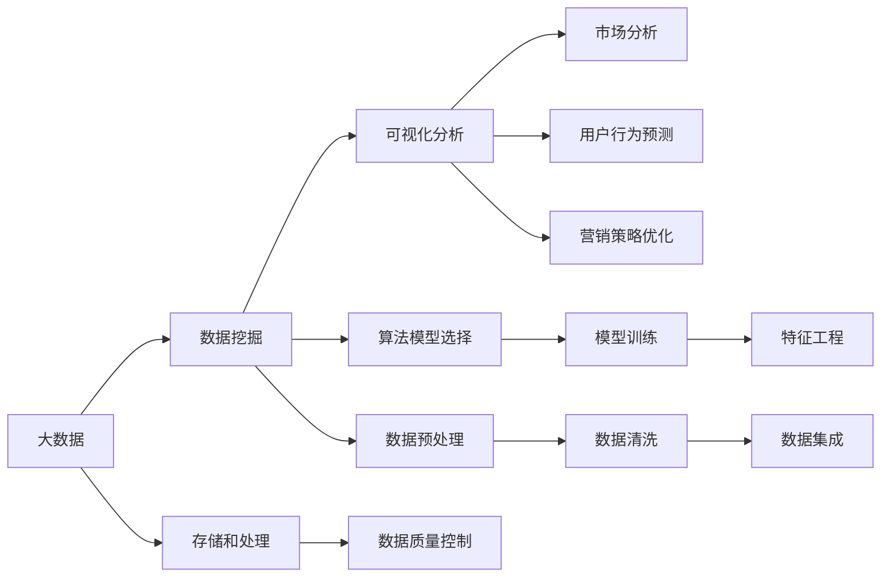

                 

## 1. 背景介绍

### 1.1 问题由来
随着汽车行业的快速发展，汽车营销成为各大厂商的重要战略环节。传统的汽车营销主要依赖人工调研和数据分析，但这些方法的效率和准确性无法满足现代汽车营销的复杂需求。大数据技术和人工智能的兴起，为汽车营销提供了全新的解决方案，极大地提升了营销活动的精准性和效果。

汽车营销是一个多维度、多层次的复杂过程，涉及到市场调研、产品定位、用户行为分析、营销效果评估等多个环节。传统的营销调研方法，如问卷调查、焦点小组等，不仅耗时耗力，且数据结果往往存在偏差。而大数据技术可以收集到大量的用户行为数据、市场反馈数据等，通过机器学习算法进行分析，能够提供更精准、更全面的营销策略建议。

可视化分析作为数据驱动决策的重要工具，能够将复杂的统计结果以直观的方式呈现出来，帮助决策者迅速抓住关键信息，做出更科学的决策。因此，结合大数据技术和可视化分析，能够大幅提升汽车营销的效率和效果。

### 1.2 问题核心关键点
本研究聚焦于基于大数据的汽车营销可视化分析，旨在通过数据挖掘、机器学习等技术手段，对汽车销售数据进行多维度、多层次的分析，最终形成直观的可视化报表，辅助厂商制定和调整营销策略。研究的核心问题包括：

1. 如何高效收集、存储、处理汽车销售数据？
2. 如何通过数据挖掘算法识别市场趋势、用户行为模式？
3. 如何将分析结果可视化，提供直观的营销策略建议？

### 1.3 问题研究意义
基于大数据的汽车营销可视化分析，对于提升汽车营销效果，优化营销策略，具有重要意义：

1. **精准营销**：通过数据分析准确把握用户需求，提供个性化的营销方案，提升用户体验和满意度。
2. **数据驱动决策**：基于数据挖掘结果，制定科学的营销策略，避免依赖经验和直觉的决策偏差。
3. **效率提升**：自动化分析处理流程，大幅缩短营销决策的时间，降低人力成本。
4. **市场预测**：通过历史数据预测未来市场趋势，指导厂商优化产品线，抢占市场先机。
5. **竞争分析**：分析竞争对手的市场策略，制定针对性营销方案，增强市场竞争力。

## 2. 核心概念与联系

### 2.1 核心概念概述

为更好地理解基于大数据的汽车营销可视化分析方法，本节将介绍几个关键概念：

- **大数据(Big Data)**：指超出传统数据处理工具处理能力范围的海量数据集合。大数据分析通常涉及复杂的数据处理和分析技术，如分布式计算、机器学习等。
- **数据挖掘(Data Mining)**：从大量数据中提取出有价值的信息和知识的过程。数据挖掘广泛应用于市场分析、用户行为预测、营销策略优化等领域。
- **可视化分析(Visualization Analysis)**：通过图表、图形等直观的方式，将数据和分析结果展示出来，帮助决策者迅速理解和做出决策。
- **人工智能(Artificial Intelligence, AI)**：通过算法和模型，模拟人的思维和决策过程，实现自动化分析、决策和执行。人工智能在数据挖掘、模式识别、自然语言处理等领域有广泛应用。

这些核心概念之间的联系可以通过以下Mermaid流程图来展示：



这个流程图展示了大数据、数据挖掘和可视化分析之间的相互关系和作用：

1. 大数据为数据挖掘提供了数据源，帮助识别出有价值的模式和信息。
2. 数据挖掘通过对数据进行统计和分析，提取出市场趋势、用户行为等关键信息。
3. 可视化分析将数据挖掘的结果转化为直观的图表和图形，辅助决策者进行科学决策。

### 2.2 概念间的关系

这些核心概念之间的关系如图表所示：



这张图表展示了大数据、数据挖掘和可视化分析之间的详细关系：

1. 大数据经过存储和处理，输入到数据挖掘算法中，通过算法模型选择和模型训练，得到市场分析、用户行为预测、营销策略优化等关键信息。
2. 在数据挖掘过程中，需要进行数据质量控制、特征工程、数据预处理和数据清洗等步骤，确保分析结果的准确性。
3. 可视化分析将数据挖掘的结果转化为图表和图形，直观展示市场分析、用户行为预测和营销策略优化的结果。

## 3. 核心算法原理 & 具体操作步骤
### 3.1 算法原理概述

基于大数据的汽车营销可视化分析，本质上是通过数据挖掘算法对销售数据进行分析，然后通过可视化工具将分析结果呈现出来。核心算法包括以下几个步骤：

1. **数据收集与预处理**：从多渠道收集汽车销售数据，并进行清洗、整合、预处理等步骤，形成可用数据集。
2. **数据挖掘与分析**：利用机器学习算法，对数据集进行统计和分析，提取出市场趋势、用户行为模式等信息。
3. **结果可视化**：通过可视化工具将分析结果以图表、图形等形式展示出来，辅助决策者进行决策。

### 3.2 算法步骤详解

以下详细介绍基于大数据的汽车营销可视化分析的详细步骤：

#### 3.2.1 数据收集与预处理

**步骤1：数据收集**
- 收集汽车销售数据，包括销售记录、客户信息、市场反馈等。可以通过线上、线下渠道进行数据收集，如CRM系统、销售报表、用户反馈等。
- 收集数据时需要注意数据的质量和完整性，避免遗漏关键信息。

**步骤2：数据清洗与整合**
- 清洗数据，去除重复、错误、缺失的信息，确保数据的一致性和准确性。
- 整合不同来源的数据，形成统一的数据集。可以使用ETL工具（Extract、Transform、Load）进行数据转换和整合。

**步骤3：数据预处理**
- 对数据进行标准化、归一化等预处理，确保不同特征的数值范围一致，便于算法模型处理。
- 进行特征工程，提取有用的特征，如用户年龄、车型、销售地区等，并去除无关特征。

#### 3.2.2 数据挖掘与分析

**步骤4：算法模型选择**
- 选择合适的算法模型，如回归分析、聚类分析、关联规则等，根据业务需求和数据特点进行选择。
- 考虑算法的计算复杂度、准确性和可解释性，综合考虑后进行选择。

**步骤5：模型训练与优化**
- 使用训练集数据对模型进行训练，调整模型参数，优化模型性能。
- 使用验证集数据评估模型性能，避免过拟合。

**步骤6：特征工程与模型调参**
- 进行特征工程，提取有用的特征，如用户年龄、车型、销售地区等，并去除无关特征。
- 调整模型参数，优化模型性能，确保模型在测试集上也有较好的表现。

#### 3.2.3 结果可视化

**步骤7：数据可视化**
- 将分析结果通过图表、图形等形式展示出来，直观展示市场分析、用户行为预测和营销策略优化的结果。
- 使用可视化工具如Tableau、Power BI、Python等，实现数据的直观展示。

**步骤8：业务应用**
- 将可视化结果应用于营销决策中，根据分析结果制定和调整营销策略。
- 实时监测市场动态，及时调整策略，保持竞争优势。

### 3.3 算法优缺点

基于大数据的汽车营销可视化分析具有以下优点：

1. **全面性**：基于大规模数据进行全面分析，能够发现市场趋势和用户行为模式，提升决策的全面性。
2. **准确性**：算法模型具有较高的准确性，能够提供科学、可靠的决策支持。
3. **时效性**：通过实时数据分析，能够快速反应市场变化，及时调整营销策略。
4. **可视化效果**：通过图表、图形等形式展示分析结果，直观、易于理解。

但同时也存在以下缺点：

1. **数据质量要求高**：数据收集和预处理需要较高的数据质量要求，清洗和整合数据需要耗费大量时间和精力。
2. **算法复杂**：数据挖掘算法复杂，需要较高的技术水平和计算资源。
3. **结果解释性差**：部分算法模型难以解释其内部工作机制，难以理解其决策逻辑。

### 3.4 算法应用领域

基于大数据的汽车营销可视化分析，可以应用于多个领域，包括但不限于：

- **市场分析**：分析市场趋势、竞争对手表现、市场占有率等关键指标，指导厂商制定市场策略。
- **用户行为预测**：预测用户购买意向、品牌偏好、忠诚度等，帮助厂商精准定位用户需求。
- **营销策略优化**：通过分析销售数据，识别出有效的营销渠道、产品组合、定价策略等，优化营销效果。
- **客户关系管理**：分析客户反馈、投诉数据，提升客户满意度，增强客户忠诚度。
- **产品设计与改进**：通过用户行为分析，发现产品缺陷和改进机会，推动产品迭代。

## 4. 数学模型和公式 & 详细讲解 & 举例说明

### 4.1 数学模型构建

在汽车营销可视化分析中，我们主要使用回归分析、聚类分析、关联规则等算法模型。以下以回归分析为例，介绍数学模型的构建过程。

假设我们有一组汽车销售数据集，其中包含销售时间、车型、价格、销售地区等特征。我们希望通过回归分析，预测每个车型的销售量。设销售量为 $y$，特征向量为 $\vec{x} = (x_1, x_2, \ldots, x_n)$，其中 $x_1$ 为销售时间，$x_2$ 为车型，$x_3$ 为价格，$x_4$ 为销售地区。

回归分析的数学模型为：

$$
y = \beta_0 + \beta_1 x_1 + \beta_2 x_2 + \beta_3 x_3 + \beta_4 x_4 + \epsilon
$$

其中，$\beta_0$ 为截距，$\beta_1, \beta_2, \beta_3, \beta_4$ 为各个特征的系数，$\epsilon$ 为误差项。

### 4.2 公式推导过程

**步骤1：模型参数估计**
- 使用最小二乘法估计模型参数，使模型误差最小化。
- 对模型进行回归分析，得到回归方程的系数 $\beta_0, \beta_1, \beta_2, \beta_3, \beta_4$。

**步骤2：模型评估**
- 使用验证集数据评估模型性能，计算模型误差。
- 使用系数 $R^2$、均方误差等指标评估模型效果。

**步骤3：模型应用**
- 将模型应用于测试集数据，进行预测，生成可视化图表。

**步骤4：结果展示**
- 将预测结果以图表形式展示出来，直观展示每个车型的销售预测结果。

### 4.3 案例分析与讲解

以某汽车厂商的销售数据为例，我们将使用回归分析方法进行销售预测，并进行可视化展示。具体步骤如下：

**步骤1：数据收集与预处理**
- 收集某汽车厂商的销售数据，包括销售时间、车型、价格、销售地区等。
- 清洗数据，去除重复、错误、缺失的信息，确保数据的一致性和准确性。
- 整合不同来源的数据，形成统一的数据集。

**步骤2：数据挖掘与分析**
- 选择回归分析模型，对数据集进行训练。
- 使用验证集数据评估模型性能，确保模型在测试集上也有较好的表现。

**步骤3：特征工程与模型调参**
- 提取有用的特征，如销售时间、车型、价格、销售地区等。
- 调整模型参数，优化模型性能。

**步骤4：结果可视化**
- 将预测结果以图表形式展示出来，直观展示每个车型的销售预测结果。
- 使用可视化工具如Tableau、Power BI、Python等，实现数据的直观展示。

## 5. 项目实践：代码实例和详细解释说明

### 5.1 开发环境搭建

在进行项目实践前，我们需要准备好开发环境。以下是使用Python进行Pandas、Scikit-Learn、Matplotlib等库开发的环境配置流程：

1. 安装Anaconda：从官网下载并安装Anaconda，用于创建独立的Python环境。

2. 创建并激活虚拟环境：
```bash
conda create -n pyenv python=3.8 
conda activate pyenv
```

3. 安装Python库：
```bash
pip install pandas scikit-learn matplotlib seaborn
```

4. 安装可视化工具：
```bash
pip install plotly seaborn
```

完成上述步骤后，即可在`pyenv`环境中开始项目实践。

### 5.2 源代码详细实现

以下是使用Python进行回归分析、数据可视化的代码实现：

```python
import pandas as pd
import numpy as np
import matplotlib.pyplot as plt
from sklearn.linear_model import LinearRegression
from sklearn.metrics import mean_squared_error, r2_score

# 读取数据集
data = pd.read_csv('sales_data.csv')

# 数据预处理
data['销售时间'] = pd.to_datetime(data['销售时间'])
data['销售时间'] = data['销售时间'].dt.year

# 选择特征
X = data[['车型', '价格', '销售地区']]
y = data['销售量']

# 划分训练集和测试集
from sklearn.model_selection import train_test_split
X_train, X_test, y_train, y_test = train_test_split(X, y, test_size=0.2, random_state=42)

# 模型训练
model = LinearRegression()
model.fit(X_train, y_train)

# 模型评估
y_pred = model.predict(X_test)
mse = mean_squared_error(y_test, y_pred)
r2 = r2_score(y_test, y_pred)

# 结果可视化
import seaborn as sns
sns.lineplot(x=X_train['车型'], y=y_pred, label='预测销售量')
sns.lineplot(x=X_train['车型'], y=y_test, label='真实销售量')
plt.legend()
plt.show()

print(f'均方误差：{mse:.2f}')
print(f'R^2系数：{r2:.2f}')
```

### 5.3 代码解读与分析

让我们再详细解读一下关键代码的实现细节：

**数据预处理**
- 使用Pandas库读取数据集，并对销售时间进行标准化处理，提取年份信息。
- 选择车型、价格、销售地区作为特征，并划分训练集和测试集。

**模型训练**
- 使用Scikit-Learn库中的线性回归模型，对训练集数据进行训练。
- 模型训练后，使用测试集数据进行预测，得到预测结果。

**模型评估**
- 使用均方误差和R^2系数评估模型性能。
- 可视化预测结果和真实结果，直观展示模型效果。

**结果展示**
- 输出均方误差和R^2系数，评估模型预测准确度。
- 使用Matplotlib库绘制图表，直观展示预测结果。

## 6. 实际应用场景

### 6.1 智能推荐系统

智能推荐系统是汽车营销的重要应用场景之一。通过分析用户历史购买数据、浏览数据等，智能推荐系统能够提供个性化的车辆推荐，提升用户购买体验。

在智能推荐系统中，可以使用聚类分析和关联规则等算法模型，对用户行为数据进行分析，识别出用户偏好和行为模式，从而推荐最合适的车辆。通过可视化分析，将推荐结果以图表形式展示出来，直观展示推荐的车辆和用户的匹配度。

### 6.2 客户关系管理

客户关系管理是汽车营销的核心环节。通过分析客户反馈、投诉数据，智能客户关系管理系统能够提供个性化的服务，提升客户满意度。

在客户关系管理系统中，可以使用情感分析、聚类分析等算法模型，对客户反馈数据进行分析，识别出客户的情感倾向和需求，从而提供针对性的服务。通过可视化分析，将分析结果以图表形式展示出来，直观展示客户满意度和需求。

### 6.3 市场竞争分析

市场竞争分析是汽车营销的重要工具之一。通过分析竞争对手的市场表现、营销策略等，企业能够制定更有效的市场策略，保持竞争优势。

在市场竞争分析中，可以使用回归分析、聚类分析等算法模型，对竞争对手的市场数据进行分析，识别出竞争对手的市场策略和表现，从而制定更有效的市场策略。通过可视化分析，将分析结果以图表形式展示出来，直观展示竞争对手的市场表现。

## 7. 工具和资源推荐

### 7.1 学习资源推荐

为了帮助开发者系统掌握基于大数据的汽车营销可视化分析的理论基础和实践技巧，这里推荐一些优质的学习资源：

1. 《Python数据分析实战》：详细介绍了Python数据分析和可视化技术，适合初学者入门。
2. 《数据科学与机器学习入门》：由Coursera平台提供的免费课程，涵盖数据挖掘、机器学习、可视化分析等内容。
3. 《R语言实战》：详细介绍了R语言的数据分析和可视化技术，适合数据分析和可视化专业人士学习。
4. Kaggle竞赛平台：提供大量的数据分析和机器学习竞赛，帮助你积累实战经验，提升技能。
5. DataCamp在线课程：提供全面的数据分析和可视化课程，涵盖Python、R、SQL等多种语言和工具。

通过对这些资源的学习实践，相信你一定能够快速掌握基于大数据的汽车营销可视化分析的精髓，并用于解决实际的业务问题。

### 7.2 开发工具推荐

高效的开发离不开优秀的工具支持。以下是几款用于汽车营销可视化分析开发的常用工具：

1. Python：Python是数据科学和机器学习领域的主流编程语言，拥有丰富的库和框架支持，如Pandas、Scikit-Learn、Matplotlib等。
2. R语言：R语言是数据科学和统计分析领域的主流编程语言，拥有强大的数据处理和可视化能力。
3. Tableau：Tableau是一款流行的数据可视化工具，支持多种数据源，能够快速创建直观的图表和图形。
4. Power BI：Power BI是微软推出的数据可视化工具，支持多平台访问，能够实时更新数据。
5. Jupyter Notebook：Jupyter Notebook是Python编程的常用工具，支持交互式代码编写和结果展示。

合理利用这些工具，可以显著提升汽车营销可视化分析的开发效率，加快创新迭代的步伐。

### 7.3 相关论文推荐

基于大数据的汽车营销可视化分析涉及数据挖掘、机器学习、可视化分析等多个领域，以下几篇经典论文推荐阅读：

1. "Big Data Analytics in Marketing: A Survey"：由南洋理工大学的研究团队发表，详细介绍了大数据在市场营销中的应用和分析方法。
2. "Data Mining and Statistical Learning"：由MIT Press出版社出版的经典教材，涵盖数据挖掘、统计学习、可视化分析等内容。
3. "The Visualization Analytics of Big Data"：由中国科学院的李胜楠教授发表，介绍了大数据可视化分析的基本原理和应用方法。
4. "Predictive Analytics in Marketing"：由Marketing Science Institute出版的经典教材，介绍了预测分析在市场营销中的应用和算法。
5. "Visualization of Market Data"：由Visual Analytics的创始人之一Michael W. Gertz教授发表，介绍了市场数据的可视化分析方法和工具。

这些论文代表了当前基于大数据的汽车营销可视化分析的研究水平，可以帮助研究者深入理解理论基础和技术细节。

## 8. 总结：未来发展趋势与挑战

### 8.1 总结

本文对基于大数据的汽车营销可视化分析方法进行了全面系统的介绍。首先阐述了该方法在汽车营销中的重要性和应用前景，明确了大数据、数据挖掘和可视化分析的相互关系和作用。其次，从算法原理到具体操作步骤，详细讲解了回归分析、聚类分析、关联规则等核心算法的应用。最后，通过代码实例和实际应用场景，展示了该方法的可行性和实用性。

通过本文的系统梳理，可以看到，基于大数据的汽车营销可视化分析方法在实际应用中具有广泛的潜力和广阔的发展前景。未来，随着大数据技术和机器学习算法的发展，该方法将进一步提升汽车营销的精准性和效率，为汽车厂商提供更有价值的决策支持。

### 8.2 未来发展趋势

展望未来，基于大数据的汽车营销可视化分析将呈现以下几个发展趋势：

1. **算法模型多样化**：未来将出现更多先进的数据挖掘算法，如深度学习、强化学习、因果推断等，提升分析模型的准确性和鲁棒性。
2. **数据来源多样化**：大数据不仅包括传统的销售数据，还包括社交媒体、用户反馈、物联网等新型数据源，进一步丰富分析内容。
3. **可视化效果增强**：未来将出现更多交互式可视化工具，支持更丰富的数据展示方式，提升用户使用体验。
4. **实时分析能力**：通过流式数据处理和实时分析技术，能够实现对市场动态的实时监测和快速响应。
5. **跨领域融合**：未来将与其他领域的技术如区块链、物联网等进行更深入的融合，拓展数据应用场景。

### 8.3 面临的挑战

尽管基于大数据的汽车营销可视化分析方法在汽车营销中取得了显著成效，但仍面临诸多挑战：

1. **数据质量问题**：数据质量参差不齐，存在噪声、缺失等问题，影响分析结果的准确性。
2. **算法复杂性**：部分算法模型过于复杂，难以解释其内部机制，需要更多的理论研究和技术改进。
3. **实时性要求高**：实时分析需求高，需要高效的数据处理和分析技术，计算资源和算法的优化是关键。
4. **数据隐私和安全**：数据隐私和安全问题，需要保护客户隐私和数据安全，防止数据泄露和滥用。
5. **业务理解和应用**：数据挖掘和可视化分析结果需要与业务理解相结合，才能真正应用于实际业务中。

### 8.4 研究展望

面对基于大数据的汽车营销可视化分析所面临的挑战，未来的研究需要在以下几个方面寻求新的突破：

1. **数据质量控制**：开发更高效的数据清洗和预处理技术，提升数据质量。
2. **算法可解释性**：开发更易于理解和解释的算法模型，增强模型的透明性和可解释性。
3. **实时分析技术**：优化实时数据处理和分析技术，提升实时分析能力。
4. **数据隐私保护**：开发数据隐私保护技术，保护客户隐私和数据安全。
5. **业务理解和应用**：加强与业务人员的沟通和合作，提升数据挖掘和可视化分析结果的应用效果。

总之，基于大数据的汽车营销可视化分析技术仍有很大的发展空间，需要在多个维度进行技术改进和应用创新，才能真正实现其在汽车营销中的价值。

## 9. 附录：常见问题与解答

**Q1：数据质量对分析结果的影响有多大？**

A: 数据质量对分析结果的影响非常大。数据中存在的噪声、缺失、异常值等问题，都会影响模型的训练效果和分析结果的准确性。因此，在数据收集和预处理阶段，需要花费大量时间和精力进行数据清洗和质量控制，确保数据的准确性和一致性。

**Q2：如何选择适合的数据挖掘算法？**

A: 选择适合的数据挖掘算法需要考虑多个因素，如数据类型、业务需求、计算资源等。一般而言，可以根据以下步骤进行选择：

1. 分析数据类型：确定数据的类型是分类数据、数值数据还是文本数据，选择相应的算法模型。
2. 确定业务需求：根据业务需求选择合适的算法模型，如回归分析、聚类分析、关联规则等。
3. 评估算法性能：使用测试集数据评估算法性能，选择性能最好的算法模型。

**Q3：可视化分析结果如何应用于实际业务？**

A: 可视化分析结果可以应用于多个实际业务场景，如市场分析、用户行为预测、营销策略优化等。具体步骤如下：

1. 将可视化结果转化为业务指标：将图表和图形转化为具体的业务指标，如市场占有率、用户转化率、营销ROI等。
2. 制定决策方案：根据业务指标制定具体的决策方案，如调整市场策略、优化产品组合、改进营销渠道等。
3. 实时监测和调整：实时监测市场动态，及时调整决策方案，保持竞争优势。

**Q4：数据隐私和安全问题如何应对？**

A: 数据隐私和安全问题是基于大数据分析的重要挑战。应对数据隐私和安全问题需要采取以下措施：

1. 数据脱敏处理：对敏感数据进行脱敏处理，如模糊化、匿名化等，防止数据泄露。
2. 访问控制：对数据进行严格的访问控制，确保只有授权人员可以访问敏感数据。
3. 加密技术：对数据进行加密存储和传输，防止数据被非法获取和篡改。
4. 合规性审查：确保数据处理和分析过程符合相关法律法规，如GDPR、CCPA等。

**Q5：如何在实际应用中提高数据挖掘和可视化分析的效率？**

A: 提高数据挖掘和可视化分析的效率需要采取以下措施：

1. 优化数据处理流程：采用高效的数据处理工具和技术，如Spark、Hadoop等，优化数据处理流程。
2. 使用预处理模型：预训练模型可以减少数据预处理的计算量，提高处理效率。
3. 并行计算：使用并行计算技术，如分布式计算、GPU计算等，提高计算效率。
4. 自动化流程：使用自动化工具和流程，减少人工干预，提高分析效率。

总之，基于大数据的汽车营销可视化分析在实际应用中具有广泛的应用前景和巨大的发展潜力。未来需要结合数据挖掘、机器学习、可视化分析等多个领域的最新技术，

