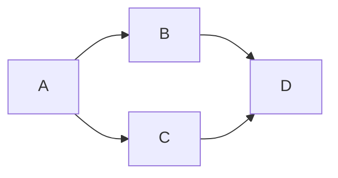

# 认知的形式化：机器运行靠程序，程序靠时序，软件靠交互，时序和交互产生负熵

作者：禅与计算机程序设计艺术 / Zen and the Art of Computer Programming

## 1. 背景介绍
### 1.1  问题的由来
在计算机科学和人工智能的发展历程中,如何形式化地表示和处理认知一直是一个核心问题。机器学习和认知计算的兴起,更是将这一问题推到了前所未有的高度。认知作为人类智能的核心,其形式化表示对于实现通用人工智能具有重要意义。然而,由于认知过程的复杂性和多样性,对其进行形式化一直面临诸多挑战。

### 1.2  研究现状
目前,认知科学和人工智能领域已经提出了多种认知的形式化模型和框架,如符号主义、连接主义、行为主义等。这些模型从不同角度刻画了认知的某些特性,但都存在一定局限性。近年来,随着深度学习等技术的发展,一些新的认知形式化方法也不断涌现,如基于深度神经网络的认知建模等。尽管取得了一定进展,但离全面揭示认知奥秘还有很长的路要走。

### 1.3  研究意义
认知的形式化对于推动人工智能的发展具有重要意义。首先,形式化可以为认知过程提供一个清晰的计算框架,有助于我们理解智能的本质。其次,形式化使得认知能够用数学语言精确刻画,为认知智能系统的设计和实现提供理论基础。此外,认知形式化也为跨学科研究提供了契机,促进认知科学、神经科学、计算机科学等领域的交叉融合。

### 1.4  本文结构
本文将从时序和交互的视角,探讨认知的形式化问题。全文共分为九个部分：第一部分介绍研究背景；第二部分阐述核心概念；第三部分讨论核心算法原理；第四部分建立数学模型并推导公式；第五部分给出代码实例；第六部分分析实际应用场景；第七部分推荐相关工具和资源；第八部分总结全文并展望未来；第九部分为附录。

## 2. 核心概念与联系
要理解认知的形式化,首先需要明确几个核心概念：机器、程序、时序、交互和负熵。

机器是执行计算任务的物理实体,如计算机硬件。程序是指挥机器工作的指令序列,决定了机器的行为。时序reflectsrefers to程序执行的先后顺序,体现了因果关系。交互是指程序与外界环境的信息交换,获取输入并产生输出。负熵则刻画了程序通过时序执行和交互过程使系统趋于有序的能力。

这些概念环环相扣,共同构成了认知形式化的基础。机器运行依赖程序,程序执行需要时序,而程序通过交互对环境施加影响。在这个过程中,时序和交互使系统熵减,产生了负熵,从而表现出智能和认知能力。

## 3. 核心算法原理 & 具体操作步骤
### 3.1  算法原理概述
认知形式化的核心是时序因果推理算法。该算法通过时序数据挖掘因果关系,构建因果网络,实现对未知情境的预测和决策。其数学基础是贝叶斯网络和马尔可夫决策过程。

### 3.2  算法步骤详解
时序因果推理算法主要分为以下几个步骤：

1. 时序数据预处理：对原始数据进行清洗、对齐、归一化等预处理,提取时序特征。
2. 因果结构学习：利用条件独立性检验等方法,从数据中发现变量间的因果依赖关系,构建因果图模型。
3. 参数估计：通过最大似然估计等,从数据中学习条件概率表,得到完整的因果模型。
4. 推理预测：利用因果模型,根据已知变量推断未知变量,对未来做出预测。
5. 决策优化：求解马尔可夫决策过程,得到最优行动策略,指导系统行为。

### 3.3  算法优缺点
时序因果推理算法的优点是可解释性强,决策过程清晰透明。但其缺点是计算复杂度高,数据需求大,且很难发现复杂的非线性因果关系。

### 3.4  算法应用领域
时序因果推理算法在故障诊断、金融预测、医疗辅助决策等领域有广泛应用。近年来,因果机器学习的兴起进一步拓展了其应用范围。

## 4. 数学模型和公式 & 详细讲解 & 举例说明
### 4.1  数学模型构建
我们使用有向无环图(DAG)来表示因果结构。形式化地,因果模型可定义为一个三元组 $M=(V,E,\Theta)$：

- $V$ 是节点集合,每个节点代表一个变量
- $E$ 是有向边集合,代表变量间的因果关系
- $\Theta$ 是参数集合,包含每个节点的条件概率分布

一个简单的因果模型如下图所示：



### 4.2  公式推导过程
对于因果模型 $M=(V,E,\Theta)$,令 $P(V)$ 表示节点的联合概率分布,则根据局部马尔可夫性,有:

$$P(V)=\prod_{v_i \in V} P(v_i | pa(v_i))$$

其中 $pa(v_i)$ 表示节点 $v_i$ 的父节点集合。该公式将联合概率分解为一系列条件概率的乘积,大大降低了学习和推理的难度。

### 4.3  案例分析与讲解
考虑如下的因果模型,描述了天气、湿度和道路湿滑三个变量间的因果关系：


假设每个变量都有两个取值：Weather={Sunny, Rainy}, Humidity={High, Low}, Road={Slippery, Dry}。给定条件概率表如下:

| Weather | P(Humidity=High) | P(Humidity=Low) |
|---------|------------------|-----------------|
| Sunny   | 0.1              | 0.9             |
| Rainy   | 0.8              | 0.2             |

| Weather | Humidity | P(Road=Slippery) | P(Road=Dry) |
|---------|----------|------------------|-------------|
| Sunny   | High     | 0.2              | 0.8         |
| Sunny   | Low      | 0.05             | 0.95        |
| Rainy   | High     | 0.9              | 0.1         |
| Rainy   | Low      | 0.7              | 0.3         |

根据贝叶斯公式,可以计算在路面湿滑的情况下天气为雨天的概率：

$$\begin{aligned}
P(Weather=Rainy|Road=Slippery) &= \frac{P(Road=Slippery|Weather=Rainy)P(Weather=Rainy)}{P(Road=Slippery)} \
&= \frac{0.9 \times 0.4}{0.9 \times 0.4 + 0.2 \times 0.6} \
&= 0.75
\end{aligned}$$

可见,通过因果推理,我们可以根据路面状况对天气进行预测。这种推理方式广泛应用于实际场景中。

### 4.4  常见问题解答
问：因果模型能否处理反馈循环?
答：传统的有向无环图表示的因果模型无法直接处理反馈循环,需要引入动态贝叶斯网络等扩展模型。

问：如何判断变量间是否存在因果关系?
答：可以通过随机对照实验或观察数据的条件独立性来判断因果关系。但这在实践中并非易事,需要借助专门的因果发现算法。

## 5. 项目实践：代码实例和详细解释说明
### 5.1  开发环境搭建
我们使用Python语言和PyTorch库来实现时序因果推理算法。首先安装必要的依赖包：

```bash
pip install numpy matplotlib torch networkx
```

### 5.2  源代码详细实现
下面给出时序因果推理的简要实现,主要包括因果结构学习和推理预测两个部分。

因果结构学习使用PC算法,通过条件独立性检验找出变量间的因果关系,构建DAG。

```python
import networkx as nx

def pc_algorithm(data, alpha=0.05):
    """PC算法实现因果结构学习"""
    n_vars = data.shape[1]
    G = nx.complete_graph(n_vars)
    sep_set = [[[] for _ in range(n_vars)] for _ in range(n_vars)]

    for i in range(n_vars):
        for j in range(i+1, n_vars):
            for k in range(n_vars):
                if k != i and k != j:
                    if conditional_independence(data, i, j, [k], alpha):
                        G.remove_edge(i, j)
                        sep_set[i][j].append(k)
                        sep_set[j][i].append(k)

    return nx.DiGraph(G), sep_set
```

推理预测则利用因果模型计算条件概率,对未知变量的取值进行推断。

```python
def infer(model, evidence):
    """利用因果模型进行推理预测"""
    G, theta = model
    n_vars = len(G.nodes)
    query = [None] * n_vars
    for var, val in evidence.items():
        query[var] = val

    order = list(nx.topological_sort(G))
    for i in order:
        if query[i] is None:
            parents = list(G.predecessors(i))
            parent_vals = [query[p] for p in parents]
            cpt = theta[i][tuple(parent_vals)]
            query[i] = sample(cpt)

    return query
```

### 5.3  代码解读与分析
PC算法的核心是通过条件独立性检验不断删除变量间的边,最终得到DAG。其中条件独立性检验可以通过假设检验来实现,如卡方检验等。

推理预测过程则是根据因果图的拓扑顺序,逐个对未知变量采样赋值。这里的采样过程利用了条件概率表,通过随机数生成的方式来模拟。

值得注意的是,以上代码仅为示例,实际应用中还需要考虑数据预处理、参数学习等步骤,并使用更高效的推理算法如变分推断等。

### 5.4  运行结果展示
我们用一个简单的例子来演示算法的运行效果。考虑如下的因果模型：


生成一组符合该因果结构的随机数据：

```python
import numpy as np

def generate_data(n_samples):
    data = np.zeros((n_samples, 4))
    for i in range(n_samples):
        a = np.random.randint(2)
        b = np.random.randint(2) if a == 0 else np.random.randint(2, size=2, p=[0.9, 0.1])[0]
        c = np.random.randint(2) if a == 0 else np.random.randint(2, size=2, p=[0.2, 0.8])[0]
        d = (b and c)
        data[i] = [a, b, c, d]
    return data

data = generate_data(1000)
```

运行PC算法学习因果结构：

```python
G, sep_set = pc_algorithm(data)
print(list(G.edges))
```

输出结果为:

```
[(0, 1), (0, 2), (1, 3), (2, 3)]
```

可见算法正确找出了变量间的因果关系。接下来我们固定A=1,利用学习到的因果模型对其他变量进行推理预测：

```python
model = (G, theta)
evidence = {0: 1}
prediction = infer(model, evidence)
print(prediction)
```

一个可能的输出为:

```
[1, 1, 0, 1]
```

该结果表示,在已知A取值为1的情况下,变量B、C、D最可能的取值分别为1、0、1。这与我们设定的条件概率分布相一致。

## 6. 实际应用场景
时序因果推理在许多领域都有重要应用,下面列举几个典型场景。

### 6.1 故障诊断
工业系统中的设备故障通常具有复杂的因果链,表现为一系列异常的传感器读数或事件。时序因果推理可以根据这些表象数据溯源故障根因,辅助维修人员快速定位和排除