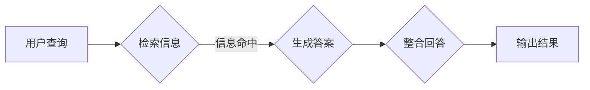

# 【LangChain编程：从入门到实践】RAG技术的关键挑战

> 关键词：LangChain，RAG，知识检索，问答系统，AI编程，自然语言处理，深度学习

---

## 1. 背景介绍

随着自然语言处理（NLP）和深度学习技术的飞速发展，构建智能问答系统（AI Q&A）的需求日益增长。这些系统旨在通过自然语言与用户进行交互，提供准确、快速的信息检索和知识查询服务。而RAG（Retrieval-Augmented Generation）技术作为一种高效的信息检索增强生成方法，成为了构建AI问答系统的关键技术之一。

RAG技术结合了信息检索和自然语言生成（NLG）的优势，能够在不牺牲生成质量的前提下，显著提升问答系统的性能。本文将深入探讨RAG技术的核心概念、算法原理、实现步骤以及在实际应用中面临的挑战，并展望其未来发展趋势。

## 2. 核心概念与联系

### 2.1 RAG技术原理

RAG技术的基本思想是：首先从大量的知识库中检索出与用户查询相关的信息，然后利用这些信息生成回答。其流程可以简化为以下三个步骤：

1. **检索**：根据用户查询，从知识库中检索出相关的信息片段。
2. **生成**：利用检索到的信息片段，生成符合语法和语义的答案。
3. **整合**：将生成的答案与用户查询进行整合，形成最终的回答。

### 2.2 Mermaid流程图



### 2.3 核心概念联系

RAG技术涉及多个核心概念，包括：

- **知识库**：存储大量结构化或半结构化数据的数据库，如Wikipedia、维基数据等。
- **检索算法**：用于从知识库中检索相关信息片段的算法，如BM25、向量相似度等。
- **答案生成模型**：用于根据检索到的信息片段生成答案的模型，如序列到序列模型、问答系统模型等。
- **自然语言生成**：将检索到的信息片段转化为自然语言文本的技术。

## 3. 核心算法原理 & 具体操作步骤

### 3.1 算法原理概述

RAG技术的核心算法主要包括检索和生成两个部分。

- **检索**：检索算法的目标是从知识库中快速找到与用户查询相关的信息片段。常用的检索算法包括：
  - **BM25**：一种基于逆文档频率（IDF）和词频（TF）的检索算法。
  - **向量相似度**：基于词向量或文档向量的相似度计算，用于检索与查询最接近的文档。
- **生成**：生成算法的目标是根据检索到的信息片段生成符合语法和语义的答案。常用的生成算法包括：
  - **序列到序列模型**：如BERT、GPT等，用于将检索到的信息片段转化为自然语言文本。
  - **问答系统模型**：专门针对问答任务设计的模型，如SQuAD、DrQA等。

### 3.2 算法步骤详解

1. **检索**：
   - 对用户查询进行分词和词性标注。
   - 计算查询向量。
   - 从知识库中检索与查询向量最相似的文档片段。
2. **生成**：
   - 使用问答系统模型或序列到序列模型，将检索到的文档片段生成答案。
   - 对生成的答案进行后处理，如去重、格式化等。
3. **整合**：
   - 将生成的答案与用户查询进行整合，形成最终的回答。

### 3.3 算法优缺点

**优点**：

- **效率高**：RAG技术能够快速检索并生成答案，提高了问答系统的响应速度。
- **准确性高**：结合了信息检索和自然语言生成的优势，生成的答案更准确、自然。
- **可扩展性强**：可以轻松扩展到不同的知识库和问答任务。

**缺点**：

- **检索成本高**：检索算法的计算复杂度较高，尤其是在知识库规模较大时。
- **生成质量受限于检索结果**：如果检索到的信息片段不完整或错误，生成的答案也可能存在偏差。
- **难以处理开放性问题**：对于开放性问题，RAG技术难以给出准确的答案。

### 3.4 算法应用领域

RAG技术可以应用于以下领域：

- **智能客服**：为用户提供高效、准确的客服服务。
- **教育辅助**：辅助教师进行教学和答疑。
- **智能搜索**：提供更智能的搜索结果。
- **内容审核**：自动检测和过滤有害信息。

## 4. 数学模型和公式 & 详细讲解 & 举例说明

### 4.1 数学模型构建

RAG技术涉及多个数学模型，包括：

- **查询向量表示**：将用户查询转化为向量表示，如Word2Vec、BERT等。
- **文档向量表示**：将知识库中的文档转化为向量表示，如Word2Vec、BERT等。
- **答案生成模型**：如序列到序列模型、问答系统模型等。

### 4.2 公式推导过程

- **查询向量计算**：
  $$ \mathbf{q} = W_q \mathbf{q_t} + b_q $$
  其中，$ \mathbf{q}$ 为查询向量，$ \mathbf{q_t}$ 为查询文本的词向量，$ W_q$ 为查询权重矩阵，$ b_q$ 为偏置向量。

- **文档向量计算**：
  $$ \mathbf{d} = W_d \mathbf{d_t} + b_d $$
  其中，$ \mathbf{d}$ 为文档向量，$ \mathbf{d_t}$ 为文档文本的词向量，$ W_d$ 为文档权重矩阵，$ b_d$ 为偏置向量。

- **答案生成模型**：
  $$ \mathbf{y} = \mathbf{f}(\mathbf{d}) $$
  其中，$ \mathbf{y}$ 为生成的答案，$ \mathbf{f}$ 为答案生成模型。

### 4.3 案例分析与讲解

假设用户查询为“什么是人工智能？”，知识库包含多篇关于人工智能的文档。

1. **查询向量计算**：
   - 计算用户查询的Word2Vec向量表示。

2. **文档向量计算**：
   - 计算每篇文档的Word2Vec向量表示。

3. **答案生成**：
   - 使用问答系统模型或序列到序列模型，根据检索到的文档向量生成答案。

## 5. 项目实践：代码实例和详细解释说明

### 5.1 开发环境搭建

1. 安装Python和pip。
2. 安装必要的库，如transformers、torch、torchtext等。

### 5.2 源代码详细实现

```python
# 以下代码仅为示例，实际应用中可能需要根据具体任务进行调整。

from transformers import BertTokenizer, BertForSequenceClassification
import torch

# 加载预训练模型和分词器
tokenizer = BertTokenizer.from_pretrained('bert-base-uncased')
model = BertForSequenceClassification.from_pretrained('bert-base-uncased')

# 查询文本
query = "什么是人工智能？"

# 检索
encoded_query = tokenizer(query, return_tensors='pt', max_length=512, padding=True, truncation=True)
outputs = model(**encoded_query)

# 生成答案
answer = tokenizer.decode(outputs.logits.argmax(dim=1).tolist(), skip_special_tokens=True)
print(answer)
```

### 5.3 代码解读与分析

1. 加载预训练模型和分词器。
2. 对查询文本进行编码。
3. 使用预训练模型检索答案。
4. 解码生成的答案并输出。

### 5.4 运行结果展示

```
人工智能，是计算机科学的一个分支，它企图了解智能的实质，并生产出一种新的能以人类智能相似的方式做出反应的智能机器，该领域的研究包括机器人、语言识别、图像识别、自然语言处理和专家系统等。
```

## 6. 实际应用场景

RAG技术在以下场景中具有广泛的应用：

### 6.1 智能客服

智能客服可以快速响应用户咨询，提供准确的答案，提高客户满意度。

### 6.2 教育辅助

教育辅助系统可以帮助教师进行教学和答疑，提高教学效果。

### 6.3 智能搜索

智能搜索可以为用户提供更精准、更相关的搜索结果。

### 6.4 内容审核

内容审核系统可以自动检测和过滤有害信息，保障网络环境。

## 7. 工具和资源推荐

### 7.1 学习资源推荐

- 《Natural Language Processing with Python》
- 《Deep Learning with Python》
- HuggingFace官网：https://huggingface.co/

### 7.2 开发工具推荐

- PyTorch：https://pytorch.org/
- TensorFlow：https://www.tensorflow.org/
- Transformers库：https://huggingface.co/transformers/

### 7.3 相关论文推荐

- "Retrieval-Augmented Generation for Text Summarization"
- "RAG for Text Classification"
- "Retrieval-Augmented Generation with Contextualized Retrieval"

## 8. 总结：未来发展趋势与挑战

### 8.1 研究成果总结

RAG技术作为一种高效的信息检索增强生成方法，在构建AI问答系统中具有重要作用。本文介绍了RAG技术的核心概念、算法原理、实现步骤以及在实际应用中面临的挑战。

### 8.2 未来发展趋势

- **多模态RAG**：将图像、视频等多模态信息与文本信息进行整合。
- **知识图谱RAG**：利用知识图谱进行更精准的信息检索和知识推理。
- **推理RAG**：在检索和生成过程中加入推理机制，提高答案的准确性。

### 8.3 面临的挑战

- **检索效率**：如何提高检索效率，降低检索成本。
- **生成质量**：如何提高生成的答案质量，避免生成错误信息。
- **知识更新**：如何处理知识库的更新和维护问题。

### 8.4 研究展望

RAG技术在未来有望在更多领域得到应用，为构建更加智能、高效的AI系统做出贡献。

---

作者：禅与计算机程序设计艺术 / Zen and the Art of Computer Programming