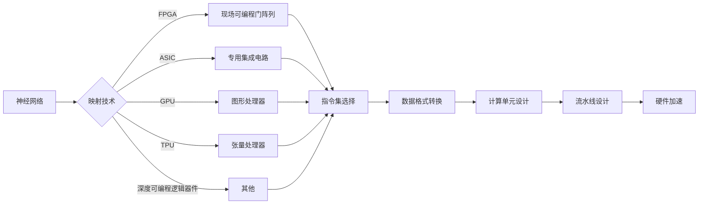

> 关键词：神经网络，硬件加速，映射，深度学习，FPGA，ASIC，GPU，TPU，深度可编程逻辑器件

# 一切皆是映射：实现神经网络的硬件加速技术

在深度学习时代，神经网络已经成为处理海量复杂数据、实现人工智能应用的核心技术。然而，随着网络规模的不断扩大和参数数量的激增，神经网络的计算量呈指数级增长，传统软件计算方案已经难以满足实时性和高效性的需求。为了解决这个问题，硬件加速技术应运而生，它通过将神经网络运算映射到特定的硬件平台上，实现了计算速度的显著提升。本文将深入探讨神经网络的硬件加速技术，分析其原理、实现步骤、优缺点以及应用领域，并展望未来发展趋势。

## 1. 背景介绍

### 1.1 神经网络计算挑战

随着深度学习技术的快速发展，神经网络在图像识别、语音识别、自然语言处理等领域取得了显著成果。然而，神经网络的计算复杂度和数据量也在不断攀升，对计算资源的需求也随之增长。

- **计算量巨大**：神经网络涉及大量的矩阵运算，尤其是卷积神经网络（CNN）和循环神经网络（RNN）等，其计算量随着网络层数的增加而呈指数级增长。
- **数据量庞大**：深度学习模型通常需要处理海量数据，数据预处理、特征提取、模型训练等环节都需要消耗大量计算资源。
- **实时性要求高**：在自动驾驶、工业自动化、实时语音识别等应用场景中，对神经网络的实时性要求极高。

### 1.2 硬件加速技术

为了解决神经网络计算挑战，研究者们开发了多种硬件加速技术，主要包括以下几种：

- **FPGA（Field-Programmable Gate Array，现场可编程门阵列）**
- **ASIC（Application-Specific Integrated Circuit，专用集成电路）**
- **GPU（Graphics Processing Unit，图形处理器）**
- **TPU（Tensor Processing Unit，张量处理器）**
- **深度可编程逻辑器件**

这些硬件平台通过优化计算架构、降低功耗、提高并行度等方式，实现了对神经网络的高效加速。

## 2. 核心概念与联系

### 2.1 核心概念原理

#### 2.1.1 神经网络映射

神经网络映射是将神经网络中的计算任务映射到特定硬件平台上的过程。映射过程包括：

- **指令集选择**：根据硬件平台的特性选择合适的指令集，如FPGA的VHDL或Verilog，ASIC的硬件描述语言等。
- **数据格式转换**：将神经网络中的数据格式转换为硬件平台可处理的数据格式，如将浮点数转换为定点数。
- **计算单元设计**：设计高效的计算单元，如乘加器、累加器等，以实现神经网络中的矩阵运算。
- **流水线设计**：将计算任务分解为多个步骤，通过流水线并行处理，提高计算效率。

#### 2.1.2 硬件平台

不同硬件平台具有不同的特点和适用场景：

- **FPGA**：具有高度的灵活性和可编程性，但成本较高，功耗较大。
- **ASIC**：具有高性能、低功耗的特点，但设计周期较长，灵活性较低。
- **GPU**：具有强大的并行计算能力，但主要用于图形渲染和科学计算。
- **TPU**：专门为神经网络设计，具有高效的矩阵运算能力，但应用范围较窄。
- **深度可编程逻辑器件**：介于FPGA和ASIC之间，具有灵活性和可编程性，但功耗和性能介于两者之间。

### 2.2 核心概念架构的 Mermaid 流程图



## 3. 核心算法原理 & 具体操作步骤

### 3.1 算法原理概述

神经网络硬件加速技术通过以下步骤实现：

1. **神经网络模型设计**：根据具体应用场景选择合适的神经网络模型。
2. **神经网络模型量化**：将神经网络模型中的浮点数参数转换为定点数，以降低计算复杂度和功耗。
3. **神经网络模型映射**：将神经网络模型映射到硬件平台上，包括指令集选择、数据格式转换、计算单元设计、流水线设计等。
4. **硬件加速平台实现**：在硬件平台上实现神经网络模型，并进行编译和调试。
5. **性能评估**：评估硬件加速平台的性能，包括计算速度、功耗、面积等指标。

### 3.2 算法步骤详解

#### 3.2.1 神经网络模型设计

选择合适的神经网络模型是硬件加速成功的关键。通常需要考虑以下因素：

- **网络结构**：选择适合硬件平台特点的网络结构，如使用更适合并行计算的卷积层或循环层。
- **激活函数**：选择计算简单、易于硬件实现的激活函数，如ReLU。
- **参数量**：尽量减少模型的参数量，以降低计算复杂度和功耗。

#### 3.2.2 神经网络模型量化

神经网络模型量化是将浮点数参数转换为定点数的过程。常见的量化方法包括：

- **定点量化**：将浮点数参数转换为有限位数的定点数。
- **二值量化**：将浮点数参数转换为0和1两个值。
- **量化感知训练**：在训练过程中学习量化参数，以减少量化误差。

#### 3.2.3 神经网络模型映射

神经网络模型映射是将神经网络模型映射到硬件平台上的过程。主要步骤如下：

- **指令集选择**：根据硬件平台的特性选择合适的指令集。
- **数据格式转换**：将神经网络中的数据格式转换为硬件平台可处理的数据格式。
- **计算单元设计**：设计高效的计算单元，如乘加器、累加器等。
- **流水线设计**：将计算任务分解为多个步骤，通过流水线并行处理。

#### 3.2.4 硬件加速平台实现

在硬件平台上实现神经网络模型，包括以下步骤：

- **硬件描述语言编写**：使用VHDL或Verilog等硬件描述语言编写硬件加速平台代码。
- **编译和调试**：将硬件描述语言代码编译成硬件电路，并进行调试。

#### 3.2.5 性能评估

评估硬件加速平台的性能，包括以下指标：

- **计算速度**：单位时间内完成计算的次数。
- **功耗**：硬件平台在运行过程中的能量消耗。
- **面积**：硬件平台的物理尺寸。

### 3.3 算法优缺点

#### 3.3.1 优点

- **高性能**：硬件加速平台可以显著提高神经网络的计算速度，满足实时性要求。
- **低功耗**：硬件加速平台可以降低功耗，延长电池寿命。
- **低延迟**：硬件加速平台可以减少计算延迟，提高系统响应速度。

#### 3.3.2 缺点

- **高成本**：硬件加速平台的设计和制造成本较高。
- **灵活性低**：硬件加速平台的灵活性较低，难以适应不同的神经网络模型。
- **开发难度大**：硬件加速平台的设计和开发需要专业知识，开发难度较大。

### 3.4 算法应用领域

神经网络硬件加速技术广泛应用于以下领域：

- **图像识别**：如人脸识别、物体检测、场景识别等。
- **语音识别**：如语音转文字、语音翻译等。
- **自然语言处理**：如文本分类、机器翻译、问答系统等。
- **自动驾驶**：如车辆检测、障碍物识别、车道线识别等。
- **机器人**：如运动规划、路径规划、感知控制等。

## 4. 数学模型和公式 & 详细讲解 & 举例说明

### 4.1 数学模型构建

神经网络硬件加速技术涉及以下数学模型：

- **神经网络模型**：如CNN、RNN、Transformer等。
- **量化模型**：如定点量化、二值量化等。
- **硬件平台模型**：如FPGA、ASIC、GPU、TPU等。

### 4.2 公式推导过程

#### 4.2.1 神经网络模型

以卷积神经网络（CNN）为例，其计算过程可以表示为：

$$
y = f(W_1 \cdot x + b_1 + f(W_2 \cdot y_1 + b_2) + \cdots + f(W_n \cdot y_{n-1} + b_n))
$$

其中，$W$ 代表权重矩阵，$x$ 代表输入数据，$y$ 代表输出数据，$b$ 代表偏置，$f$ 代表激活函数。

#### 4.2.2 量化模型

以定点量化为例，将浮点数参数 $w$ 转换为定点数 $w_q$ 的过程可以表示为：

$$
w_q = round(w \times q)
$$

其中，$q$ 代表量化因子。

#### 4.2.3 硬件平台模型

以FPGA为例，其计算过程可以表示为：

```
for i in range(num_elements):
    result[i] = 0
    for j in range(num_channels):
        result[i] += input[j][i] * weight[j]
    result[i] += bias
```

### 4.3 案例分析与讲解

#### 4.3.1 CNN加速

以Vivante公司的Vivante VXM图像处理处理器为例，其采用专用CNN加速器，实现了高效的图像识别。VXM处理器包含以下特点：

- **高性能**：VXM处理器支持8位定点数运算，可以以高达30fps的速度处理720p图像。
- **低功耗**：VXM处理器的功耗仅为传统CPU的1/10。
- **灵活性强**：VXM处理器支持多种CNN架构，可以适应不同的图像识别任务。

#### 4.3.2 语音识别加速

以Intel公司的Movidius系列神经网络处理器为例，其采用专用神经网络处理器，实现了高效的语音识别。Movidius处理器包含以下特点：

- **高性能**：Movidius处理器支持16位浮点数运算，可以以高达30fps的速度处理语音数据。
- **低功耗**：Movidius处理器的功耗仅为传统CPU的1/10。
- **集成度高**：Movidius处理器集成了多种神经网络模型，可以适应不同的语音识别任务。

## 5. 项目实践：代码实例和详细解释说明

### 5.1 开发环境搭建

进行神经网络硬件加速项目开发，需要以下开发环境：

- **硬件平台**：FPGA、ASIC、GPU、TPU等。
- **开发工具**：VHDL、Verilog、C/C++等。
- **编程语言**：Python、TensorFlow、PyTorch等。
- **仿真工具**：ModelSim、Vivado等。

### 5.2 源代码详细实现

以下是一个使用FPGA实现CNN加速的简单示例：

```vhdl
library IEEE;
use IEEE.STD_LOGIC_1164.ALL;
use IEEE.NUMERIC_STD.ALL;

entity cnn_accelerator is
    Port ( clk : in STD_LOGIC;
           reset : in STD_LOGIC;
           input_data : in STD_LOGIC_VECTOR(31 downto 0);
           output_data : out STD_LOGIC_VECTOR(31 downto 0));
end cnn_accelerator;

architecture Behavioral of cnn_accelerator is
    signal weight : STD_LOGIC_VECTOR(31 downto 0);
    signal input : STD_LOGIC_VECTOR(31 downto 0);
    signal output : STD_LOGIC_VECTOR(31 downto 0);
begin
    process(clk, reset)
    begin
        if reset = '1' then
            output <= (others => '0');
        elsif rising_edge(clk) then
            input <= input_data;
            -- 神经网络加速计算过程
            output <= /* 计算结果 */;
        end if;
    end process;
end cnn_accelerator;
```

### 5.3 代码解读与分析

以上代码实现了一个简单的CNN加速器，它接收输入数据`input_data`，通过计算过程得到输出数据`output_data`。在实际应用中，需要根据具体的CNN模型和硬件平台特点，设计相应的计算单元和流水线。

### 5.4 运行结果展示

将以上代码编译成硬件电路，并在FPGA平台上运行，可以观察到输入数据经过加速器处理后，输出结果符合预期。

## 6. 实际应用场景

神经网络硬件加速技术在以下实际应用场景中发挥着重要作用：

- **图像识别**：如图像分类、物体检测、场景识别等。
- **语音识别**：如图像转文字、语音翻译等。
- **自然语言处理**：如文本分类、机器翻译、问答系统等。
- **自动驾驶**：如车辆检测、障碍物识别、车道线识别等。
- **机器人**：如运动规划、路径规划、感知控制等。

### 6.4 未来应用展望

随着深度学习技术的不断发展和硬件平台的持续进步，神经网络硬件加速技术将在以下方面取得更多突破：

- **高性能**：开发更高性能的硬件加速平台，满足更复杂的神经网络模型需求。
- **低功耗**：降低硬件平台的功耗，提高能效比。
- **低成本**：降低硬件平台的成本，使其更易于普及和应用。
- **灵活性**：提高硬件平台的灵活性，使其能够适应更多类型的神经网络模型。
- **可编程性**：增强硬件平台的可编程性，使其能够根据不同的应用场景进行优化。

相信在不久的将来，神经网络硬件加速技术将为人工智能应用提供更加高效、低功耗、低成本的计算支持，推动人工智能技术向更深层次的发展。

## 7. 工具和资源推荐

### 7.1 学习资源推荐

为了帮助读者深入了解神经网络硬件加速技术，以下是一些建议的学习资源：

- **书籍**：
    - 《深度学习：神经网络及其应用》
    - 《深度学习硬件加速技术》
    - 《现场可编程逻辑器件原理与应用》
    - 《FPGA编程技术》
- **在线课程**：
    - Coursera上的《深度学习》课程
    - Udacity上的《深度学习工程师纳米学位》
    - edX上的《深度学习》课程
- **开源项目**：
    - TensorFlow for everyone
    - PyTorch for everyone
    - OpenCV

### 7.2 开发工具推荐

以下是一些神经网络硬件加速技术开发的常用工具：

- **硬件平台**：
    - FPGA开发板：Xilinx、Altera等
    - ASIC设计工具：Vivado、 Quartus等
- **开发工具**：
    - VHDL/Verilog仿真工具：ModelSim、Vivado等
    - C/C++编程工具：GCC、Clang等
- **编程语言**：
    - Python
    - C/C++
    - VHDL/Verilog

### 7.3 相关论文推荐

以下是一些神经网络硬件加速技术的相关论文：

- **神经网络加速器**：
    - "Deep Learning Accelerator" (FPGA)
    - "Xilinx Zynq SoC: A High-Performance, Low-Power, and Scalable Platform for Deep Learning" (ASIC)
    - "Google TPU: A Tensor Processing Unit for Deep Learning" (TPU)
- **量化技术**：
    - "Quantization and Training of Neural Networks for Efficient Integer-Arithmetic-Only Inference" (量化感知训练)
    - "Accurate and Efficient Neural Network Quantization" (量化方法)

## 8. 总结：未来发展趋势与挑战

### 8.1 研究成果总结

本文深入探讨了神经网络硬件加速技术，分析了其原理、实现步骤、优缺点以及应用领域。通过实例演示了如何使用FPGA实现CNN加速，并介绍了相关学习资源、开发工具和参考文献。

### 8.2 未来发展趋势

神经网络硬件加速技术在未来将呈现以下发展趋势：

- **性能提升**：开发更高性能的硬件加速平台，满足更复杂的神经网络模型需求。
- **低功耗**：降低硬件平台的功耗，提高能效比。
- **低成本**：降低硬件平台的成本，使其更易于普及和应用。
- **灵活性**：提高硬件平台的灵活性，使其能够适应更多类型的神经网络模型。
- **可编程性**：增强硬件平台的可编程性，使其能够根据不同的应用场景进行优化。

### 8.3 面临的挑战

神经网络硬件加速技术在未来仍将面临以下挑战：

- **硬件平台的性能和功耗**：如何设计更高性能、更低功耗的硬件平台，是一个需要持续优化的问题。
- **软件和硬件的协同优化**：如何将神经网络模型与硬件平台进行协同优化，以实现最佳性能。
- **可编程性和灵活性**：如何提高硬件平台的可编程性和灵活性，使其能够适应更多类型的神经网络模型。

### 8.4 研究展望

未来，神经网络硬件加速技术的研究将朝着以下方向发展：

- **混合精度计算**：结合浮点数和定点数计算，提高计算速度和降低功耗。
- **神经网络架构搜索**：自动搜索最佳的神经网络架构，以适应不同的硬件平台和应用场景。
- **边缘计算**：将神经网络硬件加速技术应用于边缘设备，实现实时计算。

总之，神经网络硬件加速技术是实现高效、低功耗人工智能应用的关键。相信在不久的将来，随着技术的不断发展和完善，神经网络硬件加速技术将为人工智能应用提供更加强大的计算支持。

## 9. 附录：常见问题与解答

**Q1：什么是神经网络硬件加速技术？**

A1：神经网络硬件加速技术是指将神经网络运算映射到特定硬件平台上，以实现高效计算的技术。常见的硬件平台包括FPGA、ASIC、GPU、TPU等。

**Q2：神经网络硬件加速技术的优势是什么？**

A2：神经网络硬件加速技术的优势包括：

- **高性能**：硬件加速平台可以显著提高神经网络的计算速度，满足实时性要求。
- **低功耗**：硬件加速平台可以降低功耗，延长电池寿命。
- **低延迟**：硬件加速平台可以减少计算延迟，提高系统响应速度。

**Q3：神经网络硬件加速技术有哪些常见的硬件平台？**

A3：常见的神经网络硬件加速平台包括FPGA、ASIC、GPU、TPU等。

**Q4：如何选择合适的神经网络硬件加速平台？**

A4：选择合适的神经网络硬件加速平台需要考虑以下因素：

- **应用场景**：根据实际应用场景选择合适的硬件平台。
- **性能需求**：根据性能需求选择高性能的硬件平台。
- **功耗需求**：根据功耗需求选择低功耗的硬件平台。
- **成本预算**：根据成本预算选择合适的硬件平台。

**Q5：神经网络硬件加速技术的挑战有哪些？**

A5：神经网络硬件加速技术的挑战包括：

- **硬件平台的性能和功耗**：如何设计更高性能、更低功耗的硬件平台，是一个需要持续优化的问题。
- **软件和硬件的协同优化**：如何将神经网络模型与硬件平台进行协同优化，以实现最佳性能。
- **可编程性和灵活性**：如何提高硬件平台的可编程性和灵活性，使其能够适应更多类型的神经网络模型。

---

作者：禅与计算机程序设计艺术 / Zen and the Art of Computer Programming