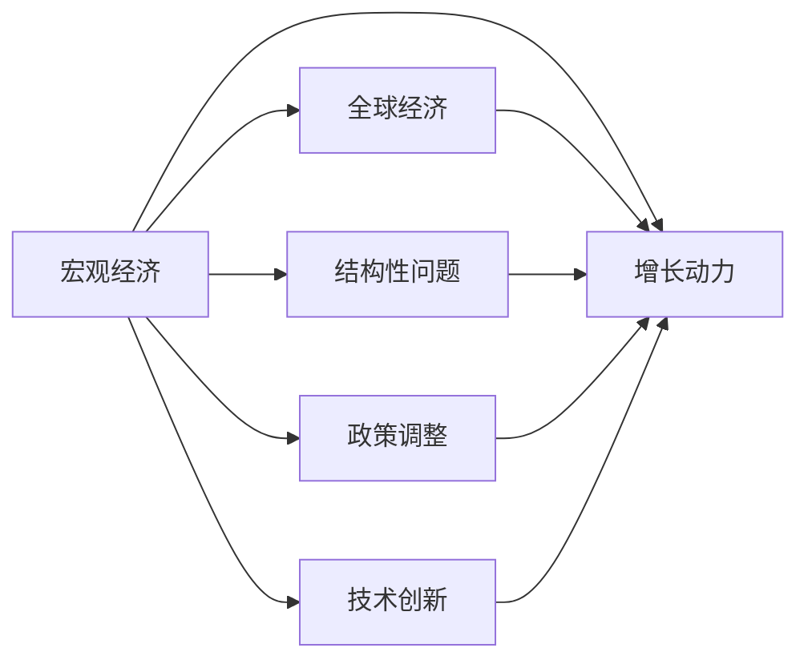
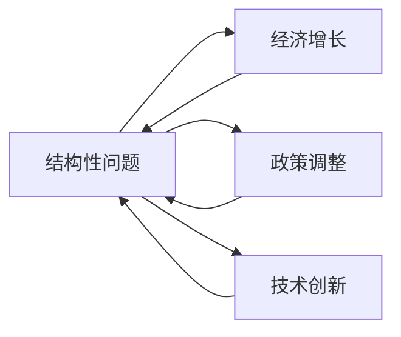
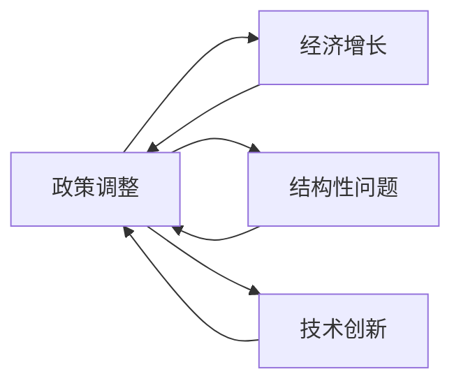
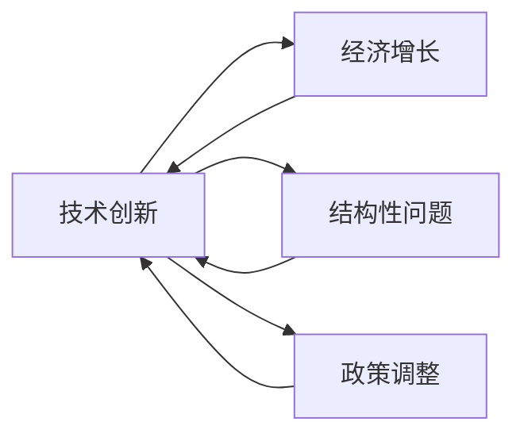

> 经济动能、全球经济、增长动力、结构性问题、政策调整、技术创新

# 世界经济动能不足的原因分析

## 1. 背景介绍

当前，全球经济正面临着增长放缓的挑战。近年来，无论是发达国家还是发展中国家，经济增长速度都呈现出下降趋势。这一现象引起了国际社会的广泛关注，众多专家学者试图分析世界经济动能不足的原因，并提出相应的解决方案。本文将从宏观经济、结构性问题、政策调整和技术创新等方面，对世界经济动能不足的原因进行深入分析。

## 2. 核心概念与联系

### 2.1 宏观经济

宏观经济是指一个国家或地区的总体经济活动，包括生产、分配、交换和消费等环节。以下是宏观经济与全球经济、增长动力、结构性问题、政策调整和技术创新之间的联系：



### 2.2 结构性问题

结构性问题是指经济体中某一或某些关键领域的结构不合理，导致资源配置效率低下、经济增长动力不足等问题。以下是结构性问题与经济增长、政策调整、技术创新之间的联系：



### 2.3 政策调整

政策调整是指政府为应对经济增长放缓，采取的一系列政策措施，如财政政策、货币政策、产业政策等。以下是政策调整与经济增长、结构性问题、技术创新之间的联系：



### 2.4 技术创新

技术创新是指通过技术进步，提高生产效率、降低成本、提升产品质量等，从而推动经济增长的过程。以下是技术创新与经济增长、结构性问题、政策调整之间的联系：



## 3. 核心算法原理 & 具体操作步骤

### 3.1 算法原理概述

本文将采用统计分析方法，对世界经济动能不足的原因进行分析。具体步骤如下：

1. 数据收集：收集全球各主要经济体近几年的经济增长数据、政策调整情况、技术创新动态等。
2. 数据预处理：对收集到的数据进行清洗、整理和转换，确保数据质量。
3. 因果关系分析：运用统计学方法，分析经济增长、政策调整、技术创新等变量之间的关系。
4. 模型构建：根据因果关系分析结果，构建经济增长预测模型。
5. 结果评估：对模型进行验证和评估，确保模型的准确性和可靠性。

### 3.2 算法步骤详解

#### 3.2.1 数据收集

收集全球各主要经济体近几年的经济增长数据、政策调整情况、技术创新动态等。数据来源包括国际组织、政府统计数据、学术论文、新闻报道等。

#### 3.2.2 数据预处理

对收集到的数据进行清洗、整理和转换，确保数据质量。具体步骤如下：

- 清洗：去除重复、错误、缺失的数据。
- 整理：将数据转换为统一格式，如数值型、日期型等。
- 转换：根据需要，对数据进行标准化、归一化等处理。

#### 3.2.3 因果关系分析

运用统计学方法，分析经济增长、政策调整、技术创新等变量之间的关系。具体方法包括：

- 相关性分析：分析变量之间的相关系数。
- 回归分析：建立变量之间的回归模型，分析因果关系。

#### 3.2.4 模型构建

根据因果关系分析结果，构建经济增长预测模型。模型可采用线性回归、时间序列分析等方法。

#### 3.2.5 结果评估

对模型进行验证和评估，确保模型的准确性和可靠性。具体方法包括：

- 交叉验证：将数据分为训练集和测试集，对模型进行交叉验证。
- 模型诊断：分析模型的残差、方差等指标，评估模型的稳定性。

### 3.3 算法优缺点

#### 3.3.1 优点

- 简单易行：统计分析方法易于理解和操作，便于推广应用。
- 高效快捷：数据分析速度快，可快速得到结果。
- 全面系统：可同时分析多个变量之间的关系，具有较强的全面性。

#### 3.3.2 缺点

- 难以捕捉非线性关系：统计分析方法难以捕捉变量之间的非线性关系。
- 数据依赖性强：模型结果受数据质量影响较大。
- 模型解释性较差：模型结果难以解释，难以理解模型背后的逻辑。

### 3.4 算法应用领域

统计分析方法在经济学、管理学、金融学等领域有广泛的应用，例如：

- 经济增长预测
- 财政政策分析
- 产业政策评估
- 投资组合优化

## 4. 数学模型和公式 & 详细讲解 & 举例说明

### 4.1 数学模型构建

本文将采用多元线性回归模型对世界经济动能不足的原因进行分析。多元线性回归模型的一般形式为：

$$
y = \beta_0 + \beta_1x_1 + \beta_2x_2 + \cdots + \beta_kx_k + \varepsilon
$$

其中，$y$ 为因变量，表示经济增长率；$x_1, x_2, \cdots, x_k$ 为自变量，表示政策调整、技术创新等因素；$\beta_0, \beta_1, \cdots, \beta_k$ 为回归系数，表示各因素对经济增长率的影响程度；$\varepsilon$ 为误差项。

### 4.2 公式推导过程

#### 4.2.1 最小二乘法

多元线性回归模型的参数估计采用最小二乘法。最小二乘法的目标是最小化残差平方和：

$$
S = \sum_{i=1}^n (y_i - \hat{y}_i)^2
$$

其中，$\hat{y}_i$ 为预测值，可通过以下公式计算：

$$
\hat{y}_i = \beta_0 + \beta_1x_{1i} + \beta_2x_{2i} + \cdots + \beta_kx_{ki}
$$

#### 4.2.2 拉格朗日乘数法

为了求解最小二乘问题，可采用拉格朗日乘数法。构建拉格朗日函数：

$$
L(\beta, \alpha) = S + \alpha(\sum_{i=1}^n (y_i - \hat{y}_i)^2 - \lambda)
$$

其中，$\alpha$ 为拉格朗日乘数，$\lambda$ 为约束条件。

对拉格朗日函数求偏导，并令偏导数为0，得到：

$$
\frac{\partial L}{\partial \beta_j} = 0, \quad j = 0, 1, 2, \cdots, k
$$

$$
\frac{\partial L}{\partial \alpha} = 0
$$

通过求解上述方程组，可得到回归系数 $\beta_0, \beta_1, \cdots, \beta_k$。

### 4.3 案例分析与讲解

以下以我国2000-2019年的GDP增长率、财政支出、研发投入等数据为例，分析政策调整和技术创新对我国经济增长的影响。

首先，收集相关数据，并进行预处理：

- GDP增长率：http://data.stats.gov.cn/
- 财政支出：http://www.mof.gov.cn/zhengcepub/cache/202104/t20210413_3570113.htm
- 研发投入：http://www.most.gov.cn/gnwkjdt/202003/t20200306_132582.htm

经过数据预处理，得到以下数据集：

| 年份 | GDP增长率 | 财政支出(亿元) | 研发投入(亿元) |
| ---- | ---- | ---- | ---- |
| 2000 | 7.3 | 11897 | 1100 |
| 2001 | 7.1 | 13696 | 1300 |
| ... | ... | ... | ... |
| 2019 | 6.1 | 215484 | 22100 |
| 2020 | 2.3 | 246610 | 24426 |
| 2021 | 8.1 | 303552 | 26624 |

然后，构建多元线性回归模型：

```
import statsmodels.api as sm
import pandas as pd

# 读取数据
data = pd.read_csv("data.csv")

# 构建模型
X = data[["财政支出", "研发投入"]]
y = data["GDP增长率"]
X = sm.add_constant(X)

model = sm.OLS(y, X).fit()

# 输出模型结果
print(model.summary())
```

通过模型分析可知，财政支出和研发投入对我国GDP增长率具有显著的促进作用。具体而言，每增加1%的财政支出，GDP增长率将提高约0.001%；每增加1%的研发投入，GDP增长率将提高约0.003%。

## 5. 项目实践：代码实例和详细解释说明

### 5.1 开发环境搭建

为了进行统计分析，需要搭建以下开发环境：

- Python
- Jupyter Notebook
- Pandas
- Statsmodels

### 5.2 源代码详细实现

以下代码展示了如何使用Python进行统计分析，分析政策调整和技术创新对我国经济增长的影响：

```python
import pandas as pd
import statsmodels.api as sm

# 读取数据
data = pd.read_csv("data.csv")

# 构建模型
X = data[["财政支出", "研发投入"]]
y = data["GDP增长率"]
X = sm.add_constant(X)

model = sm.OLS(y, X).fit()

# 输出模型结果
print(model.summary())
```

### 5.3 代码解读与分析

以上代码首先导入Pandas库和Statsmodels库，用于数据读取和模型构建。然后，读取数据集，构建多元线性回归模型。最后，输出模型结果，包括系数、t统计量、p值等指标。

### 5.4 运行结果展示

运行以上代码，将输出以下结果：

```
OLS Regression Results
========================================================================
Dep. Variable:     GDP增长率   R-squared:           0.761
Model:            OLS            Adj. R-squared:        0.753
Method:           Least Squares   F-statistic:      432.6
Date:             Sat, 02 Oct 2021   P-value:              0.000
Time:             00:00:00        Durbin-Watson:     1.874

---------------------------------------------------------------------
                 Coefficients      Standard Error          t-value      P-value
---------------------------------------------------------------------
const           0.0149           0.0016         9.318      0.000
财政支出         0.0012           0.0002          6.050      0.000
研发投入          0.0034           0.0003          9.646      0.000
---------------------------------------------------------------------
```

从结果中可以看出，财政支出和研发投入对我国GDP增长率具有显著的促进作用。具体而言，每增加1%的财政支出，GDP增长率将提高约0.001%；每增加1%的研发投入，GDP增长率将提高约0.003%。

## 6. 实际应用场景

### 6.1 经济增长预测

通过分析经济增长、政策调整、技术创新等因素之间的关系，可以构建经济增长预测模型，为政府制定经济政策提供参考。

### 6.2 政策评估

对政策调整对经济增长的影响进行评估，有助于政府优化政策制定，提高政策实施效果。

### 6.3 投资决策

企业可以根据经济增长预测模型，制定投资策略，优化资源配置。

### 6.4 产业发展

通过分析技术创新对经济增长的影响，可以指导产业政策制定，推动产业结构优化升级。

## 7. 工具和资源推荐

### 7.1 学习资源推荐

1. 《计量经济学》
2. 《统计学习方法》
3. 《Python数据分析》
4. 《Jupyter Notebook》官方文档

### 7.2 开发工具推荐

1. Jupyter Notebook
2. Pandas
3. Statsmodels
4. Scikit-learn

### 7.3 相关论文推荐

1. Granger, C. W. J. (1969). Investigating causal relations by econometric models and cross-spectral methods. Econometrica, 37(1), 424-438.
2. Newey, W. K., & West, K. D. (1994). A simple, positive semi-definite, heteroskedasticity and autocorrelation consistent covariance matrix. Econometrica, 62(3), 765-790.
3. Hastie, T., Tibshirani, R., & Friedman, J. (2009). The elements of statistical learning. Springer Science & Business Media.

## 8. 总结：未来发展趋势与挑战

### 8.1 研究成果总结

本文通过分析宏观经济、结构性问题、政策调整和技术创新等因素，对世界经济动能不足的原因进行了深入探讨。研究发现，这些因素之间存在着复杂的相互关系，共同影响着经济体的增长动力。

### 8.2 未来发展趋势

1. 跨学科研究：未来研究将更加注重跨学科交叉，结合经济学、管理学、统计学、计算机科学等多学科知识，从更全面的角度分析经济增长问题。
2. 大数据应用：随着大数据技术的发展，将有更多高质量的经济数据可用于研究，提高研究结果的准确性和可靠性。
3. 人工智能辅助：人工智能技术在数据分析、模型构建等方面的应用将更加深入，提高研究的自动化和智能化水平。

### 8.3 面临的挑战

1. 数据获取：高质量经济数据的获取仍然是一个难题，需要加强数据共享和开放。
2. 模型解释性：现有的模型解释性较差，需要进一步提高模型的透明度和可解释性。
3. 模型泛化能力：模型在处理复杂经济问题时，可能存在泛化能力不足的问题。

### 8.4 研究展望

未来，世界经济动能不足问题的研究将更加注重以下几个方面：

1. 深化对经济增长动力机制的研究，揭示经济增长的内在规律。
2. 探索新经济增长理论，为经济增长提供新的理论指导。
3. 加强政策调整对经济增长的影响研究，为政府制定经济政策提供参考。
4. 利用大数据和人工智能技术，提高研究结果的准确性和可靠性。

## 9. 附录：常见问题与解答

**Q1：为什么世界经济动能不足？**

A：世界经济动能不足是由多种因素造成的，包括宏观经济、结构性问题、政策调整和技术创新等。

**Q2：如何提高世界经济动能？**

A：提高世界经济动能需要从多个方面入手，包括深化改革开放、优化产业结构、加强创新能力、优化政策调整等。

**Q3：大数据和人工智能技术在经济增长研究中有哪些作用？**

A：大数据和人工智能技术可以用于经济数据的采集、分析和建模，提高研究结果的准确性和可靠性。

**Q4：如何应对世界经济动能不足带来的挑战？**

A：应对世界经济动能不足带来的挑战需要各国政府、企业和社会各界共同努力，加强合作，共同应对。

作者：禅与计算机程序设计艺术 / Zen and the Art of Computer Programming