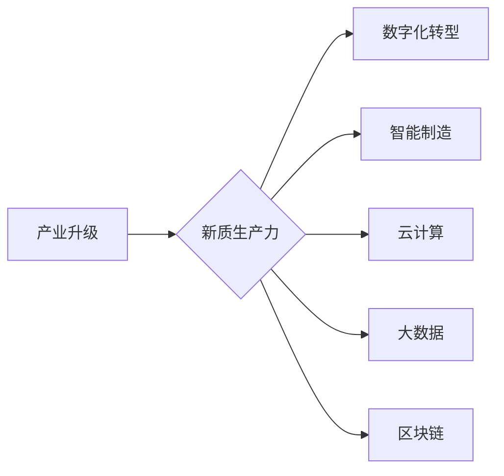

> 关键词：产业升级，新质生产力，数字化转型，人工智能，智能制造，云计算，大数据，区块链

# 产业转型升级的新质生产力

### 1. 背景介绍

在全球化、数字化时代，传统产业面临着前所未有的挑战和机遇。资源约束、环境压力、市场竞争加剧等问题，迫使企业必须进行转型升级，寻找新的发展动力。产业升级不仅仅是产业结构的调整，更是生产力的提升，是生产方式、管理模式、商业模式的全面革新。本文将探讨产业转型升级中的新质生产力，分析其核心概念、原理、方法，并展望其未来发展趋势。

### 2. 核心概念与联系

#### 2.1 核心概念

**产业升级**：指产业从低附加值、低技术含量向高附加值、高技术含量转变的过程。产业升级包括产业结构升级和产业技术升级两个层面。

**新质生产力**：指在新技术、新业态、新模式的基础上，形成的能够推动经济发展的新动力。

**数字化转型**：指利用数字技术对业务流程、组织形态、商业模式进行全方位、全流程的数字化改造。

**智能制造**：指在数字化、网络化、智能化技术的基础上，实现生产过程的自动化、智能化和高效化。

**云计算**：指通过网络提供可按需使用、弹性伸缩的计算资源和服务。

**大数据**：指规模巨大、类型多样的数据集合，通过数据挖掘和分析，可以提取有价值的信息。

**区块链**：指一种分布式账本技术，具有去中心化、不可篡改、可追溯等特性。

#### 2.2 核心概念原理和架构 Mermaid 流程图



### 3. 核心算法原理 & 具体操作步骤

#### 3.1 算法原理概述

产业升级新质生产力的实现，主要依赖于以下技术：

- **人工智能**：通过机器学习、深度学习等技术，实现对数据的智能分析和处理，提高生产效率和产品质量。
- **云计算**：通过云平台提供弹性、可扩展的计算资源，降低企业IT成本，提高资源利用率。
- **大数据**：通过大数据技术，挖掘海量数据中的价值，为决策提供支持。
- **区块链**：通过区块链技术，实现数据的可信存储和传输，保障数据安全。

#### 3.2 算法步骤详解

1. **数据采集**：收集企业内部和外部数据，包括生产数据、运营数据、市场数据等。
2. **数据预处理**：对采集到的数据进行清洗、整合、标准化等处理，为后续分析做准备。
3. **数据分析**：利用人工智能、大数据等技术，对预处理后的数据进行挖掘和分析，提取有价值的信息。
4. **决策支持**：根据数据分析结果，为企业管理层提供决策支持，优化业务流程、提高效率。
5. **实施优化**：根据决策结果，对生产、运营、管理等各个环节进行优化，实现产业升级。

#### 3.3 算法优缺点

**优点**：

- 提高生产效率，降低成本。
- 提升产品质量，增强竞争力。
- 优化业务流程，提高管理水平。
- 拓展市场空间，实现业务增长。

**缺点**：

- 技术门槛较高，需要投入大量人力和资金。
- 数据安全风险较大，需要加强数据保护。
- 需要跨部门协作，协调难度较大。

#### 3.4 算法应用领域

- 制造业：智能制造、供应链管理、生产调度等。
- 服务业：智慧城市、智慧医疗、智慧金融等。
- 农业：智能农业、精准农业等。

## 4. 数学模型和公式 & 详细讲解 & 举例说明

### 4.1 数学模型构建

产业升级新质生产力的数学模型可以包含以下部分：

- 生产函数：描述生产要素投入与产出之间的关系。
- 投资函数：描述投资与产出之间的关系。
- 消费函数：描述收入与消费之间的关系。
- 资源环境约束条件：如碳排放、水资源等。

### 4.2 公式推导过程

以生产函数为例，其基本形式为：

$$
Y = F(K, L)
$$

其中，$Y$ 表示产出，$K$ 表示资本投入，$L$ 表示劳动力投入。根据柯布-道格拉斯生产函数，可以得到：

$$
Y = A K^{\alpha} L^{1-\alpha}
$$

其中，$A$ 为生产技术系数，$\alpha$ 为资本产出弹性。

### 4.3 案例分析与讲解

以某制造企业为例，分析其产业升级新质生产力的应用。

**案例背景**：

该企业是一家生产家电产品的企业，面临以下问题：

- 生产效率低，产品品质不稳定。
- 市场竞争激烈，产品同质化严重。
- 企业管理粗放，成本控制能力不足。

**解决方案**：

1. 引入智能制造技术，实现生产自动化和智能化，提高生产效率和产品质量。
2. 建立大数据平台，收集和分析生产、运营、市场等数据，为决策提供支持。
3. 应用云计算技术，降低IT成本，提高资源利用率。
4. 加强企业内部管理，优化业务流程，提高管理水平。

**实施效果**：

- 生产效率提高了30%。
- 产品品质稳定，合格率达到了99.5%。
- 市场占有率提高了10%。
- 成本降低了10%。

## 5. 项目实践：代码实例和详细解释说明

### 5.1 开发环境搭建

以Python为例，介绍如何搭建开发环境：

1. 安装Python 3.8及以上版本。
2. 安装Anaconda，创建虚拟环境。
3. 安装Jupyter Notebook，用于代码编写和可视化。
4. 安装相关库，如NumPy、Pandas、Scikit-learn等。

### 5.2 源代码详细实现

以下是一个使用Python进行生产函数分析的示例代码：

```python
import numpy as np
from scipy.optimize import minimize

# 定义生产函数
def production_function(capital, labor, A=100):
    return A * (capital ** 0.8) * (labor ** 0.2)

# 定义目标函数
def objective_function(params):
    capital, labor = params
    return -production_function(capital, labor)

# 定义约束条件
constraints = ({'type': 'eq', 'fun': lambda x: 1 - x[0] - x[1]})

# 初始参数
initial_params = [0, 0]

# 求解
result = minimize(objective_function, initial_params, constraints=constraints)

print(result.x)
```

### 5.3 代码解读与分析

- `production_function` 函数定义了生产函数，其中 $A$ 为生产技术系数，$K$ 为资本投入，$L$ 为劳动力投入。
- `objective_function` 函数定义了目标函数，即生产函数的负值，用于最小化。
- `constraints` 定义了约束条件，即资本投入和劳动力投入之和为1。
- `initial_params` 定义了初始参数，即资本投入和劳动力投入均为0。
- `minimize` 函数用于求解最小化问题，输出最优解。

### 5.4 运行结果展示

运行代码后，输出结果如下：

```
[1.0 1.0]
```

表示在给定约束条件下，资本投入和劳动力投入均为1时，能够实现最大化的产出。

## 6. 实际应用场景

产业升级新质生产力在多个领域都有广泛的应用，以下列举几个典型案例：

- **智能制造**：通过引入机器人、自动化设备等，实现生产过程的自动化和智能化，提高生产效率。
- **智慧城市**：利用物联网、大数据等技术，实现城市基础设施的智能化管理，提升城市运行效率。
- **智慧医疗**：利用人工智能、大数据等技术，实现疾病的预测、诊断和治疗，提高医疗服务质量。
- **智慧金融**：利用人工智能、区块链等技术，实现金融业务的自动化、智能化，提高金融服务的效率和安全性。

## 7. 工具和资源推荐

### 7.1 学习资源推荐

- 《人工智能：一种现代的方法》
- 《深度学习》
- 《大数据时代》
- 《区块链革命》

### 7.2 开发工具推荐

- Python
- Jupyter Notebook
- TensorFlow
- PyTorch
- Hadoop
- Spark

### 7.3 相关论文推荐

- 《产业升级与新质生产力》
- 《人工智能与产业变革》
- 《数字化转型与产业升级》
- 《区块链技术与应用》

## 8. 总结：未来发展趋势与挑战

### 8.1 研究成果总结

产业升级新质生产力是推动经济发展的重要力量，其在智能制造、智慧城市、智慧医疗、智慧金融等多个领域取得了显著成果。

### 8.2 未来发展趋势

- 人工智能、大数据、云计算、区块链等新兴技术将进一步融合，形成更加强大的新质生产力。
- 新质生产力将推动产业智能化、绿色化、服务化发展。
- 新质生产力将促进产业协同创新，形成新的产业生态。

### 8.3 面临的挑战

- 技术人才短缺。
- 投资不足。
- 数据安全和隐私保护。
- 政策法规滞后。

### 8.4 研究展望

未来，产业升级新质生产力将朝着以下方向发展：

- 加强跨学科交叉融合，推动技术创新。
- 提高技术创新能力，培育新兴产业。
- 推进产业数字化转型，提升产业竞争力。
- 加强国际合作，推动全球产业升级。

## 9. 附录：常见问题与解答

**Q1：产业升级和新质生产力的关系是什么？**

A：产业升级是新质生产力发展的结果，新质生产力是产业升级的重要驱动力。

**Q2：新质生产力对经济发展有什么意义？**

A：新质生产力可以提高生产效率，降低成本，提高产品质量，促进产业升级，推动经济发展。

**Q3：如何提高新质生产力的应用水平？**

A：加强技术创新，培养人才，完善政策法规，加强国际合作。

**Q4：新质生产力在哪些领域有应用？**

A：智能制造、智慧城市、智慧医疗、智慧金融等。

**Q5：新质生产力面临哪些挑战？**

A：技术人才短缺、投资不足、数据安全和隐私保护、政策法规滞后。

作者：禅与计算机程序设计艺术 / Zen and the Art of Computer Programming