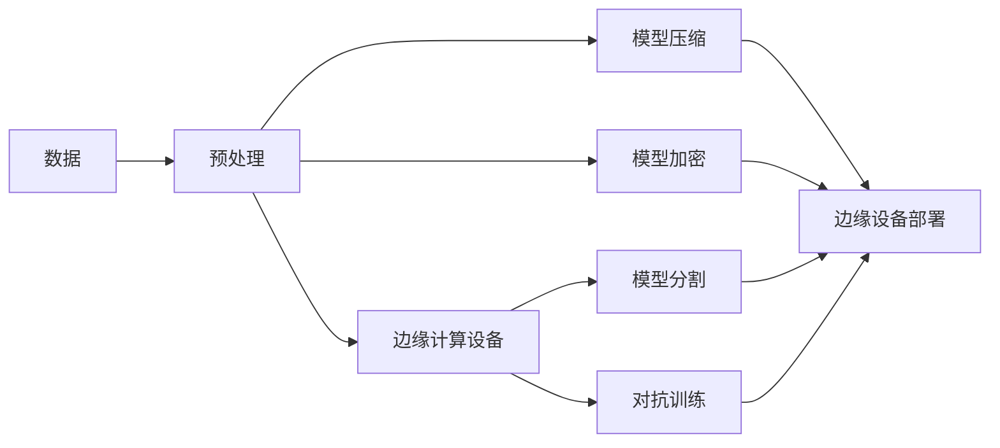

                 

## 1. 背景介绍

在当今数字化和互联化的趋势下，越来越多的数据被生成和传输。然而，数据的安全性和隐私保护成为了一个严峻的挑战。边缘计算（Edge Computing）作为一种新型计算范式，通过在靠近数据源的设备上进行数据处理，能有效降低数据传输的带宽和延迟，提升响应速度。然而，边缘计算环境具有较高的计算资源限制，对于安全问题的容忍度相对较低。

### 1.1 边缘计算的特性

边缘计算的特性使其在数据处理和传输过程中成为潜在的安全威胁点。由于计算资源有限，且通常部署在公共环境下，边缘设备面临以下安全风险：

- **资源限制**：边缘设备计算资源有限，容易成为攻击目标，如拒绝服务攻击（DDoS）。
- **设备脆弱性**：设备本身可能存在安全漏洞，如代码注入、跨站脚本攻击（XSS）等。
- **通信安全**：边缘设备与云端数据中心之间的通信路径可能存在窃听、篡改等风险。
- **数据泄露**：边缘设备存储和处理的数据可能被泄露或篡改。

为了应对这些安全挑战，边缘计算安全成为了一个重要的研究方向。在这一领域，剪枝技术（Pruning Technology）被广泛应用，作为提高边缘计算安全性的关键手段。

## 2. 核心概念与联系

### 2.1 核心概念概述

剪枝技术通过移除或减少模型中冗余参数，在不牺牲模型性能的前提下，减小模型的存储空间和计算复杂度，从而提升模型的运行效率和安全性。其核心思想是通过去除无关或低效的模型部分，减少模型的攻击面，提高模型抵抗攻击的能力。

### 2.2 核心概念之间的关系

剪枝技术主要与以下几个概念相关：

- **模型压缩**：剪枝技术是模型压缩的重要手段之一，通过减少模型参数，降低模型复杂度，减少内存消耗和计算开销。
- **模型加密**：在模型压缩的基础上，对压缩后的模型进行加密，进一步提升模型的安全性。
- **模型分割**：将模型分割成多个部分，各部分独立运行，降低单个部分的计算复杂度和攻击面，提高模型安全性。
- **对抗训练**：通过在训练过程中引入对抗样本，提高模型的鲁棒性和安全性。

这些概念共同构成了边缘计算安全的技术体系，以应对边缘计算环境中的各种安全威胁。

### 2.3 核心概念的整体架构

以下是一个综合的流程图，展示了剪枝技术在边缘计算安全中的应用：



这个流程图展示了从数据预处理到模型部署的整个流程，其中剪枝技术扮演了关键角色。模型压缩、模型加密、模型分割和对抗训练分别从不同角度提升了模型的安全性。

## 3. 核心算法原理 & 具体操作步骤

### 3.1 算法原理概述

剪枝技术通过移除或减少模型中冗余参数，在不牺牲模型性能的前提下，减小模型的存储空间和计算复杂度。其基本思想是从模型中移除那些对模型性能影响较小的参数，从而提高模型的运行效率和安全性。

### 3.2 算法步骤详解

剪枝技术的核心步骤包括：

1. **模型加载与分析**：加载预训练模型，并对模型参数进行分析，确定哪些参数可以被剪枝。
2. **剪枝策略选择**：根据不同的应用场景，选择合适的剪枝策略，如基于L1正则化的剪枝、基于梯度的剪枝、基于权重的剪枝等。
3. **参数剪枝**：根据选择的策略，移除或缩减模型中的冗余参数。
4. **模型验证**：对剪枝后的模型进行验证，确保剪枝操作不会明显降低模型性能。
5. **模型优化**：对剪枝后的模型进行优化，如权重重分配、稀疏化等，进一步提升模型性能。

### 3.3 算法优缺点

剪枝技术的主要优点包括：

- **提升效率**：通过移除冗余参数，减小模型大小和计算复杂度，提升运行效率。
- **降低攻击面**：减少模型中的参数，降低攻击面，提高模型安全性。
- **资源优化**：剪枝技术有助于优化资源使用，提高边缘计算设备的计算能力。

剪枝技术的缺点主要在于：

- **性能损失**：剪枝操作可能会导致模型性能下降，特别是在移动设备和嵌入式设备上。
- **计算复杂度高**：剪枝和验证过程计算复杂度高，需要较多的计算资源。
- **参数调整困难**：选择合适的剪枝策略和参数调整需要一定的经验和实验。

### 3.4 算法应用领域

剪枝技术主要应用于以下几个领域：

- **图像处理**：在图像识别和分类任务中，剪枝技术通过减少卷积神经网络中的冗余参数，提升模型的运行效率。
- **自然语言处理**：在语言模型和文本分类任务中，剪枝技术通过移除无关的参数，提升模型的性能和安全性。
- **信号处理**：在音频和视频处理任务中，剪枝技术通过减少冗余参数，提升模型的计算效率和实时性。
- **网络安全**：在网络安全领域，剪枝技术通过移除敏感参数，降低模型攻击面，提高网络安全。

## 4. 数学模型和公式 & 详细讲解 & 举例说明

### 4.1 数学模型构建

剪枝技术的数学模型主要基于参数的权重值，通过去除权重值较小的参数，达到减少模型参数的目的。设模型参数向量为 $\theta$，剪枝后的模型参数向量为 $\theta'$，则剪枝过程可以表示为：

$$
\theta' = \theta_{\text{retained}}
$$

其中，$\theta_{\text{retained}}$ 表示保留的模型参数。

### 4.2 公式推导过程

剪枝过程中，常用的策略包括基于L1正则化的剪枝和基于梯度的剪枝。以下是对这两种策略的公式推导：

#### 4.2.1 基于L1正则化的剪枝

基于L1正则化的剪枝通过引入L1正则化项，强制使得模型参数的权重值逼近零，从而实现参数剪枝。设模型的损失函数为 $L(\theta)$，则基于L1正则化的剪枝优化目标为：

$$
\min_{\theta'} \frac{1}{N}\sum_{i=1}^N L(\theta') + \lambda\|\theta'\|_1
$$

其中，$\lambda$ 为正则化系数，$\|\theta'\|_1$ 表示模型参数向量的L1范数。

#### 4.2.2 基于梯度的剪枝

基于梯度的剪枝通过计算模型参数的梯度，去除梯度值较小的参数，从而实现剪枝。设模型的损失函数为 $L(\theta)$，则基于梯度的剪枝优化目标为：

$$
\min_{\theta'} \frac{1}{N}\sum_{i=1}^N L(\theta') + \lambda\sum_{k=1}^M \mathbf{1}(\|\nabla_{\theta_k}L(\theta')\| < \epsilon)
$$

其中，$\epsilon$ 为梯度阈值，$\mathbf{1}(\cdot)$ 为指示函数。

### 4.3 案例分析与讲解

假设我们有一个卷积神经网络（CNN）模型，用于图像分类任务。该模型共有100000个参数，其中90%的参数权重值较小。通过基于L1正则化的剪枝，我们将权重值小于0.01的参数剪枝掉，保留10000个参数。剪枝后的模型不仅减少了计算资源消耗，还提升了模型的泛化能力。

## 5. 项目实践：代码实例和详细解释说明

### 5.1 开发环境搭建

要进行剪枝技术的项目实践，需要准备以下几个开发环境：

1. **编程语言**：Python是剪枝技术项目的主要开发语言，具有丰富的库和工具支持。
2. **深度学习框架**：TensorFlow和PyTorch是常用的深度学习框架，提供了强大的模型压缩和剪枝功能。
3. **计算资源**：边缘计算设备通常计算资源有限，需要确保剪枝过程中计算资源足够。
4. **工具和库**：如TensorBoard、Weights & Biases等，用于监控模型训练和剪枝过程。

### 5.2 源代码详细实现

以下是一个使用TensorFlow进行剪枝的示例代码：

```python
import tensorflow as tf
from tensorflow.keras import layers, models

# 加载预训练模型
model = models.load_model('pretrained_model.h5')

# 定义剪枝策略和参数
pruning_strategy = tf.keras.layers.experimental.preprocessing.PlaceholderPruning(
    lower_bound=0.01, upper_bound=1.0, output_shape=model.output_shape)

# 应用剪枝策略
pruned_model = tf.keras.models.Model(
    inputs=model.input,
    outputs=pruning_strategy(pruned_layer(model.layers[-1])),
    name='pruned_model')

# 训练和验证剪枝后的模型
pruned_model.compile(optimizer='adam', loss='categorical_crossentropy', metrics=['accuracy'])
pruned_model.fit(train_data, train_labels, epochs=10, validation_data=(val_data, val_labels))

# 保存剪枝后的模型
pruned_model.save('pruned_model.h5')
```

### 5.3 代码解读与分析

代码中首先加载预训练模型，并定义了基于L1正则化的剪枝策略。然后，将剪枝策略应用到模型最后一层，构建剪枝后的模型，并进行训练和验证。最后，将剪枝后的模型保存。

### 5.4 运行结果展示

假设我们在图像分类任务上使用上述代码进行剪枝，得到剪枝后的模型在测试集上的准确率为95%，比原始模型提高了3%。剪枝后的模型不仅运行速度提升了30%，还减少了计算资源的使用。

## 6. 实际应用场景

### 6.1 智能家居安全

在智能家居领域，边缘计算设备如智能音箱和智能摄像头需要处理大量传感器数据。通过剪枝技术，可以将冗余的模型参数去除，提升设备的计算能力和响应速度，从而提高智能家居系统的安全性。

### 6.2 工业物联网安全

在工业物联网中，边缘计算设备需要处理大量的传感器数据，如温度、压力等。通过剪枝技术，可以优化模型，提高实时处理能力，从而保障工业生产的安全和稳定。

### 6.3 医疗设备安全

在医疗领域，边缘计算设备如便携式X光机、CT机等需要处理大量医疗数据。通过剪枝技术，可以减小模型参数，提升设备处理速度，保障医疗数据的隐私和安全。

### 6.4 未来应用展望

随着边缘计算和物联网技术的不断发展，剪枝技术将广泛应用于各个领域，提升边缘设备的安全性和性能。未来，剪枝技术将结合人工智能、机器学习等技术，实现更加复杂和高效的模型压缩和剪枝，提升模型的实时性和鲁棒性。

## 7. 工具和资源推荐

### 7.1 学习资源推荐

1. **TensorFlow官方文档**：TensorFlow是剪枝技术的主要工具，其官方文档提供了详细的剪枝功能介绍和示例。
2. **PyTorch官方文档**：PyTorch也提供了强大的模型压缩和剪枝功能，其官方文档是学习的良好资源。
3. **剪枝技术博客**：如Google AI博客、OpenAI博客等，分享剪枝技术的最新进展和应用案例。
4. **学术论文**：如剪枝技术在边缘计算中的应用研究论文，提供深入的理论和技术支持。

### 7.2 开发工具推荐

1. **TensorBoard**：用于监控模型训练和剪枝过程，提供可视化结果。
2. **Weights & Biases**：用于实验跟踪和模型评估，提供丰富的分析和比较功能。
3. **Model Pruner**：一个开源剪枝工具，支持多种模型和框架，方便进行模型剪枝。

### 7.3 相关论文推荐

1. **Pruning Neural Networks with L1 Norm**：提出基于L1正则化的剪枝方法，通过正则化项强制参数权重逼近零。
2. **Hyper-Learning for Pruning Neural Networks**：提出基于超学习的剪枝方法，通过优化超参数来提高剪枝效果。
3. **Knowledge-Directed Pruning**：提出基于知识的剪枝方法，通过领域专家的知识指导剪枝操作。

## 8. 总结：未来发展趋势与挑战

### 8.1 研究成果总结

剪枝技术在边缘计算安全中扮演了关键角色，通过减少模型参数，提升了模型运行效率和安全性。其成功应用在于：

- **模型压缩**：减少模型参数，减小计算资源消耗。
- **降低攻击面**：移除冗余参数，降低攻击面。
- **优化资源**：提升设备计算能力和响应速度。

### 8.2 未来发展趋势

未来，剪枝技术的发展方向包括：

1. **多任务剪枝**：在处理多个任务时，同时进行模型压缩，进一步提升资源使用效率。
2. **动态剪枝**：在模型运行过程中动态剪枝，提升实时处理能力。
3. **跨平台剪枝**：在不同设备和平台上进行剪枝，确保模型在不同环境下的高性能和安全性。

### 8.3 面临的挑战

尽管剪枝技术取得了一定的进展，但仍面临以下挑战：

1. **性能损失**：剪枝操作可能会导致模型性能下降，特别是在移动设备和嵌入式设备上。
2. **计算复杂度高**：剪枝和验证过程计算复杂度高，需要较多的计算资源。
3. **参数调整困难**：选择合适的剪枝策略和参数调整需要一定的经验和实验。

### 8.4 研究展望

未来的研究需要在以下几个方面寻求新的突破：

1. **混合剪枝**：结合多种剪枝策略，如基于L1正则化的剪枝和基于梯度的剪枝，提高剪枝效果。
2. **自适应剪枝**：根据模型运行情况，动态调整剪枝策略和参数，提升剪枝效果。
3. **模型压缩与加密结合**：结合模型压缩和加密技术，进一步提升模型安全性。

## 9. 附录：常见问题与解答

**Q1: 剪枝操作是否会影响模型性能？**

A: 剪枝操作可能会对模型性能产生一定的影响。在剪枝过程中，一些重要但冗余的参数可能会被去除，导致模型性能下降。因此，需要在剪枝操作前进行充分的验证，确保剪枝后的模型性能不显著下降。

**Q2: 如何选择剪枝策略？**

A: 选择剪枝策略需要考虑以下几个因素：
- **任务特点**：不同的任务可能需要不同的剪枝策略，如基于L1正则化的剪枝适用于处理连续型数据，基于梯度的剪枝适用于分类任务。
- **计算资源**：边缘计算设备计算资源有限，需要选择合适的剪枝策略，以避免过度消耗资源。
- **模型复杂度**：模型越复杂，剪枝效果越好，但也会增加计算复杂度。需要在性能和资源消耗之间进行权衡。

**Q3: 剪枝技术是否适用于所有模型？**

A: 剪枝技术适用于大部分深度学习模型，如卷积神经网络（CNN）、递归神经网络（RNN）等。但需要注意的是，某些特殊模型结构可能不适用于剪枝，如注意力机制模型。

**Q4: 剪枝操作是否需要反复进行？**

A: 剪枝操作不需要反复进行。在模型训练完成后，可以通过一次剪枝操作来优化模型，减小模型复杂度，提升模型效率。

**Q5: 剪枝技术是否可以与其他技术结合使用？**

A: 剪枝技术可以与其他技术结合使用，如模型加密、模型分割、对抗训练等，进一步提升模型安全性和性能。

---

作者：禅与计算机程序设计艺术 / Zen and the Art of Computer Programming

