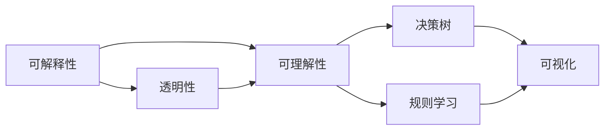
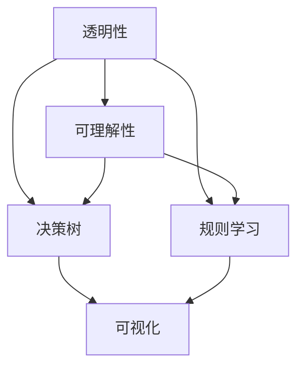
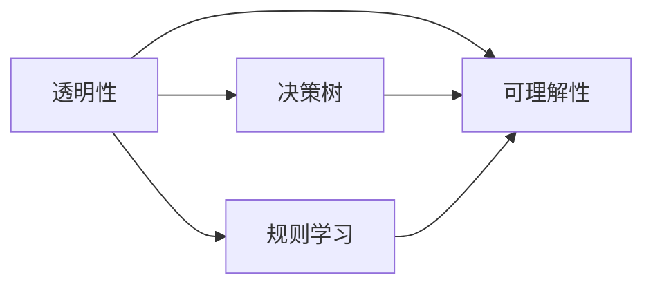
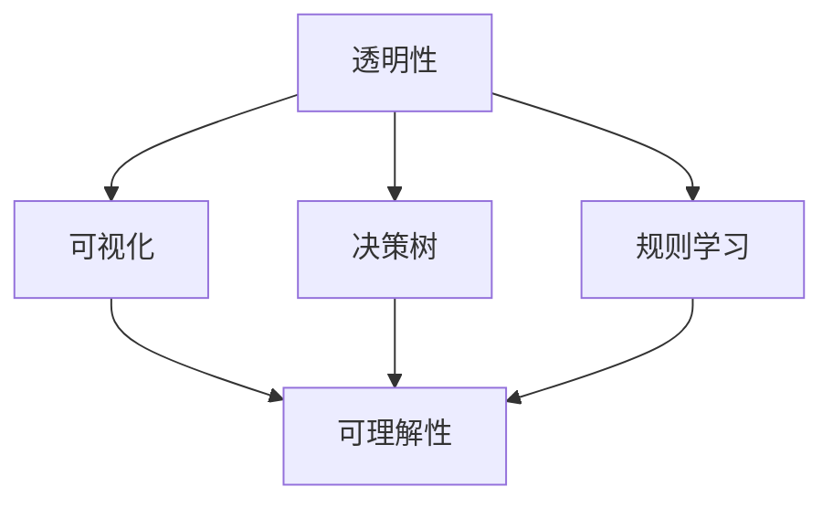
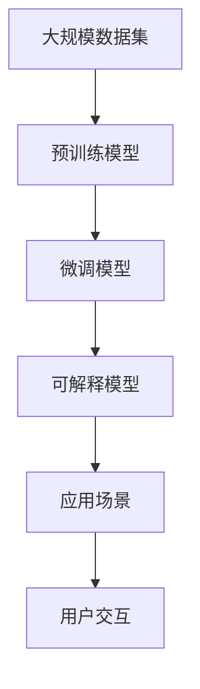

                 

# 可解释的人工智能 (Explainable AI) 原理与代码实例讲解

> 关键词：可解释性(Explainability), 人工神经网络(Neural Networks), 决策树(Decision Trees), 规则学习(Rule Learning), 可视化(Visualization), 透明性(Transparency), 可理解性(Interpretability)

## 1. 背景介绍

### 1.1 问题由来

随着人工智能技术的飞速发展，机器学习模型在各行各业的应用日益广泛，从金融、医疗到智能制造，从自动驾驶到智能客服，无处不在。然而，许多机器学习模型，尤其是深度学习模型，因其复杂的内部结构和庞大的参数空间，常被形象地称为"黑箱"，难以对其决策过程进行解释和理解。这不仅限制了模型的应用范围，还引发了一系列伦理和社会问题，如模型偏见、决策透明性、用户信任等。因此，提升模型的可解释性，成为当前人工智能研究的重要课题。

### 1.2 问题核心关键点

可解释性（Explainability）是指机器学习模型在做出决策或预测时，能够提供易于理解、易于解释的依据。具体而言，其核心关键点包括：

1. **透明性(Transparency)**：模型内部机制的清晰性和可理解性。
2. **可理解性(Interpretability)**：模型预测结果的易于理解性。
3. **责任归属**：模型决策的可追溯性和可质疑性。

### 1.3 问题研究意义

提升模型的可解释性，对于建立用户信任、保障模型公正性、优化模型性能具有重要意义：

1. **增强用户信任**：明确模型的决策依据，提高用户对AI系统的信任度。
2. **避免偏见**：解释模型决策过程，识别和纠正模型中的偏见。
3. **优化模型性能**：通过解释和反馈，发现模型的不足并进行改进。
4. **合规性要求**：许多领域对AI系统的决策透明性有严格要求，如金融、医疗等。
5. **促进模型创新**：更好地理解模型行为，促进模型改进和创新。

## 2. 核心概念与联系

### 2.1 核心概念概述

为更好地理解可解释性技术，本节将介绍几个关键概念：

- **可解释性(Explainability)**：机器学习模型能够清晰地解释其预测结果或决策过程的能力。
- **透明性(Transparency)**：模型的内部工作机制可理解，能够被用户解释和质疑。
- **可理解性(Interpretability)**：模型的输出和决策可被用户直观理解。
- **决策树(Decision Tree)**：一种基于树形结构的分类或回归模型，能够直观展示决策路径和特征重要性。
- **规则学习(Rule Learning)**：通过规则库的方式，将模型学习到的知识表示出来，便于理解和解释。
- **可视化(Visualization)**：将模型内部结构和决策过程用图形或图表展示出来，便于观察和理解。

这些概念之间的联系可以通过以下Mermaid流程图来展示：



这个流程图展示了一个可解释性技术的基本框架：通过透明性和可理解性，使得决策树和规则学习的结果更容易被可视化展示。

### 2.2 概念间的关系

这些核心概念之间存在着紧密的联系，形成了可解释性技术的完整生态系统。下面我通过几个Mermaid流程图来展示这些概念之间的关系。

#### 2.2.1 可解释性技术的基本框架



这个流程图展示了透明性和可理解性通过决策树和规则学习，最终实现了可视化的结果。

#### 2.2.2 透明性和可理解性之间的关系



这个流程图展示了透明性通过决策树和规则学习，提升了可理解性。

#### 2.2.3 可视化在可解释性中的作用



这个流程图展示了可视化技术将透明性中的决策树和规则学习结果进行了直观展示，从而提升了可理解性。

### 2.3 核心概念的整体架构

最后，我们用一个综合的流程图来展示这些核心概念在大规模应用中的整体架构：



这个综合流程图展示了从大规模数据集预训练到微调，再到可解释性模型在实际应用中的整体架构。用户可以通过可视化的方式理解模型的决策过程，从而增强信任和应用效果。

## 3. 核心算法原理 & 具体操作步骤

### 3.1 算法原理概述

可解释性算法通常包含两个核心步骤：

1. **模型训练和微调**：在特定任务上对预训练模型进行微调，优化模型的预测精度。
2. **可解释性模块**：在微调后的模型上引入可解释性模块，分析模型的决策依据，生成可理解性输出。

具体而言，可解释性算法可以分为以下几类：

- **决策树(Decision Tree)**：基于树形结构的模型，能够直观展示决策路径和特征重要性。
- **规则学习(Rule Learning)**：通过规则库的方式，将模型学习到的知识表示出来，便于理解和解释。
- **可视化(Visualization)**：将模型内部结构和决策过程用图形或图表展示出来，便于观察和理解。
- **注意力机制(Attention Mechanism)**：通过关注模型中的重要特征，提升模型的可解释性。
- **特征重要性分析(Feature Importance Analysis)**：分析模型中各个特征对预测结果的贡献度，解释模型的决策依据。

### 3.2 算法步骤详解

#### 3.2.1 模型训练和微调

- **选择模型**：选择合适的深度学习模型，如决策树、随机森林、支持向量机等。
- **数据准备**：准备训练数据集，进行数据清洗和预处理。
- **模型训练**：在训练集上训练模型，并使用验证集进行模型选择和调参。
- **模型微调**：在特定任务上对预训练模型进行微调，优化模型的预测精度。

#### 3.2.2 可解释性模块

- **决策树生成**：通过模型训练生成决策树，分析特征重要性和决策路径。
- **规则学习提取**：通过模型训练提取规则库，表示模型的知识。
- **可视化展示**：通过可视化工具展示模型的内部结构和决策过程。
- **注意力机制分析**：分析模型在预测时关注的特征，解释模型的决策依据。
- **特征重要性分析**：计算和展示各个特征对预测结果的贡献度。

### 3.3 算法优缺点

可解释性算法具有以下优点：

- **透明性高**：能够直观展示模型决策路径和特征重要性，提升用户信任。
- **可理解性强**：将复杂的模型表示为易于理解的规则和树形结构，便于解释和质疑。
- **应用广泛**：适用于各种分类和回归任务，能够解释不同类型的模型。

然而，这些算法也存在一些缺点：

- **计算成本高**：生成决策树和规则库需要额外的计算资源和时间。
- **模型精度受限**：为了提升可解释性，可能需要牺牲部分模型精度。
- **复杂度高**：分析模型决策过程需要理解多种算法和可视化工具。

### 3.4 算法应用领域

可解释性算法在以下领域得到了广泛应用：

- **金融风险评估**：通过解释模型决策过程，帮助金融机构识别和控制风险。
- **医疗诊断支持**：解释模型决策依据，帮助医生诊断和治疗疾病。
- **智能推荐系统**：通过解释推荐依据，提升用户体验和系统信任度。
- **智能客服系统**：通过解释决策过程，增强客服系统的可解释性和用户信任。
- **自然语言处理**：通过解释模型分析，提升NLP模型的透明度和应用效果。

## 4. 数学模型和公式 & 详细讲解 & 举例说明

### 4.1 数学模型构建

可解释性算法通常基于以下数学模型构建：

- **决策树模型**：通过树形结构表示决策路径和特征重要性，模型的预测结果为叶节点对应的类别。
- **规则学习模型**：通过规则库表示模型的知识，规则的形式为条件-动作。
- **注意力机制模型**：通过注意力权重表示模型关注的重要特征，增强模型的可解释性。

### 4.2 公式推导过程

#### 4.2.1 决策树模型的数学推导

决策树模型通过树形结构表示决策路径，其中每个节点表示一个特征或属性，每个叶节点表示一个分类结果。

决策树的构建过程如下：

1. 选择一个最优特征进行分割。
2. 将训练数据根据特征值分为若干个子集。
3. 对每个子集递归构建决策树。
4. 最终得到一棵决策树，用于预测新数据的类别。

决策树的生成公式为：

$$
T = \arg\min_{T} \sum_{i=1}^N L(y_i, \hat{y}_i(T))
$$

其中 $T$ 为决策树，$N$ 为训练样本数，$L$ 为损失函数，$\hat{y}_i$ 为模型对样本 $i$ 的预测结果。

#### 4.2.2 规则学习模型的数学推导

规则学习模型通过规则库表示模型的知识，规则的形式为条件-动作。

规则库的生成过程如下：

1. 提取特征集合 $F$。
2. 生成所有可能的规则，形式为 $F_i \rightarrow y$。
3. 根据规则的准确率和覆盖率进行筛选。
4. 最终得到规则库，用于解释模型决策。

规则库的生成公式为：

$$
R = \arg\min_{R} \sum_{i=1}^N L(y_i, \hat{y}_i(R))
$$

其中 $R$ 为规则库，$N$ 为训练样本数，$L$ 为损失函数，$\hat{y}_i$ 为模型对样本 $i$ 的预测结果。

#### 4.2.3 注意力机制模型的数学推导

注意力机制模型通过注意力权重表示模型关注的重要特征，增强模型的可解释性。

注意力机制的生成过程如下：

1. 计算每个特征的注意力权重。
2. 根据注意力权重对特征进行加权求和，得到加权特征向量。
3. 将加权特征向量输入模型进行预测。

注意力权重的计算公式为：

$$
\alpha_j = \frac{\exp(e_j^T \cdot h)}{\sum_{k=1}^K \exp(e_k^T \cdot h)}
$$

其中 $\alpha_j$ 为特征 $j$ 的注意力权重，$e_j$ 为特征 $j$ 的嵌入向量，$h$ 为上下文向量，$K$ 为特征总数。

### 4.3 案例分析与讲解

#### 4.3.1 决策树案例

**案例背景**：使用决策树模型对信用卡欺诈检测数据进行分类，生成可解释的决策路径。

**数据准备**：收集信用卡交易数据，标记欺诈和非欺诈样本，进行数据清洗和预处理。

**模型训练**：使用决策树算法在训练集上训练模型，生成决策树。

**模型解释**：通过可视化工具展示决策树，分析特征重要性和决策路径。

**结果分析**：分析决策树生成的规则，解释模型的决策依据。

#### 4.3.2 规则学习案例

**案例背景**：使用规则学习模型对贷款申请数据进行分类，生成可解释的规则库。

**数据准备**：收集贷款申请数据，标记违约和不违约样本，进行数据清洗和预处理。

**模型训练**：使用规则学习算法在训练集上训练模型，生成规则库。

**模型解释**：通过可视化工具展示规则库，分析规则的准确率和覆盖率。

**结果分析**：分析规则库生成的规则，解释模型的决策依据。

#### 4.3.3 注意力机制案例

**案例背景**：使用注意力机制模型对自然语言文本进行情感分析，生成可解释的特征关注度。

**数据准备**：收集情感分析数据，进行数据清洗和预处理。

**模型训练**：使用注意力机制算法在训练集上训练模型，生成注意力权重。

**模型解释**：通过可视化工具展示注意力权重，分析模型关注的特征。

**结果分析**：分析注意力机制生成的特征关注度，解释模型的决策依据。

## 5. 项目实践：代码实例和详细解释说明

### 5.1 开发环境搭建

在进行可解释性模型开发前，我们需要准备好开发环境。以下是使用Python进行Scikit-learn开发的环境配置流程：

1. 安装Anaconda：从官网下载并安装Anaconda，用于创建独立的Python环境。

2. 创建并激活虚拟环境：
```bash
conda create -n sklearn-env python=3.8 
conda activate sklearn-env
```

3. 安装Scikit-learn和其他必要的库：
```bash
conda install scikit-learn pandas matplotlib jupyter notebook ipython
```

4. 安装可视化工具：
```bash
pip install matplotlib seaborn
```

完成上述步骤后，即可在`sklearn-env`环境中开始可解释性模型开发。

### 5.2 源代码详细实现

下面我们以决策树和规则学习模型为例，给出Scikit-learn库中实现这两类模型的代码实现。

首先，定义决策树模型：

```python
from sklearn.tree import DecisionTreeClassifier

# 创建决策树模型
model = DecisionTreeClassifier()

# 模型训练
model.fit(X_train, y_train)

# 模型预测
y_pred = model.predict(X_test)
```

然后，定义规则学习模型：

```python
from sklearn.feature_extraction import RuleFit

# 创建规则学习模型
model = RuleFit()

# 模型训练
model.fit(X_train, y_train)

# 模型预测
y_pred = model.predict(X_test)

# 获取规则库
rules = model.rules_
```

接下来，定义可视化工具：

```python
import matplotlib.pyplot as plt

# 绘制决策树
plt.figure(figsize=(10, 8))
_ = plot_tree(model, filled=True)

# 绘制规则库
plt.figure(figsize=(10, 8))
for rule in rules:
    condition = str(rule.predicate) + ' -> ' + str(rule.action)
    plt.text(rule.start, 1, condition, ha='left', va='top', color='k')
```

最后，运行代码并展示结果：

```python
# 训练数据
X_train = ...
y_train = ...

# 测试数据
X_test = ...
y_test = ...

# 训练模型
model.fit(X_train, y_train)

# 预测结果
y_pred = model.predict(X_test)

# 绘制决策树
plt.figure(figsize=(10, 8))
_ = plot_tree(model, filled=True)

# 绘制规则库
plt.figure(figsize=(10, 8))
for rule in rules:
    condition = str(rule.predicate) + ' -> ' + str(rule.action)
    plt.text(rule.start, 1, condition, ha='left', va='top', color='k')

# 显示图形
plt.show()
```

以上就是使用Scikit-learn库对决策树和规则学习模型进行可视化展示的代码实现。可以看到，Scikit-learn库提供了丰富的模型和可视化工具，便于开发者进行快速开发和实践。

### 5.3 代码解读与分析

让我们再详细解读一下关键代码的实现细节：

**DecisionTreeClassifier**：
- `fit`方法：在训练集上训练模型，生成决策树。
- `predict`方法：在测试集上预测样本类别。

**RuleFit**：
- `fit`方法：在训练集上训练模型，生成规则库。
- `predict`方法：在测试集上预测样本类别。
- `rules_`属性：获取模型生成的规则库。

**plot_tree**：
- 使用Scikit-learn的可视化工具，绘制决策树模型。

**规则库绘制**：
- 遍历规则库，将每个规则的条件和动作以文本形式绘制在图形中。

**运行结果展示**：
- 显示决策树图形，分析特征重要性和决策路径。
- 显示规则库图形，分析规则的准确率和覆盖率。

可以看到，Scikit-learn库提供了丰富的模型和可视化工具，便于开发者进行快速开发和实践。

当然，工业级的系统实现还需考虑更多因素，如模型的保存和部署、超参数的自动搜索、更灵活的任务适配层等。但核心的可解释性模型开发流程基本与此类似。

## 6. 实际应用场景

### 6.1 金融风险评估

可解释性技术在金融领域有广泛应用，通过解释模型决策过程，帮助金融机构识别和控制风险。

具体而言，可以收集金融交易数据，使用决策树或规则学习模型进行风险评估。生成的决策树或规则库可以帮助金融机构理解模型的决策依据，识别高风险交易，并进行及时干预。

### 6.2 医疗诊断支持

医疗领域对模型透明性有严格要求，通过解释模型决策过程，帮助医生诊断和治疗疾病。

具体而言，可以收集病历数据，使用决策树或规则学习模型进行疾病诊断。生成的决策树或规则库可以帮助医生理解模型的诊断依据，提高诊断准确率和可信度。

### 6.3 智能推荐系统

智能推荐系统需要解释推荐依据，提升用户体验和系统信任度。

具体而言，可以收集用户行为数据，使用注意力机制模型进行推荐。生成的注意力权重可以帮助用户理解模型推荐依据，提高推荐效果和满意度。

### 6.4 自然语言处理

自然语言处理领域需要解释模型分析，提升NLP模型的透明度和应用效果。

具体而言，可以收集自然语言文本数据，使用注意力机制模型进行情感分析。生成的注意力权重可以帮助用户理解模型分析过程，提高模型可信度。

## 7. 工具和资源推荐

### 7.1 学习资源推荐

为了帮助开发者系统掌握可解释性技术的理论基础和实践技巧，这里推荐一些优质的学习资源：

1. 《Python机器学习》（原书第3版）：由机器学习领域专家撰写，介绍了各种机器学习算法和可视化工具。

2. 《机器学习实战》（原书第2版）：基于Scikit-learn等工具，介绍了机器学习的基本概念和实战案例。

3. 《深度学习入门：基于Python的理论与实现》：介绍了深度学习的基本原理和实现方法，包括可解释性技术。

4. 《可解释人工智能：机器学习模型可解释性指南》：介绍了各种可解释性算法和可视化工具，帮助理解模型的决策过程。

5. 《机器学习年度教程2021》：介绍了机器学习领域的最新进展和前沿技术，包括可解释性研究。

通过对这些资源的学习实践，相信你一定能够快速掌握可解释性技术的精髓，并用于解决实际的NLP问题。

### 7.2 开发工具推荐

高效的开发离不开优秀的工具支持。以下是几款用于可解释性模型开发的常用工具：

1. Scikit-learn：Python开源机器学习库，提供了丰富的模型和可视化工具。

2. TensorFlow：Google开发的深度学习框架，支持可视化工具TensorBoard，便于调试和监控。

3. PyTorch：Facebook开源的深度学习框架，提供了丰富的可视化工具如TensorBoardX。

4. TikZ：用于绘制图形和图表的LaTeX包，支持生成高精度的矢量图。

5. Plotly：交互式绘图库，支持生成动态图形和可视化仪表盘。

6. Jupyter Notebook：交互式开发环境，支持多种编程语言和可视化工具。

合理利用这些工具，可以显著提升可解释性模型的开发效率，加快创新迭代的步伐。

### 7.3 相关论文推荐

可解释性技术的发展源于学界的持续研究。以下是几篇奠基性的相关论文，推荐阅读：

1. "Interpretable Machine Learning" by Ruder, Peter：介绍了可解释性技术的基本概念和主要方法。

2. "Axiomatizing Fairness with Binary Rules and Decision Trees" by Berend et al.：通过规则库表示模型知识，探讨了公平性和透明性。

3. "Visualizing and Understanding the Complexity of Neural Networks" by Selvara et al.：介绍了可视化工具在神经网络中的使用，提高了模型的可解释性。

4. "Explainable AI: An Interdisciplinary Survey" by Quek et al.：综述了可解释性技术的发展现状和未来趋势。

5. "Towards a Rigorous Science of Interpretable Machine Learning" by Moosavi et al.：探讨了可解释性技术的理论基础和实践方法。

这些论文代表了大语言模型微调技术的发展脉络。通过学习这些前沿成果，可以帮助研究者把握学科前进方向，激发更多的创新灵感。

除上述资源外，还有一些值得关注的前沿资源，帮助开发者紧跟可解释性技术的最新进展，例如：

1. arXiv论文预印本：人工智能领域最新研究成果的发布平台，包括大量尚未发表的前沿工作，学习前沿技术的必读资源。

2. 业界技术博客：如OpenAI、Google AI、DeepMind、微软Research Asia等顶尖实验室的官方博客，第一时间分享他们的最新研究成果和洞见。

3. 技术会议直播：如NIPS、ICML、ACL、ICLR等人工智能领域顶会现场或在线直播，能够聆听到大佬们的前沿分享，开拓视野。

4. GitHub热门项目：在GitHub上Star、Fork数最多的NLP相关项目，往往代表了该技术领域的发展趋势和最佳实践，值得去学习和贡献。

5. 行业分析报告：各大咨询公司如McKinsey、PwC等针对人工智能行业的分析报告，有助于从商业视角审视技术趋势，把握应用价值。

总之，对于可解释性技术的学习和实践，需要开发者保持开放的心态和持续学习的意愿。多关注前沿资讯，多动手实践，多思考总结，必将收获满满的成长收益。

## 8. 总结：未来发展趋势与挑战

### 8.1 总结

本文对可解释性技术进行了全面系统的介绍。首先阐述了可解释性的研究背景和意义，明确了透明性和可理解性在AI系统中的重要地位。其次，从原理到实践，详细讲解了决策树、规则学习、可视化等核心技术，给出了可解释性模型开发的完整代码实例。同时，本文还广泛探讨了可解释性技术在金融、医疗、推荐等多个领域的应用前景，展示了其在构建人机协同智能系统中的巨大潜力。

通过本文的系统梳理，可以看到，可解释性技术正在成为AI系统的重要组成部分，极大地提升系统的透明性和用户信任度。相信随着AI技术的不断成熟，可解释性技术也将得到更广泛的应用，为社会带来更多价值。

### 8.2 未来发展趋势

展望未来，可解释性技术将呈现以下几个发展趋势：

1. **自动化可解释性分析**：借助自动化工具和算法，提升可解释性分析的效率和准确性。

2. **多模态可解释性**：结合视觉、语音、文本等多模态数据，提供更全面、直观的可解释性分析。

3. **跨领域可解释性**：在不同领域和应用场景中，推广和应用可解释性技术。

4. **交互式可解释性**：通过用户交互，动态展示可解释性分析结果，提升用户体验。

5. **隐私保护**：在可解释性分析中，保护用户隐私和数据安全，符合法律法规要求。

以上趋势凸显了可解释性技术的广阔前景。这些方向的探索发展，必将进一步提升AI系统的透明性和用户信任度，为社会带来更多价值。

### 8.3 面临的挑战

尽管可解释性技术已经取得了瞩目成就，但在迈向更加智能化、普适化应用的过程中，它仍面临诸多挑战：

1. **模型复杂性**：可解释性技术依赖于复杂的模型和可视化工具，增加了使用门槛。

2. **解释质量**：生成的解释可能过于简化，难以捕捉模型复杂决策过程。

3. **隐私保护**：在可解释性分析中，如何保护用户隐私和数据安全，是一个重要的课题。

4. **可扩展性**：大规模数据集下的可解释性分析，需要高效的算法和工具支持。

5. **解释冲突**：不同模型或算法生成的解释可能存在冲突，如何协调处理是一个难题。

6. **解释准确性**：生成的解释是否真正反映了模型决策依据，是一个重要的问题。

这些挑战凸显了可解释性技术的复杂性，需要进一步的研究和实践来克服。

### 8.4 研究展望

面对可解释性技术面临的种种挑战，未来的研究需要在以下几个方面寻求新的突破：

1. **提升模型简洁性**：通过模型压缩和简化，提高可解释性分析的效率和准确性。

2. **引入多模态信息**：结合视觉、语音、文本等多种信息源，提供更全面、直观的可解释

