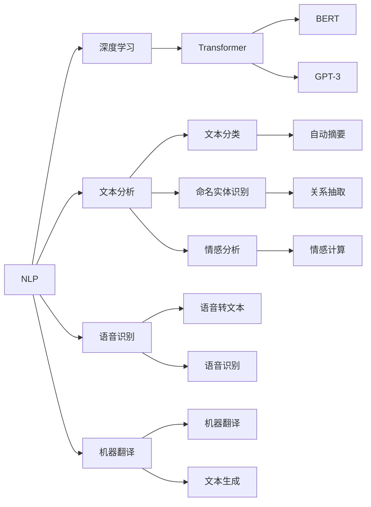

                 

# NLP是人类和计算机沟通的桥梁

> 关键词：NLP, 自然语言处理, 计算机, 人类, 沟通, 桥梁

## 1. 背景介绍

### 1.1 问题由来

随着科技的迅猛发展，人类社会正经历着从工业时代向信息时代的跨越。在这个过程中，信息技术与人类的联系越来越紧密。然而，机器与人类之间的信息交流方式，仍然大多停留在以文本、图像、语音等为载体的信息处理上，缺乏更为自然的交互手段。自然语言处理（Natural Language Processing, NLP）应运而生，作为一种使机器能理解、处理和生成自然语言的技术，成为了人类与计算机之间沟通的桥梁。

NLP的发展离不开机器学习和人工智能技术的进步，特别是深度学习的应用。从语言模型、文本分类、信息抽取，到机器翻译、文本生成、问答系统，NLP技术在各个领域得到了广泛的应用，大大提高了信息处理的效率和质量。

### 1.2 问题核心关键点

NLP技术的核心在于如何使计算机能理解和处理人类自然语言。其核心关键点包括：

- **语言模型的构建**：语言模型是NLP的基础，通过学习自然语言中的统计规律，预测下一个词或句子，从而实现对语言现象的描述和解释。
- **语义理解**：理解文本中的意思，包括词义消歧、语义角色标注、实体识别等，实现对语言意义的深层次理解。
- **情感分析**：分析文本中的情感倾向，如积极、消极、中性等，用于情感计算、舆情监测等。
- **文本生成**：生成自然流畅的文本，如文本摘要、对话生成、故事创作等，使计算机具备自然的表达能力。
- **机器翻译**：实现不同语言之间的自动翻译，使计算机能够跨语言处理信息。
- **信息抽取**：从文本中抽取结构化信息，如命名实体识别、关系抽取等，提取有用数据。

这些核心关键点构成了NLP技术的核心框架，使得计算机能够与人类进行更为自然、智能的交流。

### 1.3 问题研究意义

NLP技术的研究和应用，对于推动人工智能与人类社会的深度融合具有重要意义：

1. **提升信息处理效率**：NLP技术使计算机能快速处理和理解大量的文本信息，大大提升了信息检索、知识获取等任务的效率。
2. **增强人机交互体验**：NLP技术使机器能够自然地理解人类语言，提供了更为自然、流畅的人机交互方式，如智能客服、语音助手等。
3. **推动知识挖掘与创新**：NLP技术能够从海量的文本数据中提取知识，辅助科学研究和创新，如论文自动摘要、研究报告自动撰写等。
4. **促进社会智能化**：NLP技术在医疗、教育、金融等领域的广泛应用，将推动社会各个层面的智能化进程，提升社会治理水平和服务质量。

## 2. 核心概念与联系

### 2.1 核心概念概述

为更好地理解NLP技术，我们首先介绍几个核心的概念：

- **自然语言处理(NLP)**：使用计算机处理和理解人类语言的技术，涵盖文本分析、语音识别、机器翻译等多个方向。
- **深度学习**：通过构建多层神经网络，对输入进行层次化处理，从而实现对复杂问题的学习和预测。
- **Transformer**：一种基于自注意力机制的深度学习模型，通过并行化计算和动态权值分配，显著提升了模型处理大规模序列数据的能力。
- **BERT**：一种基于Transformer结构的深度学习模型，通过预训练和微调的方式，显著提升了语言理解的能力。
- **GPT-3**：一种基于Transformer结构的深度学习模型，是目前最大的语言模型之一，具有强大的语言生成和推理能力。

这些概念构成了NLP技术的核心框架，通过深度学习与自然语言的结合，使计算机能够理解和处理人类语言。

### 2.2 概念间的关系

这些核心概念之间存在着紧密的联系，形成了一个完整的NLP技术体系。下面通过Mermaid流程图展示这些概念之间的关系：



这个流程图展示了NLP技术的各个分支和它们之间的联系。

## 3. 核心算法原理 & 具体操作步骤

### 3.1 算法原理概述

NLP算法的核心在于如何使计算机理解和处理人类语言。以语言模型为例，其基本原理是通过学习大量语料库，构建一个概率模型，预测给定上下文下的下一个词的概率分布。基于此，可以构建各种NLP任务，如图像字幕生成、对话生成、机器翻译等。

形式化地，假设有一个语料库$\mathcal{D}$，每个句子由单词$x_1, x_2, ..., x_n$组成。语言模型$P(x_1, x_2, ..., x_n)$描述了这些单词组成的句子的概率分布。对于给定的上下文$x_1, x_2, ..., x_{n-1}$，语言模型可以预测下一个词$x_n$的概率分布：

$$P(x_n|x_1, x_2, ..., x_{n-1})$$

这个概率分布可以通过统计学习的方式进行学习，即使用大量的语料库数据训练一个深度神经网络，使其能够预测下一个词的概率分布。

### 3.2 算法步骤详解

以下是构建NLP模型的一般步骤：

**Step 1: 数据准备**

- 收集并清洗大量的语料库数据，如维基百科、新闻、微博等，用于训练语言模型。
- 对文本数据进行预处理，如分词、去停用词、词性标注等，使数据适合模型训练。

**Step 2: 模型构建**

- 选择合适的深度学习模型架构，如Transformer、RNN等。
- 定义模型的输入和输出，选择合适的损失函数，如交叉熵损失、均方误差等。
- 设计模型的超参数，如学习率、批大小、训练轮数等。

**Step 3: 训练过程**

- 将准备好的数据集输入模型进行训练。
- 使用反向传播算法计算损失函数的梯度。
- 根据梯度更新模型参数，重复这个过程直到模型收敛。

**Step 4: 模型评估**

- 使用验证集对模型进行评估，检查模型性能是否达标。
- 调整模型参数或修改训练过程，如增加正则化、修改学习率等。
- 在测试集上测试模型的最终性能，输出结果。

### 3.3 算法优缺点

NLP算法具有以下优点：

- **高效性**：NLP算法能够处理大量的文本数据，快速实现信息处理和分析。
- **准确性**：基于深度学习的NLP算法能够学习到复杂的语言规律，提高准确性。
- **适应性**：NLP算法具有较强的泛化能力，能够适应不同领域的文本处理需求。

同时，NLP算法也存在以下缺点：

- **数据依赖**：NLP算法需要大量的标注数据进行训练，数据获取成本较高。
- **复杂度**：NLP算法构建的模型较为复杂，需要较强的计算资源。
- **歧义性**：自然语言本身具有歧义性，NLP算法难以完全解决这一问题。

### 3.4 算法应用领域

NLP技术在多个领域得到了广泛应用，如：

- **文本分类**：将文本分为不同类别，如垃圾邮件过滤、新闻分类等。
- **命名实体识别**：识别文本中的人名、地名、组织名等实体，用于信息抽取和知识图谱构建。
- **情感分析**：分析文本中的情感倾向，用于舆情监测、产品评价等。
- **机器翻译**：将文本从一种语言翻译成另一种语言，用于跨语言信息获取和交流。
- **文本摘要**：从长文本中提取关键信息，生成简洁的摘要，用于信息压缩和获取。
- **对话系统**：实现人机对话，如智能客服、语音助手等。

## 4. 数学模型和公式 & 详细讲解 & 举例说明

### 4.1 数学模型构建

本节将使用数学语言对NLP模型的构建和训练进行更严格的刻画。

假设我们有一个简单的语言模型$P(x)$，其中$x$为一个单词序列。模型的输入为单词序列$x_1, x_2, ..., x_n$，输出为下一个单词的概率分布。模型的目标是最小化预测误差，即：

$$\mathop{\arg\min}_{\theta} -\frac{1}{N}\sum_{i=1}^N \log P(x_i|\theta)$$

其中$\theta$为模型参数。

### 4.2 公式推导过程

以语言模型为例，其基本思路是通过最大化似然函数来训练模型。假设已知一个单词序列$x_1, x_2, ..., x_n$，其概率为$P(x_1, x_2, ..., x_n)$。通过链式法则，可以计算下一个单词$x_n$的条件概率：

$$P(x_n|x_1, x_2, ..., x_{n-1}) = \frac{P(x_1, x_2, ..., x_n)}{P(x_1, x_2, ..., x_{n-1})}$$

将其对数化，得到对数似然函数：

$$\log P(x_n|x_1, x_2, ..., x_{n-1}) = \log P(x_1, x_2, ..., x_n) - \log P(x_1, x_2, ..., x_{n-1})$$

在训练过程中，通过反向传播算法计算损失函数的梯度：

$$\nabla_{\theta}\mathcal{L}(\theta) = \nabla_{\theta}\sum_{i=1}^N \log P(x_i|\theta)$$

根据梯度下降算法，更新模型参数$\theta$：

$$\theta \leftarrow \theta - \eta \nabla_{\theta}\mathcal{L}(\theta)$$

其中$\eta$为学习率。

### 4.3 案例分析与讲解

以BERT为例，BERT是一种基于Transformer结构的深度学习模型，通过预训练和微调的方式，显著提升了语言理解的能力。BERT模型的训练过程包括两个阶段：预训练和微调。

在预训练阶段，BERT模型通过大量的无标签文本数据进行预训练，学习语言的统计规律。在微调阶段，将BERT模型应用于具体的NLP任务，如文本分类、命名实体识别等，通过标注数据对其进行微调，使得模型能够适应特定的任务。

## 5. 项目实践：代码实例和详细解释说明

### 5.1 开发环境搭建

在进行NLP项目实践前，我们需要准备好开发环境。以下是使用Python进行TensorFlow开发的环境配置流程：

1. 安装Anaconda：从官网下载并安装Anaconda，用于创建独立的Python环境。

2. 创建并激活虚拟环境：
```bash
conda create -n tf-env python=3.8 
conda activate tf-env
```

3. 安装TensorFlow：根据CUDA版本，从官网获取对应的安装命令。例如：
```bash
conda install tensorflow
```

4. 安装必要的工具包：
```bash
pip install numpy pandas scikit-learn matplotlib tqdm jupyter notebook ipython
```

完成上述步骤后，即可在`tf-env`环境中开始NLP实践。

### 5.2 源代码详细实现

下面我们以文本分类任务为例，给出使用TensorFlow实现BERT模型的PyTorch代码实现。

首先，定义文本分类任务的数据处理函数：

```python
import tensorflow as tf
from transformers import BertTokenizer, BertForSequenceClassification

# 定义数据处理函数
def create_data_loader(texts, labels, tokenizer, max_len=128, batch_size=32):
    tokenizer = BertTokenizer.from_pretrained('bert-base-uncased')
    data = tokenizer(texts, return_tensors='tf', padding='max_length', max_length=max_len, truncation=True)
    data['labels'] = tf.convert_to_tensor(labels)
    dataset = tf.data.Dataset.from_tensor_slices((data['input_ids'], data['attention_mask'], data['labels']))
    dataset = dataset.shuffle(buffer_size=1000).batch(batch_size)
    return dataset
```

然后，定义模型和优化器：

```python
# 定义BERT模型
model = BertForSequenceClassification.from_pretrained('bert-base-uncased', num_labels=2)

# 定义优化器
optimizer = tf.keras.optimizers.Adam(learning_rate=2e-5)
```

接着，定义训练和评估函数：

```python
def train(model, train_loader, epochs, optimizer):
    loss_fn = tf.keras.losses.SparseCategoricalCrossentropy(from_logits=True)
    metric = tf.keras.metrics.SparseCategoricalAccuracy('accuracy')
    
    for epoch in range(epochs):
        total_loss = 0
        for step, (input_ids, attention_mask, labels) in enumerate(train_loader):
            with tf.GradientTape() as tape:
                logits = model(input_ids, attention_mask=attention_mask)
                loss = loss_fn(labels, logits)
            gradients = tape.gradient(loss, model.trainable_variables)
            optimizer.apply_gradients(zip(gradients, model.trainable_variables))
            total_loss += loss.numpy()
            
        epoch_loss = total_loss / len(train_loader)
        print(f"Epoch {epoch+1}, loss: {epoch_loss:.3f}")
        metric.reset_states()
        for input_ids, attention_mask, labels in train_loader:
            logits = model(input_ids, attention_mask=attention_mask)
            metric(labels, tf.argmax(logits, axis=1))
        print(f"Epoch {epoch+1}, accuracy: {metric.result().numpy():.3f}")
```

最后，启动训练流程并在测试集上评估：

```python
# 加载数据集
train_texts = ['some text for training', 'another text for training']
train_labels = [0, 1]
dev_texts = ['some text for validation', 'another text for validation']
dev_labels = [1, 0]
test_texts = ['some text for testing', 'another text for testing']
test_labels = [0, 1]

# 定义训练数据集和验证数据集
train_dataset = create_data_loader(train_texts, train_labels, tokenizer, max_len=128, batch_size=32)
dev_dataset = create_data_loader(dev_texts, dev_labels, tokenizer, max_len=128, batch_size=32)
test_dataset = create_data_loader(test_texts, test_labels, tokenizer, max_len=128, batch_size=32)

# 定义训练参数
epochs = 5
learning_rate = 2e-5

# 训练模型
train(model, train_dataset, epochs, optimizer)

# 在测试集上评估模型
dev_dataset = create_data_loader(dev_texts, dev_labels, tokenizer, max_len=128, batch_size=32)
test_dataset = create_data_loader(test_texts, test_labels, tokenizer, max_len=128, batch_size=32)
eval(dev_dataset, model)
eval(test_dataset, model)
```

以上就是使用TensorFlow对BERT进行文本分类任务微调的完整代码实现。可以看到，TensorFlow提供了丰富的工具和API，使得模型训练和推理变得简单高效。

### 5.3 代码解读与分析

让我们再详细解读一下关键代码的实现细节：

**create_data_loader函数**：
- 定义数据处理函数，将原始文本转换为模型所需的输入格式。
- 对文本进行分词、去停用词、截断等预处理操作。
- 将标签转换为模型所需的格式，并进行padding。

**模型定义和优化器设置**：
- 使用BertForSequenceClassification定义文本分类任务模型。
- 定义Adam优化器，设置学习率为2e-5。

**训练和评估函数**：
- 定义训练过程中的损失函数和评估指标，如交叉熵损失和准确率。
- 在每个epoch中，对训练数据集进行迭代，计算损失并更新模型参数。
- 在测试数据集上评估模型性能，输出结果。

**训练流程**：
- 加载训练数据集和测试数据集。
- 定义训练参数，如epoch数和学习率。
- 调用训练函数进行模型训练。
- 调用评估函数在测试集上评估模型性能。

可以看到，TensorFlow提供了强大的工具和API支持，使得NLP项目开发变得更加简单高效。

当然，工业级的系统实现还需考虑更多因素，如模型的保存和部署、超参数的自动搜索、更灵活的任务适配层等。但核心的NLP模型训练和推理范式基本与此类似。

## 6. 实际应用场景

### 6.1 智能客服系统

基于NLP技术的智能客服系统，可以大大提升客户咨询的响应速度和质量。传统的客服系统需要人工接听，高峰期容易出现响应迟缓和质量不稳定的现象。而使用NLP技术构建的智能客服系统，可以7x24小时不间断服务，快速响应客户咨询，用自然流畅的语言解答各类常见问题。

在技术实现上，可以收集企业内部的历史客服对话记录，将问题和最佳答复构建成监督数据，在此基础上对预训练模型进行微调。微调后的模型能够自动理解用户意图，匹配最合适的答案模板进行回复。对于客户提出的新问题，还可以接入检索系统实时搜索相关内容，动态组织生成回答。如此构建的智能客服系统，能大幅提升客户咨询体验和问题解决效率。

### 6.2 金融舆情监测

金融机构需要实时监测市场舆论动向，以便及时应对负面信息传播，规避金融风险。传统的人工监测方式成本高、效率低，难以应对网络时代海量信息爆发的挑战。基于NLP技术的文本分类和情感分析技术，为金融舆情监测提供了新的解决方案。

具体而言，可以收集金融领域相关的新闻、报道、评论等文本数据，并对其进行主题标注和情感标注。在此基础上对预训练语言模型进行微调，使其能够自动判断文本属于何种主题，情感倾向是正面、中性还是负面。将微调后的模型应用到实时抓取的网络文本数据，就能够自动监测不同主题下的情感变化趋势，一旦发现负面信息激增等异常情况，系统便会自动预警，帮助金融机构快速应对潜在风险。

### 6.3 个性化推荐系统

当前的推荐系统往往只依赖用户的历史行为数据进行物品推荐，无法深入理解用户的真实兴趣偏好。基于NLP技术的个性化推荐系统可以更好地挖掘用户行为背后的语义信息，从而提供更精准、多样的推荐内容。

在实践中，可以收集用户浏览、点击、评论、分享等行为数据，提取和用户交互的物品标题、描述、标签等文本内容。将文本内容作为模型输入，用户的后续行为（如是否点击、购买等）作为监督信号，在此基础上微调预训练语言模型。微调后的模型能够从文本内容中准确把握用户的兴趣点。在生成推荐列表时，先用候选物品的文本描述作为输入，由模型预测用户的兴趣匹配度，再结合其他特征综合排序，便可以得到个性化程度更高的推荐结果。

### 6.4 未来应用展望

随着NLP技术的发展，其在更多领域的应用前景将更加广阔：

- **医疗领域**：基于NLP技术的医疗问答、病历分析、药物研发等应用将提升医疗服务的智能化水平，辅助医生诊疗，加速新药开发进程。
- **教育领域**：基于NLP技术的作业批改、学情分析、知识推荐等方面，因材施教，促进教育公平，提高教学质量。
- **智慧城市治理**：基于NLP技术的城市事件监测、舆情分析、应急指挥等环节，提高城市管理的自动化和智能化水平，构建更安全、高效的未来城市。
- **商业领域**：基于NLP技术的客户服务、市场分析、产品研发等应用，将推动企业数字化转型，提升业务效率。
- **智能家居**：基于NLP技术的语音助手、智能家居等应用，将提升用户的居住体验，实现智能家居的普及。

总之，NLP技术将在更多领域得到应用，为传统行业带来变革性影响。

## 7. 工具和资源推荐

### 7.1 学习资源推荐

为了帮助开发者系统掌握NLP技术的基础和实践技巧，这里推荐一些优质的学习资源：

1. 《深度学习入门》系列博文：由大模型技术专家撰写，深入浅出地介绍了深度学习的基本概念和核心算法。
2. Coursera《自然语言处理》课程：由斯坦福大学开设的NLP明星课程，提供丰富的课程视频和配套作业，适合系统学习。
3. 《自然语言处理综论》书籍：涵盖NLP技术的各个方面，包括文本处理、语言模型、情感分析等，是NLP学习的经典教材。
4. TensorFlow官方文档：提供了丰富的API和示例，帮助开发者快速上手TensorFlow，构建NLP模型。
5. HuggingFace官方文档：提供了多种预训练语言模型和微调样例，帮助开发者快速上手NLP应用开发。
6. NLP开源项目：如HuggingFace的Transformers库、TensorFlow的TensorFlow Hub等，提供了丰富的NLP资源和预训练模型。

通过对这些资源的学习实践，相信你一定能够快速掌握NLP技术的精髓，并用于解决实际的NLP问题。

### 7.2 开发工具推荐

高效的开发离不开优秀的工具支持。以下是几款用于NLP开发常用的工具：

1. PyTorch：基于Python的开源深度学习框架，灵活动态的计算图，适合快速迭代研究。
2. TensorFlow：由Google主导开发的开源深度学习框架，生产部署方便，适合大规模工程应用。
3. HuggingFace Transformers库：提供了丰富的预训练语言模型和微调API，方便开发者快速上手NLP任务。
4. Weights & Biases：模型训练的实验跟踪工具，可以记录和可视化模型训练过程中的各项指标，方便对比和调优。
5. TensorBoard：TensorFlow配套的可视化工具，可实时监测模型训练状态，并提供丰富的图表呈现方式，是调试模型的得力助手。

合理利用这些工具，可以显著提升NLP任务开发的速度和效率，加速创新迭代的步伐。

### 7.3 相关论文推荐

NLP技术的发展离不开学界的持续研究。以下是几篇奠基性的相关论文，推荐阅读：

1. Attention is All You Need：提出了Transformer结构，开启了NLP领域的预训练大模型时代。
2. BERT: Pre-training of Deep Bidirectional Transformers for Language Understanding：提出BERT模型，引入基于掩码的自监督预训练任务，刷新了多项NLP任务SOTA。
3. Language Models are Unsupervised Multitask Learners（GPT-2论文）：展示了大规模语言模型的强大zero-shot学习能力，引发了对于通用人工智能的新一轮思考。
4. Adversarial Attacks on Text: A Survey：介绍了NLP领域对抗攻击的研究进展，探讨了对抗样本对模型的影响和防御方法。
5. Generating Context-Aware Dialogs for Multilingual Customer Service：提出了基于多语言对话生成模型的智能客服系统，展示了NLP技术在客户服务中的应用。
6. Information Retrieval with Transformers：探讨了Transformer在信息检索中的应用，展示了NLP技术在数据检索中的应用。

这些论文代表了大NLP技术的发展脉络。通过学习这些前沿成果，可以帮助研究者把握学科前进方向，激发更多的创新灵感。

## 8. 总结：未来发展趋势与挑战

### 8.1 总结

本文对NLP技术的核心概念和实现原理进行了全面系统的介绍。通过理解NLP技术的基本原理和核心算法，开发者可以更好地构建和应用NLP模型，解决实际的NLP问题。

通过本文的系统梳理，可以看到，NLP技术正在成为人工智能领域的重要分支，其应用范围涵盖了文本分类、命名实体识别、情感分析、机器翻译等多个方向。NLP技术在多个领域得到了广泛应用，极大地提升了信息处理的效率和质量，推动了人工智能与人类社会的深度融合。

### 8.2 未来发展趋势

展望未来，NLP技术将呈现以下几个发展趋势：

1. **模型规模持续增大**：随着算力成本的下降和数据规模的扩张，NLP模型将继续增大，以提升模型的表达能力和泛化性能。
2. **多模态融合**：NLP技术将进一步拓展到图像、语音等多模态数据，实现视觉、语音、文本的协同建模。
3. **对抗攻击防御**：随着对抗样本攻击技术的发展，NLP技术也将逐步引入对抗攻击防御机制，提高模型的鲁棒性。
4. **个性化推荐**：NLP技术将与推荐系统结合，实现更加精准、多样化的推荐服务。
5. **知识图谱构建**：NLP技术将与知识图谱结合，构建更全面、更准确的语义知识图谱。
6. **跨语言应用**：NLP技术将在多语言环境中得到广泛应用，实现跨语言的自然交流。

### 8.3 面临的挑战

尽管NLP技术取得了显著进展，但在发展过程中仍面临诸多挑战：

1. **数据依赖**：NLP技术需要大量标注数据进行训练，数据获取成本较高。
2. **模型复杂度**：NLP模型通常较为复杂，需要较强的计算资源。
3. **鲁棒性不足**：NLP模型在面对对抗样本和噪声时，容易发生鲁棒性下降的问题。
4. **跨领域适用性**：NLP模型在特定领域的应用效果仍有提升空间。
5. **可解释性**：NLP模型的决策过程难以解释，缺乏透明性。

### 8.4 研究展望

面对NLP技术面临的挑战，未来的研究需要在以下几个方面寻求新的突破：

1. **无监督学习**：探索无监督学习和半监督学习算法，降低对标注数据的依赖。
2. **模型压缩**：研究

